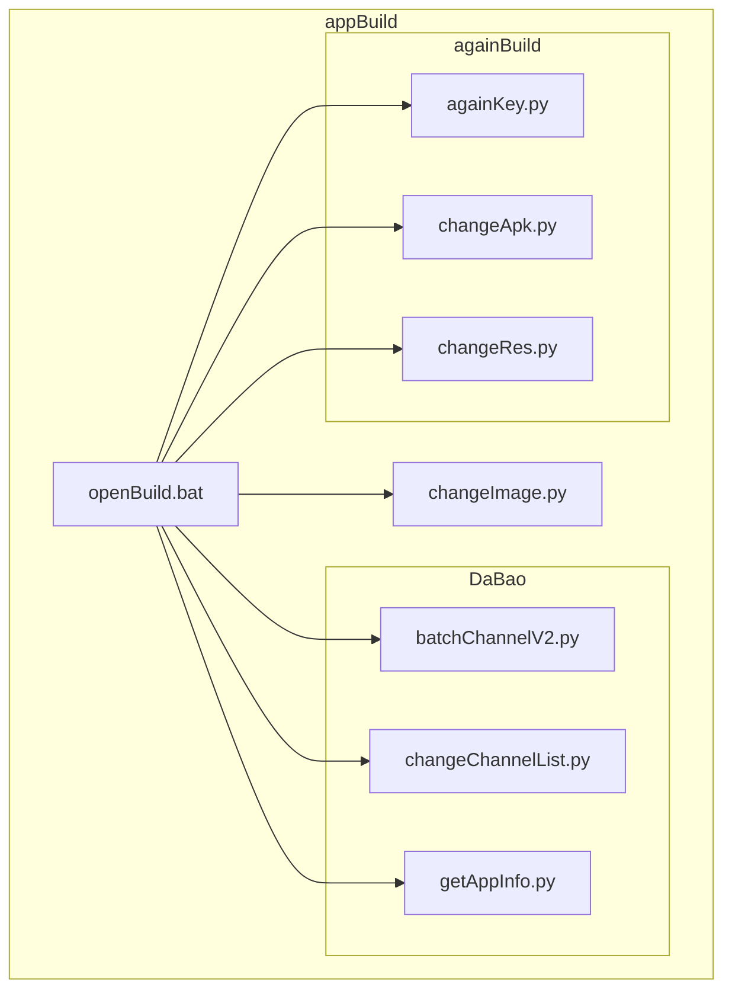
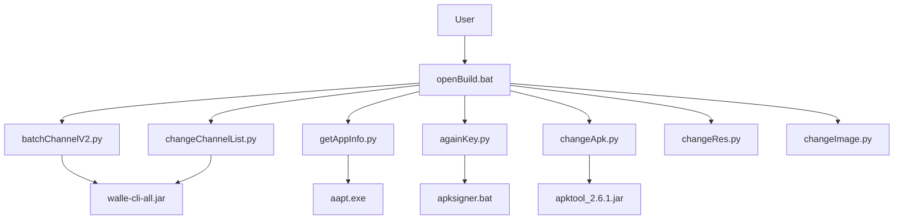
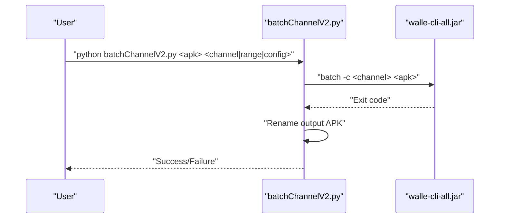
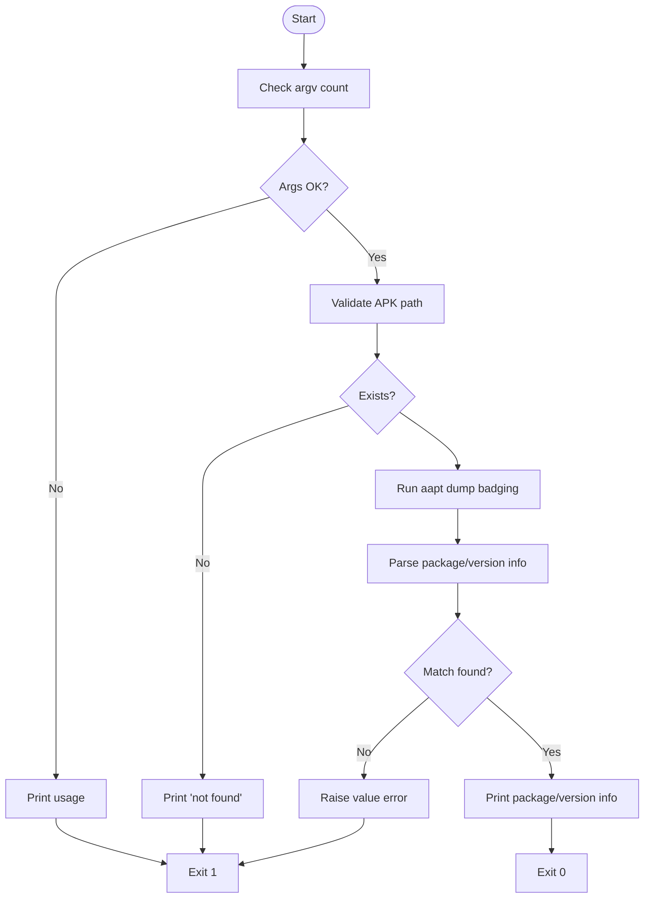
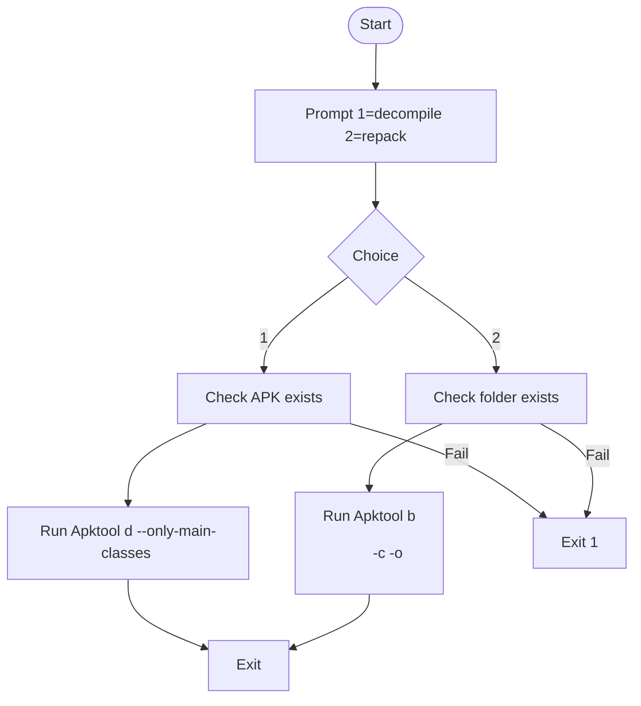
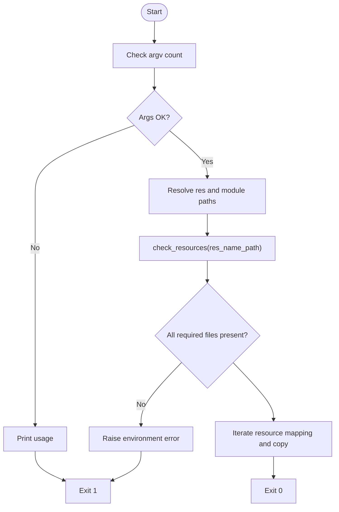
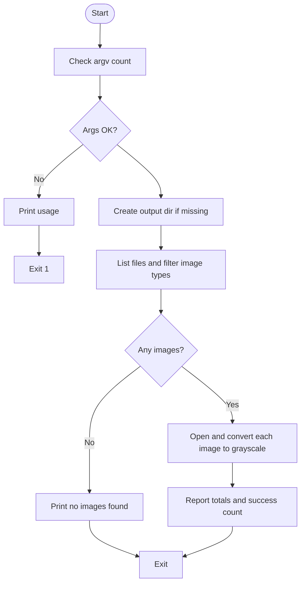
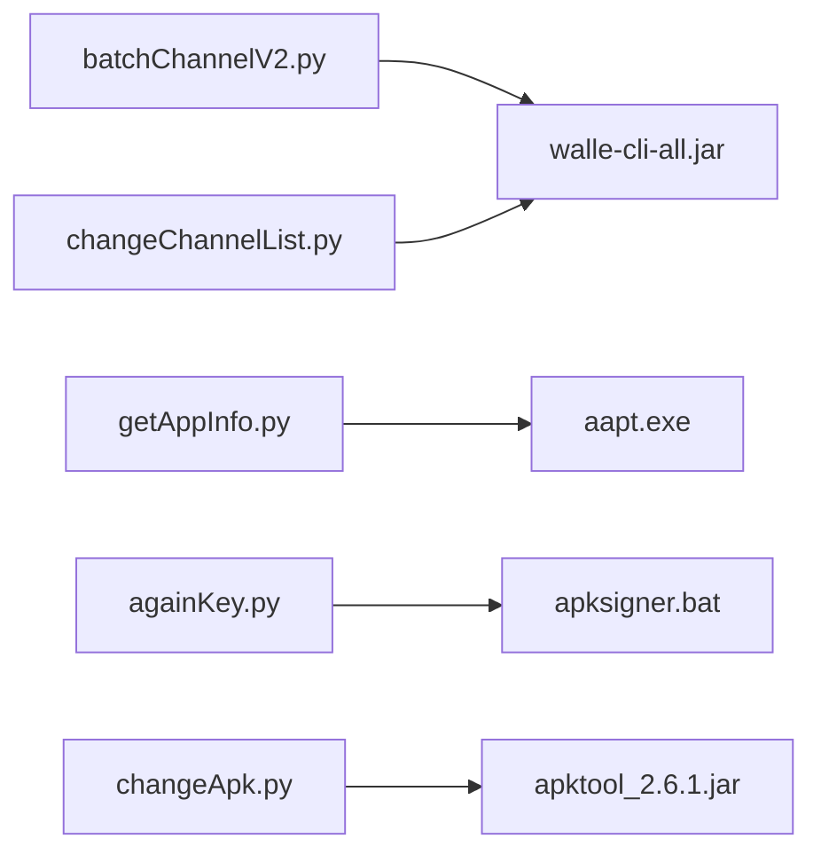

# APK Build and Modification Tools

<cite>
**Referenced Files in This Document**
- [batchChannelV2.py](file://appBuild/DaBao/batchChannelV2.py)
- [changeChannelList.py](file://appBuild/DaBao/changeChannelList.py)
- [getAppInfo.py](file://appBuild/DaBao/getAppInfo.py)
- [againKey.py](file://appBuild/againBuild/againKey.py)
- [changeApk.py](file://appBuild/againBuild/changeApk.py)
- [changeRes.py](file://appBuild/againBuild/changeRes.py)
- [changeImage.py](file://appBuild/changeImage.py)
- [openBuild.bat](file://appBuild/openBuild.bat)
- [README.md](file://README.md)
</cite>

## Table of Contents
1. [Introduction](#introduction)
2. [Project Structure](#project-structure)
3. [Core Components](#core-components)
4. [Architecture Overview](#architecture-overview)
5. [Detailed Component Analysis](#detailed-component-analysis)
6. [Dependency Analysis](#dependency-analysis)
7. [Performance Considerations](#performance-considerations)
8. [Security Considerations](#security-considerations)
9. [Troubleshooting Guide](#troubleshooting-guide)
10. [Practical Examples](#practical-examples)
11. [Extensibility and Customization](#extensibility-and-customization)
12. [Conclusion](#conclusion)

## Introduction
This document describes the APK build and modification tools included in the repository. It covers:
- Channel package generation using Walle
- APK re-signing with configurable keystores
- Resource replacement inside an unpacked app
- APK decompilation and repackaging
- Batch image conversion to grayscale
- Utility scripts and command-line interfaces
- Security considerations, troubleshooting, and customization guidance

These tools are designed to streamline Android build workflows, support batch operations, and integrate with CI environments.

## Project Structure
The build tools are organized under appBuild with two primary modules:
- appBuild/DaBao: Channel packaging and APK metadata inspection
- appBuild/againBuild: Re-signing, decompile/repack, and resource replacement
- appBuild/changeImage.py: Batch grayscale image conversion
- appBuild/openBuild.bat: Menu-driven launcher for the tools

**Diagram sources**
- [openBuild.bat:1-23](file://appBuild/openBuild.bat#L1-L23)
- [batchChannelV2.py:1-120](file://appBuild/DaBao/batchChannelV2.py#L1-L120)
- [changeChannelList.py:1-91](file://appBuild/DaBao/changeChannelList.py#L1-L91)
- [getAppInfo.py:1-58](file://appBuild/DaBao/getAppInfo.py#L1-L58)
- [againKey.py:1-168](file://appBuild/againBuild/againKey.py#L1-L168)
- [changeApk.py:1-39](file://appBuild/againBuild/changeApk.py#L1-L39)
- [changeRes.py:1-72](file://appBuild/againBuild/changeRes.py#L1-L72)
- [changeImage.py:1-53](file://appBuild/changeImage.py#L1-L53)

**Section sources**
- [README.md:1-37](file://README.md#L1-L37)
- [openBuild.bat:1-23](file://appBuild/openBuild.bat#L1-L23)

## Core Components
- Channel Packaging (Walle-based)
  - batchChannelV2.py: Single/multi-channel, sequence, and config-file driven packaging with automatic renaming
  - changeChannelList.py: Automated batch packaging with channel lists mapped by app prefixes and default fallback
- APK Signing and Verification
  - againKey.py: Multi-keystore signing with apksigner, verification, and CLI options
- APK Decompile/Repack
  - changeApk.py: Interactive decompile and repack via Apktool
- Resource Replacement
  - changeRes.py: Validates and replaces launcher icons, splash, and module assets
- Image Processing
  - changeImage.py: Converts images in a folder to grayscale with progress reporting

**Section sources**
- [batchChannelV2.py:1-120](file://appBuild/DaBao/batchChannelV2.py#L1-L120)
- [changeChannelList.py:1-91](file://appBuild/DaBao/changeChannelList.py#L1-L91)
- [againKey.py:1-168](file://appBuild/againBuild/againKey.py#L1-L168)
- [changeApk.py:1-39](file://appBuild/againBuild/changeApk.py#L1-L39)
- [changeRes.py:1-72](file://appBuild/againBuild/changeRes.py#L1-L72)
- [changeImage.py:1-53](file://appBuild/changeImage.py#L1-L53)

## Architecture Overview
The tools are standalone Python scripts orchestrated by a Windows batch launcher. They rely on external binaries:
- Walle CLI for channel packaging
- Android SDK apksigner for signing
- AAPT for APK metadata extraction
- Apktool for decompile/repack

**Diagram sources**
- [openBuild.bat:1-23](file://appBuild/openBuild.bat#L1-L23)
- [batchChannelV2.py:18](file://appBuild/DaBao/batchChannelV2.py#L18)
- [changeChannelList.py:13](file://appBuild/DaBao/changeChannelList.py#L13)
- [getAppInfo.py:12](file://appBuild/DaBao/getAppInfo.py#L12)
- [againKey.py:42](file://appBuild/againBuild/againKey.py#L42)
- [changeApk.py:7](file://appBuild/againBuild/changeApk.py#L7)

## Detailed Component Analysis

### Channel Packaging with Walle
- batchChannelV2.py
  - Supports:
    - Show channel info
    - Single channel
    - Multiple comma-separated channels
    - Numeric sequence channels with prefix and range
    - Config-file mode with one channel per line
  - Uses subprocess to invoke java -jar walle-cli-all.jar with appropriate arguments
  - Automatically renames generated APKs to a normalized format
- changeChannelList.py
  - Selects channel list based on app name prefix or defaults
  - Builds channels into a dated output directory
  - Renames output APKs after packaging

**Diagram sources**
- [batchChannelV2.py:21-69](file://appBuild/DaBao/batchChannelV2.py#L21-L69)

**Section sources**
- [batchChannelV2.py:1-120](file://appBuild/DaBao/batchChannelV2.py#L1-L120)
- [changeChannelList.py:1-91](file://appBuild/DaBao/changeChannelList.py#L1-L91)

### APK Information Extraction
- getAppInfo.py
  - Invokes aapt.exe dump badging on the target APK
  - Parses package name, version code, and version name
  - Raises explicit errors on failures

**Diagram sources**
- [getAppInfo.py:16-32](file://appBuild/DaBao/getAppInfo.py#L16-L32)

**Section sources**
- [getAppInfo.py:1-58](file://appBuild/DaBao/getAppInfo.py#L1-L58)

### APK Re-Signing with Multiple Keystores
- againKey.py
  - CLI supports input APK, output APK, keystore selection (enum), and SDK path override
  - Predefined keystore configs for SLP and RBP
  - Validates input file and SDK path
  - Builds and executes apksigner sign command
  - Verifies signature with apksigner verify
  - Robust error handling for file not found, runtime errors, and unexpected exceptions

```mermaid
sequenceDiagram
participant U as "User"
participant AK as "againKey.py"
participant KS as "Keystore Config"
participant AS as "apksigner.bat"
U->>AK : "againKey.py input.apk output.apk [--keystore] [--sdk-path]"
AK->>AK : "validate_file_exists(input)"
AK->>AK : "validate_sdk_path(sdk)"
AK->>KS : "resolve keystore by type"
AK->>AS : "sign --ks <path> --ks-pass pass : <pwd> --out <output> <input>"
AS-->>AK : "Exit code"
AK->>AS : "verify -v <output>"
AS-->>AK : "Exit code"
AK-->>U : "Success/Failure"
```

**Diagram sources**
- [againKey.py:58-96](file://appBuild/againBuild/againKey.py#L58-L96)

**Section sources**
- [againKey.py:1-168](file://appBuild/againBuild/againKey.py#L1-L168)

### APK Decompile and Repack
- changeApk.py
  - Prompts user to choose decompile or repack
  - Uses Apktool to decompile with only main classes
  - Repacks with Apktool and writes output APK
  - Validates existence of target file/folder before operation

**Diagram sources**
- [changeApk.py:10-34](file://appBuild/againBuild/changeApk.py#L10-L34)

**Section sources**
- [changeApk.py:1-39](file://appBuild/againBuild/changeApk.py#L1-L39)

### Resource Replacement
- changeRes.py
  - Validates presence of required resource files in a given directory
  - Copies specific files to predefined destination paths inside the app resources
  - Logs each copy operation and reports errors if validation fails

**Diagram sources**
- [changeRes.py:10-67](file://appBuild/againBuild/changeRes.py#L10-L67)

**Section sources**
- [changeRes.py:1-72](file://appBuild/againBuild/changeRes.py#L1-L72)

### Batch Image Grayscale Conversion
- changeImage.py
  - Accepts input and output directories
  - Creates output directory if missing
  - Iterates supported image files, converts to grayscale, and saves with quality
  - Reports totals and successes/failures

**Diagram sources**
- [changeImage.py:6-48](file://appBuild/changeImage.py#L6-L48)

**Section sources**
- [changeImage.py:1-53](file://appBuild/changeImage.py#L1-L53)

## Dependency Analysis
- External binaries
  - Walle CLI: invoked by channel packaging scripts
  - Android SDK apksigner: invoked by re-signing script
  - AAPT: invoked by APK info script
  - Apktool: invoked by decompile/repack script
- Internal dependencies
  - batchChannelV2.py and changeChannelList.py both depend on WALLE_JAR
  - againKey.py depends on DEFAULT_SDK_PATH and keystore configs
  - changeApk.py depends on APKTOOL constant
- Coupling
  - Scripts are loosely coupled; each invokes external tools via subprocess
  - Minimal shared logic reduces cross-script coupling

**Diagram sources**
- [batchChannelV2.py:18](file://appBuild/DaBao/batchChannelV2.py#L18)
- [changeChannelList.py:13](file://appBuild/DaBao/changeChannelList.py#L13)
- [getAppInfo.py:12](file://appBuild/DaBao/getAppInfo.py#L12)
- [againKey.py:42](file://appBuild/againBuild/againKey.py#L42)
- [changeApk.py:7](file://appBuild/againBuild/changeApk.py#L7)

**Section sources**
- [batchChannelV2.py:18](file://appBuild/DaBao/batchChannelV2.py#L18)
- [changeChannelList.py:13](file://appBuild/DaBao/changeChannelList.py#L13)
- [getAppInfo.py:12](file://appBuild/DaBao/getAppInfo.py#L12)
- [againKey.py:42](file://appBuild/againBuild/againKey.py#L42)
- [changeApk.py:7](file://appBuild/againBuild/changeApk.py#L7)

## Performance Considerations
- Channel packaging
  - Walle batch operations are efficient; avoid excessive concurrency to prevent disk contention
  - Use config-file mode for very large channel lists to reduce repeated process startup overhead
- Re-signing
  - apksigner is fast; ensure output directory exists beforehand to avoid repeated checks
- Decompilation/repackaging
  - Large apps take significant time; consider running on SSD and ensuring adequate memory for Apktool
- Resource replacement
  - Copy operations are I/O bound; validate required files once before looping
- Image conversion
  - PIL conversion is CPU-bound; process in batches if converting large directories

## Security Considerations
- Keystore management
  - Store keystores in secure locations and restrict filesystem permissions
  - Avoid hardcoding secrets; consider environment variables or secure secret managers
  - Limit access to signing scripts and binaries
- Binary integrity
  - Verify checksums of external tools (Walle, Apktool, SDK) before use
- Input validation
  - Always validate file existence and paths before invoking external tools
- Least privilege
  - Run scripts with least privileges required; avoid administrative rights when unnecessary

## Troubleshooting Guide
- Walle CLI not found
  - Ensure walle-cli-all.jar is present in the working directory or adjust script constants accordingly
- apksigner not found
  - Verify SDK path and that apksigner.bat exists at the configured location
- AAPT failure
  - Confirm aapt.exe path and that the APK exists and is readable
- Apktool errors
  - Check that the target APK exists for decompile or that the output directory exists for repack
- Resource validation failures
  - Ensure all required resource files are present in the provided directory
- Image conversion failures
  - Verify input directory contains supported image formats and output directory is writable

**Section sources**
- [batchChannelV2.py:18](file://appBuild/DaBao/batchChannelV2.py#L18)
- [againKey.py:42](file://appBuild/againBuild/againKey.py#L42)
- [getAppInfo.py:12](file://appBuild/DaBao/getAppInfo.py#L12)
- [changeApk.py:7](file://appBuild/againBuild/changeApk.py#L7)
- [changeRes.py:10-23](file://appBuild/againBuild/changeRes.py#L10-L23)
- [changeImage.py:6-48](file://appBuild/changeImage.py#L6-L48)

## Practical Examples
- Batch channel packaging with Walle
  - Show channels: python batchChannelV2.py show <apk>
  - Single channel: python batchChannelV2.py <apk> <channel>
  - Multiple channels: python batchChannelV2.py <apk> <ch1,ch2,ch3>
  - Numeric sequence: python batchChannelV2.py <apk> <prefix> <start> <end>
  - From config file: python batchChannelV2.py <apk> -f <config_file>
- APK re-signing with multiple keystores
  - Default keystore: python againKey.py input.apk signed-output.apk
  - Specify keystore: python againKey.py input.apk signed-output.apk --keystore rbp
  - Override SDK path: python againKey.py input.apk signed-output.apk --sdk-path /path/to/apksigner
- Resource file manipulation
  - Replace resources: python changeRes.py <res_path> <res_name_path>
  - Ensure all required files are present before running
- APK decompile and repack
  - Deconstruct: python changeApk.py <apk>
  - Rebuild: python changeApk.py <dir>
- Batch image grayscale conversion
  - Convert images: python changeImage.py <input_dir> <output_dir>

**Section sources**
- [batchChannelV2.py:6-12](file://appBuild/DaBao/batchChannelV2.py#L6-L12)
- [againKey.py:104-109](file://appBuild/againBuild/againKey.py#L104-L109)
- [changeRes.py:34-36](file://appBuild/againBuild/changeRes.py#L34-L36)
- [changeApk.py:11-13](file://appBuild/againBuild/changeApk.py#L11-L13)
- [changeImage.py:8-10](file://appBuild/changeImage.py#L8-L10)

## Extensibility and Customization
- Add new keystore profiles
  - Extend the keystore type enum and add entries to the keystore configs dictionary
  - Update CLI help text and defaults as needed
- Customize channel lists
  - Modify channel mapping logic or add new prefixes in the channel list script
- External tool paths
  - Adjust constants for Walle, Apktool, AAPT, and apksigner to match local installations
- Automation hooks
  - Integrate with CI by invoking scripts from pipeline steps
  - Add logging and exit code handling for automated runs
- Validation enhancements
  - Add checksum verification for downloaded tools
  - Implement dry-run modes for destructive operations

**Section sources**
- [againKey.py:16-39](file://appBuild/againBuild/againKey.py#L16-L39)
- [changeChannelList.py:16-28](file://appBuild/DaBao/changeChannelList.py#L16-L28)
- [batchChannelV2.py:18](file://appBuild/DaBao/batchChannelV2.py#L18)
- [changeApk.py:7](file://appBuild/againBuild/changeApk.py#L7)
- [getAppInfo.py:12](file://appBuild/DaBao/getAppInfo.py#L12)
- [againKey.py:42](file://appBuild/againBuild/againKey.py#L42)

## Conclusion
The repository provides a focused set of tools for Android build and modification tasks:
- Channel packaging with Walle
- APK re-signing with multiple keystores
- APK decompile/repack with Apktool
- Resource replacement and image processing
- A convenient Windows launcher to access these tools

By following the security and troubleshooting guidance, and leveraging the customization tips, teams can integrate these utilities into CI/CD pipelines and streamline their Android release workflows.