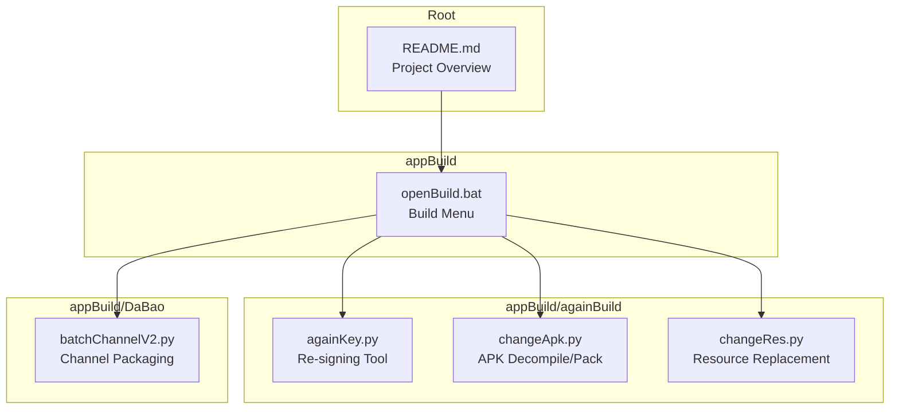
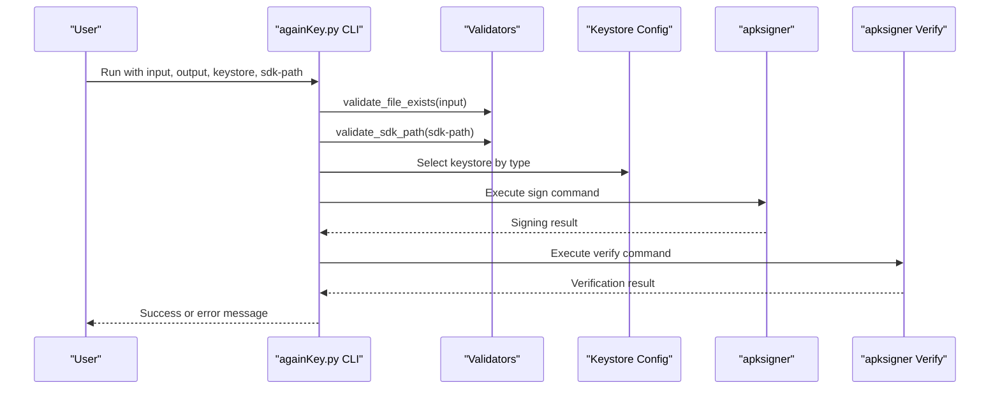
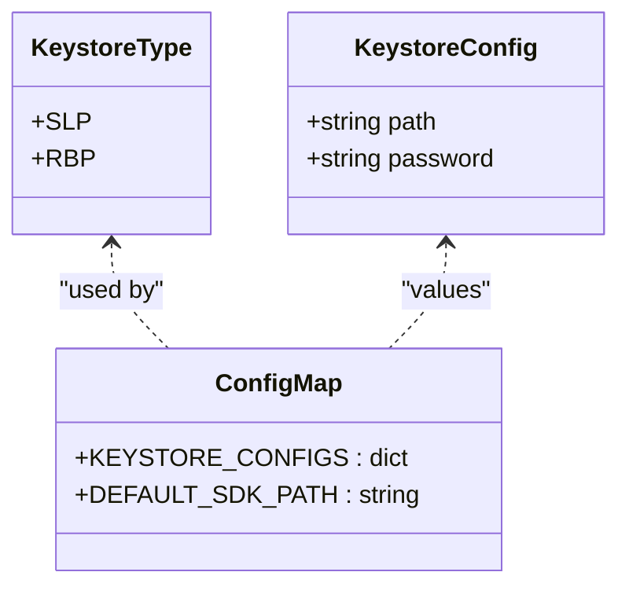
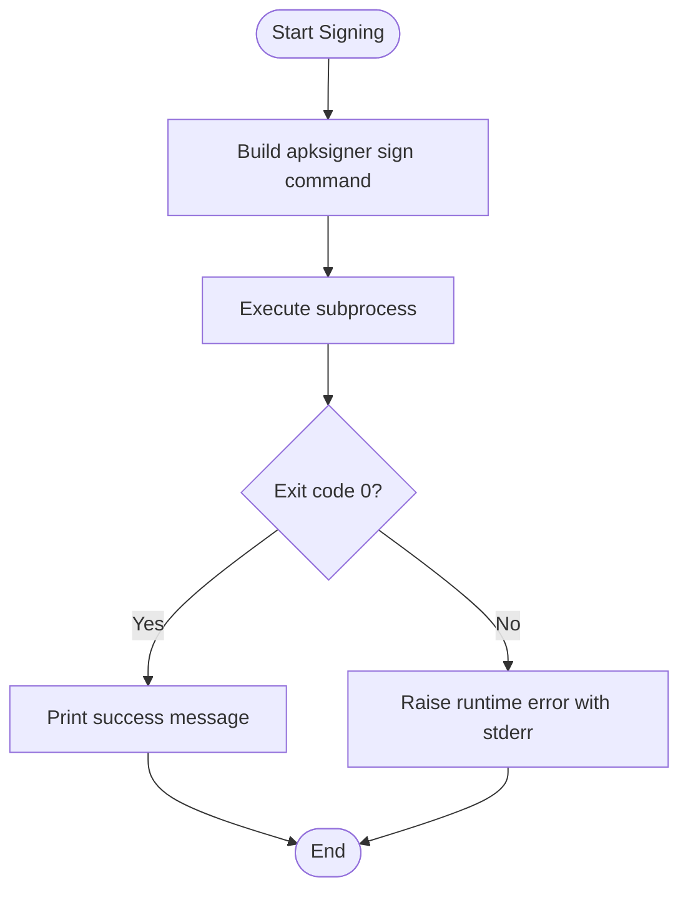
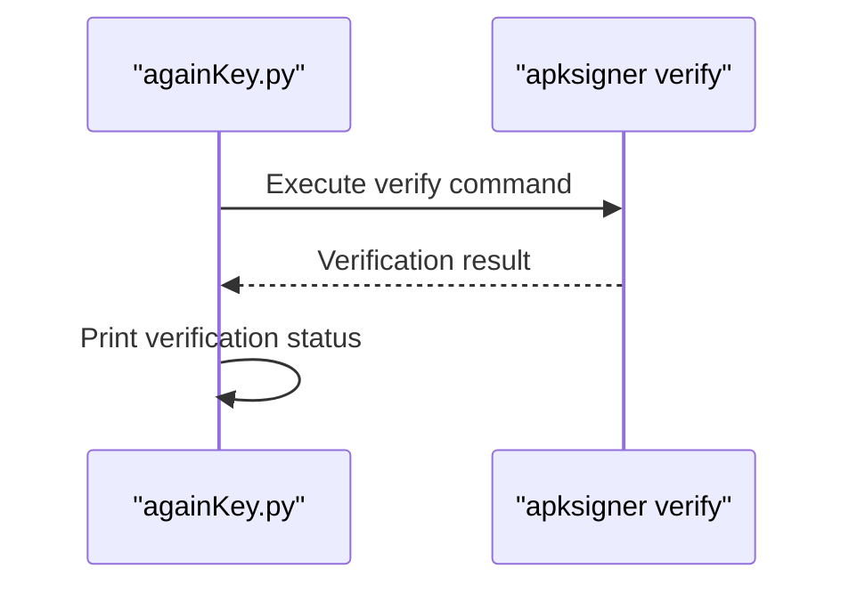
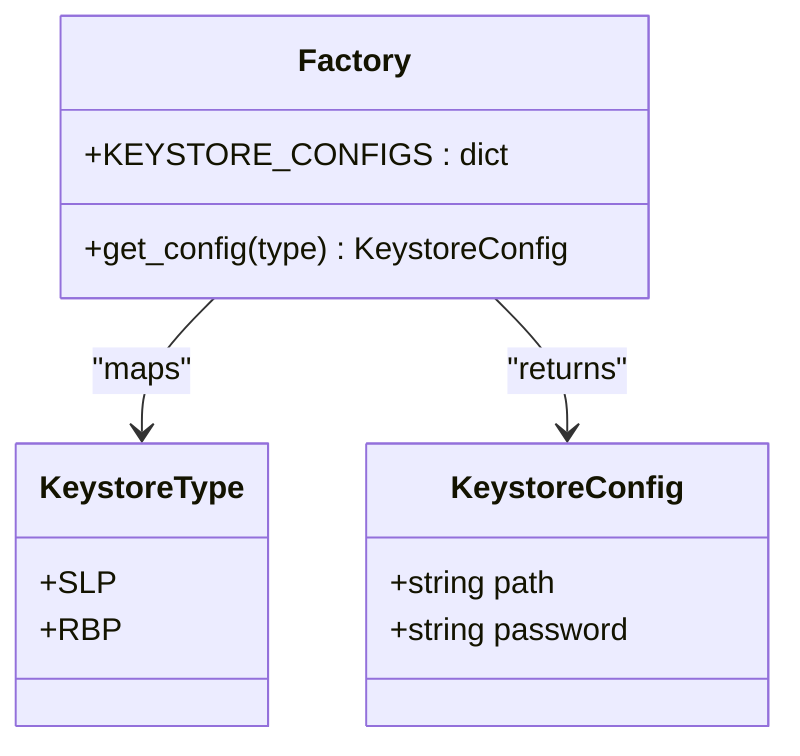
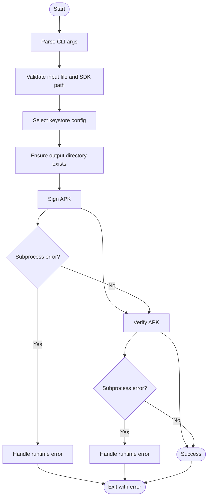
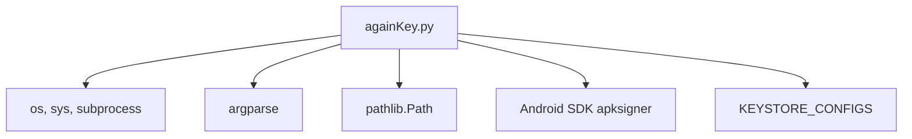

# APK Re-signing System

<cite>
**Referenced Files in This Document**
- [againKey.py](file://appBuild/againBuild/againKey.py)
- [changeApk.py](file://appBuild/againBuild/changeApk.py)
- [changeRes.py](file://appBuild/againBuild/changeRes.py)
- [batchChannelV2.py](file://appBuild/DaBao/batchChannelV2.py)
- [openBuild.bat](file://appBuild/openBuild.bat)
- [README.md](file://README.md)
</cite>

## Table of Contents
1. [Introduction](#introduction)
2. [Project Structure](#project-structure)
3. [Core Components](#core-components)
4. [Architecture Overview](#architecture-overview)
5. [Detailed Component Analysis](#detailed-component-analysis)
6. [Dependency Analysis](#dependency-analysis)
7. [Performance Considerations](#performance-considerations)
8. [Troubleshooting Guide](#troubleshooting-guide)
9. [Conclusion](#conclusion)
10. [Appendices](#appendices)

## Introduction
This document describes the APK re-signing system implemented in the repository, focusing on the againKey.py script. It explains the keystore type enumeration, configuration management, command-line interface, secure signing process using Android SDK apksigner, support for multiple keystores (SLP and RBP), and the automatic verification workflow. Practical examples, security considerations, keystore management best practices, and integration with build pipelines are included.

## Project Structure
The APK re-signing system resides under appBuild/againBuild and integrates with other build utilities in the repository. The primary re-signing tool is againKey.py, while related tools for APK manipulation and resource replacement exist in the same directory. The system is part of a larger build toolkit described in the repository README.

**Diagram sources**
- [againKey.py](file://appBuild/againBuild/againKey.py)
- [changeApk.py](file://appBuild/againBuild/changeApk.py)
- [changeRes.py](file://appBuild/againBuild/changeRes.py)
- [batchChannelV2.py](file://appBuild/DaBao/batchChannelV2.py)
- [openBuild.bat](file://appBuild/openBuild.bat)
- [README.md](file://README.md)

**Section sources**
- [README.md](file://README.md)
- [openBuild.bat](file://appBuild/openBuild.bat)

## Core Components
The re-signing system centers around againKey.py, which provides:
- Keystore type enumeration for SLP and RBP
- Configuration management via a dataclass and a static dictionary
- Command-line interface with argument parsing
- Secure signing using Android SDK apksigner
- Automatic verification workflow post-signing
- Robust error handling and validation

Key implementation highlights:
- KeystoreType enum defines supported keystore types
- KeystoreConfig dataclass encapsulates keystore path and password
- KEYSTORE_CONFIGS maps enum values to concrete configurations
- DEFAULT_SDK_PATH points to the Android SDK apksigner executable
- Validation functions ensure input files and SDK paths exist
- Command builders construct apksigner commands for signing and verification
- execute_command runs subprocesses and surfaces errors cleanly

**Section sources**
- [againKey.py](file://appBuild/againBuild/againKey.py)

## Architecture Overview
The re-signing workflow follows a straightforward pipeline: parse arguments, validate inputs, select keystore, sign the APK, and verify the signature. The system integrates with the Android SDK’s apksigner tool and provides a simple CLI interface.

**Diagram sources**
- [againKey.py](file://appBuild/againBuild/againKey.py)

## Detailed Component Analysis

### Keystore Type Enumeration and Configuration Management
The system defines two keystore types (SLP and RBP) and stores their configuration in a dictionary. The configuration includes the keystore file path and password. The main function selects the keystore based on the parsed CLI argument and retrieves the associated configuration.

**Diagram sources**
- [againKey.py](file://appBuild/againBuild/againKey.py)

**Section sources**
- [againKey.py](file://appBuild/againBuild/againKey.py)

### Command-Line Interface
The CLI accepts positional arguments for input and output APK paths and optional arguments for keystore selection and SDK path. The help text includes usage examples for common scenarios.

Key CLI features:
- Positional arguments: input APK, output APK
- Optional arguments: --keystore (choices: slp, rbp), --sdk-path (default: configured path)
- Example usage embedded in help text

**Section sources**
- [againKey.py](file://appBuild/againBuild/againKey.py)

### Secure Signing Process Using Android SDK apksigner
The signing process constructs an apksigner command with:
- Keystore path (--ks)
- Keystore password (--ks-pass)
- Output path (--out)
- Input APK path

The command is executed via subprocess with error handling to surface failures clearly.

**Diagram sources**
- [againKey.py](file://appBuild/againBuild/againKey.py)

**Section sources**
- [againKey.py](file://appBuild/againBuild/againKey.py)

### Automatic Verification Workflow
After signing, the system automatically verifies the APK using apksigner verify with verbose output. The verification command is constructed similarly and executed with the same error-handling strategy.

**Diagram sources**
- [againKey.py](file://appBuild/againBuild/againKey.py)

**Section sources**
- [againKey.py](file://appBuild/againBuild/againKey.py)

### Factory Pattern for Keystore Configuration
The system uses a simple factory-like pattern:
- A dictionary (KEYSTORE_CONFIGS) acts as a registry mapping keystore types to configurations
- The main function selects the keystore type from CLI input and retrieves the corresponding configuration
- This pattern allows easy extension by adding new entries to the registry

**Diagram sources**
- [againKey.py](file://appBuild/againBuild/againKey.py)

**Section sources**
- [againKey.py](file://appBuild/againBuild/againKey.py)

### Error Handling Strategies
The system implements layered error handling:
- File existence validation for input APK and SDK path
- Subprocess execution with captured stderr for meaningful error messages
- Specific exception handling for known error types (FileNotFoundError, RuntimeError)
- Generic exception handling for unexpected errors

**Diagram sources**
- [againKey.py](file://appBuild/againBuild/againKey.py)

**Section sources**
- [againKey.py](file://appBuild/againBuild/againKey.py)

## Dependency Analysis
The re-signing system depends on:
- Python standard library modules (os, sys, subprocess, argparse, pathlib)
- Android SDK apksigner for signing and verification
- Predefined keystore configurations for SLP and RBP

Integration points:
- The build menu (openBuild.bat) exposes the re-signing tool among other utilities
- Related tools (changeApk.py, changeRes.py) support APK manipulation and resource replacement
- Channel packaging (batchChannelV2.py) complements re-signing in build pipelines

**Diagram sources**
- [againKey.py](file://appBuild/againBuild/againKey.py)

**Section sources**
- [againKey.py](file://appBuild/againBuild/againKey.py)
- [openBuild.bat](file://appBuild/openBuild.bat)
- [batchChannelV2.py](file://appBuild/DaBao/batchChannelV2.py)

## Performance Considerations
- Command execution overhead: subprocess calls introduce latency; batching operations can reduce repeated startup costs
- File I/O: Ensure output directory exists once before signing to avoid repeated directory creation
- SDK path validation: Cache validated SDK path to avoid repeated filesystem checks
- Logging: Keep error messages concise to minimize console I/O during automation

## Troubleshooting Guide
Common issues and resolutions:
- Missing input APK or SDK path: Ensure both input APK and SDK path exist; the system validates these before proceeding
- Incorrect keystore type: Verify the --keystore argument matches supported values (slp, rbp)
- SDK path misconfiguration: Confirm the --sdk-path points to the correct apksigner executable
- Permission errors: Ensure the script has permission to read the input APK and write to the output directory
- Network or external tool failures: The subprocess error handling captures stderr for diagnosis

Operational tips:
- Use verbose logging to capture detailed error messages
- Test with a small APK to validate the workflow before scaling
- Verify signatures manually using the built-in verification step

**Section sources**
- [againKey.py](file://appBuild/againBuild/againKey.py)

## Conclusion
The APK re-signing system provides a robust, configurable, and automated solution for signing Android applications using the Android SDK. Its modular design, clear CLI, and integrated verification make it suitable for inclusion in CI/CD pipelines. The factory pattern for keystore configuration enables easy expansion to additional keystores, while comprehensive error handling ensures reliable operation in diverse environments.

## Appendices

### Practical Command-Line Usage Examples
- Basic re-signing with default keystore and SDK path:
  - python againKey.py input.apk output.apk
- Specify RBP keystore:
  - python againKey.py input.apk output.apk --keystore rbp
- Override SDK path:
  - python againKey.py input.apk output.apk --sdk-path /path/to/apksigner

These examples are derived from the CLI help text embedded in the script.

**Section sources**
- [againKey.py](file://appBuild/againBuild/againKey.py)

### Security Considerations and Best Practices
- Store keystore passwords securely; avoid embedding secrets in scripts
- Restrict file permissions on keystore files to minimize exposure
- Use dedicated keystore instances per environment (dev, staging, prod)
- Regularly audit and rotate keystores to mitigate compromise risks
- Validate APK integrity using the built-in verification step before distribution

### Integration with Build Pipelines
- The build menu (openBuild.bat) exposes the re-signing tool alongside other utilities
- Combine with channel packaging (batchChannelV2.py) for automated release workflows
- Integrate with CI systems to automate signing and verification steps
- Use the verification step as a quality gate in automated pipelines

**Section sources**
- [openBuild.bat](file://appBuild/openBuild.bat)
- [batchChannelV2.py](file://appBuild/DaBao/batchChannelV2.py)