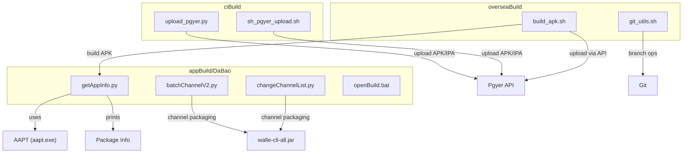
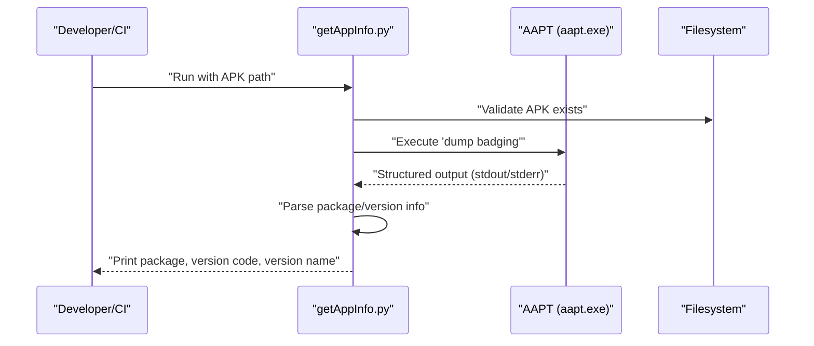
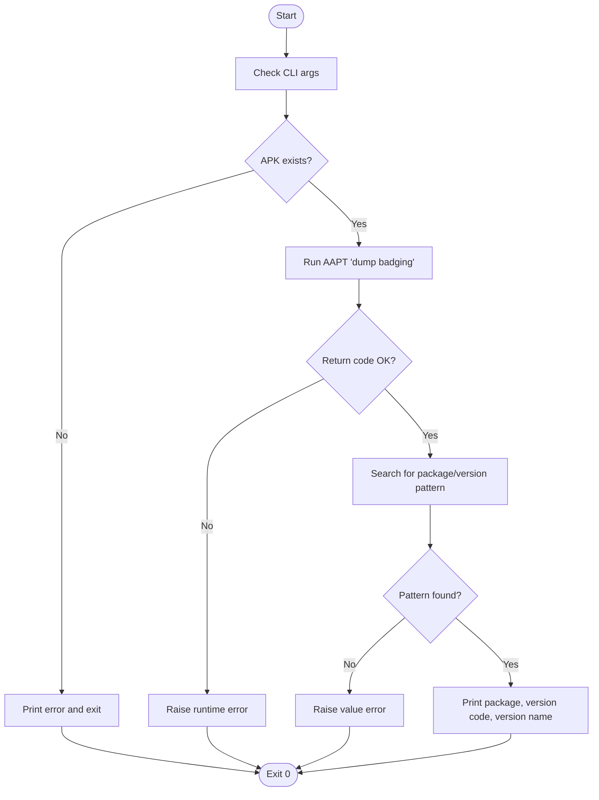
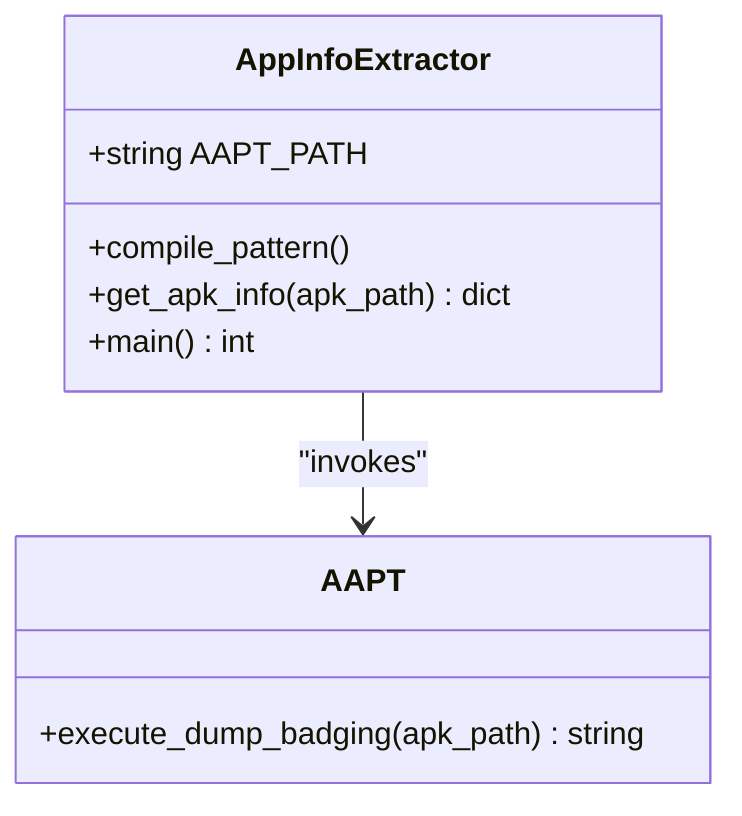
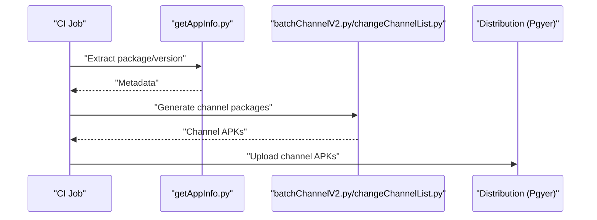
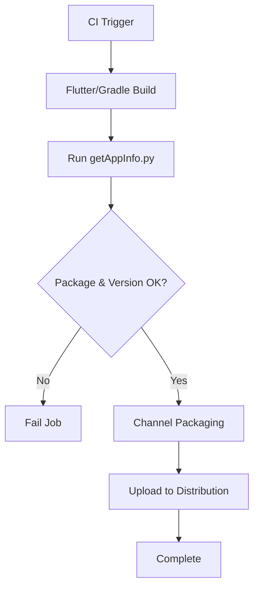
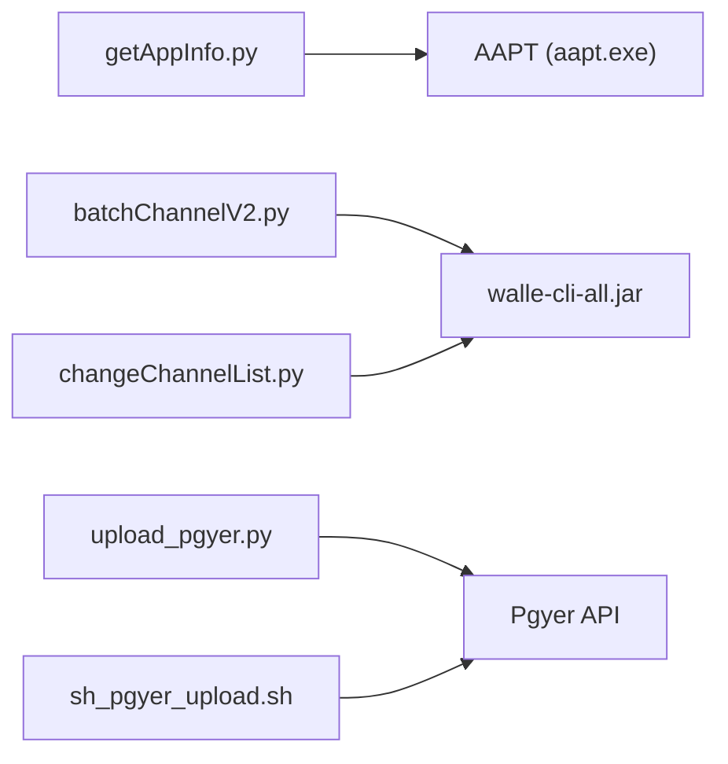

# Application Information Extraction

<cite>
**Referenced Files in This Document**
- [getAppInfo.py](file://appBuild/DaBao/getAppInfo.py)
- [batchChannelV2.py](file://appBuild/DaBao/batchChannelV2.py)
- [changeChannelList.py](file://appBuild/DaBao/changeChannelList.py)
- [openBuild.bat](file://appBuild/openBuild.bat)
- [README.md](file://README.md)
- [upload_pgyer.py](file://ciBuild/utils/upload_pgyer.py)
- [sh_pgyer_upload.sh](file://ciBuild/sh_pgyer_upload.sh)
- [build_apk.sh](file://overseaBuild/build_apk.sh)
- [git_utils.sh](file://overseaBuild/git_utils.sh)
</cite>

## Table of Contents
1. [Introduction](#introduction)
2. [Project Structure](#project-structure)
3. [Core Components](#core-components)
4. [Architecture Overview](#architecture-overview)
5. [Detailed Component Analysis](#detailed-component-analysis)
6. [Dependency Analysis](#dependency-analysis)
7. [Performance Considerations](#performance-considerations)
8. [Troubleshooting Guide](#troubleshooting-guide)
9. [Conclusion](#conclusion)
10. [Appendices](#appendices)

## Introduction
This document describes the application information extraction tool implemented in getAppInfo.py, which retrieves APK metadata such as package name, version code, and version name by invoking Android’s AAPT (Android Asset Packaging Tool). It explains how the script integrates with AAPT, parses the badging output, and extracts structured data. It also covers practical usage scenarios, output formats, error handling, and extension possibilities for richer metadata extraction. Finally, it outlines how this tool fits into automated build processes and CI/CD pipelines.

## Project Structure
The application information extraction capability resides under appBuild/DaBao alongside other build and packaging utilities. The primary entry point is getAppInfo.py, which depends on AAPT being installed and accessible at a configured path. Supporting scripts demonstrate how this tool can be integrated into larger build and distribution workflows.

**Diagram sources**
- [getAppInfo.py](file://appBuild/DaBao/getAppInfo.py)
- [batchChannelV2.py](file://appBuild/DaBao/batchChannelV2.py)
- [changeChannelList.py](file://appBuild/DaBao/changeChannelList.py)
- [openBuild.bat](file://appBuild/openBuild.bat)
- [upload_pgyer.py](file://ciBuild/utils/upload_pgyer.py)
- [sh_pgyer_upload.sh](file://ciBuild/sh_pgyer_upload.sh)
- [build_apk.sh](file://overseaBuild/build_apk.sh)
- [git_utils.sh](file://overseaBuild/git_utils.sh)

**Section sources**
- [README.md](file://README.md)
- [openBuild.bat](file://appBuild/openBuild.bat)

## Core Components
- getAppInfo.py: Extracts package name, version code, and version name from an APK using AAPT badging output.
- batchChannelV2.py: Demonstrates channel packaging using Walle; useful for validating APK identity before distribution.
- changeChannelList.py: Another channel packaging utility; illustrates how extracted metadata can feed downstream tasks.
- upload_pgyer.py and sh_pgyer_upload.sh: Provide upload mechanisms for APK/IPA artifacts after extraction and packaging.
- build_apk.sh: Builds APKs and optionally uploads them, integrating extraction and packaging steps.
- git_utils.sh: Supports Git operations in build contexts.

**Section sources**
- [getAppInfo.py](file://appBuild/DaBao/getAppInfo.py)
- [batchChannelV2.py](file://appBuild/DaBao/batchChannelV2.py)
- [changeChannelList.py](file://appBuild/DaBao/changeChannelList.py)
- [upload_pgyer.py](file://ciBuild/utils/upload_pgyer.py)
- [sh_pgyer_upload.sh](file://ciBuild/sh_pgyer_upload.sh)
- [build_apk.sh](file://overseaBuild/build_apk.sh)
- [git_utils.sh](file://overseaBuild/git_utils.sh)

## Architecture Overview
The extraction pipeline centers on a single-purpose extractor that shells out to AAPT, parses its structured output, and prints human-readable and machine-parseable results. It can be embedded into broader build and release automation.

**Diagram sources**
- [getAppInfo.py](file://appBuild/DaBao/getAppInfo.py)

## Detailed Component Analysis

### getAppInfo.py: AAPT-based APK Metadata Extraction
- Purpose: Retrieve package name, version code, and version name from an APK.
- Execution model: Spawns AAPT as a subprocess with the dump badging command.
- Parsing: Uses a compiled regular expression to extract package, version code, and version name from AAPT’s output.
- Output: Prints three key attributes to stdout; returns an exit code suitable for scripting.
- Error handling:
  - Raises a runtime error if AAPT fails (non-zero return code).
  - Raises a value error if the expected pattern is not found in the output.
  - Validates the existence of the APK path before attempting extraction.

**Diagram sources**
- [getAppInfo.py](file://appBuild/DaBao/getAppInfo.py)

**Section sources**
- [getAppInfo.py](file://appBuild/DaBao/getAppInfo.py)

### Practical Examples and Usage Scenarios
- Extract package name, version code, and version name from an APK:
  - Command-line invocation prints the three attributes to stdout.
  - Typical usage: integrate into CI to validate artifact metadata prior to deployment.
- Example workflow:
  - Build APK via Flutter or Gradle.
  - Run getAppInfo.py against the generated APK to confirm package identity and versioning.
  - Proceed with channel packaging or upload to distribution platforms.

Note: The script itself does not accept arguments for output format; it prints human-readable lines. To consume machine-readable output, wrap the script in a CI job and parse stdout accordingly.

**Section sources**
- [getAppInfo.py](file://appBuild/DaBao/getAppInfo.py)

### Manifest Parsing and Structured Data Extraction
- Manifest parsing: The tool relies on AAPT’s “dump badging” output, which includes parsed manifest fields such as package name, version code, and version name.
- Pattern-based extraction: A regular expression captures the target fields from the textual output.
- Extensibility: Additional fields (e.g., permissions, features, targets) can be added by extending the regex and adding new keys to the returned dictionary.

**Diagram sources**
- [getAppInfo.py](file://appBuild/DaBao/getAppInfo.py)

**Section sources**
- [getAppInfo.py](file://appBuild/DaBao/getAppInfo.py)

### Integration with Channel Packaging Tools
- batchChannelV2.py and changeChannelList.py demonstrate channel packaging post-extraction. After verifying APK identity with getAppInfo.py, packaging proceeds using Walle.
- These tools illustrate a typical CI flow: extract metadata → validate → package channels → distribute.

**Diagram sources**
- [getAppInfo.py](file://appBuild/DaBao/getAppInfo.py)
- [batchChannelV2.py](file://appBuild/DaBao/batchChannelV2.py)
- [changeChannelList.py](file://appBuild/DaBao/changeChannelList.py)
- [upload_pgyer.py](file://ciBuild/utils/upload_pgyer.py)

**Section sources**
- [batchChannelV2.py](file://appBuild/DaBao/batchChannelV2.py)
- [changeChannelList.py](file://appBuild/DaBao/changeChannelList.py)
- [upload_pgyer.py](file://ciBuild/utils/upload_pgyer.py)

### CI/CD Pipeline Role and Automation
- Pre-deployment checks: Use getAppInfo.py to assert correct package identity and versioning before packaging or uploading.
- Automated builds: The overseas build script demonstrates building APKs and uploading via API, which can be preceded by metadata extraction.
- Git operations: Utility scripts support branching and checkout in CI contexts.

**Diagram sources**
- [build_apk.sh](file://overseaBuild/build_apk.sh)
- [getAppInfo.py](file://appBuild/DaBao/getAppInfo.py)
- [upload_pgyer.py](file://ciBuild/utils/upload_pgyer.py)
- [sh_pgyer_upload.sh](file://ciBuild/sh_pgyer_upload.sh)

**Section sources**
- [build_apk.sh](file://overseaBuild/build_apk.sh)
- [git_utils.sh](file://overseaBuild/git_utils.sh)

## Dependency Analysis
- Internal dependencies:
  - Regular expressions for parsing AAPT output.
  - Subprocess for invoking AAPT.
  - Path validation for the APK argument.
- External dependencies:
  - AAPT executable at a fixed path.
  - Java runtime for Walle-based packaging tools.
  - Network connectivity for distribution APIs (Pgyer).

**Diagram sources**
- [getAppInfo.py](file://appBuild/DaBao/getAppInfo.py)
- [batchChannelV2.py](file://appBuild/DaBao/batchChannelV2.py)
- [changeChannelList.py](file://appBuild/DaBao/changeChannelList.py)
- [upload_pgyer.py](file://ciBuild/utils/upload_pgyer.py)
- [sh_pgyer_upload.sh](file://ciBuild/sh_pgyer_upload.sh)

**Section sources**
- [getAppInfo.py](file://appBuild/DaBao/getAppInfo.py)
- [batchChannelV2.py](file://appBuild/DaBao/batchChannelV2.py)
- [changeChannelList.py](file://appBuild/DaBao/changeChannelList.py)
- [upload_pgyer.py](file://ciBuild/utils/upload_pgyer.py)
- [sh_pgyer_upload.sh](file://ciBuild/sh_pgyer_upload.sh)

## Performance Considerations
- AAPT invocation overhead: The subprocess call introduces latency proportional to AAPT execution time. For large APKs or slow disks, this can dominate total runtime.
- Output parsing cost: Regex scanning is linear in output size; typical AAPT badging output is small and fast to parse.
- Recommendations:
  - Cache APK paths and avoid repeated extractions when metadata is unchanged.
  - Parallelize independent extractions across multiple APKs in batch jobs.
  - Keep AAPT and the working directory on fast storage.

## Troubleshooting Guide
Common issues and resolutions:
- AAPT execution failure:
  - Symptom: Runtime error indicating AAPT failure.
  - Cause: Incorrect AAPT path, missing Android SDK build-tools, or permission issues.
  - Resolution: Verify the AAPT path and ensure the executable is present and executable.
- Malformed or unsigned APK:
  - Symptom: Value error indicating inability to parse package information.
  - Cause: Corrupted or incompatible APK.
  - Resolution: Validate the APK integrity and ensure it was built correctly.
- Missing APK argument or file:
  - Symptom: Early exit with usage help or path error.
  - Resolution: Provide a valid, existing APK path as the first argument.
- Network upload failures:
  - Symptom: Upload scripts fail to reach distribution endpoints.
  - Resolution: Check network connectivity and API credentials; retry with exponential backoff.

**Section sources**
- [getAppInfo.py](file://appBuild/DaBao/getAppInfo.py)
- [upload_pgyer.py](file://ciBuild/utils/upload_pgyer.py)
- [sh_pgyer_upload.sh](file://ciBuild/sh_pgyer_upload.sh)

## Conclusion
getAppInfo.py provides a focused, reliable mechanism to extract essential APK metadata using AAPT. Its simplicity makes it easy to integrate into CI/CD pipelines for pre-deployment validation and downstream packaging or distribution steps. By combining it with channel packaging tools and upload utilities, teams can automate robust release workflows while maintaining visibility into package identity and versioning.

## Appendices

### AAPT Integration Notes
- The script invokes AAPT with the dump badging command and expects structured output containing package name, version code, and version name.
- The regular expression is designed to match the specific format emitted by AAPT’s badging output.

**Section sources**
- [getAppInfo.py](file://appBuild/DaBao/getAppInfo.py)

### Output Formats and Consumption
- Human-readable output: The script prints three labeled lines for package, version code, and version name.
- Machine-readable consumption: Wrap the script in CI jobs and parse stdout to extract values programmatically.

**Section sources**
- [getAppInfo.py](file://appBuild/DaBao/getAppInfo.py)

### Extension Possibilities
- Additional metadata: Extend the regex and dictionary to capture permissions, features, and other manifest-derived fields exposed by AAPT badging.
- Output formats: Add JSON or CSV output modes for easier ingestion by external systems.
- Validation rules: Introduce checks for minimum SDK, target SDK, signing mode, and other attributes.

**Section sources**
- [getAppInfo.py](file://appBuild/DaBao/getAppInfo.py)