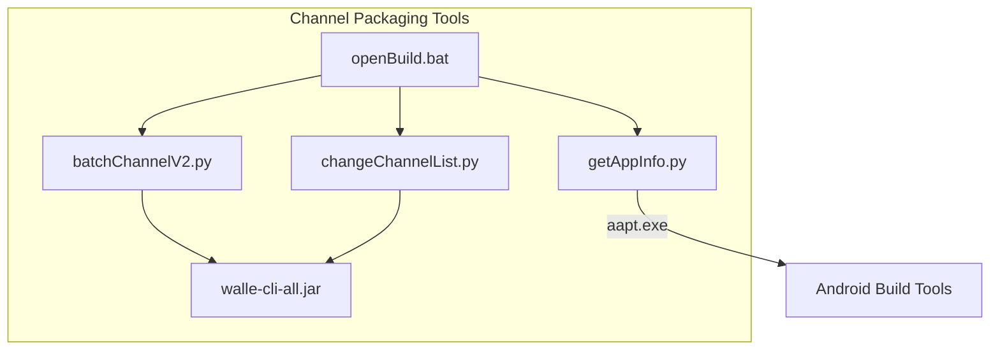
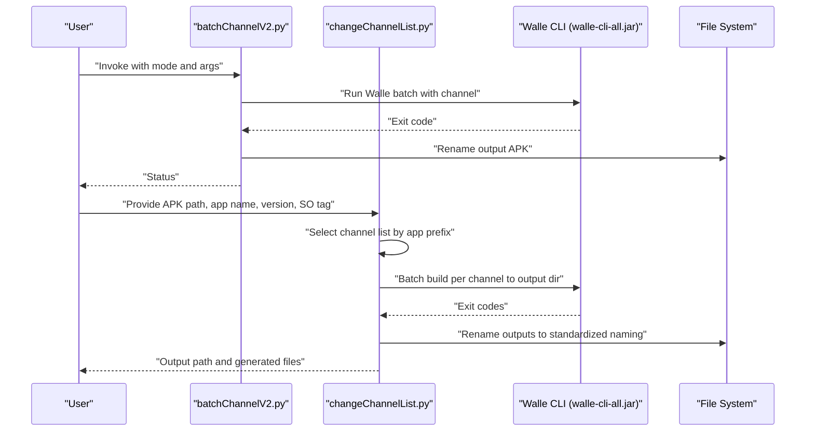
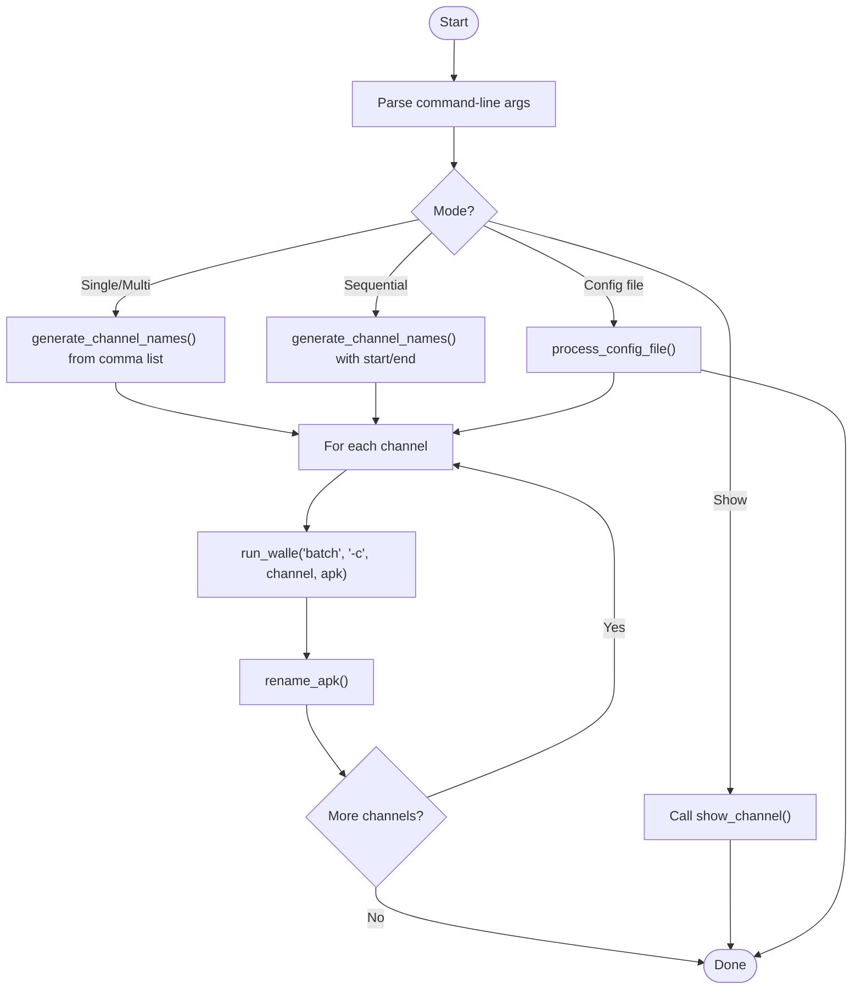
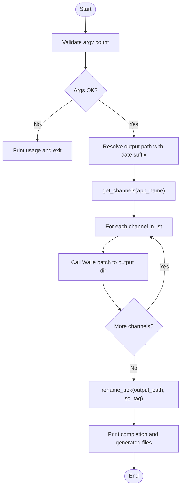
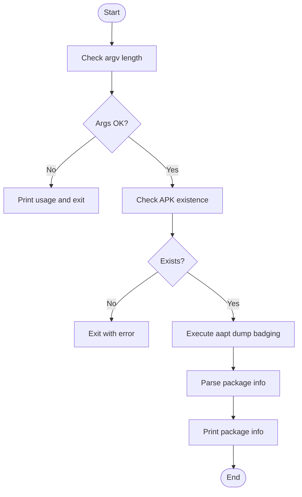
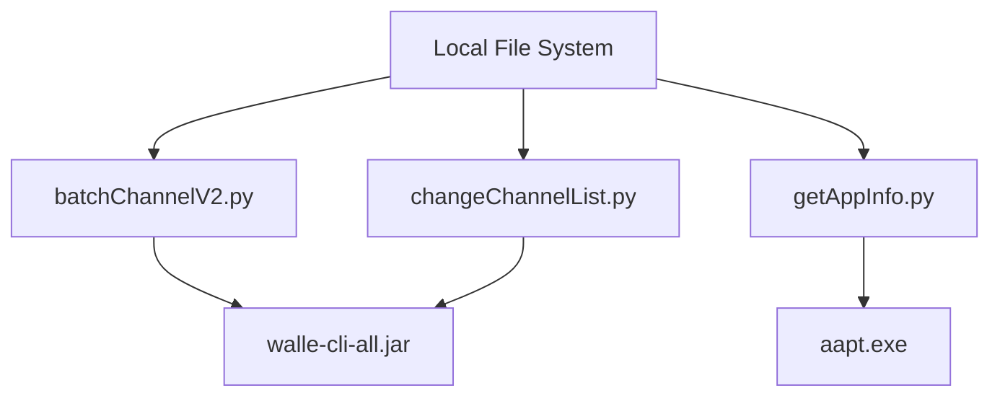

# Channel Package Generation

<cite>
**Referenced Files in This Document**
- [batchChannelV2.py](file://appBuild/DaBao/batchChannelV2.py)
- [changeChannelList.py](file://appBuild/DaBao/changeChannelList.py)
- [getAppInfo.py](file://appBuild/DaBao/getAppInfo.py)
- [openBuild.bat](file://appBuild/openBuild.bat)
- [walle-cli-all.jar](file://appBuild/DaBao/walle-cli-all.jar)
</cite>

## Table of Contents
1. [Introduction](#introduction)
2. [Project Structure](#project-structure)
3. [Core Components](#core-components)
4. [Architecture Overview](#architecture-overview)
5. [Detailed Component Analysis](#detailed-component-analysis)
6. [Dependency Analysis](#dependency-analysis)
7. [Performance Considerations](#performance-considerations)
8. [Troubleshooting Guide](#troubleshooting-guide)
9. [Conclusion](#conclusion)
10. [Appendices](#appendices)

## Introduction
This document explains the channel packaging system built around Walle integration for Android APK distribution. It focuses on:
- Generating multiple APK variants with different channel identifiers using batchChannelV2.py
- Managing channel lists and batch processing with changeChannelList.py
- Supporting configuration file-driven channel batches
- Practical examples of channel naming strategies, batch operations, and output organization
- Walle CLI integration, performance considerations for large-scale packaging, and troubleshooting channel packaging issues
- Flexible channel configuration and extension points for custom channel schemes

## Project Structure
The channel packaging system resides under appBuild/DaBao and integrates with Walle CLI via a Java JAR artifact. The primary scripts are:
- batchChannelV2.py: Single or batch channel packaging with flexible input modes
- changeChannelList.py: Batch channel packaging with configurable channel lists and output organization
- getAppInfo.py: Utility to extract package metadata from an APK
- openBuild.bat: Menu-driven launcher for build tools including channel packaging utilities
- walle-cli-all.jar: Walle CLI JAR used to embed channel metadata into APKs

**Diagram sources**
- [batchChannelV2.py:1-120](file://appBuild/DaBao/batchChannelV2.py#L1-L120)
- [changeChannelList.py:1-91](file://appBuild/DaBao/changeChannelList.py#L1-L91)
- [getAppInfo.py:1-58](file://appBuild/DaBao/getAppInfo.py#L1-L58)
- [openBuild.bat:1-23](file://appBuild/openBuild.bat#L1-L23)
- [walle-cli-all.jar](file://appBuild/DaBao/walle-cli-all.jar)

**Section sources**
- [openBuild.bat:13-16](file://appBuild/openBuild.bat#L13-L16)

## Core Components
- batchChannelV2.py
  - Supports multiple invocation modes:
    - Show channel info: show <apk>
    - Single channel: <apk> <channel>
    - Multiple channels: <apk> <ch1,ch2,ch3>
    - Sequential batch: <apk> <channel_prefix> <start> <end>
    - Config file mode: <apk> -f <config_file>
  - Uses Walle CLI to embed channel metadata and renames outputs to a standardized format
- changeChannelList.py
  - Defines channel groups keyed by application prefixes and a default list
  - Builds channels to a dated output folder and renames artifacts to a consistent naming scheme
- getAppInfo.py
  - Extracts package name, version code, and version name from an APK using aapt
- Walle CLI integration
  - Both scripts invoke java -jar walle-cli-all.jar with appropriate arguments

**Section sources**
- [batchChannelV2.py:6-12](file://appBuild/DaBao/batchChannelV2.py#L6-L12)
- [batchChannelV2.py:55-69](file://appBuild/DaBao/batchChannelV2.py#L55-L69)
- [batchChannelV2.py:72-85](file://appBuild/DaBao/batchChannelV2.py#L72-L85)
- [changeChannelList.py:15-29](file://appBuild/DaBao/changeChannelList.py#L15-L29)
- [changeChannelList.py:50-61](file://appBuild/DaBao/changeChannelList.py#L50-L61)
- [getAppInfo.py:16-32](file://appBuild/DaBao/getAppInfo.py#L16-L32)

## Architecture Overview
The system orchestrates channel packaging through two complementary scripts:
- batchChannelV2.py: Flexible, single-command driven channel packaging with optional config file batching
- changeChannelList.py: Predefined channel group management with output organization and renaming

**Diagram sources**
- [batchChannelV2.py:21-24](file://appBuild/DaBao/batchChannelV2.py#L21-L24)
- [batchChannelV2.py:55-69](file://appBuild/DaBao/batchChannelV2.py#L55-L69)
- [changeChannelList.py:50-61](file://appBuild/DaBao/changeChannelList.py#L50-L61)
- [changeChannelList.py:31-47](file://appBuild/DaBao/changeChannelList.py#L31-L47)

## Detailed Component Analysis

### batchChannelV2.py
- Purpose: Single or batch channel packaging with flexible input modes and output renaming
- Key functions:
  - run_walle: Executes Walle CLI commands
  - show_channel: Displays embedded channel info
  - generate_channel_names: Parses comma-separated channels or generates a zero-padded numeric sequence
  - rename_apk: Standardizes output filenames
  - process_channels: Orchestrates Walle batch runs and renaming
  - process_config_file: Reads channel entries from a config file and processes each line
  - main: Dispatches to appropriate handler based on command-line arguments

**Diagram sources**
- [batchChannelV2.py:32-39](file://appBuild/DaBao/batchChannelV2.py#L32-L39)
- [batchChannelV2.py:55-69](file://appBuild/DaBao/batchChannelV2.py#L55-L69)
- [batchChannelV2.py:72-85](file://appBuild/DaBao/batchChannelV2.py#L72-L85)
- [batchChannelV2.py:91-115](file://appBuild/DaBao/batchChannelV2.py#L91-L115)

**Section sources**
- [batchChannelV2.py:21-24](file://appBuild/DaBao/batchChannelV2.py#L21-L24)
- [batchChannelV2.py:27-29](file://appBuild/DaBao/batchChannelV2.py#L27-L29)
- [batchChannelV2.py:32-39](file://appBuild/DaBao/batchChannelV2.py#L32-L39)
- [batchChannelV2.py:42-53](file://appBuild/DaBao/batchChannelV2.py#L42-L53)
- [batchChannelV2.py:55-69](file://appBuild/DaBao/batchChannelV2.py#L55-L69)
- [batchChannelV2.py:72-85](file://appBuild/DaBao/batchChannelV2.py#L72-L85)
- [batchChannelV2.py:91-115](file://appBuild/DaBao/batchChannelV2.py#L91-L115)

### changeChannelList.py
- Purpose: Batch-packaging with predefined channel groups and organized output
- Key functions:
  - get_channels: Selects channel list by application name prefix or falls back to default
  - rename_apk: Renames outputs to a standardized naming convention
  - build_channels: Invokes Walle batch for each channel and writes to a dated output directory
  - main: Validates arguments, selects channels, builds, renames, and reports results

**Diagram sources**
- [changeChannelList.py:64-86](file://appBuild/DaBao/changeChannelList.py#L64-L86)
- [changeChannelList.py:23-28](file://appBuild/DaBao/changeChannelList.py#L23-L28)
- [changeChannelList.py:50-61](file://appBuild/DaBao/changeChannelList.py#L50-L61)
- [changeChannelList.py:31-47](file://appBuild/DaBao/changeChannelList.py#L31-L47)

**Section sources**
- [changeChannelList.py:15-29](file://appBuild/DaBao/changeChannelList.py#L15-L29)
- [changeChannelList.py:31-47](file://appBuild/DaBao/changeChannelList.py#L31-L47)
- [changeChannelList.py:50-61](file://appBuild/DaBao/changeChannelList.py#L50-L61)
- [changeChannelList.py:64-86](file://appBuild/DaBao/changeChannelList.py#L64-L86)

### getAppInfo.py
- Purpose: Extract package metadata from an APK using aapt
- Key functions:
  - get_apk_info: Runs aapt dump badging and parses package name, version code, and version name
  - main: Validates input, prints extracted info, or error messages

**Diagram sources**
- [getAppInfo.py:35-53](file://appBuild/DaBao/getAppInfo.py#L35-L53)
- [getAppInfo.py:16-32](file://appBuild/DaBao/getAppInfo.py#L16-L32)

**Section sources**
- [getAppInfo.py:16-32](file://appBuild/DaBao/getAppInfo.py#L16-L32)
- [getAppInfo.py:35-53](file://appBuild/DaBao/getAppInfo.py#L35-L53)

## Dependency Analysis
- Walle CLI integration
  - Both batchChannelV2.py and changeChannelList.py depend on walle-cli-all.jar
  - They spawn java -jar walle-cli-all.jar with subcommands for show and batch operations
- File system dependencies
  - Output directory creation and file renaming occur locally
  - batchChannelV2.py renames outputs to a standardized format
  - changeChannelList.py organizes outputs into a dated directory and renames files consistently
- External tooling
  - getAppInfo.py depends on aapt.exe from Android build tools for parsing APK metadata

**Diagram sources**
- [batchChannelV2.py:18](file://appBuild/DaBao/batchChannelV2.py#L18)
- [changeChannelList.py:13](file://appBuild/DaBao/changeChannelList.py#L13)
- [getAppInfo.py:12](file://appBuild/DaBao/getAppInfo.py#L12)

**Section sources**
- [batchChannelV2.py:21-24](file://appBuild/DaBao/batchChannelV2.py#L21-L24)
- [changeChannelList.py:50-56](file://appBuild/DaBao/changeChannelList.py#L50-L56)
- [getAppInfo.py:18-22](file://appBuild/DaBao/getAppInfo.py#L18-L22)

## Performance Considerations
- Batch processing efficiency
  - Sequential Walle invocations per channel are straightforward but can be slow for large channel sets
  - Consider parallelizing channel builds if Walle supports concurrent operations or if you implement a worker pool
- Output organization
  - changeChannelList.py creates a dated output directory, reducing clutter and simplifying cleanup
- File renaming overhead
  - Both scripts rename outputs; ensure filesystem operations are performed on the same drive to minimize cross-device copy costs
- Large-scale packaging
  - For very large channel lists, prefer the config file mode in batchChannelV2.py to reduce repeated argument parsing
  - Monitor disk I/O and memory usage during batch operations

[No sources needed since this section provides general guidance]

## Troubleshooting Guide
- Walle CLI errors
  - Verify walle-cli-all.jar is present and executable
  - Ensure java is installed and accessible in PATH
- Channel naming issues
  - batchChannelV2.py expects a standardized output filename pattern; confirm the original output matches expectations before renaming
  - changeChannelList.py expects a specific naming pattern for pre-renamed outputs; adjust rename logic if your outputs differ
- Config file problems
  - batchChannelV2.py ignores empty lines and comments prefixed with '#'; ensure lines are formatted as "<channel> [start end]"
- APK metadata extraction
  - getAppInfo.py requires aapt.exe; ensure the path is correct and the tool is compatible with the target APK
- Permission and path issues
  - Ensure write permissions to the output directory
  - Use absolute paths when invoking scripts to avoid ambiguity

**Section sources**
- [batchChannelV2.py:74-85](file://appBuild/DaBao/batchChannelV2.py#L74-L85)
- [batchChannelV2.py:42-53](file://appBuild/DaBao/batchChannelV2.py#L42-L53)
- [changeChannelList.py:31-47](file://appBuild/DaBao/changeChannelList.py#L31-L47)
- [getAppInfo.py:41-43](file://appBuild/DaBao/getAppInfo.py#L41-L43)

## Conclusion
The channel packaging system provides two complementary approaches:
- batchChannelV2.py for flexible, single-command or config-file-driven channel packaging with precise output renaming
- changeChannelList.py for predefined channel groups with organized output and standardized renaming

Together, they enable efficient, repeatable channel packaging at scale while integrating seamlessly with Walle CLI and Android build tooling.

[No sources needed since this section summarizes without analyzing specific files]

## Appendices

### Practical Examples

- Single channel packaging
  - Invoke batchChannelV2.py with a single channel identifier to generate one variant
  - Example invocation: python batchChannelV2.py <apk> <channel>
- Multiple channels
  - Provide a comma-separated list to create multiple variants in one run
  - Example invocation: python batchChannelV2.py <apk> <ch1,ch2,ch3>
- Sequential batch
  - Generate a zero-padded sequence of channels using a prefix and start/end indices
  - Example invocation: python batchChannelV2.py <apk> <channel_prefix> <start> <end>
- Config file batching
  - Use a config file to define multiple channel entries; each line specifies a channel and optional start/end range
  - Example invocation: python batchChannelV2.py <apk> -f <config_file>
- Batch with channel groups
  - Provide application name, version, and SO tag to build channel variants according to configured groups
  - Example invocation: python changeChannelList.py <apkPath> <apkName> <appVersion> <CPU>

**Section sources**
- [batchChannelV2.py:6-12](file://appBuild/DaBao/batchChannelV2.py#L6-L12)
- [batchChannelV2.py:106-115](file://appBuild/DaBao/batchChannelV2.py#L106-L115)
- [changeChannelList.py:64-86](file://appBuild/DaBao/changeChannelList.py#L64-L86)

### Channel Naming Strategies
- Standardized output format
  - batchChannelV2.py renames outputs to align channel segments and version components
  - changeChannelList.py renames outputs to include release and SO tags
- Zero-padded sequences
  - Sequential channels use a fixed-width zero-padding derived from the ending index
- Prefix-based grouping
  - changeChannelList.py selects channel lists based on application name prefixes

**Section sources**
- [batchChannelV2.py:42-53](file://appBuild/DaBao/batchChannelV2.py#L42-L53)
- [batchChannelV2.py:37-39](file://appBuild/DaBao/batchChannelV2.py#L37-L39)
- [changeChannelList.py:31-47](file://appBuild/DaBao/changeChannelList.py#L31-L47)

### Extension Points for Custom Channel Schemes
- Configurable channel lists
  - Modify CHANNEL_CONFIG in changeChannelList.py to add new application prefixes and channel groups
  - Adjust DEFAULT_CHANNELS for fallback scenarios
- Config file format
  - Extend batchChannelV2.py to support additional directives in the config file (e.g., extra Walle flags)
- Output customization
  - Adapt rename_apk logic in both scripts to meet your naming conventions
- Parallelization
  - Introduce threading or multiprocessing to accelerate batch builds when Walle supports concurrency

**Section sources**
- [changeChannelList.py:15-29](file://appBuild/DaBao/changeChannelList.py#L15-L29)
- [batchChannelV2.py:72-85](file://appBuild/DaBao/batchChannelV2.py#L72-L85)