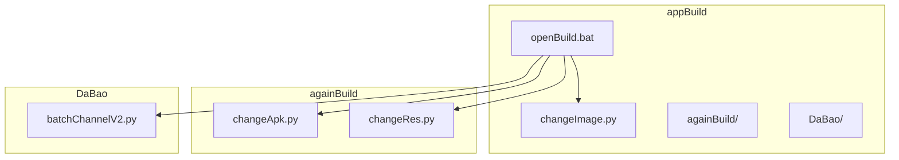
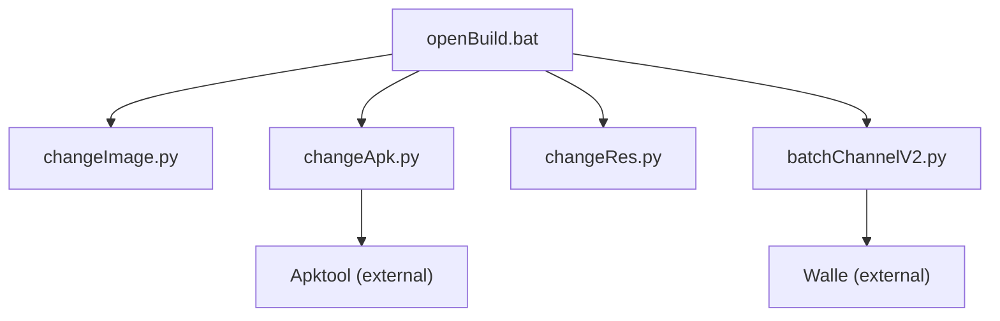
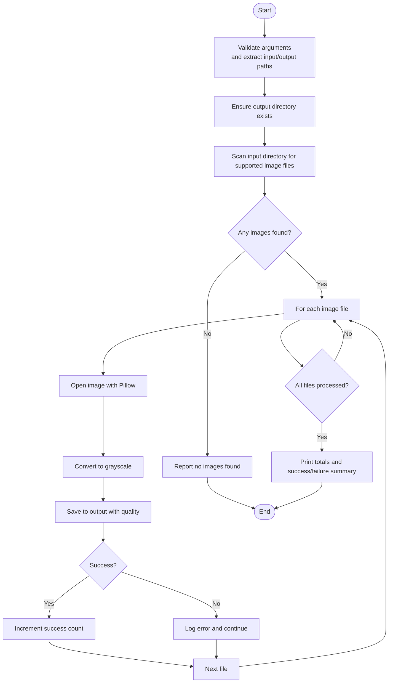
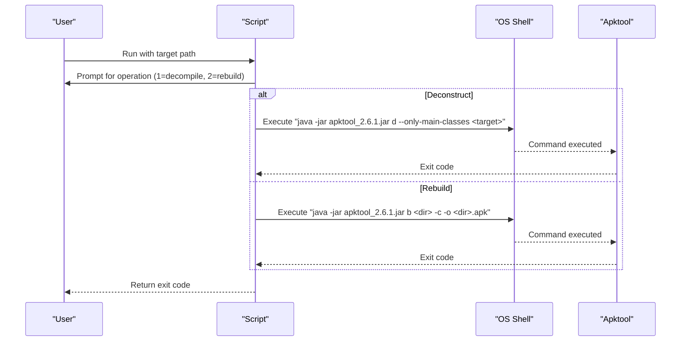
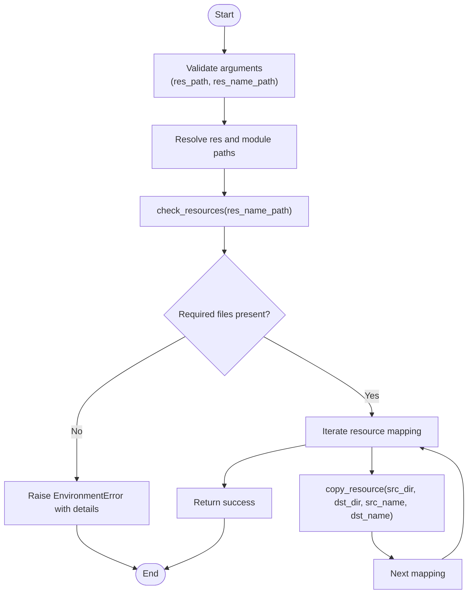
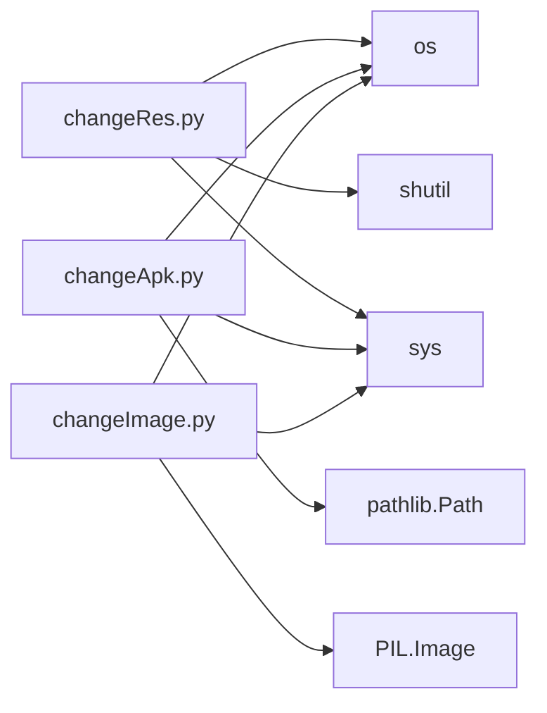

# Resource Modification Tools

<cite>
**Referenced Files in This Document**
- [changeImage.py](file://appBuild/changeImage.py)
- [changeApk.py](file://appBuild/againBuild/changeApk.py)
- [changeRes.py](file://appBuild/againBuild/changeRes.py)
- [batchChannelV2.py](file://appBuild/DaBao/batchChannelV2.py)
- [openBuild.bat](file://appBuild/openBuild.bat)
- [README.md](file://README.md)
</cite>

## Table of Contents
1. [Introduction](#introduction)
2. [Project Structure](#project-structure)
3. [Core Components](#core-components)
4. [Architecture Overview](#architecture-overview)
5. [Detailed Component Analysis](#detailed-component-analysis)
6. [Dependency Analysis](#dependency-analysis)
7. [Performance Considerations](#performance-considerations)
8. [Troubleshooting Guide](#troubleshooting-guide)
9. [Conclusion](#conclusion)
10. [Appendices](#appendices)

## Introduction
This document explains the resource modification tools designed to streamline Android app customization during development and release workflows. It focuses on:
- Batch image processing for grayscale conversion
- APK structure extraction and repackaging
- Resource file validation and targeted replacement
- Practical examples for icon replacement, resource patching, and bulk asset updates
- File format support, backup strategies, integrity verification, and integration with the overall build pipeline

These tools are part of a broader build toolkit that also includes channel packaging utilities and performance data collection scripts.

## Project Structure
The resource modification tools reside under the appBuild directory, with supporting utilities for channel packaging and a Windows launcher script.

**Diagram sources**
- [openBuild.bat:1-23](file://appBuild/openBuild.bat#L1-L23)
- [changeImage.py:1-53](file://appBuild/changeImage.py#L1-L53)
- [changeApk.py:1-39](file://appBuild/againBuild/changeApk.py#L1-L39)
- [changeRes.py:1-72](file://appBuild/againBuild/changeRes.py#L1-L72)
- [batchChannelV2.py:1-120](file://appBuild/DaBao/batchChannelV2.py#L1-L120)

**Section sources**
- [openBuild.bat:1-23](file://appBuild/openBuild.bat#L1-L23)
- [README.md:1-37](file://README.md#L1-L37)

## Core Components
- changeImage.py: Batch converts images to grayscale and saves them to an output directory with progress reporting and error handling.
- changeApk.py: Interacts with Apktool to either decompile an APK into smali/resources or rebuild an APK from a decompiled directory.
- changeRes.py: Validates a resource set against a required baseline and copies specific assets into the correct Android resource directories and Flutter module paths.

**Section sources**
- [changeImage.py:6-48](file://appBuild/changeImage.py#L6-L48)
- [changeApk.py:10-34](file://appBuild/againBuild/changeApk.py#L10-L34)
- [changeRes.py:10-67](file://appBuild/againBuild/changeRes.py#L10-L67)

## Architecture Overview
The tools operate as standalone scripts invoked from a central launcher. They integrate with external utilities (Apktool and Walle) and leverage Python’s standard libraries for file operations.

**Diagram sources**
- [openBuild.bat:8-16](file://appBuild/openBuild.bat#L8-L16)
- [changeApk.py:7](file://appBuild/againBuild/changeApk.py#L7)
- [batchChannelV2.py:18](file://appBuild/DaBao/batchChannelV2.py#L18)

## Detailed Component Analysis

### changeImage.py: Batch Image Grayscale Conversion
Purpose:
- Convert images in a given directory to grayscale and save them to an output directory.
- Filter supported image formats and provide progress and error reporting.

Key behaviors:
- Argument validation ensures input and output directories are provided.
- Creates the output directory if it does not exist.
- Scans the input directory for supported image extensions and counts them.
- Iterates through matching files, opens each with Pillow, converts to grayscale, and saves with a configured quality.
- Tracks successes and failures and prints totals at completion.

Supported formats:
- PNG, JPG, JPEG (case-insensitive extension filtering).

Error handling:
- Prints failure messages per file and continues processing remaining files.
- Reports total images found and successfully converted.

**Diagram sources**
- [changeImage.py:6-48](file://appBuild/changeImage.py#L6-L48)

**Section sources**
- [changeImage.py:6-48](file://appBuild/changeImage.py#L6-L48)

Practical example:
- Replace promotional assets across marketing campaigns by converting brand images to grayscale for consistent visual treatment.

### changeApk.py: APK Decompile and Rebuild
Purpose:
- Provide a simple CLI to decompile an APK into smali/resources or rebuild an APK from a decompiled directory using Apktool.

Key behaviors:
- Validates command-line arguments and prompts for operation mode (decompile or build).
- Uses a fixed Apktool JAR filename for both operations.
- Deconstruction uses a flag to limit to main classes.
- Reconstruction compiles with a configuration check and writes output to a generated filename.

External dependency:
- Requires Java and a specific Apktool JAR file present in the working directory.

**Diagram sources**
- [changeApk.py:10-34](file://appBuild/againBuild/changeApk.py#L10-L34)
- [changeApk.py:7](file://appBuild/againBuild/changeApk.py#L7)

**Section sources**
- [changeApk.py:10-34](file://appBuild/againBuild/changeApk.py#L10-L34)

Practical example:
- Extract resources and smali code for quick inspection or targeted modifications before rebuilding with updated assets.

### changeRes.py: Resource Validation and Replacement
Purpose:
- Validate a curated set of resource files and copy them into the correct Android resource directories and Flutter module paths.

Key behaviors:
- Defines a required resource set and checks that the provided directory contains exactly those files.
- Copies resources according to a predefined mapping of source filenames to destination directories and filenames.
- Ensures destination directories exist before copying.

Validation:
- Compares actual files to the required set and reports missing or extra files.

Resource mapping highlights:
- Icon replacements for launcher icons across density buckets.
- Splash screen assets for different densities.
- Module-specific assets for Flutter modules.
- Foreground drawable assets for launchers.
- Login splash and button assets.

**Diagram sources**
- [changeRes.py:33-67](file://appBuild/againBuild/changeRes.py#L33-L67)
- [changeRes.py:10-23](file://appBuild/againBuild/changeRes.py#L10-L23)
- [changeRes.py:26-30](file://appBuild/againBuild/changeRes.py#L26-L30)

**Section sources**
- [changeRes.py:10-67](file://appBuild/againBuild/changeRes.py#L10-L67)

Practical example:
- Update app branding by replacing launcher icons and splash screens across densities and module assets.

## Dependency Analysis
- Internal dependencies:
  - changeRes.py depends on standard library modules for filesystem operations.
  - changeApk.py depends on standard library modules and external Apktool.
  - changeImage.py depends on Pillow and standard library modules.
- External dependencies:
  - Apktool JAR file for APK decompilation and rebuilding.
  - Walle JAR file for channel packaging (used by batchChannelV2.py).
- Coupling:
  - Each tool is self-contained with minimal coupling to others.
  - No circular dependencies detected among the focused scripts.

**Diagram sources**
- [changeRes.py:1-72](file://appBuild/againBuild/changeRes.py#L1-L72)
- [changeApk.py:1-39](file://appBuild/againBuild/changeApk.py#L1-L39)
- [changeImage.py:1-53](file://appBuild/changeImage.py#L1-L53)

**Section sources**
- [changeRes.py:1-72](file://appBuild/againBuild/changeRes.py#L1-L72)
- [changeApk.py:1-39](file://appBuild/againBuild/changeApk.py#L1-L39)
- [changeImage.py:1-53](file://appBuild/changeImage.py#L1-L53)

## Performance Considerations
- changeImage.py:
  - Processing time scales linearly with the number of images.
  - Quality setting impacts file sizes; adjust as needed for storage constraints.
  - Consider batching large directories to avoid memory spikes.
- changeApk.py:
  - Execution time depends on APK size and device speed for I/O.
  - Using the “only main classes” flag reduces processing overhead during decompilation.
- changeRes.py:
  - Copy operations are fast; validation overhead is minimal compared to file I/O.
  - Ensure destination directories exist beforehand to avoid repeated checks.

[No sources needed since this section provides general guidance]

## Troubleshooting Guide
Common issues and resolutions:
- changeImage.py
  - Missing arguments: Ensure both input and output directories are provided.
  - No images found: Verify the input directory contains supported extensions.
  - Conversion failures: Inspect individual files for corruption or unsupported formats.
- changeApk.py
  - Apktool not found: Place the Apktool JAR file in the working directory and ensure Java is installed.
  - Invalid target path: Confirm the provided path exists for decompile or rebuild operations.
  - Invalid option: Choose 1 for decompile or 2 for rebuild.
- changeRes.py
  - Missing or extra files: Align the resource directory with the required set exactly.
  - Permission errors: Ensure write permissions to the destination resource directories.
  - Destination creation failures: Verify parent directories are writable.

**Section sources**
- [changeImage.py:8-10](file://appBuild/changeImage.py#L8-L10)
- [changeImage.py:24-26](file://appBuild/changeImage.py#L24-L26)
- [changeApk.py:11-13](file://appBuild/againBuild/changeApk.py#L11-L13)
- [changeApk.py:18-22](file://appBuild/againBuild/changeApk.py#L18-L22)
- [changeApk.py:23-29](file://appBuild/againBuild/changeApk.py#L23-L29)
- [changeRes.py:34-36](file://appBuild/againBuild/changeRes.py#L34-L36)
- [changeRes.py:42](file://appBuild/againBuild/changeRes.py#L42)
- [changeRes.py:63-65](file://appBuild/againBuild/changeRes.py#L63-L65)

## Conclusion
The resource modification tools provide a modular, script-driven approach to common Android app customization tasks:
- Batch image processing for visual consistency
- Controlled APK decompilation and rebuilding
- Precise resource validation and placement

They integrate cleanly with external utilities and can be incorporated into automated build pipelines. Proper validation, backup strategies, and integrity checks are essential for safe, repeatable modifications.

[No sources needed since this section summarizes without analyzing specific files]

## Appendices

### Practical Examples and Workflows
- Icon replacement
  - Prepare a set of launcher icons in the required densities and names.
  - Run the resource tool to validate and copy assets into the correct resource directories.
  - Optionally decompile and rebuild the APK to apply changes.
- Resource patching
  - Replace promotional assets by converting images to grayscale using the image tool.
  - Validate and copy updated assets into the app’s resource tree.
- Bulk asset updates
  - Use the image tool to process large batches of images.
  - Validate the updated resource set before integrating into the build.

[No sources needed since this section provides general guidance]

### File Format Support
- Images: PNG, JPG, JPEG (filtered by extension).
- Resources: PNG, WEBP, and standard Android resource names for icons and drawables.

**Section sources**
- [changeImage.py:20](file://appBuild/changeImage.py#L20)
- [changeRes.py:6](file://appBuild/againBuild/changeRes.py#L6)

### Backup Strategies
- Before decompiling an APK, keep a backup of the original APK.
- After validating resource sets, maintain a record of the required files to facilitate rollbacks.
- For bulk image processing, keep original images separate from processed outputs.

[No sources needed since this section provides general guidance]

### Integrity Verification
- Resource validation compares the actual file set to the required baseline and reports discrepancies.
- APK rebuilds can be verified by re-decompiling and comparing key resource files.

**Section sources**
- [changeRes.py:10-23](file://appBuild/againBuild/changeRes.py#L10-L23)

### Integration with Build Pipeline
- The launcher script exposes commands for all tools, enabling scripted automation.
- Channel packaging utilities complement resource modifications for release workflows.

**Section sources**
- [openBuild.bat:8-16](file://appBuild/openBuild.bat#L8-L16)
- [batchChannelV2.py:18](file://appBuild/DaBao/batchChannelV2.py#L18)