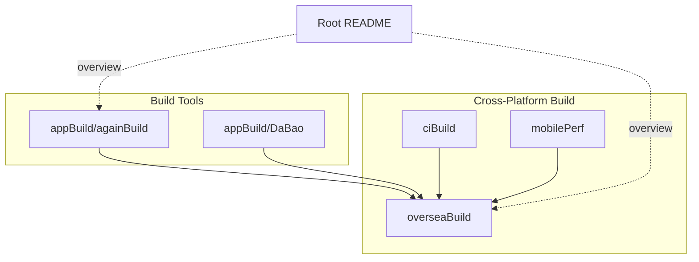
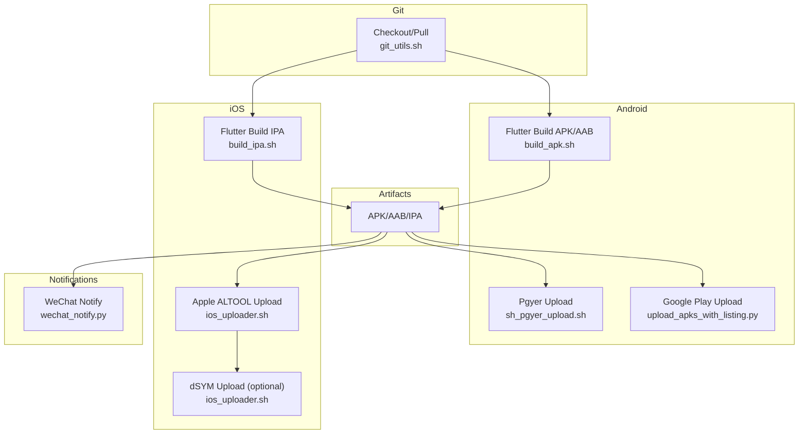
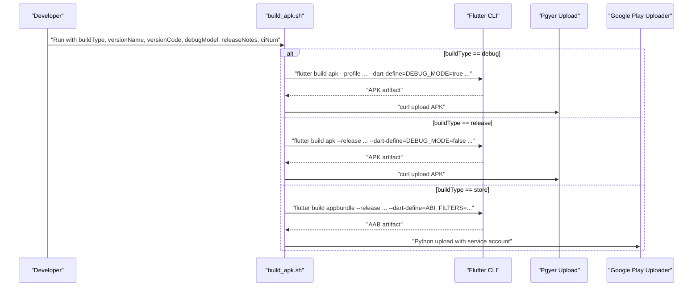
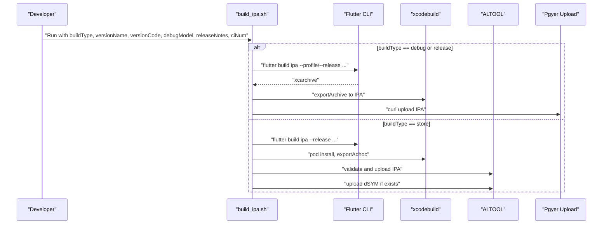
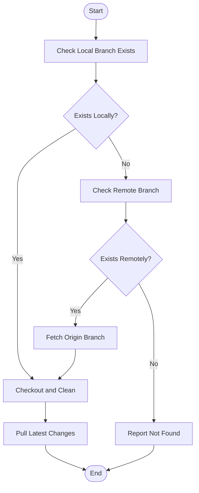
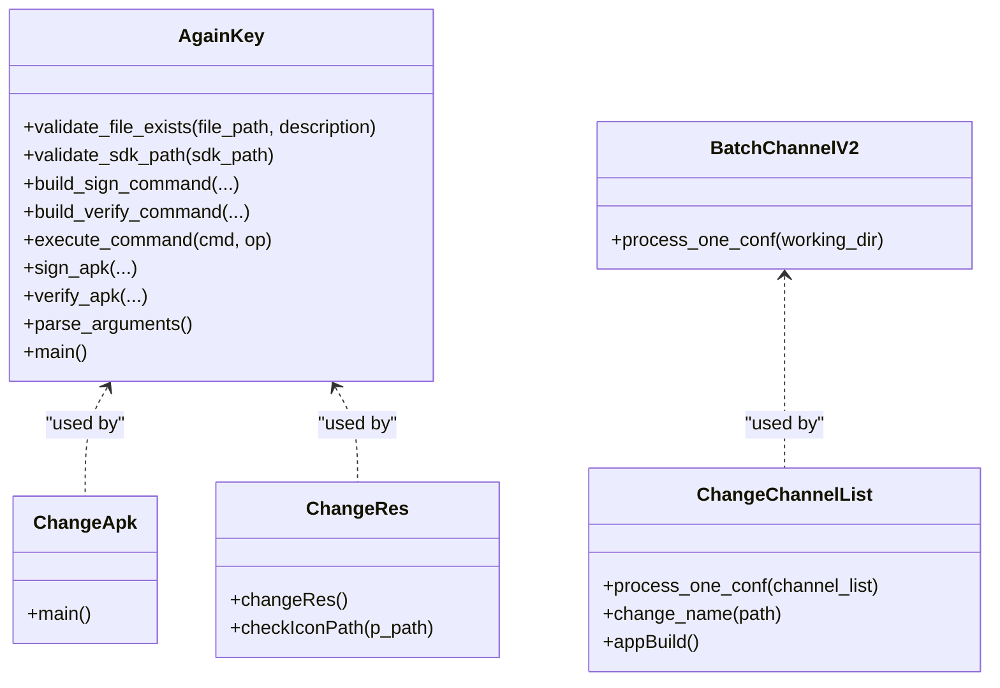
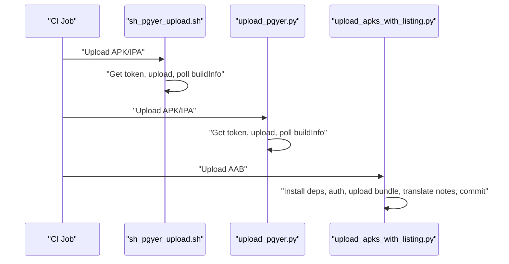
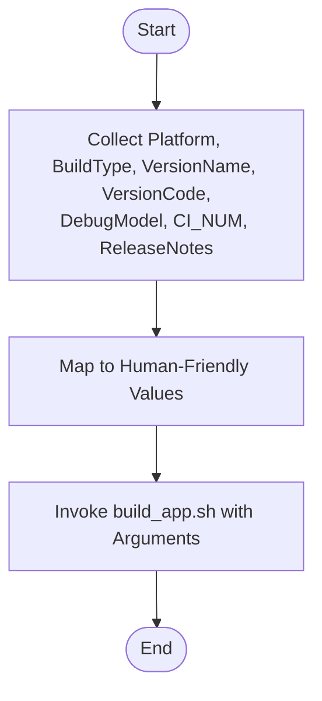
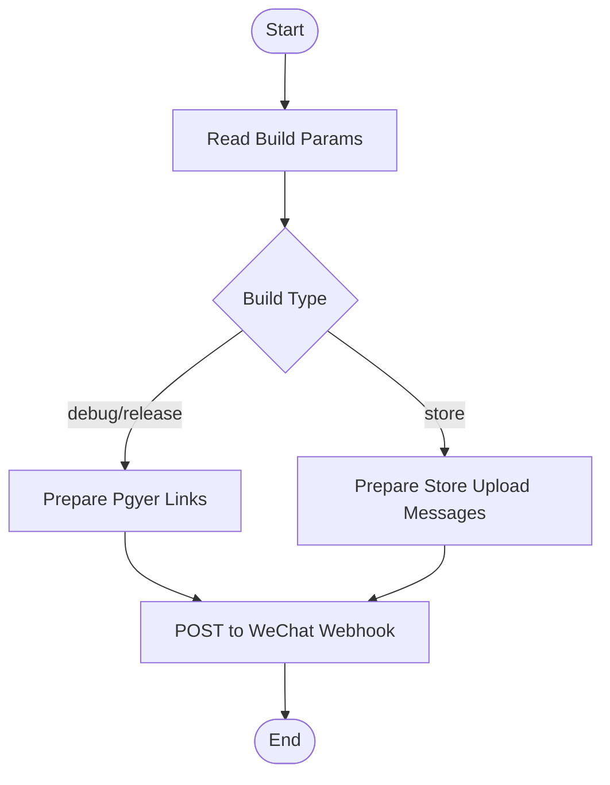
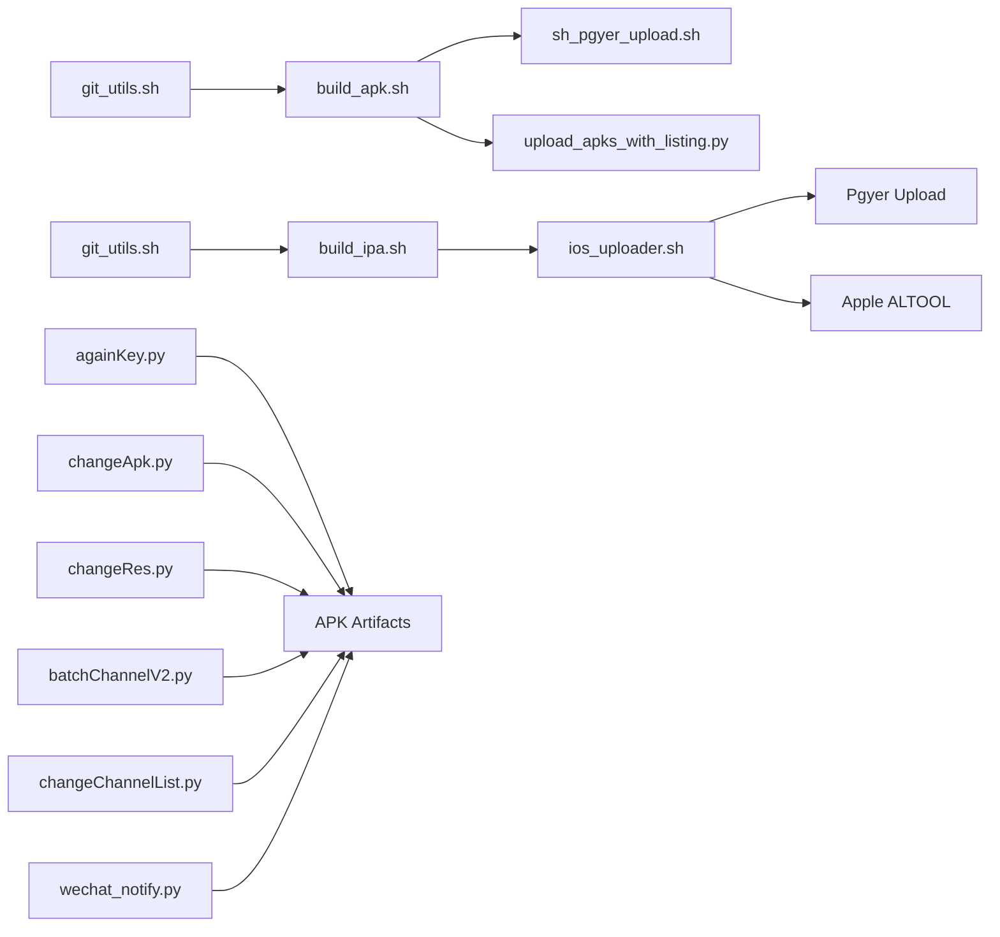

# APK Building and Packaging

<cite>
**Referenced Files in This Document**
- [README.md](file://README.md)
- [openBuild.bat](file://appBuild/openBuild.bat)
- [build_apk.sh](file://overseaBuild/build_apk.sh)
- [build_ipa.sh](file://overseaBuild/build_ipa.sh)
- [ios_uploader.sh](file://overseaBuild/ios_uploader.sh)
- [git_utils.sh](file://overseaBuild/git_utils.sh)
- [locale_package.sh](file://overseaBuild/locale_package.sh)
- [sh_pgyer_upload.sh](file://ciBuild/sh_pgyer_upload.sh)
- [upload_pgyer.py](file://ciBuild/utils/upload_pgyer.py)
- [upload_apks_with_listing.py](file://overseaBuild/upload_gp/upload_apks_with_listing.py)
- [againKey.py](file://appBuild/againBuild/againKey.py)
- [changeApk.py](file://appBuild/againBuild/changeApk.py)
- [changeRes.py](file://appBuild/againBuild/changeRes.py)
- [batchChannelV2.py](file://appBuild/DaBao/batchChannelV2.py)
- [changeChannelList.py](file://appBuild/DaBao/changeChannelList.py)
- [wechat_notify.py](file://overseaBuild/wechat_notify.py)
- [run.sh](file://mobilePerf/run.sh)
</cite>

## Table of Contents
1. [Introduction](#introduction)
2. [Project Structure](#project-structure)
3. [Core Components](#core-components)
4. [Architecture Overview](#architecture-overview)
5. [Detailed Component Analysis](#detailed-component-analysis)
6. [Dependency Analysis](#dependency-analysis)
7. [Performance Considerations](#performance-considerations)
8. [Troubleshooting Guide](#troubleshooting-guide)
9. [Conclusion](#conclusion)
10. [Appendices](#appendices)

## Introduction
This document explains the APK building and packaging capabilities present in the repository. It covers Flutter SDK integration for cross-platform builds, automated shell script workflows, Git integration for version control, and build artifact handling. It also documents the build pipeline stages from source compilation to final APK generation, configuration options for different build variants, signing requirements, optimization settings, platform-specific considerations for Android and iOS, and practical examples and troubleshooting guidance.

## Project Structure
The repository organizes build-related functionality across several directories:
- appBuild: Tools for APK manipulation and channel packaging
- overseaBuild: Cross-platform build scripts for Android APK and iOS IPA, plus Google Play upload utilities
- ciBuild: CI helpers for artifact upload to Pgyer
- mobilePerf: Performance data collection and charting scripts (contextual to build verification)
- Root README: High-level overview of tool purposes

**Section sources**
- [README.md:1-37](file://README.md#L1-L37)

## Core Components
- Android APK build and distribution via Flutter and shell scripts
- iOS IPA build and distribution via Flutter and Apple tools
- Artifact upload to Pgyer and Google Play
- Git utilities for branch operations
- APK manipulation tools (unpack, repack, resource replacement, re-signing)
- Channel packaging for Android using Walle
- WeChat notifications for build outcomes

**Section sources**
- [build_apk.sh:1-60](file://overseaBuild/build_apk.sh#L1-L60)
- [build_ipa.sh:1-74](file://overseaBuild/build_ipa.sh#L1-L74)
- [upload_apks_with_listing.py:1-198](file://overseaBuild/upload_gp/upload_apks_with_listing.py#L1-L198)
- [sh_pgyer_upload.sh:1-103](file://ciBuild/sh_pgyer_upload.sh#L1-L103)
- [git_utils.sh:1-90](file://overseaBuild/git_utils.sh#L1-L90)
- [againKey.py:1-168](file://appBuild/againBuild/againKey.py#L1-L168)
- [changeApk.py:1-39](file://appBuild/againBuild/changeApk.py#L1-L39)
- [changeRes.py:1-75](file://appBuild/againBuild/changeRes.py#L1-L75)
- [batchChannelV2.py:1-98](file://appBuild/DaBao/batchChannelV2.py#L1-L98)
- [changeChannelList.py:1-66](file://appBuild/DaBao/changeChannelList.py#L1-L66)
- [wechat_notify.py:1-146](file://overseaBuild/wechat_notify.py#L1-L146)

## Architecture Overview
The build pipeline integrates Flutter commands, platform-specific toolchains, and artifact distribution systems. The following diagram maps the primary flows for Android APK and iOS IPA builds, including upload and notification steps.

**Diagram sources**
- [build_apk.sh:1-60](file://overseaBuild/build_apk.sh#L1-L60)
- [build_ipa.sh:1-74](file://overseaBuild/build_ipa.sh#L1-L74)
- [ios_uploader.sh:1-81](file://overseaBuild/ios_uploader.sh#L1-L81)
- [sh_pgyer_upload.sh:1-103](file://ciBuild/sh_pgyer_upload.sh#L1-L103)
- [upload_apks_with_listing.py:1-198](file://overseaBuild/upload_gp/upload_apks_with_listing.py#L1-L198)
- [git_utils.sh:1-90](file://overseaBuild/git_utils.sh#L1-L90)
- [wechat_notify.py:1-146](file://overseaBuild/wechat_notify.py#L1-L146)

## Detailed Component Analysis

### Android APK Build Pipeline
The Android build script orchestrates three build modes: debug, release, and store. It uses Flutter to produce APK or AAB artifacts, optionally cleans the Flutter cache, sets Dart defines for build metadata, and uploads artifacts to Pgyer. For store builds, it uploads the AAB to Google Play via a dedicated uploader.

**Diagram sources**
- [build_apk.sh:1-60](file://overseaBuild/build_apk.sh#L1-L60)
- [upload_apks_with_listing.py:1-198](file://overseaBuild/upload_gp/upload_apks_with_listing.py#L1-L198)

**Section sources**
- [build_apk.sh:1-60](file://overseaBuild/build_apk.sh#L1-L60)
- [upload_apks_with_listing.py:1-198](file://overseaBuild/upload_gp/upload_apks_with_listing.py#L1-L198)

### iOS IPA Build Pipeline
The iOS build script supports debug, release, and store modes. It ensures pods are installed, runs Flutter build, exports ad-hoc IPAs, and uploads to Pgyer. For store builds, it validates and uploads to App Store Connect via Apple ALTOOL and can upload dSYM symbols if available.

**Diagram sources**
- [build_ipa.sh:1-74](file://overseaBuild/build_ipa.sh#L1-L74)
- [ios_uploader.sh:1-81](file://overseaBuild/ios_uploader.sh#L1-L81)

**Section sources**
- [build_ipa.sh:1-74](file://overseaBuild/build_ipa.sh#L1-L74)
- [ios_uploader.sh:1-81](file://overseaBuild/ios_uploader.sh#L1-L81)

### Git Integration Utilities
Git utilities support checking branch existence locally and remotely, cleaning working directories, fetching, switching branches, and pulling latest changes. These utilities are useful for CI or local workflows that require a clean, up-to-date repository before building.

**Diagram sources**
- [git_utils.sh:1-90](file://overseaBuild/git_utils.sh#L1-L90)

**Section sources**
- [git_utils.sh:1-90](file://overseaBuild/git_utils.sh#L1-L90)

### APK Manipulation Tools
- Re-signing: Command-line tool to sign and verify APKs with configurable keystores and SDK paths.
- Decompile/Recompile: Uses Apktool to unpack and rebuild APKs.
- Resource Replacement: Copies curated resources into launcher icons, splash screens, and module assets with strict validation of required files.
- Channel Packaging: Uses Walle to set, batch-set, and rename channel-apk outputs.

**Diagram sources**
- [againKey.py:1-168](file://appBuild/againBuild/againKey.py#L1-L168)
- [changeApk.py:1-39](file://appBuild/againBuild/changeApk.py#L1-L39)
- [changeRes.py:1-75](file://appBuild/againBuild/changeRes.py#L1-L75)
- [batchChannelV2.py:1-98](file://appBuild/DaBao/batchChannelV2.py#L1-L98)
- [changeChannelList.py:1-66](file://appBuild/DaBao/changeChannelList.py#L1-L66)

**Section sources**
- [againKey.py:1-168](file://appBuild/againBuild/againKey.py#L1-L168)
- [changeApk.py:1-39](file://appBuild/againBuild/changeApk.py#L1-L39)
- [changeRes.py:1-75](file://appBuild/againBuild/changeRes.py#L1-L75)
- [batchChannelV2.py:1-98](file://appBuild/DaBao/batchChannelV2.py#L1-L98)
- [changeChannelList.py:1-66](file://appBuild/DaBao/changeChannelList.py#L1-L66)

### CI Artifact Uploads
- Shell-based Pgyer uploader validates file type and extension, retrieves upload tokens, uploads artifacts, and polls for build info.
- Python-based Pgyer uploader encapsulates token retrieval, upload, and build info polling with robust error handling.
- Google Play AAB uploader installs dependencies, authenticates via service account, uploads bundles, translates release notes, and commits edits.

**Diagram sources**
- [sh_pgyer_upload.sh:1-103](file://ciBuild/sh_pgyer_upload.sh#L1-L103)
- [upload_pgyer.py:1-108](file://ciBuild/utils/upload_pgyer.py#L1-L108)
- [upload_apks_with_listing.py:1-198](file://overseaBuild/upload_gp/upload_apks_with_listing.py#L1-L198)

**Section sources**
- [sh_pgyer_upload.sh:1-103](file://ciBuild/sh_pgyer_upload.sh#L1-L103)
- [upload_pgyer.py:1-108](file://ciBuild/utils/upload_pgyer.py#L1-L108)
- [upload_apks_with_listing.py:1-198](file://overseaBuild/upload_gp/upload_apks_with_listing.py#L1-L198)

### Build Orchestration Script
The orchestration script collects user inputs for platform, build type, versioning, debug mode, and CI number, then invokes the app build script with mapped parameters.

**Diagram sources**
- [locale_package.sh:1-32](file://overseaBuild/locale_package.sh#L1-L32)

**Section sources**
- [locale_package.sh:1-32](file://overseaBuild/locale_package.sh#L1-L32)

### Notifications
WeChat notification script posts build outcomes, links to download pages, and optionally summarizes recent changes, supporting both Android and iOS builds.

**Diagram sources**
- [wechat_notify.py:1-146](file://overseaBuild/wechat_notify.py#L1-L146)

**Section sources**
- [wechat_notify.py:1-146](file://overseaBuild/wechat_notify.py#L1-L146)

## Dependency Analysis
The build system exhibits clear separation of concerns:
- Android: Flutter APK/AAB builds depend on Dart defines and flavor configuration; artifacts are uploaded to Pgyer or Google Play.
- iOS: Flutter IPA builds depend on CocoaPods and Xcode export options; artifacts are uploaded to Pgyer or Apple services.
- Git utilities: Support pre-build repository hygiene.
- APK manipulation: Standalone Python tools for signing, decompiling/rebuilding, resource replacement, and channel packaging.
- Notifications: Post-upload summary to team communication channels.

**Diagram sources**
- [git_utils.sh:1-90](file://overseaBuild/git_utils.sh#L1-L90)
- [build_apk.sh:1-60](file://overseaBuild/build_apk.sh#L1-L60)
- [build_ipa.sh:1-74](file://overseaBuild/build_ipa.sh#L1-L74)
- [ios_uploader.sh:1-81](file://overseaBuild/ios_uploader.sh#L1-L81)
- [sh_pgyer_upload.sh:1-103](file://ciBuild/sh_pgyer_upload.sh#L1-L103)
- [upload_apks_with_listing.py:1-198](file://overseaBuild/upload_gp/upload_apks_with_listing.py#L1-L198)
- [againKey.py:1-168](file://appBuild/againBuild/againKey.py#L1-L168)
- [changeApk.py:1-39](file://appBuild/againBuild/changeApk.py#L1-L39)
- [changeRes.py:1-75](file://appBuild/againBuild/changeRes.py#L1-L75)
- [batchChannelV2.py:1-98](file://appBuild/DaBao/batchChannelV2.py#L1-L98)
- [changeChannelList.py:1-66](file://appBuild/DaBao/changeChannelList.py#L1-L66)
- [wechat_notify.py:1-146](file://overseaBuild/wechat_notify.py#L1-L146)

**Section sources**
- [build_apk.sh:1-60](file://overseaBuild/build_apk.sh#L1-L60)
- [build_ipa.sh:1-74](file://overseaBuild/build_ipa.sh#L1-L74)
- [upload_apks_with_listing.py:1-198](file://overseaBuild/upload_gp/upload_apks_with_listing.py#L1-L198)
- [ios_uploader.sh:1-81](file://overseaBuild/ios_uploader.sh#L1-L81)
- [sh_pgyer_upload.sh:1-103](file://ciBuild/sh_pgyer_upload.sh#L1-L103)
- [againKey.py:1-168](file://appBuild/againBuild/againKey.py#L1-L168)
- [batchChannelV2.py:1-98](file://appBuild/DaBao/batchChannelV2.py#L1-L98)
- [wechat_notify.py:1-146](file://overseaBuild/wechat_notify.py#L1-L146)

## Performance Considerations
- Flutter cache management: Use explicit cleanup before release builds to avoid stale artifacts.
- Target platforms: Narrow ABI filters for AAB builds to reduce artifact size and improve upload speed.
- Debug vs release toggles: Enable debug features only when necessary to minimize overhead.
- Parallelization: Split tasks across platforms (Android/iOS) to utilize multiple machines or CI agents.
- Artifact reuse: Reuse cached dependencies where possible; ensure network reliability for dependency downloads.
- Upload retries: Implement retry logic around network-bound operations (Pgyer, Google Play, Apple ALTOOL).

[No sources needed since this section provides general guidance]

## Troubleshooting Guide
Common issues and remedies:
- Flutter build failures
  - Clear cache and regenerate dependencies before release builds.
  - Verify flavor and target platform flags match project configuration.
  - Ensure Dart defines for build metadata are correctly passed.
- Signing and verification
  - Confirm keystore paths and passwords are correct; validate with the verification step.
  - Ensure SDK path points to a valid signing tool.
- Pgyer upload errors
  - Validate file type and path; confirm API key correctness.
  - Check upload token retrieval and endpoint availability.
- Google Play upload errors
  - Ensure service account JSON is present and credentials are valid.
  - Confirm AAB path and package name correctness; verify release notes translation limits.
- Apple ALTOOL upload errors
  - Validate API key and issuer; ensure archive and export options are correct.
  - Confirm dSYM presence if symbolication is required.
- Git workflow issues
  - Use the provided utilities to clean working directories and pull latest changes before building.
- Channel packaging issues
  - Validate Walle JAR availability and correct channel names; ensure output directory permissions.

**Section sources**
- [build_apk.sh:1-60](file://overseaBuild/build_apk.sh#L1-L60)
- [build_ipa.sh:1-74](file://overseaBuild/build_ipa.sh#L1-L74)
- [againKey.py:1-168](file://appBuild/againBuild/againKey.py#L1-L168)
- [sh_pgyer_upload.sh:1-103](file://ciBuild/sh_pgyer_upload.sh#L1-L103)
- [upload_apks_with_listing.py:1-198](file://overseaBuild/upload_gp/upload_apks_with_listing.py#L1-L198)
- [ios_uploader.sh:1-81](file://overseaBuild/ios_uploader.sh#L1-L81)
- [git_utils.sh:1-90](file://overseaBuild/git_utils.sh#L1-L90)

## Conclusion
The repository provides a comprehensive, script-driven solution for building and packaging Android and iOS artifacts with Flutter. It integrates Git workflows, artifact distribution to Pgyer and Google Play, and notification mechanisms. By leveraging the provided scripts and tools, teams can automate reliable, repeatable builds across environments while maintaining flexibility for variant-specific configurations.

[No sources needed since this section summarizes without analyzing specific files]

## Appendices

### Practical Examples
- Build an Android debug APK with custom build metadata and upload to Pgyer
  - Run the Android build script with debug mode and pass version name/code, CI number, and debug flag.
  - The script compiles the APK, uploads to Pgyer, and renames the artifact.
- Build an Android release APK without debug features
  - Run the Android build script with release mode; the script cleans Flutter cache, disables debug mode, and uploads to Pgyer.
- Build an Android AAB for Google Play store submission
  - Run the Android build script with store mode; the script builds an AAB, moves it to the outputs bundle directory, and invokes the Google Play uploader with release notes.
- Build an iOS ad-hoc IPA and upload to Pgyer
  - Run the iOS build script with debug or release mode; the script builds an archive, exports an ad-hoc IPA, and uploads to Pgyer.
- Build an iOS store IPA and upload to App Store Connect
  - Run the iOS build script with store mode; the script validates and uploads the IPA via ALTOOL and uploads dSYM if available.
- Prepare a batch of channel APKs
  - Use the channel packaging tools to set or batch-set channels and rename outputs consistently.
- Modify app resources and rebuild
  - Replace launcher icons and splash images using the resource replacement tool, then rebuild and re-sign as needed.

**Section sources**
- [build_apk.sh:1-60](file://overseaBuild/build_apk.sh#L1-L60)
- [build_ipa.sh:1-74](file://overseaBuild/build_ipa.sh#L1-L74)
- [batchChannelV2.py:1-98](file://appBuild/DaBao/batchChannelV2.py#L1-L98)
- [changeChannelList.py:1-66](file://appBuild/DaBao/changeChannelList.py#L1-L66)
- [changeRes.py:1-75](file://appBuild/againBuild/changeRes.py#L1-L75)
- [againKey.py:1-168](file://appBuild/againBuild/againKey.py#L1-L168)

### Configuration Options Summary
- Build variants
  - debug: profile build with optional debug features enabled
  - release: release build with debug features disabled
  - store: production AAB build for Google Play
- Dart defines
  - BUILD_TIME: injects current timestamp
  - DEBUG_MODE: toggles debug features
  - CI_NUM: injects CI build number
  - ABI_FILTERS: narrows architectures for AAB builds
- Signing
  - Keystore type selection and SDK path override
  - Verification after signing
- Upload targets
  - Pgyer: APK/IPA upload with token-based workflow
  - Google Play: AAB upload with service account credentials and release notes translation
  - App Store Connect: IPA validation and upload via ALTOOL

**Section sources**
- [build_apk.sh:1-60](file://overseaBuild/build_apk.sh#L1-L60)
- [build_ipa.sh:1-74](file://overseaBuild/build_ipa.sh#L1-L74)
- [againKey.py:1-168](file://appBuild/againBuild/againKey.py#L1-L168)
- [upload_apks_with_listing.py:1-198](file://overseaBuild/upload_gp/upload_apks_with_listing.py#L1-L198)

### Platform-Specific Considerations
- Android
  - Use AAB for store distribution to leverage dynamic delivery and reduced download sizes.
  - Narrow ABI filters to supported architectures to optimize artifact size.
  - Ensure signing credentials and keystore paths are accessible in CI environments.
- iOS
  - Configure export options profiles for ad-hoc and App Store builds.
  - Manage provisioning profiles and certificates; ensure ALTOOL credentials are configured.
  - Upload dSYM symbols for crash symbolication.

**Section sources**
- [build_apk.sh:1-60](file://overseaBuild/build_apk.sh#L1-L60)
- [build_ipa.sh:1-74](file://overseaBuild/build_ipa.sh#L1-L74)
- [ios_uploader.sh:1-81](file://overseaBuild/ios_uploader.sh#L1-L81)

### Related Performance and Data Scripts
- Performance data processing and chart generation for post-build validation
  - The performance scripts transform collected CSV metrics into charts for analysis.

**Section sources**
- [run.sh:1-11](file://mobilePerf/run.sh#L1-L11)