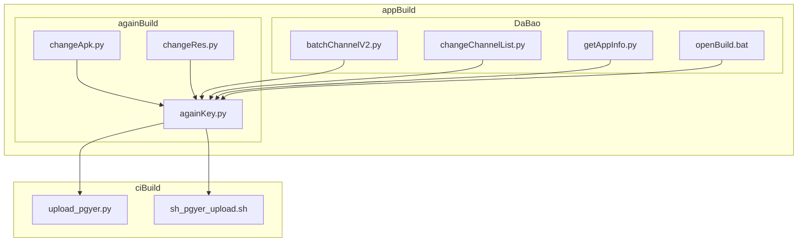
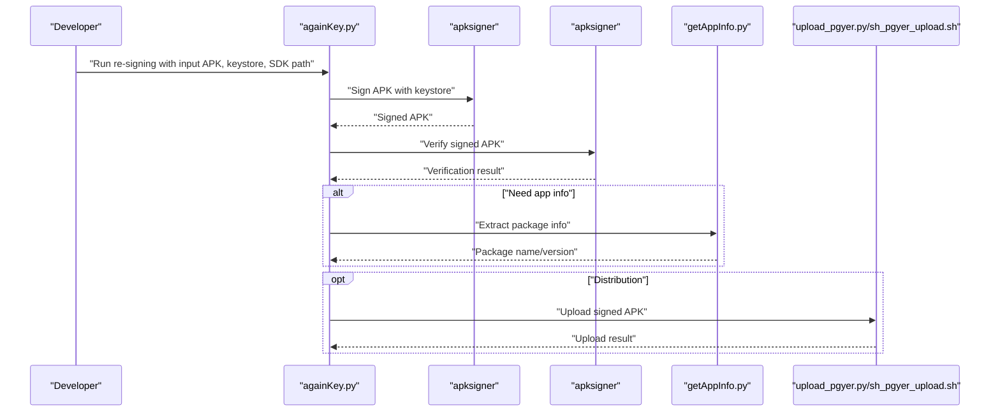
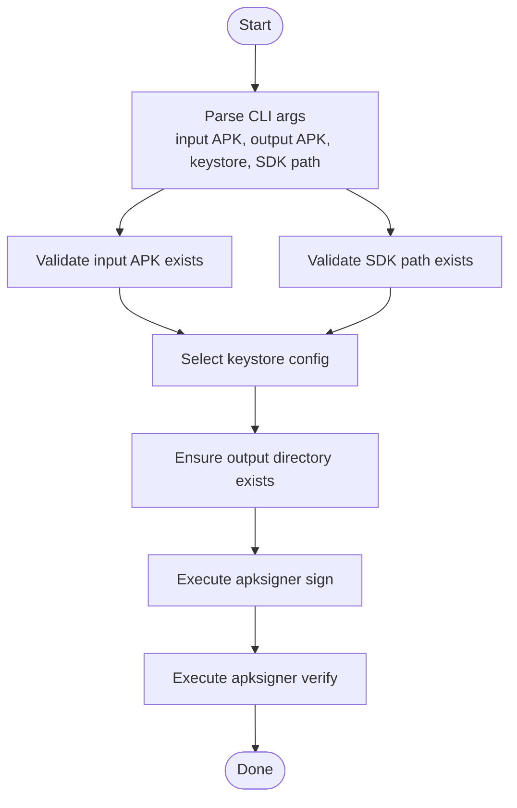
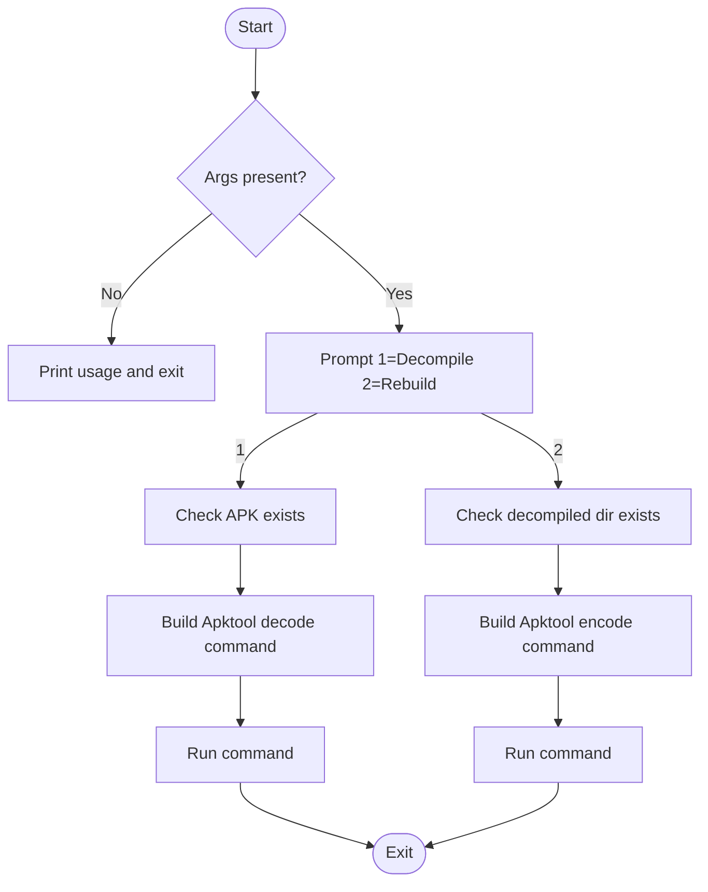
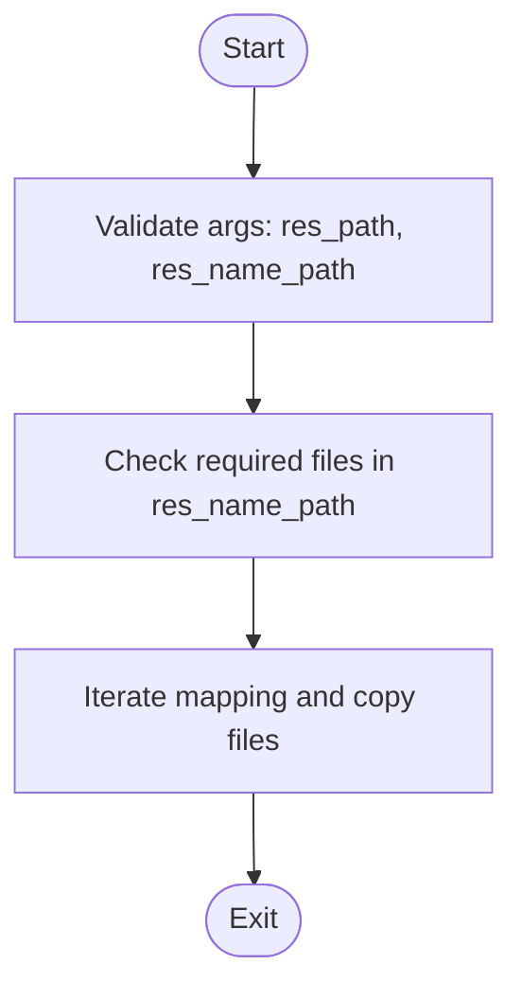
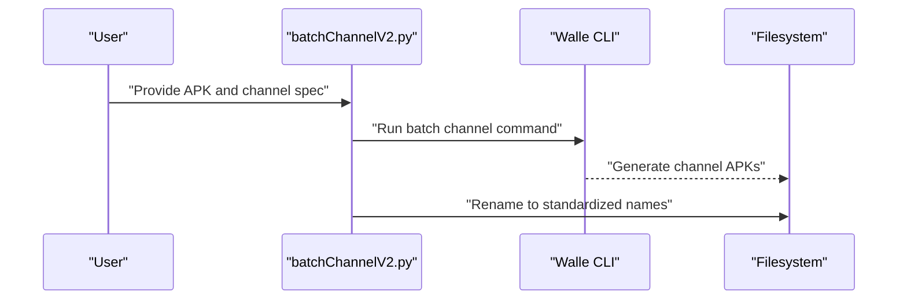
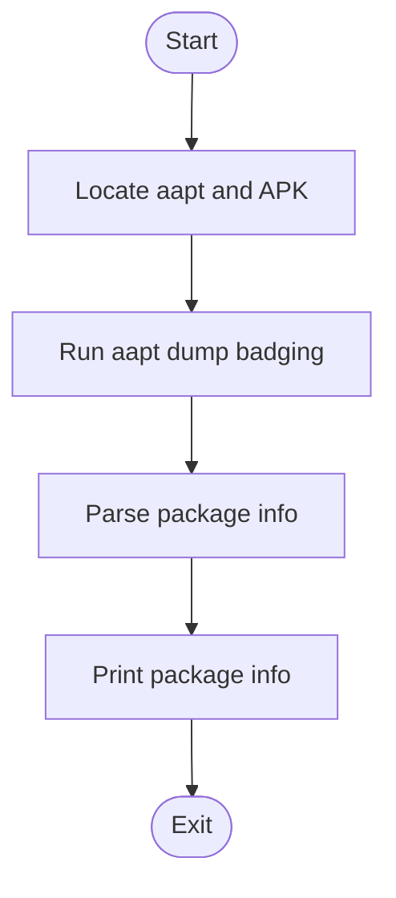
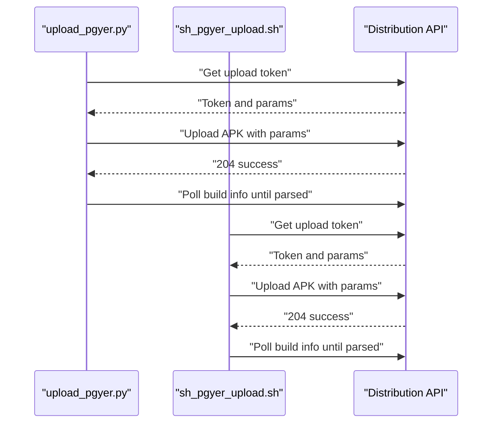
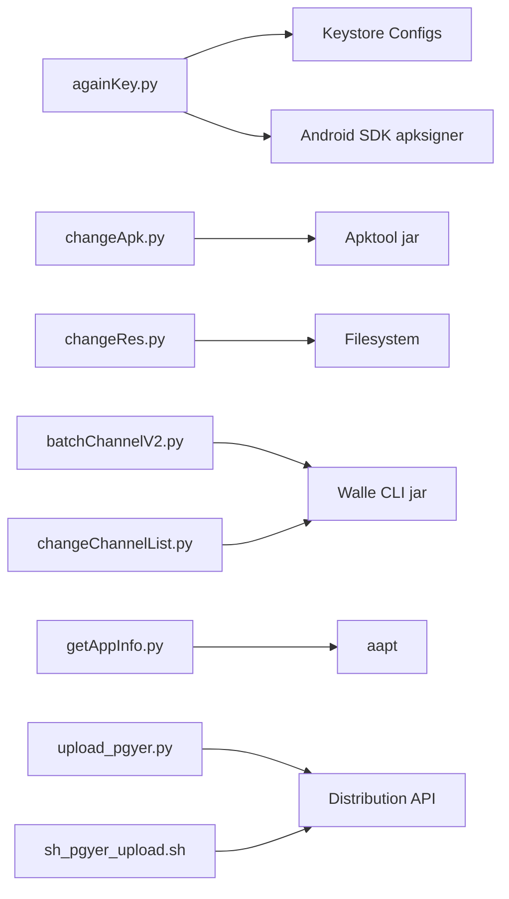

# APK Signing and Verification

<cite>
**Referenced Files in This Document**
- [againKey.py](file://appBuild/againBuild/againKey.py)
- [changeApk.py](file://appBuild/againBuild/changeApk.py)
- [changeRes.py](file://appBuild/againBuild/changeRes.py)
- [batchChannelV2.py](file://appBuild/DaBao/batchChannelV2.py)
- [changeChannelList.py](file://appBuild/DaBao/changeChannelList.py)
- [getAppInfo.py](file://appBuild/DaBao/getAppInfo.py)
- [openBuild.bat](file://appBuild/openBuild.bat)
- [upload_pgyer.py](file://ciBuild/utils/upload_pgyer.py)
- [sh_pgyer_upload.sh](file://ciBuild/sh_pgyer_upload.sh)
</cite>

## Table of Contents
1. [Introduction](#introduction)
2. [Project Structure](#project-structure)
3. [Core Components](#core-components)
4. [Architecture Overview](#architecture-overview)
5. [Detailed Component Analysis](#detailed-component-analysis)
6. [Dependency Analysis](#dependency-analysis)
7. [Performance Considerations](#performance-considerations)
8. [Troubleshooting Guide](#troubleshooting-guide)
9. [Conclusion](#conclusion)
10. [Appendices](#appendices)

## Introduction
This document explains the APK signing and verification processes implemented in the repository. It covers keystore management, re-signing of existing APKs, verification workflows, and practical procedures for channel packaging and release preparation. It also outlines security best practices for protecting signing credentials, common signing issues, and operational considerations for build environments.

## Project Structure
The repository organizes APK-related automation under appBuild and CI utilities under ciBuild. The signing and verification pipeline primarily involves:
- Re-signing tooling for APKs
- Resource replacement for app customization
- Channel packaging via Walle CLI
- Utility scripts for build environment navigation
- Upload utilities for distribution platforms

**Diagram sources**
- [againKey.py](file://appBuild/againBuild/againKey.py)
- [changeApk.py](file://appBuild/againBuild/changeApk.py)
- [changeRes.py](file://appBuild/againBuild/changeRes.py)
- [batchChannelV2.py](file://appBuild/DaBao/batchChannelV2.py)
- [changeChannelList.py](file://appBuild/DaBao/changeChannelList.py)
- [getAppInfo.py](file://appBuild/DaBao/getAppInfo.py)
- [openBuild.bat](file://appBuild/openBuild.bat)
- [upload_pgyer.py](file://ciBuild/utils/upload_pgyer.py)
- [sh_pgyer_upload.sh](file://ciBuild/sh_pgyer_upload.sh)

**Section sources**
- [openBuild.bat:1-14](file://appBuild/openBuild.bat#L1-L14)

## Core Components
- Re-signing tool: Provides keystore selection, signing, and verification of APKs using Android SDK apksigner.
- Decompile/rebuild tool: Supports unpacking and repacking APKs using Apktool.
- Resource replacement tool: Copies curated assets into specific resource paths for Flutter-based apps.
- Channel packaging tools: Batch updates embedded channel metadata using Walle CLI.
- Information extraction tool: Reads package name, version code, and version name from APKs using aapt.
- Build environment launcher: Offers quick access to the appBuild tools from a Windows batch menu.
- Upload utilities: Provide automated upload to distribution platforms via APIs.

**Section sources**
- [againKey.py:1-168](file://appBuild/againBuild/againKey.py#L1-L168)
- [changeApk.py:1-39](file://appBuild/againBuild/changeApk.py#L1-L39)
- [changeRes.py:1-72](file://appBuild/againBuild/changeRes.py#L1-L72)
- [batchChannelV2.py:1-98](file://appBuild/DaBao/batchChannelV2.py#L1-L98)
- [changeChannelList.py:1-66](file://appBuild/DaBao/changeChannelList.py#L1-L66)
- [getAppInfo.py:1-26](file://appBuild/DaBao/getAppInfo.py#L1-L26)
- [openBuild.bat:1-14](file://appBuild/openBuild.bat#L1-L14)
- [upload_pgyer.py:1-108](file://ciBuild/utils/upload_pgyer.py#L1-L108)
- [sh_pgyer_upload.sh:1-103](file://ciBuild/sh_pgyer_upload.sh#L1-L103)

## Architecture Overview
The signing and verification workflow integrates command-line tools and Python utilities. The typical flow is:
- Prepare input APK and select keystore
- Sign the APK with apksigner
- Verify the signature with apksigner
- Optionally extract app info or package channels
- Optionally upload to distribution platform

**Diagram sources**
- [againKey.py:58-96](file://appBuild/againBuild/againKey.py#L58-L96)
- [getAppInfo.py:7-21](file://appBuild/DaBao/getAppInfo.py#L7-L21)
- [upload_pgyer.py:43-85](file://ciBuild/utils/upload_pgyer.py#L43-L85)
- [sh_pgyer_upload.sh:54-102](file://ciBuild/sh_pgyer_upload.sh#L54-L102)

## Detailed Component Analysis

### Re-Signing Tool (againKey.py)
- Purpose: Re-sign an existing APK with a selected keystore and verify the result.
- Keystore management: Predefined keystore configurations with paths and passwords.
- Signing: Builds and executes an apksigner command with keystore and output parameters.
- Verification: Executes apksigner verify with verbose output.
- Error handling: Validates input files and SDK path, captures and reports subprocess errors.

**Diagram sources**
- [againKey.py:99-150](file://appBuild/againBuild/againKey.py#L99-L150)

**Section sources**
- [againKey.py:16-39](file://appBuild/againBuild/againKey.py#L16-L39)
- [againKey.py:58-96](file://appBuild/againBuild/againKey.py#L58-L96)
- [againKey.py:127-167](file://appBuild/againBuild/againKey.py#L127-L167)

### Decompile/Rebuild Tool (changeApk.py)
- Purpose: Unpack or rebuild an APK using Apktool with a fixed jar version.
- Operations:
  - Unpack: Decodes the APK to smali/main classes only.
  - Repack: Builds an APK from the unpacked directory with specified output.

**Diagram sources**
- [changeApk.py:10-34](file://appBuild/againBuild/changeApk.py#L10-L34)

**Section sources**
- [changeApk.py:1-39](file://appBuild/againBuild/changeApk.py#L1-L39)

### Resource Replacement Tool (changeRes.py)
- Purpose: Replace curated app resources (icons, splash, logos) into specific resource directories.
- Validation: Ensures required files are present and no unexpected files exist.
- Mapping: Uses a predefined mapping of source files to destination directories and filenames.

**Diagram sources**
- [changeRes.py:10-67](file://appBuild/againBuild/changeRes.py#L10-L67)

**Section sources**
- [changeRes.py:6-23](file://appBuild/againBuild/changeRes.py#L6-L23)
- [changeRes.py:44-58](file://appBuild/againBuild/changeRes.py#L44-L58)

### Channel Packaging Tools
- batchChannelV2.py: Supports show, single channel, batch channels, and sequence-based channel naming; uses Walle CLI to batch-process channels and renames outputs.
- changeChannelList.py: Generates a dated output directory, batches channels per app prefix, and renames APKs to a standardized naming convention.

**Diagram sources**
- [batchChannelV2.py:23-78](file://appBuild/DaBao/batchChannelV2.py#L23-L78)
- [changeChannelList.py:18-44](file://appBuild/DaBao/changeChannelList.py#L18-L44)

**Section sources**
- [batchChannelV2.py:1-98](file://appBuild/DaBao/batchChannelV2.py#L1-L98)
- [changeChannelList.py:1-66](file://appBuild/DaBao/changeChannelList.py#L1-L66)

### App Info Extraction (getAppInfo.py)
- Purpose: Extract package name, version code, and version name from an APK using aapt.
- Execution: Invokes aapt with dump badging and parses the output.

**Diagram sources**
- [getAppInfo.py:7-21](file://appBuild/DaBao/getAppInfo.py#L7-L21)

**Section sources**
- [getAppInfo.py:7-21](file://appBuild/DaBao/getAppInfo.py#L7-L21)

### Build Environment Launcher (openBuild.bat)
- Purpose: Presents a menu to quickly access appBuild tools (re-signing, decompile/rebuild, resource replacement, channel packaging, and info extraction).

**Section sources**
- [openBuild.bat:1-14](file://appBuild/openBuild.bat#L1-L14)

### Upload Utilities (upload_pgyer.py, sh_pgyer_upload.sh)
- Purpose: Automate uploading signed APKs to a distribution platform via API, including token acquisition, upload, and status polling.

**Diagram sources**
- [upload_pgyer.py:11-107](file://ciBuild/utils/upload_pgyer.py#L11-L107)
- [sh_pgyer_upload.sh:54-102](file://ciBuild/sh_pgyer_upload.sh#L54-L102)

**Section sources**
- [upload_pgyer.py:43-107](file://ciBuild/utils/upload_pgyer.py#L43-L107)
- [sh_pgyer_upload.sh:54-102](file://ciBuild/sh_pgyer_upload.sh#L54-L102)

## Dependency Analysis
- againKey.py depends on:
  - Keystore configuration constants
  - Android SDK apksigner for signing and verification
  - Command-line argument parsing and subprocess execution
- changeApk.py depends on:
  - Apktool jar for decompilation and rebuilding
- changeRes.py depends on:
  - Filesystem operations and resource mapping
- Channel packaging tools depend on:
  - Walle CLI jar for channel metadata embedding
- getAppInfo.py depends on:
  - aapt for APK inspection
- Upload utilities depend on:
  - Distribution API endpoints for token and upload

**Diagram sources**
- [againKey.py:29-39](file://appBuild/againBuild/againKey.py#L29-L39)
- [againKey.py](file://appBuild/againBuild/againKey.py#L42)
- [changeApk.py](file://appBuild/againBuild/changeApk.py#L7)
- [batchChannelV2.py](file://appBuild/DaBao/batchChannelV2.py#L28)
- [changeChannelList.py](file://appBuild/DaBao/changeChannelList.py#L23)
- [getAppInfo.py](file://appBuild/DaBao/getAppInfo.py#L8)
- [upload_pgyer.py](file://ciBuild/utils/upload_pgyer.py#L30)
- [sh_pgyer_upload.sh](file://ciBuild/sh_pgyer_upload.sh#L57)

**Section sources**
- [againKey.py:29-39](file://appBuild/againBuild/againKey.py#L29-L39)
- [batchChannelV2.py](file://appBuild/DaBao/batchChannelV2.py#L28)
- [changeChannelList.py](file://appBuild/DaBao/changeChannelList.py#L23)
- [getAppInfo.py](file://appBuild/DaBao/getAppInfo.py#L8)
- [upload_pgyer.py](file://ciBuild/utils/upload_pgyer.py#L30)
- [sh_pgyer_upload.sh](file://ciBuild/sh_pgyer_upload.sh#L57)

## Performance Considerations
- Minimize repeated signing/verification cycles by batching operations and avoiding unnecessary re-decompilations.
- Prefer deterministic output paths and avoid redundant filesystem writes during resource replacement.
- Use channel packaging tools to generate multiple variants efficiently in a single pass.
- Cache or reuse tokens for distribution uploads to reduce API round trips.

## Troubleshooting Guide
Common signing issues and resolutions:
- Missing or invalid SDK path:
  - Ensure the Android SDK apksigner path is correct and accessible.
  - Verify the SDK version compatibility with the target APK.
- Keystore path or password errors:
  - Confirm keystore file existence and correct password.
  - Keep keystore credentials secure and separate from source control.
- Input APK not found:
  - Validate the input APK path and permissions.
- Subprocess failures:
  - Capture stderr output and address underlying tool errors (e.g., invalid keystore, corrupted APK).
- Channel packaging failures:
  - Confirm Walle CLI jar availability and correct channel names.
- App info extraction failures:
  - Ensure aapt is available and the APK is not malformed.

Operational tips:
- Always verify signatures after re-signing.
- Maintain separate keystores for development, staging, and production.
- Store signing credentials in secure secret stores and restrict access.
- Use deterministic naming and output directories for reproducible builds.

**Section sources**
- [againKey.py:53-55](file://appBuild/againBuild/againKey.py#L53-L55)
- [againKey.py:132-136](file://appBuild/againBuild/againKey.py#L132-L136)
- [againKey.py:155-163](file://appBuild/againBuild/againKey.py#L155-L163)
- [batchChannelV2.py](file://appBuild/DaBao/batchChannelV2.py#L28)
- [getAppInfo.py:15-17](file://appBuild/DaBao/getAppInfo.py#L15-L17)

## Conclusion
The repository provides a robust, script-driven workflow for APK signing, verification, resource customization, channel packaging, and distribution. By leveraging preconfigured keystores, standardized commands, and modular utilities, teams can reliably re-sign APKs, maintain integrity, and streamline release processes. Adopting the recommended security practices and troubleshooting steps ensures a secure and efficient build environment.

## Appendices

### Practical Examples

- Signing key setup
  - Configure keystore paths and passwords in the keystore configuration dictionary.
  - Example reference: [againKey.py:29-39](file://appBuild/againBuild/againKey.py#L29-L39)

- Re-signing an APK
  - Run the re-signing script with input and output APK paths and specify the keystore type and SDK path.
  - Example reference: [againKey.py:127-150](file://appBuild/againBuild/againKey.py#L127-L150)

- Batch channel packaging
  - Use the channel packaging script to generate multiple channel variants with standardized naming.
  - Example reference: [batchChannelV2.py:56-77](file://appBuild/DaBao/batchChannelV2.py#L56-L77), [changeChannelList.py:18-44](file://appBuild/DaBao/changeChannelList.py#L18-L44)

- Verification procedure
  - After signing, verify the APK signature using the verification command.
  - Example reference: [againKey.py:93-96](file://appBuild/againBuild/againKey.py#L93-L96)

- Build environment navigation
  - Use the launcher script to access tools from a convenient menu.
  - Example reference: [openBuild.bat:1-14](file://appBuild/openBuild.bat#L1-L14)

- Upload to distribution platform
  - Use either the Python or shell upload utility to upload signed APKs.
  - Example reference: [upload_pgyer.py:43-85](file://ciBuild/utils/upload_pgyer.py#L43-L85), [sh_pgyer_upload.sh:54-102](file://ciBuild/sh_pgyer_upload.sh#L54-L102)