# Build Automation Module

<cite>
**Referenced Files in This Document**
- [batchChannelV2.py](file://appBuild/DaBao/batchChannelV2.py)
- [changeChannelList.py](file://appBuild/DaBao/changeChannelList.py)
- [getAppInfo.py](file://appBuild/DaBao/getAppInfo.py)
- [changeApk.py](file://appBuild/againBuild/changeApk.py)
- [changeRes.py](file://appBuild/againBuild/changeRes.py)
- [changeImage.py](file://appBuild/changeImage.py)
- [openBuild.bat](file://appBuild/openBuild.bat)
- [upload_pgyer.py](file://ciBuild/utils/upload_pgyer.py)
- [sh_pgyer_upload.sh](file://ciBuild/sh_pgyer_upload.sh)
- [build_apk.sh](file://overseaBuild/build_apk.sh)
- [upload_apks_with_listing.py](file://overseaBuild/upload_gp/upload_apks_with_listing.py)
- [git_utils.sh](file://overseaBuild/git_utils.sh)
- [README.md](file://README.md)
</cite>

## Table of Contents
1. [Introduction](#introduction)
2. [Project Structure](#project-structure)
3. [Core Components](#core-components)
4. [Architecture Overview](#architecture-overview)
5. [Detailed Component Analysis](#detailed-component-analysis)
6. [Dependency Analysis](#dependency-analysis)
7. [Performance Considerations](#performance-considerations)
8. [Troubleshooting Guide](#troubleshooting-guide)
9. [Security Considerations](#security-considerations)
10. [Practical Examples](#practical-examples)
11. [Conclusion](#conclusion)

## Introduction
This document describes the Build Automation Module responsible for Android APK building, channel packaging, resource modification, and related automation tasks. It integrates with the Flutter SDK for cross-platform builds, Walle CLI for channel packaging, and provides utilities for APK re-signing, resource replacement, image processing, and CI upload to distribution platforms. It also covers batch channel processing workflows, re-signing procedures, and shell scripts for automated build processes, along with configuration management, artifact handling, and version control integration.

## Project Structure
The build automation system is organized into focused modules:
- appBuild: Local build utilities for channel packaging, resource modification, APK manipulation, and image processing
- ciBuild: Continuous integration helpers for uploading artifacts to distribution platforms
- overseaBuild: Cross-platform build scripts integrating with Flutter SDK and Google Play publishing
- mobilePerf: Performance measurement and reporting tools (contextual to build environments)

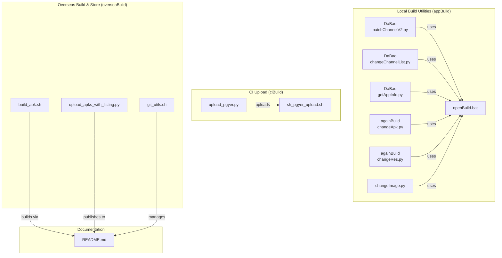

**Diagram sources**
- [batchChannelV2.py](file://appBuild/DaBao/batchChannelV2.py)
- [changeChannelList.py](file://appBuild/DaBao/changeChannelList.py)
- [getAppInfo.py](file://appBuild/DaBao/getAppInfo.py)
- [changeApk.py](file://appBuild/againBuild/changeApk.py)
- [changeRes.py](file://appBuild/againBuild/changeRes.py)
- [changeImage.py](file://appBuild/changeImage.py)
- [openBuild.bat](file://appBuild/openBuild.bat)
- [upload_pgyer.py](file://ciBuild/utils/upload_pgyer.py)
- [sh_pgyer_upload.sh](file://ciBuild/sh_pgyer_upload.sh)
- [build_apk.sh](file://overseaBuild/build_apk.sh)
- [upload_apks_with_listing.py](file://overseaBuild/upload_gp/upload_apks_with_listing.py)
- [git_utils.sh](file://overseaBuild/git_utils.sh)
- [README.md](file://README.md)

**Section sources**
- [README.md](file://README.md)

## Core Components
- Channel Packaging with Walle CLI
  - Batch channel processing, sequence-based channel generation, and output renaming
  - Support for single channel, batch channels, and configuration file-driven runs
- Resource Modification
  - Replacement of launcher icons, splash screens, logos, and webp assets inside Flutter apps
  - Validation of required asset sets prior to replacement
- APK Manipulation
  - Unpack/repack APKs using Apktool for targeted resource edits
- Image Processing
  - Bulk grayscale conversion of PNG/JPG/JPEG images
- CI Upload
  - Python and Shell wrappers to upload APK/IPA artifacts to distribution platforms
- Overseas Build and Store Publishing
  - Flutter-based Android APK/App Bundle builds with flavor and dart-define parameters
  - Automated Google Play publishing via service account credentials
- Version Control Integration
  - Git utilities to check branch existence and synchronize repositories

**Section sources**
- [batchChannelV2.py](file://appBuild/DaBao/batchChannelV2.py)
- [changeChannelList.py](file://appBuild/DaBao/changeChannelList.py)
- [getAppInfo.py](file://appBuild/DaBao/getAppInfo.py)
- [changeApk.py](file://appBuild/againBuild/changeApk.py)
- [changeRes.py](file://appBuild/againBuild/changeRes.py)
- [changeImage.py](file://appBuild/changeImage.py)
- [upload_pgyer.py](file://ciBuild/utils/upload_pgyer.py)
- [sh_pgyer_upload.sh](file://ciBuild/sh_pgyer_upload.sh)
- [build_apk.sh](file://overseaBuild/build_apk.sh)
- [upload_apks_with_listing.py](file://overseaBuild/upload_gp/upload_apks_with_listing.py)
- [git_utils.sh](file://overseaBuild/git_utils.sh)

## Architecture Overview
The build automation system orchestrates multiple tools and scripts:
- Local build scripts invoke Walle CLI for channel packaging and Apktool for unpack/repack
- CI scripts upload artifacts to distribution platforms after local builds
- Overseas build scripts integrate with Flutter SDK to produce APKs and App Bundles, optionally publishing to Google Play
- Git utilities support reproducible builds by ensuring correct branches and clean working directories

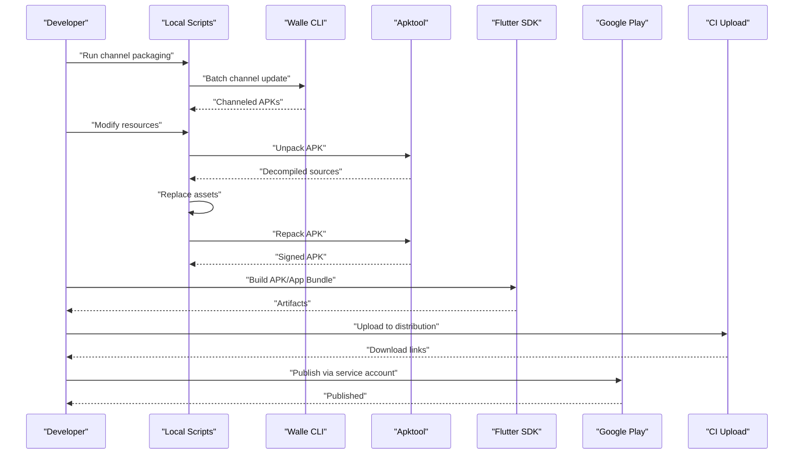

**Diagram sources**
- [batchChannelV2.py](file://appBuild/DaBao/batchChannelV2.py)
- [changeApk.py](file://appBuild/againBuild/changeApk.py)
- [build_apk.sh](file://overseaBuild/build_apk.sh)
- [upload_apks_with_listing.py](file://overseaBuild/upload_gp/upload_apks_with_listing.py)
- [sh_pgyer_upload.sh](file://ciBuild/sh_pgyer_upload.sh)

## Detailed Component Analysis

### Channel Packaging with Walle CLI
- Features
  - Show current channels, single channel update, batch channel update, and sequence-based channel generation
  - Configuration file support for batch runs
  - Automatic output directory switching and APK renaming
- Workflow
  - Parse command-line arguments to determine mode
  - Generate channel list (explicit or sequence-based)
  - Invoke Walle CLI batch mode to package channels
  - Rename output APKs to standardized naming convention

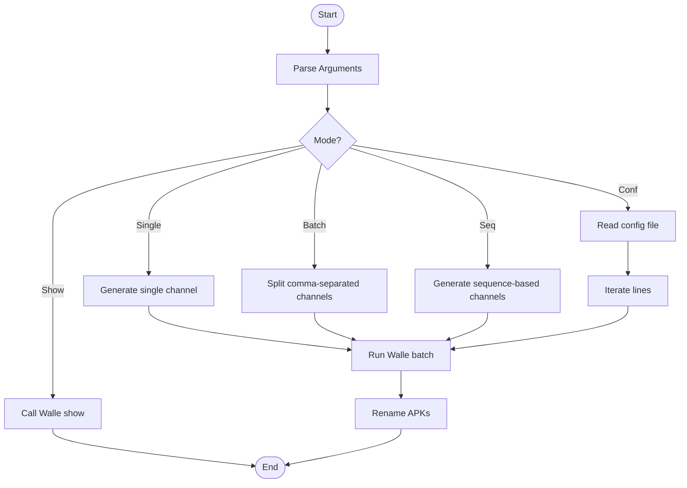

**Diagram sources**
- [batchChannelV2.py](file://appBuild/DaBao/batchChannelV2.py)

**Section sources**
- [batchChannelV2.py](file://appBuild/DaBao/batchChannelV2.py)

### Batch Channel List Packaging
- Purpose
  - Streamlined batch channel packaging with predefined channel sets per app type
  - Standardized output directory and filename normalization
- Behavior
  - Select channel list based on app name prefix
  - Package each channel via Walle CLI
  - Normalize filenames and list outputs

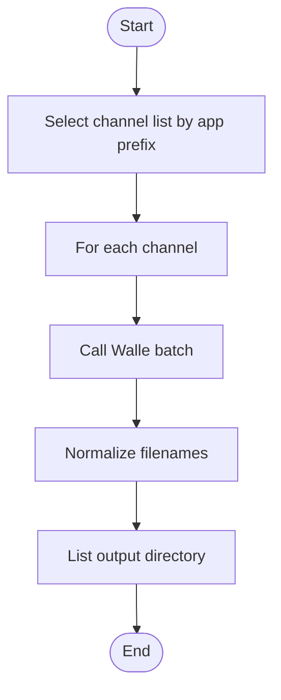

**Diagram sources**
- [changeChannelList.py](file://appBuild/DaBao/changeChannelList.py)

**Section sources**
- [changeChannelList.py](file://appBuild/DaBao/changeChannelList.py)

### APK Information Extraction
- Purpose
  - Retrieve package name, version code, and version name from an APK using aapt
- Behavior
  - Execute aapt dump badging and parse output with regular expressions
  - Raise an error if package info cannot be extracted

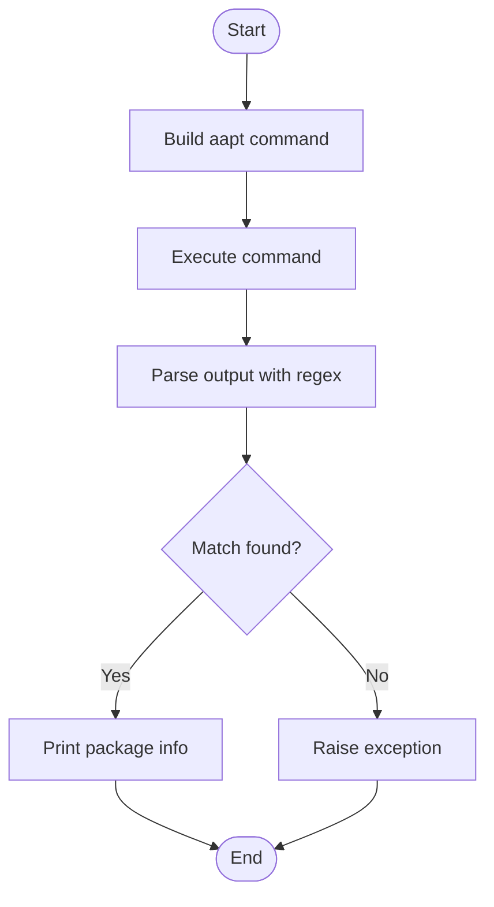

**Diagram sources**
- [getAppInfo.py](file://appBuild/DaBao/getAppInfo.py)

**Section sources**
- [getAppInfo.py](file://appBuild/DaBao/getAppInfo.py)

### APK Unpack/Repack with Apktool
- Purpose
  - Decompile APKs for resource editing and recompile after modifications
- Behavior
  - Enum-based operation selection (unpack or repack)
  - Validate target existence before proceeding
  - Execute Apktool commands with appropriate flags

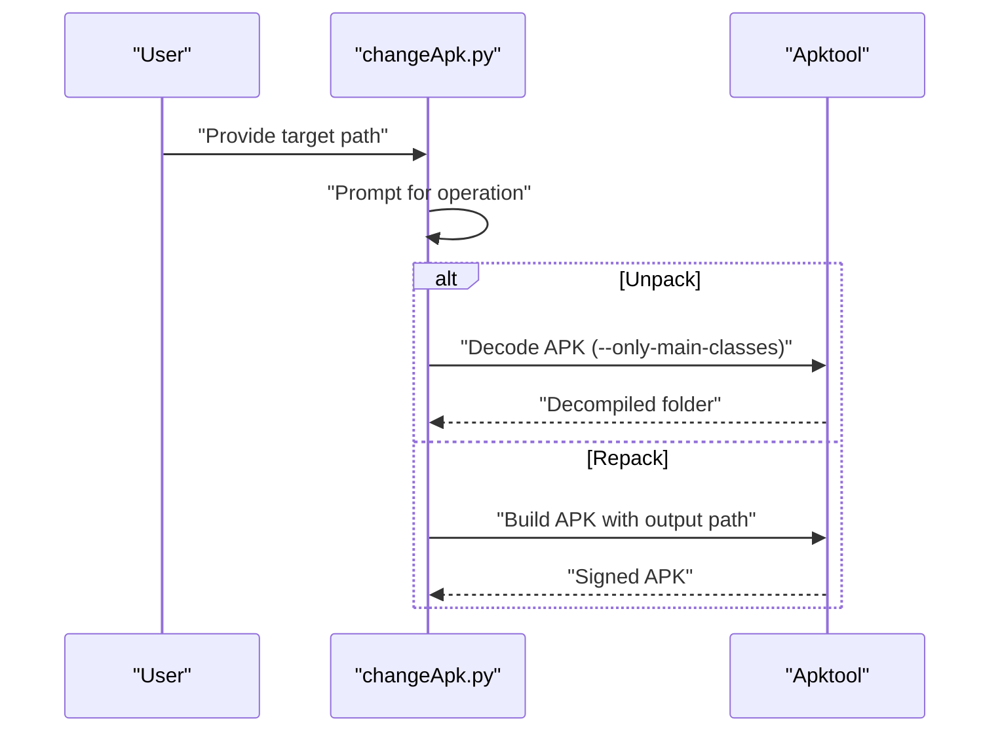

**Diagram sources**
- [changeApk.py](file://appBuild/againBuild/changeApk.py)

**Section sources**
- [changeApk.py](file://appBuild/againBuild/changeApk.py)

### Resource Modification for Flutter Apps
- Purpose
  - Replace launcher icons, splash screens, logos, and webp assets in Flutter app resources
- Behavior
  - Validate presence of required asset files
  - Copy assets to appropriate directories within the Flutter assets tree
  - Preserve file metadata during copy

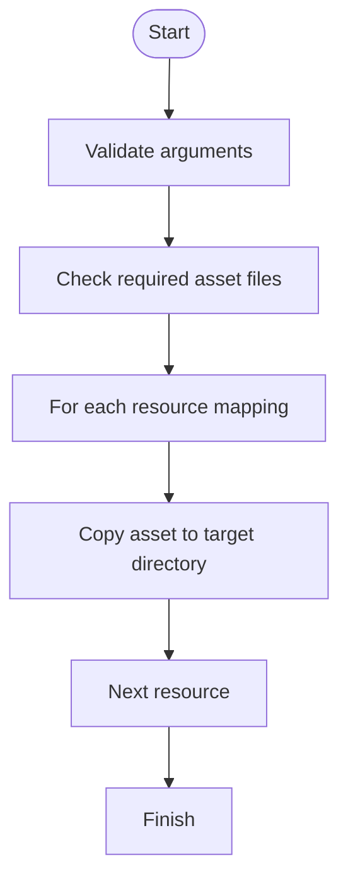

**Diagram sources**
- [changeRes.py](file://appBuild/againBuild/changeRes.py)

**Section sources**
- [changeRes.py](file://appBuild/againBuild/changeRes.py)

### Image Processing Utilities
- Purpose
  - Convert images in a directory to grayscale and save to an output directory
- Behavior
  - Discover supported image files (PNG, JPG, JPEG)
  - Process each image with error handling
  - Report totals and successes/failures

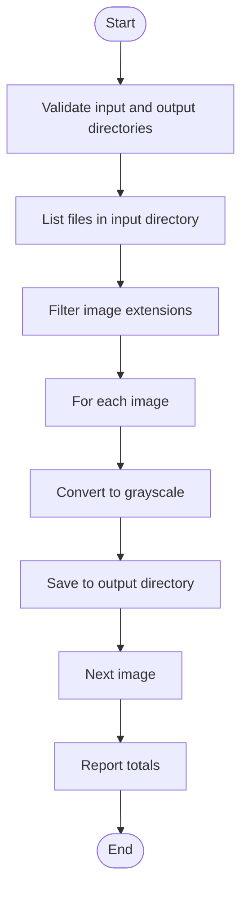

**Diagram sources**
- [changeImage.py](file://appBuild/changeImage.py)

**Section sources**
- [changeImage.py](file://appBuild/changeImage.py)

### CI Upload to Distribution Platforms
- Python Utility
  - Obtain upload token via API, upload file, and poll for build info completion
- Shell Script
  - Validate file existence and extension, obtain upload token, upload file, and poll for completion

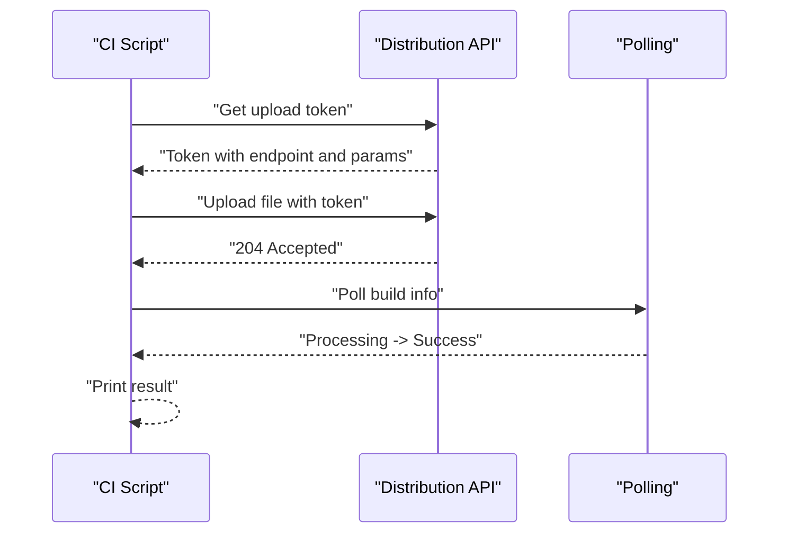

**Diagram sources**
- [upload_pgyer.py](file://ciBuild/utils/upload_pgyer.py)
- [sh_pgyer_upload.sh](file://ciBuild/sh_pgyer_upload.sh)

**Section sources**
- [upload_pgyer.py](file://ciBuild/utils/upload_pgyer.py)
- [sh_pgyer_upload.sh](file://ciBuild/sh_pgyer_upload.sh)

### Overseas Build and Store Publishing
- Flutter Build
  - Produce debug/release APKs and App Bundles with flavor and dart-define parameters
  - Optional automatic upload to distribution platform
- Google Play Publishing
  - Authenticate via service account credentials
  - Upload AAB, translate release notes, set track, and commit edits

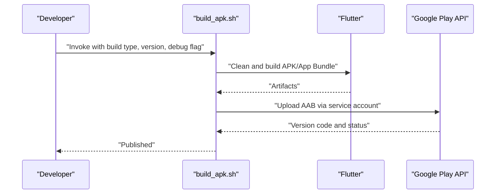

**Diagram sources**
- [build_apk.sh](file://overseaBuild/build_apk.sh)
- [upload_apks_with_listing.py](file://overseaBuild/upload_gp/upload_apks_with_listing.py)

**Section sources**
- [build_apk.sh](file://overseaBuild/build_apk.sh)
- [upload_apks_with_listing.py](file://overseaBuild/upload_gp/upload_apks_with_listing.py)

### Version Control Integration
- Functions
  - Check local/remote branch existence
  - Clean working directory and pull latest changes for a given branch

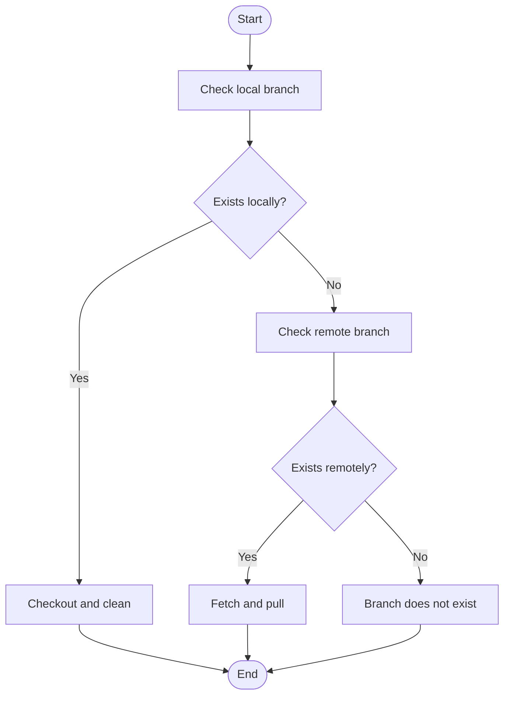

**Diagram sources**
- [git_utils.sh](file://overseaBuild/git_utils.sh)

**Section sources**
- [git_utils.sh](file://overseaBuild/git_utils.sh)

## Dependency Analysis
- Internal Dependencies
  - Local scripts depend on external tools (Walle CLI, Apktool, aapt) and Python/Shell runtime
  - CI scripts depend on distribution APIs and network connectivity
  - Overseas build scripts depend on Flutter SDK and Google Play APIs
- External Dependencies
  - Walle CLI for channel packaging
  - Apktool for unpack/repack
  - aapt for APK metadata extraction
  - Requests library for Python CI uploads
  - Flutter SDK for cross-platform builds
  - Google Play Developer API for publishing

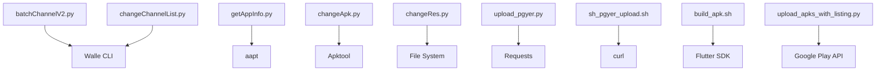

**Diagram sources**
- [batchChannelV2.py](file://appBuild/DaBao/batchChannelV2.py)
- [changeChannelList.py](file://appBuild/DaBao/changeChannelList.py)
- [getAppInfo.py](file://appBuild/DaBao/getAppInfo.py)
- [changeApk.py](file://appBuild/againBuild/changeApk.py)
- [changeRes.py](file://appBuild/againBuild/changeRes.py)
- [upload_pgyer.py](file://ciBuild/utils/upload_pgyer.py)
- [sh_pgyer_upload.sh](file://ciBuild/sh_pgyer_upload.sh)
- [build_apk.sh](file://overseaBuild/build_apk.sh)
- [upload_apks_with_listing.py](file://overseaBuild/upload_gp/upload_apks_with_listing.py)

## Performance Considerations
- Minimize repeated unpack/repack cycles to reduce build time
- Use sequence-based channel generation to avoid redundant Walle invocations
- Parallelize independent tasks (image processing, resource replacement) where safe
- Cache and reuse intermediate artifacts (e.g., decompiled folders) when appropriate
- Optimize CI polling intervals and handle transient network errors gracefully

## Troubleshooting Guide
- Channel Packaging Failures
  - Verify Walle CLI availability and correct arguments
  - Ensure output directory permissions and free disk space
- Resource Replacement Errors
  - Confirm required asset files exist and match expected names
  - Check target directories exist or are creatable
- APK Unpack/Repack Issues
  - Validate target path exists and is accessible
  - Review Apktool logs for dex-related warnings and adjust flags accordingly
- CI Upload Problems
  - Check API keys and network connectivity
  - Inspect upload token retrieval and upload response codes
- Flutter Build Failures
  - Ensure Flutter SDK is installed and up-to-date
  - Verify flavor and dart-define parameters are correct
- Google Play Publishing Errors
  - Confirm service account credentials and permissions
  - Validate AAB path and release notes length limits

**Section sources**
- [batchChannelV2.py](file://appBuild/DaBao/batchChannelV2.py)
- [changeRes.py](file://appBuild/againBuild/changeRes.py)
- [changeApk.py](file://appBuild/againBuild/changeApk.py)
- [upload_pgyer.py](file://ciBuild/utils/upload_pgyer.py)
- [sh_pgyer_upload.sh](file://ciBuild/sh_pgyer_upload.sh)
- [build_apk.sh](file://overseaBuild/build_apk.sh)
- [upload_apks_with_listing.py](file://overseaBuild/upload_gp/upload_apks_with_listing.py)

## Security Considerations
- Protect Signing Keys and Credentials
  - Store keystore files and service account JSON securely (prefer encrypted storage or secret managers)
  - Limit access to build machines and CI runners
- Secure API Keys
  - Avoid hardcoding API keys; use environment variables or secure vaults
- Least Privilege Access
  - Grant minimal permissions required for CI and store publishing
- Audit and Rotation
  - Regularly rotate keys and review access logs

## Practical Examples
- Batch Channel Packaging
  - Single channel: provide APK path and channel name
  - Multiple channels: provide a comma-separated list
  - Sequence-based channels: specify base name and start/end indices
  - Configuration file: provide a file with one run per line
- Resource Modification
  - Prepare a directory containing required assets and run the resource replacement script with source and target paths
- APK Unpack/Repack
  - Choose operation and provide the APK or decompiled folder path
- CI Upload
  - Use the Python utility or Shell script with the artifact path and API key
- Overseas Build
  - Invoke the build script with build type, version name/code, debug flag, release notes, and CI number; optionally publish to Google Play

**Section sources**
- [batchChannelV2.py](file://appBuild/DaBao/batchChannelV2.py)
- [changeChannelList.py](file://appBuild/DaBao/changeChannelList.py)
- [changeRes.py](file://appBuild/againBuild/changeRes.py)
- [changeApk.py](file://appBuild/againBuild/changeApk.py)
- [sh_pgyer_upload.sh](file://ciBuild/sh_pgyer_upload.sh)
- [build_apk.sh](file://overseaBuild/build_apk.sh)

## Conclusion
The Build Automation Module provides a comprehensive toolkit for Android build automation, including channel packaging, resource modification, APK manipulation, image processing, CI uploads, and overseas builds with store publishing. By leveraging Walle CLI, Apktool, Flutter SDK, and distribution APIs, teams can streamline repetitive tasks, improve consistency, and accelerate delivery. Proper configuration management, artifact handling, and security practices are essential for reliable and secure operations.