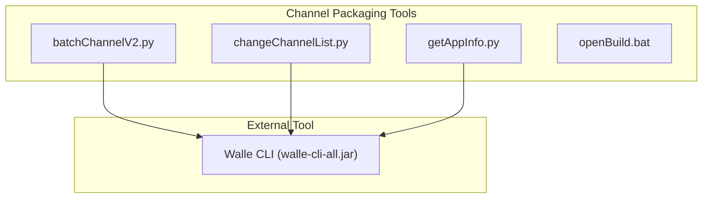
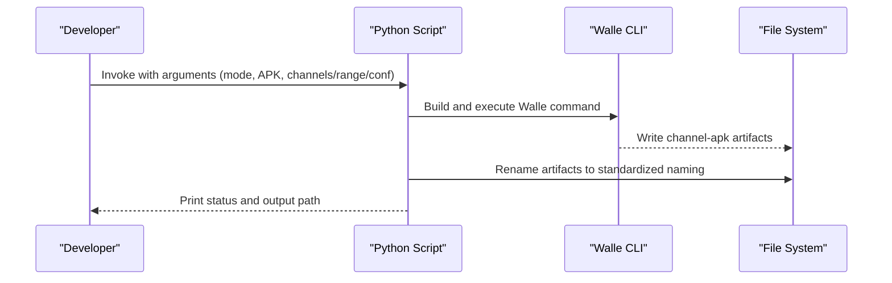
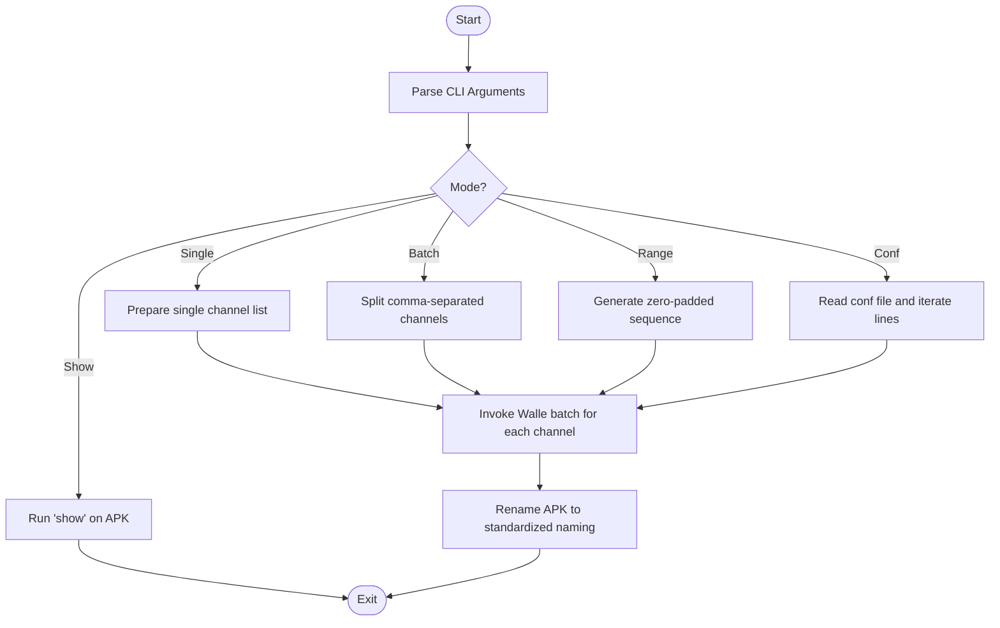
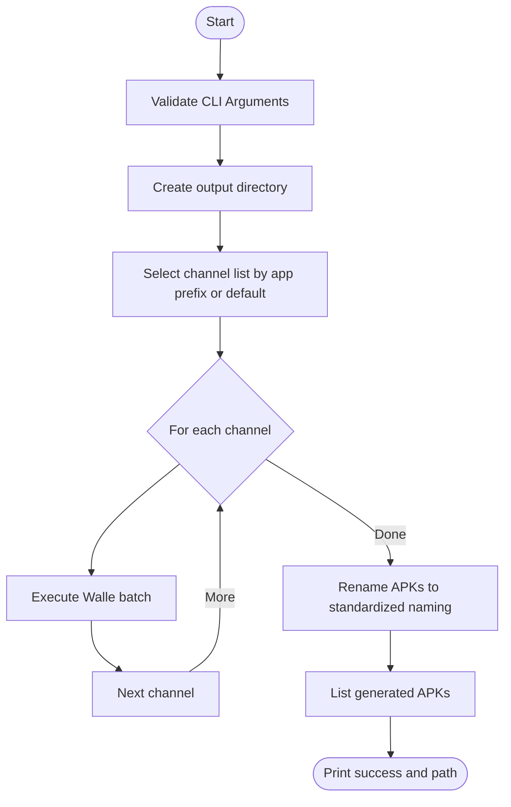
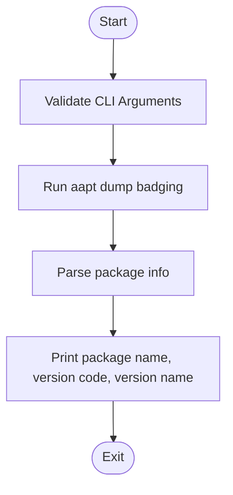
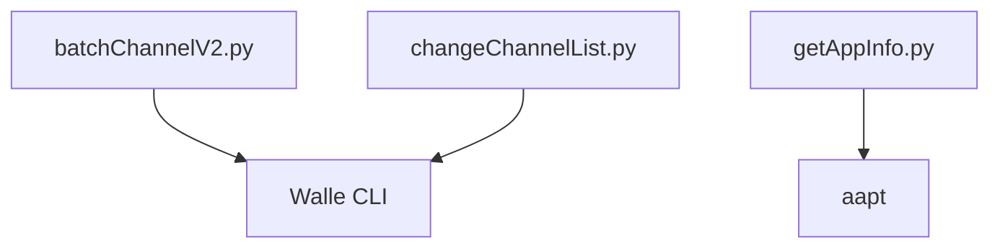

# Channel Packaging

<cite>
**Referenced Files in This Document**
- [batchChannelV2.py](file://appBuild/DaBao/batchChannelV2.py)
- [changeChannelList.py](file://appBuild/DaBao/changeChannelList.py)
- [getAppInfo.py](file://appBuild/DaBao/getAppInfo.py)
- [openBuild.bat](file://appBuild/openBuild.bat)
- [README.md](file://README.md)
</cite>

## Table of Contents
1. [Introduction](#introduction)
2. [Project Structure](#project-structure)
3. [Core Components](#core-components)
4. [Architecture Overview](#architecture-overview)
5. [Detailed Component Analysis](#detailed-component-analysis)
6. [Dependency Analysis](#dependency-analysis)
7. [Performance Considerations](#performance-considerations)
8. [Troubleshooting Guide](#troubleshooting-guide)
9. [Conclusion](#conclusion)
10. [Appendices](#appendices)

## Introduction
This document explains the channel packaging functionality built around Walle CLI within the repository. It covers:
- Batch channel processing workflows
- Single channel packaging
- Batch channel operations
- Sequential channel numbering
- Command-line interface modes: show channels, single channel, batch channels, and sequential ranges
- Configuration file support for batch operations
- Automatic renaming of generated APK files
- Practical examples, error handling, common scenarios, troubleshooting, and performance optimization tips

The repository provides two primary Python scripts that orchestrate channel packaging using Walle CLI, along with a helper script to inspect APK metadata and a launcher batch script for developer convenience.

## Project Structure
The channel packaging functionality resides primarily under appBuild/DaBao:
- batchChannelV2.py: Full-featured CLI for channel operations including show, single, batch, sequential ranges, and configuration file support
- changeChannelList.py: Batch channel packaging with automatic APK renaming and configurable channel sets
- getAppInfo.py: Utility to extract package name, version code, and version name from an APK using aapt
- openBuild.bat: Developer launcher to list available build tools and navigate to the appBuild directory

**Diagram sources**
- [batchChannelV2.py:1-98](file://appBuild/DaBao/batchChannelV2.py#L1-L98)
- [changeChannelList.py:1-66](file://appBuild/DaBao/changeChannelList.py#L1-L66)
- [getAppInfo.py:1-26](file://appBuild/DaBao/getAppInfo.py#L1-L26)
- [openBuild.bat:1-14](file://appBuild/openBuild.bat#L1-L14)

**Section sources**
- [README.md:11-17](file://README.md#L11-L17)
- [openBuild.bat:1-14](file://appBuild/openBuild.bat#L1-L14)

## Core Components
- batchChannelV2.py
  - Supports multiple modes:
    - Show channels: displays channel information for an APK
    - Single channel: packages a single channel into a new APK
    - Batch channels: packages multiple comma-separated channels
    - Sequential ranges: generates numbered channels within a range
    - Configuration file mode: reads channel definitions from a file and executes each line as a separate command
  - Automatically renames generated APKs to a standardized naming convention
- changeChannelList.py
  - Executes batch channel packaging with a fixed output path and date stamp
  - Renames generated APKs to a standardized naming scheme
  - Provides configurable channel lists based on app prefixes
- getAppInfo.py
  - Extracts package name, version code, and version name from an APK using aapt
- openBuild.bat
  - Developer launcher to list available tools and navigate to the appBuild directory

**Section sources**
- [batchChannelV2.py:4-17](file://appBuild/DaBao/batchChannelV2.py#L4-L17)
- [batchChannelV2.py:23-98](file://appBuild/DaBao/batchChannelV2.py#L23-L98)
- [changeChannelList.py:17-66](file://appBuild/DaBao/changeChannelList.py#L17-L66)
- [getAppInfo.py:6-22](file://appBuild/DaBao/getAppInfo.py#L6-L22)
- [README.md:11-17](file://README.md#L11-L17)

## Architecture Overview
The channel packaging pipeline integrates Python orchestration with Walle CLI. The scripts parse command-line arguments, construct Walle commands, execute them, and then rename the resulting APKs to a consistent format.

**Diagram sources**
- [batchChannelV2.py:23-98](file://appBuild/DaBao/batchChannelV2.py#L23-L98)
- [changeChannelList.py:17-66](file://appBuild/DaBao/changeChannelList.py#L17-L66)

## Detailed Component Analysis

### batchChannelV2.py
This script implements a comprehensive CLI for channel packaging with multiple operational modes.

- Modes and CLI
  - Show channels: python batchChannelV2.py show <apk>
  - Single channel: python batchChannelV2.py <apk> <channel_name>
  - Batch channels: python batchChannelV2.py <apk> <channel_name1,channel_name2,...>
  - Sequential ranges: python batchChannelV2.py <apk> <channel_name> <start> <end>
  - Configuration file: python batchChannelV2.py <apk> -f <conf_file>
- Processing logic
  - Parses arguments to determine mode and channel set
  - Generates sequential channel names with zero-padded suffixes when a range is provided
  - Invokes Walle batch mode for each channel individually
  - Renames generated APKs to a standardized naming convention
- Automatic renaming
  - Constructs a base name from the original APK filename
  - Splits the generated name by hyphens, replaces the channel segment, and rebuilds the filename
  - Uses a move operation to rename the file

**Diagram sources**
- [batchChannelV2.py:23-98](file://appBuild/DaBao/batchChannelV2.py#L23-L98)

**Section sources**
- [batchChannelV2.py:4-17](file://appBuild/DaBao/batchChannelV2.py#L4-L17)
- [batchChannelV2.py:23-98](file://appBuild/DaBao/batchChannelV2.py#L23-L98)

### changeChannelList.py
This script focuses on batch channel packaging with automatic output path construction and standardized APK renaming.

- CLI
  - python changeChannelList.py <apkPath> <apkName> <appVersion> <CPU>
- Behavior
  - Creates an output directory with a date-stamped path
  - Executes Walle batch mode for each channel in a predefined list
  - Renames each generated APK to a standardized naming scheme
  - Prints the list of generated APKs and a success message
- Channel configuration
  - Defines channel sets for specific app prefixes
  - Falls back to a default channel list if no prefix matches

**Diagram sources**
- [changeChannelList.py:17-66](file://appBuild/DaBao/changeChannelList.py#L17-L66)

**Section sources**
- [changeChannelList.py:6-29](file://appBuild/DaBao/changeChannelList.py#L6-L29)
- [changeChannelList.py:31-66](file://appBuild/DaBao/changeChannelList.py#L31-L66)

### getAppInfo.py
Utility to inspect APK metadata using aapt.

- CLI
  - python getAppInfo.py <apk>
- Behavior
  - Executes aapt dump badging on the APK
  - Parses package name, version code, and version name
  - Prints the extracted information

**Diagram sources**
- [getAppInfo.py:6-22](file://appBuild/DaBao/getAppInfo.py#L6-L22)

**Section sources**
- [getAppInfo.py:6-22](file://appBuild/DaBao/getAppInfo.py#L6-L22)

### openBuild.bat
Developer launcher to list available tools and navigate to the appBuild directory.

- Behavior
  - Prints a menu of available tools
  - Navigates to the appBuild directory for convenient execution

**Section sources**
- [openBuild.bat:1-14](file://appBuild/openBuild.bat#L1-L14)

## Dependency Analysis
- Internal dependencies
  - batchChannelV2.py and changeChannelList.py both depend on Walle CLI (walle-cli-all.jar) for channel packaging
  - getAppInfo.py depends on aapt for APK metadata extraction
- External dependencies
  - Walle CLI jar must be present and executable
  - aapt must be installed and accessible at the configured path
- Coupling and cohesion
  - Scripts are cohesive around channel packaging tasks and have minimal cross-script coupling
  - Both scripts rely on the same external tooling, which centralizes configuration concerns

**Diagram sources**
- [batchChannelV2.py:27-64](file://appBuild/DaBao/batchChannelV2.py#L27-L64)
- [changeChannelList.py:22-24](file://appBuild/DaBao/changeChannelList.py#L22-L24)
- [getAppInfo.py:8-12](file://appBuild/DaBao/getAppInfo.py#L8-L12)

**Section sources**
- [batchChannelV2.py:19-20](file://appBuild/DaBao/batchChannelV2.py#L19-L20)
- [changeChannelList.py:1-3](file://appBuild/DaBao/changeChannelList.py#L1-L3)
- [getAppInfo.py:1-3](file://appBuild/DaBao/getAppInfo.py#L1-L3)

## Performance Considerations
- Batch execution granularity
  - batchChannelV2.py processes each channel individually, which simplifies error isolation but may increase total runtime compared to a single batch with multiple channels
  - changeChannelList.py iterates channels sequentially and writes to a single output directory
- Sequential numbering
  - Zero-padding ensures consistent lexicographic ordering when listing files
- File operations
  - Using move operations avoids unnecessary copies and reduces disk usage
- Output path management
  - changeChannelList.py creates a date-stamped output directory, preventing conflicts and aiding organization

[No sources needed since this section provides general guidance]

## Troubleshooting Guide
- Walle CLI not found
  - Ensure walle-cli-all.jar is present and accessible from the working directory or adjust the command accordingly
- aapt not found
  - Verify the aapt path in getAppInfo.py matches the installed toolchain
- Incorrect arguments
  - Refer to usage messages printed by the scripts for correct CLI formats
- Channel naming issues
  - batchChannelV2.py constructs filenames by splitting and rejoining segments; ensure the generated intermediate names match expectations
  - changeChannelList.py expects a specific naming pattern; verify that the APK naming aligns with the parser logic
- Permission errors
  - Ensure write permissions in the output directory and execute permissions for the scripts
- Batch configuration file
  - Lines starting with comments are ignored; ensure each non-comment line contains valid arguments for the script

**Section sources**
- [batchChannelV2.py:25-29](file://appBuild/DaBao/batchChannelV2.py#L25-L29)
- [batchChannelV2.py:66-77](file://appBuild/DaBao/batchChannelV2.py#L66-L77)
- [changeChannelList.py:31-44](file://appBuild/DaBao/changeChannelList.py#L31-L44)
- [getAppInfo.py:8-17](file://appBuild/DaBao/getAppInfo.py#L8-L17)

## Conclusion
The channel packaging tools in this repository provide flexible, script-driven workflows for managing Android app channels using Walle CLI. They support single-channel, batch-channel, and sequential-numbered channel packaging, with automatic APK renaming and optional configuration file support. The getAppInfo utility complements these workflows by extracting essential APK metadata. By following the documented CLI modes and troubleshooting steps, teams can reliably package channels at scale while maintaining consistent naming and organization.

[No sources needed since this section summarizes without analyzing specific files]

## Appendices

### Command-Line Reference
- Show channels
  - python batchChannelV2.py show <apk>
- Single channel
  - python batchChannelV2.py <apk> <channel_name>
- Batch channels
  - python batchChannelV2.py <apk> <channel_name1,channel_name2,...>
- Sequential ranges
  - python batchChannelV2.py <apk> <channel_name> <start> <end>
- Configuration file
  - python batchChannelV2.py <apk> -f <conf_file>
- Batch channel list (with output path)
  - python changeChannelList.py <apkPath> <apkName> <appVersion> <CPU>
- APK info
  - python getAppInfo.py <apk>

**Section sources**
- [batchChannelV2.py:4-17](file://appBuild/DaBao/batchChannelV2.py#L4-L17)
- [changeChannelList.py:6-14](file://appBuild/DaBao/changeChannelList.py#L6-L14)
- [getAppInfo.py:6-22](file://appBuild/DaBao/getAppInfo.py#L6-L22)

### Channel Naming Conventions
- Standardized APK naming
  - batchChannelV2.py: Renames generated APKs by reconstructing the filename from segments and replacing the channel identifier
  - changeChannelList.py: Produces filenames combining the original prefix, channel, and a release suffix derived from the CPU parameter
- Sequential numbering
  - Zero-padded suffixes ensure consistent ordering when listing files

**Section sources**
- [batchChannelV2.py:66-77](file://appBuild/DaBao/batchChannelV2.py#L66-L77)
- [changeChannelList.py:31-44](file://appBuild/DaBao/changeChannelList.py#L31-L44)

### Practical Workflows
- Single channel packaging
  - Use the single channel mode to quickly generate a channel-specific APK
- Batch channel packaging
  - Use the batch mode to generate multiple channels in one invocation
- Sequential channel numbering
  - Use the sequential range mode to generate numbered channels efficiently
- Configuration file batching
  - Use the configuration file mode to define multiple channel sets and execute them in sequence
- Output organization
  - changeChannelList.py automatically organizes outputs into a date-stamped directory

**Section sources**
- [batchChannelV2.py:31-54](file://appBuild/DaBao/batchChannelV2.py#L31-L54)
- [batchChannelV2.py:80-98](file://appBuild/DaBao/batchChannelV2.py#L80-L98)
- [changeChannelList.py:17-29](file://appBuild/DaBao/changeChannelList.py#L17-L29)