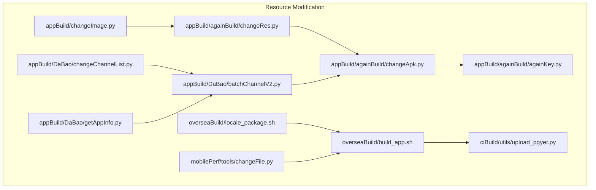
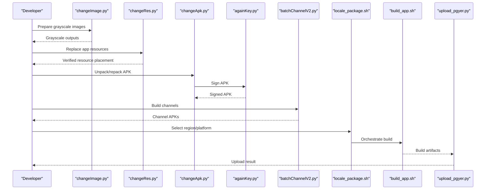
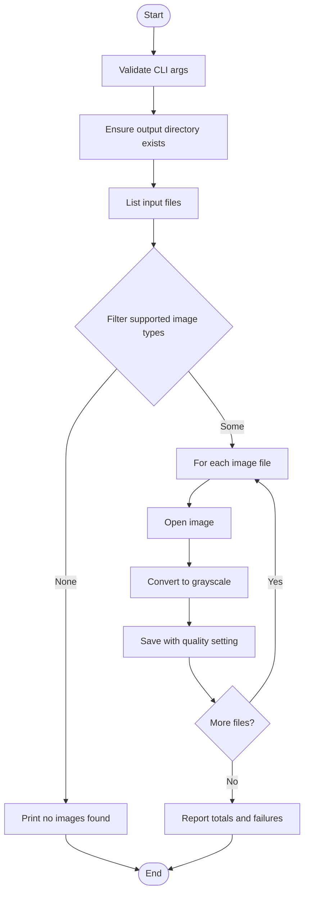
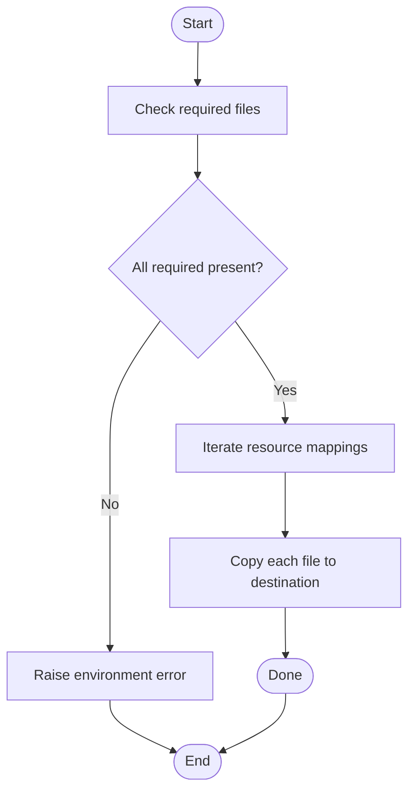
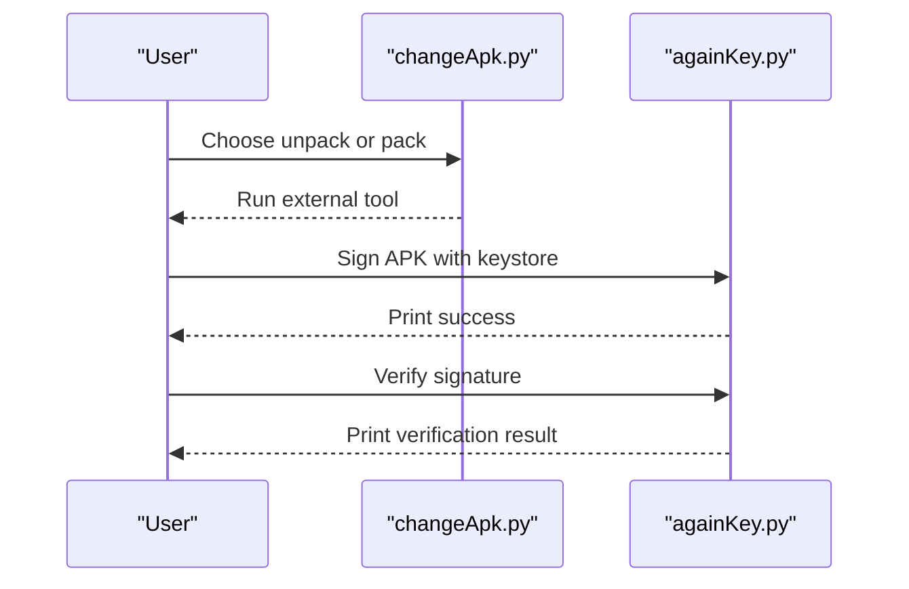
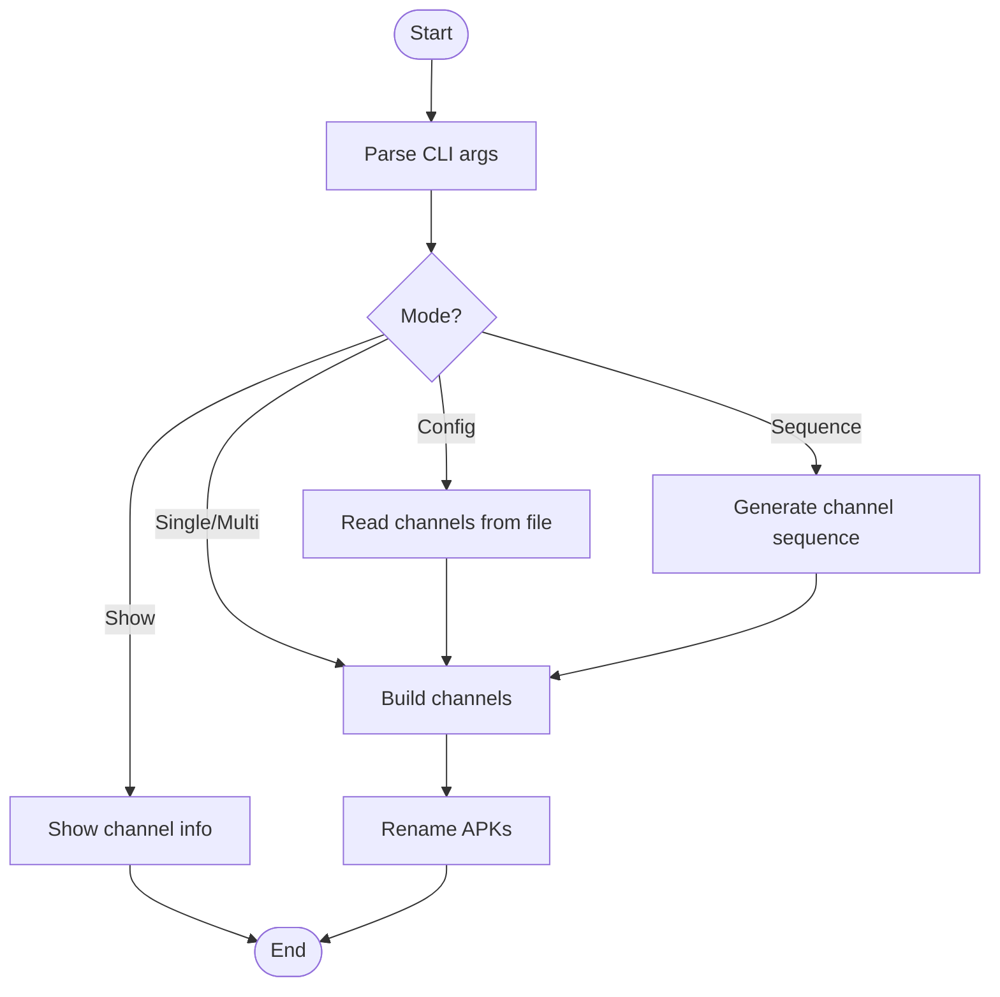
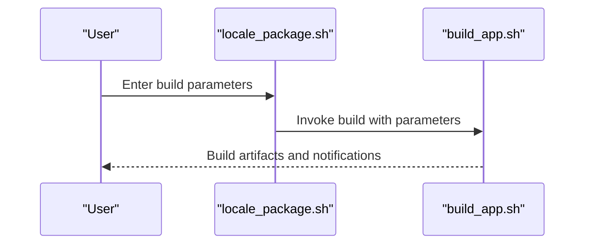
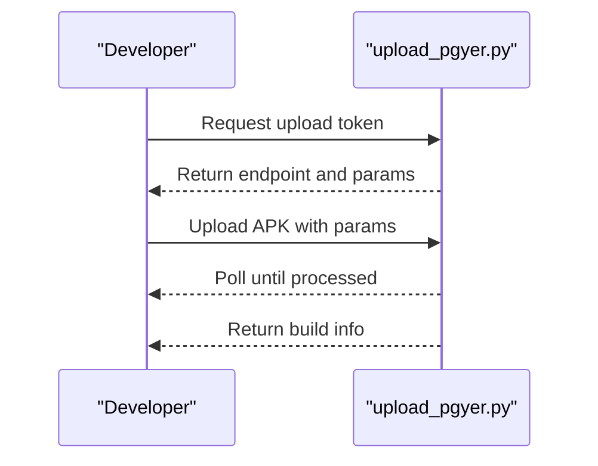
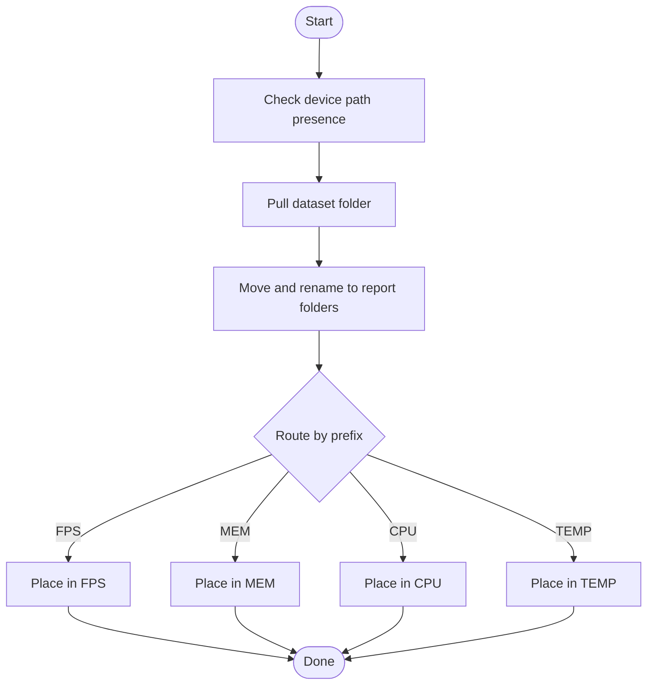
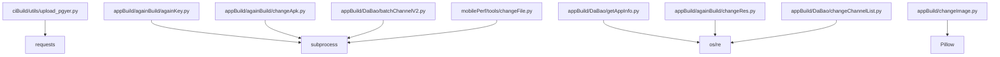

# Resource Modification

<cite>
**Referenced Files in This Document**
- [README.md](file://README.md)
- [changeImage.py](file://appBuild/changeImage.py)
- [changeRes.py](file://appBuild/againBuild/changeRes.py)
- [changeApk.py](file://appBuild/againBuild/changeApk.py)
- [againKey.py](file://appBuild/againBuild/againKey.py)
- [batchChannelV2.py](file://appBuild/DaBao/batchChannelV2.py)
- [changeChannelList.py](file://appBuild/DaBao/changeChannelList.py)
- [getAppInfo.py](file://appBuild/DaBao/getAppInfo.py)
- [locale_package.sh](file://overseaBuild/locale_package.sh)
- [build_app.sh](file://overseaBuild/build_app.sh)
- [upload_pgyer.py](file://ciBuild/utils/upload_pgyer.py)
- [changeFile.py](file://mobilePerf/tools/changeFile.py)
- [config.py](file://mobilePerf/perfCode/common/config.py)
- [utils.py](file://mobilePerf/perfCode/common/utils.py)
</cite>

## Table of Contents
1. [Introduction](#introduction)
2. [Project Structure](#project-structure)
3. [Core Components](#core-components)
4. [Architecture Overview](#architecture-overview)
5. [Detailed Component Analysis](#detailed-component-analysis)
6. [Dependency Analysis](#dependency-analysis)
7. [Performance Considerations](#performance-considerations)
8. [Troubleshooting Guide](#troubleshooting-guide)
9. [Conclusion](#conclusion)
10. [Appendices](#appendices)

## Introduction
This document explains the resource modification capabilities present in the repository, focusing on:
- Asset replacement workflows for Android app resources without full rebuilds
- Batch image processing utilities for resizing, grayscale conversion, and format handling
- Configuration updates for localization and regional adaptations
- Practical workflows for common scenarios, quality assurance steps, and backup strategies

It consolidates scripts and utilities that enable modifying application assets, repackaging APKs, signing, channel packaging, uploading, and collecting performance data post-modification.

## Project Structure
The repository organizes resource-related automation under several directories:
- appBuild: core utilities for APK manipulation, resource replacement, and image processing
- appBuild/againBuild: advanced APK editing and signing
- appBuild/DaBao: channel packaging and app metadata inspection
- overseaBuild: regional build orchestration and packaging
- ciBuild: CI upload utilities
- mobilePerf: performance data collection and reporting tools

**Diagram sources**
- [changeImage.py:1-53](file://appBuild/changeImage.py#L1-L53)
- [changeRes.py:1-72](file://appBuild/againBuild/changeRes.py#L1-L72)
- [changeApk.py:1-39](file://appBuild/againBuild/changeApk.py#L1-L39)
- [againKey.py:1-168](file://appBuild/againBuild/againKey.py#L1-L168)
- [batchChannelV2.py:1-120](file://appBuild/DaBao/batchChannelV2.py#L1-L120)
- [changeChannelList.py:1-66](file://appBuild/DaBao/changeChannelList.py#L1-L66)
- [getAppInfo.py:1-26](file://appBuild/DaBao/getAppInfo.py#L1-L26)
- [locale_package.sh:1-32](file://overseaBuild/locale_package.sh#L1-L32)
- [build_app.sh:1-97](file://overseaBuild/build_app.sh#L1-L97)
- [upload_pgyer.py:1-108](file://ciBuild/utils/upload_pgyer.py#L1-L108)
- [changeFile.py:1-106](file://mobilePerf/tools/changeFile.py#L1-L106)

**Section sources**
- [README.md:1-37](file://README.md#L1-L37)

## Core Components
- Image processing pipeline: grayscale conversion for PNG/JPG/JPEG batches
- Resource replacement: targeted asset replacement into Android resource directories
- APK manipulation: unpack, modify, and repack with optional signing
- Channel packaging: single/multi-channel and sequence-based channel builds
- Localization and regional builds: interactive regional packaging orchestration
- Upload and CI integration: automated upload to distribution platforms
- Performance data collection: pulling device-side performance logs and organizing CSV reports

**Section sources**
- [changeImage.py:6-48](file://appBuild/changeImage.py#L6-L48)
- [changeRes.py:10-67](file://appBuild/againBuild/changeRes.py#L10-L67)
- [changeApk.py:10-34](file://appBuild/againBuild/changeApk.py#L10-L34)
- [againKey.py:86-150](file://appBuild/againBuild/againKey.py#L86-L150)
- [batchChannelV2.py:21-69](file://appBuild/DaBao/batchChannelV2.py#L21-L69)
- [changeChannelList.py:18-61](file://appBuild/DaBao/changeChannelList.py#L18-L61)
- [locale_package.sh:5-31](file://overseaBuild/locale_package.sh#L5-L31)
- [build_app.sh:37-87](file://overseaBuild/build_app.sh#L37-L87)
- [upload_pgyer.py:43-85](file://ciBuild/utils/upload_pgyer.py#L43-L85)
- [changeFile.py:13-95](file://mobilePerf/tools/changeFile.py#L13-L95)

## Architecture Overview
The resource modification workflow integrates image processing, asset replacement, APK repackaging, signing, channel packaging, and distribution.

**Diagram sources**
- [changeImage.py:6-48](file://appBuild/changeImage.py#L6-L48)
- [changeRes.py:33-67](file://appBuild/againBuild/changeRes.py#L33-L67)
- [changeApk.py:10-34](file://appBuild/againBuild/changeApk.py#L10-L34)
- [againKey.py:86-150](file://appBuild/againBuild/againKey.py#L86-L150)
- [batchChannelV2.py:55-69](file://appBuild/DaBao/batchChannelV2.py#L55-L69)
- [locale_package.sh:26-31](file://overseaBuild/locale_package.sh#L26-L31)
- [build_app.sh:37-87](file://overseaBuild/build_app.sh#L37-L87)
- [upload_pgyer.py:43-85](file://ciBuild/utils/upload_pgyer.py#L43-L85)

## Detailed Component Analysis

### Image Processing Utilities
- Purpose: Convert images in a directory to grayscale and save with consistent quality settings
- Supported formats: PNG, JPG, JPEG
- Workflow:
  - Validate CLI arguments for input and output directories
  - Create output directory if missing
  - Scan input directory for supported image files
  - Open each image, convert to grayscale, and save to output
  - Report counts of processed and successful conversions

**Diagram sources**
- [changeImage.py:6-48](file://appBuild/changeImage.py#L6-L48)

**Section sources**
- [changeImage.py:6-48](file://appBuild/changeImage.py#L6-L48)

### Asset Replacement for Resources
- Purpose: Replace specific app resources into Android resource directories without rebuilding the app
- Validation: Ensures required files are present and no unexpected files exist
- Mapping: Defines a list of source-to-destination resource mappings
- Execution: Creates destination directories and copies files with logging

**Diagram sources**
- [changeRes.py:10-67](file://appBuild/againBuild/changeRes.py#L10-L67)

**Section sources**
- [changeRes.py:10-67](file://appBuild/againBuild/changeRes.py#L10-L67)

### APK Repackaging and Signing
- Unpack/Pack: Uses external tool to unpack and repack APKs
- Signing: Supports predefined keystores and validates signatures
- Verification: Confirms signed APK validity

**Diagram sources**
- [changeApk.py:10-34](file://appBuild/againBuild/changeApk.py#L10-L34)
- [againKey.py:86-150](file://appBuild/againBuild/againKey.py#L86-L150)

**Section sources**
- [changeApk.py:10-34](file://appBuild/againBuild/changeApk.py#L10-L34)
- [againKey.py:86-150](file://appBuild/againBuild/againKey.py#L86-L150)

### Channel Packaging
- Single/Multiple Channels: Build channel-specific APKs via external tool
- Sequential Channels: Generate channel names with zero-padded sequences
- Renaming: Normalize generated APK filenames
- Configuration File Mode: Read channel list from a file

**Diagram sources**
- [batchChannelV2.py:21-69](file://appBuild/DaBao/batchChannelV2.py#L21-L69)

**Section sources**
- [batchChannelV2.py:21-69](file://appBuild/DaBao/batchChannelV2.py#L21-L69)
- [changeChannelList.py:18-61](file://appBuild/DaBao/changeChannelList.py#L18-L61)
- [getAppInfo.py:7-21](file://appBuild/DaBao/getAppInfo.py#L7-L21)

### Localization and Regional Adaptations
- Interactive selection: Platform, build type, version info, debug mode, CI number, and release notes
- Orchestrated build: Calls regional build script with selected parameters
- Change log and notifications: Sends build status and changelog via chat service

**Diagram sources**
- [locale_package.sh:5-31](file://overseaBuild/locale_package.sh#L5-L31)
- [build_app.sh:37-97](file://overseaBuild/build_app.sh#L37-L97)

**Section sources**
- [locale_package.sh:5-31](file://overseaBuild/locale_package.sh#L5-L31)
- [build_app.sh:37-97](file://overseaBuild/build_app.sh#L37-L97)

### Upload and Distribution
- Token-based upload: Obtain upload token and submit APK to distribution platform
- Status polling: Wait until processing completes and fetch build info
- Callbacks: Optional callbacks for progress and results

**Diagram sources**
- [upload_pgyer.py:11-85](file://ciBuild/utils/upload_pgyer.py#L11-L85)

**Section sources**
- [upload_pgyer.py:43-108](file://ciBuild/utils/upload_pgyer.py#L43-L108)

### Performance Data Collection
- Device-side data: Pulls performance datasets from device storage
- Organization: Moves and renames files into structured report folders
- CSV routing: Sorts collected files into categories (FPS, MEM, CPU, TEMP)

**Diagram sources**
- [changeFile.py:55-95](file://mobilePerf/tools/changeFile.py#L55-L95)

**Section sources**
- [changeFile.py:13-95](file://mobilePerf/tools/changeFile.py#L13-L95)
- [config.py:1-20](file://mobilePerf/perfCode/common/config.py#L1-L20)
- [utils.py:52-156](file://mobilePerf/perfCode/common/utils.py#L52-L156)

## Dependency Analysis
- External tooling dependencies:
  - APKTool for unpacking/packing
  - Walle for channel packaging
  - aapt for APK metadata inspection
  - apksigner for signing
- Python libraries:
  - Pillow for image processing
  - requests for upload APIs
  - subprocess for invoking external commands
- Internal dependencies:
  - Resource replacement depends on correct directory layout
  - Channel packaging relies on external jar availability
  - Upload depends on API keys and network connectivity

**Diagram sources**
- [upload_pgyer.py:5-6](file://ciBuild/utils/upload_pgyer.py#L5-L6)
- [againKey.py:9-11](file://appBuild/againBuild/againKey.py#L9-L11)
- [changeApk.py](file://appBuild/againBuild/changeApk.py#L7)
- [batchChannelV2.py:15-16](file://appBuild/DaBao/batchChannelV2.py#L15-L16)
- [getAppInfo.py:1-3](file://appBuild/DaBao/getAppInfo.py#L1-L3)
- [changeRes.py:2-4](file://appBuild/againBuild/changeRes.py#L2-L4)
- [changeChannelList.py:1-3](file://appBuild/DaBao/changeChannelList.py#L1-L3)
- [changeFile.py:1-4](file://mobilePerf/tools/changeFile.py#L1-L4)
- [changeImage.py:1-3](file://appBuild/changeImage.py#L1-L3)

**Section sources**
- [upload_pgyer.py:5-6](file://ciBuild/utils/upload_pgyer.py#L5-L6)
- [againKey.py:9-11](file://appBuild/againBuild/againKey.py#L9-L11)
- [changeApk.py](file://appBuild/againBuild/changeApk.py#L7)
- [batchChannelV2.py:15-16](file://appBuild/DaBao/batchChannelV2.py#L15-L16)
- [getAppInfo.py:1-3](file://appBuild/DaBao/getAppInfo.py#L1-L3)
- [changeRes.py:2-4](file://appBuild/againBuild/changeRes.py#L2-L4)
- [changeChannelList.py:1-3](file://appBuild/DaBao/changeChannelList.py#L1-L3)
- [changeImage.py:1-3](file://appBuild/changeImage.py#L1-L3)

## Performance Considerations
- Image processing:
  - Batch operations can be I/O bound; ensure sufficient disk throughput and avoid simultaneous writes to the same directory
  - Quality settings impact file sizes; adjust as needed for balance between fidelity and footprint
- APK manipulation:
  - Unpacking and repacking are CPU and memory intensive; ensure adequate system resources
  - Signing adds overhead; cache or reuse keystores to reduce repeated setup costs
- Channel packaging:
  - Sequential builds are faster than parallel; coordinate CI jobs to avoid contention
- Upload:
  - Network bandwidth affects upload duration; monitor progress and retry on transient failures

## Troubleshooting Guide
- Missing external tools:
  - Ensure APKTool, Walle jar, aapt, and apksigner paths are correct and accessible
- Permission and path issues:
  - Verify write permissions for output directories and read access for input assets
- Image processing failures:
  - Confirm supported image extensions and that files are readable
- Resource replacement errors:
  - Validate required files are present and destination paths are writable
- Channel packaging failures:
  - Check Walle jar presence and correct channel names
- Upload issues:
  - Confirm API keys and network connectivity; handle server-side processing delays

**Section sources**
- [changeImage.py:8-10](file://appBuild/changeImage.py#L8-L10)
- [changeRes.py:16-23](file://appBuild/againBuild/changeRes.py#L16-L23)
- [batchChannelV2.py:18-24](file://appBuild/DaBao/batchChannelV2.py#L18-L24)
- [upload_pgyer.py:39-41](file://ciBuild/utils/upload_pgyer.py#L39-L41)

## Conclusion
The repository provides a comprehensive toolkit for resource modification:
- Image processing for grayscale conversions
- Targeted resource replacement into Android resource directories
- APK unpacking, repacking, and signing
- Channel packaging and regional build orchestration
- Upload automation and performance data collection

Adopting the workflows and QA steps outlined here ensures efficient, repeatable, and safe resource modifications with minimal disruption to development cycles.

## Appendices

### Practical Workflows and Examples
- Replace launcher icons and splash screen:
  - Prepare source images and run resource replacement; verify destinations exist and files are copied
  - Reference: [changeRes.py:33-67](file://appBuild/againBuild/changeRes.py#L33-L67)
- Batch grayscale conversion:
  - Provide input and output directories; review success/failure counts
  - Reference: [changeImage.py:6-48](file://appBuild/changeImage.py#L6-L48)
- Modify APK without full rebuild:
  - Unpack, replace resources, repack, and sign; validate signature
  - References: [changeApk.py:10-34](file://appBuild/againBuild/changeApk.py#L10-L34), [againKey.py:86-150](file://appBuild/againBuild/againKey.py#L86-L150)
- Build multiple channels:
  - Single/multi-channel or sequence-based builds; rename outputs
  - References: [batchChannelV2.py:55-69](file://appBuild/DaBao/batchChannelV2.py#L55-L69), [changeChannelList.py:18-61](file://appBuild/DaBao/changeChannelList.py#L18-L61)
- Regional packaging:
  - Interactively select parameters and trigger build; receive notifications
  - References: [locale_package.sh:5-31](file://overseaBuild/locale_package.sh#L5-L31), [build_app.sh:37-97](file://overseaBuild/build_app.sh#L37-L97)
- Upload artifacts:
  - Obtain token, upload, and poll for completion
  - Reference: [upload_pgyer.py:43-108](file://ciBuild/utils/upload_pgyer.py#L43-L108)
- Collect performance data:
  - Pull device logs and organize CSV reports
  - Reference: [changeFile.py:55-95](file://mobilePerf/tools/changeFile.py#L55-L95)

### Quality Assurance Steps
- Pre-modification:
  - Backup original assets and APKs
  - Validate image formats and sizes
- During modification:
  - Confirm resource replacement against expected mappings
  - Test unpack/repack cycle on a single variant
- Post-modification:
  - Verify signatures and channel metadata
  - Smoke-test on devices for visual correctness
  - Compare performance metrics pre/post changes

### File Format Compatibility and Optimization
- Images:
  - Supported formats: PNG, JPG, JPEG
  - Consider compression and quality trade-offs for webp where applicable
- APKs:
  - Ensure consistent signing and alignment
  - Keep resource densities aligned with target device configurations
- Uploads:
  - Validate artifact types and naming conventions per distribution platform requirements

### Backup Strategies
- Maintain versioned backups of:
  - Original assets and resource directories
  - Unpacked APKs prior to repackaging
  - Build artifacts and logs
- Use revision control for configuration files and scripts to track changes and roll back if needed