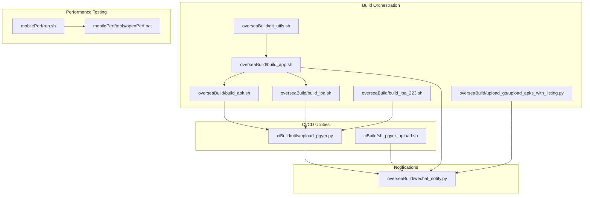
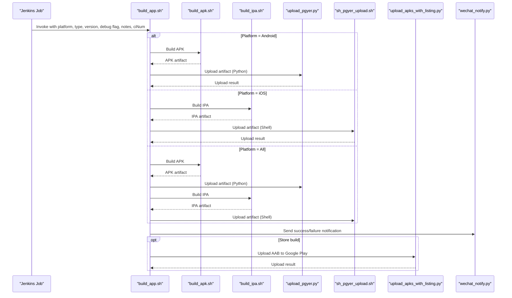
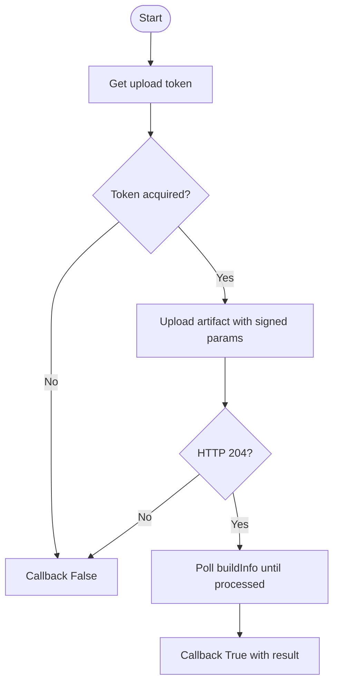
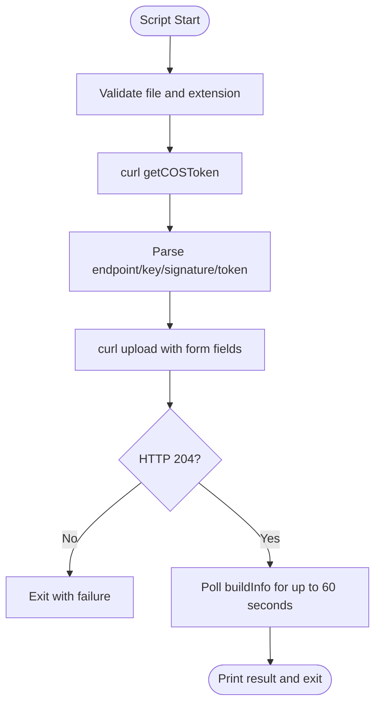
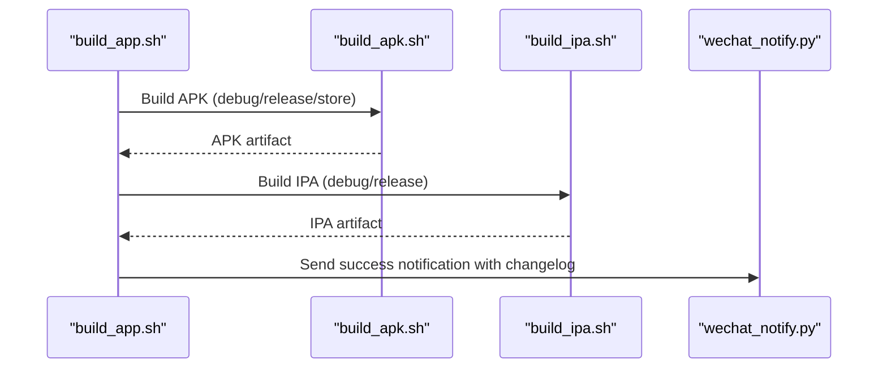
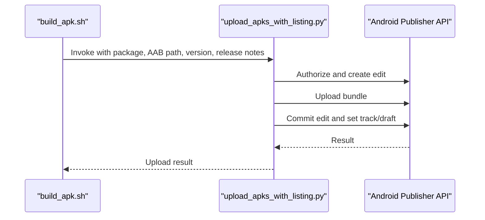
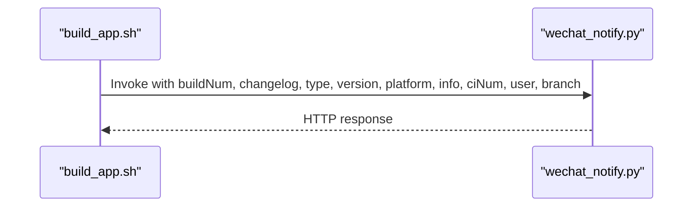
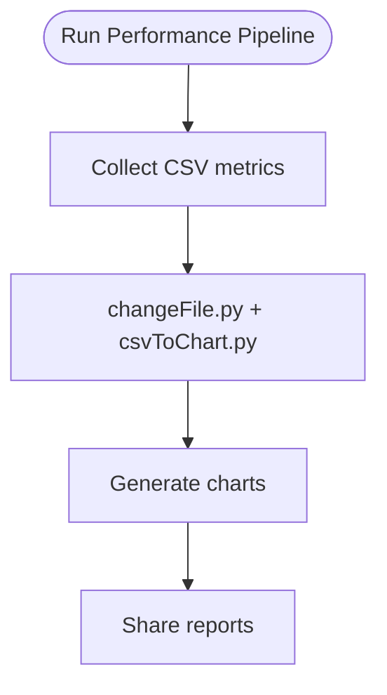
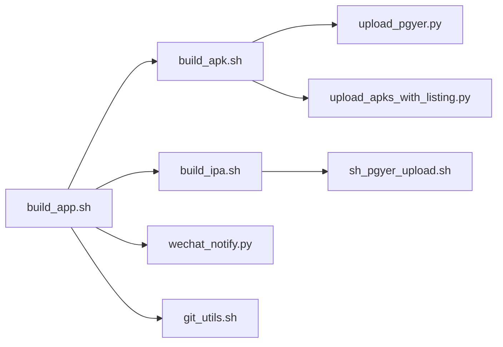

# CI/CD Integration

<cite>
**Referenced Files in This Document**
- [upload_pgyer.py](file://ciBuild/utils/upload_pgyer.py)
- [sh_pgyer_upload.sh](file://ciBuild/sh_pgyer_upload.sh)
- [README.md](file://README.md)
- [build_app.sh](file://overseaBuild/build_app.sh)
- [build_apk.sh](file://overseaBuild/build_apk.sh)
- [build_ipa.sh](file://overseaBuild/build_ipa.sh)
- [build_ipa_223.sh](file://overseaBuild/build_ipa_223.sh)
- [wechat_notify.py](file://overseaBuild/wechat_notify.py)
- [upload_apks_with_listing.py](file://overseaBuild/upload_gp/upload_apks_with_listing.py)
- [git_utils.sh](file://overseaBuild/git_utils.sh)
- [run.sh](file://mobilePerf/run.sh)
- [openPerf.bat](file://mobilePerf/tools/openPerf.bat)
</cite>

## Table of Contents
1. [Introduction](#introduction)
2. [Project Structure](#project-structure)
3. [Core Components](#core-components)
4. [Architecture Overview](#architecture-overview)
5. [Detailed Component Analysis](#detailed-component-analysis)
6. [Dependency Analysis](#dependency-analysis)
7. [Performance Considerations](#performance-considerations)
8. [Troubleshooting Guide](#troubleshooting-guide)
9. [Conclusion](#conclusion)
10. [Appendices](#appendices)

## Introduction
This document explains the CI/CD Integration capabilities within the QA Performance Code framework, focusing on automated upload services for internal distribution via Pgyer, cross-platform shell scripting, and integration patterns among performance testing, build automation, and deployment pipelines. It covers authentication management, upload process configuration, error handling, retry logic, status monitoring, notification systems, and practical examples for Jenkins integration and build verification workflows.

## Project Structure
The repository organizes CI/CD-related functionality across several modules:
- ciBuild: Python and shell utilities for uploading artifacts to Pgyer
- overseaBuild: Cross-platform build orchestration for Android and iOS, plus Google Play integration and notifications
- mobilePerf: Performance data collection and reporting tools
- README: High-level project overview and CI/CD pointers

**Diagram sources**
- [upload_pgyer.py](file://ciBuild/utils/upload_pgyer.py)
- [sh_pgyer_upload.sh](file://ciBuild/sh_pgyer_upload.sh)
- [build_app.sh](file://overseaBuild/build_app.sh)
- [build_apk.sh](file://overseaBuild/build_apk.sh)
- [build_ipa.sh](file://overseaBuild/build_ipa.sh)
- [build_ipa_223.sh](file://overseaBuild/build_ipa_223.sh)
- [upload_apks_with_listing.py](file://overseaBuild/upload_gp/upload_apks_with_listing.py)
- [wechat_notify.py](file://overseaBuild/wechat_notify.py)
- [git_utils.sh](file://overseaBuild/git_utils.sh)
- [run.sh](file://mobilePerf/run.sh)
- [openPerf.bat](file://mobilePerf/tools/openPerf.bat)

**Section sources**
- [README.md](file://README.md)
- [build_app.sh](file://overseaBuild/build_app.sh)

## Core Components
- Automated upload to Pgyer (Python and Shell)
  - Python module encapsulates token acquisition, upload, and build info polling with callbacks.
  - Shell script performs equivalent steps with curl and retries for status polling.
- Cross-platform build orchestration
  - Orchestrates Android and iOS builds, invokes Pgyer upload, and integrates with Google Play for store builds.
- Notification system
  - Sends WeCom notifications with build status, links, and changelogs.
- Performance testing integration
  - Scripts to transform collected CSV metrics into charts and support Windows-based workflows.

**Section sources**
- [upload_pgyer.py](file://ciBuild/utils/upload_pgyer.py)
- [sh_pgyer_upload.sh](file://ciBuild/sh_pgyer_upload.sh)
- [build_app.sh](file://overseaBuild/build_app.sh)
- [build_apk.sh](file://overseaBuild/build_apk.sh)
- [build_ipa.sh](file://overseaBuild/build_ipa.sh)
- [wechat_notify.py](file://overseaBuild/wechat_notify.py)
- [run.sh](file://mobilePerf/run.sh)

## Architecture Overview
The CI/CD pipeline integrates build orchestration, artifact upload, and notifications. The flow below maps actual components and their interactions.

**Diagram sources**
- [build_app.sh](file://overseaBuild/build_app.sh)
- [build_apk.sh](file://overseaBuild/build_apk.sh)
- [build_ipa.sh](file://overseaBuild/build_ipa.sh)
- [upload_pgyer.py](file://ciBuild/utils/upload_pgyer.py)
- [sh_pgyer_upload.sh](file://ciBuild/sh_pgyer_upload.sh)
- [upload_apks_with_listing.py](file://overseaBuild/upload_gp/upload_apks_with_listing.py)
- [wechat_notify.py](file://overseaBuild/wechat_notify.py)

## Detailed Component Analysis

### Pgyer Upload Service (Python)
The Python module implements a complete upload workflow:
- Token acquisition via Pgyer API
- Artifact upload using pre-signed parameters
- Polling for build processing completion
- Callback-driven result handling

**Diagram sources**
- [upload_pgyer.py](file://ciBuild/utils/upload_pgyer.py)

**Section sources**
- [upload_pgyer.py](file://ciBuild/utils/upload_pgyer.py)

### Pgyer Upload Service (Shell)
The shell script mirrors the Python flow using curl:
- Validates input file and extension
- Retrieves token and parses endpoint, key, signature, and security token
- Uploads file and checks HTTP status
- Polls buildInfo with retry loop

**Diagram sources**
- [sh_pgyer_upload.sh](file://ciBuild/sh_pgyer_upload.sh)

**Section sources**
- [sh_pgyer_upload.sh](file://ciBuild/sh_pgyer_upload.sh)

### Cross-Platform Build Orchestration
The orchestrator coordinates builds across platforms and upload targets:
- Android: Flutter APK builds, optional store AAB builds, Pgyer upload
- iOS: Flutter or Xcode-based IPA builds, Pgyer upload
- Notifications: WeCom messages for build status and changelogs
- Git utilities: Branch existence checks and safe checkout/pull

**Diagram sources**
- [build_app.sh](file://overseaBuild/build_app.sh)
- [build_apk.sh](file://overseaBuild/build_apk.sh)
- [build_ipa.sh](file://overseaBuild/build_ipa.sh)
- [wechat_notify.py](file://overseaBuild/wechat_notify.py)

**Section sources**
- [build_app.sh](file://overseaBuild/build_app.sh)
- [build_apk.sh](file://overseaBuild/build_apk.sh)
- [build_ipa.sh](file://overseaBuild/build_ipa.sh)
- [git_utils.sh](file://overseaBuild/git_utils.sh)

### Google Play Upload Integration
Store builds upload AAB artifacts to Google Play using a service account and the Android Publisher API. The script handles:
- Service account credentials and authorization
- Bundle upload with progress indication
- Release notes translation and commit to draft track

**Diagram sources**
- [build_apk.sh](file://overseaBuild/build_apk.sh)
- [upload_apks_with_listing.py](file://overseaBuild/upload_gp/upload_apks_with_listing.py)

**Section sources**
- [build_apk.sh](file://overseaBuild/build_apk.sh)
- [upload_apks_with_listing.py](file://overseaBuild/upload_gp/upload_apks_with_listing.py)

### Notification System (WeCom)
The notification script posts build status and links to a WeCom webhook:
- Markdown cards for success/failure
- Jump links to Pgyer download pages
- Changelogs and metadata (trigger, branch, version, platform)
- Special handling for store and channel builds

**Diagram sources**
- [build_app.sh](file://overseaBuild/build_app.sh)
- [wechat_notify.py](file://overseaBuild/wechat_notify.py)

**Section sources**
- [wechat_notify.py](file://overseaBuild/wechat_notify.py)

### Performance Testing Integration
Performance data collection and reporting:
- Linux/macOS: run.sh orchestrates CSV-to-chart conversion
- Windows: openPerf.bat provides a console entrypoint for the same tools

**Diagram sources**
- [run.sh](file://mobilePerf/run.sh)
- [openPerf.bat](file://mobilePerf/tools/openPerf.bat)

**Section sources**
- [run.sh](file://mobilePerf/run.sh)
- [openPerf.bat](file://mobilePerf/tools/openPerf.bat)

## Dependency Analysis
- Build orchestration depends on platform-specific build scripts and upload utilities.
- Pgyer upload utilities are used by both Android and iOS build flows.
- Google Play integration is invoked only for store builds.
- Notifications depend on successful build outcomes and changelog extraction.
- Git utilities support branch management and safe checkout/pull.

**Diagram sources**
- [build_app.sh](file://overseaBuild/build_app.sh)
- [build_apk.sh](file://overseaBuild/build_apk.sh)
- [build_ipa.sh](file://overseaBuild/build_ipa.sh)
- [upload_pgyer.py](file://ciBuild/utils/upload_pgyer.py)
- [sh_pgyer_upload.sh](file://ciBuild/sh_pgyer_upload.sh)
- [wechat_notify.py](file://overseaBuild/wechat_notify.py)
- [upload_apks_with_listing.py](file://overseaBuild/upload_gp/upload_apks_with_listing.py)
- [git_utils.sh](file://overseaBuild/git_utils.sh)

**Section sources**
- [build_app.sh](file://overseaBuild/build_app.sh)
- [build_apk.sh](file://overseaBuild/build_apk.sh)
- [build_ipa.sh](file://overseaBuild/build_ipa.sh)
- [upload_pgyer.py](file://ciBuild/utils/upload_pgyer.py)
- [sh_pgyer_upload.sh](file://ciBuild/sh_pgyer_upload.sh)
- [wechat_notify.py](file://overseaBuild/wechat_notify.py)
- [upload_apks_with_listing.py](file://overseaBuild/upload_gp/upload_apks_with_listing.py)
- [git_utils.sh](file://overseaBuild/git_utils.sh)

## Performance Considerations
- Retry loops and polling intervals balance responsiveness with resource usage. The shell script polls buildInfo for up to 60 seconds; the Python module uses recursive polling with a short initial delay before checking processing status.
- Network reliability: Both Python and shell implementations handle transient errors by printing generic messages and exiting on failures. Consider adding exponential backoff and configurable retry limits for production CI environments.
- Artifact size and upload speed: Large artifacts increase upload time and potential timeouts. Ensure network stability and consider chunked uploads where supported by the platform.
- Notification overhead: Frequent notifications can overwhelm chat channels. Batch notifications or throttle frequency for noisy builds.

[No sources needed since this section provides general guidance]

## Troubleshooting Guide
Common CI/CD issues and resolutions:
- Authentication and API keys
  - Pgyer API key: The shell script embeds a hardcoded key. Replace it with a secure, environment-provided key in production. The Python module expects an API key passed as a parameter; ensure it is injected from CI secrets.
  - Google Play service account: Ensure the JSON key file is present and readable by the upload script. Verify the package name and permissions for the service account.
- File validation failures
  - The shell script validates file existence and extension. Confirm the artifact path is correct and the file has the expected .apk or .ipa extension.
- Upload failures
  - Shell script exits on HTTP status != 204. Inspect the HTTP response and network connectivity.
  - Python module prints generic server errors and exits on exceptions. Add logging and retry logic for transient failures.
- Build verification
  - The orchestrator checks for artifact existence and sends notifications accordingly. If builds fail, ensure the build scripts produce artifacts in the expected locations and that the orchestrator can locate them.
- Status monitoring
  - The shell script polls buildInfo for up to 60 seconds. If processing takes longer, increase the loop limit or implement exponential backoff.
- Notification delivery
  - WeCom webhook URL is empty in the script. Provide a valid webhook key and ensure network access to the WeCom API.

**Section sources**
- [sh_pgyer_upload.sh](file://ciBuild/sh_pgyer_upload.sh)
- [upload_pgyer.py](file://ciBuild/utils/upload_pgyer.py)
- [build_app.sh](file://overseaBuild/build_app.sh)
- [wechat_notify.py](file://overseaBuild/wechat_notify.py)
- [upload_apks_with_listing.py](file://overseaBuild/upload_gp/upload_apks_with_listing.py)

## Conclusion
The QA Performance Code framework provides robust CI/CD integration for internal distribution via Pgyer, cross-platform build orchestration, and notifications. By combining Python and shell utilities, the system supports flexible upload strategies, reliable status monitoring, and actionable notifications. For production use, integrate secure secret management, implement retry/backoff strategies, and expand monitoring to include build metrics and artifact storage.

[No sources needed since this section summarizes without analyzing specific files]

## Appendices

### Practical CI/CD Examples

- Jenkins integration
  - Parameterized job with parameters for platform, build type, version, debug flag, release notes, and CI number.
  - Pre-build step: checkout repository and ensure dependencies.
  - Build step: invoke the orchestrator script with parameters.
  - Post-build step: publish artifacts and trigger notifications.

- Build verification workflows
  - Verify artifact existence after build.
  - Validate upload success via Pgyer buildInfo polling.
  - For store builds, confirm AAB upload to Google Play.

- Artifact management
  - Store artifacts in a dedicated directory with versioned filenames.
  - Archive artifacts for later inspection and regression analysis.

[No sources needed since this section provides general guidance]

### Best Practices for Pipeline Optimization
- Centralize secrets: Use CI/CD secret stores for API keys and service account credentials.
- Parallelization: Run Android and iOS builds in parallel where possible.
- Caching: Cache dependencies to reduce build times.
- Idempotency: Ensure scripts can safely rerun without side effects.
- Observability: Add structured logging and metrics for upload and build stages.

[No sources needed since this section provides general guidance]