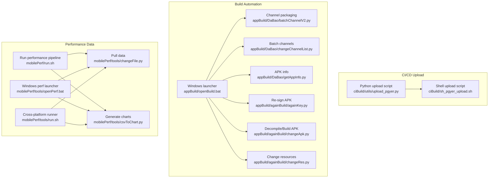
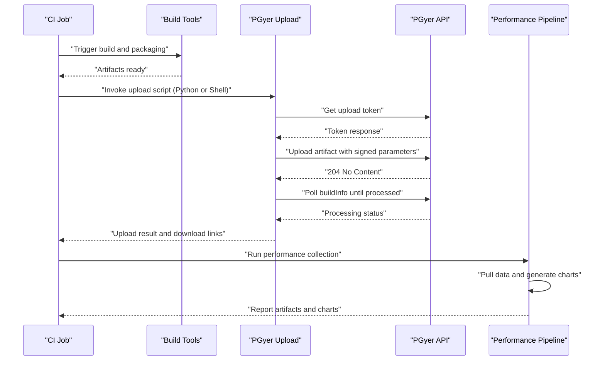
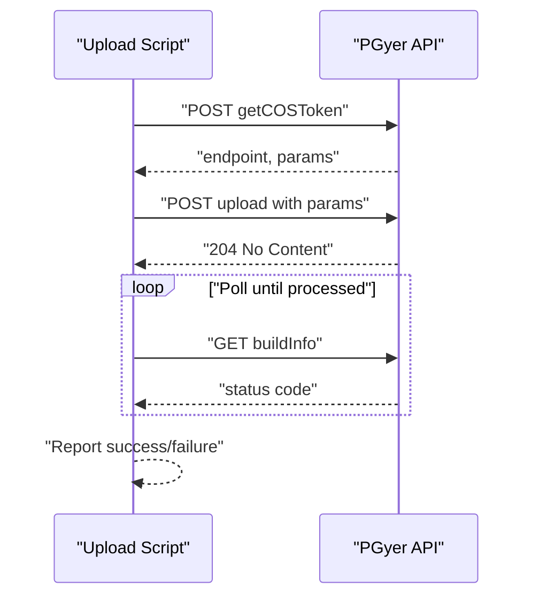
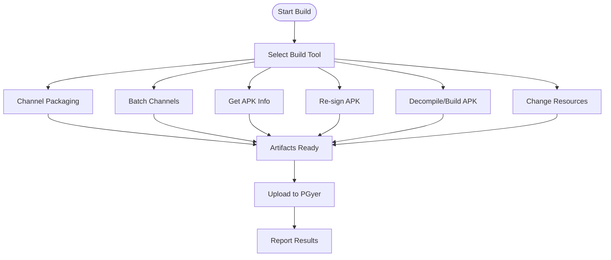
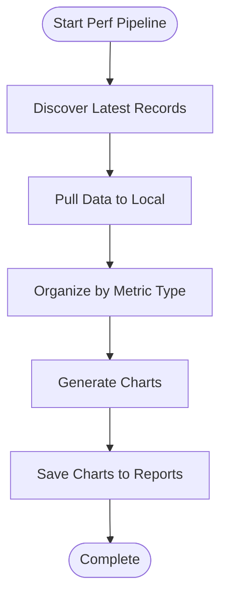
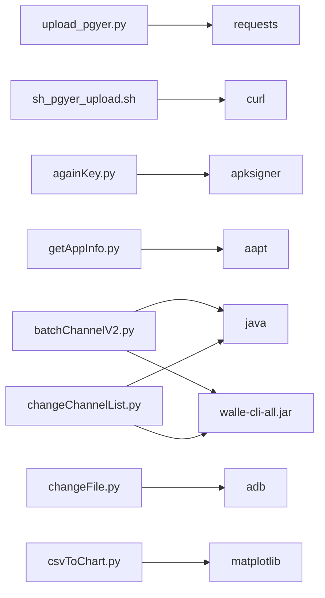

# CI/CD Integration

<cite>
**Referenced Files in This Document**
- [upload_pgyer.py](file://ciBuild/utils/upload_pgyer.py)
- [sh_pgyer_upload.sh](file://ciBuild/sh_pgyer_upload.sh)
- [openBuild.bat](file://appBuild/openBuild.bat)
- [batchChannelV2.py](file://appBuild/DaBao/batchChannelV2.py)
- [changeChannelList.py](file://appBuild/DaBao/changeChannelList.py)
- [getAppInfo.py](file://appBuild/DaBao/getAppInfo.py)
- [againKey.py](file://appBuild/againBuild/againKey.py)
- [changeApk.py](file://appBuild/againBuild/changeApk.py)
- [changeRes.py](file://appBuild/againBuild/changeRes.py)
- [run.sh](file://mobilePerf/run.sh)
- [changeFile.py](file://mobilePerf/tools/changeFile.py)
- [csvToChart.py](file://mobilePerf/tools/csvToChart.py)
- [openPerf.bat](file://mobilePerf/tools/openPerf.bat)
- [run.sh](file://mobilePerf/tools/run.sh)
- [README.md](file://README.md)
</cite>

## Table of Contents
1. [Introduction](#introduction)
2. [Project Structure](#project-structure)
3. [Core Components](#core-components)
4. [Architecture Overview](#architecture-overview)
5. [Detailed Component Analysis](#detailed-component-analysis)
6. [Dependency Analysis](#dependency-analysis)
7. [Performance Considerations](#performance-considerations)
8. [Troubleshooting Guide](#troubleshooting-guide)
9. [Conclusion](#conclusion)
10. [Appendices](#appendices)

## Introduction
This document explains the CI/CD integration capabilities of the repository, focusing on:
- PGyer platform integration for automated app uploads via API
- Cross-platform build automation for Android (Windows batch and Linux/macOS shell)
- Performance data collection and reporting
- Complete workflow from build completion detection to API communication and result reporting
- Practical guidance for integrating with Jenkins and other CI/CD systems
- Environment variable management, artifact handling, and common troubleshooting

## Project Structure
The repository organizes CI/CD assets under ciBuild, build tooling under appBuild, and performance data collection/reporting under mobilePerf. The key integration points are:
- ciBuild: Python and shell utilities for PGyer uploads
- appBuild: Windows batch launcher and Python scripts for Android builds and signing
- mobilePerf: Scripts to collect performance metrics and generate charts

**Diagram sources**
- [upload_pgyer.py:1-108](file://ciBuild/utils/upload_pgyer.py#L1-L108)
- [sh_pgyer_upload.sh:1-103](file://ciBuild/sh_pgyer_upload.sh#L1-L103)
- [openBuild.bat:1-23](file://appBuild/openBuild.bat#L1-L23)
- [batchChannelV2.py:1-120](file://appBuild/DaBao/batchChannelV2.py#L1-L120)
- [changeChannelList.py:1-91](file://appBuild/DaBao/changeChannelList.py#L1-L91)
- [getAppInfo.py:1-58](file://appBuild/DaBao/getAppInfo.py#L1-L58)
- [againKey.py:1-168](file://appBuild/againBuild/againKey.py#L1-L168)
- [changeApk.py:1-39](file://appBuild/againBuild/changeApk.py#L1-L39)
- [changeRes.py:1-72](file://appBuild/againBuild/changeRes.py#L1-L72)
- [run.sh:1-29](file://mobilePerf/run.sh#L1-L29)
- [changeFile.py:1-112](file://mobilePerf/tools/changeFile.py#L1-L112)
- [csvToChart.py:1-151](file://mobilePerf/tools/csvToChart.py#L1-L151)
- [openPerf.bat:1-7](file://mobilePerf/tools/openPerf.bat#L1-L7)
- [run.sh:1-2](file://mobilePerf/tools/run.sh#L1-L2)

**Section sources**
- [README.md:1-37](file://README.md#L1-L37)

## Core Components
- PGyer upload utilities:
  - Python-based upload flow with token acquisition, signed upload, and build info polling
  - Shell-based upload flow with token extraction, curl-based upload, and polling
- Build automation:
  - Windows batch launcher to present build tool options
  - Channel packaging and batch channel generation
  - APK info retrieval and re-signing utilities
  - Resource replacement and decompile/build helpers
- Performance data pipeline:
  - Automated data pull from device and chart generation
  - Cross-platform runners for Windows/macOS/Linux

**Section sources**
- [upload_pgyer.py:1-108](file://ciBuild/utils/upload_pgyer.py#L1-L108)
- [sh_pgyer_upload.sh:1-103](file://ciBuild/sh_pgyer_upload.sh#L1-L103)
- [openBuild.bat:1-23](file://appBuild/openBuild.bat#L1-L23)
- [batchChannelV2.py:1-120](file://appBuild/DaBao/batchChannelV2.py#L1-L120)
- [changeChannelList.py:1-91](file://appBuild/DaBao/changeChannelList.py#L1-L91)
- [getAppInfo.py:1-58](file://appBuild/DaBao/getAppInfo.py#L1-L58)
- [againKey.py:1-168](file://appBuild/againBuild/againKey.py#L1-L168)
- [changeApk.py:1-39](file://appBuild/againBuild/changeApk.py#L1-L39)
- [changeRes.py:1-72](file://appBuild/againBuild/changeRes.py#L1-L72)
- [run.sh:1-29](file://mobilePerf/run.sh#L1-L29)
- [changeFile.py:1-112](file://mobilePerf/tools/changeFile.py#L1-L112)
- [csvToChart.py:1-151](file://mobilePerf/tools/csvToChart.py#L1-L151)
- [openPerf.bat:1-7](file://mobilePerf/tools/openPerf.bat#L1-L7)
- [run.sh:1-2](file://mobilePerf/tools/run.sh#L1-L2)

## Architecture Overview
The CI/CD integration centers around two primary flows:
- Build and upload flow: Build artifacts are produced, optionally signed and packaged, then uploaded to PGyer via API. The system polls for processing completion and reports results.
- Performance data flow: After testing, performance metrics are pulled from the device, organized, and visualized into charts.

**Diagram sources**
- [upload_pgyer.py:11-108](file://ciBuild/utils/upload_pgyer.py#L11-L108)
- [sh_pgyer_upload.sh:52-103](file://ciBuild/sh_pgyer_upload.sh#L52-L103)
- [run.sh:1-29](file://mobilePerf/run.sh#L1-L29)

## Detailed Component Analysis

### PGyer Upload Utilities
- Python upload flow:
  - Token acquisition via API
  - Signed upload using returned endpoint and parameters
  - Polling for build info until processing completes
- Shell upload flow:
  - Token acquisition via curl
  - Extract token fields and upload via curl
  - Polling for build info with retries

**Diagram sources**
- [upload_pgyer.py:43-108](file://ciBuild/utils/upload_pgyer.py#L43-L108)
- [sh_pgyer_upload.sh:52-103](file://ciBuild/sh_pgyer_upload.sh#L52-L103)

**Section sources**
- [upload_pgyer.py:1-108](file://ciBuild/utils/upload_pgyer.py#L1-L108)
- [sh_pgyer_upload.sh:1-103](file://ciBuild/sh_pgyer_upload.sh#L1-L103)

### Cross-Platform Build Automation
- Windows batch launcher:
  - Presents available build tools and navigates to the script directory
- Channel packaging:
  - Single-channel, multi-channel, and sequence-based packaging
  - Renames generated APKs to standardized naming
- Batch channel list:
  - Generates channel packages per app family with standardized output paths
- APK info retrieval:
  - Parses package name, version code, and version name using aapt
- Re-signing and resource tools:
  - Command-line driven signing with configurable keystores and SDK paths
  - Resource replacement and APK decompile/build helpers

**Diagram sources**
- [openBuild.bat:1-23](file://appBuild/openBuild.bat#L1-L23)
- [batchChannelV2.py:1-120](file://appBuild/DaBao/batchChannelV2.py#L1-L120)
- [changeChannelList.py:1-91](file://appBuild/DaBao/changeChannelList.py#L1-L91)
- [getAppInfo.py:1-58](file://appBuild/DaBao/getAppInfo.py#L1-L58)
- [againKey.py:1-168](file://appBuild/againBuild/againKey.py#L1-L168)
- [changeApk.py:1-39](file://appBuild/againBuild/changeApk.py#L1-L39)
- [changeRes.py:1-72](file://appBuild/againBuild/changeRes.py#L1-L72)

**Section sources**
- [openBuild.bat:1-23](file://appBuild/openBuild.bat#L1-L23)
- [batchChannelV2.py:1-120](file://appBuild/DaBao/batchChannelV2.py#L1-L120)
- [changeChannelList.py:1-91](file://appBuild/DaBao/changeChannelList.py#L1-L91)
- [getAppInfo.py:1-58](file://appBuild/DaBao/getAppInfo.py#L1-L58)
- [againKey.py:1-168](file://appBuild/againBuild/againKey.py#L1-L168)
- [changeApk.py:1-39](file://appBuild/againBuild/changeApk.py#L1-L39)
- [changeRes.py:1-72](file://appBuild/againBuild/changeRes.py#L1-L72)

### Performance Data Collection and Reporting
- Automated data pull:
  - Discovers the latest SoloPi records on the device
  - Pulls data to local report folders and organizes by type
- Chart generation:
  - Reads CSV files and generates PNG charts for FPS, CPU, MEM, TEMP
  - Supports Windows and macOS runners
- Runners:
  - Bash script orchestrating the full pipeline
  - Windows batch launcher for convenience

**Diagram sources**
- [run.sh:1-29](file://mobilePerf/run.sh#L1-L29)
- [changeFile.py:1-112](file://mobilePerf/tools/changeFile.py#L1-L112)
- [csvToChart.py:1-151](file://mobilePerf/tools/csvToChart.py#L1-L151)
- [openPerf.bat:1-7](file://mobilePerf/tools/openPerf.bat#L1-L7)
- [run.sh:1-2](file://mobilePerf/tools/run.sh#L1-L2)

**Section sources**
- [run.sh:1-29](file://mobilePerf/run.sh#L1-L29)
- [changeFile.py:1-112](file://mobilePerf/tools/changeFile.py#L1-L112)
- [csvToChart.py:1-151](file://mobilePerf/tools/csvToChart.py#L1-L151)
- [openPerf.bat:1-7](file://mobilePerf/tools/openPerf.bat#L1-L7)
- [run.sh:1-2](file://mobilePerf/tools/run.sh#L1-L2)

## Dependency Analysis
- Upload utilities depend on external APIs and network connectivity
- Build tools depend on local SDK tools (aapt, apksigner, java, walle-cli)
- Performance tools depend on adb, SoloPi installed on devices, and Python libraries (matplotlib, etc.)

**Diagram sources**
- [upload_pgyer.py:1-108](file://ciBuild/utils/upload_pgyer.py#L1-L108)
- [sh_pgyer_upload.sh:1-103](file://ciBuild/sh_pgyer_upload.sh#L1-L103)
- [againKey.py:1-168](file://appBuild/againBuild/againKey.py#L1-L168)
- [getAppInfo.py:1-58](file://appBuild/DaBao/getAppInfo.py#L1-L58)
- [batchChannelV2.py:1-120](file://appBuild/DaBao/batchChannelV2.py#L1-L120)
- [changeChannelList.py:1-91](file://appBuild/DaBao/changeChannelList.py#L1-L91)
- [changeFile.py:1-112](file://mobilePerf/tools/changeFile.py#L1-L112)
- [csvToChart.py:1-151](file://mobilePerf/tools/csvToChart.py#L1-L151)

**Section sources**
- [upload_pgyer.py:1-108](file://ciBuild/utils/upload_pgyer.py#L1-L108)
- [sh_pgyer_upload.sh:1-103](file://ciBuild/sh_pgyer_upload.sh#L1-L103)
- [againKey.py:1-168](file://appBuild/againBuild/againKey.py#L1-L168)
- [getAppInfo.py:1-58](file://appBuild/DaBao/getAppInfo.py#L1-L58)
- [batchChannelV2.py:1-120](file://appBuild/DaBao/batchChannelV2.py#L1-L120)
- [changeChannelList.py:1-91](file://appBuild/DaBao/changeChannelList.py#L1-L91)
- [changeFile.py:1-112](file://mobilePerf/tools/changeFile.py#L1-L112)
- [csvToChart.py:1-151](file://mobilePerf/tools/csvToChart.py#L1-L151)

## Performance Considerations
- Network reliability: Both upload flows rely on external APIs; implement retry logic and timeouts where applicable
- Artifact size: Large APK/IPA sizes increase upload and processing times; consider compression or delta updates if supported
- Device availability: Performance data collection requires a connected device; ensure adb is configured and SoloPi is installed
- Platform differences: Prefer invoking scripts from their native shells for optimal compatibility (bash for Linux/macOS, cmd for Windows)

## Troubleshooting Guide
- PGyer upload failures:
  - Verify API key validity and permissions
  - Check network connectivity and API availability
  - Review token acquisition and upload status codes
- Build tool errors:
  - Confirm SDK paths and tool availability (aapt, apksigner)
  - Validate Java installation and jar file presence
  - Ensure correct arguments for channel packaging and re-signing
- Performance data issues:
  - Confirm device connection and adb access
  - Verify SoloPi installation and record directory accessibility
  - Check CSV parsing and chart generation prerequisites

**Section sources**
- [upload_pgyer.py:39-41](file://ciBuild/utils/upload_pgyer.py#L39-L41)
- [sh_pgyer_upload.sh:20-32](file://ciBuild/sh_pgyer_upload.sh#L20-L32)
- [againKey.py:45-55](file://appBuild/againBuild/againKey.py#L45-L55)
- [batchChannelV2.py:21-24](file://appBuild/DaBao/batchChannelV2.py#L21-L24)
- [changeFile.py:37-48](file://mobilePerf/tools/changeFile.py#L37-L48)

## Conclusion
The repository provides a robust foundation for CI/CD integration:
- Automated PGyer uploads via Python or shell scripts
- Cross-platform Android build automation with channel packaging and signing
- End-to-end performance data collection and visualization
Adopting these components into CI/CD pipelines enables streamlined artifact production, distribution, and quality assessment.

## Appendices

### Environment Variables and Configuration
- PGyer:
  - API key is embedded in scripts; replace with secure environment variables in CI
  - Install type and password can be parameterized via script arguments
- Build tools:
  - SDK paths and keystore locations are hardcoded; override via environment variables or script parameters
  - Channel lists and naming conventions can be externalized via configuration files
- Performance:
  - ADB path and SoloPi directory are assumed; configure CI environment accordingly

**Section sources**
- [sh_pgyer_upload.sh:9-13](file://ciBuild/sh_pgyer_upload.sh#L9-L13)
- [againKey.py:29-39](file://appBuild/againBuild/againKey.py#L29-L39)
- [batchChannelV2.py](file://appBuild/DaBao/batchChannelV2.py#L18)
- [changeChannelList.py](file://appBuild/DaBao/changeChannelList.py#L13)

### CI/CD Integration Examples
- Jenkins:
  - Use the shell script for Linux agents and batch script for Windows agents
  - Parameterize API key and artifact paths via Jenkins job parameters
  - Trigger performance pipeline post-build and archive artifacts
- GitHub Actions:
  - Use matrix strategies to run builds on multiple OS runners
  - Cache dependencies (Java, SDKs) and reuse across jobs
  - Publish PGyer links and performance charts as job artifacts

**Section sources**
- [README.md:21-23](file://README.md#L21-L23)
- [sh_pgyer_upload.sh:1-17](file://ciBuild/sh_pgyer_upload.sh#L1-L17)
- [run.sh:1-29](file://mobilePerf/run.sh#L1-L29)