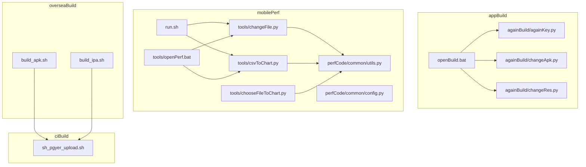
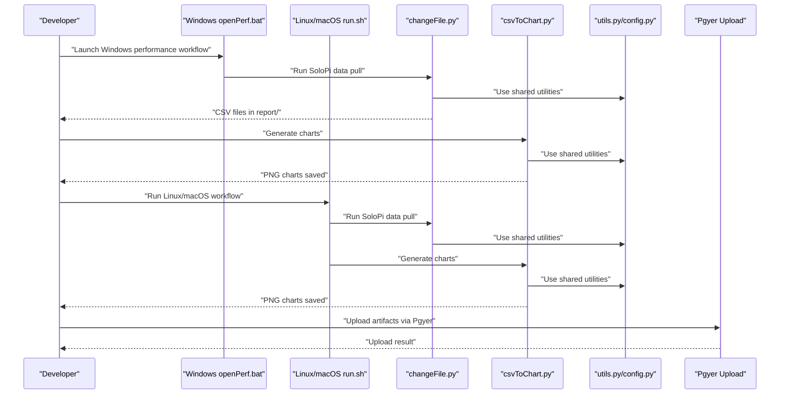
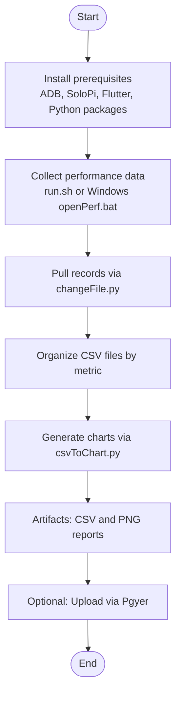
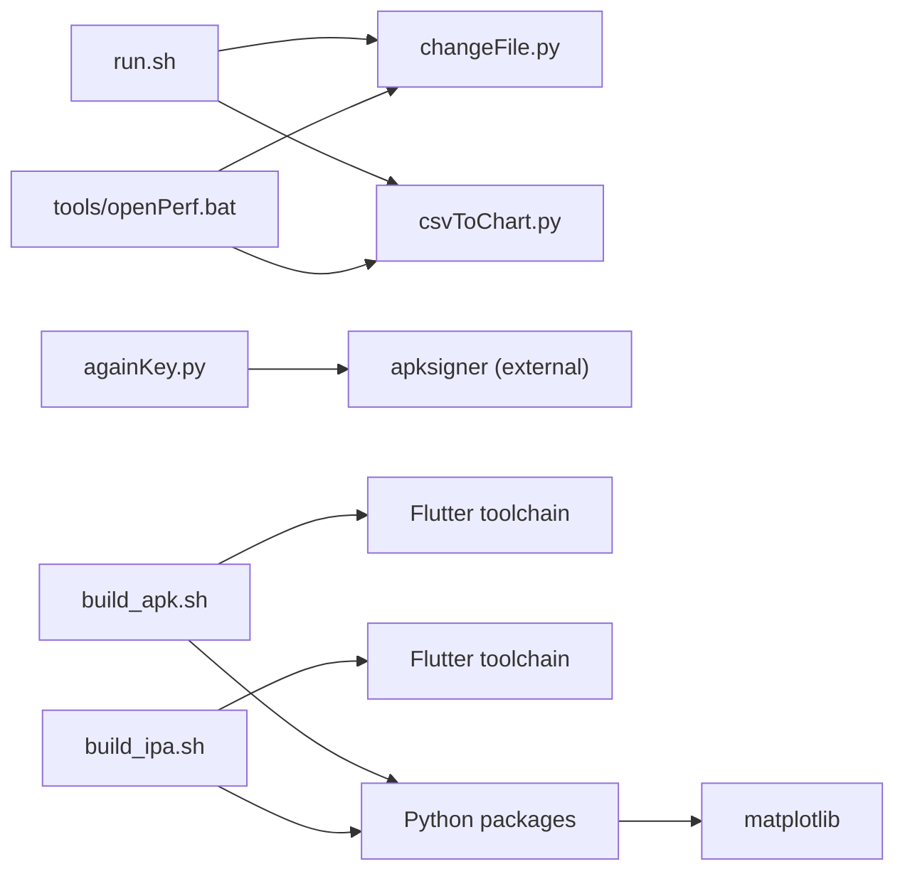

# Cross-Platform Build Automation

<cite>
**Referenced Files in This Document**
- [README.md](file://README.md)
- [openBuild.bat](file://appBuild/openBuild.bat)
- [openPerf.bat](file://mobilePerf/tools/openPerf.bat)
- [run.sh](file://mobilePerf/run.sh)
- [run.shell](file://mobilePerf/run.shell)
- [changeFile.py](file://mobilePerf/tools/changeFile.py)
- [csvToChart.py](file://mobilePerf/tools/csvToChart.py)
- [chooseFileToChart.py](file://mobilePerf/tools/chooseFileToChart.py)
- [againKey.py](file://appBuild/againBuild/againKey.py)
- [changeApk.py](file://appBuild/againBuild/changeApk.py)
- [changeRes.py](file://appBuild/againBuild/changeRes.py)
- [build_apk.sh](file://overseaBuild/build_apk.sh)
- [build_ipa.sh](file://overseaBuild/build_ipa.sh)
- [sh_pgyer_upload.sh](file://ciBuild/sh_pgyer_upload.sh)
- [utils.py](file://mobilePerf/perfCode/common/utils.py)
- [config.py](file://mobilePerf/perfCode/common/config.py)
</cite>

## Table of Contents
1. [Introduction](#introduction)
2. [Project Structure](#project-structure)
3. [Core Components](#core-components)
4. [Architecture Overview](#architecture-overview)
5. [Detailed Component Analysis](#detailed-component-analysis)
6. [Dependency Analysis](#dependency-analysis)
7. [Performance Considerations](#performance-considerations)
8. [Troubleshooting Guide](#troubleshooting-guide)
9. [Conclusion](#conclusion)
10. [Appendices](#appendices)

## Introduction
This document describes the cross-platform build automation capabilities present in the repository, focusing on:
- Windows batch scripting for Android APK builds and performance testing workflows
- Linux/macOS shell scripting for Flutter builds, artifact uploads, and performance data processing
- Environment variable management, platform-specific considerations, and path handling differences
- The complete pipeline from initial setup through performance data collection to final artifact generation
- Practical CI/CD integration patterns, parameter configuration, and artifact management
- Troubleshooting approaches for platform-specific issues, permissions, and dependency conflicts
- Performance optimization techniques and resource management across operating systems

## Project Structure
The repository organizes automation around three primary areas:
- appBuild: Android build and APK manipulation utilities
- mobilePerf: Performance data collection, processing, and visualization
- overseaBuild: Cross-platform Flutter builds (Android APK and iOS IPA) with optional store upload
- ciBuild: Artifact upload helpers (e.g., Pgyer)
- README: High-level guidance and tooling prerequisites

**Diagram sources**
- [openBuild.bat:1-23](file://appBuild/openBuild.bat#L1-L23)
- [againKey.py:1-168](file://appBuild/againBuild/againKey.py#L1-L168)
- [changeApk.py:1-39](file://appBuild/againBuild/changeApk.py#L1-L39)
- [changeRes.py:1-72](file://appBuild/againBuild/changeRes.py#L1-L72)
- [run.sh:1-29](file://mobilePerf/run.sh#L1-L29)
- [openPerf.bat:1-7](file://mobilePerf/tools/openPerf.bat#L1-L7)
- [changeFile.py:1-112](file://mobilePerf/tools/changeFile.py#L1-L112)
- [csvToChart.py:1-151](file://mobilePerf/tools/csvToChart.py#L1-L151)
- [chooseFileToChart.py:1-145](file://mobilePerf/tools/chooseFileToChart.py#L1-L145)
- [utils.py:1-156](file://mobilePerf/perfCode/common/utils.py#L1-L156)
- [config.py:1-20](file://mobilePerf/perfCode/common/config.py#L1-L20)
- [build_apk.sh:1-60](file://overseaBuild/build_apk.sh#L1-L60)
- [build_ipa.sh:1-74](file://overseaBuild/build_ipa.sh#L1-L74)
- [sh_pgyer_upload.sh:1-103](file://ciBuild/sh_pgyer_upload.sh#L1-L103)

**Section sources**
- [README.md:1-37](file://README.md#L1-L37)

## Core Components
- Windows batch automation
  - openBuild.bat: Interactive menu for APK manipulation utilities under appBuild/againBuild
  - tools/openPerf.bat: Launchpad for performance data collection and chart generation
- Linux/macOS shell automation
  - mobilePerf/run.sh: Orchestrates SoloPi data pull and chart generation across CPU, FPS, MEM, TEMP
  - mobilePerf/run.shell: macOS-specific invocation example for changeFile.py
- Android build and signing
  - againKey.py: APK re-signing with configurable keystore and SDK path
  - changeApk.py: Apktool-based decompile and rebuild
  - changeRes.py: Resource replacement workflow with validation
- Flutter builds and uploads
  - build_apk.sh: Flutter APK/iPA builds with Pgyer upload
  - build_ipa.sh: iOS IPA build and upload
  - sh_pgyer_upload.sh: Standalone Pgyer upload helper
- Performance data processing
  - changeFile.py: Pulls SoloPi records from device and organizes CSV files
  - csvToChart.py: Generates PNG charts from CSV data with platform detection
  - chooseFileToChart.py: Interactive selection of SoloPi sessions
  - perfCode/common/utils.py and config.py: Shared utilities and configuration

**Section sources**
- [openBuild.bat:1-23](file://appBuild/openBuild.bat#L1-L23)
- [openPerf.bat:1-7](file://mobilePerf/tools/openPerf.bat#L1-L7)
- [run.sh:1-29](file://mobilePerf/run.sh#L1-L29)
- [run.shell:1-1](file://mobilePerf/run.shell#L1-L1)
- [againKey.py:1-168](file://appBuild/againBuild/againKey.py#L1-L168)
- [changeApk.py:1-39](file://appBuild/againBuild/changeApk.py#L1-L39)
- [changeRes.py:1-72](file://appBuild/againBuild/changeRes.py#L1-L72)
- [build_apk.sh:1-60](file://overseaBuild/build_apk.sh#L1-L60)
- [build_ipa.sh:1-74](file://overseaBuild/build_ipa.sh#L1-L74)
- [sh_pgyer_upload.sh:1-103](file://ciBuild/sh_pgyer_upload.sh#L1-L103)
- [changeFile.py:1-112](file://mobilePerf/tools/changeFile.py#L1-L112)
- [csvToChart.py:1-151](file://mobilePerf/tools/csvToChart.py#L1-L151)
- [chooseFileToChart.py:1-145](file://mobilePerf/tools/chooseFileToChart.py#L1-L145)
- [utils.py:1-156](file://mobilePerf/perfCode/common/utils.py#L1-L156)
- [config.py:1-20](file://mobilePerf/perfCode/common/config.py#L1-L20)

## Architecture Overview
The automation system integrates device-side performance collection with host-side processing and artifact generation. The flow below maps actual scripts and their interactions.

**Diagram sources**
- [openPerf.bat:1-7](file://mobilePerf/tools/openPerf.bat#L1-L7)
- [run.sh:1-29](file://mobilePerf/run.sh#L1-L29)
- [changeFile.py:1-112](file://mobilePerf/tools/changeFile.py#L1-L112)
- [csvToChart.py:1-151](file://mobilePerf/tools/csvToChart.py#L1-L151)
- [utils.py:1-156](file://mobilePerf/perfCode/common/utils.py#L1-L156)
- [config.py:1-20](file://mobilePerf/perfCode/common/config.py#L1-L20)
- [sh_pgyer_upload.sh:1-103](file://ciBuild/sh_pgyer_upload.sh#L1-L103)

## Detailed Component Analysis

### Windows Batch Scripts
- openBuild.bat
  - Purpose: Presents a contextual menu for APK manipulation utilities and switches to the script’s directory before keeping the console open.
  - Platform specifics: Uses Windows code page 65001 and command prompt keep-alive behavior.
  - Path handling: Resolves the script directory to ensure subsequent commands run from the correct location.
  - Related scripts: Delegates to againBuild utilities for signing, decompiling, and resource changes.

- tools/openPerf.bat
  - Purpose: Guides users to select between data collection and chart generation, then opens a terminal in the tools directory.
  - Platform specifics: Sets code page and keeps the console open for interactive use.

**Section sources**
- [openBuild.bat:1-23](file://appBuild/openBuild.bat#L1-L23)
- [openPerf.bat:1-7](file://mobilePerf/tools/openPerf.bat#L1-L7)

### Linux/macOS Shell Scripts
- mobilePerf/run.sh
  - Purpose: Orchestrates performance data collection and chart generation across four metrics.
  - Execution model: Uses Bash strict mode, resolves BASEDIR reliably, and invokes Python tools with properly quoted paths.
  - Metrics: CPU, FPS, MEM, TEMP charts generated sequentially.
  - Output: Reports completion status after each stage.

- mobilePerf/run.shell
  - Purpose: Example macOS invocation for changeFile.py using a hardcoded path.
  - Notes: Intended as a template; adjust absolute paths per environment.

**Section sources**
- [run.sh:1-29](file://mobilePerf/run.sh#L1-L29)
- [run.shell:1-1](file://mobilePerf/run.shell#L1-L1)

### Android Build and Signing Utilities
- againKey.py
  - Purpose: Re-sign APKs with configurable keystore and SDK path.
  - Parameters: Accepts input/output paths, keystore type, and SDK path via CLI.
  - Validation: Ensures input file and SDK path exist; creates output directory if needed.
  - Verification: Executes verification step post-signing.
  - Platform specifics: Uses Windows-style paths for default SDK; adjust for cross-platform environments.

- changeApk.py
  - Purpose: Interactively decompile or rebuild an APK using Apktool.
  - Parameters: Requires target path and user choice (decompile or rebuild).
  - Output: Prints output path for rebuilt APK.

- changeRes.py
  - Purpose: Validates and replaces specific launcher and splash assets across multiple density targets.
  - Validation: Compares actual files against a required set; raises environment errors if mismatched.
  - Robustness: Creates destination directories as needed.

**Section sources**
- [againKey.py:1-168](file://appBuild/againBuild/againKey.py#L1-L168)
- [changeApk.py:1-39](file://appBuild/againBuild/changeApk.py#L1-L39)
- [changeRes.py:1-72](file://appBuild/againBuild/changeRes.py#L1-L72)

### Flutter Builds and Artifact Uploads
- overseaBuild/build_apk.sh
  - Purpose: Builds Flutter Android APKs (debug/release/store) with optional debug flags and uploads to Pgyer.
  - Parameters: buildType, versionName, versionCode, debugModel, releaseNotes, ciNum.
  - Behavior: Cleans outputs, executes Flutter build with dart-define flags, moves artifacts, and uploads via curl.

- overseaBuild/build_ipa.sh
  - Purpose: Builds Flutter iOS IPA (adhoc/store) with optional debug flags, exports archive, and uploads artifacts.
  - Behavior: Installs pods, builds IPA, exports archive, uploads IPA, and optionally uploads dSYM symbols.

- ciBuild/sh_pgyer_upload.sh
  - Purpose: Uploads a given artifact to Pgyer using API v2 with token retrieval and polling.
  - Parameters: Artifact path via CLI argument.
  - Safety checks: Validates file existence and extension, retrieves upload credentials, polls for success.

**Section sources**
- [build_apk.sh:1-60](file://overseaBuild/build_apk.sh#L1-L60)
- [build_ipa.sh:1-74](file://overseaBuild/build_ipa.sh#L1-L74)
- [sh_pgyer_upload.sh:1-103](file://ciBuild/sh_pgyer_upload.sh#L1-L103)

### Performance Data Collection and Visualization
- mobilePerf/tools/changeFile.py
  - Purpose: Pulls SoloPi performance records from the device and organizes CSV files into report folders by metric.
  - Device interaction: Uses adb shell and adb pull to fetch data.
  - Organization: Moves files into CPU/MEM/FPS/TEMP subfolders with date-stamped filenames.
  - Error handling: Reports missing device or directories and failure reasons.

- mobilePerf/tools/csvToChart.py
  - Purpose: Generates PNG charts from CSV data for FPS, CPU, MEM, TEMP.
  - Platform detection: Determines OS and selects appropriate argument parsing.
  - Data processing: Filters invalid values, downsamples, removes extremes, computes min/max/avg.
  - Output: Saves charts to report/<metric> with current date filename.

- mobilePerf/tools/chooseFileToChart.py
  - Purpose: Interactive selection of SoloPi session folders for processing.
  - Device interaction: Lists available directories and prompts for selection.
  - Robustness: Validates user input and handles missing selections gracefully.

- perfCode/common/utils.py and perfCode/common/config.py
  - Purpose: Shared utilities for time formatting, file operations, zipping, and configuration defaults.
  - Usage: changeFile.py and csvToChart.py import and use these utilities for consistent behavior.

**Section sources**
- [changeFile.py:1-112](file://mobilePerf/tools/changeFile.py#L1-L112)
- [csvToChart.py:1-151](file://mobilePerf/tools/csvToChart.py#L1-L151)
- [chooseFileToChart.py:1-145](file://mobilePerf/tools/chooseFileToChart.py#L1-L145)
- [utils.py:1-156](file://mobilePerf/perfCode/common/utils.py#L1-L156)
- [config.py:1-20](file://mobilePerf/perfCode/common/config.py#L1-L20)

### Build Pipeline Flow

[No sources needed since this diagram shows conceptual workflow, not actual code structure]

## Dependency Analysis
- Script-to-script dependencies
  - run.sh depends on changeFile.py and csvToChart.py for data processing and visualization.
  - tools/openPerf.bat launches the same Python tools on Windows.
  - build_apk.sh and build_ipa.sh depend on Flutter toolchain and optional Pgyer upload.
  - againKey.py depends on external SDK (apksigner) and keystore files.
- External tool dependencies
  - ADB for device communication
  - Flutter for building APK/iPA
  - Python packages: matplotlib for charting, pathlib for path handling
  - curl for artifact upload
- Platform-specific considerations
  - Windows: Code page and path separators differ; batch scripts rely on Windows-specific commands.
  - macOS/Linux: Shell quoting and path handling must account for spaces and special characters.

**Diagram sources**
- [run.sh:1-29](file://mobilePerf/run.sh#L1-L29)
- [openPerf.bat:1-7](file://mobilePerf/tools/openPerf.bat#L1-L7)
- [changeFile.py:1-112](file://mobilePerf/tools/changeFile.py#L1-L112)
- [csvToChart.py:1-151](file://mobilePerf/tools/csvToChart.py#L1-L151)
- [againKey.py:1-168](file://appBuild/againBuild/againKey.py#L1-L168)
- [build_apk.sh:1-60](file://overseaBuild/build_apk.sh#L1-L60)
- [build_ipa.sh:1-74](file://overseaBuild/build_ipa.sh#L1-L74)

**Section sources**
- [run.sh:1-29](file://mobilePerf/run.sh#L1-L29)
- [openPerf.bat:1-7](file://mobilePerf/tools/openPerf.bat#L1-L7)
- [changeFile.py:1-112](file://mobilePerf/tools/changeFile.py#L1-L112)
- [csvToChart.py:1-151](file://mobilePerf/tools/csvToChart.py#L1-L151)
- [againKey.py:1-168](file://appBuild/againBuild/againKey.py#L1-L168)
- [build_apk.sh:1-60](file://overseaBuild/build_apk.sh#L1-L60)
- [build_ipa.sh:1-74](file://overseaBuild/build_ipa.sh#L1-L74)

## Performance Considerations
- Data processing
  - Downsample and remove outliers to reduce chart noise and improve rendering performance.
  - Use consistent DPI and figure sizes to balance quality and file size.
- Device I/O
  - Minimize repeated adb shell listings; cache device directory listings when possible.
  - Ensure sufficient disk space in report/prefData to avoid partial transfers.
- Build throughput
  - Clean Flutter outputs before builds to reduce incremental overhead.
  - Parallelize independent tasks (e.g., build and upload) where safe.
- Resource management
  - Limit concurrent Python processes and chart generations to prevent memory spikes.
  - Monitor disk usage during artifact generation and cleanup temporary directories.

[No sources needed since this section provides general guidance]

## Troubleshooting Guide
- Permission problems
  - Windows: Run batch scripts as administrator if SDK or keystore paths require elevated access.
  - macOS/Linux: Ensure shell scripts are executable (chmod +x) and Python scripts are runnable.
- Dependency conflicts
  - Python: Install required packages (matplotlib) and ensure Python 3 interpreter is used consistently.
  - Flutter: Verify Flutter SDK is initialized and PATH includes flutter/bin.
  - ADB: Confirm device is connected, authorized, and visible to adb devices.
- Path handling
  - Windows: Use double-backslashes or forward slashes in paths; avoid spaces in project directories.
  - macOS/Linux: Quote paths with spaces and use absolute paths where necessary.
- Upload failures
  - Pgyer: Verify API key validity and file extension support; check network connectivity and retry logic.
- Build failures
  - Flutter: Ensure correct flavor and target-platform flags; confirm export options for iOS.
  - Android: Validate keystore paths and passwords; confirm apksigner availability.

**Section sources**
- [againKey.py:1-168](file://appBuild/againBuild/againKey.py#L1-L168)
- [sh_pgyer_upload.sh:1-103](file://ciBuild/sh_pgyer_upload.sh#L1-L103)
- [build_apk.sh:1-60](file://overseaBuild/build_apk.sh#L1-L60)
- [build_ipa.sh:1-74](file://overseaBuild/build_ipa.sh#L1-L74)

## Conclusion
The repository provides a robust, cross-platform automation framework for Android APK builds, iOS IPA packaging, performance data collection, and artifact uploads. By leveraging Windows batch scripts, Linux/macOS shell scripts, and Python-based processing utilities, teams can standardize workflows across platforms while maintaining flexibility for customization. Proper environment setup, parameterization, and artifact management enable seamless integration into CI/CD pipelines.

[No sources needed since this section summarizes without analyzing specific files]

## Appendices

### CI/CD Integration Examples
- Jenkins pipeline stages
  - Stage 1: Prepare environment (install ADB, Flutter, Python packages)
  - Stage 2: Build artifacts (Android APK or iOS IPA) using overseaBuild scripts
  - Stage 3: Collect performance data using run.sh or Windows openPerf.bat
  - Stage 4: Generate charts and publish reports
  - Stage 5: Upload artifacts to Pgyer using sh_pgyer_upload.sh
- Parameter configuration
  - Pass parameters via environment variables or script arguments (e.g., buildType, versionName, versionCode, debugModel, ciNum)
  - Configure dart-define flags for build metadata and debug toggles
- Output artifact management
  - Store CSV and PNG reports in dedicated directories
  - Archive build outputs and dSYM symbols for diagnostics

[No sources needed since this section provides general guidance]