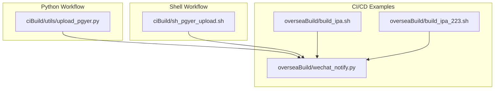
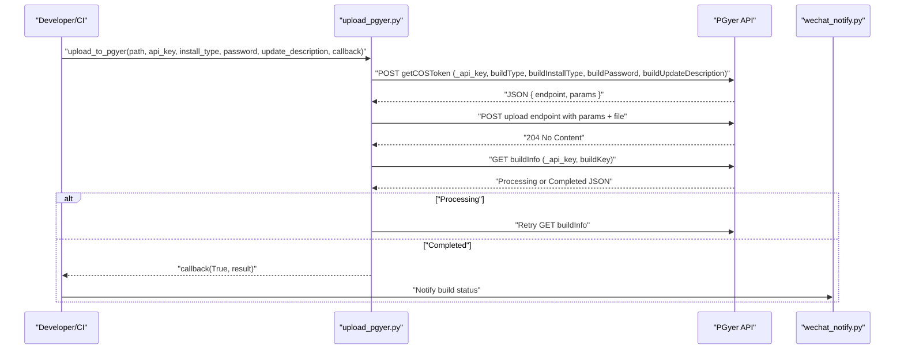
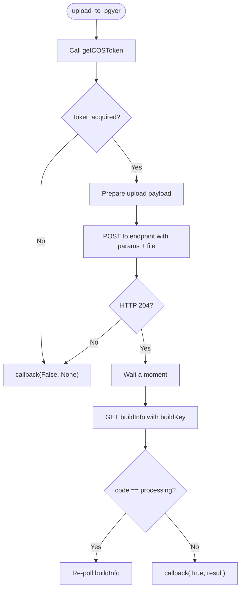
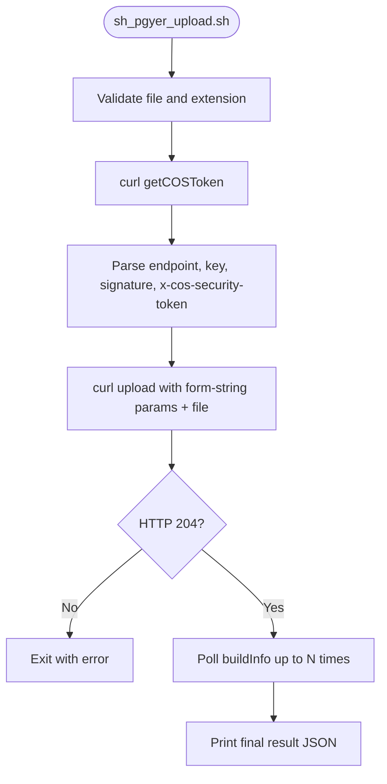
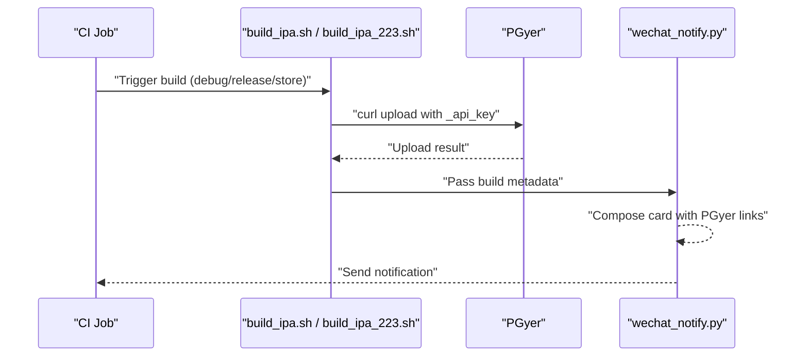
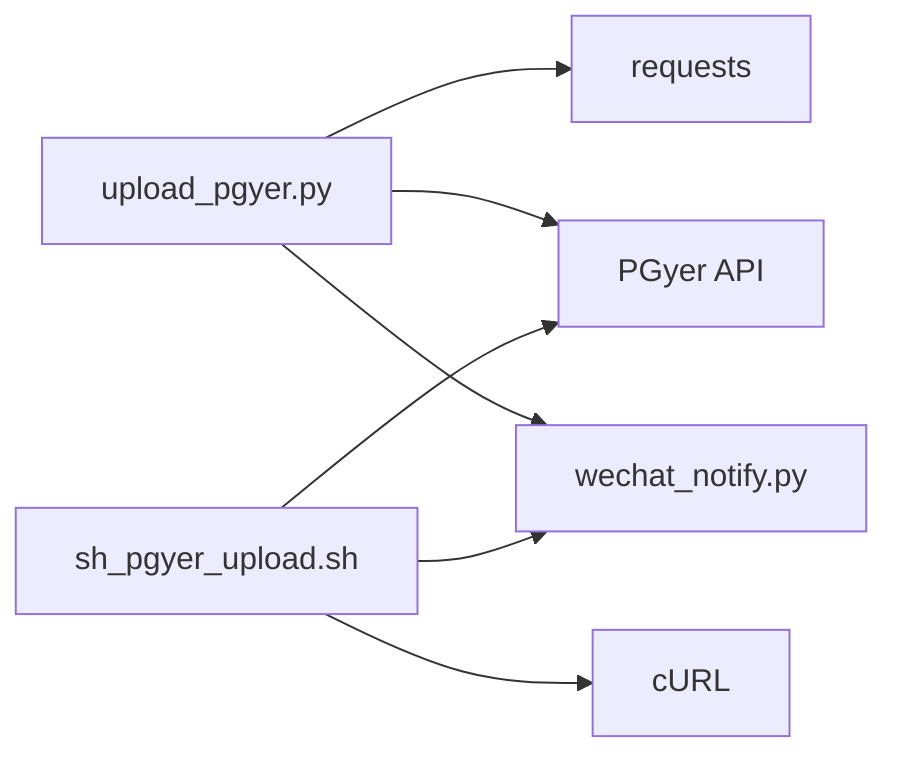

# PGyer Platform Integration

<cite>
**Referenced Files in This Document**
- [upload_pgyer.py](file://ciBuild/utils/upload_pgyer.py)
- [sh_pgyer_upload.sh](file://ciBuild/sh_pgyer_upload.sh)
- [README.md](file://README.md)
- [build_ipa.sh](file://overseaBuild/build_ipa.sh)
- [build_ipa_223.sh](file://overseaBuild/build_ipa_223.sh)
- [wechat_notify.py](file://overseaBuild/wechat_notify.py)
</cite>

## Table of Contents
1. [Introduction](#introduction)
2. [Project Structure](#project-structure)
3. [Core Components](#core-components)
4. [Architecture Overview](#architecture-overview)
5. [Detailed Component Analysis](#detailed-component-analysis)
6. [Dependency Analysis](#dependency-analysis)
7. [Performance Considerations](#performance-considerations)
8. [Troubleshooting Guide](#troubleshooting-guide)
9. [Conclusion](#conclusion)
10. [Appendices](#appendices)

## Introduction
This document explains how the repository integrates with the PGyer platform for distributing iOS and Android builds. It covers API configuration and authentication, install-type configuration (public, password-protected, invitation-only), automated upload workflows, callback mechanisms for progress and completion, CI/CD integration examples, environment variable management, error handling strategies, and common integration challenges such as network connectivity, API rate limits, and authentication failures.

## Project Structure
The PGyer integration spans two primary automation approaches:
- Python-based workflow with callbacks for progress and completion
- Shell-based workflow using cURL for token acquisition, upload, and build info polling

**Diagram sources**
- [upload_pgyer.py:1-108](file://ciBuild/utils/upload_pgyer.py#L1-L108)
- [sh_pgyer_upload.sh:1-103](file://ciBuild/sh_pgyer_upload.sh#L1-L103)
- [build_ipa.sh:1-73](file://overseaBuild/build_ipa.sh#L1-L73)
- [build_ipa_223.sh:1-80](file://overseaBuild/build_ipa_223.sh#L1-L80)
- [wechat_notify.py:1-146](file://overseaBuild/wechat_notify.py#L1-L146)

**Section sources**
- [README.md:21-23](file://README.md#L21-L23)

## Core Components
- Token acquisition via PGyer’s API to obtain a pre-signed upload URL and parameters
- Direct upload to PGyer’s storage endpoint using returned parameters
- Polling PGyer’s build info endpoint until processing completes
- Callback-driven progress reporting and completion handling
- Shell-based equivalent using cURL for token, upload, and polling
- Optional notification integration to WeCom for build status

Key responsibilities:
- API key management and installation type configuration
- Robust error handling and retry logic
- CI/CD-friendly invocation patterns

**Section sources**
- [upload_pgyer.py:11-41](file://ciBuild/utils/upload_pgyer.py#L11-L41)
- [upload_pgyer.py:43-85](file://ciBuild/utils/upload_pgyer.py#L43-L85)
- [upload_pgyer.py:88-108](file://ciBuild/utils/upload_pgyer.py#L88-L108)
- [sh_pgyer_upload.sh:55-86](file://ciBuild/sh_pgyer_upload.sh#L55-L86)
- [sh_pgyer_upload.sh:92-103](file://ciBuild/sh_pgyer_upload.sh#L92-L103)

## Architecture Overview
The integration follows a two-phase flow:
1. Obtain a temporary upload credential (token) from PGyer
2. Upload the artifact to the provided endpoint and poll for build info until processing completes

**Diagram sources**
- [upload_pgyer.py:11-41](file://ciBuild/utils/upload_pgyer.py#L11-L41)
- [upload_pgyer.py:43-85](file://ciBuild/utils/upload_pgyer.py#L43-L85)
- [upload_pgyer.py:88-108](file://ciBuild/utils/upload_pgyer.py#L88-L108)
- [wechat_notify.py:44-131](file://overseaBuild/wechat_notify.py#L44-L131)

## Detailed Component Analysis

### Python Upload Module
Implements token acquisition, upload, and build info polling with a callback interface.

**Diagram sources**
- [upload_pgyer.py:43-85](file://ciBuild/utils/upload_pgyer.py#L43-L85)
- [upload_pgyer.py:88-108](file://ciBuild/utils/upload_pgyer.py#L88-L108)

Key implementation notes:
- Token acquisition payload includes API key, target platform, install type, optional password, and optional update description
- Upload uses multipart form data with parameters returned by the token endpoint
- Build info polling checks for processing codes and retries until completion

**Section sources**
- [upload_pgyer.py:11-41](file://ciBuild/utils/upload_pgyer.py#L11-L41)
- [upload_pgyer.py:43-85](file://ciBuild/utils/upload_pgyer.py#L43-L85)
- [upload_pgyer.py:88-108](file://ciBuild/utils/upload_pgyer.py#L88-L108)

### Shell Upload Script
Provides a cURL-based alternative for token acquisition, upload, and polling.

**Diagram sources**
- [sh_pgyer_upload.sh:19-32](file://ciBuild/sh_pgyer_upload.sh#L19-L32)
- [sh_pgyer_upload.sh:55-67](file://ciBuild/sh_pgyer_upload.sh#L55-L67)
- [sh_pgyer_upload.sh:77-86](file://ciBuild/sh_pgyer_upload.sh#L77-L86)
- [sh_pgyer_upload.sh:92-103](file://ciBuild/sh_pgyer_upload.sh#L92-L103)

Operational highlights:
- Validates input file existence and extension
- Extracts required upload parameters from token response
- Uploads using form-string parameters plus the file field
- Polls build info until success or timeout

**Section sources**
- [sh_pgyer_upload.sh:19-32](file://ciBuild/sh_pgyer_upload.sh#L19-L32)
- [sh_pgyer_upload.sh:55-67](file://ciBuild/sh_pgyer_upload.sh#L55-L67)
- [sh_pgyer_upload.sh:77-86](file://ciBuild/sh_pgyer_upload.sh#L77-L86)
- [sh_pgyer_upload.sh:92-103](file://ciBuild/sh_pgyer_upload.sh#L92-L103)

### CI/CD Integration Examples
- iOS build scripts demonstrate direct upload to PGyer after build completion
- WeCom notification script constructs cards with links to PGyer download pages

**Diagram sources**
- [build_ipa.sh:50-70](file://overseaBuild/build_ipa.sh#L50-L70)
- [build_ipa_223.sh:54-77](file://overseaBuild/build_ipa_223.sh#L54-L77)
- [wechat_notify.py:44-131](file://overseaBuild/wechat_notify.py#L44-L131)

**Section sources**
- [build_ipa.sh:50-70](file://overseaBuild/build_ipa.sh#L50-L70)
- [build_ipa_223.sh:54-77](file://overseaBuild/build_ipa_223.sh#L54-L77)
- [wechat_notify.py:44-131](file://overseaBuild/wechat_notify.py#L44-L131)

## Dependency Analysis
- Python module depends on the requests library for HTTP operations
- Shell script depends on cURL for HTTP operations
- Both workflows depend on PGyer’s public API endpoints for token acquisition, upload, and build info
- Notification script depends on WeCom webhook for post-upload notifications

**Diagram sources**
- [upload_pgyer.py:4-6](file://ciBuild/utils/upload_pgyer.py#L4-L6)
- [sh_pgyer_upload.sh:77-82](file://ciBuild/sh_pgyer_upload.sh#L77-L82)
- [wechat_notify.py:17-20](file://overseaBuild/wechat_notify.py#L17-L20)

**Section sources**
- [upload_pgyer.py:4-6](file://ciBuild/utils/upload_pgyer.py#L4-L6)
- [sh_pgyer_upload.sh:77-82](file://ciBuild/sh_pgyer_upload.sh#L77-L82)
- [wechat_notify.py:17-20](file://overseaBuild/wechat_notify.py#L17-L20)

## Performance Considerations
- Network latency and upload size: Larger artifacts increase upload time; consider compressing assets before build and monitoring upload bandwidth
- Polling frequency: The Python workflow introduces a short delay before polling build info; adjust polling intervals to balance responsiveness and API load
- Concurrency: Running multiple uploads concurrently may hit platform-specific limits; stagger uploads or use queueing
- Caching: Reuse tokens when possible within a short validity window; avoid unnecessary repeated token requests

## Troubleshooting Guide
Common issues and resolutions:
- Authentication failures
  - Verify API key correctness and platform association
  - Ensure the correct build type is set during token acquisition
  - Confirm install type and password match intended distribution mode
- Upload failures
  - Check HTTP status codes; 204 indicates success for direct upload
  - Validate file path and extension support
  - Inspect network connectivity and proxy settings
- Build info polling timeouts
  - Increase polling attempts or backoff strategy
  - Confirm buildKey is correctly extracted from token response
- Rate limiting
  - Implement exponential backoff on retries
  - Reduce concurrent upload jobs
- Environment variables
  - Prefer secure secret storage for API keys in CI systems
  - Avoid embedding secrets directly in scripts; pass via CI job parameters or vaults

**Section sources**
- [upload_pgyer.py:29-40](file://ciBuild/utils/upload_pgyer.py#L29-L40)
- [upload_pgyer.py:63-77](file://ciBuild/utils/upload_pgyer.py#L63-L77)
- [sh_pgyer_upload.sh:64-67](file://ciBuild/sh_pgyer_upload.sh#L64-L67)
- [sh_pgyer_upload.sh:83-86](file://ciBuild/sh_pgyer_upload.sh#L83-L86)

## Conclusion
The repository provides robust, CI-friendly mechanisms to upload builds to PGyer using both Python and shell workflows. By configuring API keys and install types appropriately, implementing callback-driven progress handling, and integrating notifications, teams can automate reliable distribution pipelines. Adopting best practices around environment variable management, error handling, and rate-limit awareness ensures smooth operations across diverse environments.

## Appendices

### API Configuration and Authentication
- API key setup
  - Use a dedicated API key scoped to the target app
  - Store securely in CI secrets or environment variables
- Install type configuration
  - Public: install type 1
  - Password-protected: install type 2 with a password
  - Invitation-only: install type 3
- Security considerations
  - Limit exposure of API keys
  - Rotate keys periodically
  - Restrict network access to trusted networks

**Section sources**
- [upload_pgyer.py:22-28](file://ciBuild/utils/upload_pgyer.py#L22-L28)
- [sh_pgyer_upload.sh:57](file://ciBuild/sh_pgyer_upload.sh#L57)

### Automated Upload Workflow
- Token acquisition
  - Send API key, platform, install type, optional password, and optional update description
- Upload
  - Use returned endpoint and parameters to upload the artifact
- Build info retrieval
  - Poll until processing completes; handle processing codes by retrying

**Section sources**
- [upload_pgyer.py:29-41](file://ciBuild/utils/upload_pgyer.py#L29-L41)
- [upload_pgyer.py:63-77](file://ciBuild/utils/upload_pgyer.py#L63-L77)
- [upload_pgyer.py:92-107](file://ciBuild/utils/upload_pgyer.py#L92-L107)

### Callback Mechanism
- Progress and completion
  - Python workflow passes a callback function to report success/failure and final result
  - Shell workflow prints status messages and exits with appropriate codes

**Section sources**
- [upload_pgyer.py:34-38](file://ciBuild/utils/upload_pgyer.py#L34-L38)
- [upload_pgyer.py:72-77](file://ciBuild/utils/upload_pgyer.py#L72-L77)
- [upload_pgyer.py:103-104](file://ciBuild/utils/upload_pgyer.py#L103-L104)

### CI/CD Integration Examples
- Jenkins-style invocation
  - Invoke the Python or shell script after build completion
  - Pass environment variables for API key and install type
- Notification integration
  - Use the WeCom notification script to publish build status and PGyer download links

**Section sources**
- [README.md:21-23](file://README.md#L21-L23)
- [wechat_notify.py:44-131](file://overseaBuild/wechat_notify.py#L44-L131)