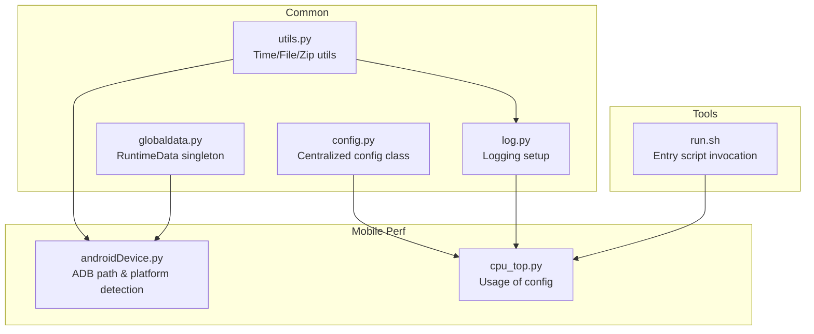
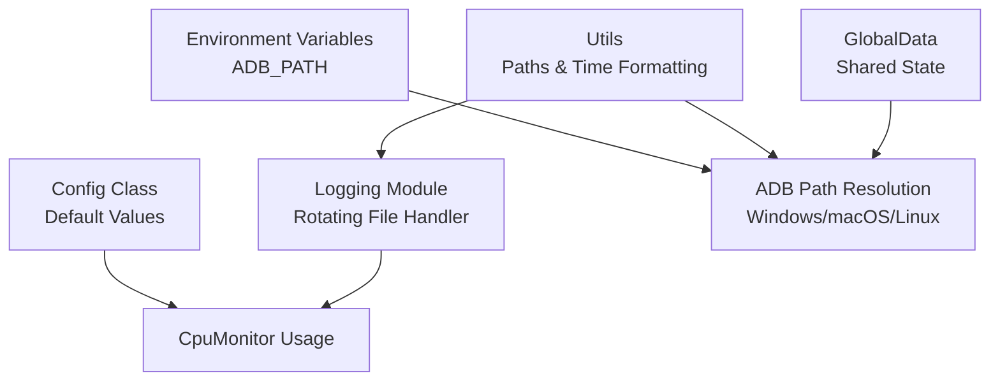
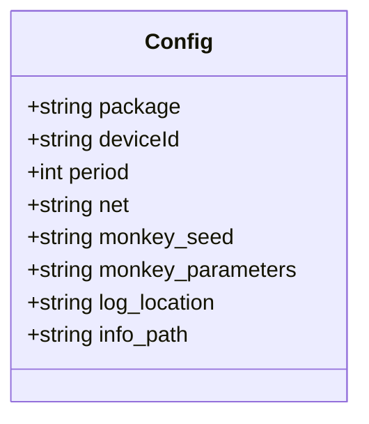
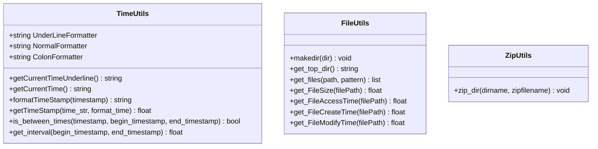
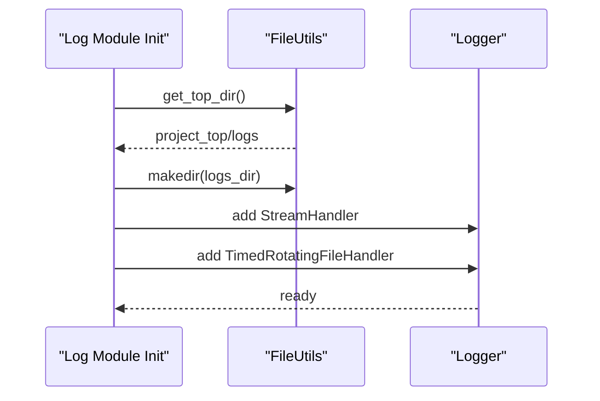
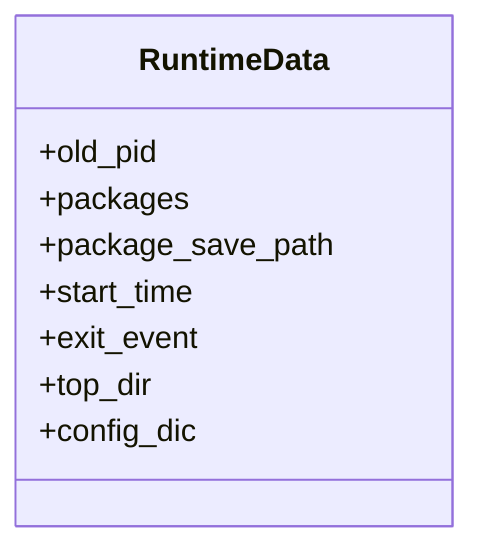
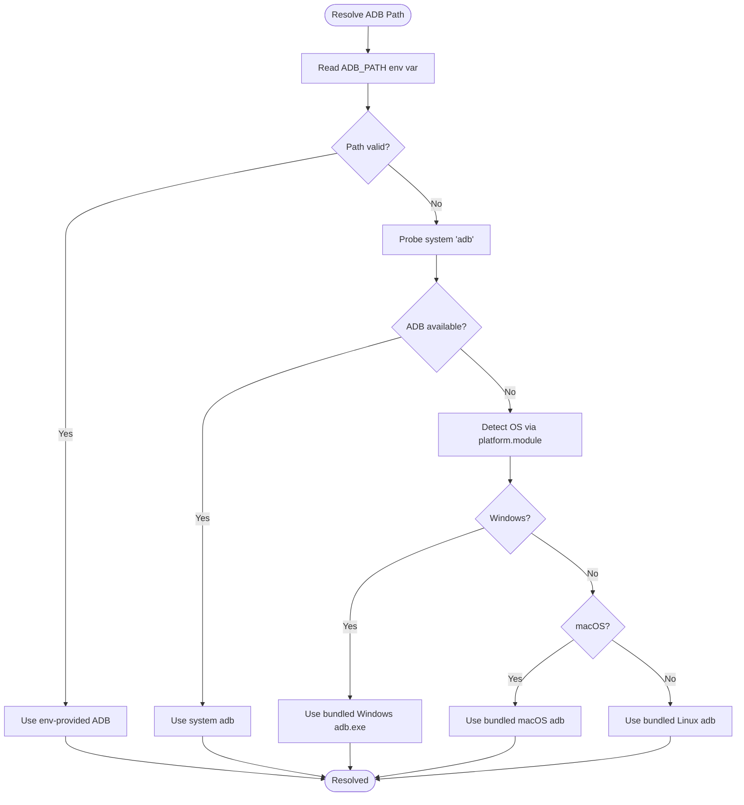
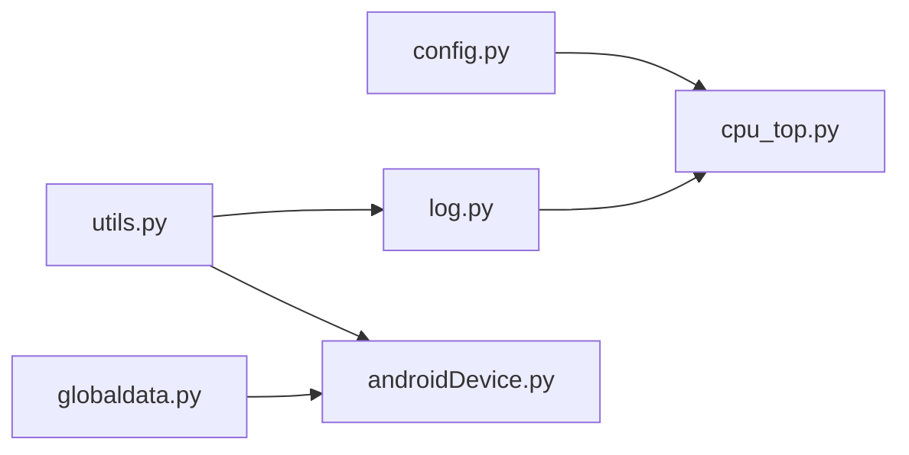

# Configuration Management

<cite>
**Referenced Files in This Document**
- [config.py](file://mobilePerf/perfCode/common/config.py)
- [utils.py](file://mobilePerf/perfCode/common/utils.py)
- [log.py](file://mobilePerf/perfCode/common/log.py)
- [globaldata.py](file://mobilePerf/perfCode/globaldata.py)
- [androidDevice.py](file://mobilePerf/perfCode/androidDevice.py)
- [cpu_top.py](file://mobilePerf/perfCode/cpu_top.py)
- [run.sh](file://mobilePerf/run.sh)
- [README.md](file://README.md)
</cite>

## Table of Contents
1. [Introduction](#introduction)
2. [Project Structure](#project-structure)
3. [Core Components](#core-components)
4. [Architecture Overview](#architecture-overview)
5. [Detailed Component Analysis](#detailed-component-analysis)
6. [Dependency Analysis](#dependency-analysis)
7. [Performance Considerations](#performance-considerations)
8. [Troubleshooting Guide](#troubleshooting-guide)
9. [Conclusion](#conclusion)
10. [Appendices](#appendices)

## Introduction
This document describes the Configuration Management system within the QA Performance Code framework. It explains how configuration is centralized, how environment settings and platform-specific behaviors are handled, and how logging and global runtime data are managed. It also covers cross-platform compatibility utilities, configuration file formats, environment variable usage, runtime parameter overrides, and best practices for managing configurations across development, staging, and production environments.

## Project Structure
The configuration system spans several modules:
- Centralized configuration class for performance monitoring parameters
- Cross-platform utilities for paths, time formatting, and file operations
- Logging configuration with rotating file handlers
- Global runtime data container for shared state
- Platform detection and ADB path resolution for Windows, macOS, and Linux
- Example usage of configuration in performance monitoring scripts

**Diagram sources**
- [config.py:1-20](file://mobilePerf/perfCode/common/config.py#L1-L20)
- [utils.py:1-156](file://mobilePerf/perfCode/common/utils.py#L1-L156)
- [log.py:1-30](file://mobilePerf/perfCode/common/log.py#L1-L30)
- [globaldata.py:1-14](file://mobilePerf/perfCode/globaldata.py#L1-L14)
- [androidDevice.py:18-71](file://mobilePerf/perfCode/androidDevice.py#L18-L71)
- [cpu_top.py:415-422](file://mobilePerf/perfCode/cpu_top.py#L415-L422)
- [run.sh:1-11](file://mobilePerf/run.sh#L1-L11)

**Section sources**
- [README.md:1-37](file://README.md#L1-L37)
- [run.sh:1-11](file://mobilePerf/run.sh#L1-L11)

## Core Components
- Centralized configuration class defines default parameters for package identifiers, device IDs, sampling intervals, network mode, monkey testing parameters, and output paths for logs and performance data.
- Cross-platform utilities encapsulate time formatting, directory traversal, file operations, and zipping for robustness across OSes.
- Logging module initializes a rotating file handler and console handler, ensuring logs are written to a structured location under a logs directory.
- Global runtime data provides a shared container for runtime variables such as exit events, top-level directories, and configuration dictionaries.
- Platform-aware ADB path resolution reads environment variables and selects appropriate platform tool locations for Windows, macOS, and Linux.

**Section sources**
- [config.py:1-20](file://mobilePerf/perfCode/common/config.py#L1-L20)
- [utils.py:10-156](file://mobilePerf/perfCode/common/utils.py#L10-L156)
- [log.py:11-26](file://mobilePerf/perfCode/common/log.py#L11-L26)
- [globaldata.py:6-14](file://mobilePerf/perfCode/globaldata.py#L6-L14)
- [androidDevice.py:40-71](file://mobilePerf/perfCode/androidDevice.py#L40-L71)

## Architecture Overview
The configuration architecture integrates environment detection, logging initialization, and global state management. Scripts import the configuration class and use it to drive performance monitoring tasks. Platform-specific logic ensures ADB tool availability across Windows, macOS, and Linux.

**Diagram sources**
- [androidDevice.py:40-71](file://mobilePerf/perfCode/androidDevice.py#L40-L71)
- [log.py:11-26](file://mobilePerf/perfCode/common/log.py#L11-L26)
- [globaldata.py:6-14](file://mobilePerf/perfCode/globaldata.py#L6-L14)
- [cpu_top.py:415-422](file://mobilePerf/perfCode/cpu_top.py#L415-L422)

## Detailed Component Analysis

### Centralized Configuration Class
- Purpose: Provide default configuration values for device identification, sampling periods, network mode, monkey testing parameters, and output paths for logs and performance data.
- Key attributes: package name, device ID, sampling period, network mode, monkey seed, monkey parameters, log location, and info path.
- Usage: Imported by performance monitoring scripts to initialize monitors and define output directories.

**Diagram sources**
- [config.py:3-20](file://mobilePerf/perfCode/common/config.py#L3-L20)

**Section sources**
- [config.py:3-20](file://mobilePerf/perfCode/common/config.py#L3-L20)
- [cpu_top.py:415-422](file://mobilePerf/perfCode/cpu_top.py#L415-L422)

### Cross-Platform Utilities
- Time utilities: Provide standardized time formatting and conversion helpers for consistent timestamps across platforms.
- File utilities: Offer directory creation, recursive file discovery, and file metadata retrieval to support cross-platform file handling.
- Zip utilities: Compress directories reliably across operating systems.

**Diagram sources**
- [utils.py:10-156](file://mobilePerf/perfCode/common/utils.py#L10-L156)

**Section sources**
- [utils.py:10-156](file://mobilePerf/perfCode/common/utils.py#L10-L156)

### Logging Configuration
- Initializes a logger named for the mobile performance module.
- Adds a console handler and a timed rotating file handler.
- Creates a logs directory under the project’s top directory and writes logs with a timestamp suffix.
- Provides a debug/info level split suitable for development and production.

**Diagram sources**
- [log.py:11-26](file://mobilePerf/perfCode/common/log.py#L11-L26)
- [utils.py:60-64](file://mobilePerf/perfCode/common/utils.py#L60-L64)

**Section sources**
- [log.py:11-26](file://mobilePerf/perfCode/common/log.py#L11-L26)

### Global Runtime Data
- Provides a shared container for runtime variables such as exit events, top-level directories, and a dictionary for passing configuration across modules.
- Ensures consistent state sharing among threads and across modules.

**Diagram sources**
- [globaldata.py:6-14](file://mobilePerf/perfCode/globaldata.py#L6-L14)

**Section sources**
- [globaldata.py:6-14](file://mobilePerf/perfCode/globaldata.py#L6-L14)

### Platform-Specific Configuration Handling
- ADB path resolution checks an environment variable first, then probes the system for a usable ADB binary, and finally falls back to bundled platform tools.
- Platform detection uses the operating system name to select the correct bundled ADB executable for Windows, macOS, or Linux.

**Diagram sources**
- [androidDevice.py:40-71](file://mobilePerf/perfCode/androidDevice.py#L40-L71)

**Section sources**
- [androidDevice.py:40-71](file://mobilePerf/perfCode/androidDevice.py#L40-L71)

### Credential Management
- No credentials are stored in the analyzed configuration files. Environment variables are used for ADB path resolution, and logging credentials are not configured in the provided files.
- Best practice recommendation: Store secrets externally (e.g., environment variables or secure secret managers) and avoid committing sensitive data to source control.

**Section sources**
- [androidDevice.py:48](file://mobilePerf/perfCode/androidDevice.py#L48)

### Configuration File Formats and Environment Variables
- Configuration class uses Python class attributes for defaults; no external configuration files were identified in the analyzed files.
- Environment variable ADB_PATH is used to override the ADB tool path.
- Logging configuration does not rely on external config files; it constructs paths programmatically.

**Section sources**
- [config.py:3-20](file://mobilePerf/perfCode/common/config.py#L3-L20)
- [androidDevice.py:48](file://mobilePerf/perfCode/androidDevice.py#L48)
- [log.py:17-18](file://mobilePerf/perfCode/common/log.py#L17-L18)

### Runtime Parameter Overrides
- The configuration class exposes attributes that can be overridden at runtime by assigning new values to the class instance or by modifying the imported configuration object before use.
- Example usage shows importing the configuration class and passing its attributes to a monitor.

**Section sources**
- [cpu_top.py:415-422](file://mobilePerf/perfCode/cpu_top.py#L415-L422)

### Examples of Customizing Configurations for Different Deployment Scenarios
- Development: Adjust sampling period and log verbosity; keep default paths for local runs.
- Staging: Override device ID and package name; set ADB_PATH to a staging-specific SDK.
- Production: Centralize configuration via environment variables and ensure logs rotate with retention policies.

[No sources needed since this section provides general guidance]

## Dependency Analysis
The configuration system exhibits low coupling and high cohesion:
- The configuration class is consumed by performance monitoring scripts.
- Utilities are reused by logging and device management modules.
- Global runtime data is referenced by device management for shared state.
- Platform detection is encapsulated within the device management module.

**Diagram sources**
- [config.py:1-20](file://mobilePerf/perfCode/common/config.py#L1-L20)
- [utils.py:1-156](file://mobilePerf/perfCode/common/utils.py#L1-L156)
- [log.py:1-30](file://mobilePerf/perfCode/common/log.py#L1-L30)
- [globaldata.py:1-14](file://mobilePerf/perfCode/globaldata.py#L1-L14)
- [cpu_top.py:415-422](file://mobilePerf/perfCode/cpu_top.py#L415-L422)

**Section sources**
- [cpu_top.py:415-422](file://mobilePerf/perfCode/cpu_top.py#L415-L422)
- [androidDevice.py:18-71](file://mobilePerf/perfCode/androidDevice.py#L18-L71)

## Performance Considerations
- Prefer environment variables for ADB path resolution to avoid repeated probing and to reduce startup latency.
- Use rotating log handlers to manage disk usage and avoid unbounded log growth.
- Cache platform detection results to minimize repeated system calls.

[No sources needed since this section provides general guidance]

## Troubleshooting Guide
- ADB path issues: Verify ADB_PATH environment variable; ensure system adb is available; confirm platform-specific bundled tool path is correct.
- Log directory creation failures: Confirm write permissions in the project top directory; ensure FileUtils.makedir is invoked before handler initialization.
- Device connection errors: Review ADB error messages and port conflicts; resolve 5037 conflicts on Windows if necessary.

**Section sources**
- [androidDevice.py:48-71](file://mobilePerf/perfCode/androidDevice.py#L48-L71)
- [log.py:17-18](file://mobilePerf/perfCode/common/log.py#L17-L18)

## Conclusion
The QA Performance Code framework centralizes configuration through a simple Python class, supports cross-platform operations via dedicated utilities, and initializes logging with rotating file handlers. Platform-specific ADB path resolution ensures reliable operation across Windows, macOS, and Linux. For production deployments, externalize secrets via environment variables, enforce strict configuration overrides, and adopt rotation and retention policies for logs.

[No sources needed since this section summarizes without analyzing specific files]

## Appendices
- Entry scripts demonstrate invoking tools that rely on configuration and logging.

**Section sources**
- [run.sh:1-11](file://mobilePerf/run.sh#L1-L11)