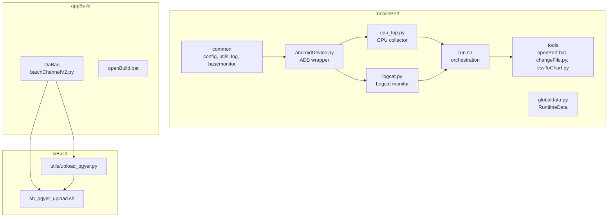
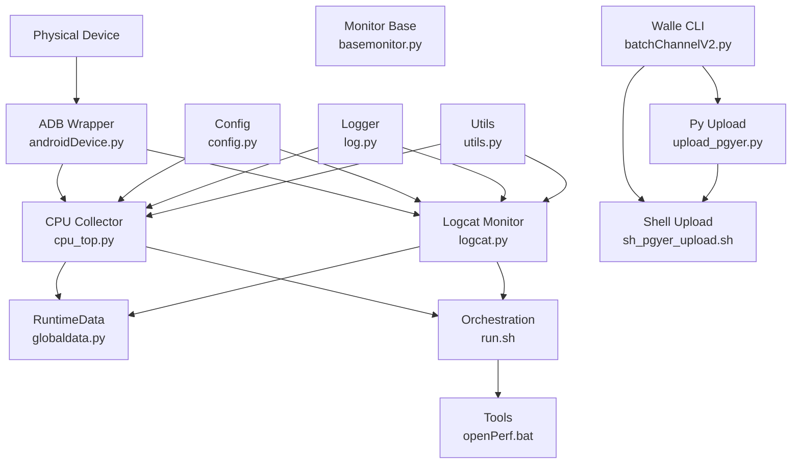
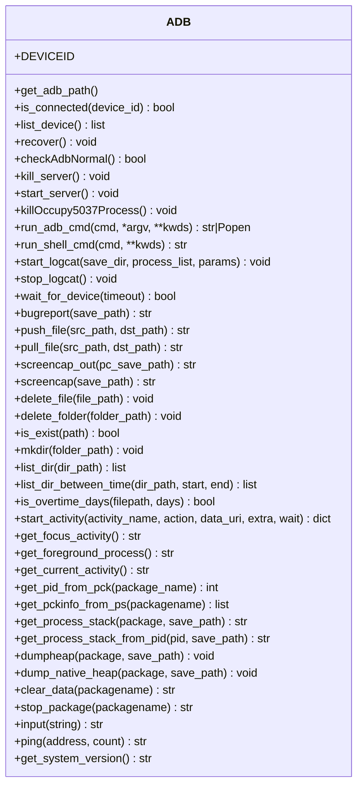
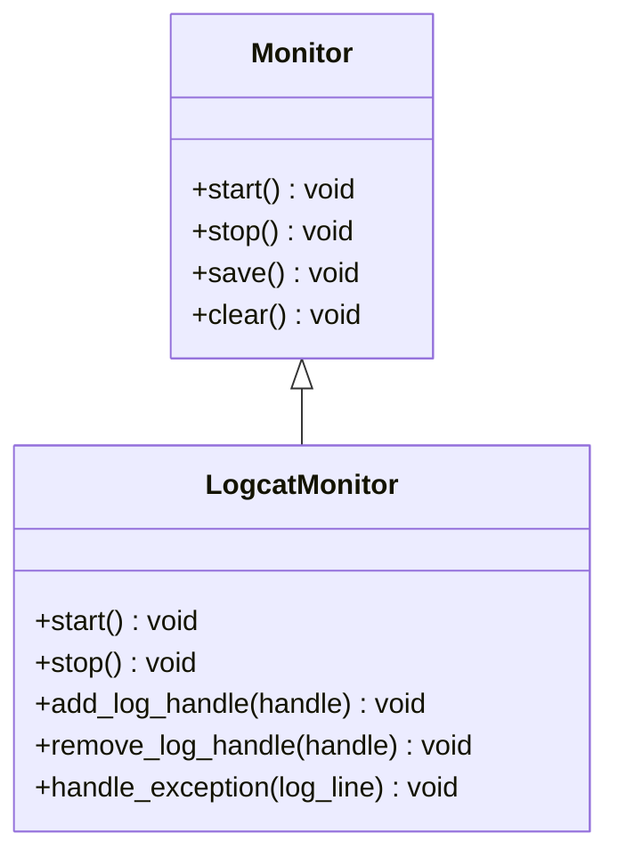
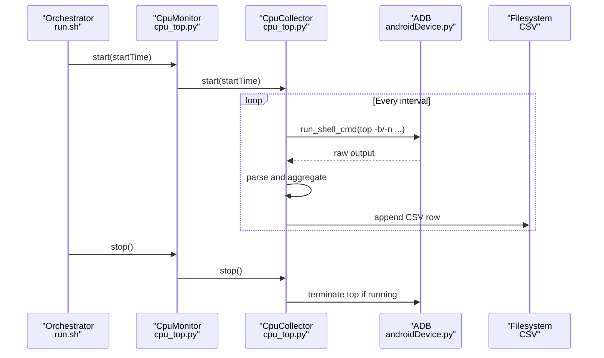
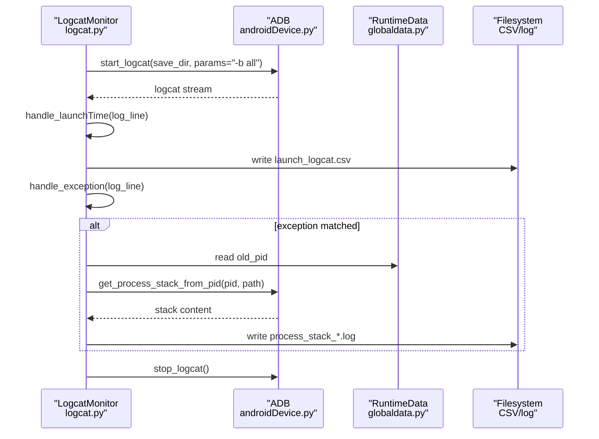
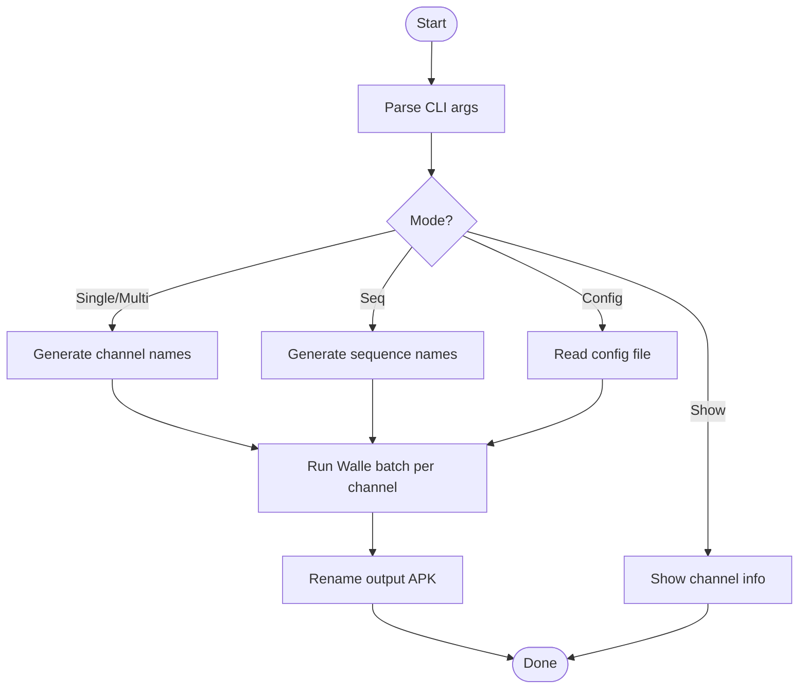
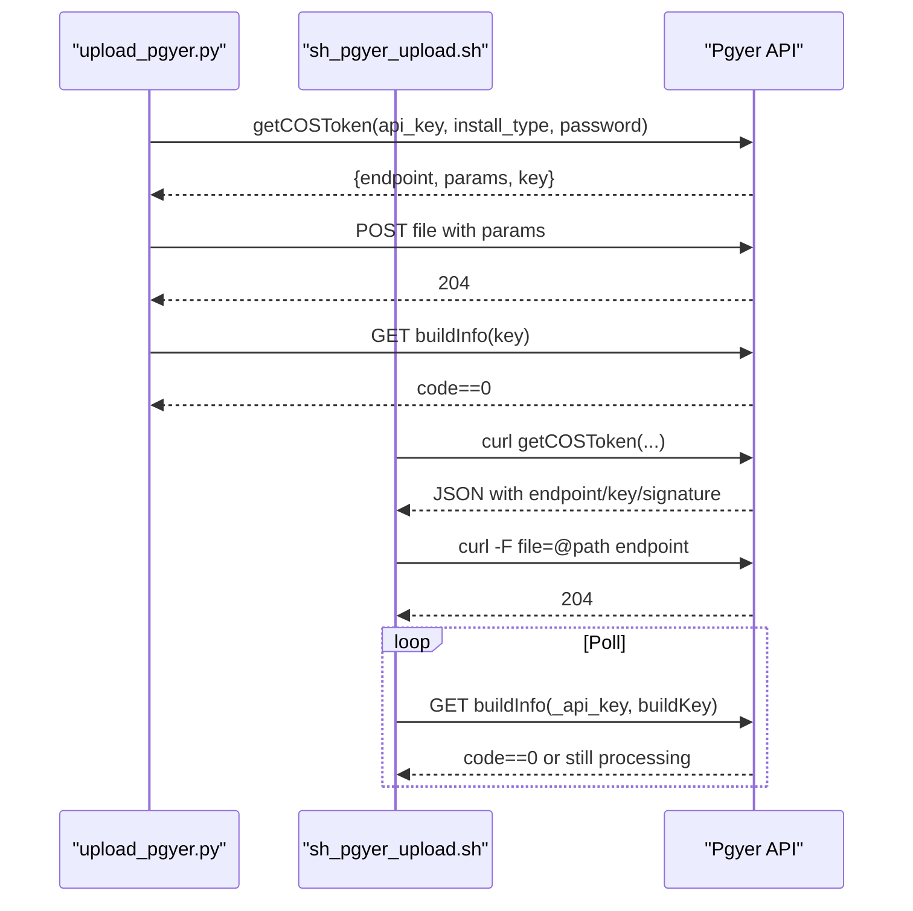
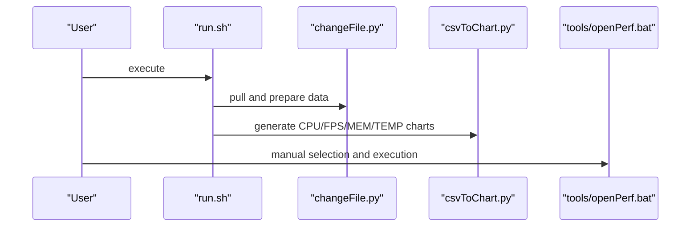
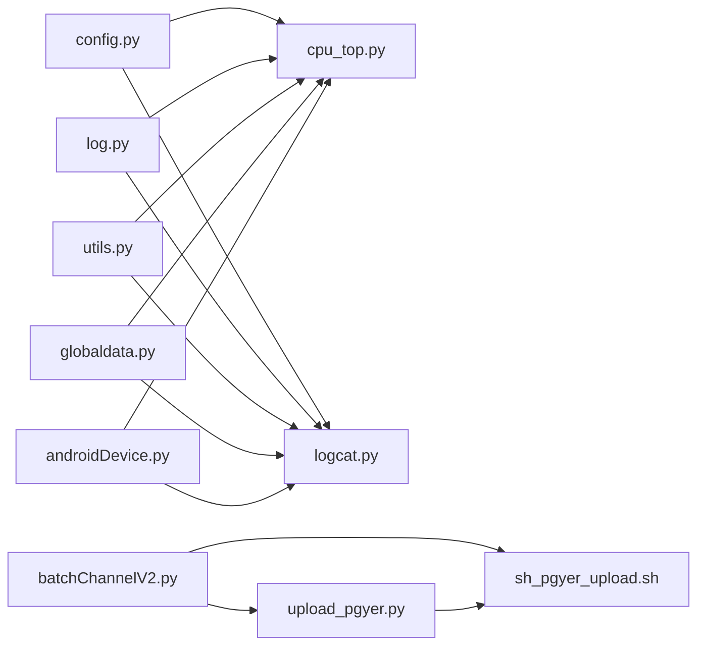

# Component Relationships and Data Flow

<cite>
**Referenced Files in This Document**
- [README.md](file://README.md)
- [androidDevice.py](file://mobilePerf/perfCode/androidDevice.py)
- [basemonitor.py](file://mobilePerf/perfCode/common/basemonitor.py)
- [config.py](file://mobilePerf/perfCode/common/config.py)
- [log.py](file://mobilePerf/perfCode/common/log.py)
- [utils.py](file://mobilePerf/perfCode/common/utils.py)
- [cpu_top.py](file://mobilePerf/perfCode/cpu_top.py)
- [logcat.py](file://mobilePerf/perfCode/logcat.py)
- [globaldata.py](file://mobilePerf/perfCode/globaldata.py)
- [runFps.py](file://mobilePerf/perfCode/runFps.py)
- [run.sh](file://mobilePerf/run.sh)
- [openPerf.bat](file://mobilePerf/tools/openPerf.bat)
- [batchChannelV2.py](file://appBuild/DaBao/batchChannelV2.py)
- [openBuild.bat](file://appBuild/openBuild.bat)
- [upload_pgyer.py](file://ciBuild/utils/upload_pgyer.py)
- [sh_pgyer_upload.sh](file://ciBuild/sh_pgyer_upload.sh)
</cite>

## Table of Contents
1. [Introduction](#introduction)
2. [Project Structure](#project-structure)
3. [Core Components](#core-components)
4. [Architecture Overview](#architecture-overview)
5. [Detailed Component Analysis](#detailed-component-analysis)
6. [Dependency Analysis](#dependency-analysis)
7. [Performance Considerations](#performance-considerations)
8. [Troubleshooting Guide](#troubleshooting-guide)
9. [Conclusion](#conclusion)
10. [Appendices](#appendices)

## Introduction
This document describes how performance monitoring, build automation, and CI/CD integration components interact within the repository. It focuses on component relationships, data flow patterns, inter-component communication protocols, shared resources management, and lifecycle management. It also documents how APK build tools, performance data collection, and distribution systems coordinate, and how errors propagate through the system.

## Project Structure
The repository is organized into three primary areas:
- mobilePerf: performance data acquisition, parsing, and reporting
- appBuild: APK build and packaging utilities (including channel packaging)
- ciBuild: CI/CD upload utilities for distribution platforms

**Diagram sources**
- [androidDevice.py:18-120](file://mobilePerf/perfCode/androidDevice.py#L18-L120)
- [cpu_top.py:206-383](file://mobilePerf/perfCode/cpu_top.py#L206-L383)
- [logcat.py:17-116](file://mobilePerf/perfCode/logcat.py#L17-L116)
- [run.sh:1-29](file://mobilePerf/run.sh#L1-L29)
- [batchChannelV2.py:21-70](file://appBuild/DaBao/batchChannelV2.py#L21-L70)
- [upload_pgyer.py:43-86](file://ciBuild/utils/upload_pgyer.py#L43-L86)
- [sh_pgyer_upload.sh:55-86](file://ciBuild/sh_pgyer_upload.sh#L55-L86)

**Section sources**
- [README.md:1-37](file://README.md#L1-L37)
- [openBuild.bat:1-23](file://appBuild/openBuild.bat#L1-L23)

## Core Components
- ADB wrapper: Provides device connectivity, command execution, logcat streaming, and file operations.
- Monitor base: Defines the contract for performance monitors (start, stop, save, clear).
- CPU monitor: Collects CPU metrics via top, writes CSV, and supports multi-package aggregation.
- Logcat monitor: Streams and parses logcat, extracts launch time metrics, and optionally captures stacks on exceptions.
- Global runtime data: Shared state for paths, packages, and synchronization primitives.
- Build tools: Channel packaging via Walle CLI and batch operations.
- Distribution utilities: Upload to distribution platforms via Python and Shell scripts.

**Section sources**
- [androidDevice.py:18-120](file://mobilePerf/perfCode/androidDevice.py#L18-L120)
- [basemonitor.py:7-34](file://mobilePerf/perfCode/common/basemonitor.py#L7-L34)
- [cpu_top.py:206-383](file://mobilePerf/perfCode/cpu_top.py#L206-L383)
- [logcat.py:17-116](file://mobilePerf/perfCode/logcat.py#L17-L116)
- [globaldata.py:6-14](file://mobilePerf/perfCode/globaldata.py#L6-L14)
- [batchChannelV2.py:21-70](file://appBuild/DaBao/batchChannelV2.py#L21-L70)
- [upload_pgyer.py:43-86](file://ciBuild/utils/upload_pgyer.py#L43-L86)
- [sh_pgyer_upload.sh:55-86](file://ciBuild/sh_pgyer_upload.sh#L55-L86)

## Architecture Overview
The system follows a layered architecture:
- Device abstraction layer (ADB)
- Data collection layer (CPU, Logcat)
- Orchestration layer (scripts and batch tools)
- Distribution layer (CI/CD upload utilities)

**Diagram sources**
- [androidDevice.py:18-120](file://mobilePerf/perfCode/androidDevice.py#L18-L120)
- [cpu_top.py:206-383](file://mobilePerf/perfCode/cpu_top.py#L206-L383)
- [logcat.py:17-116](file://mobilePerf/perfCode/logcat.py#L17-L116)
- [globaldata.py:6-14](file://mobilePerf/perfCode/globaldata.py#L6-L14)
- [config.py:3-20](file://mobilePerf/perfCode/common/config.py#L3-L20)
- [log.py:22-75](file://mobilePerf/perfCode/common/log.py#L22-L75)
- [utils.py:10-156](file://mobilePerf/perfCode/common/utils.py#L10-L156)
- [run.sh:1-29](file://mobilePerf/run.sh#L1-L29)
- [openPerf.bat:1-7](file://mobilePerf/tools/openPerf.bat#L1-L7)
- [batchChannelV2.py:21-70](file://appBuild/DaBao/batchChannelV2.py#L21-L70)
- [upload_pgyer.py:43-86](file://ciBuild/utils/upload_pgyer.py#L43-L86)
- [sh_pgyer_upload.sh:55-86](file://ciBuild/sh_pgyer_upload.sh#L55-L86)

## Detailed Component Analysis

### ADB Wrapper and Device Lifecycle
The ADB wrapper encapsulates device discovery, connection health, and command execution. It manages retries, timeouts, and OS-specific paths for the adb binary. It also starts/stops logcat streams and performs file operations on the device.

**Diagram sources**
- [androidDevice.py:18-800](file://mobilePerf/perfCode/androidDevice.py#L18-L800)

**Section sources**
- [androidDevice.py:18-120](file://mobilePerf/perfCode/androidDevice.py#L18-L120)
- [androidDevice.py:177-293](file://mobilePerf/perfCode/androidDevice.py#L177-L293)
- [androidDevice.py:389-422](file://mobilePerf/perfCode/androidDevice.py#L389-L422)

### Monitor Base and Extension Contracts
The monitor base defines a common interface for data collectors. Subclasses implement start, stop, and save semantics.

**Diagram sources**
- [basemonitor.py:7-34](file://mobilePerf/perfCode/common/basemonitor.py#L7-L34)
- [logcat.py:17-116](file://mobilePerf/perfCode/logcat.py#L17-L116)

**Section sources**
- [basemonitor.py:7-34](file://mobilePerf/perfCode/common/basemonitor.py#L7-L34)
- [logcat.py:17-116](file://mobilePerf/perfCode/logcat.py#L17-L116)

### CPU Data Collection Workflow
CPU metrics are collected periodically via top, parsed, aggregated, and written to CSV. The monitor coordinates timing and persistence.

**Diagram sources**
- [cpu_top.py:240-347](file://mobilePerf/perfCode/cpu_top.py#L240-L347)
- [androidDevice.py:276-293](file://mobilePerf/perfCode/androidDevice.py#L276-L293)

**Section sources**
- [cpu_top.py:206-383](file://mobilePerf/perfCode/cpu_top.py#L206-L383)
- [androidDevice.py:276-293](file://mobilePerf/perfCode/androidDevice.py#L276-L293)

### Logcat Parsing and Launch Metrics
Logcat monitor subscribes to real-time logs, extracts launch time metrics, and optionally writes exception logs and stacks.

**Diagram sources**
- [logcat.py:32-116](file://mobilePerf/perfCode/logcat.py#L32-L116)
- [androidDevice.py:389-422](file://mobilePerf/perfCode/androidDevice.py#L389-L422)
- [globaldata.py:6-14](file://mobilePerf/perfCode/globaldata.py#L6-L14)

**Section sources**
- [logcat.py:17-216](file://mobilePerf/perfCode/logcat.py#L17-L216)
- [globaldata.py:6-14](file://mobilePerf/perfCode/globaldata.py#L6-L14)

### Build Automation and Channel Packaging
Channel packaging uses Walle CLI to modify APK metadata. The script supports single, multiple, and sequential channels and renames outputs accordingly.

**Diagram sources**
- [batchChannelV2.py:21-116](file://appBuild/DaBao/batchChannelV2.py#L21-L116)

**Section sources**
- [batchChannelV2.py:21-120](file://appBuild/DaBao/batchChannelV2.py#L21-L120)
- [openBuild.bat:1-23](file://appBuild/openBuild.bat#L1-L23)

### CI/CD Upload Integration
Two upload paths are provided: a Python module and a shell script. Both obtain an upload token, upload the artifact, and poll for completion.

**Diagram sources**
- [upload_pgyer.py:43-108](file://ciBuild/utils/upload_pgyer.py#L43-L108)
- [sh_pgyer_upload.sh:55-103](file://ciBuild/sh_pgyer_upload.sh#L55-L103)

**Section sources**
- [upload_pgyer.py:43-108](file://ciBuild/utils/upload_pgyer.py#L43-L108)
- [sh_pgyer_upload.sh:55-103](file://ciBuild/sh_pgyer_upload.sh#L55-L103)

### Orchestration and Reporting
The orchestration script coordinates pulling performance data and generating charts. Tools assist in local data preparation and visualization.

**Diagram sources**
- [run.sh:1-29](file://mobilePerf/run.sh#L1-L29)
- [openPerf.bat:1-7](file://mobilePerf/tools/openPerf.bat#L1-L7)

**Section sources**
- [run.sh:1-29](file://mobilePerf/run.sh#L1-L29)
- [openPerf.bat:1-7](file://mobilePerf/tools/openPerf.bat#L1-L7)

## Dependency Analysis
- Device layer depends on platform-specific adb availability and handles retries and timeouts.
- Monitors depend on ADB for data and on RuntimeData for persistent paths.
- Config and logging are shared across components.
- Build tools depend on external Walle CLI and Java runtime.
- Distribution utilities depend on network connectivity and remote APIs.

**Diagram sources**
- [config.py:3-20](file://mobilePerf/perfCode/common/config.py#L3-L20)
- [log.py:22-75](file://mobilePerf/perfCode/common/log.py#L22-L75)
- [utils.py:10-156](file://mobilePerf/perfCode/common/utils.py#L10-L156)
- [globaldata.py:6-14](file://mobilePerf/perfCode/globaldata.py#L6-L14)
- [androidDevice.py:18-120](file://mobilePerf/perfCode/androidDevice.py#L18-L120)
- [cpu_top.py:206-383](file://mobilePerf/perfCode/cpu_top.py#L206-L383)
- [logcat.py:17-116](file://mobilePerf/perfCode/logcat.py#L17-L116)
- [batchChannelV2.py:21-70](file://appBuild/DaBao/batchChannelV2.py#L21-L70)
- [upload_pgyer.py:43-86](file://ciBuild/utils/upload_pgyer.py#L43-L86)
- [sh_pgyer_upload.sh:55-86](file://ciBuild/sh_pgyer_upload.sh#L55-L86)

**Section sources**
- [androidDevice.py:18-120](file://mobilePerf/perfCode/androidDevice.py#L18-L120)
- [cpu_top.py:206-383](file://mobilePerf/perfCode/cpu_top.py#L206-L383)
- [logcat.py:17-116](file://mobilePerf/perfCode/logcat.py#L17-L116)
- [batchChannelV2.py:21-70](file://appBuild/DaBao/batchChannelV2.py#L21-L70)
- [upload_pgyer.py:43-86](file://ciBuild/utils/upload_pgyer.py#L43-L86)
- [sh_pgyer_upload.sh:55-86](file://ciBuild/sh_pgyer_upload.sh#L55-L86)

## Performance Considerations
- CPU sampling frequency and intervals impact overhead; tune interval and timeout parameters to balance accuracy and load.
- Logcat buffering and file rotation prevent unbounded growth; ensure storage capacity and cleanup policies are adequate.
- ADB retries and timeouts mitigate transient failures; avoid excessive retry counts to prevent long stalls.
- CSV writing is batched; consider flushing strategies and disk I/O limits during extended runs.
- Network uploads in CI/CD are asynchronous; implement backoff and polling to reduce API pressure.

[No sources needed since this section provides general guidance]

## Troubleshooting Guide
Common failure modes and mitigations:
- ADB connectivity issues: device not found, offline, or port conflicts. The ADB wrapper recovers by killing/restarting the server and clearing conflicting processes.
- Command failures: ADB commands return non-zero exit codes; the wrapper logs errors and returns empty strings to signal failure.
- Logcat parsing: malformed lines are handled gracefully; ensure buffer parameters and filters are appropriate for the target device.
- Upload failures: Token retrieval or upload status checks may fail; scripts poll until completion or return explicit HTTP codes.

**Section sources**
- [androidDevice.py:121-176](file://mobilePerf/perfCode/androidDevice.py#L121-L176)
- [androidDevice.py:236-274](file://mobilePerf/perfCode/androidDevice.py#L236-L274)
- [logcat.py:85-116](file://mobilePerf/perfCode/logcat.py#L85-L116)
- [upload_pgyer.py:39-86](file://ciBuild/utils/upload_pgyer.py#L39-L86)
- [sh_pgyer_upload.sh:64-86](file://ciBuild/sh_pgyer_upload.sh#L64-L86)

## Conclusion
The repository integrates device-level data collection, build tooling, and distribution utilities into a cohesive pipeline. Clear separation of concerns, shared configuration/logging, and robust error handling enable reliable performance monitoring and automated delivery. Extending the system involves adding new monitors that adhere to the base interface, integrating additional distribution endpoints, and refining orchestration scripts.

[No sources needed since this section summarizes without analyzing specific files]

## Appendices

### Component Lifecycle Management
- Initialization: Monitors construct device connections and allocate resources (threads, file handles).
- Running: Monitors collect data at configured intervals, persisting to CSV or logs.
- Shutdown: Monitors stop threads, terminate subprocesses, and flush buffers.
- Cleanup: ADB wrapper ensures logcat processes are terminated and temporary artifacts are removed.

**Section sources**
- [cpu_top.py:249-263](file://mobilePerf/perfCode/cpu_top.py#L249-L263)
- [logcat.py:48-69](file://mobilePerf/perfCode/logcat.py#L48-L69)
- [androidDevice.py:414-422](file://mobilePerf/perfCode/androidDevice.py#L414-L422)

### Graceful Degradation Scenarios
- Device unavailable: ADB wrapper retries and falls back to safe defaults; collection loops skip missing data.
- API throttling: CI/CD upload scripts implement polling and backoff; continue after transient errors.
- Storage exhaustion: Log and CSV writers enforce size limits and rotation; ensure sufficient disk space.

**Section sources**
- [androidDevice.py:284-292](file://mobilePerf/perfCode/androidDevice.py#L284-L292)
- [cpu_top.py:277-280](file://mobilePerf/perfCode/cpu_top.py#L277-L280)
- [upload_pgyer.py:92-107](file://ciBuild/utils/upload_pgyer.py#L92-L107)