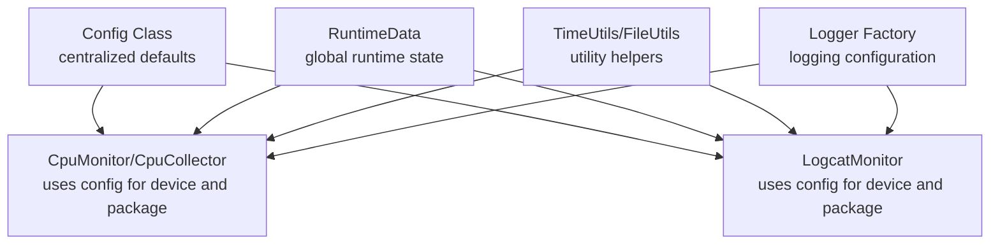
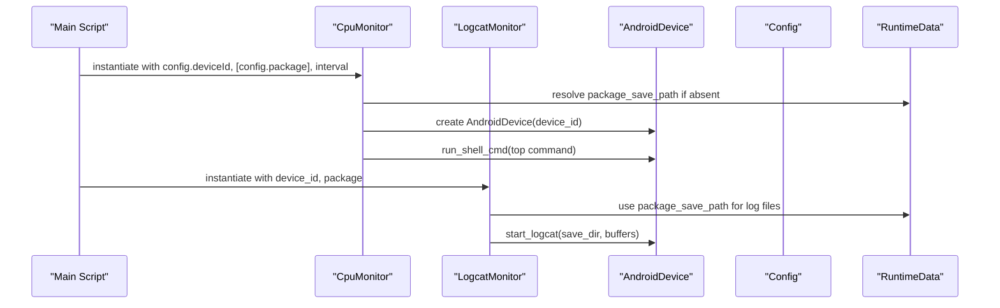
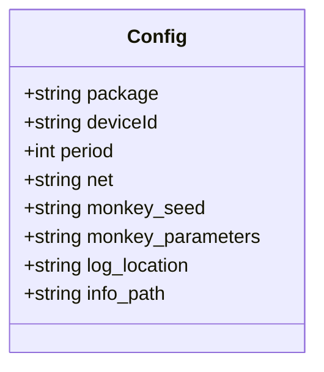
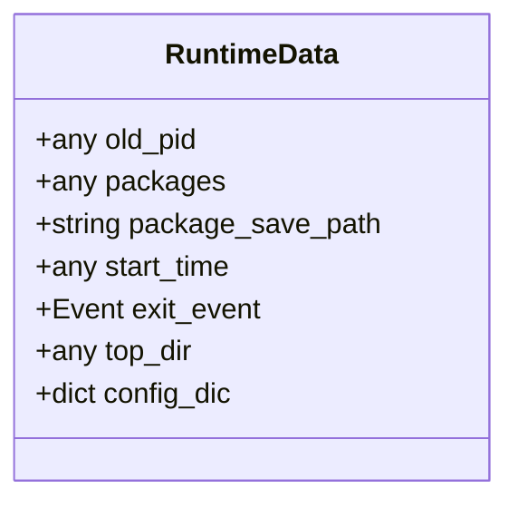
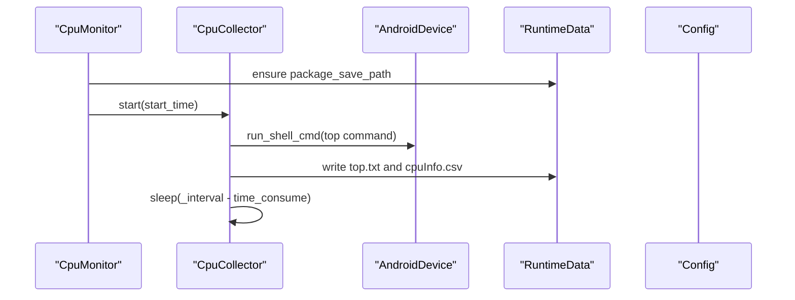
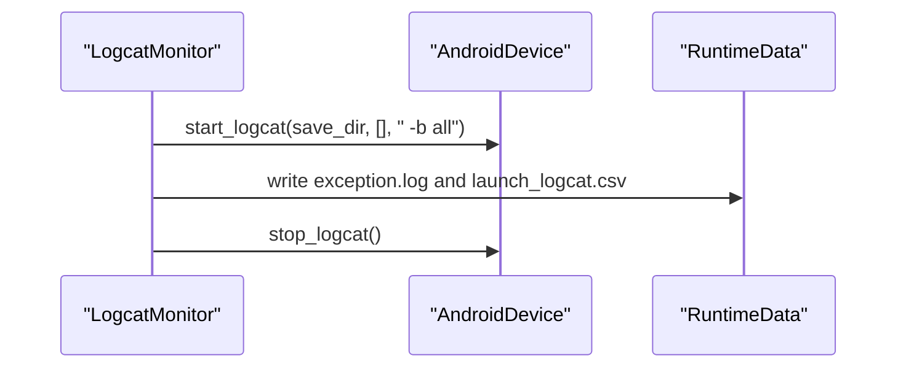
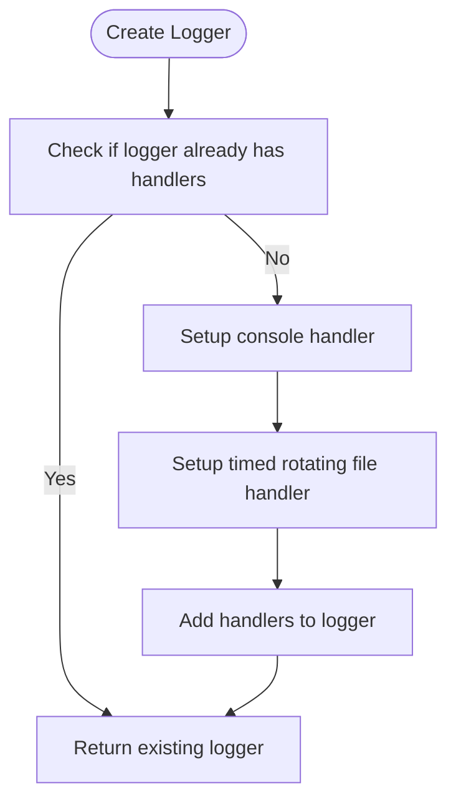
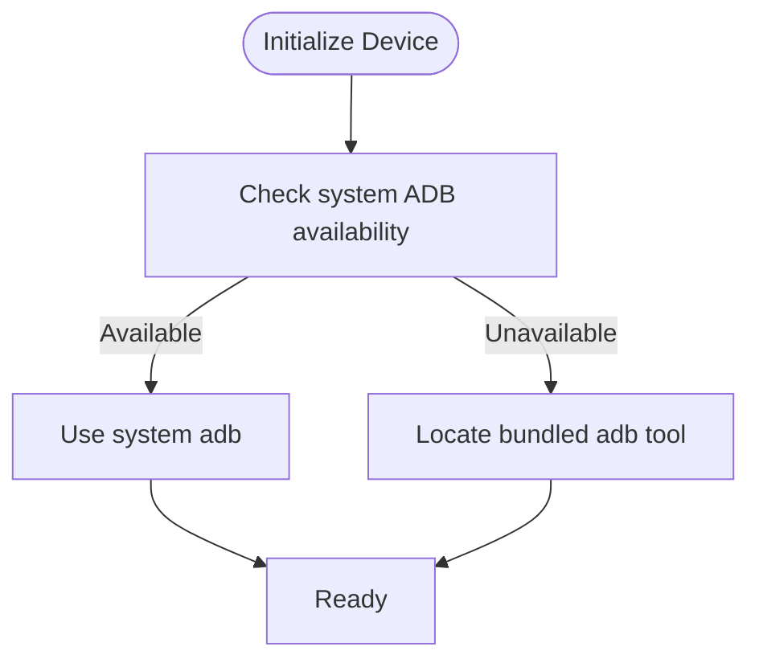
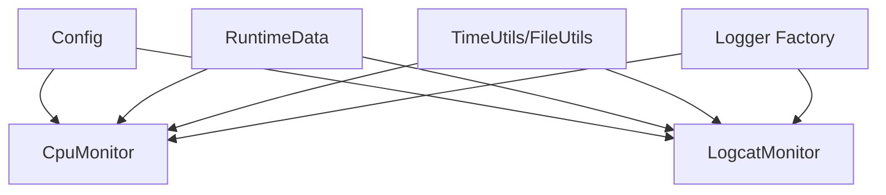

# Configuration Management System

<cite>
**Referenced Files in This Document**
- [config.py](file://mobilePerf/perfCode/common/config.py)
- [basemonitor.py](file://mobilePerf/perfCode/common/basemonitor.py)
- [logcat.py](file://mobilePerf/perfCode/logcat.py)
- [cpu_top.py](file://mobilePerf/perfCode/cpu_top.py)
- [androidDevice.py](file://mobilePerf/perfCode/androidDevice.py)
- [globaldata.py](file://mobilePerf/perfCode/globaldata.py)
- [utils.py](file://mobilePerf/perfCode/common/utils.py)
- [log.py](file://mobilePerf/perfCode/common/log.py)
- [README.md](file://README.md)
</cite>

## Table of Contents
1. [Introduction](#introduction)
2. [Project Structure](#project-structure)
3. [Core Components](#core-components)
4. [Architecture Overview](#architecture-overview)
5. [Detailed Component Analysis](#detailed-component-analysis)
6. [Dependency Analysis](#dependency-analysis)
7. [Performance Considerations](#performance-considerations)
8. [Troubleshooting Guide](#troubleshooting-guide)
9. [Conclusion](#conclusion)
10. [Appendices](#appendices)

## Introduction
This document describes the configuration management system used by the mobile performance measurement toolkit. It explains the centralized configuration class structure, parameter usage across components, environment-specific behaviors, and how runtime data is shared globally. It also covers how configuration affects system behavior, error handling for invalid configurations, and practical guidance for persistence, backups, and migrations.

## Project Structure
The configuration system centers around a simple, centralized Python class that holds default parameters. Supporting modules manage device connectivity, monitoring, logging, and runtime data sharing. The following diagram shows the primary configuration and related modules.

**Diagram sources**
- [config.py:1-20](file://mobilePerf/perfCode/common/config.py#L1-L20)
- [cpu_top.py:350-383](file://mobilePerf/perfCode/cpu_top.py#L350-L383)
- [logcat.py:17-31](file://mobilePerf/perfCode/logcat.py#L17-L31)
- [globaldata.py:6-14](file://mobilePerf/perfCode/globaldata.py#L6-L14)
- [utils.py:10-156](file://mobilePerf/perfCode/common/utils.py#L10-L156)
- [log.py:22-79](file://mobilePerf/perfCode/common/log.py#L22-L79)

**Section sources**
- [README.md:24-30](file://README.md#L24-L30)
- [config.py:1-20](file://mobilePerf/perfCode/common/config.py#L1-L20)
- [globaldata.py:6-14](file://mobilePerf/perfCode/globaldata.py#L6-L14)

## Core Components
- Centralized configuration class
  - Holds default values for package name, device identifier, sampling period, network mode, monkey seed, monkey parameters, log location, and performance data storage path.
  - Provides a single source of truth for commonly used parameters across modules.

- Runtime data holder
  - A global container for shared runtime state, including the package save path and configuration dictionary placeholder.

- Logging configuration
  - A logger factory that creates a rotating file logger and console handler, ensuring consistent logging behavior across modules.

- Utility helpers
  - Time utilities for timestamps and formatting.
  - File utilities for directory creation and file size checks.

**Section sources**
- [config.py:3-20](file://mobilePerf/perfCode/common/config.py#L3-L20)
- [globaldata.py:6-14](file://mobilePerf/perfCode/globaldata.py#L6-L14)
- [log.py:22-79](file://mobilePerf/perfCode/common/log.py#L22-L79)
- [utils.py:10-156](file://mobilePerf/perfCode/common/utils.py#L10-L156)

## Architecture Overview
The configuration system is intentionally minimal and module-focused:
- The central configuration class defines defaults.
- Modules import the configuration class and use its attributes to initialize monitors and device interactions.
- Runtime data is stored in a global singleton-like class to coordinate file paths and state across modules.
- Logging is configured centrally via a dedicated module.

**Diagram sources**
- [cpu_top.py:350-383](file://mobilePerf/perfCode/cpu_top.py#L350-L383)
- [cpu_top.py:272-280](file://mobilePerf/perfCode/cpu_top.py#L272-L280)
- [logcat.py:32-47](file://mobilePerf/perfCode/logcat.py#L32-L47)
- [androidDevice.py:389-412](file://mobilePerf/perfCode/androidDevice.py#L389-L412)
- [config.py:4-19](file://mobilePerf/perfCode/common/config.py#L4-L19)
- [globaldata.py:13](file://mobilePerf/perfCode/globaldata.py#L13)

## Detailed Component Analysis

### Centralized Configuration Class
- Purpose: Provide default configuration values used by monitors and device interactions.
- Key attributes:
  - Package name, device identifier, sampling period, network mode, monkey seed, monkey parameters, log location, and performance data storage path.
- Usage: Imported by CPU and logcat monitors to initialize device connections and file paths.

**Diagram sources**
- [config.py:3-20](file://mobilePerf/perfCode/common/config.py#L3-L20)

**Section sources**
- [config.py:3-20](file://mobilePerf/perfCode/common/config.py#L3-L20)

### Runtime Data Holder
- Purpose: Share runtime state across modules, notably the package save path used for output files.
- Behavior: Initialized once and reused by CPU and logcat monitors to determine output directories.

**Diagram sources**
- [globaldata.py:6-14](file://mobilePerf/perfCode/globaldata.py#L6-L14)

**Section sources**
- [globaldata.py:6-14](file://mobilePerf/perfCode/globaldata.py#L6-L14)

### CPU Monitor and Collector
- Initialization: Uses configuration values for device ID and package name; determines sampling interval and timeout.
- Behavior: Starts a collector thread that periodically runs device commands, writes raw outputs and CSV metrics to the package save path, and respects timeouts.
- Configuration impact:
  - Sampling interval influences how frequently data is collected.
  - Timeout controls how long collection continues.
  - Package name determines which process’ metrics are extracted.

**Diagram sources**
- [cpu_top.py:350-383](file://mobilePerf/perfCode/cpu_top.py#L350-L383)
- [cpu_top.py:240-280](file://mobilePerf/perfCode/cpu_top.py#L240-L280)
- [cpu_top.py:290-348](file://mobilePerf/perfCode/cpu_top.py#L290-L348)
- [globaldata.py:13](file://mobilePerf/perfCode/globaldata.py#L13)
- [config.py:4-6](file://mobilePerf/perfCode/common/config.py#L4-L6)

**Section sources**
- [cpu_top.py:206-383](file://mobilePerf/perfCode/cpu_top.py#L206-L383)
- [cpu_top.py:350-383](file://mobilePerf/perfCode/cpu_top.py#L350-L383)

### Logcat Monitor
- Initialization: Accepts device ID and optional package list; inherits base monitor behavior.
- Behavior: Starts logcat capture with all buffers enabled, registers handlers for launch time parsing and exception logging, and writes outputs to the package save path.
- Configuration impact:
  - Device ID selects the target device.
  - Package list narrows log capture to specific processes.

**Diagram sources**
- [logcat.py:17-70](file://mobilePerf/perfCode/logcat.py#L17-L70)
- [logcat.py:48-69](file://mobilePerf/perfCode/logcat.py#L48-L69)
- [logcat.py:98-116](file://mobilePerf/perfCode/logcat.py#L98-L116)
- [logcat.py:180-212](file://mobilePerf/perfCode/logcat.py#L180-L212)
- [androidDevice.py:389-412](file://mobilePerf/perfCode/androidDevice.py#L389-L412)

**Section sources**
- [logcat.py:17-116](file://mobilePerf/perfCode/logcat.py#L17-L116)
- [logcat.py:180-212](file://mobilePerf/perfCode/logcat.py#L180-L212)

### Logging Configuration
- Purpose: Centralized logging setup with rotating file handler and console handler.
- Behavior: Creates a logger with a timed rotating file handler and a console handler, ensuring logs are persisted and rotated.

**Diagram sources**
- [log.py:22-79](file://mobilePerf/perfCode/common/log.py#L22-L79)

**Section sources**
- [log.py:22-79](file://mobilePerf/perfCode/common/log.py#L22-L79)

### Parameter Validation and Environment-Specific Settings
- Parameter validation:
  - The configuration class does not perform explicit validation; consumers rely on defaults and environment availability.
- Environment-specific settings:
  - Device connectivity and ADB availability are handled dynamically; the system adapts to missing system ADB by locating bundled tools.
  - Buffer selection for logcat is set to capture all buffers by default.

**Diagram sources**
- [androidDevice.py:40-71](file://mobilePerf/perfCode/androidDevice.py#L40-L71)

**Section sources**
- [androidDevice.py:40-71](file://mobilePerf/perfCode/androidDevice.py#L40-L71)
- [logcat.py:42-44](file://mobilePerf/perfCode/logcat.py#L42-L44)

### Configuration File Formats, Defaults, and Overrides
- File formats:
  - Configuration values are stored as Python attributes in a class; no external configuration files are present in the analyzed code.
- Defaults:
  - Defined directly in the configuration class.
- Overrides:
  - There is no explicit override mechanism shown in the analyzed code. Consumers typically import the class and use its attributes directly.

**Section sources**
- [config.py:3-20](file://mobilePerf/perfCode/common/config.py#L3-L20)

### Dynamic Configuration Updates
- The current implementation does not expose a mechanism to update configuration at runtime. Modules read configuration values during initialization and do not listen for changes afterward.

**Section sources**
- [cpu_top.py:415-420](file://mobilePerf/perfCode/cpu_top.py#L415-L420)
- [logcat.py:17-31](file://mobilePerf/perfCode/logcat.py#L17-L31)

### Relationship Between Configuration and Component Initialization
- CPU monitor initialization depends on device ID and package name from configuration.
- Logcat monitor initialization depends on device ID and optional package list.
- Both monitors rely on the global runtime data for output paths.

**Section sources**
- [cpu_top.py:355-360](file://mobilePerf/perfCode/cpu_top.py#L355-L360)
- [logcat.py:18-27](file://mobilePerf/perfCode/logcat.py#L18-L27)
- [globaldata.py:13](file://mobilePerf/perfCode/globaldata.py#L13)

### Error Handling for Invalid Configurations
- Missing or invalid configuration values are not explicitly validated in the configuration class.
- Consumers handle errors at runtime:
  - Device connectivity failures are detected and logged.
  - Missing system ADB leads to fallback to bundled tools.
  - Logcat exceptions are caught and logged, with attempts to write exception logs and process stacks.

**Section sources**
- [androidDevice.py:240-262](file://mobilePerf/perfCode/androidDevice.py#L240-L262)
- [logcat.py:98-116](file://mobilePerf/perfCode/logcat.py#L98-L116)

## Dependency Analysis
The configuration system exhibits low coupling and high cohesion:
- The configuration class is imported by monitors and device modules.
- Runtime data is shared globally to avoid passing paths through method chains.
- Utilities are used for timestamping and file operations.

**Diagram sources**
- [config.py:3-20](file://mobilePerf/perfCode/common/config.py#L3-L20)
- [cpu_top.py:350-383](file://mobilePerf/perfCode/cpu_top.py#L350-L383)
- [logcat.py:17-70](file://mobilePerf/perfCode/logcat.py#L17-L70)
- [globaldata.py:6-14](file://mobilePerf/perfCode/globaldata.py#L6-L14)
- [utils.py:10-156](file://mobilePerf/perfCode/common/utils.py#L10-L156)
- [log.py:22-79](file://mobilePerf/perfCode/common/log.py#L22-L79)

**Section sources**
- [cpu_top.py:350-383](file://mobilePerf/perfCode/cpu_top.py#L350-L383)
- [logcat.py:17-70](file://mobilePerf/perfCode/logcat.py#L17-L70)
- [globaldata.py:6-14](file://mobilePerf/perfCode/globaldata.py#L6-L14)

## Performance Considerations
- Sampling interval and timeout directly influence resource usage and data volume.
- Writing to disk occurs periodically; ensure sufficient disk space and appropriate intervals to avoid I/O bottlenecks.
- Using all logcat buffers increases log volume; adjust buffer selection if storage is constrained.

[No sources needed since this section provides general guidance]

## Troubleshooting Guide
- Device connectivity issues:
  - The system detects missing or conflicting ADB instances and attempts recovery steps.
- Logcat capture problems:
  - Exceptions are logged, and the system tries to write exception logs and process stacks.
- Missing system ADB:
  - The system locates bundled ADB tools automatically.

**Section sources**
- [androidDevice.py:121-138](file://mobilePerf/perfCode/androidDevice.py#L121-L138)
- [androidDevice.py:240-262](file://mobilePerf/perfCode/androidDevice.py#L240-L262)
- [logcat.py:98-116](file://mobilePerf/perfCode/logcat.py#L98-L116)

## Conclusion
The configuration management system is intentionally simple and pragmatic:
- A centralized configuration class provides defaults for device and package identifiers, sampling periods, and output locations.
- Monitors and device modules consume these defaults during initialization.
- Runtime data is shared globally to coordinate output paths.
- Logging is centrally configured for consistent diagnostics.
- There is no explicit validation or override mechanism; consumers rely on defaults and environment detection.

[No sources needed since this section summarizes without analyzing specific files]

## Appendices

### Appendix A: How Configuration Affects System Behavior
- Device ID and package name:
  - Determine which device and application are monitored.
- Sampling interval and timeout:
  - Control how often metrics are collected and how long collection runs.
- Log location and storage path:
  - Define where raw outputs and CSV metrics are written.

**Section sources**
- [cpu_top.py:355-360](file://mobilePerf/perfCode/cpu_top.py#L355-L360)
- [cpu_top.py:290-348](file://mobilePerf/perfCode/cpu_top.py#L290-L348)
- [logcat.py:42-44](file://mobilePerf/perfCode/logcat.py#L42-L44)

### Appendix B: Persistence, Backup Strategies, and Migration
- Persistence:
  - Metrics are persisted to CSV and text files under the package save path.
- Backups:
  - Rotating file handler is configured for log files; adjust backup count and rotation policy as needed.
- Migration:
  - When changing output paths or adding new configuration keys, update the global runtime data initialization and ensure consumers read the new keys.

**Section sources**
- [cpu_top.py:272-280](file://mobilePerf/perfCode/cpu_top.py#L272-L280)
- [logcat.py:98-116](file://mobilePerf/perfCode/logcat.py#L98-L116)
- [log.py:62-73](file://mobilePerf/perfCode/common/log.py#L62-L73)