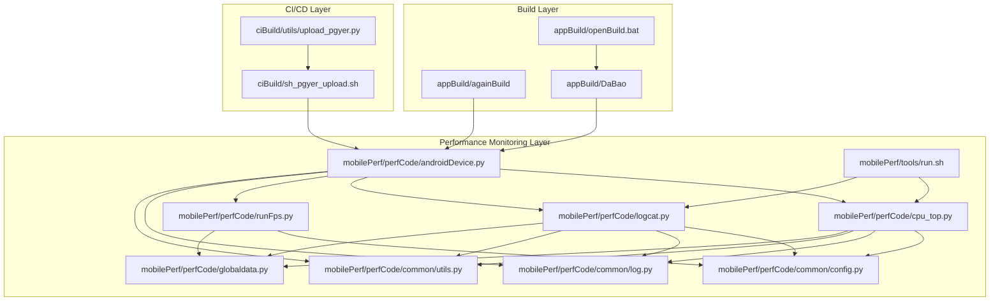
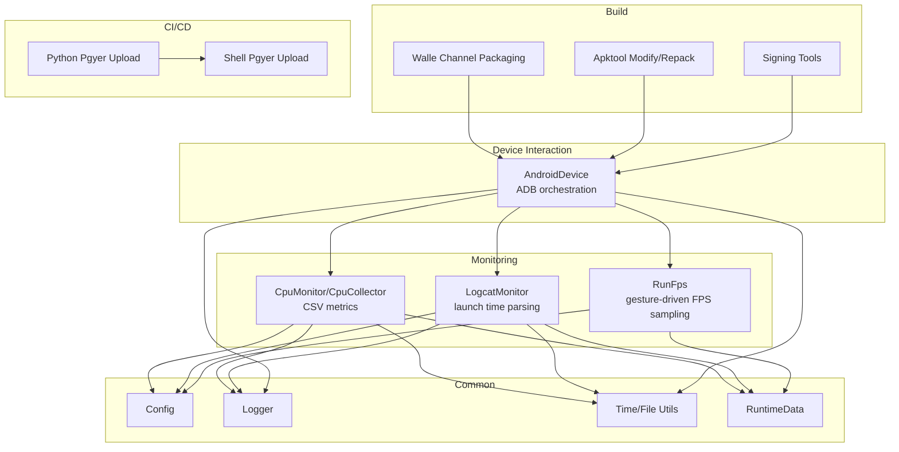
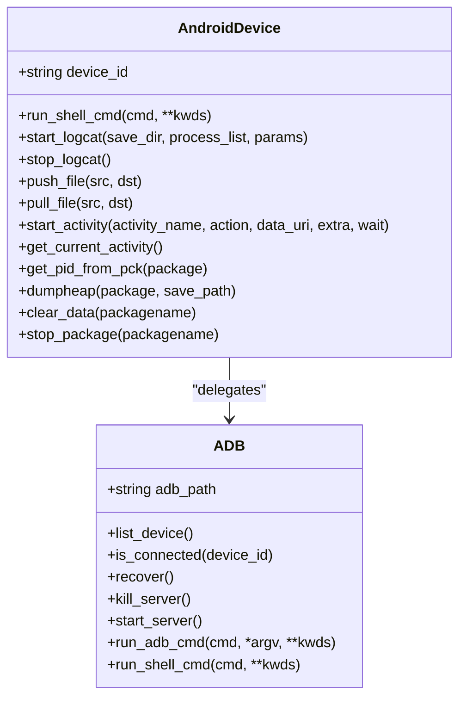
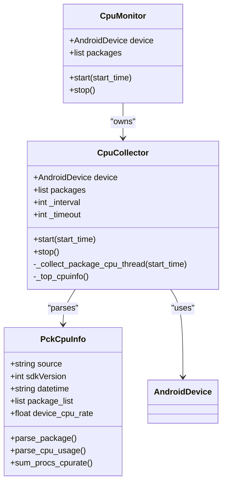
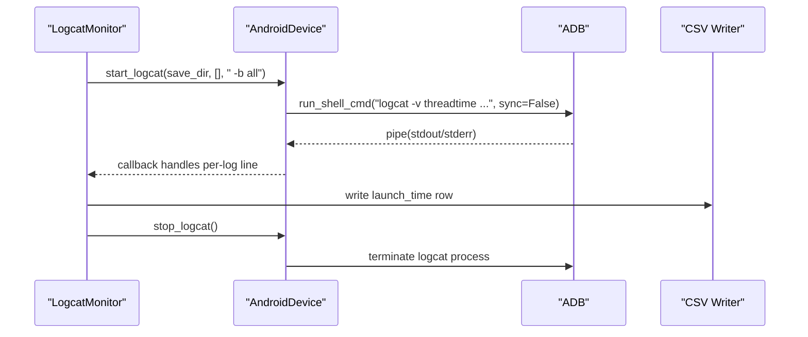
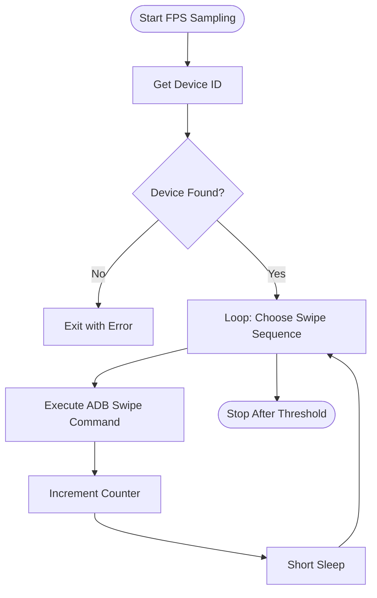
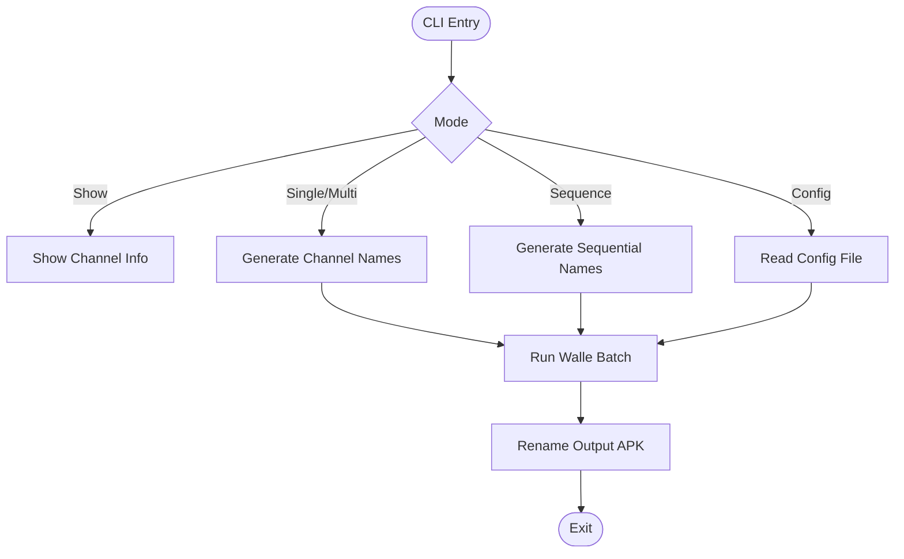
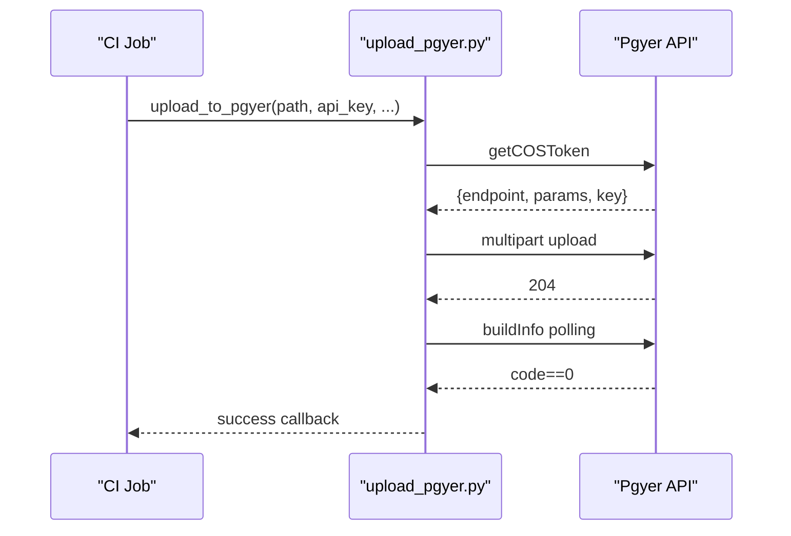
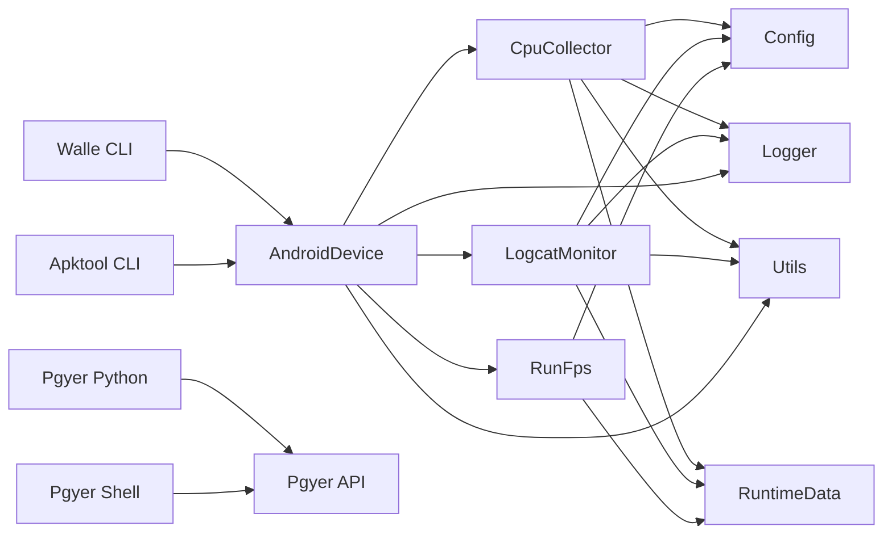
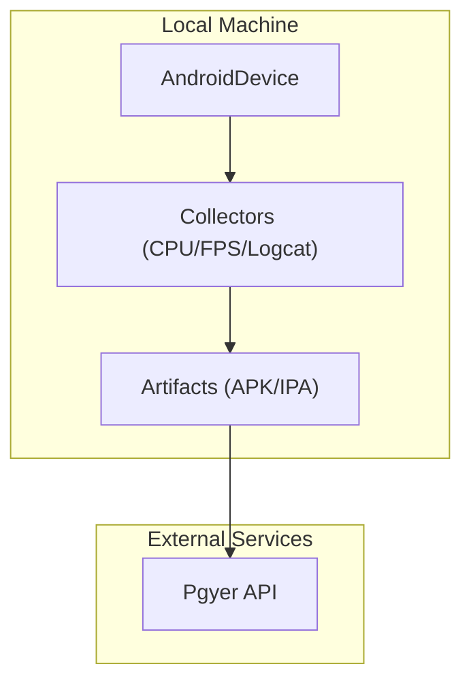

# Core Systems Architecture

<cite>
**Referenced Files in This Document**
- [README.md](file://README.md)
- [androidDevice.py](file://mobilePerf/perfCode/androidDevice.py)
- [cpu_top.py](file://mobilePerf/perfCode/cpu_top.py)
- [logcat.py](file://mobilePerf/perfCode/logcat.py)
- [runFps.py](file://mobilePerf/perfCode/runFps.py)
- [config.py](file://mobilePerf/perfCode/common/config.py)
- [log.py](file://mobilePerf/perfCode/common/log.py)
- [utils.py](file://mobilePerf/perfCode/common/utils.py)
- [globaldata.py](file://mobilePerf/perfCode/globaldata.py)
- [batchChannelV2.py](file://appBuild/DaBao/batchChannelV2.py)
- [againKey.py](file://appBuild/againBuild/againKey.py)
- [changeApk.py](file://appBuild/againBuild/changeApk.py)
- [changeRes.py](file://appBuild/againBuild/changeRes.py)
- [openBuild.bat](file://appBuild/openBuild.bat)
- [upload_pgyer.py](file://ciBuild/utils/upload_pgyer.py)
- [sh_pgyer_upload.sh](file://ciBuild/sh_pgyer_upload.sh)
- [run.sh](file://mobilePerf/tools/run.sh)
</cite>

## Table of Contents
1. [Introduction](#introduction)
2. [Project Structure](#project-structure)
3. [Core Components](#core-components)
4. [Architecture Overview](#architecture-overview)
5. [Detailed Component Analysis](#detailed-component-analysis)
6. [Dependency Analysis](#dependency-analysis)
7. [Performance Considerations](#performance-considerations)
8. [Troubleshooting Guide](#troubleshooting-guide)
9. [Conclusion](#conclusion)
10. [Appendices](#appendices)

## Introduction
This document describes the core systems architecture for the QA and performance tooling suite. It explains the high-level design philosophy, the modular CLI tool architecture, and how performance monitoring, build automation, and CI/CD integration layers interact. It also documents configuration management, error handling, logging, system boundaries, integration patterns, and cross-cutting concerns such as security, monitoring, and scalability.

## Project Structure
The repository is organized into three primary functional domains:
- appBuild: Build and packaging utilities for Android and iOS, including channel packaging and signing.
- ciBuild: CI/CD integration helpers for uploading artifacts to distribution platforms.
- mobilePerf: Performance monitoring and data collection framework for Android devices, including CPU, memory, FPS, and log analysis.

**Diagram sources**
- [androidDevice.py:18-1177](file://mobilePerf/perfCode/androidDevice.py#L18-L1177)
- [cpu_top.py:1-433](file://mobilePerf/perfCode/cpu_top.py#L1-L433)
- [logcat.py:1-216](file://mobilePerf/perfCode/logcat.py#L1-L216)
- [runFps.py:1-94](file://mobilePerf/perfCode/runFps.py#L1-L94)
- [config.py:1-20](file://mobilePerf/perfCode/common/config.py#L1-L20)
- [log.py:1-87](file://mobilePerf/perfCode/common/log.py#L1-L87)
- [utils.py:1-156](file://mobilePerf/perfCode/common/utils.py#L1-L156)
- [globaldata.py:1-14](file://mobilePerf/perfCode/globaldata.py#L1-L14)
- [batchChannelV2.py:1-120](file://appBuild/DaBao/batchChannelV2.py#L1-L120)
- [againKey.py](file://appBuild/againBuild/againKey.py)
- [changeApk.py:1-38](file://appBuild/againBuild/changeApk.py#L1-L38)
- [changeRes.py](file://appBuild/againBuild/changeRes.py)
- [openBuild.bat:1-23](file://appBuild/openBuild.bat#L1-L23)
- [upload_pgyer.py:1-108](file://ciBuild/utils/upload_pgyer.py#L1-L108)
- [sh_pgyer_upload.sh:1-103](file://ciBuild/sh_pgyer_upload.sh#L1-L103)
- [run.sh:1-2](file://mobilePerf/tools/run.sh#L1-L2)

**Section sources**
- [README.md:1-37](file://README.md#L1-L37)
- [openBuild.bat:1-23](file://appBuild/openBuild.bat#L1-L23)

## Core Components
- Device abstraction and ADB orchestration: central Android device controller encapsulating ADB commands, device discovery, logcat capture, and file operations.
- Performance collectors: CPU monitoring via top sampling and CSV export, FPS gesture simulation, and logcat-based launch time extraction.
- Build utilities: channel packaging with Walle, APK modification and repackaging with Apktool, and signing utilities.
- CI/CD integrations: upload scripts for Pgyer via Python and Bash, supporting APK/IPA distribution.
- Common infrastructure: configuration, logging, and shared utilities for time and file operations.

**Section sources**
- [androidDevice.py:18-1177](file://mobilePerf/perfCode/androidDevice.py#L18-L1177)
- [cpu_top.py:1-433](file://mobilePerf/perfCode/cpu_top.py#L1-L433)
- [logcat.py:1-216](file://mobilePerf/perfCode/logcat.py#L1-L216)
- [runFps.py:1-94](file://mobilePerf/perfCode/runFps.py#L1-L94)
- [batchChannelV2.py:1-120](file://appBuild/DaBao/batchChannelV2.py#L1-L120)
- [upload_pgyer.py:1-108](file://ciBuild/utils/upload_pgyer.py#L1-L108)
- [sh_pgyer_upload.sh:1-103](file://ciBuild/sh_pgyer_upload.sh#L1-L103)
- [config.py:1-20](file://mobilePerf/perfCode/common/config.py#L1-L20)
- [log.py:1-87](file://mobilePerf/perfCode/common/log.py#L1-L87)
- [utils.py:1-156](file://mobilePerf/perfCode/common/utils.py#L1-L156)
- [globaldata.py:1-14](file://mobilePerf/perfCode/globaldata.py#L1-L14)

## Architecture Overview
The system follows a layered architecture:
- Device Interaction Layer: AndroidDevice orchestrates ADB operations and device lifecycle.
- Monitoring Layer: Collectors (CPU, FPS, logcat) gather metrics and persist data.
- Build Layer: CLI tools manage packaging, channelization, and artifact preparation.
- CI/CD Layer: Upload utilities integrate with distribution APIs.
- Common Layer: Configuration, logging, and utilities shared across modules.

**Diagram sources**
- [androidDevice.py:18-1177](file://mobilePerf/perfCode/androidDevice.py#L18-L1177)
- [cpu_top.py:206-383](file://mobilePerf/perfCode/cpu_top.py#L206-L383)
- [logcat.py:17-116](file://mobilePerf/perfCode/logcat.py#L17-L116)
- [runFps.py:54-90](file://mobilePerf/perfCode/runFps.py#L54-L90)
- [batchChannelV2.py:21-69](file://appBuild/DaBao/batchChannelV2.py#L21-L69)
- [upload_pgyer.py:43-85](file://ciBuild/utils/upload_pgyer.py#L43-L85)
- [sh_pgyer_upload.sh:54-96](file://ciBuild/sh_pgyer_upload.sh#L54-L96)
- [config.py:3-20](file://mobilePerf/perfCode/common/config.py#L3-L20)
- [log.py:22-75](file://mobilePerf/perfCode/common/log.py#L22-L75)
- [utils.py:10-156](file://mobilePerf/perfCode/common/utils.py#L10-L156)
- [globaldata.py:6-14](file://mobilePerf/perfCode/globaldata.py#L6-L14)

## Detailed Component Analysis

### Device Abstraction and ADB Orchestration
The AndroidDevice class encapsulates ADB command execution, device discovery, logcat capture, and file operations. It manages retries, timeouts, and platform-specific ADB paths, ensuring robust device connectivity and command execution.

**Diagram sources**
- [androidDevice.py:18-1177](file://mobilePerf/perfCode/androidDevice.py#L18-L1177)

**Section sources**
- [androidDevice.py:18-1177](file://mobilePerf/perfCode/androidDevice.py#L18-L1177)

### CPU Monitoring Collector
The CPU collector uses periodic top sampling to capture per-process and device-wide CPU utilization, writing structured CSV data and supporting multi-package monitoring.

**Diagram sources**
- [cpu_top.py:15-383](file://mobilePerf/perfCode/cpu_top.py#L15-L383)

**Section sources**
- [cpu_top.py:15-433](file://mobilePerf/perfCode/cpu_top.py#L15-L433)

### Logcat-Based Launch Time Monitoring
The LogcatMonitor captures device logs, registers handlers for launch time extraction, and writes parsed metrics to CSV. It integrates with AndroidDevice for logcat lifecycle and runtime PID tracking.

**Diagram sources**
- [logcat.py:17-116](file://mobilePerf/perfCode/logcat.py#L17-L116)
- [androidDevice.py:389-422](file://mobilePerf/perfCode/androidDevice.py#L389-L422)

**Section sources**
- [logcat.py:17-216](file://mobilePerf/perfCode/logcat.py#L17-L216)

### FPS Gesture Sampling
The FPS module simulates user gestures to stress-test UI responsiveness and prints executed commands for visibility.

**Diagram sources**
- [runFps.py:54-90](file://mobilePerf/perfCode/runFps.py#L54-L90)

**Section sources**
- [runFps.py:1-94](file://mobilePerf/perfCode/runFps.py#L1-L94)

### Build Automation and Channel Packaging
Channel packaging is performed via Walle, with flexible modes for single, multiple, sequential, and configuration-driven channel generation. APK modification and repackaging are supported via Apktool.

**Diagram sources**
- [batchChannelV2.py:21-115](file://appBuild/DaBao/batchChannelV2.py#L21-L115)
- [changeApk.py:10-34](file://appBuild/againBuild/changeApk.py#L10-L34)

**Section sources**
- [batchChannelV2.py:1-120](file://appBuild/DaBao/batchChannelV2.py#L1-L120)
- [changeApk.py:1-38](file://appBuild/againBuild/changeApk.py#L1-L38)

### CI/CD Distribution Integrations
Two complementary upload mechanisms target Pgyer:
- Python script: obtains upload token, uploads file, and polls build info.
- Shell script: performs equivalent steps using curl and parses JSON responses.

**Diagram sources**
- [upload_pgyer.py:43-107](file://ciBuild/utils/upload_pgyer.py#L43-L107)

**Section sources**
- [upload_pgyer.py:1-108](file://ciBuild/utils/upload_pgyer.py#L1-L108)
- [sh_pgyer_upload.sh:54-103](file://ciBuild/sh_pgyer_upload.sh#L54-L103)

## Dependency Analysis
- Cohesion: Each module focuses on a single responsibility (device ops, monitoring, build, CI).
- Coupling: Performance modules depend on AndroidDevice and common utilities; build tools depend on external CLI tools (Walle, Apktool); CI tools depend on distribution APIs.
- External dependencies: ADB, Walle CLI, Apktool, Pgyer API, curl.

**Diagram sources**
- [androidDevice.py:18-1177](file://mobilePerf/perfCode/androidDevice.py#L18-L1177)
- [cpu_top.py:206-383](file://mobilePerf/perfCode/cpu_top.py#L206-L383)
- [logcat.py:17-116](file://mobilePerf/perfCode/logcat.py#L17-L116)
- [runFps.py:54-90](file://mobilePerf/perfCode/runFps.py#L54-L90)
- [batchChannelV2.py:21-69](file://appBuild/DaBao/batchChannelV2.py#L21-L69)
- [changeApk.py:10-34](file://appBuild/againBuild/changeApk.py#L10-L34)
- [upload_pgyer.py:43-107](file://ciBuild/utils/upload_pgyer.py#L43-L107)
- [sh_pgyer_upload.sh:54-103](file://ciBuild/sh_pgyer_upload.sh#L54-L103)
- [config.py:3-20](file://mobilePerf/perfCode/common/config.py#L3-L20)
- [log.py:22-75](file://mobilePerf/perfCode/common/log.py#L22-L75)
- [utils.py:10-156](file://mobilePerf/perfCode/common/utils.py#L10-L156)
- [globaldata.py:6-14](file://mobilePerf/perfCode/globaldata.py#L6-L14)

**Section sources**
- [androidDevice.py:18-1177](file://mobilePerf/perfCode/androidDevice.py#L18-L1177)
- [cpu_top.py:206-383](file://mobilePerf/perfCode/cpu_top.py#L206-L383)
- [logcat.py:17-116](file://mobilePerf/perfCode/logcat.py#L17-L116)
- [runFps.py:54-90](file://mobilePerf/perfCode/runFps.py#L54-L90)
- [batchChannelV2.py:21-69](file://appBuild/DaBao/batchChannelV2.py#L21-L69)
- [changeApk.py:10-34](file://appBuild/againBuild/changeApk.py#L10-L34)
- [upload_pgyer.py:43-107](file://ciBuild/utils/upload_pgyer.py#L43-L107)
- [sh_pgyer_upload.sh:54-103](file://ciBuild/sh_pgyer_upload.sh#L54-L103)
- [config.py:3-20](file://mobilePerf/perfCode/common/config.py#L3-L20)
- [log.py:22-75](file://mobilePerf/perfCode/common/log.py#L22-L75)
- [utils.py:10-156](file://mobilePerf/perfCode/common/utils.py#L10-L156)
- [globaldata.py:6-14](file://mobilePerf/perfCode/globaldata.py#L6-L14)

## Performance Considerations
- Sampling cadence: CPU collector intervals and FPS gesture frequency should balance accuracy and overhead.
- I/O throughput: CSV writes and logcat buffering should be sized to avoid disk contention; consider asynchronous writers for high-frequency metrics.
- Device stability: Retry logic and timeout controls prevent stalls; ensure ADB port conflicts are resolved before heavy operations.
- Memory footprint: Large logcat buffers and CSV files should be rotated and pruned to maintain performance.

[No sources needed since this section provides general guidance]

## Troubleshooting Guide
- ADB connectivity issues: The device layer detects daemon errors and port conflicts, attempting recovery and logging actionable messages.
- Command failures: ADB command wrappers return standardized outputs and log errors; inspect device logs and connection state.
- Upload failures: CI upload scripts handle token retrieval, upload status, and polling; verify API keys and file extensions.

**Section sources**
- [androidDevice.py:121-176](file://mobilePerf/perfCode/androidDevice.py#L121-L176)
- [logcat.py:85-116](file://mobilePerf/perfCode/logcat.py#L85-L116)
- [upload_pgyer.py:39-85](file://ciBuild/utils/upload_pgyer.py#L39-L85)
- [sh_pgyer_upload.sh:64-103](file://ciBuild/sh_pgyer_upload.sh#L64-L103)

## Conclusion
The system is designed around a clean separation of concerns: device orchestration, performance monitoring, build tooling, and CI/CD distribution. Its modular CLI architecture enables focused tooling with shared configuration and logging. Robust error handling and logging facilitate maintenance and troubleshooting across heterogeneous environments.

[No sources needed since this section summarizes without analyzing specific files]

## Appendices

### Configuration Management
- Centralized configuration: package, device ID, sampling periods, and logging paths are defined in a single configuration module.
- Logging: structured logger with rotating file handlers and console output; directory resolution ensures consistent log locations.

**Section sources**
- [config.py:3-20](file://mobilePerf/perfCode/common/config.py#L3-L20)
- [log.py:22-75](file://mobilePerf/perfCode/common/log.py#L22-L75)

### System Context Diagrams
- Performance monitoring context: AndroidDevice interacts with ADB and device logs; collectors write CSV and charts.
- Build and distribution context: Walle/Apktool operate on local artifacts; CI uploaders publish to Pgyer.

[No sources needed since this diagram shows conceptual workflow, not actual code structure]