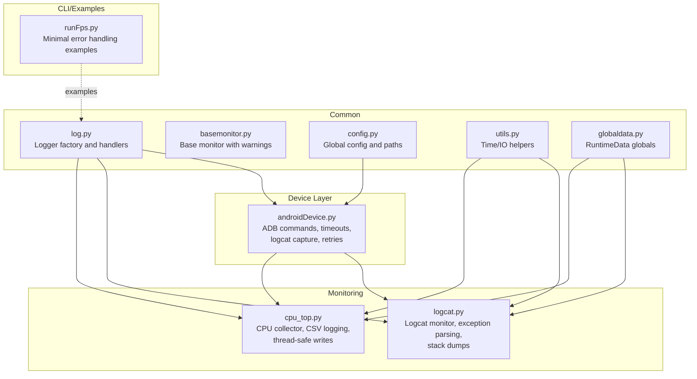
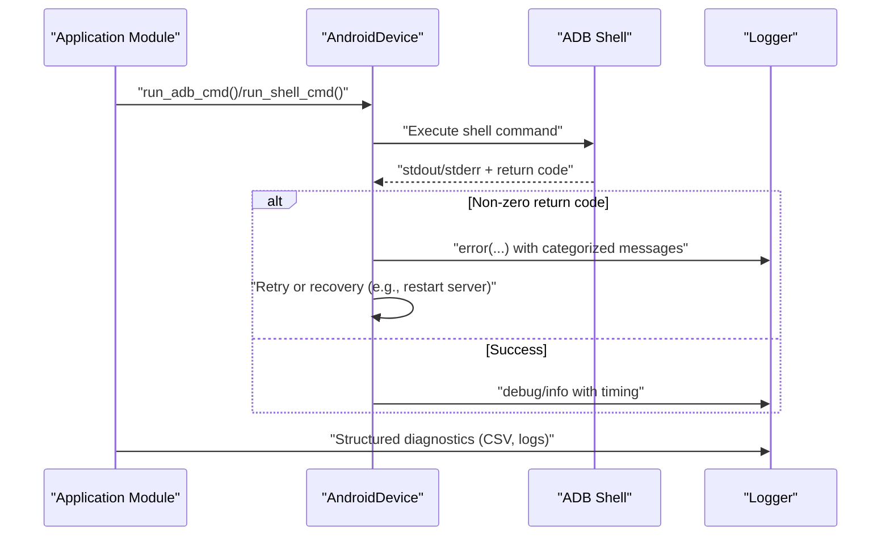
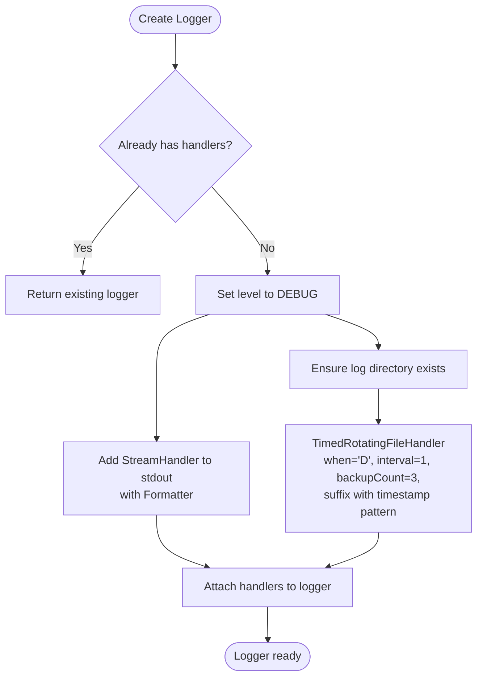
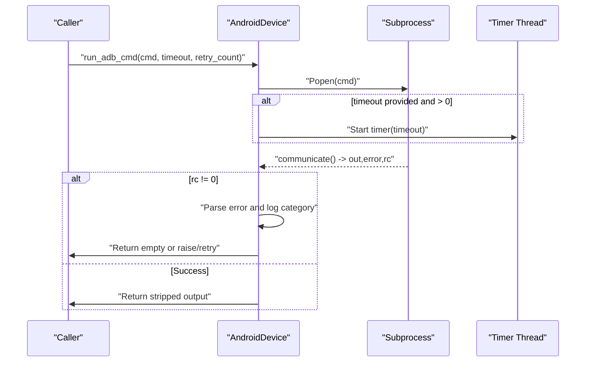
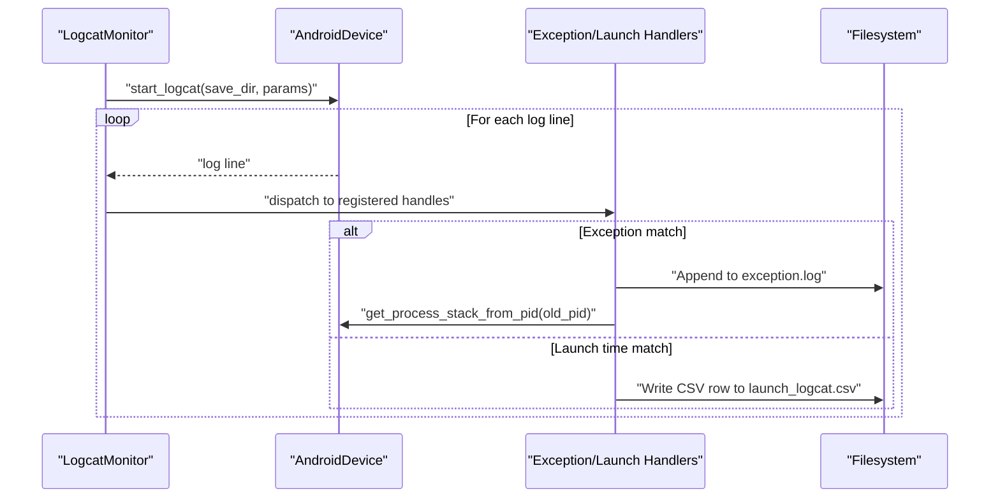
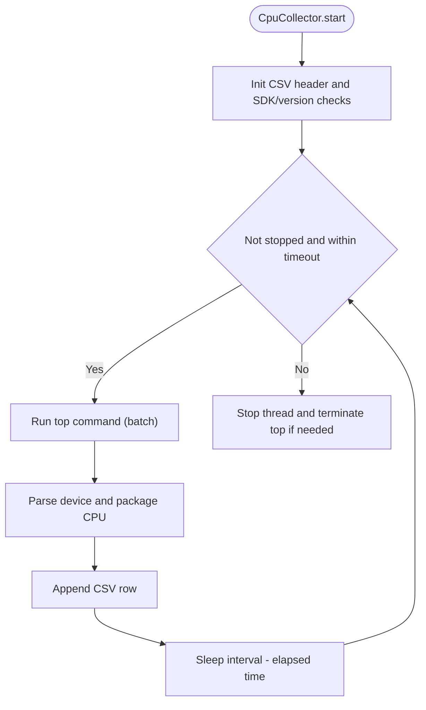
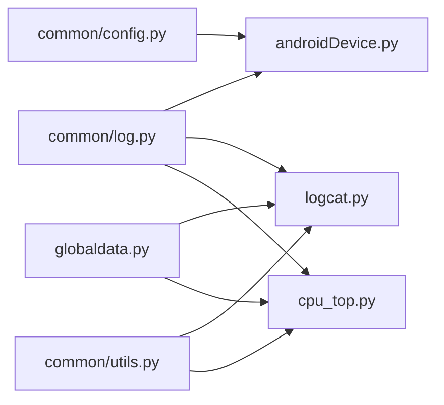

# Error Handling and Logging Architecture

<cite>
**Referenced Files in This Document**
- [log.py](file://mobilePerf/perfCode/common/log.py)
- [basemonitor.py](file://mobilePerf/perfCode/common/basemonitor.py)
- [config.py](file://mobilePerf/perfCode/common/config.py)
- [utils.py](file://mobilePerf/perfCode/common/utils.py)
- [globaldata.py](file://mobilePerf/perfCode/globaldata.py)
- [androidDevice.py](file://mobilePerf/perfCode/androidDevice.py)
- [logcat.py](file://mobilePerf/perfCode/logcat.py)
- [cpu_top.py](file://mobilePerf/perfCode/cpu_top.py)
- [runFps.py](file://mobilePerf/perfCode/runFps.py)
- [README.md](file://README.md)
</cite>

## Table of Contents
1. [Introduction](#introduction)
2. [Project Structure](#project-structure)
3. [Core Components](#core-components)
4. [Architecture Overview](#architecture-overview)
5. [Detailed Component Analysis](#detailed-component-analysis)
6. [Dependency Analysis](#dependency-analysis)
7. [Performance Considerations](#performance-considerations)
8. [Troubleshooting Guide](#troubleshooting-guide)
9. [Conclusion](#conclusion)
10. [Appendices](#appendices)

## Introduction
This document describes the error handling and logging architecture used in the performance measurement toolkit. It explains how logging is configured and used across modules, how errors are propagated and recovered from, and how diagnostic information is collected and retained. It also provides practical guidance for debugging, performance impact mitigation, and production monitoring considerations.

## Project Structure
The logging and error handling architecture spans several modules:
- Common logging configuration and utilities
- Device interaction and command execution with robust error reporting
- Real-time log capture and parsing with structured diagnostics
- CPU monitoring with periodic logging and graceful shutdown
- Global runtime state for shared diagnostics and control

**Diagram sources**
- [log.py:14-79](file://mobilePerf/perfCode/common/log.py#L14-L79)
- [androidDevice.py:18-422](file://mobilePerf/perfCode/androidDevice.py#L18-L422)
- [logcat.py:17-116](file://mobilePerf/perfCode/logcat.py#L17-L116)
- [cpu_top.py:206-347](file://mobilePerf/perfCode/cpu_top.py#L206-L347)
- [globaldata.py:6-14](file://mobilePerf/perfCode/globaldata.py#L6-L14)
- [utils.py:10-156](file://mobilePerf/perfCode/common/utils.py#L10-L156)
- [config.py:3-20](file://mobilePerf/perfCode/common/config.py#L3-L20)
- [runFps.py:11-51](file://mobilePerf/perfCode/runFps.py#L11-L51)

**Section sources**
- [README.md:24-31](file://README.md#L24-L31)
- [log.py:14-79](file://mobilePerf/perfCode/common/log.py#L14-L79)
- [androidDevice.py:18-422](file://mobilePerf/perfCode/androidDevice.py#L18-L422)
- [logcat.py:17-116](file://mobilePerf/perfCode/logcat.py#L17-L116)
- [cpu_top.py:206-347](file://mobilePerf/perfCode/cpu_top.py#L206-L347)
- [globaldata.py:6-14](file://mobilePerf/perfCode/globaldata.py#L6-L14)
- [utils.py:10-156](file://mobilePerf/perfCode/common/utils.py#L10-L156)
- [config.py:3-20](file://mobilePerf/perfCode/common/config.py#L3-L20)
- [runFps.py:11-51](file://mobilePerf/perfCode/runFps.py#L11-L51)

## Core Components
- Logger factory and handlers: Centralized creation of a logger with console and timed rotating file handlers, including automatic directory creation and daily rotation with limited backups.
- Device command execution: Robust ADB command runner with retry logic, timeout enforcement via a dedicated timer thread, and detailed error categorization and recovery actions.
- Logcat monitoring: Real-time log capture with callback hooks for parsing and writing structured diagnostics (e.g., launch times, exceptions).
- CPU monitoring: Periodic CPU sampling with CSV logging, thread-safe writes, and graceful shutdown handling.
- Global runtime state: Shared runtime data used across modules for diagnostics and coordination.

**Section sources**
- [log.py:22-79](file://mobilePerf/perfCode/common/log.py#L22-L79)
- [androidDevice.py:177-292](file://mobilePerf/perfCode/androidDevice.py#L177-L292)
- [logcat.py:32-116](file://mobilePerf/perfCode/logcat.py#L32-L116)
- [cpu_top.py:240-347](file://mobilePerf/perfCode/cpu_top.py#L240-L347)
- [globaldata.py:6-14](file://mobilePerf/perfCode/globaldata.py#L6-L14)

## Architecture Overview
The system follows a layered approach:
- Application layer: Monitors and collectors (e.g., LogcatMonitor, CpuCollector) use the shared logger and runtime data.
- Device abstraction: AndroidDevice encapsulates ADB operations, error handling, and recovery.
- Logging subsystem: A single logger instance configured with console and file handlers; file handler rotates daily with limited backups.

**Diagram sources**
- [androidDevice.py:190-292](file://mobilePerf/perfCode/androidDevice.py#L190-L292)
- [log.py:22-79](file://mobilePerf/perfCode/common/log.py#L22-L79)
- [cpu_top.py:264-347](file://mobilePerf/perfCode/cpu_top.py#L264-L347)
- [logcat.py:85-116](file://mobilePerf/perfCode/logcat.py#L85-L116)

## Detailed Component Analysis

### Logging Framework and Levels
- Logger factory: Creates a logger with a console StreamHandler and a TimedRotatingFileHandler. The file handler rotates daily, appends timestamps to rotated files, and keeps a limited number of backups.
- Log levels: The logger supports standard Python logging levels. The console handler can be set to a different level than the file handler to reduce console noise while keeping detailed logs on disk.
- Structured logging: Messages include timestamp, level, logger name, module, and message body. This aids correlation across components.

**Diagram sources**
- [log.py:22-79](file://mobilePerf/perfCode/common/log.py#L22-L79)

**Section sources**
- [log.py:14-79](file://mobilePerf/perfCode/common/log.py#L14-L79)

### Error Propagation and Recovery in Device Operations
- Command execution: run_adb_cmd and run_shell_cmd wrap subprocess execution, enforce timeouts via a timer thread, and categorize failures (e.g., missing device, port conflicts, offline device).
- Retry logic: Commands can be retried a configurable number of times to mitigate transient failures.
- Recovery actions: On detection of server issues, the code kills and restarts the ADB server and clears port conflicts when possible.

**Diagram sources**
- [androidDevice.py:190-292](file://mobilePerf/perfCode/androidDevice.py#L190-L292)
- [androidDevice.py:177-189](file://mobilePerf/perfCode/androidDevice.py#L177-L189)

**Section sources**
- [androidDevice.py:177-292](file://mobilePerf/perfCode/androidDevice.py#L177-L292)

### Logcat Monitoring and Exception Handling
- Real-time capture: Starts logcat with all buffers enabled, reads lines asynchronously, and dispatches each line to registered handlers.
- Exception logging: Filters lines matching configured exception tags and writes them to a dedicated exception log file. Optionally captures process stacks for the previous PID.
- Structured parsing: Parses launch time logs into CSV with standardized headers and values.

**Diagram sources**
- [logcat.py:32-116](file://mobilePerf/perfCode/logcat.py#L32-L116)
- [androidDevice.py:389-422](file://mobilePerf/perfCode/androidDevice.py#L389-L422)

**Section sources**
- [logcat.py:32-116](file://mobilePerf/perfCode/logcat.py#L32-L116)
- [androidDevice.py:318-422](file://mobilePerf/perfCode/androidDevice.py#L318-L422)

### CPU Monitoring and Diagnostics
- Sampling loop: Periodically runs top in batch mode, parses device and per-package CPU metrics, and writes to CSV with a header row.
- Thread safety: Uses a stop event to coordinate shutdown and ensures the top process is terminated if lingering.
- File size management: Rotates or cleans large temporary files to prevent disk pressure.

**Diagram sources**
- [cpu_top.py:240-347](file://mobilePerf/perfCode/cpu_top.py#L240-L347)

**Section sources**
- [cpu_top.py:206-347](file://mobilePerf/perfCode/cpu_top.py#L206-L347)

### Base Monitor Behavior and Warnings
- Base monitor emits warnings when subclasses do not implement required methods, guiding developers to implement start/stop/save appropriately.

**Section sources**
- [basemonitor.py:16-32](file://mobilePerf/perfCode/common/basemonitor.py#L16-L32)

### Example Error Scenarios and Resolution Patterns
- Missing device or offline device: Detected during ADB operations; logs appropriate messages and may trigger reconnection attempts.
- Port conflict on ADB server: Detected and resolved by killing the occupying process and restarting the server.
- Installation failures with specific error codes: Raised as runtime errors with actionable hints (e.g., certificate issues, storage problems).
- Timeout during command execution: Enforced via a timer thread; logs a warning and terminates the process to prevent hangs.

**Section sources**
- [androidDevice.py:121-138](file://mobilePerf/perfCode/androidDevice.py#L121-L138)
- [androidDevice.py:152-175](file://mobilePerf/perfCode/androidDevice.py#L152-L175)
- [androidDevice.py:240-261](file://mobilePerf/perfCode/androidDevice.py#L240-L261)
- [androidDevice.py:186-189](file://mobilePerf/perfCode/androidDevice.py#L186-L189)
- [androidDevice.py:1072-1092](file://mobilePerf/perfCode/androidDevice.py#L1072-L1092)

## Dependency Analysis
- Logger dependency: All major modules import the shared logger instance from the common logging module.
- Runtime data: Both logcat and CPU monitors rely on global runtime data for paths and state.
- Utilities: Time and file utilities are used across modules for consistent formatting and IO operations.
- Configuration: Global configuration provides defaults for device IDs, package names, and log locations.

**Diagram sources**
- [log.py:78-79](file://mobilePerf/perfCode/common/log.py#L78-L79)
- [androidDevice.py:13-15](file://mobilePerf/perfCode/androidDevice.py#L13-L15)
- [logcat.py:13-14](file://mobilePerf/perfCode/logcat.py#L13-L14)
- [cpu_top.py:11-12](file://mobilePerf/perfCode/cpu_top.py#L11-L12)
- [globaldata.py:6-14](file://mobilePerf/perfCode/globaldata.py#L6-L14)
- [utils.py:10-156](file://mobilePerf/perfCode/common/utils.py#L10-L156)
- [config.py:3-20](file://mobilePerf/perfCode/common/config.py#L3-L20)

**Section sources**
- [log.py:78-79](file://mobilePerf/perfCode/common/log.py#L78-L79)
- [androidDevice.py:13-15](file://mobilePerf/perfCode/androidDevice.py#L13-L15)
- [logcat.py:13-14](file://mobilePerf/perfCode/logcat.py#L13-L14)
- [cpu_top.py:11-12](file://mobilePerf/perfCode/cpu_top.py#L11-L12)
- [globaldata.py:6-14](file://mobilePerf/perfCode/globaldata.py#L6-L14)
- [utils.py:10-156](file://mobilePerf/perfCode/common/utils.py#L10-L156)
- [config.py:3-20](file://mobilePerf/perfCode/common/config.py#L3-L20)

## Performance Considerations
- Logging overhead: TimedRotatingFileHandler rotates daily with limited backups; ensure log volume remains reasonable to avoid I/O contention.
- CPU sampling: Top command runs periodically; adjust intervals to balance accuracy and overhead.
- File growth: Large temporary files (e.g., top output) are pruned to keep disk usage under control.
- Concurrency: Threads for logcat and CPU collectors use stop events and proper termination to avoid resource leaks.

[No sources needed since this section provides general guidance]

## Troubleshooting Guide
- ADB connectivity issues:
  - Verify device connection and ADB server health.
  - Clear port conflicts and restart ADB server if necessary.
  - Use retry logic for transient failures.
- Timeout handling:
  - Investigate long-running commands; increase timeouts cautiously.
  - Ensure timer threads are functioning to prevent stuck processes.
- Parsing errors:
  - Validate log formats and update parsers for new patterns.
  - Check CSV write permissions and file locks.
- Disk space:
  - Monitor log file sizes and prune old backups.
  - Clean temporary files generated during sampling.

**Section sources**
- [androidDevice.py:121-138](file://mobilePerf/perfCode/androidDevice.py#L121-L138)
- [androidDevice.py:152-175](file://mobilePerf/perfCode/androidDevice.py#L152-L175)
- [androidDevice.py:186-189](file://mobilePerf/perfCode/androidDevice.py#L186-L189)
- [cpu_top.py:277-279](file://mobilePerf/perfCode/cpu_top.py#L277-L279)

## Conclusion
The system employs a centralized logging framework with robust device operation error handling, real-time log parsing, and structured diagnostics. By leveraging retries, timeouts, and targeted recovery actions, it maintains reliability during performance measurements. Proper configuration of log levels, rotation, and retention helps balance observability and performance.

[No sources needed since this section summarizes without analyzing specific files]

## Appendices

### Log Aggregation and Retention Policies
- Daily rotation: File handler rotates logs daily with timestamp suffixes and limited backups.
- Manual cleanup: Temporary files exceeding thresholds are removed to control disk usage.
- CSV diagnostics: Structured CSV files are maintained for downstream analysis.

**Section sources**
- [log.py:62-71](file://mobilePerf/perfCode/common/log.py#L62-L71)
- [cpu_top.py:277-279](file://mobilePerf/perfCode/cpu_top.py#L277-L279)

### Diagnostic Information Collection
- Logcat capture: All buffers enabled for comprehensive coverage.
- Exception tagging: Configurable exception tags trigger dedicated logging and stack dumps.
- Launch time parsing: Standardized CSV output for startup performance analysis.

**Section sources**
- [logcat.py:44](file://mobilePerf/perfCode/logcat.py#L44)
- [logcat.py:85-116](file://mobilePerf/perfCode/logcat.py#L85-L116)
- [logcat.py:135-211](file://mobilePerf/perfCode/logcat.py#L135-L211)

### Debugging Workflows
- Enable debug logs for detailed command traces and timing.
- Use exception log filtering to isolate problematic areas.
- Inspect CSV outputs for anomalies in CPU or launch metrics.

**Section sources**
- [log.py:22-79](file://mobilePerf/perfCode/common/log.py#L22-L79)
- [logcat.py:85-116](file://mobilePerf/perfCode/logcat.py#L85-L116)
- [cpu_top.py:302-347](file://mobilePerf/perfCode/cpu_top.py#L302-L347)