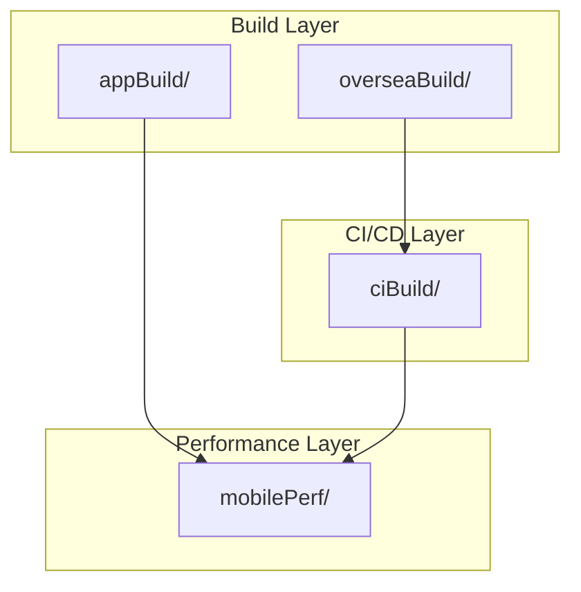
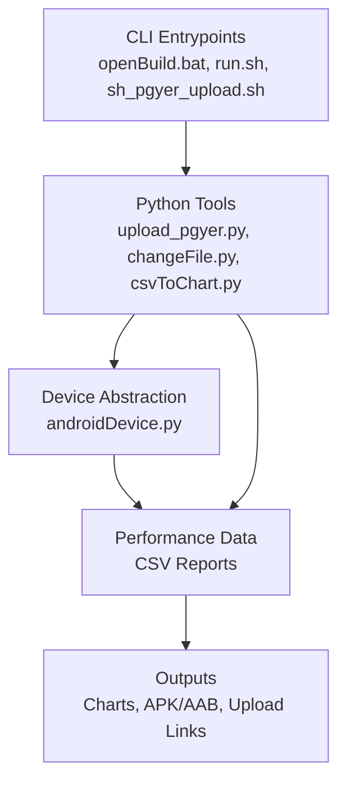
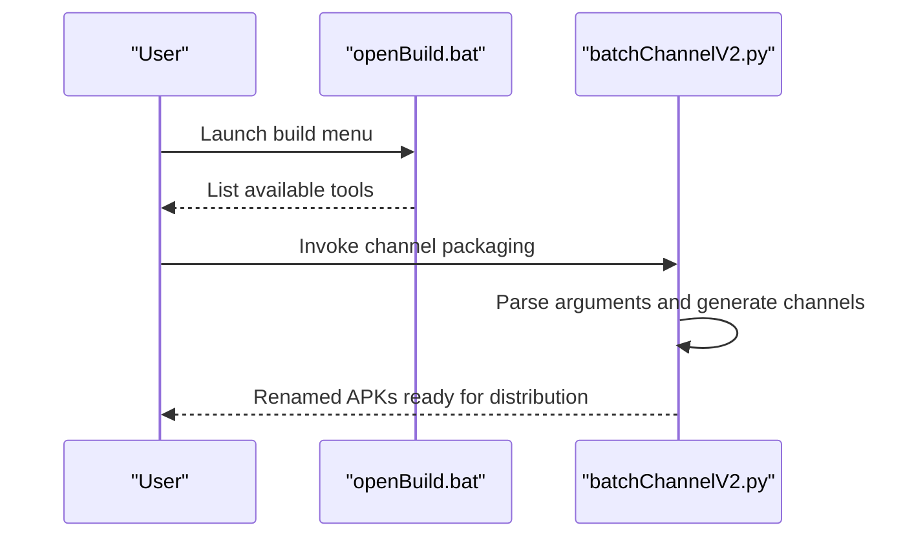
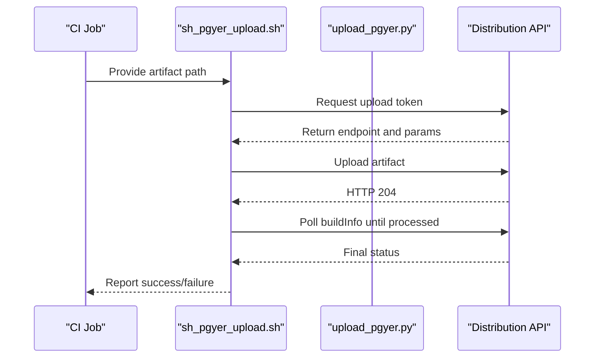
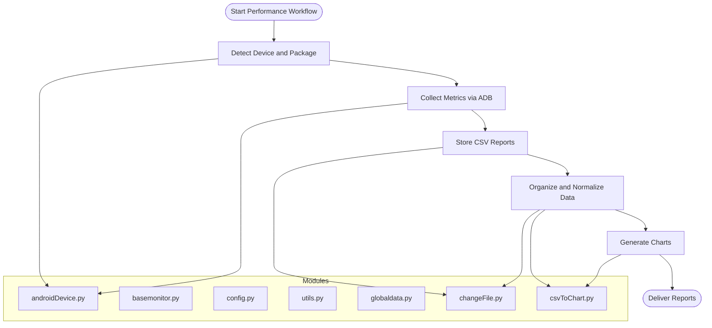
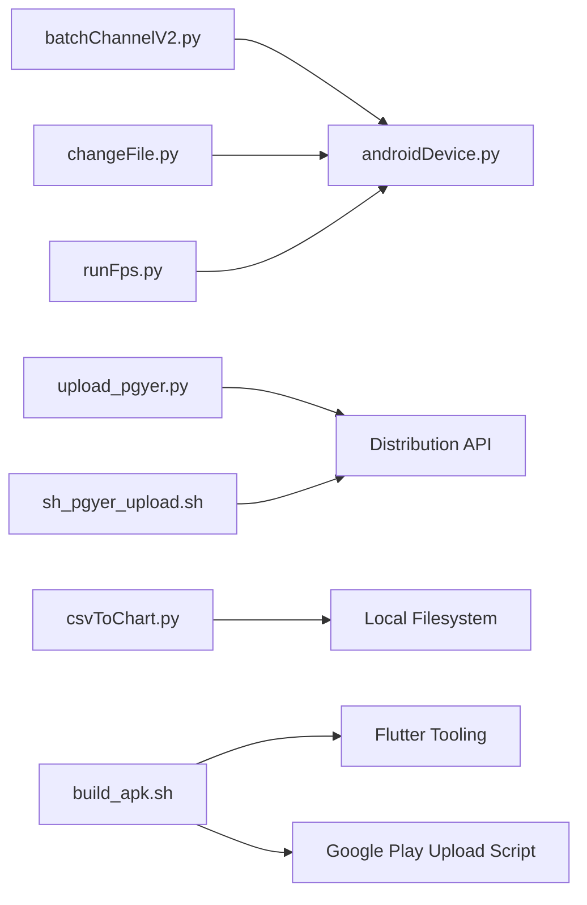

# System Overview and Design Philosophy

<cite>
**Referenced Files in This Document**
- [README.md](file://README.md)
- [batchChannelV2.py](file://appBuild/DaBao/batchChannelV2.py)
- [openBuild.bat](file://appBuild/openBuild.bat)
- [upload_pgyer.py](file://ciBuild/utils/upload_pgyer.py)
- [sh_pgyer_upload.sh](file://ciBuild/sh_pgyer_upload.sh)
- [build_apk.sh](file://overseaBuild/build_apk.sh)
- [basemonitor.py](file://mobilePerf/perfCode/common/basemonitor.py)
- [config.py](file://mobilePerf/perfCode/common/config.py)
- [utils.py](file://mobilePerf/perfCode/common/utils.py)
- [globaldata.py](file://mobilePerf/perfCode/globaldata.py)
- [androidDevice.py](file://mobilePerf/perfCode/androidDevice.py)
- [runFps.py](file://mobilePerf/perfCode/runFps.py)
- [changeFile.py](file://mobilePerf/tools/changeFile.py)
- [csvToChart.py](file://mobilePerf/tools/csvToChart.py)
- [run.sh](file://mobilePerf/tools/run.sh)
</cite>

## Table of Contents
1. [Introduction](#introduction)
2. [Project Structure](#project-structure)
3. [Core Components](#core-components)
4. [Architecture Overview](#architecture-overview)
5. [Detailed Component Analysis](#detailed-component-analysis)
6. [Dependency Analysis](#dependency-analysis)
7. [Performance Considerations](#performance-considerations)
8. [Troubleshooting Guide](#troubleshooting-guide)
9. [Conclusion](#conclusion)

## Introduction
This document presents the system overview and design philosophy of a modular CLI toolchain focused on performance monitoring, build automation, and CI/CD integration. The system is organized into distinct layers that separate concerns across:
- Build and packaging (local and internationalized builds)
- Performance data acquisition and visualization
- CI/CD upload and release orchestration

It adopts a configuration-driven approach, isolates components for maintainability, and ensures cross-platform compatibility through shell scripts and Python utilities. The design emphasizes modularity, reusability, and straightforward automation via CLI entry points.

## Project Structure
The repository is organized by functional domains:
- appBuild: Local Android build and packaging utilities (channel packaging, resource editing, signing)
- ciBuild: CI/CD upload utilities (Python-based uploader and shell wrapper)
- mobilePerf: Performance monitoring and reporting pipeline (data collection, parsing, charting)
- overseaBuild: Internationalized build orchestration (Flutter-based, AAB and APK generation, Google Play uploads)
- Root README: High-level descriptions of capabilities

**Diagram sources**
- [README.md:1-37](file://README.md#L1-L37)
- [batchChannelV2.py:1-120](file://appBuild/DaBao/batchChannelV2.py#L1-L120)
- [build_apk.sh:1-60](file://overseaBuild/build_apk.sh#L1-L60)
- [sh_pgyer_upload.sh:1-103](file://ciBuild/sh_pgyer_upload.sh#L1-L103)
- [androidDevice.py:1-800](file://mobilePerf/perfCode/androidDevice.py#L1-L800)

**Section sources**
- [README.md:1-37](file://README.md#L1-L37)

## Core Components
- Build and Packaging Utilities
  - Channel packaging and metadata manipulation for Android
  - Batch channel generation and APK renaming
  - Local build entry points for Windows and Unix-like systems
- CI/CD Upload Utilities
  - Python-based uploader to distribution platforms
  - Shell-based uploader with token exchange and polling
  - Internationalized build orchestration with Flutter and Google Play integration
- Performance Monitoring Pipeline
  - Device abstraction and ADB orchestration
  - Performance data collection and storage
  - CSV-to-chart visualization pipeline

These components are designed to be invoked via CLI entry points and shell wrappers, enabling composability in automated workflows.

**Section sources**
- [batchChannelV2.py:1-120](file://appBuild/DaBao/batchChannelV2.py#L1-L120)
- [openBuild.bat:1-23](file://appBuild/openBuild.bat#L1-L23)
- [upload_pgyer.py:1-108](file://ciBuild/utils/upload_pgyer.py#L1-L108)
- [sh_pgyer_upload.sh:1-103](file://ciBuild/sh_pgyer_upload.sh#L1-L103)
- [build_apk.sh:1-60](file://overseaBuild/build_apk.sh#L1-L60)
- [androidDevice.py:1-800](file://mobilePerf/perfCode/androidDevice.py#L1-L800)
- [changeFile.py:1-112](file://mobilePerf/tools/changeFile.py#L1-L112)
- [csvToChart.py:1-151](file://mobilePerf/tools/csvToChart.py#L1-L151)

## Architecture Overview
The system follows a layered architecture:
- CLI Entrypoints: Windows batch files and shell scripts expose commands to users and CI systems
- Tooling Layer: Python utilities encapsulate platform-specific operations and data transformations
- Platform Abstraction: ADB and device orchestration isolate OS-level interactions
- Data Flow: Performance data moves from device to local storage, then to visualization

**Diagram sources**
- [openBuild.bat:1-23](file://appBuild/openBuild.bat#L1-L23)
- [run.sh:1-2](file://mobilePerf/tools/run.sh#L1-L2)
- [sh_pgyer_upload.sh:1-103](file://ciBuild/sh_pgyer_upload.sh#L1-L103)
- [upload_pgyer.py:1-108](file://ciBuild/utils/upload_pgyer.py#L1-L108)
- [androidDevice.py:1-800](file://mobilePerf/perfCode/androidDevice.py#L1-L800)
- [changeFile.py:1-112](file://mobilePerf/tools/changeFile.py#L1-L112)
- [csvToChart.py:1-151](file://mobilePerf/tools/csvToChart.py#L1-L151)

## Detailed Component Analysis

### Build and Packaging Utilities
- batchChannelV2.py
  - Provides CLI commands to show, generate, and rename channel packages
  - Supports single, multiple, and sequential channel generation
  - Integrates with external tooling to tag APK metadata and rename artifacts
- openBuild.bat
  - Windows menu to discover and run build-related utilities
  - Guides users to the appropriate tooling for signing, decompiling, and resource editing

**Diagram sources**
- [openBuild.bat:1-23](file://appBuild/openBuild.bat#L1-L23)
- [batchChannelV2.py:91-116](file://appBuild/DaBao/batchChannelV2.py#L91-L116)

**Section sources**
- [batchChannelV2.py:1-120](file://appBuild/DaBao/batchChannelV2.py#L1-L120)
- [openBuild.bat:1-23](file://appBuild/openBuild.bat#L1-L23)

### CI/CD Upload Utilities
- upload_pgyer.py
  - Implements token exchange and upload to a distribution service
  - Polls for processing completion and returns structured results
- sh_pgyer_upload.sh
  - Shell wrapper that validates inputs, exchanges tokens, uploads via cURL, and polls for completion
- build_apk.sh
  - Orchestrates Flutter builds for debug, release, and store variants
  - Uploads artifacts to distribution services and prepares AABs for Google Play

**Diagram sources**
- [sh_pgyer_upload.sh:54-103](file://ciBuild/sh_pgyer_upload.sh#L54-L103)
- [upload_pgyer.py:43-86](file://ciBuild/utils/upload_pgyer.py#L43-L86)

**Section sources**
- [upload_pgyer.py:1-108](file://ciBuild/utils/upload_pgyer.py#L1-L108)
- [sh_pgyer_upload.sh:1-103](file://ciBuild/sh_pgyer_upload.sh#L1-L103)
- [build_apk.sh:1-60](file://overseaBuild/build_apk.sh#L1-L60)

### Performance Monitoring Pipeline
- androidDevice.py
  - Centralizes ADB operations, device detection, and platform-specific path resolution
  - Manages logcat capture, file transfers, and device state recovery
- basemonitor.py
  - Defines a monitor interface for collecting performance metrics
  - Encourages subclassing to implement platform-specific collectors
- config.py
  - Holds runtime configuration such as package, device ID, sampling period, and output locations
- utils.py
  - Provides time and file utilities used across the pipeline
- globaldata.py
  - Stores shared runtime state across modules
- runFps.py
  - Demonstrates device and package discovery, and simulates UI interactions for FPS measurement
- changeFile.py
  - Pulls latest performance datasets from the device and organizes them into structured CSV folders
- csvToChart.py
  - Parses CSV reports and generates charts per performance metric
- run.sh
  - Invokes the data processing and visualization pipeline

**Diagram sources**
- [androidDevice.py:18-800](file://mobilePerf/perfCode/androidDevice.py#L18-L800)
- [basemonitor.py:7-37](file://mobilePerf/perfCode/common/basemonitor.py#L7-L37)
- [config.py:1-20](file://mobilePerf/perfCode/common/config.py#L1-L20)
- [utils.py:10-156](file://mobilePerf/perfCode/common/utils.py#L10-L156)
- [globaldata.py:1-14](file://mobilePerf/perfCode/globaldata.py#L1-L14)
- [changeFile.py:37-107](file://mobilePerf/tools/changeFile.py#L37-L107)
- [csvToChart.py:23-147](file://mobilePerf/tools/csvToChart.py#L23-L147)

**Section sources**
- [androidDevice.py:1-800](file://mobilePerf/perfCode/androidDevice.py#L1-L800)
- [basemonitor.py:1-37](file://mobilePerf/perfCode/common/basemonitor.py#L1-L37)
- [config.py:1-20](file://mobilePerf/perfCode/common/config.py#L1-L20)
- [utils.py:1-156](file://mobilePerf/perfCode/common/utils.py#L1-L156)
- [globaldata.py:1-14](file://mobilePerf/perfCode/globaldata.py#L1-L14)
- [runFps.py:1-94](file://mobilePerf/perfCode/runFps.py#L1-L94)
- [changeFile.py:1-112](file://mobilePerf/tools/changeFile.py#L1-L112)
- [csvToChart.py:1-151](file://mobilePerf/tools/csvToChart.py#L1-L151)
- [run.sh:1-2](file://mobilePerf/tools/run.sh#L1-L2)

## Dependency Analysis
- Cross-layer coupling is minimized:
  - Build layer depends on platform tooling (ADB, Flutter)
  - CI/CD layer depends on distribution APIs and shell utilities
  - Performance layer depends on device connectivity and file system operations
- Internal cohesion:
  - mobilePerf modules share common utilities and configuration
  - CI/CD utilities encapsulate network and token exchange logic
- External dependencies:
  - Distribution APIs for upload and status polling
  - ADB and platform-specific binaries for device operations

**Diagram sources**
- [batchChannelV2.py:21-69](file://appBuild/DaBao/batchChannelV2.py#L21-L69)
- [androidDevice.py:18-800](file://mobilePerf/perfCode/androidDevice.py#L18-L800)
- [upload_pgyer.py:43-86](file://ciBuild/utils/upload_pgyer.py#L43-L86)
- [sh_pgyer_upload.sh:54-103](file://ciBuild/sh_pgyer_upload.sh#L54-L103)
- [changeFile.py:37-107](file://mobilePerf/tools/changeFile.py#L37-L107)
- [csvToChart.py:23-147](file://mobilePerf/tools/csvToChart.py#L23-L147)
- [runFps.py:38-52](file://mobilePerf/perfCode/runFps.py#L38-L52)
- [build_apk.sh:17-38](file://overseaBuild/build_apk.sh#L17-L38)

**Section sources**
- [batchChannelV2.py:1-120](file://appBuild/DaBao/batchChannelV2.py#L1-L120)
- [upload_pgyer.py:1-108](file://ciBuild/utils/upload_pgyer.py#L1-L108)
- [sh_pgyer_upload.sh:1-103](file://ciBuild/sh_pgyer_upload.sh#L1-L103)
- [build_apk.sh:1-60](file://overseaBuild/build_apk.sh#L1-L60)
- [androidDevice.py:1-800](file://mobilePerf/perfCode/androidDevice.py#L1-L800)
- [changeFile.py:1-112](file://mobilePerf/tools/changeFile.py#L1-L112)
- [csvToChart.py:1-151](file://mobilePerf/tools/csvToChart.py#L1-L151)
- [runFps.py:1-94](file://mobilePerf/perfCode/runFps.py#L1-L94)

## Performance Considerations
- Device connectivity robustness
  - Retry mechanisms and connection recovery reduce flakiness in ADB operations
- Data throughput
  - CSV parsing and chart generation operate on summarized samples to minimize overhead
- Upload reliability
  - Token-based upload and polling ensure idempotent and observable CI steps
- Cross-platform compatibility
  - Shell scripts and Python utilities adapt to platform differences (paths, command invocation)

[No sources needed since this section provides general guidance]

## Troubleshooting Guide
- Device not found or offline
  - Verify ADB connectivity and device selection; the device module includes recovery routines and logging
- Upload failures
  - Check API credentials and artifact extension; the shell uploader validates inputs and reports HTTP statuses
- Missing data files
  - Confirm device-side records and local permissions; the data puller cleans and organizes temporary artifacts
- Chart generation errors
  - Ensure CSV files exist and are readable; the chart generator validates inputs and filters invalid values

**Section sources**
- [androidDevice.py:81-139](file://mobilePerf/perfCode/androidDevice.py#L81-L139)
- [sh_pgyer_upload.sh:20-32](file://ciBuild/sh_pgyer_upload.sh#L20-L32)
- [changeFile.py:51-67](file://mobilePerf/tools/changeFile.py#L51-L67)
- [csvToChart.py:117-147](file://mobilePerf/tools/csvToChart.py#L117-L147)

## Conclusion
This system is designed around modularity, configuration-driven behavior, and cross-platform compatibility. The separation of concerns across build, performance, and CI/CD layers enables independent evolution and reuse. The CLI entry points and shell integrations provide a practical foundation for automation, while Python utilities encapsulate platform-specific logic and data transformations. The result is a pragmatic, maintainable toolchain suitable for both local development and CI environments.