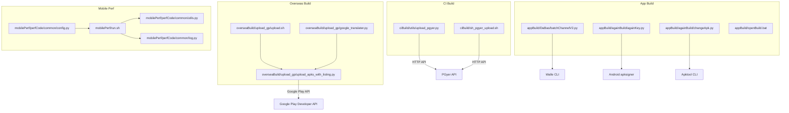
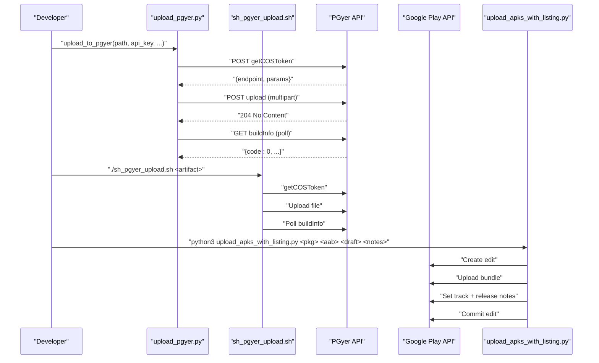
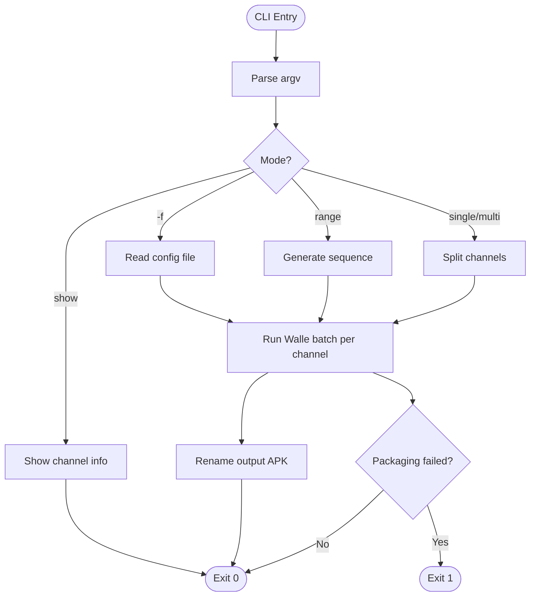
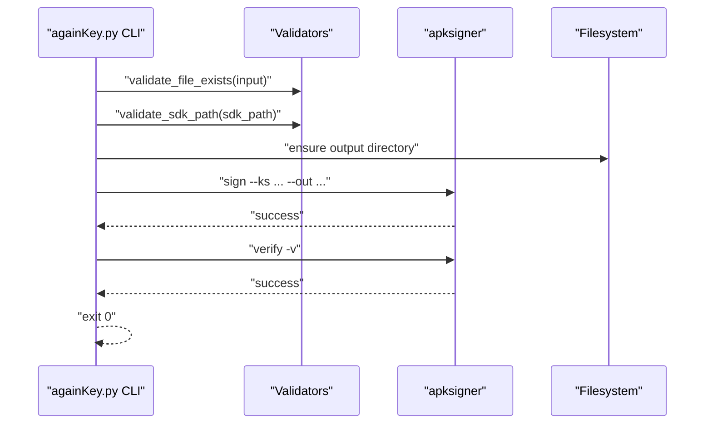
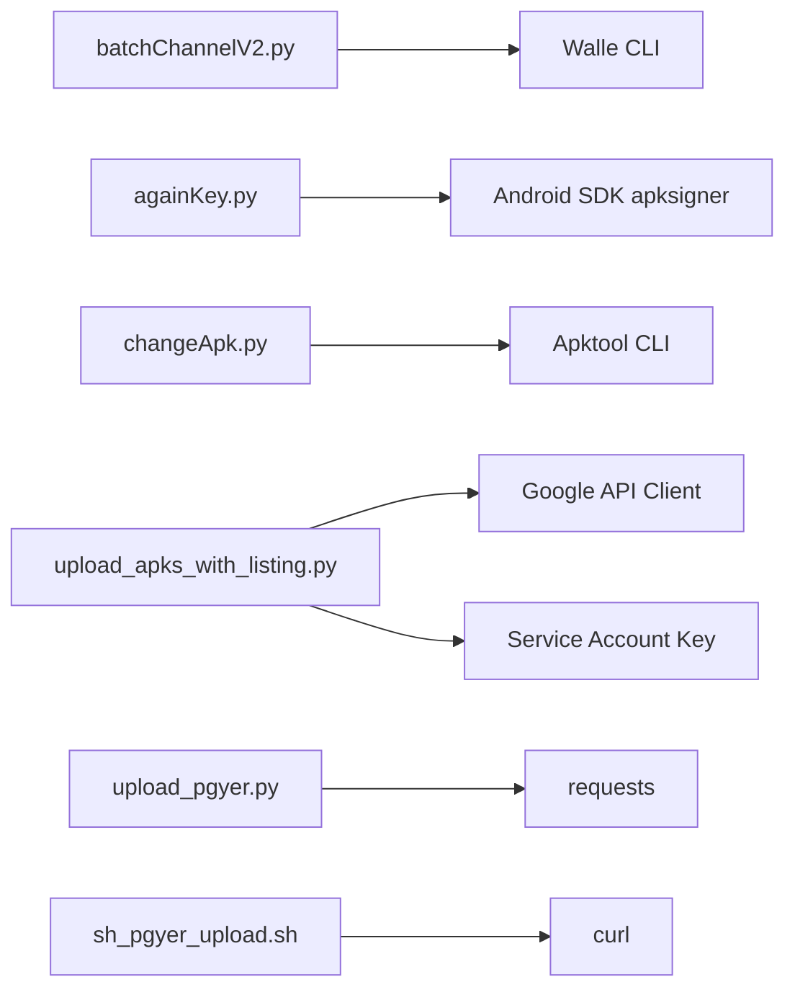

# API Reference

<cite>
**Referenced Files in This Document**
- [README.md](file://README.md)
- [upload_pgyer.py](file://ciBuild/utils/upload_pgyer.py)
- [sh_pgyer_upload.sh](file://ciBuild/sh_pgyer_upload.sh)
- [upload_apks_with_listing.py](file://overseaBuild/upload_gp/upload_apks_with_listing.py)
- [upload.sh](file://overseaBuild/upload_gp/upload.sh)
- [google_translater.py](file://overseaBuild/upload_gp/google_translater.py)
- [batchChannelV2.py](file://appBuild/DaBao/batchChannelV2.py)
- [againKey.py](file://appBuild/againBuild/againKey.py)
- [changeApk.py](file://appBuild/againBuild/changeApk.py)
- [config.py](file://mobilePerf/perfCode/common/config.py)
- [utils.py](file://mobilePerf/perfCode/common/utils.py)
- [log.py](file://mobilePerf/perfCode/common/log.py)
- [run.sh](file://mobilePerf/run.sh)
- [openBuild.bat](file://appBuild/openBuild.bat)
</cite>

## Table of Contents
1. [Introduction](#introduction)
2. [Project Structure](#project-structure)
3. [Core Components](#core-components)
4. [Architecture Overview](#architecture-overview)
5. [Detailed Component Analysis](#detailed-component-analysis)
6. [Dependency Analysis](#dependency-analysis)
7. [Performance Considerations](#performance-considerations)
8. [Troubleshooting Guide](#troubleshooting-guide)
9. [Conclusion](#conclusion)
10. [Appendices](#appendices)

## Introduction
This document provides a comprehensive API reference for the automation scripts and utilities included in the repository. It covers:
- Command-line interfaces for Python and shell scripts, including parameters, return codes, and error handling
- Python module APIs, including class hierarchies, method signatures, and usage patterns
- Configuration schemas for performance collection and build utilities
- HTTP API documentation for third-party integrations (PGyer and Google Play Developer API)
- Authentication methods, rate-limiting considerations, and error response formats
- Migration notes and backwards compatibility guidance

## Project Structure
The repository is organized by functional domains:
- appBuild: Android build and packaging utilities (channel packaging, signing, decompiling/packaging)
- ciBuild: Continuous integration helpers for uploading artifacts to PGyer
- mobilePerf: Performance data collection and reporting tools
- overseaBuild: International builds and Google Play publishing utilities

**Diagram sources**
- [upload_pgyer.py:1-108](file://ciBuild/utils/upload_pgyer.py#L1-L108)
- [sh_pgyer_upload.sh:1-103](file://ciBuild/sh_pgyer_upload.sh#L1-L103)
- [upload_apks_with_listing.py:1-198](file://overseaBuild/upload_gp/upload_apks_with_listing.py#L1-L198)
- [upload.sh:1-25](file://overseaBuild/upload_gp/upload.sh#L1-L25)
- [google_translater.py:1-38](file://overseaBuild/upload_gp/google_translater.py#L1-L38)
- [batchChannelV2.py:1-120](file://appBuild/DaBao/batchChannelV2.py#L1-L120)
- [againKey.py:1-168](file://appBuild/againBuild/againKey.py#L1-L168)
- [changeApk.py:1-39](file://appBuild/againBuild/changeApk.py#L1-L39)
- [run.sh:1-29](file://mobilePerf/run.sh#L1-L29)
- [config.py:1-20](file://mobilePerf/perfCode/common/config.py#L1-L20)
- [utils.py:1-156](file://mobilePerf/perfCode/common/utils.py#L1-L156)
- [log.py:1-87](file://mobilePerf/perfCode/common/log.py#L1-L87)

**Section sources**
- [README.md:1-37](file://README.md#L1-L37)

## Core Components
This section documents the primary APIs and CLIs exposed by the repository.

- PGyer Upload Utilities
  - Python module: upload_pgyer.py
    - Functions:
      - getCOSToken(api_key, install_type, password="", update_description="", callback=None)
      - upload_to_pgyer(path, api_key, install_type=2, password="", update_description="", callback=None)
      - _getBuildInfo(api_key, json, callback=None)
    - Return codes and errors:
      - HTTP status 204 indicates successful upload; otherwise prints HTTP error code and invokes callback with failure
      - Exceptions during network calls print a generic “server temporarily unavailable” message
    - Callback semantics:
      - First argument indicates success/failure
      - Second argument carries JSON result on success or None on failure
  - Shell script: sh_pgyer_upload.sh
    - Parameters:
      - $1: path to artifact (apk/ipa)
    - Behavior:
      - Retrieves upload token via getCOSToken
      - Uploads file to endpoint with form fields and file payload
      - Polls buildInfo until processing completes (code 0) or timeout occurs

- Google Play Publisher Utilities
  - Python module: upload_apks_with_listing.py
    - Command-line arguments:
      - package_name (positional)
      - apk_file (positional, optional)
      - draft_name (positional, optional, default "latest")
      - release_note (positional, optional)
    - Authentication:
      - Uses service account credentials from key.json with scope for Android Publisher API
    - Behavior:
      - Creates an edit, uploads bundle (aab), sets track to production, and commits
      - Translates release notes into multiple locales using GoogleTranslater
    - Return codes and errors:
      - Returns 0 on success; exits with non-zero on credential errors or invalid inputs
  - Shell wrapper: upload.sh
    - Interactively selects app package, draft name, and bundle path, then invokes the Python uploader
  - Translation helper: google_translater.py
    - Class GoogleTranslater
      - Method translate(text, targetLan) returns translated text or original text if translation fails

- Channel Packaging Utility
  - Python module: batchChannelV2.py
    - CLI usage:
      - show <apk>: display channel info
      - <apk> <channel>: single channel
      - <apk> <ch1,ch2,ch3>: multiple channels
      - <apk> <prefix> <start> <end>: sequence batch
      - <apk> -f <config_file>: batch from config
    - Return codes:
      - 0 on success; non-zero on invalid usage, missing file, or packaging failure

- APK Signing Utility
  - Python module: againKey.py
    - CLI arguments:
      - input (positional): input APK path
      - output (positional): output APK path
      - --keystore: slp or rbp (default slp)
      - --sdk-path: path to apksigner (default provided)
    - Return codes:
      - 0 on success; non-zero on file not found, runtime error, or unexpected error

- APK Decompile/Pack Utility
  - Python module: changeApk.py
    - CLI arguments:
      - file_path (positional): target apk or smali folder
    - Behavior:
      - Prompts for decompile or rebuild action
    - Return codes:
      - 0 on success; non-zero on invalid usage, missing file, or command failure

- Mobile Performance Tools
  - Shell script: run.sh
    - Orchestrates performance data processing and chart generation
  - Module: perfCode/common/config.py
    - Configuration attributes:
      - package, deviceId, period, net, monkey_seed, monkey_parameters, log_location, info_path
  - Module: perfCode/common/utils.py
    - Classes and utilities:
      - TimeUtils: time formatting, parsing, intervals
      - FileUtils: directory creation, file discovery, file metadata
      - ZipUtils: zipping directories
      - Conversion helpers: ms2s, transfer_temp, mV2V, uA2mA
  - Module: perfCode/common/log.py
    - Function create_logger(name, log_level, console_level, log_dir) returns configured logger
    - Default logger available as module-level variable

- Windows Build Launcher
  - Batch script: openBuild.bat
    - Provides menu entries for againBuild and DaBao utilities

**Section sources**
- [upload_pgyer.py:11-108](file://ciBuild/utils/upload_pgyer.py#L11-L108)
- [sh_pgyer_upload.sh:5-103](file://ciBuild/sh_pgyer_upload.sh#L5-L103)
- [upload_apks_with_listing.py:75-198](file://overseaBuild/upload_gp/upload_apks_with_listing.py#L75-L198)
- [upload.sh:7-25](file://overseaBuild/upload_gp/upload.sh#L7-L25)
- [google_translater.py:11-38](file://overseaBuild/upload_gp/google_translater.py#L11-L38)
- [batchChannelV2.py:6-120](file://appBuild/DaBao/batchChannelV2.py#L6-L120)
- [againKey.py:99-168](file://appBuild/againBuild/againKey.py#L99-L168)
- [changeApk.py:10-39](file://appBuild/againBuild/changeApk.py#L10-L39)
- [run.sh:1-29](file://mobilePerf/run.sh#L1-L29)
- [config.py:3-20](file://mobilePerf/perfCode/common/config.py#L3-L20)
- [utils.py:10-156](file://mobilePerf/perfCode/common/utils.py#L10-L156)
- [log.py:22-87](file://mobilePerf/perfCode/common/log.py#L22-L87)
- [openBuild.bat:1-23](file://appBuild/openBuild.bat#L1-L23)

## Architecture Overview
The system integrates local automation scripts with external APIs:
- PGyer integration for internal distribution
- Google Play Developer API for international distribution
- Local CLI tools for packaging, signing, and performance data processing

**Diagram sources**
- [upload_pgyer.py:43-108](file://ciBuild/utils/upload_pgyer.py#L43-L108)
- [sh_pgyer_upload.sh:54-103](file://ciBuild/sh_pgyer_upload.sh#L54-L103)
- [upload_apks_with_listing.py:93-198](file://overseaBuild/upload_gp/upload_apks_with_listing.py#L93-L198)

## Detailed Component Analysis

### PGyer Upload API
- Endpoint: https://www.pgyer.com/apiv2/app/getCOSToken
  - Method: POST
  - Form fields:
    - _api_key: API key
    - buildType: ios or android
    - buildInstallType: 1 (public), 2 (password), 3 (invite)
    - buildPassword: optional
    - buildUpdateDescription: optional
  - Response: JSON containing endpoint and params
- Endpoint: Upload to endpoint returned by getCOSToken
  - Method: POST multipart/form-data
  - Fields: params returned by getCOSToken plus file payload
  - Expected status: 204 No Content
- Endpoint: https://www.pgyer.com/apiv2/app/buildInfo
  - Method: GET
  - Query parameters:
    - _api_key
    - buildKey
  - Response codes:
    - 0: success
    - 1246: app parsing
    - 1247: app publishing
  - The uploader polls until success or error

Authentication and rate limits:
- Authentication: _api_key header/body parameter
- Rate limits: Not documented; implement retries with exponential backoff and handle transient failures gracefully

Error handling:
- Network exceptions: generic “server temporarily unavailable”
- HTTP errors: print status code and abort
- Polling loop: exit when code equals 0

Return codes:
- Python module: 0 on success; non-zero on failure
- Shell script: exits with 1 on token retrieval or upload failure; waits up to 60 seconds for buildInfo polling

**Section sources**
- [upload_pgyer.py:18-41](file://ciBuild/utils/upload_pgyer.py#L18-L41)
- [upload_pgyer.py:43-86](file://ciBuild/utils/upload_pgyer.py#L43-L86)
- [upload_pgyer.py:88-108](file://ciBuild/utils/upload_pgyer.py#L88-L108)
- [sh_pgyer_upload.sh:54-103](file://ciBuild/sh_pgyer_upload.sh#L54-L103)

### Google Play Developer API
- Authentication:
  - Service account credentials loaded from key.json
  - Scope: https://www.googleapis.com/auth/androidpublisher
- Endpoints and flow:
  - Create edit: service.edits().insert
  - Upload bundle: service.edits().bundles().upload
  - Set track and release notes: service.edits().tracks().update
  - Commit edit: service.edits().commit
- Release notes:
  - Supports multiple languages; en-US is mandatory
  - Max length per note is 500 characters
- Return codes:
  - 0 on success; non-zero on credential refresh errors or invalid inputs

Rate limiting and quotas:
- Not documented; implement retry with backoff and handle quota exceeded scenarios

**Section sources**
- [upload_apks_with_listing.py:93-198](file://overseaBuild/upload_gp/upload_apks_with_listing.py#L93-L198)
- [upload.sh:7-25](file://overseaBuild/upload_gp/upload.sh#L7-L25)
- [google_translater.py:11-38](file://overseaBuild/upload_gp/google_translater.py#L11-L38)

### Channel Packaging Utility (batchChannelV2.py)
- CLI modes:
  - show: display channel info
  - Single/multiple channels
  - Sequence batch with prefix and range
  - Config file mode (-f)
- Internal steps:
  - Generate channel list
  - Call Walle CLI with batch -c
  - Rename generated APK to canonical format
- Return codes:
  - 0 on success; non-zero on invalid usage or packaging failure

**Diagram sources**
- [batchChannelV2.py:91-120](file://appBuild/DaBao/batchChannelV2.py#L91-L120)
- [batchChannelV2.py:55-89](file://appBuild/DaBao/batchChannelV2.py#L55-L89)

**Section sources**
- [batchChannelV2.py:6-120](file://appBuild/DaBao/batchChannelV2.py#L6-L120)

### APK Signing Utility (againKey.py)
- CLI:
  - positional: input.apk, output.apk
  - --keystore: slp or rbp
  - --sdk-path: path to apksigner
- Steps:
  - Validate input file and SDK path
  - Resolve keystore config by type
  - Ensure output directory exists
  - Sign with apksigner
  - Verify signature
- Return codes:
  - 0 on success; non-zero on file not found, runtime error, or unexpected error

**Diagram sources**
- [againKey.py:127-168](file://appBuild/againBuild/againKey.py#L127-L168)
- [againKey.py:58-97](file://appBuild/againBuild/againKey.py#L58-L97)

**Section sources**
- [againKey.py:99-168](file://appBuild/againBuild/againKey.py#L99-L168)

### APK Decompile/Pack Utility (changeApk.py)
- CLI:
  - file_path: target apk or smali folder
- Actions:
  - 1: decompile using apktool
  - 2: rebuild using apktool
- Return codes:
  - 0 on success; non-zero on invalid usage or command failure

**Section sources**
- [changeApk.py:10-39](file://appBuild/againBuild/changeApk.py#L10-L39)

### Mobile Performance Tools
- Configuration schema (config.py):
  - package: default application package
  - deviceId: device identifier
  - period: sampling period in seconds
  - net: network type (e.g., wifi)
  - monkey_seed: pseudo-random seed
  - monkey_parameters: monkeyrunner parameters string
  - log_location: log file path
  - info_path: performance data storage directory
- Logging (log.py):
  - create_logger(name, log_level, console_level, log_dir) returns a configured logger
  - Default logger available as module-level variable
- Utilities (utils.py):
  - TimeUtils: time formatting, parsing, interval calculation
  - FileUtils: directory creation, recursive file discovery, file metadata
  - ZipUtils: directory zipping
  - Unit conversion helpers: ms2s, transfer_temp, mV2V, uA2mA

**Section sources**
- [config.py:3-20](file://mobilePerf/perfCode/common/config.py#L3-L20)
- [log.py:22-87](file://mobilePerf/perfCode/common/log.py#L22-L87)
- [utils.py:10-156](file://mobilePerf/perfCode/common/utils.py#L10-L156)

### Windows Build Launcher (openBuild.bat)
- Provides quick access to:
  - againBuild utilities: againKey, changeApk, changeRes
  - DaBao utilities: batchChannelV2, changeChannelList, getAppInfo

**Section sources**
- [openBuild.bat:1-23](file://appBuild/openBuild.bat#L1-L23)

## Dependency Analysis
- Internal dependencies:
  - batchChannelV2.py depends on Walle CLI (java -jar walle-cli-all.jar)
  - againKey.py depends on Android SDK apksigner
  - changeApk.py depends on Apktool CLI
  - upload_apks_with_listing.py depends on Google API client libraries and a service account key
- External dependencies:
  - PGyer HTTP API for artifact upload and status polling
  - Google Play Developer API for edit lifecycle and bundle upload

**Diagram sources**
- [batchChannelV2.py:18-24](file://appBuild/DaBao/batchChannelV2.py#L18-L24)
- [againKey.py:42-68](file://appBuild/againBuild/againKey.py#L42-L68)
- [changeApk.py:7-34](file://appBuild/againBuild/changeApk.py#L7-L34)
- [upload_apks_with_listing.py:19-44](file://overseaBuild/upload_gp/upload_apks_with_listing.py#L19-L44)
- [upload_pgyer.py:4-6](file://ciBuild/utils/upload_pgyer.py#L4-L6)
- [sh_pgyer_upload.sh:77-82](file://ciBuild/sh_pgyer_upload.sh#L77-L82)

**Section sources**
- [batchChannelV2.py:18-24](file://appBuild/DaBao/batchChannelV2.py#L18-L24)
- [againKey.py:42-68](file://appBuild/againBuild/againKey.py#L42-L68)
- [changeApk.py:7-34](file://appBuild/againBuild/changeApk.py#L7-L34)
- [upload_apks_with_listing.py:19-44](file://overseaBuild/upload_gp/upload_apks_with_listing.py#L19-L44)
- [upload_pgyer.py:4-6](file://ciBuild/utils/upload_pgyer.py#L4-L6)
- [sh_pgyer_upload.sh:77-82](file://ciBuild/sh_pgyer_upload.sh#L77-L82)

## Performance Considerations
- PGyer upload:
  - Polling buildInfo introduces latency; consider configurable polling intervals and timeouts
  - Multipart upload bandwidth depends on network conditions; monitor HTTP status codes
- Google Play:
  - Bundle upload is chunked; ensure sufficient disk space and network stability
  - Translation step adds overhead; cache translations when possible
- Mobile Perf:
  - Periodic sampling and file I/O should be tuned for device capabilities and storage constraints

## Troubleshooting Guide
- PGyer upload (Python):
  - getCOSToken fails: verify _api_key and buildType; check network connectivity
  - Upload returns non-204: inspect HTTP status code printed by the script
  - buildInfo polling stalls: confirm buildKey correctness and server availability
- PGyer upload (Shell):
  - Token retrieval fails: ensure artifact extension is apk or ipa
  - Upload failure: check endpoint and form fields extraction
- Google Play:
  - AccessTokenRefreshError: regenerate service account credentials and key.json
  - Invalid inputs: verify package name and bundle path
- Channel packaging:
  - Missing Walle jar: ensure walle-cli-all.jar is present
  - Invalid usage: follow usage examples printed by the script
- Signing:
  - apksigner not found: adjust --sdk-path to a valid installation
  - Verification fails: re-check keystore and password
- Decompiling/Packaging:
  - Missing file or directory: verify target path
- Mobile Perf:
  - Logging directory creation fails: check permissions and path validity

**Section sources**
- [upload_pgyer.py:29-41](file://ciBuild/utils/upload_pgyer.py#L29-L41)
- [upload_pgyer.py:63-77](file://ciBuild/utils/upload_pgyer.py#L63-L77)
- [sh_pgyer_upload.sh:64-67](file://ciBuild/sh_pgyer_upload.sh#L64-L67)
- [upload_apks_with_listing.py:143-146](file://overseaBuild/upload_gp/upload_apks_with_listing.py#L143-L146)
- [batchChannelV2.py:92-102](file://appBuild/DaBao/batchChannelV2.py#L92-L102)
- [againKey.py:155-163](file://appBuild/againBuild/againKey.py#L155-L163)
- [changeApk.py:19-32](file://appBuild/againBuild/changeApk.py#L19-L32)
- [log.py:57-74](file://mobilePerf/perfCode/common/log.py#L57-L74)

## Conclusion
This API reference consolidates the command-line interfaces, Python modules, and HTTP integrations used across the repository. It provides practical guidance for authentication, error handling, and operational considerations. For production use, augment error handling with retries, implement robust logging, and validate inputs rigorously.

## Appendices

### HTTP API Reference: PGyer
- getCOSToken
  - Method: POST
  - URL: https://www.pgyer.com/apiv2/app/getCOSToken
  - Body: _api_key, buildType, buildInstallType, buildPassword, buildUpdateDescription
  - Response: endpoint, params
- Upload
  - Method: POST to endpoint returned by getCOSToken
  - Body: multipart/form-data with params + file
  - Expected status: 204
- buildInfo
  - Method: GET
  - URL: https://www.pgyer.com/apiv2/app/buildInfo?_api_key=&buildKey=
  - Response codes: 0 (success), 1246 (parsing), 1247 (publishing)

**Section sources**
- [upload_pgyer.py:30-31](file://ciBuild/utils/upload_pgyer.py#L30-L31)
- [upload_pgyer.py:56-69](file://ciBuild/utils/upload_pgyer.py#L56-L69)
- [upload_pgyer.py:93-96](file://ciBuild/utils/upload_pgyer.py#L93-L96)

### HTTP API Reference: Google Play Developer API
- Authentication:
  - Service account key.json with scope: https://www.googleapis.com/auth/androidpublisher
- Operations:
  - edits.insert → bundles.upload → tracks.update → edits.commit
- Constraints:
  - Release notes must be <= 500 characters per language
  - Draft name and release notes are optional but recommended

**Section sources**
- [upload_apks_with_listing.py:93-198](file://overseaBuild/upload_gp/upload_apks_with_listing.py#L93-L198)

### Configuration Schema: Mobile Perf
- Attributes:
  - package: application package name
  - deviceId: device identifier
  - period: sampling interval (seconds)
  - net: network type (e.g., wifi)
  - monkey_seed: seed for pseudo-random generator
  - monkey_parameters: monkeyrunner parameters string
  - log_location: absolute path to log file
  - info_path: directory for performance data

**Section sources**
- [config.py:3-20](file://mobilePerf/perfCode/common/config.py#L3-L20)

### Usage Examples (by reference)
- PGyer upload (Python):
  - [upload_to_pgyer invocation:43-85](file://ciBuild/utils/upload_pgyer.py#L43-L85)
- PGyer upload (Shell):
  - [Script usage:15-17](file://ciBuild/sh_pgyer_upload.sh#L15-L17)
- Google Play upload:
  - [CLI usage:75-91](file://overseaBuild/upload_gp/upload_apks_with_listing.py#L75-L91)
  - [Interactive launcher:7-24](file://overseaBuild/upload_gp/upload.sh#L7-L24)
- Channel packaging:
  - [Usage examples:6-12](file://appBuild/DaBao/batchChannelV2.py#L6-L12)
- APK signing:
  - [CLI usage:99-124](file://appBuild/againBuild/againKey.py#L99-L124)
- APK decompile/rebuild:
  - [CLI usage:10-13](file://appBuild/againBuild/changeApk.py#L10-L13)
- Mobile Perf:
  - [Run pipeline:12-26](file://mobilePerf/run.sh#L12-L26)
  - [Logger usage:78-87](file://mobilePerf/perfCode/common/log.py#L78-L87)