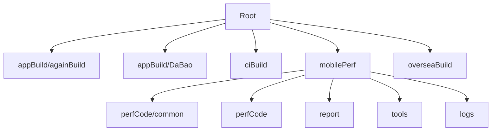
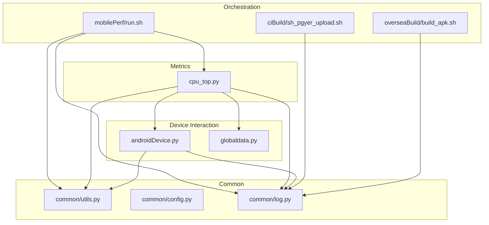
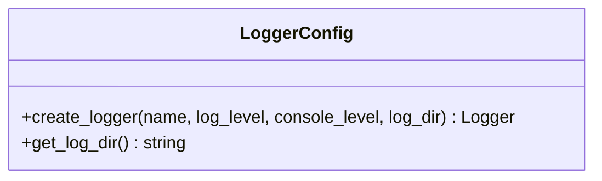
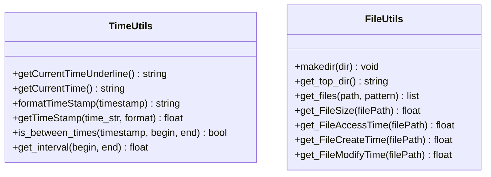
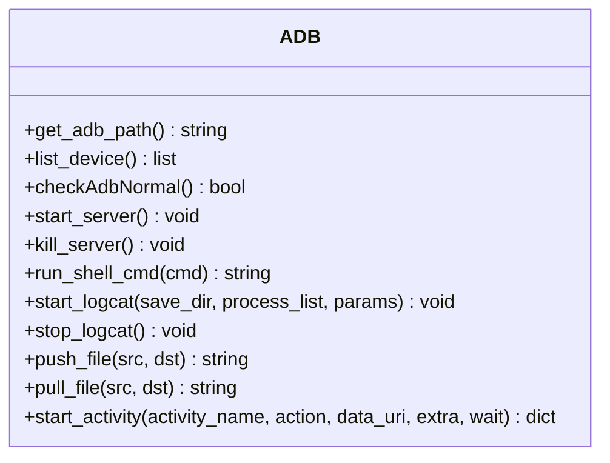
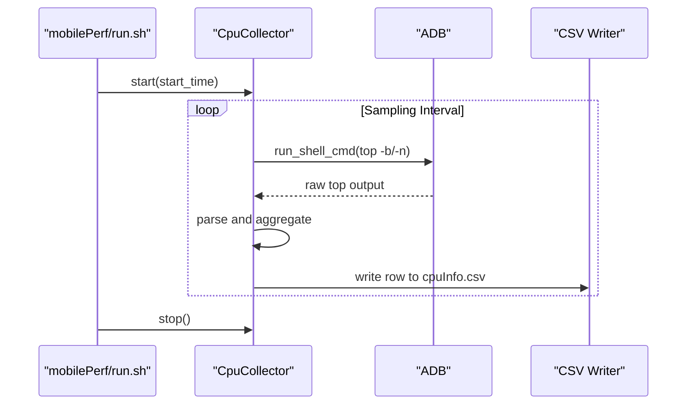
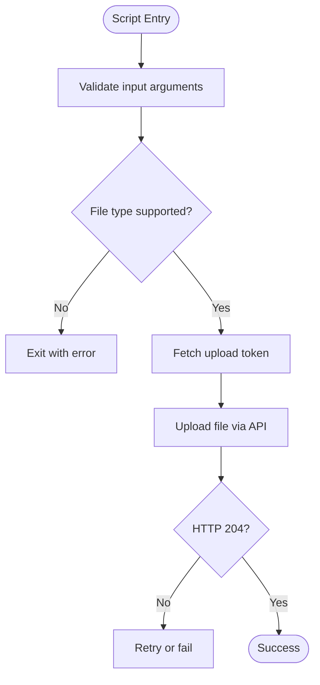
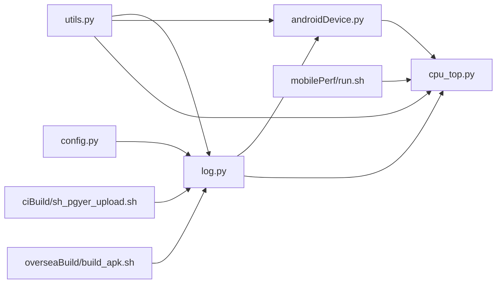
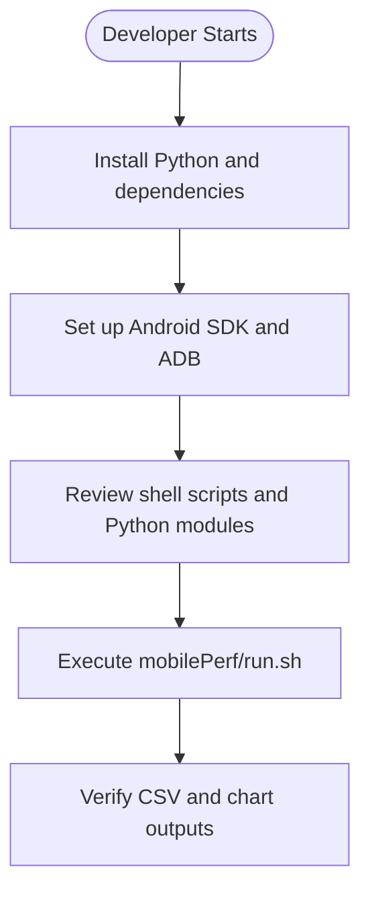

# Contributing Guidelines

<cite>
**Referenced Files in This Document**
- [README.md](file://README.md)
- [mobilePerf/perfCode/common/utils.py](file://mobilePerf/perfCode/common/utils.py)
- [mobilePerf/perfCode/common/config.py](file://mobilePerf/perfCode/common/config.py)
- [mobilePerf/perfCode/common/log.py](file://mobilePerf/perfCode/common/log.py)
- [mobilePerf/perfCode/androidDevice.py](file://mobilePerf/perfCode/androidDevice.py)
- [mobilePerf/perfCode/cpu_top.py](file://mobilePerf/perfCode/cpu_top.py)
- [mobilePerf/perfCode/globaldata.py](file://mobilePerf/perfCode/globaldata.py)
- [mobilePerf/run.sh](file://mobilePerf/run.sh)
- [ciBuild/sh_pgyer_upload.sh](file://ciBuild/sh_pgyer_upload.sh)
- [overseaBuild/build_apk.sh](file://overseaBuild/build_apk.sh)
- [mobilePerf/tools/testPhoneTime.py](file://mobilePerf/tools/testPhoneTime.py)
</cite>

## Table of Contents
1. [Introduction](#introduction)
2. [Project Structure](#project-structure)
3. [Core Components](#core-components)
4. [Architecture Overview](#architecture-overview)
5. [Detailed Component Analysis](#detailed-component-analysis)
6. [Dependency Analysis](#dependency-analysis)
7. [Performance Considerations](#performance-considerations)
8. [Troubleshooting Guide](#troubleshooting-guide)
9. [Contribution Workflow](#contribution-workflow)
10. [Testing Requirements](#testing-requirements)
11. [Documentation Updates](#documentation-updates)
12. [Versioning and Releases](#versioning-and-releases)
13. [Development Environment Setup](#development-environment-setup)
14. [Community Standards and Communication](#community-standards-and-communication)
15. [Conclusion](#conclusion)

## Introduction
This document provides comprehensive contributing guidelines for developers working on the perfCode project. It consolidates code style standards, testing requirements, contribution workflow, issue reporting, documentation updates, versioning, releases, and development environment setup based on the existing codebase.

## Project Structure
The repository is organized into functional areas:
- appBuild and againBuild: APK signing and resource modification utilities
- ciBuild: CI upload automation to a distribution service
- mobilePerf: Performance measurement and reporting toolkit for Android
- overseaBuild: Build and upload scripts for international builds

**Section sources**
- [README.md:1-37](file://README.md#L1-L37)

## Core Components
- Common utilities and logging: centralized helpers for time formatting, file operations, and structured logging
- Android device abstraction: ADB wrapper and device interaction utilities
- Performance collectors: CPU monitoring and data collection pipeline
- Build and CI scripts: Automation for local runs and distribution uploads

Key implementation patterns:
- Centralized logging via a configurable logger with rotating file handlers
- Device-agnostic ADB commands with robust error handling and retries
- CSV-based metrics storage with standardized column layouts
- Shell scripts for cross-platform automation

**Section sources**
- [mobilePerf/perfCode/common/log.py:14-79](file://mobilePerf/perfCode/common/log.py#L14-L79)
- [mobilePerf/perfCode/common/utils.py:10-156](file://mobilePerf/perfCode/common/utils.py#L10-L156)
- [mobilePerf/perfCode/androidDevice.py:18-800](file://mobilePerf/perfCode/androidDevice.py#L18-L800)
- [mobilePerf/perfCode/cpu_top.py:15-433](file://mobilePerf/perfCode/cpu_top.py#L15-L433)
- [mobilePerf/perfCode/globaldata.py:5-14](file://mobilePerf/perfCode/globaldata.py#L5-L14)

## Architecture Overview
The system follows a modular architecture:
- Tools and scripts orchestrate data collection and reporting
- Common modules provide shared utilities and logging
- Device abstraction encapsulates platform-specific interactions
- Metrics are persisted to CSV and visualized via charts

**Diagram sources**
- [mobilePerf/run.sh:1-29](file://mobilePerf/run.sh#L1-L29)
- [ciBuild/sh_pgyer_upload.sh:1-103](file://ciBuild/sh_pgyer_upload.sh#L1-L103)
- [overseaBuild/build_apk.sh:1-60](file://overseaBuild/build_apk.sh#L1-L60)
- [mobilePerf/perfCode/common/utils.py:10-156](file://mobilePerf/perfCode/common/utils.py#L10-L156)
- [mobilePerf/perfCode/common/config.py:1-20](file://mobilePerf/perfCode/common/config.py#L1-L20)
- [mobilePerf/perfCode/common/log.py:14-79](file://mobilePerf/perfCode/common/log.py#L14-L79)
- [mobilePerf/perfCode/androidDevice.py:18-800](file://mobilePerf/perfCode/androidDevice.py#L18-L800)
- [mobilePerf/perfCode/cpu_top.py:15-433](file://mobilePerf/perfCode/cpu_top.py#L15-L433)
- [mobilePerf/perfCode/globaldata.py:5-14](file://mobilePerf/perfCode/globaldata.py#L5-L14)

## Detailed Component Analysis

### Logging Module
- Provides a configurable logger with console and rotating file handlers
- Automatically resolves project-relative log directory
- Thread-safe initialization and consistent formatting

**Diagram sources**
- [mobilePerf/perfCode/common/log.py:14-79](file://mobilePerf/perfCode/common/log.py#L14-L79)

**Section sources**
- [mobilePerf/perfCode/common/log.py:14-79](file://mobilePerf/perfCode/common/log.py#L14-L79)

### Utilities and Time Helpers
- Time formatting utilities for filenames and timestamps
- File operations with recursive directory traversal and filtering
- Data conversion helpers for metrics units

**Diagram sources**
- [mobilePerf/perfCode/common/utils.py:10-156](file://mobilePerf/perfCode/common/utils.py#L10-L156)

**Section sources**
- [mobilePerf/perfCode/common/utils.py:10-156](file://mobilePerf/perfCode/common/utils.py#L10-L156)

### Android Device Abstraction
- ADB path detection and environment-aware selection
- Device enumeration, connection health checks, and server management
- Logcat capture with threading and file rotation
- Process and file operations on device

**Diagram sources**
- [mobilePerf/perfCode/androidDevice.py:18-800](file://mobilePerf/perfCode/androidDevice.py#L18-L800)

**Section sources**
- [mobilePerf/perfCode/androidDevice.py:18-800](file://mobilePerf/perfCode/androidDevice.py#L18-L800)

### CPU Monitoring Pipeline
- Collects CPU metrics via top command with adaptive sampling
- Writes CSV-formatted metrics with standardized headers
- Supports multi-package aggregation and periodic collection

**Diagram sources**
- [mobilePerf/run.sh:1-29](file://mobilePerf/run.sh#L1-L29)
- [mobilePerf/perfCode/cpu_top.py:206-348](file://mobilePerf/perfCode/cpu_top.py#L206-L348)
- [mobilePerf/perfCode/androidDevice.py:294-308](file://mobilePerf/perfCode/androidDevice.py#L294-L308)

**Section sources**
- [mobilePerf/perfCode/cpu_top.py:15-433](file://mobilePerf/perfCode/cpu_top.py#L15-L433)
- [mobilePerf/run.sh:1-29](file://mobilePerf/run.sh#L1-L29)

### Build and Upload Scripts
- CI upload script validates file type and uploads via API
- Overseas build script orchestrates Flutter builds and optional store uploads

**Diagram sources**
- [ciBuild/sh_pgyer_upload.sh:15-103](file://ciBuild/sh_pgyer_upload.sh#L15-L103)

**Section sources**
- [ciBuild/sh_pgyer_upload.sh:1-103](file://ciBuild/sh_pgyer_upload.sh#L1-L103)
- [overseaBuild/build_apk.sh:1-60](file://overseaBuild/build_apk.sh#L1-L60)

## Dependency Analysis
- Common modules are imported across device and metrics components
- Scripts depend on Python modules and shell environments
- Device operations rely on external ADB tool availability

**Diagram sources**
- [mobilePerf/perfCode/common/utils.py:10-156](file://mobilePerf/perfCode/common/utils.py#L10-L156)
- [mobilePerf/perfCode/common/log.py:14-79](file://mobilePerf/perfCode/common/log.py#L14-L79)
- [mobilePerf/perfCode/common/config.py:1-20](file://mobilePerf/perfCode/common/config.py#L1-L20)
- [mobilePerf/perfCode/androidDevice.py:18-800](file://mobilePerf/perfCode/androidDevice.py#L18-L800)
- [mobilePerf/perfCode/cpu_top.py:15-433](file://mobilePerf/perfCode/cpu_top.py#L15-L433)
- [mobilePerf/run.sh:1-29](file://mobilePerf/run.sh#L1-L29)
- [ciBuild/sh_pgyer_upload.sh:1-103](file://ciBuild/sh_pgyer_upload.sh#L1-L103)
- [overseaBuild/build_apk.sh:1-60](file://overseaBuild/build_apk.sh#L1-L60)

**Section sources**
- [mobilePerf/perfCode/androidDevice.py:18-800](file://mobilePerf/perfCode/androidDevice.py#L18-L800)
- [mobilePerf/perfCode/cpu_top.py:15-433](file://mobilePerf/perfCode/cpu_top.py#L15-L433)

## Performance Considerations
- Prefer batch operations and avoid repeated device queries
- Use timeouts and retry mechanisms for ADB commands
- Minimize file I/O overhead by batching writes to CSV
- Keep log levels appropriate for CI vs. local development

## Troubleshooting Guide
Common issues and resolutions:
- ADB connectivity failures: ensure device is connected and ADB server is healthy; scripts include server restart and port conflict handling
- Missing or unsupported file types in upload scripts: verify extension and existence
- CSV parsing mismatches: confirm column order and presence of required headers

**Section sources**
- [mobilePerf/perfCode/androidDevice.py:111-176](file://mobilePerf/perfCode/androidDevice.py#L111-L176)
- [ciBuild/sh_pgyer_upload.sh:19-32](file://ciBuild/sh_pgyer_upload.sh#L19-L32)
- [mobilePerf/perfCode/cpu_top.py:296-304](file://mobilePerf/perfCode/cpu_top.py#L296-L304)

## Contribution Workflow

### Branch Naming Conventions
- feature/<issue-description>: for new features
- fix/<issue-description>: for bug fixes
- docs/<scope>: for documentation updates
- refactor/<scope>: for refactoring efforts

### Pull Request Process
- Open a PR targeting the default branch
- Include a clear description of changes and rationale
- Reference related issues
- Ensure all checks pass locally before opening PR
- Assign reviewers for feedback

### Review Criteria
- Code readability and adherence to existing patterns
- Logging completeness and error handling
- Minimal breaking changes and backward compatibility
- Test coverage for new or modified functionality

### Merge Requirements
- At least one maintainer approval
- Passing CI checks
- Up-to-date with base branch

## Testing Requirements

### Unit Tests
- Validate utility functions (time formatting, file operations)
- Mock device interactions for isolated testing
- Verify CSV header generation and parsing

### Integration Tests
- End-to-end performance collection pipeline
- Device connectivity and ADB command execution
- Logcat capture and file persistence

### Performance Tests
- Measure collection intervals and memory usage
- Validate CSV write throughput under load
- Benchmark ADB command latency

### Example Contributions
- Add new metrics collector following CSV schema
- Enhance logging with structured fields
- Improve error handling in device operations

**Section sources**
- [mobilePerf/perfCode/common/utils.py:10-156](file://mobilePerf/perfCode/common/utils.py#L10-L156)
- [mobilePerf/perfCode/common/log.py:14-79](file://mobilePerf/perfCode/common/log.py#L14-L79)
- [mobilePerf/perfCode/androidDevice.py:18-800](file://mobilePerf/perfCode/androidDevice.py#L18-L800)
- [mobilePerf/perfCode/cpu_top.py:296-348](file://mobilePerf/perfCode/cpu_top.py#L296-L348)

## Documentation Updates
- Update README with new capabilities or usage changes
- Add inline docstrings for new public APIs
- Keep changelog entries for significant changes

## Versioning and Releases
- Semantic versioning for major/minor/patch
- Tag releases with annotated tags
- Maintain release notes summarizing changes

## Development Environment Setup

### Prerequisites
- Python 3.x with pip
- Android SDK and ADB
- Bash-compatible shell for scripts

### Local Execution
- Use the provided run script to collect and visualize metrics
- Configure device ID and package name in configuration module
- Ensure log directory is writable

**Section sources**
- [README.md:24-33](file://README.md#L24-L33)
- [mobilePerf/run.sh:1-29](file://mobilePerf/run.sh#L1-L29)
- [mobilePerf/perfCode/common/config.py:3-20](file://mobilePerf/perfCode/common/config.py#L3-L20)

## Community Standards and Communication
- Be respectful and inclusive
- Provide constructive feedback
- Use clear and concise language
- Escalate conflicts to maintainers

## Code Style Standards

### Python
- Use 4 spaces for indentation
- Prefer descriptive variable names
- Include docstrings for modules and public functions
- Group imports per standard library, third-party, then local

### Logging
- Use structured log messages with consistent formatting
- Include severity levels appropriate to context
- Avoid excessive debug output in production runs

### Scripts
- Use POSIX-compliant shell constructs
- Validate inputs and provide helpful error messages
- Keep scripts idempotent where possible

**Section sources**
- [mobilePerf/perfCode/common/log.py:46-73](file://mobilePerf/perfCode/common/log.py#L46-L73)
- [ciBuild/sh_pgyer_upload.sh:15-44](file://ciBuild/sh_pgyer_upload.sh#L15-L44)
- [mobilePerf/run.sh:1-29](file://mobilePerf/run.sh#L1-L29)

## Issue Reporting Procedures
- Provide environment details (OS, Python version, ADB version)
- Include steps to reproduce and expected vs. actual behavior
- Attach relevant logs and CSV outputs

## Bug Fix Workflows
- Isolate the problem using minimal reproducible steps
- Add targeted unit/integration tests
- Submit PR with fix and updated tests

## Conclusion
These guidelines consolidate the project’s existing patterns and expectations for contributors. By following them, you help maintain code quality, reliability, and a smooth development experience across the perfCode ecosystem.