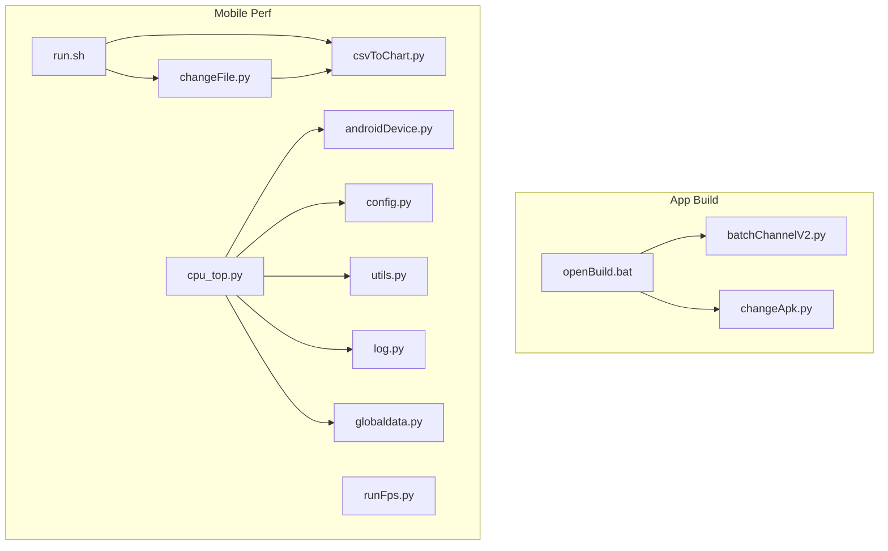
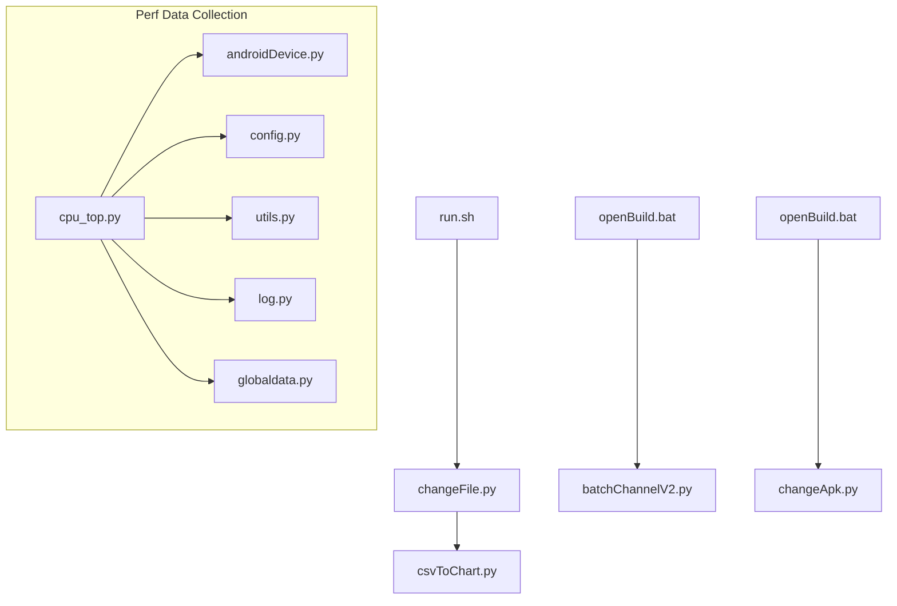
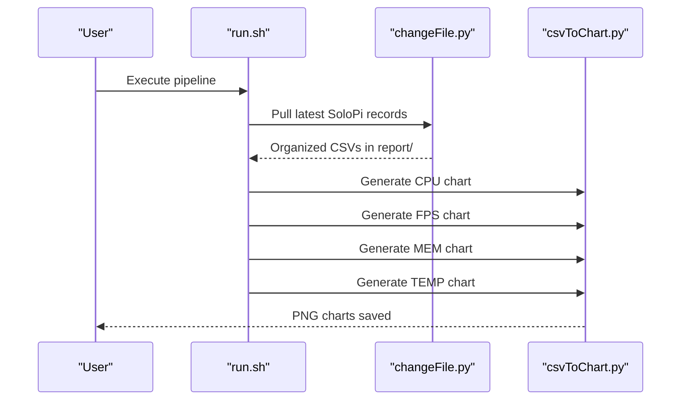
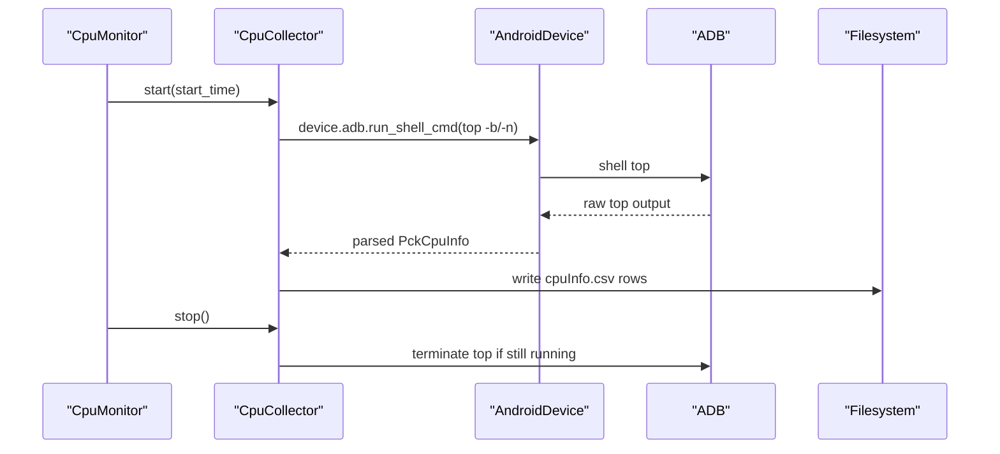
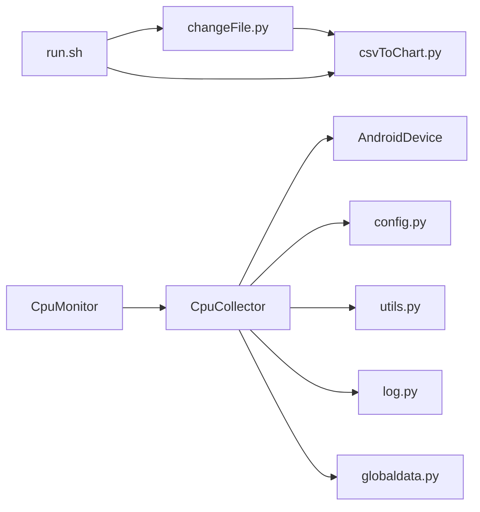

# Developer Reference

<cite>
**Referenced Files in This Document**
- [README.md](file://README.md)
- [openBuild.bat](file://appBuild/openBuild.bat)
- [batchChannelV2.py](file://appBuild/DaBao/batchChannelV2.py)
- [changeApk.py](file://appBuild/againBuild/changeApk.py)
- [run.sh](file://mobilePerf/run.sh)
- [changeFile.py](file://mobilePerf/tools/changeFile.py)
- [csvToChart.py](file://mobilePerf/tools/csvToChart.py)
- [runFps.py](file://mobilePerf/perfCode/runFps.py)
- [cpu_top.py](file://mobilePerf/perfCode/cpu_top.py)
- [androidDevice.py](file://mobilePerf/perfCode/androidDevice.py)
- [config.py](file://mobilePerf/perfCode/common/config.py)
- [utils.py](file://mobilePerf/perfCode/common/utils.py)
- [log.py](file://mobilePerf/perfCode/common/log.py)
- [globaldata.py](file://mobilePerf/perfCode/globaldata.py)
</cite>

## Table of Contents
1. [Introduction](#introduction)
2. [Project Structure](#project-structure)
3. [Core Components](#core-components)
4. [Architecture Overview](#architecture-overview)
5. [Detailed Component Analysis](#detailed-component-analysis)
6. [Dependency Analysis](#dependency-analysis)
7. [Performance Considerations](#performance-considerations)
8. [Troubleshooting Guide](#troubleshooting-guide)
9. [Contribution Guidelines](#contribution-guidelines)
10. [Conclusion](#conclusion)
11. [Appendices](#appendices)

## Introduction
This Developer Reference documents the complete developer-facing surface of the repository, including command-line interfaces, Python modules, configuration schemas, internal architecture patterns, component interactions, and extension points. It also provides guidance for contributing improvements, adding custom performance collectors, and integrating additional channel packaging strategies.

The repository supports:
- Android performance data collection via ADB and SoloPi, with automated CSV-to-chart generation
- APK building and channel packaging workflows
- Logging and shared runtime data utilities

Wherever possible, this document avoids reproducing code and instead references precise file locations and line ranges for traceability.

## Project Structure
The repository is organized by functional areas:
- appBuild: APK build and packaging utilities (including channel packaging)
- mobilePerf: Performance data collection, processing, and visualization
- overseaBuild: iOS and international distribution utilities (not covered in depth here)
- Root README: High-level overview and usage notes

**Diagram sources**
- [openBuild.bat:1-23](file://appBuild/openBuild.bat#L1-L23)
- [batchChannelV2.py:1-120](file://appBuild/DaBao/batchChannelV2.py#L1-L120)
- [changeApk.py:1-39](file://appBuild/againBuild/changeApk.py#L1-L39)
- [run.sh:1-29](file://mobilePerf/run.sh#L1-L29)
- [changeFile.py:1-112](file://mobilePerf/tools/changeFile.py#L1-L112)
- [csvToChart.py:1-151](file://mobilePerf/tools/csvToChart.py#L1-L151)
- [runFps.py:1-94](file://mobilePerf/perfCode/runFps.py#L1-L94)
- [cpu_top.py:1-433](file://mobilePerf/perfCode/cpu_top.py#L1-L433)
- [androidDevice.py:1-1177](file://mobilePerf/perfCode/androidDevice.py#L1-L1177)
- [config.py:1-20](file://mobilePerf/perfCode/common/config.py#L1-L20)
- [utils.py:1-156](file://mobilePerf/perfCode/common/utils.py#L1-L156)
- [log.py:1-87](file://mobilePerf/perfCode/common/log.py#L1-L87)
- [globaldata.py:1-14](file://mobilePerf/perfCode/globaldata.py#L1-L14)

**Section sources**
- [README.md:1-37](file://README.md#L1-L37)
- [openBuild.bat:1-23](file://appBuild/openBuild.bat#L1-L23)
- [run.sh:1-29](file://mobilePerf/run.sh#L1-L29)

## Core Components
This section describes the primary modules and their roles.

- Command-line tooling
  - Channel packaging: batchChannelV2.py
  - APK decompile/build: changeApk.py
  - Performance pipeline: run.sh orchestrates changeFile.py and csvToChart.py
  - FPS automation: runFps.py
- Python modules
  - Android device abstraction and ADB operations: androidDevice.py
  - CPU monitoring and data collection: cpu_top.py
  - Shared utilities: config.py, utils.py, log.py, globaldata.py

Key responsibilities:
- Orchestrate SoloPi data pull and chart generation
- Manage device connectivity, logcat, and file transfers
- Collect CPU metrics and write CSV outputs
- Provide logging, timing, and file utilities
- Share runtime state across modules

**Section sources**
- [batchChannelV2.py:1-120](file://appBuild/DaBao/batchChannelV2.py#L1-L120)
- [changeApk.py:1-39](file://appBuild/againBuild/changeApk.py#L1-L39)
- [run.sh:1-29](file://mobilePerf/run.sh#L1-L29)
- [changeFile.py:1-112](file://mobilePerf/tools/changeFile.py#L1-L112)
- [csvToChart.py:1-151](file://mobilePerf/tools/csvToChart.py#L1-L151)
- [runFps.py:1-94](file://mobilePerf/perfCode/runFps.py#L1-L94)
- [cpu_top.py:1-433](file://mobilePerf/perfCode/cpu_top.py#L1-L433)
- [androidDevice.py:1-1177](file://mobilePerf/perfCode/androidDevice.py#L1-L1177)
- [config.py:1-20](file://mobilePerf/perfCode/common/config.py#L1-L20)
- [utils.py:1-156](file://mobilePerf/perfCode/common/utils.py#L1-L156)
- [log.py:1-87](file://mobilePerf/perfCode/common/log.py#L1-L87)
- [globaldata.py:1-14](file://mobilePerf/perfCode/globaldata.py#L1-L14)

## Architecture Overview
The system integrates CLI tools, Python modules, and Android device operations to collect performance metrics and produce charts.

**Diagram sources**
- [run.sh:1-29](file://mobilePerf/run.sh#L1-L29)
- [changeFile.py:1-112](file://mobilePerf/tools/changeFile.py#L1-L112)
- [csvToChart.py:1-151](file://mobilePerf/tools/csvToChart.py#L1-L151)
- [openBuild.bat:1-23](file://appBuild/openBuild.bat#L1-L23)
- [batchChannelV2.py:1-120](file://appBuild/DaBao/batchChannelV2.py#L1-L120)
- [changeApk.py:1-39](file://appBuild/againBuild/changeApk.py#L1-L39)
- [androidDevice.py:1-1177](file://mobilePerf/perfCode/androidDevice.py#L1-L1177)
- [cpu_top.py:1-433](file://mobilePerf/perfCode/cpu_top.py#L1-L433)
- [config.py:1-20](file://mobilePerf/perfCode/common/config.py#L1-L20)
- [utils.py:1-156](file://mobilePerf/perfCode/common/utils.py#L1-L156)
- [log.py:1-87](file://mobilePerf/perfCode/common/log.py#L1-L87)
- [globaldata.py:1-14](file://mobilePerf/perfCode/globaldata.py#L1-L14)

## Detailed Component Analysis

### Command-Line Interfaces

#### Channel Packaging Tool (batchChannelV2.py)
- Purpose: Generate channel-specific APKs using Walle
- Modes:
  - Show channels: show <apk>
  - Single channel: <apk> <channel>
  - Multiple channels: <apk> <ch1,ch2,ch3>
  - Sequential channels: <apk> <prefix> <start> <end>
  - Config file: <apk> -f <config_file>
- Returns:
  - 0 on success
  - Non-zero on failure (e.g., invalid arguments, walle errors)
- Notes:
  - Renames output APKs to canonical form
  - Uses a JAR file named in the script

**Section sources**
- [batchChannelV2.py:1-120](file://appBuild/DaBao/batchChannelV2.py#L1-L120)

#### APK Decompile/Build Tool (changeApk.py)
- Purpose: Deconstruct or reconstruct an APK using Apktool
- Usage: python changeApk.py <file_path>
- Modes:
  - 1: decompile (--only-main-classes)
  - 2: rebuild with output appended to directory name
- Returns:
  - 0 on success
  - Non-zero on failure (missing file, invalid choice)

**Section sources**
- [changeApk.py:1-39](file://appBuild/againBuild/changeApk.py#L1-L39)

#### Performance Pipeline Orchestrator (run.sh)
- Purpose: One-click pull and chart generation for CPU/FPS/MEM/TEMP
- Steps:
  1) Pull SoloPi data via changeFile.py
  2) Generate CPU chart
  3) Generate FPS chart
  4) Generate MEM chart
  5) Generate TEMP chart
- Behavior:
  - Exits early on any step failure
  - Uses Python scripts located under tools/

**Section sources**
- [run.sh:1-29](file://mobilePerf/run.sh#L1-L29)
- [changeFile.py:1-112](file://mobilePerf/tools/changeFile.py#L1-L112)
- [csvToChart.py:1-151](file://mobilePerf/tools/csvToChart.py#L1-L151)

#### SoloPi Data Pull Utility (changeFile.py)
- Purpose: Pull latest SoloPi records from device storage and organize into report folders
- Key behaviors:
  - Detects latest SoloPi folder by fixed-length timestamp
  - Pulls files and moves them into per-type CSVs (FPS, MEM, CPU, TEMP)
  - Handles encoding and directory creation
- Returns:
  - 0 on success
  - Non-zero on ADB failures or missing data

**Section sources**
- [changeFile.py:1-112](file://mobilePerf/tools/changeFile.py#L1-L112)

#### CSV-to-Chart Generator (csvToChart.py)
- Purpose: Plot performance charts from CSV files
- Supported types: FPS, CPU, MEM, TEMP
- Features:
  - Platform detection (Windows/macOS)
  - Automatic latest-file selection per type
  - Filtering and optional extreme-value removal
  - Saves PNG with standardized naming
- Returns:
  - 0 on success
  - Non-zero on unsupported platform/type or missing files

**Section sources**
- [csvToChart.py:1-151](file://mobilePerf/tools/csvToChart.py#L1-L151)

#### FPS Automation (runFps.py)
- Purpose: Perform repeated swipe gestures on a connected device to generate FPS load
- Behavior:
  - Detects device ID via ADB
  - Executes randomized swipe sequences
  - Prints progress and waits between actions
- Returns:
  - Function exits after completing iterations

**Section sources**
- [runFps.py:1-94](file://mobilePerf/perfCode/runFps.py#L1-L94)

### Python Modules

#### Android Device Abstraction (androidDevice.py)
- Responsibilities:
  - Locate ADB executable (system or bundled)
  - Manage device connections and retries
  - Execute shell commands and capture outputs
  - Stream and persist logcat logs
  - File operations (push/pull/list/mkdir)
  - Activity and process introspection
  - System property queries
- Notable behaviors:
  - Robust error handling for common ADB issues (port conflicts, device offline)
  - Retries and timeouts for reliability
  - Threaded logcat capture with periodic flushes

**Section sources**
- [androidDevice.py:1-1177](file://mobilePerf/perfCode/androidDevice.py#L1-L1177)

#### CPU Collector and Monitor (cpu_top.py)
- Responsibilities:
  - Poll CPU usage via top (batch mode) and parse per-process and device-wide metrics
  - Write CSV outputs with timestamps and package-specific PID/CPU%
  - Support multi-package aggregation
  - Optional frequency and timeout controls
- Data model:
  - CSV columns include timestamp, device CPU%, user%, system%, idle%
  - Per-package entries include package, pid, pid_cpu%

**Section sources**
- [cpu_top.py:1-433](file://mobilePerf/perfCode/cpu_top.py#L1-L433)

#### Shared Utilities (config.py, utils.py, log.py, globaldata.py)
- config.py
  - Defines defaults for package, device ID, sampling period, network type, monkey seed, monkey parameters, log location, and info path
- utils.py
  - Time utilities (formats, conversions)
  - File utilities (listing, sizes, recursive search)
  - Data conversion helpers (temperature, voltage, current)
- log.py
  - Centralized logging with rotating file handler and console handler
- globaldata.py
  - Global runtime state (shared across modules)

**Section sources**
- [config.py:1-20](file://mobilePerf/perfCode/common/config.py#L1-L20)
- [utils.py:1-156](file://mobilePerf/perfCode/common/utils.py#L1-L156)
- [log.py:1-87](file://mobilePerf/perfCode/common/log.py#L1-L87)
- [globaldata.py:1-14](file://mobilePerf/perfCode/globaldata.py#L1-L14)

### API Workflows

#### SoloPi Data Pull and Chart Generation

**Diagram sources**
- [run.sh:1-29](file://mobilePerf/run.sh#L1-L29)
- [changeFile.py:1-112](file://mobilePerf/tools/changeFile.py#L1-L112)
- [csvToChart.py:1-151](file://mobilePerf/tools/csvToChart.py#L1-L151)

#### CPU Monitoring Workflow

**Diagram sources**
- [cpu_top.py:1-433](file://mobilePerf/perfCode/cpu_top.py#L1-L433)
- [androidDevice.py:1-1177](file://mobilePerf/perfCode/androidDevice.py#L1-L1177)

### Extension Points and Design Patterns

- Custom performance collectors
  - Pattern: subclass the base monitor interface and implement start/stop/save
  - Example base class: Monitor (placeholder methods with warnings)
  - Integration: instantiate collector with AndroidDevice and write CSV outputs
  - References:
    - [basemonitor.py:1-37](file://mobilePerf/perfCode/common/basemonitor.py#L1-L37)
    - [cpu_top.py:1-433](file://mobilePerf/perfCode/cpu_top.py#L1-L433)

- Additional channel packaging strategies
  - Extend batchChannelV2.py with new modes or external tool integrations
  - Maintain consistent output naming and return codes
  - References:
    - [batchChannelV2.py:1-120](file://appBuild/DaBao/batchChannelV2.py#L1-L120)

- Integration development
  - Use androidDevice.py for device operations and log handling
  - Centralize logging via log.py and share runtime state via globaldata.py
  - References:
    - [androidDevice.py:1-1177](file://mobilePerf/perfCode/androidDevice.py#L1-L1177)
    - [log.py:1-87](file://mobilePerf/perfCode/common/log.py#L1-L87)
    - [globaldata.py:1-14](file://mobilePerf/perfCode/globaldata.py#L1-L14)

**Section sources**
- [cpu_top.py:1-433](file://mobilePerf/perfCode/cpu_top.py#L1-L433)
- [batchChannelV2.py:1-120](file://appBuild/DaBao/batchChannelV2.py#L1-L120)
- [androidDevice.py:1-1177](file://mobilePerf/perfCode/androidDevice.py#L1-L1177)
- [log.py:1-87](file://mobilePerf/perfCode/common/log.py#L1-L87)
- [globaldata.py:1-14](file://mobilePerf/perfCode/globaldata.py#L1-L14)

## Dependency Analysis
High-level dependencies among major components:

**Diagram sources**
- [run.sh:1-29](file://mobilePerf/run.sh#L1-L29)
- [changeFile.py:1-112](file://mobilePerf/tools/changeFile.py#L1-L112)
- [csvToChart.py:1-151](file://mobilePerf/tools/csvToChart.py#L1-L151)
- [cpu_top.py:1-433](file://mobilePerf/perfCode/cpu_top.py#L1-L433)
- [androidDevice.py:1-1177](file://mobilePerf/perfCode/androidDevice.py#L1-L1177)
- [config.py:1-20](file://mobilePerf/perfCode/common/config.py#L1-L20)
- [utils.py:1-156](file://mobilePerf/perfCode/common/utils.py#L1-L156)
- [log.py:1-87](file://mobilePerf/perfCode/common/log.py#L1-L87)
- [globaldata.py:1-14](file://mobilePerf/perfCode/globaldata.py#L1-L14)

**Section sources**
- [cpu_top.py:1-433](file://mobilePerf/perfCode/cpu_top.py#L1-L433)
- [androidDevice.py:1-1177](file://mobilePerf/perfCode/androidDevice.py#L1-L1177)
- [run.sh:1-29](file://mobilePerf/run.sh#L1-L29)
- [changeFile.py:1-112](file://mobilePerf/tools/changeFile.py#L1-L112)
- [csvToChart.py:1-151](file://mobilePerf/tools/csvToChart.py#L1-L151)

## Performance Considerations
- ADB reliability
  - The Android device layer retries commands and handles common failure modes (offline, port conflicts). Prefer using the provided device wrapper for robustness.
- Data volume and retention
  - CPU collector writes continuous CSV rows; consider log rotation and cleanup strategies to avoid excessive disk usage.
- Parsing robustness
  - CPU parsing adapts to SDK differences; ensure device compatibility and handle unexpected top output gracefully.
- Chart generation
  - Down-sampling and optional extreme-value removal improve visualization stability.

[No sources needed since this section provides general guidance]

## Troubleshooting Guide
Common issues and resolutions:

- ADB device problems
  - Symptoms: “no devices/emulators found”, “device not found”, “offline”
  - Actions: reconnect device, restart ADB server, resolve port conflicts (5037)
  - References:
    - [androidDevice.py:240-262](file://mobilePerf/perfCode/androidDevice.py#L240-L262)
    - [androidDevice.py:140-176](file://mobilePerf/perfCode/androidDevice.py#L140-L176)

- SoloPi data pull failures
  - Symptoms: ADB pull fails or no latest folder detected
  - Actions: verify device connection, SoloPi directory presence, and permissions
  - References:
    - [changeFile.py:37-67](file://mobilePerf/tools/changeFile.py#L37-L67)

- Unsupported platform or type
  - Symptoms: “不支持的平台” or “未找到 CSV 文件”
  - Actions: ensure correct platform detection and CSV availability
  - References:
    - [csvToChart.py:113-146](file://mobilePerf/tools/csvToChart.py#L113-L146)

- Channel packaging errors
  - Symptoms: invalid arguments or walle failure
  - Actions: confirm JAR availability and channel arguments
  - References:
    - [batchChannelV2.py:91-120](file://appBuild/DaBao/batchChannelV2.py#L91-L120)

**Section sources**
- [androidDevice.py:140-176](file://mobilePerf/perfCode/androidDevice.py#L140-L176)
- [androidDevice.py:240-262](file://mobilePerf/perfCode/androidDevice.py#L240-L262)
- [changeFile.py:37-67](file://mobilePerf/tools/changeFile.py#L37-L67)
- [csvToChart.py:113-146](file://mobilePerf/tools/csvToChart.py#L113-L146)
- [batchChannelV2.py:91-120](file://appBuild/DaBao/batchChannelV2.py#L91-L120)

## Contribution Guidelines
- Code style
  - Follow existing Python conventions; keep modules cohesive and single-responsibility
  - Use centralized logging via the provided logger
- Testing
  - Validate CLI tools with representative inputs (e.g., APKs, SoloPi data)
  - Verify device operations under various states (connected/offline/port conflict)
- Pull requests
  - Describe changes, rationale, and test outcomes
  - Keep diffs minimal and focused

[No sources needed since this section provides general guidance]

## Conclusion
This reference documents the CLI tools, Python modules, configuration, and architecture of the performance and build toolchain. It highlights extension points for custom collectors and packaging strategies, along with practical troubleshooting steps grounded in the codebase.

[No sources needed since this section summarizes without analyzing specific files]

## Appendices

### Configuration Schema (config.py)
- Fields
  - package: Application package name
  - deviceId: Target device serial number
  - period: Sampling interval (seconds)
  - net: Network type hint
  - monkey_seed: Seed for pseudo-random generator
  - monkey_parameters: Monkey instrumentation flags
  - log_location: Log file path with timestamp suffix
  - info_path: Directory for performance data

**Section sources**
- [config.py:1-20](file://mobilePerf/perfCode/common/config.py#L1-L20)

### Command Reference

- Channel packaging
  - show <apk>: Print channel info
  - <apk> <channel>: Single channel
  - <apk> <ch1,ch2,ch3>: Multiple channels
  - <apk> <prefix> <start> <end>: Sequential channels
  - <apk> -f <config_file>: Batch from config
  - Returns: 0 on success, non-zero on failure

**Section sources**
- [batchChannelV2.py:1-120](file://appBuild/DaBao/batchChannelV2.py#L1-L120)

- APK decompile/rebuild
  - Usage: python changeApk.py <file_path>
  - Modes: 1=decompile, 2=rebuild
  - Returns: 0 on success, non-zero on failure

**Section sources**
- [changeApk.py:1-39](file://appBuild/againBuild/changeApk.py#L1-L39)

- Performance pipeline
  - run.sh: Runs changeFile.py and csvToChart.py for each metric
  - Returns: 0 on success, non-zero on any step failure

**Section sources**
- [run.sh:1-29](file://mobilePerf/run.sh#L1-L29)
- [changeFile.py:1-112](file://mobilePerf/tools/changeFile.py#L1-L112)
- [csvToChart.py:1-151](file://mobilePerf/tools/csvToChart.py#L1-L151)

- FPS automation
  - runFps.py: Performs swipe actions to stress FPS
  - Returns: Function completes after iterations

**Section sources**
- [runFps.py:1-94](file://mobilePerf/perfCode/runFps.py#L1-L94)