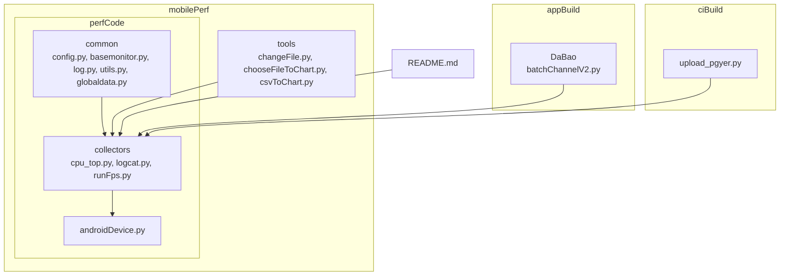
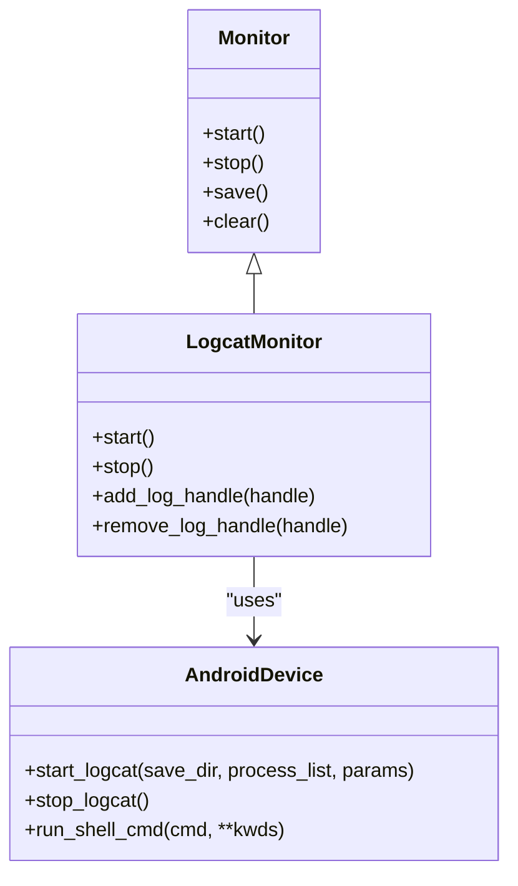
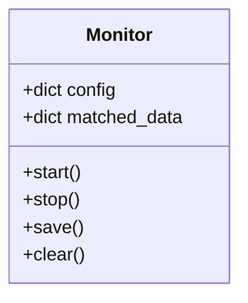
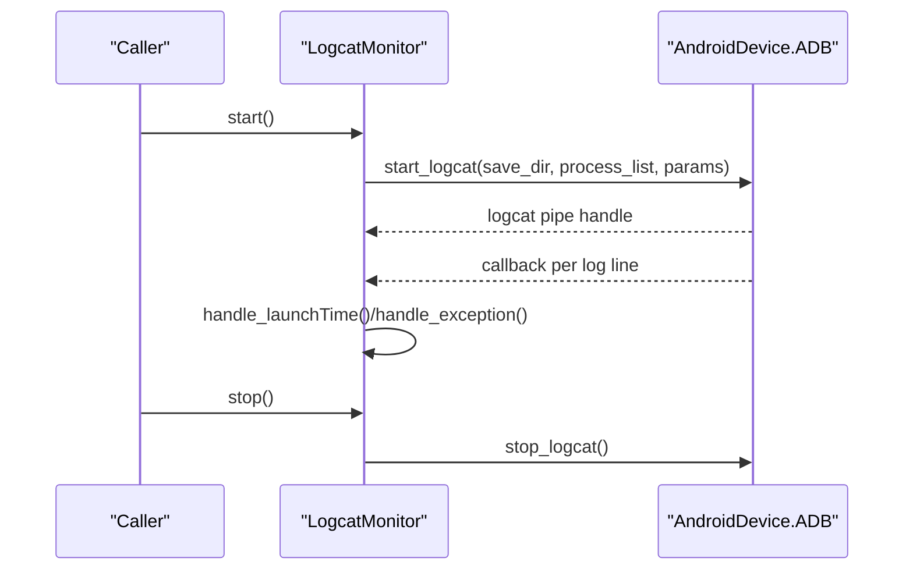
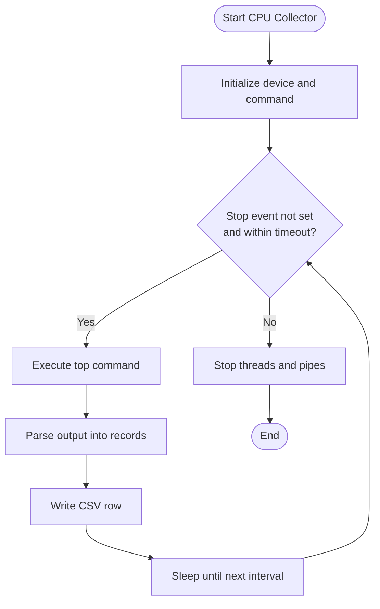
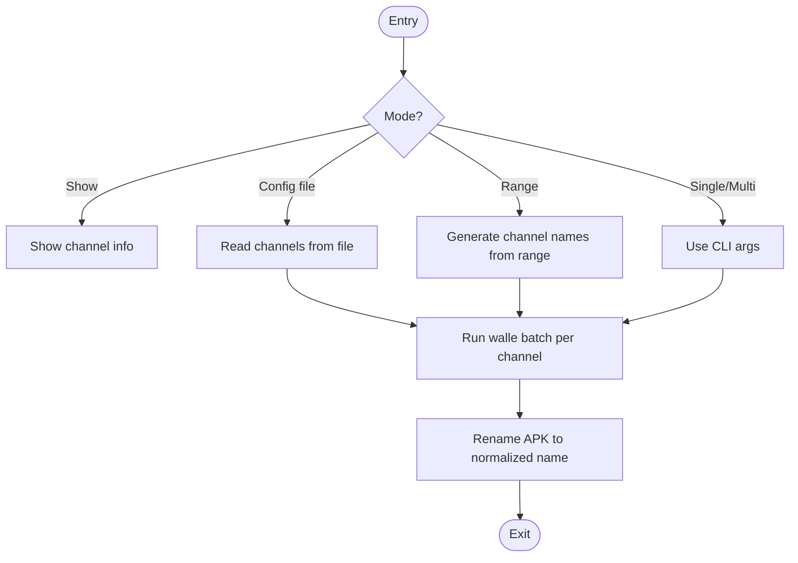
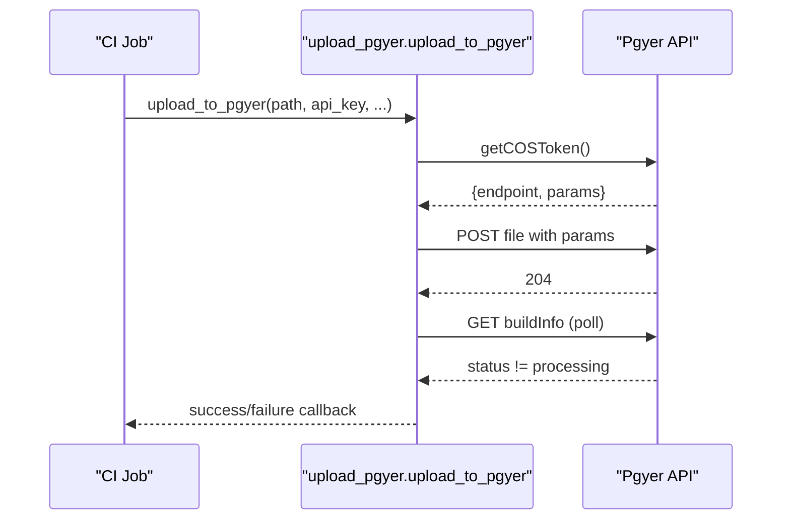
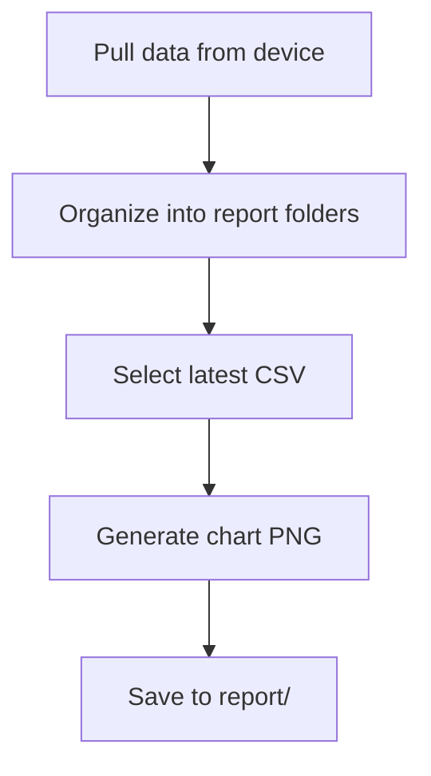
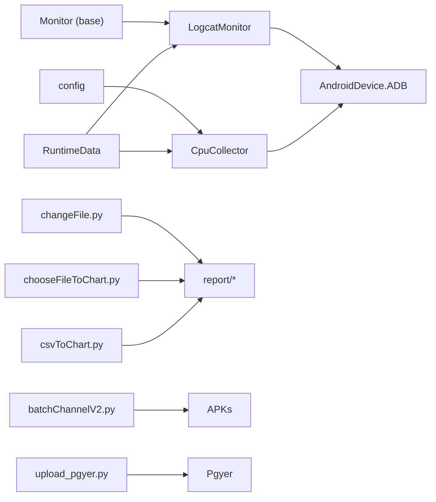

# Extension and Development Guide

<cite>
**Referenced Files in This Document**
- [basemonitor.py](file://mobilePerf/perfCode/common/basemonitor.py)
- [config.py](file://mobilePerf/perfCode/common/config.py)
- [log.py](file://mobilePerf/perfCode/common/log.py)
- [utils.py](file://mobilePerf/perfCode/common/utils.py)
- [globaldata.py](file://mobilePerf/perfCode/globaldata.py)
- [androidDevice.py](file://mobilePerf/perfCode/androidDevice.py)
- [cpu_top.py](file://mobilePerf/perfCode/cpu_top.py)
- [logcat.py](file://mobilePerf/perfCode/logcat.py)
- [runFps.py](file://mobilePerf/perfCode/runFps.py)
- [batchChannelV2.py](file://appBuild/DaBao/batchChannelV2.py)
- [upload_pgyer.py](file://ciBuild/utils/upload_pgyer.py)
- [changeFile.py](file://mobilePerf/tools/changeFile.py)
- [chooseFileToChart.py](file://mobilePerf/tools/chooseFileToChart.py)
- [csvToChart.py](file://mobilePerf/tools/csvToChart.py)
- [README.md](file://README.md)
</cite>

## Table of Contents
1. [Introduction](#introduction)
2. [Project Structure](#project-structure)
3. [Core Components](#core-components)
4. [Architecture Overview](#architecture-overview)
5. [Detailed Component Analysis](#detailed-component-analysis)
6. [Dependency Analysis](#dependency-analysis)
7. [Performance Considerations](#performance-considerations)
8. [Troubleshooting Guide](#troubleshooting-guide)
9. [Conclusion](#conclusion)
10. [Appendices](#appendices)

## Introduction
This guide documents how to extend and customize the framework for collecting and analyzing mobile application performance. It focuses on:
- Creating custom performance collectors by extending the Monitor base class
- Implementing additional channel packaging strategies and integrating new distribution platforms
- Extending the configuration system to add new parameters
- Maintaining compatibility with existing components
- Step-by-step tutorials for common extension scenarios
- Testing strategies for custom extensions and integration testing approaches

## Project Structure
The repository is organized into functional areas:
- mobilePerf/perfCode: Core performance collection and monitoring logic
- mobilePerf/tools: Data ingestion and visualization utilities
- appBuild: Build-time packaging and channel management
- ciBuild: CI/CD integration utilities
- overseaBuild: Overseas build and distribution scripts
- Root README: High-level overview and usage notes

**Diagram sources**
- [basemonitor.py](file://mobilePerf/perfCode/common/basemonitor.py)
- [config.py](file://mobilePerf/perfCode/common/config.py)
- [log.py](file://mobilePerf/perfCode/common/log.py)
- [utils.py](file://mobilePerf/perfCode/common/utils.py)
- [globaldata.py](file://mobilePerf/perfCode/globaldata.py)
- [androidDevice.py](file://mobilePerf/perfCode/androidDevice.py)
- [cpu_top.py](file://mobilePerf/perfCode/cpu_top.py)
- [logcat.py](file://mobilePerf/perfCode/logcat.py)
- [runFps.py](file://mobilePerf/perfCode/runFps.py)
- [batchChannelV2.py](file://appBuild/DaBao/batchChannelV2.py)
- [upload_pgyer.py](file://ciBuild/utils/upload_pgyer.py)
- [changeFile.py](file://mobilePerf/tools/changeFile.py)
- [chooseFileToChart.py](file://mobilePerf/tools/chooseFileToChart.py)
- [csvToChart.py](file://mobilePerf/tools/csvToChart.py)
- [README.md](file://README.md)

**Section sources**
- [README.md](file://README.md)

## Core Components
- Monitor base class defines the contract for performance collectors (start, stop, save, clear). See [Monitor](file://mobilePerf/perfCode/common/basemonitor.py).
- Configuration container holds runtime parameters (package, device id, intervals, network, seed, monkey parameters, log locations). See [config](file://mobilePerf/perfCode/common/config.py).
- Logging facility provides structured logging with rotating files. See [create_logger](file://mobilePerf/perfCode/common/log.py).
- Utilities for time and file operations. See [TimeUtils](file://mobilePerf/perfCode/common/utils.py), [FileUtils](file://mobilePerf/perfCode/common/utils.py).
- Global runtime data shared across components. See [RuntimeData](file://mobilePerf/perfCode/globaldata.py).
- Android device abstraction encapsulates ADB commands and logcat streaming. See [ADB](file://mobilePerf/perfCode/androidDevice.py).

**Section sources**
- [basemonitor.py](file://mobilePerf/perfCode/common/basemonitor.py)
- [config.py](file://mobilePerf/perfCode/common/config.py)
- [log.py](file://mobilePerf/perfCode/common/log.py)
- [utils.py](file://mobilePerf/perfCode/common/utils.py)
- [globaldata.py](file://mobilePerf/perfCode/globaldata.py)
- [androidDevice.py](file://mobilePerf/perfCode/androidDevice.py)

## Architecture Overview
The framework follows a modular architecture:
- Collectors implement the Monitor interface and use AndroidDevice to gather device telemetry.
- LogcatMonitor extends Monitor to capture and parse Android logcat events.
- Tools orchestrate data ingestion and visualization.
- Packaging and CI utilities integrate with external platforms.

**Diagram sources**
- [basemonitor.py](file://mobilePerf/perfCode/common/basemonitor.py)
- [logcat.py](file://mobilePerf/perfCode/logcat.py)
- [androidDevice.py](file://mobilePerf/perfCode/androidDevice.py)

## Detailed Component Analysis

### Monitor Base Class and Extension Patterns
- Purpose: Define a uniform lifecycle for collectors (start, stop, save, clear).
- Extension points:
  - Implement start to initialize data capture and device interactions.
  - Implement stop to finalize capture and release resources.
  - Implement save to persist captured data.
  - Use config and RuntimeData for configuration and shared state.
- Compatibility: Subclasses should honor the lifecycle contract and avoid blocking operations in hot paths.

**Diagram sources**
- [basemonitor.py](file://mobilePerf/perfCode/common/basemonitor.py)

**Section sources**
- [basemonitor.py](file://mobilePerf/perfCode/common/basemonitor.py)

### LogcatMonitor Implementation
- Extends Monitor to stream and parse Android logcat events.
- Integrates with AndroidDevice for logcat lifecycle and real-time callbacks.
- Provides handlers for launch time parsing and exception logging.

**Diagram sources**
- [logcat.py](file://mobilePerf/perfCode/logcat.py)
- [androidDevice.py](file://mobilePerf/perfCode/androidDevice.py)

**Section sources**
- [logcat.py](file://mobilePerf/perfCode/logcat.py)
- [androidDevice.py](file://mobilePerf/perfCode/androidDevice.py)

### CPU Collector Pattern
- Demonstrates a collector using AndroidDevice to execute adb shell commands and write CSV data.
- Uses threading and timeouts to manage long-running captures.
- Shows how to integrate with RuntimeData for output paths.

**Diagram sources**
- [cpu_top.py](file://mobilePerf/perfCode/cpu_top.py)
- [androidDevice.py](file://mobilePerf/perfCode/androidDevice.py)
- [globaldata.py](file://mobilePerf/perfCode/globaldata.py)

**Section sources**
- [cpu_top.py](file://mobilePerf/perfCode/cpu_top.py)
- [globaldata.py](file://mobilePerf/perfCode/globaldata.py)

### Channel Packaging Strategies (Walle-based)
- batchChannelV2.py demonstrates channel packaging via Walle CLI.
- Supports single channel, multiple channels, sequential ranges, and config-file-driven batching.
- Includes renaming logic to normalize APK filenames post-packaging.

**Diagram sources**
- [batchChannelV2.py](file://appBuild/DaBao/batchChannelV2.py)

**Section sources**
- [batchChannelV2.py](file://appBuild/DaBao/batchChannelV2.py)

### CI/CD Distribution Platform Integration (Pgyer)
- upload_pgyer.py integrates with Pgyer’s API to upload artifacts and poll build status.
- Implements token acquisition, signed upload, and status polling.

**Diagram sources**
- [upload_pgyer.py](file://ciBuild/utils/upload_pgyer.py)

**Section sources**
- [upload_pgyer.py](file://ciBuild/utils/upload_pgyer.py)

### Data Ingestion and Visualization Utilities
- changeFile.py and chooseFileToChart.py automate pulling SoloPi performance data from devices and organizing into report folders.
- csvToChart.py generates charts from CSV data for FPS, CPU, MEM, TEMP.

**Diagram sources**
- [changeFile.py](file://mobilePerf/tools/changeFile.py)
- [chooseFileToChart.py](file://mobilePerf/tools/chooseFileToChart.py)
- [csvToChart.py](file://mobilePerf/tools/csvToChart.py)

**Section sources**
- [changeFile.py](file://mobilePerf/tools/changeFile.py)
- [chooseFileToChart.py](file://mobilePerf/tools/chooseFileToChart.py)
- [csvToChart.py](file://mobilePerf/tools/csvToChart.py)

## Dependency Analysis
- Collectors depend on AndroidDevice for ADB operations and on RuntimeData for output paths.
- LogcatMonitor depends on Monitor and AndroidDevice for streaming and callbacks.
- Tools depend on report directories and CSV formats produced by collectors.
- Packaging and CI utilities are independent modules that complement the core collection pipeline.

**Diagram sources**
- [basemonitor.py](file://mobilePerf/perfCode/common/basemonitor.py)
- [logcat.py](file://mobilePerf/perfCode/logcat.py)
- [cpu_top.py](file://mobilePerf/perfCode/cpu_top.py)
- [androidDevice.py](file://mobilePerf/perfCode/androidDevice.py)
- [config.py](file://mobilePerf/perfCode/common/config.py)
- [globaldata.py](file://mobilePerf/perfCode/globaldata.py)
- [changeFile.py](file://mobilePerf/tools/changeFile.py)
- [chooseFileToChart.py](file://mobilePerf/tools/chooseFileToChart.py)
- [csvToChart.py](file://mobilePerf/tools/csvToChart.py)
- [batchChannelV2.py](file://appBuild/DaBao/batchChannelV2.py)
- [upload_pgyer.py](file://ciBuild/utils/upload_pgyer.py)

**Section sources**
- [cpu_top.py](file://mobilePerf/perfCode/cpu_top.py)
- [logcat.py](file://mobilePerf/perfCode/logcat.py)
- [androidDevice.py](file://mobilePerf/perfCode/androidDevice.py)
- [config.py](file://mobilePerf/perfCode/common/config.py)
- [globaldata.py](file://mobilePerf/perfCode/globaldata.py)
- [changeFile.py](file://mobilePerf/tools/changeFile.py)
- [chooseFileToChart.py](file://mobilePerf/tools/chooseFileToChart.py)
- [csvToChart.py](file://mobilePerf/tools/csvToChart.py)
- [batchChannelV2.py](file://appBuild/DaBao/batchChannelV2.py)
- [upload_pgyer.py](file://ciBuild/utils/upload_pgyer.py)

## Performance Considerations
- Minimize blocking operations in collectors; use asynchronous ADB commands where possible.
- Control sampling intervals and timeouts to balance accuracy and overhead.
- Persist data incrementally to avoid large memory footprints during long runs.
- Use rotating logs and controlled file sizes to prevent disk pressure.

## Troubleshooting Guide
- ADB connectivity issues: Verify device connection and port conflicts; the AndroidDevice module includes recovery routines and logging for common failure modes.
- Logcat parsing errors: Ensure logcat buffers and filters are appropriate; confirm CSV write permissions and paths.
- Packaging failures: Validate Walle CLI availability and arguments; check APK rename logic for collisions.
- CI upload failures: Confirm API keys and network reachability; implement retries around polling.

**Section sources**
- [androidDevice.py](file://mobilePerf/perfCode/androidDevice.py)
- [logcat.py](file://mobilePerf/perfCode/logcat.py)
- [batchChannelV2.py](file://appBuild/DaBao/batchChannelV2.py)
- [upload_pgyer.py](file://ciBuild/utils/upload_pgyer.py)

## Conclusion
This guide outlined how to extend the framework safely and effectively:
- Extend Monitor for new collectors
- Integrate channel packaging and distribution platforms
- Extend configuration and maintain compatibility
- Apply robust testing and integration strategies

## Appendices

### A. How to Add a New Performance Metric Collector
Steps:
1. Create a new class extending Monitor and implement start, stop, save, clear.
2. Use AndroidDevice to execute device commands and collect raw data.
3. Persist data to CSV or other formats using RuntimeData paths.
4. Add configuration parameters to the config module if needed.
5. Test with short intervals and validate CSV outputs.

References:
- [Monitor base class](file://mobilePerf/perfCode/common/basemonitor.py)
- [AndroidDevice ADB operations](file://mobilePerf/perfCode/androidDevice.py)
- [RuntimeData paths](file://mobilePerf/perfCode/globaldata.py)
- [Example CPU collector](file://mobilePerf/perfCode/cpu_top.py)

### B. How to Customize Build Processes (Channel Packaging)
Steps:
1. Use batchChannelV2.py to generate channelized APKs.
2. Extend channel generation logic for new naming schemes.
3. Integrate with CI to automate packaging and artifact publishing.

References:
- [Walle channel packaging](file://appBuild/DaBao/batchChannelV2.py)

### C. How to Integrate with Additional CI/CD Platforms
Steps:
1. Model the upload flow after upload_pgyer.py: obtain upload credentials/token, sign request, upload artifact, poll status.
2. Add platform-specific endpoints and parameters.
3. Wrap in retry/backoff and emit structured logs.

References:
- [Pgyer upload flow](file://ciBuild/utils/upload_pgyer.py)

### D. Configuration System Extensibility
Add new parameters to the config class and reference them in collectors and monitors. Ensure defaults are documented and validated.

References:
- [Configuration container](file://mobilePerf/perfCode/common/config.py)

### E. Testing Strategies for Custom Extensions
- Unit tests for parsing and data conversion
- Integration tests with a connected device
- Mock ADB responses for offline testing
- End-to-end pipelines validating CSV and chart outputs

References:
- [Utilities for time and files](file://mobilePerf/perfCode/common/utils.py)
- [CSV chart generation](file://mobilePerf/tools/csvToChart.py)