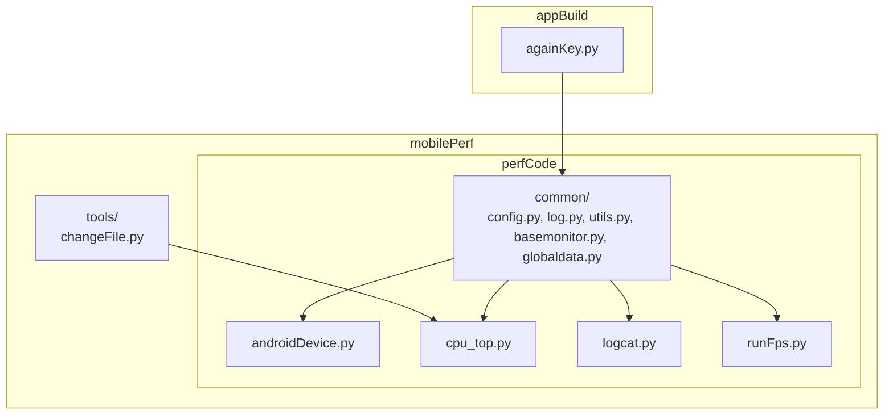
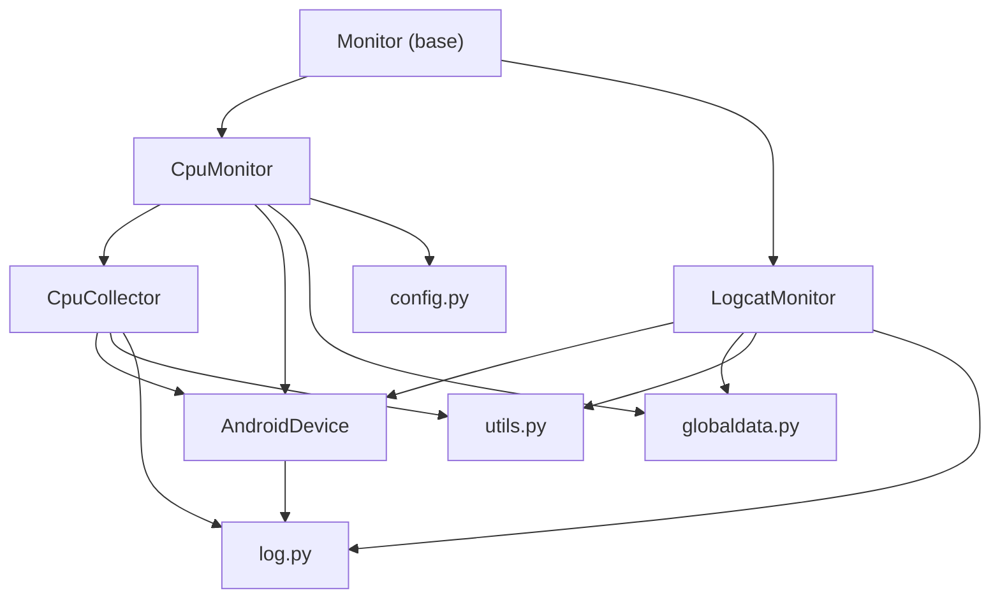
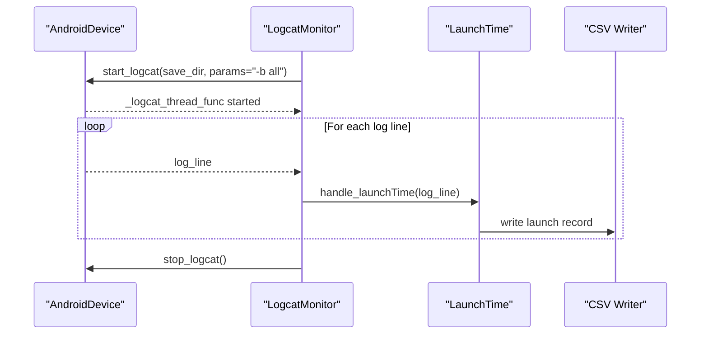
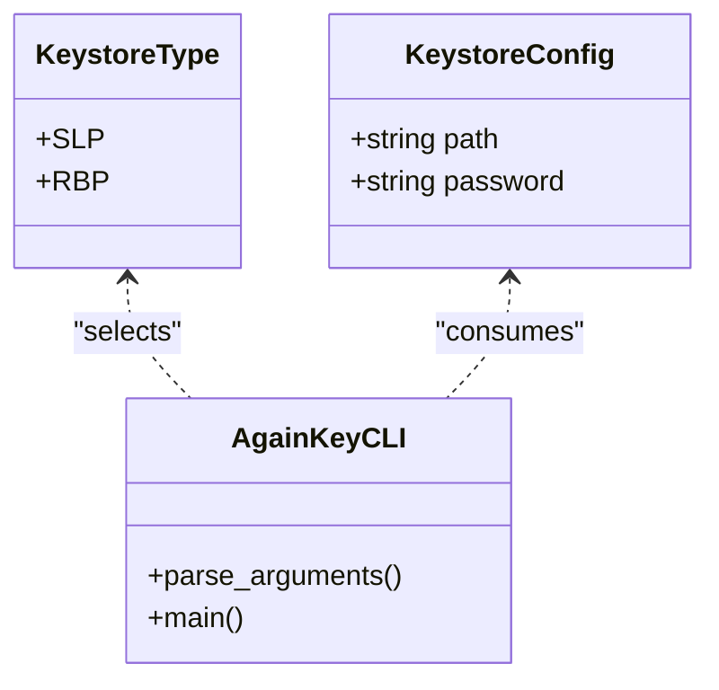
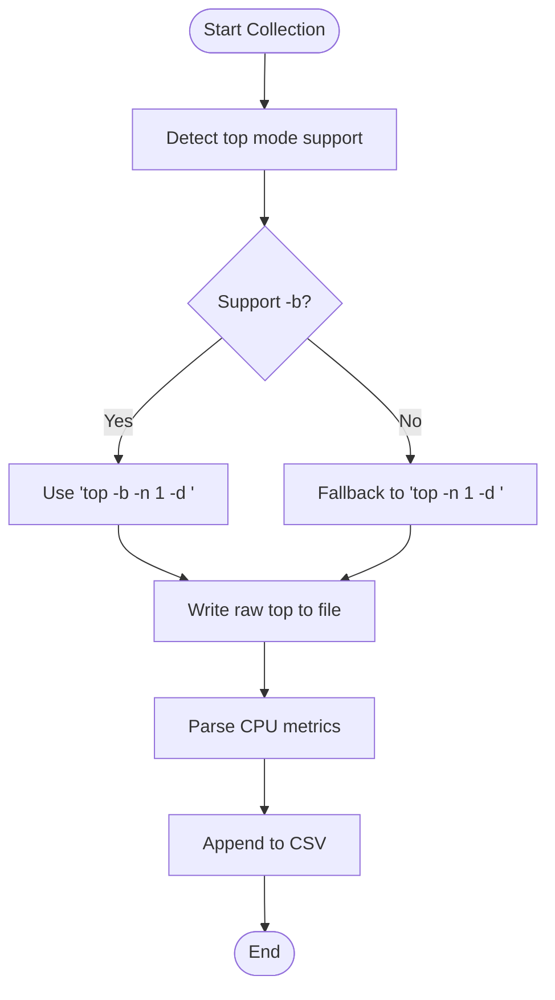
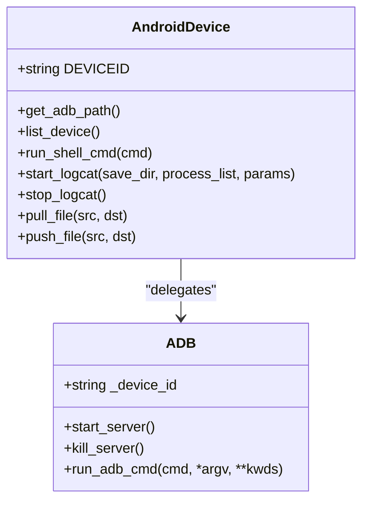
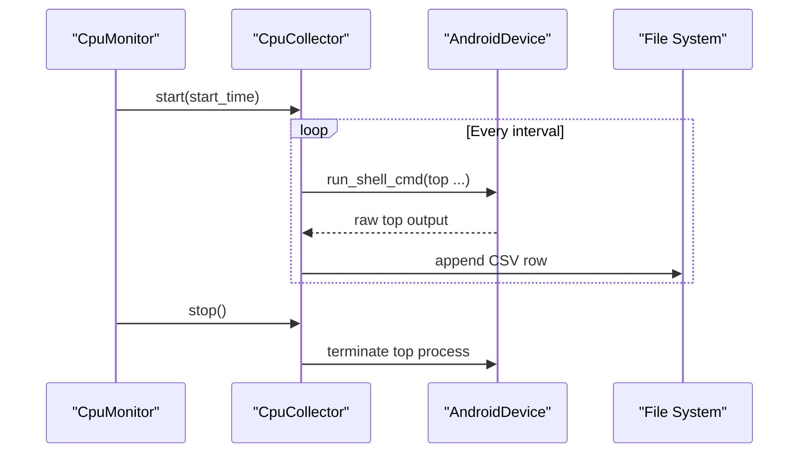
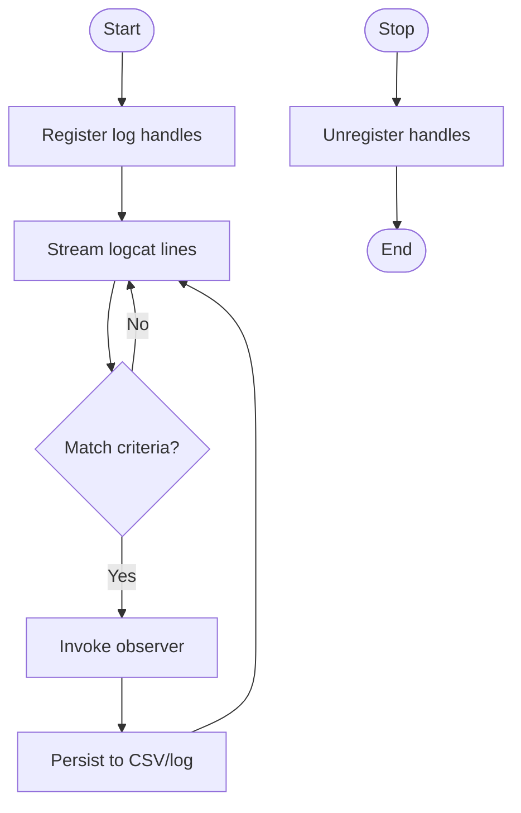
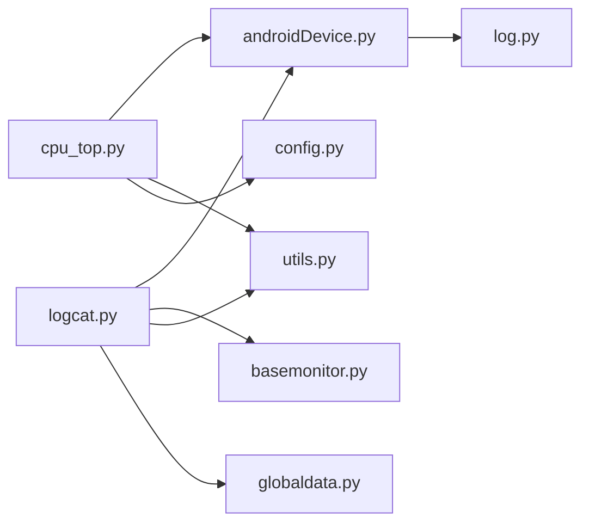
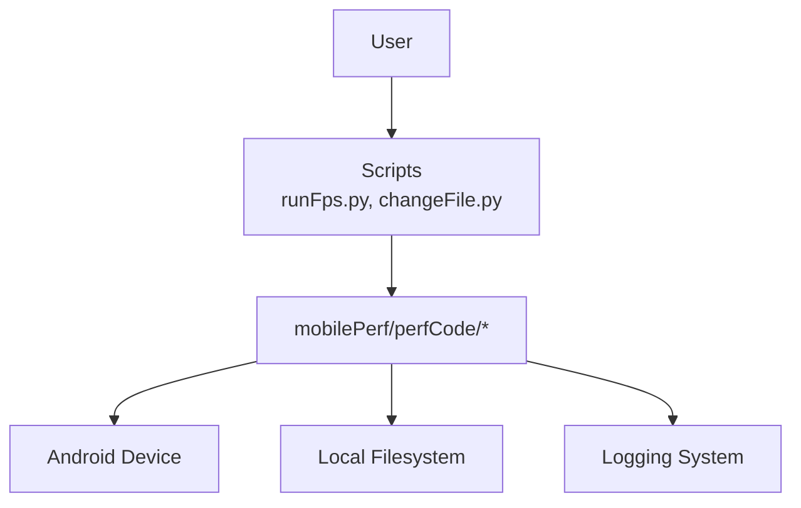

# Internal Architecture

<cite>
**Referenced Files in This Document**
- [README.md](file://README.md)
- [basemonitor.py](file://mobilePerf/perfCode/common/basemonitor.py)
- [config.py](file://mobilePerf/perfCode/common/config.py)
- [log.py](file://mobilePerf/perfCode/common/log.py)
- [utils.py](file://mobilePerf/perfCode/common/utils.py)
- [globaldata.py](file://mobilePerf/perfCode/globaldata.py)
- [androidDevice.py](file://mobilePerf/perfCode/androidDevice.py)
- [cpu_top.py](file://mobilePerf/perfCode/cpu_top.py)
- [logcat.py](file://mobilePerf/perfCode/logcat.py)
- [runFps.py](file://mobilePerf/perfCode/runFps.py)
- [changeFile.py](file://mobilePerf/tools/changeFile.py)
- [againKey.py](file://appBuild/againBuild/againKey.py)
</cite>

## Table of Contents
1. [Introduction](#introduction)
2. [Project Structure](#project-structure)
3. [Core Components](#core-components)
4. [Architecture Overview](#architecture-overview)
5. [Detailed Component Analysis](#detailed-component-analysis)
6. [Dependency Analysis](#dependency-analysis)
7. [Performance Considerations](#performance-considerations)
8. [Troubleshooting Guide](#troubleshooting-guide)
9. [Conclusion](#conclusion)
10. [Appendices](#appendices)

## Introduction
This document describes the internal architecture of the performance measurement and automation toolkit. It focuses on high-level design patterns, system boundaries, component interactions, data flows, and cross-cutting concerns such as logging, configuration, and error handling. It also documents the Observer pattern in performance monitoring, Factory-like usage in keystore management, and Strategy-like selection patterns for performance collection.

The system is organized around:
- A common foundation for configuration, logging, utilities, and runtime data
- Device abstraction via an Android device controller
- Performance collectors implementing a common monitor interface
- Tools for data ingestion and build/signing automation

## Project Structure
The repository is organized by functional areas:
- mobilePerf/perfCode: Core performance measurement and device control
- mobilePerf/tools: Data ingestion and post-processing utilities
- appBuild: Build and signing automation scripts
- ciBuild: CI upload helpers
- overseaBuild: Overseas distribution helpers

**Diagram sources**
- [androidDevice.py:18-116](file://mobilePerf/perfCode/androidDevice.py#L18-L116)
- [cpu_top.py:206-383](file://mobilePerf/perfCode/cpu_top.py#L206-L383)
- [logcat.py:17-116](file://mobilePerf/perfCode/logcat.py#L17-L116)
- [runFps.py:1-94](file://mobilePerf/perfCode/runFps.py#L1-L94)
- [changeFile.py:1-112](file://mobilePerf/tools/changeFile.py#L1-L112)
- [againKey.py:1-167](file://appBuild/againBuild/againKey.py#L1-L167)

**Section sources**
- [README.md:1-37](file://README.md#L1-L37)

## Core Components
- Monitor base class: Defines the contract for performance monitors (start, stop, save, clear).
- AndroidDevice: Abstraction over ADB commands, device lifecycle, and logcat streaming.
- CpuCollector/CpuMonitor: Collects CPU metrics via top and writes CSV records.
- LogcatMonitor: Subscribes to real-time logcat lines and parses specific events (e.g., launch times).
- Utilities: Time and file utilities, plus global runtime data holder.
- Logging: Centralized logging with rotating file handlers.
- Configuration: Global defaults for package, device, intervals, and paths.
- Data ingestion tools: Pull and organize external performance data into structured CSVs.
- Keystore management: Signing tool with configurable keystores and SDK path.

**Section sources**
- [basemonitor.py:7-33](file://mobilePerf/perfCode/common/basemonitor.py#L7-L33)
- [androidDevice.py:18-116](file://mobilePerf/perfCode/androidDevice.py#L18-L116)
- [cpu_top.py:206-383](file://mobilePerf/perfCode/cpu_top.py#L206-L383)
- [logcat.py:17-116](file://mobilePerf/perfCode/logcat.py#L17-L116)
- [utils.py:10-156](file://mobilePerf/perfCode/common/utils.py#L10-L156)
- [globaldata.py:6-14](file://mobilePerf/perfCode/globaldata.py#L6-L14)
- [log.py:22-76](file://mobilePerf/perfCode/common/log.py#L22-L76)
- [config.py:3-20](file://mobilePerf/perfCode/common/config.py#L3-L20)
- [changeFile.py:22-107](file://mobilePerf/tools/changeFile.py#L22-L107)
- [againKey.py:16-167](file://appBuild/againBuild/againKey.py#L16-L167)

## Architecture Overview
The system follows a layered architecture:
- Presentation/Orchestration: Scripts and tools invoke monitors and collectors
- Domain Services: Monitors and collectors encapsulate performance logic
- Device Abstraction: AndroidDevice wraps ADB and shell operations
- Cross-Cutting: Logging, configuration, and utilities

**Diagram sources**
- [basemonitor.py:7-33](file://mobilePerf/perfCode/common/basemonitor.py#L7-L33)
- [cpu_top.py:206-383](file://mobilePerf/perfCode/cpu_top.py#L206-L383)
- [logcat.py:17-116](file://mobilePerf/perfCode/logcat.py#L17-L116)
- [androidDevice.py:18-116](file://mobilePerf/perfCode/androidDevice.py#L18-L116)
- [config.py:3-20](file://mobilePerf/perfCode/common/config.py#L3-L20)
- [log.py:22-76](file://mobilePerf/perfCode/common/log.py#L22-L76)
- [utils.py:10-156](file://mobilePerf/perfCode/common/utils.py#L10-L156)
- [globaldata.py:6-14](file://mobilePerf/perfCode/globaldata.py#L6-L14)

## Detailed Component Analysis

### Observer Pattern in Performance Monitoring
The LogcatMonitor demonstrates the Observer pattern:
- Publisher: AndroidDevice’s logcat streaming thread emits lines
- Observers: Registered handlers (e.g., launch time parsing) receive each line
- Registration: Handlers are added/removed dynamically during monitor lifecycle

**Diagram sources**
- [logcat.py:32-116](file://mobilePerf/perfCode/logcat.py#L32-L116)
- [androidDevice.py:389-422](file://mobilePerf/perfCode/androidDevice.py#L389-L422)

**Section sources**
- [logcat.py:17-116](file://mobilePerf/perfCode/logcat.py#L17-L116)
- [androidDevice.py:318-422](file://mobilePerf/perfCode/androidDevice.py#L318-L422)

### Factory Pattern in Keystore Management
The signing tool uses a configuration-driven approach akin to a factory:
- Enumeration defines supported keystore types
- Dictionary maps types to configuration objects
- CLI selects keystore type and applies configuration

**Diagram sources**
- [againKey.py:16-167](file://appBuild/againBuild/againKey.py#L16-L167)

**Section sources**
- [againKey.py:16-167](file://appBuild/againBuild/againKey.py#L16-L167)

### Strategy Pattern Applications
- CPU collection strategy: CpuCollector adapts to device capabilities (e.g., choosing between -b and non -b top modes)
- Data ingestion strategy: changeFile.py organizes external CSVs into domain-specific folders (FPS/MEM/CPU/TEMP)

**Diagram sources**
- [cpu_top.py:224-232](file://mobilePerf/perfCode/cpu_top.py#L224-L232)

**Section sources**
- [cpu_top.py:206-383](file://mobilePerf/perfCode/cpu_top.py#L206-L383)
- [changeFile.py:70-107](file://mobilePerf/tools/changeFile.py#L70-L107)

### Component Breakdown

#### Monitor Base
- Purpose: Defines the monitor lifecycle and shared state
- Responsibilities: start, stop, save, clear; holds matched data and config

**Section sources**
- [basemonitor.py:7-33](file://mobilePerf/perfCode/common/basemonitor.py#L7-L33)

#### AndroidDevice
- Purpose: Encapsulates ADB operations, device state, and logcat streaming
- Responsibilities: device discovery, shell commands, logcat lifecycle, file operations

**Diagram sources**
- [androidDevice.py:18-116](file://mobilePerf/perfCode/androidDevice.py#L18-L116)

**Section sources**
- [androidDevice.py:18-116](file://mobilePerf/perfCode/androidDevice.py#L18-L116)

#### CpuMonitor and CpuCollector
- Purpose: Periodically collect CPU metrics and persist to CSV
- Responsibilities: thread orchestration, top invocation, CSV writing, interval control

**Diagram sources**
- [cpu_top.py:240-347](file://mobilePerf/perfCode/cpu_top.py#L240-L347)
- [androidDevice.py:276-293](file://mobilePerf/perfCode/androidDevice.py#L276-L293)

**Section sources**
- [cpu_top.py:206-383](file://mobilePerf/perfCode/cpu_top.py#L206-L383)

#### LogcatMonitor
- Purpose: Subscribe to logcat streams and extract structured events
- Responsibilities: register observers, parse launch times, write CSV, manage lifecycle

**Diagram sources**
- [logcat.py:32-116](file://mobilePerf/perfCode/logcat.py#L32-L116)

**Section sources**
- [logcat.py:17-216](file://mobilePerf/perfCode/logcat.py#L17-L216)

#### Data Ingestion Tool (changeFile.py)
- Purpose: Pull external performance data from device and organize into domain folders
- Responsibilities: discover latest dataset, pull files, rename, move to domain-specific folders

**Section sources**
- [changeFile.py:22-107](file://mobilePerf/tools/changeFile.py#L22-L107)

#### Keystore Management (againKey.py)
- Purpose: Sign APKs using predefined keystore configurations
- Responsibilities: validate inputs, select keystore, sign, verify

**Section sources**
- [againKey.py:16-167](file://appBuild/againBuild/againKey.py#L16-L167)

## Dependency Analysis
- Low coupling: Monitors depend on AndroidDevice and common utilities; AndroidDevice depends on logging and utilities
- Cohesion: Each module encapsulates a single concern (monitoring, device control, logging, utilities)
- External dependencies: Python standard library; ADB and external tools invoked at runtime

**Diagram sources**
- [cpu_top.py:8-12](file://mobilePerf/perfCode/cpu_top.py#L8-L12)
- [logcat.py:9-14](file://mobilePerf/perfCode/logcat.py#L9-L14)
- [androidDevice.py:12-15](file://mobilePerf/perfCode/androidDevice.py#L12-L15)
- [log.py:22-76](file://mobilePerf/perfCode/common/log.py#L22-L76)
- [utils.py:10-156](file://mobilePerf/perfCode/common/utils.py#L10-L156)
- [config.py:3-20](file://mobilePerf/perfCode/common/config.py#L3-L20)
- [globaldata.py:6-14](file://mobilePerf/perfCode/globaldata.py#L6-L14)

**Section sources**
- [cpu_top.py:8-12](file://mobilePerf/perfCode/cpu_top.py#L8-L12)
- [logcat.py:9-14](file://mobilePerf/perfCode/logcat.py#L9-L14)
- [androidDevice.py:12-15](file://mobilePerf/perfCode/androidDevice.py#L12-L15)

## Performance Considerations
- Sampling intervals: Configurable via configuration and per-monitor parameters
- I/O overhead: CSV writes occur periodically; consider batching or asynchronous writes for high-frequency metrics
- ADB reliability: Retries and timeouts are built-in; ensure adequate backoff and circuit breaker behavior
- Memory footprint: Logcat streaming buffers can grow; periodic flush and file rotation mitigate risk
- Device variability: Different Android versions require different parsing strategies; robust fallbacks are present

[No sources needed since this section provides general guidance]

## Troubleshooting Guide
- ADB connectivity issues: The device controller detects daemon errors and attempts recovery (kill/start server); inspect logs for port conflicts
- Missing device or offline device: Graceful handling with retries and user guidance
- Logcat parsing failures: Malformed lines are handled with defensive checks and error logging
- CSV write failures: IO exceptions are caught and logged; verify disk space and permissions

**Section sources**
- [androidDevice.py:112-150](file://mobilePerf/perfCode/androidDevice.py#L112-L150)
- [androidDevice.py:240-262](file://mobilePerf/perfCode/androidDevice.py#L240-L262)
- [logcat.py:92-116](file://mobilePerf/perfCode/logcat.py#L92-L116)

## Conclusion
The system employs clear separation of concerns with a monitor abstraction, a robust device controller, and practical utilities for logging and configuration. The Observer pattern enables flexible event handling, while Factory-like and Strategy-like patterns support extensibility and adaptability across environments and data sources. Cross-cutting concerns are centralized, ensuring maintainability and consistent behavior.

[No sources needed since this section summarizes without analyzing specific files]

## Appendices

### Technology Stack and Dependencies
- Python standard libraries: subprocess, threading, logging, os, time, csv, re, pathlib, argparse
- External tooling: ADB for Android device control; optional external performance tools for data acquisition
- No explicit third-party Python packages are imported in the analyzed modules

**Section sources**
- [androidDevice.py:1-16](file://mobilePerf/perfCode/androidDevice.py#L1-L16)
- [cpu_top.py:1-13](file://mobilePerf/perfCode/cpu_top.py#L1-L13)
- [logcat.py:1-15](file://mobilePerf/perfCode/logcat.py#L1-L15)
- [againKey.py:1-14](file://appBuild/againBuild/againKey.py#L1-L14)

### System Context Diagram

[No sources needed since this diagram shows conceptual workflow, not actual code structure]