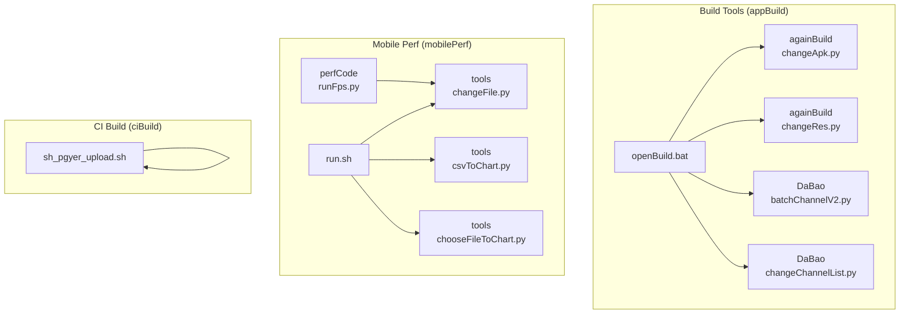
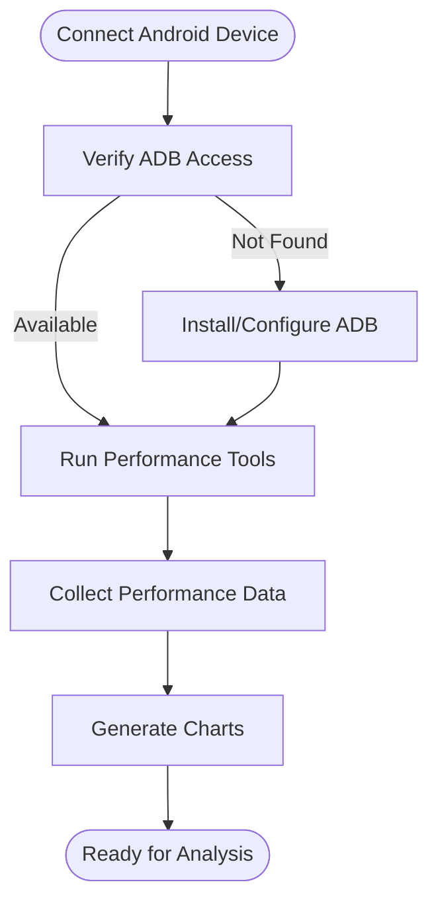
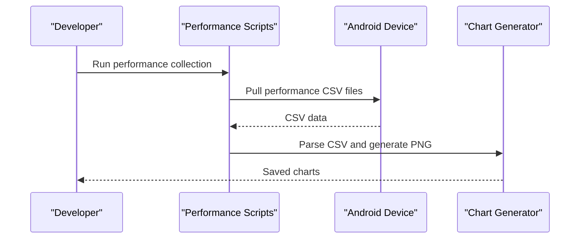
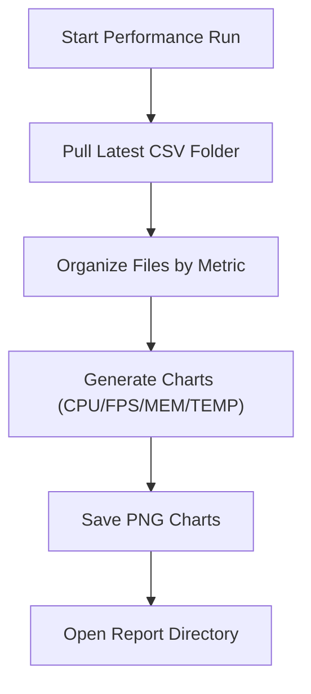

# Getting Started Guide

<cite>
**Referenced Files in This Document**
- [README.md](file://README.md)
- [openBuild.bat](file://appBuild/openBuild.bat)
- [batchChannelV2.py](file://appBuild/DaBao/batchChannelV2.py)
- [changeChannelList.py](file://appBuild/DaBao/changeChannelList.py)
- [changeApk.py](file://appBuild/againBuild/changeApk.py)
- [changeRes.py](file://appBuild/againBuild/changeRes.py)
- [run.sh](file://mobilePerf/run.sh)
- [changeFile.py](file://mobilePerf/tools/changeFile.py)
- [csvToChart.py](file://mobilePerf/tools/csvToChart.py)
- [chooseFileToChart.py](file://mobilePerf/tools/chooseFileToChart.py)
- [runFps.py](file://mobilePerf/perfCode/runFps.py)
- [sh_pgyer_upload.sh](file://ciBuild/sh_pgyer_upload.sh)
</cite>

## Table of Contents
1. [Introduction](#introduction)
2. [Project Structure](#project-structure)
3. [System Requirements](#system-requirements)
4. [Installation Instructions](#installation-instructions)
5. [Initial Setup Procedures](#initial-setup-procedures)
6. [Basic Workflow](#basic-workflow)
7. [Step-by-Step Tutorials](#step-by-step-tutorials)
8. [Quick Start Examples](#quick-start-examples)
9. [Prerequisite Knowledge](#prerequisite-knowledge)
10. [Troubleshooting Guide](#troubleshooting-guide)
11. [Conclusion](#conclusion)

## Introduction
This guide helps you quickly set up and use the performance testing and build automation tools included in the repository. It covers installing prerequisites, connecting devices, collecting performance metrics, generating charts, building channel packages, and uploading builds to distribution platforms. The content is structured for beginners while providing efficient workflows for experienced developers.

## Project Structure
The repository is organized into three main areas:
- appBuild: Build and packaging utilities for Android APKs, including re-signing, resource replacement, and channel package generation.
- mobilePerf: Performance data collection and visualization tools for Android devices.
- ciBuild: CI/CD helpers for automated uploads to distribution platforms.

**Diagram sources**
- [openBuild.bat:1-23](file://appBuild/openBuild.bat#L1-L23)
- [batchChannelV2.py:1-120](file://appBuild/DaBao/batchChannelV2.py#L1-L120)
- [changeChannelList.py:1-91](file://appBuild/DaBao/changeChannelList.py#L1-L91)
- [changeApk.py:1-39](file://appBuild/againBuild/changeApk.py#L1-L39)
- [changeRes.py:1-72](file://appBuild/againBuild/changeRes.py#L1-L72)
- [run.sh:1-29](file://mobilePerf/run.sh#L1-L29)
- [changeFile.py:1-112](file://mobilePerf/tools/changeFile.py#L1-L112)
- [csvToChart.py:1-151](file://mobilePerf/tools/csvToChart.py#L1-L151)
- [chooseFileToChart.py:1-145](file://mobilePerf/tools/chooseFileToChart.py#L1-L145)
- [runFps.py:1-94](file://mobilePerf/perfCode/runFps.py#L1-L94)
- [sh_pgyer_upload.sh:1-103](file://ciBuild/sh_pgyer_upload.sh#L1-L103)

**Section sources**
- [README.md:1-37](file://README.md#L1-L37)
- [openBuild.bat:1-23](file://appBuild/openBuild.bat#L1-L23)

## System Requirements
- Operating systems:
  - Windows: Tested with Windows batch scripts and Python 3.x.
  - macOS/Linux: Shell scripts and Python 3.x for performance tools.
- Android device:
  - USB debugging enabled.
  - ADB installed and accessible in PATH, or the bundled ADB will be used automatically.
- Python 3.x with required packages:
  - matplotlib (for chart generation).
  - Standard libraries used: subprocess, os, sys, re, csv, pathlib, datetime.
- Android build tools:
  - Java runtime for running apktool and walle CLI.
  - Apktool and Walle CLI JARs available in the respective directories.

**Section sources**
- [README.md:24-30](file://README.md#L24-L30)
- [csvToChart.py:1-20](file://mobilePerf/tools/csvToChart.py#L1-L20)
- [batchChannelV2.py:1-25](file://appBuild/DaBao/batchChannelV2.py#L1-L25)
- [changeApk.py:1-10](file://appBuild/againBuild/changeApk.py#L1-L10)

## Installation Instructions
- Install Python 3.x and ensure pip is available.
- Install required Python packages:
  - matplotlib for chart generation.
- Verify ADB availability:
  - Either install Android SDK Platform Tools and ensure adb is in PATH, or rely on the bundled ADB shipped with the project.
- Prepare build tools:
  - Place apktool JAR and walle-cli-all JAR in the appropriate directories for the scripts to use them.
- Clone or download this repository and navigate to the root directory.

**Section sources**
- [README.md:24-30](file://README.md#L24-L30)
- [csvToChart.py:1-20](file://mobilePerf/tools/csvToChart.py#L1-L20)
- [batchChannelV2.py:1-25](file://appBuild/DaBao/batchChannelV2.py#L1-L25)
- [changeApk.py:1-10](file://appBuild/againBuild/changeApk.py#L1-L10)

## Initial Setup Procedures
- Connect your Android device via USB and enable Developer Options and USB Debugging.
- On Windows, launch the build tool launcher to see available options:
  - Run the batch launcher script to reveal menu entries for re-signing, decompiling/packaging, and channel package generation.
- On macOS/Linux, use the performance run script to orchestrate data collection and chart generation.

**Diagram sources**
- [openBuild.bat:1-23](file://appBuild/openBuild.bat#L1-L23)
- [run.sh:1-29](file://mobilePerf/run.sh#L1-L29)

**Section sources**
- [openBuild.bat:1-23](file://appBuild/openBuild.bat#L1-L23)
- [run.sh:1-29](file://mobilePerf/run.sh#L1-L29)

## Basic Workflow
- Performance data collection:
  - Use the performance run script to pull data from the device and generate charts for CPU, FPS, MEM, and TEMP.
- Build automation:
  - Use the build tool launcher to select tasks such as re-signing, decompiling/packaging, and channel package generation.
- CI upload:
  - Use the CI upload script to upload artifacts to a distribution platform.

**Diagram sources**
- [run.sh:1-29](file://mobilePerf/run.sh#L1-L29)
- [changeFile.py:1-112](file://mobilePerf/tools/changeFile.py#L1-L112)
- [csvToChart.py:1-151](file://mobilePerf/tools/csvToChart.py#L1-L151)

**Section sources**
- [README.md:24-30](file://README.md#L24-L30)
- [run.sh:1-29](file://mobilePerf/run.sh#L1-L29)

## Step-by-Step Tutorials

### Tutorial 1: APK Re-Signing
- Purpose: Replace the signing key of an APK for redistribution or internal testing.
- Steps:
  1. Open the build tool launcher on Windows to access the re-signing option.
  2. Provide the path to the target APK when prompted.
  3. Confirm the operation and verify the re-signed APK is generated.

**Section sources**
- [openBuild.bat:8-11](file://appBuild/openBuild.bat#L8-L11)
- [README.md:4-7](file://README.md#L4-L7)

### Tutorial 2: Channel Package Generation (Single and Batch)
- Purpose: Generate signed channel-specific APKs for distribution.
- Steps:
  1. Choose the channel tool from the launcher.
  2. For single channel:
     - Provide the base APK path and the desired channel name.
  3. For batch channels:
     - Provide a comma-separated list of channel names or a numeric range with a prefix.
  4. Optionally use a configuration file to define multiple channel sets.
  5. Review the generated APKs and rename them as needed.

**Section sources**
- [openBuild.bat:13-16](file://appBuild/openBuild.bat#L13-L16)
- [batchChannelV2.py:1-120](file://appBuild/DaBao/batchChannelV2.py#L1-L120)
- [changeChannelList.py:1-91](file://appBuild/DaBao/changeChannelList.py#L1-L91)

### Tutorial 3: Performance Data Collection and Chart Generation
- Purpose: Collect CPU, FPS, MEM, and temperature metrics and visualize them as charts.
- Steps:
  1. Ensure your device is connected and ADB is accessible.
  2. Run the performance run script to:
     - Pull the latest performance CSV files from the device.
     - Organize CSV files into the report directories.
     - Generate PNG charts for CPU, FPS, MEM, and TEMP.
  3. View the saved charts in the report directory.

**Diagram sources**
- [run.sh:1-29](file://mobilePerf/run.sh#L1-L29)
- [changeFile.py:1-112](file://mobilePerf/tools/changeFile.py#L1-L112)
- [csvToChart.py:1-151](file://mobilePerf/tools/csvToChart.py#L1-L151)

**Section sources**
- [README.md:24-30](file://README.md#L24-L30)
- [run.sh:1-29](file://mobilePerf/run.sh#L1-L29)
- [changeFile.py:1-112](file://mobilePerf/tools/changeFile.py#L1-L112)
- [csvToChart.py:1-151](file://mobilePerf/tools/csvToChart.py#L1-L151)

### Tutorial 4: APK Resource Replacement
- Purpose: Replace app icons, splash screens, and other resources inside the APK.
- Steps:
  1. Prepare a resource directory containing the required image assets.
  2. Run the resource replacement script with the path to the APK and the resource directory.
  3. Verify that the assets were copied to the correct locations inside the APK.

**Section sources**
- [changeRes.py:1-72](file://appBuild/againBuild/changeRes.py#L1-L72)

### Tutorial 5: APK Decompile and Rebuild
- Purpose: Extract resources/classes and rebuild an APK for quick iteration.
- Steps:
  1. Run the decompile/rebuild script with the target APK path.
  2. Choose whether to decompile or rebuild.
  3. For rebuild, specify the output path and confirm the process completes.

**Section sources**
- [changeApk.py:1-39](file://appBuild/againBuild/changeApk.py#L1-L39)

### Tutorial 6: Upload Build to Distribution Platform
- Purpose: Upload APK/IPA artifacts to a distribution service via API.
- Steps:
  1. Provide the artifact path as a command-line argument to the upload script.
  2. The script obtains upload credentials, uploads the file, and checks the result.

**Section sources**
- [sh_pgyer_upload.sh:1-103](file://ciBuild/sh_pgyer_upload.sh#L1-L103)

## Quick Start Examples
- Collect performance metrics and generate charts:
  - Run the performance run script to pull the latest CSV files and produce charts.
  - Reference: [run.sh:1-29](file://mobilePerf/run.sh#L1-L29), [changeFile.py:1-112](file://mobilePerf/tools/changeFile.py#L1-L112), [csvToChart.py:1-151](file://mobilePerf/tools/csvToChart.py#L1-L151)
- Generate channel packages:
  - Use the channel tool to create single or batch channel APKs.
  - Reference: [batchChannelV2.py:1-120](file://appBuild/DaBao/batchChannelV2.py#L1-L120), [changeChannelList.py:1-91](file://appBuild/DaBao/changeChannelList.py#L1-L91)
- Re-sign an APK:
  - Launch the build tool launcher and select the re-signing option.
  - Reference: [openBuild.bat:8-11](file://appBuild/openBuild.bat#L8-L11)
- Replace app resources:
  - Run the resource replacement script with the APK and resource directory.
  - Reference: [changeRes.py:1-72](file://appBuild/againBuild/changeRes.py#L1-L72)
- Upload to distribution:
  - Execute the upload script with the artifact path.
  - Reference: [sh_pgyer_upload.sh:1-103](file://ciBuild/sh_pgyer_upload.sh#L1-L103)

**Section sources**
- [README.md:24-30](file://README.md#L24-L30)
- [run.sh:1-29](file://mobilePerf/run.sh#L1-L29)
- [batchChannelV2.py:1-120](file://appBuild/DaBao/batchChannelV2.py#L1-L120)
- [changeChannelList.py:1-91](file://appBuild/DaBao/changeChannelList.py#L1-L91)
- [openBuild.bat:8-11](file://appBuild/openBuild.bat#L8-L11)
- [changeRes.py:1-72](file://appBuild/againBuild/changeRes.py#L1-L72)
- [sh_pgyer_upload.sh:1-103](file://ciBuild/sh_pgyer_upload.sh#L1-L103)

## Prerequisite Knowledge
- Basic understanding of Android development and ADB usage.
- Familiarity with Python 3.x and command-line tools.
- Understanding of APK structure and signing concepts for re-signing tasks.
- Knowledge of channel packaging workflows for distribution.

**Section sources**
- [README.md:24-30](file://README.md#L24-L30)

## Troubleshooting Guide
- ADB not found or device not detected:
  - Ensure ADB is installed and accessible in PATH, or rely on the bundled ADB.
  - If port conflicts occur, the scripts include logic to recover ADB connectivity.
- Performance data pull fails:
  - Verify the device is connected and the SoloPi directory exists.
  - Confirm the CSV files are present and readable.
- Chart generation errors:
  - Ensure matplotlib is installed.
  - Validate that CSV files contain expected columns and numeric values.
- Channel packaging failures:
  - Confirm the presence of required JAR files and correct channel arguments.
- Upload failures:
  - Check the artifact path and supported file extensions.
  - Review upload credentials and network connectivity.

**Section sources**
- [README.md:24-30](file://README.md#L24-L30)
- [run.sh:1-29](file://mobilePerf/run.sh#L1-L29)
- [changeFile.py:1-112](file://mobilePerf/tools/changeFile.py#L1-L112)
- [csvToChart.py:1-151](file://mobilePerf/tools/csvToChart.py#L1-L151)
- [batchChannelV2.py:1-120](file://appBuild/DaBao/batchChannelV2.py#L1-L120)
- [sh_pgyer_upload.sh:1-103](file://ciBuild/sh_pgyer_upload.sh#L1-L103)

## Conclusion
With this guide, you can set up the environment, connect your device, collect performance metrics, generate charts, build channel packages, and upload artifacts. Use the provided scripts and workflows to streamline your development and QA processes. For advanced customization, adjust script parameters and paths according to your project needs.