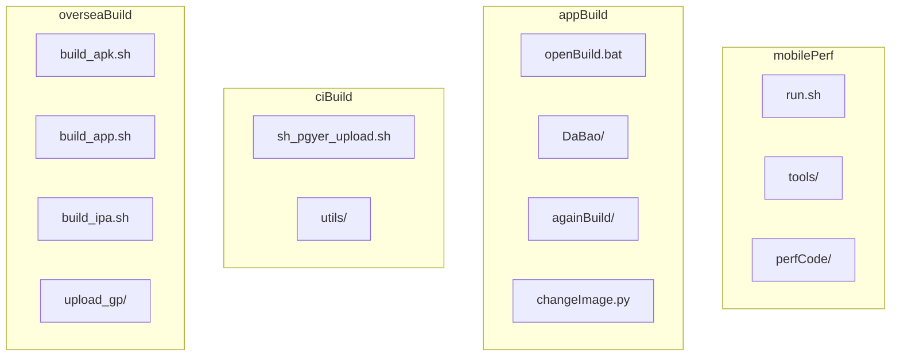
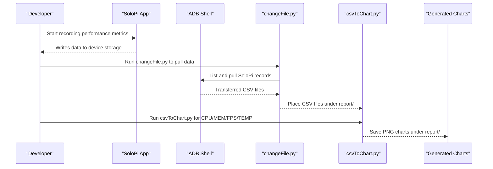
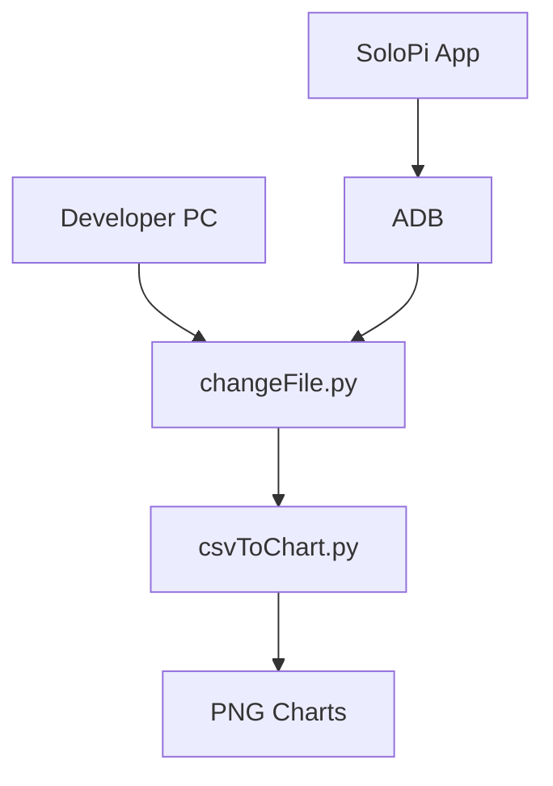
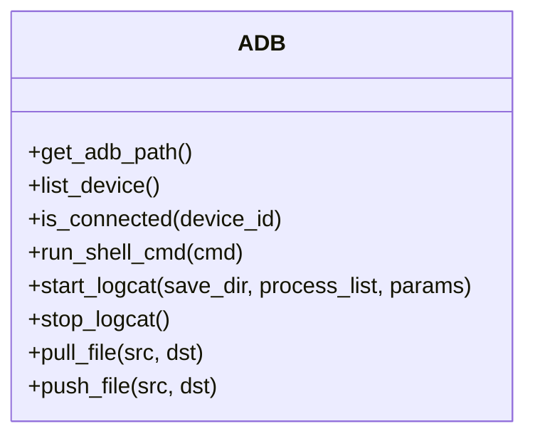
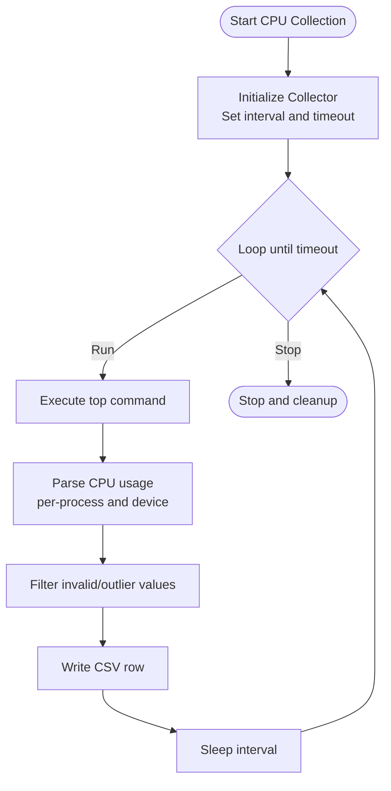
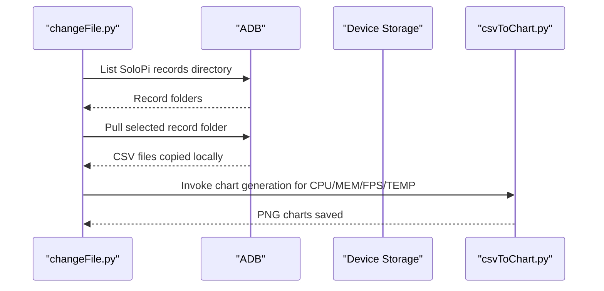
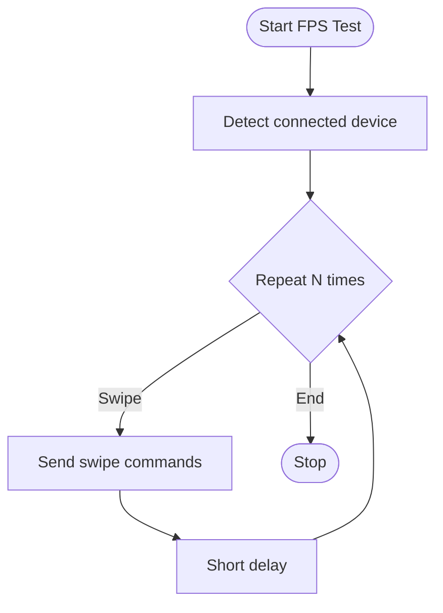
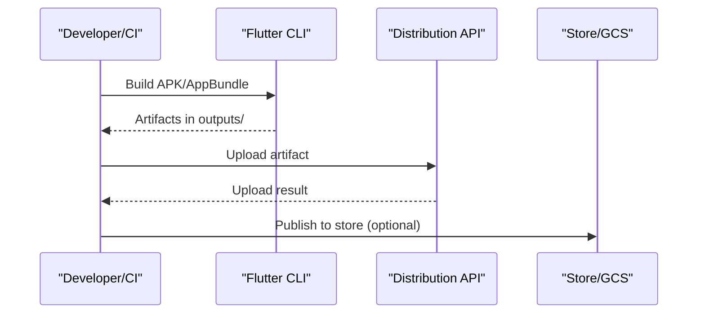
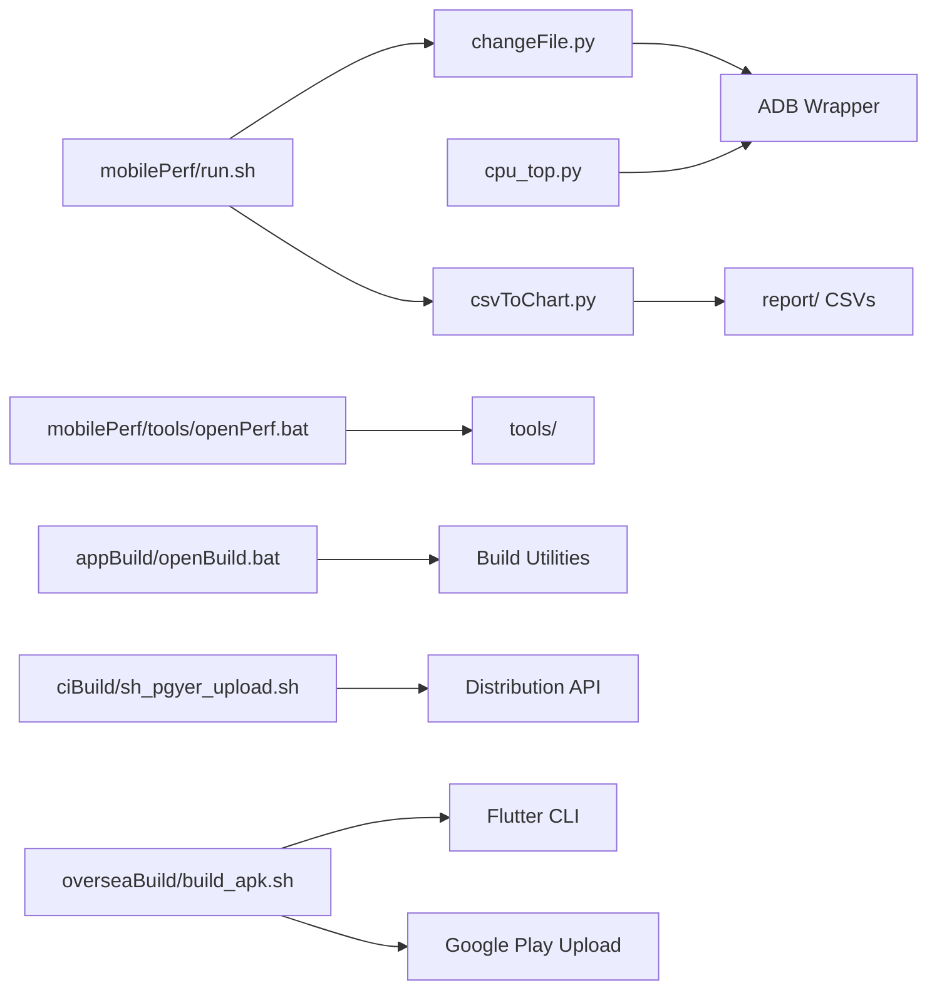

# Getting Started

<cite>
**Referenced Files in This Document**
- [README.md](file://README.md)
- [mobilePerf/run.sh](file://mobilePerf/run.sh)
- [mobilePerf/tools/openPerf.bat](file://mobilePerf/tools/openPerf.bat)
- [mobilePerf/tools/run.sh](file://mobilePerf/tools/run.sh)
- [appBuild/openBuild.bat](file://appBuild/openBuild.bat)
- [mobilePerf/perfCode/common/config.py](file://mobilePerf/perfCode/common/config.py)
- [mobilePerf/perfCode/androidDevice.py](file://mobilePerf/perfCode/androidDevice.py)
- [mobilePerf/perfCode/cpu_top.py](file://mobilePerf/perfCode/cpu_top.py)
- [mobilePerf/perfCode/runFps.py](file://mobilePerf/perfCode/runFps.py)
- [mobilePerf/tools/changeFile.py](file://mobilePerf/tools/changeFile.py)
- [mobilePerf/tools/csvToChart.py](file://mobilePerf/tools/csvToChart.py)
- [ciBuild/sh_pgyer_upload.sh](file://ciBuild/sh_pgyer_upload.sh)
- [overseaBuild/build_apk.sh](file://overseaBuild/build_apk.sh)
</cite>

## Table of Contents
1. [Introduction](#introduction)
2. [Project Structure](#project-structure)
3. [Prerequisites](#prerequisites)
4. [Installation and Setup](#installation-and-setup)
5. [Basic Workflow](#basic-workflow)
6. [Quick Start Examples](#quick-start-examples)
7. [Architecture Overview](#architecture-overview)
8. [Detailed Component Analysis](#detailed-component-analysis)
9. [Dependency Analysis](#dependency-analysis)
10. [Performance Considerations](#performance-considerations)
11. [Troubleshooting Guide](#troubleshooting-guide)
12. [Conclusion](#conclusion)

## Introduction
This guide helps you set up and run the QA Performance Code project for Android performance testing. It covers prerequisites, installation, configuration, and workflows for collecting performance metrics (CPU, memory, FPS, temperature), generating charts, and integrating with CI/CD systems. The project relies on SoloPi for data collection, ADB for device communication, and Python scripts for data processing and chart generation.

## Project Structure
The repository is organized into modules:
- mobilePerf: Performance data collection, processing, and chart generation
- appBuild: Build and packaging utilities for Android and related tasks
- ciBuild: CI/CD helpers for uploading artifacts
- overseaBuild: Overseas build scripts for Android and Google Play integration

**Diagram sources**
- [mobilePerf/run.sh](file://mobilePerf/run.sh)
- [appBuild/openBuild.bat](file://appBuild/openBuild.bat)
- [ciBuild/sh_pgyer_upload.sh](file://ciBuild/sh_pgyer_upload.sh)
- [overseaBuild/build_apk.sh](file://overseaBuild/build_apk.sh)

**Section sources**
- [README.md](file://README.md)

## Prerequisites
Before starting, ensure the following tools and frameworks are installed and configured:

- Android SDK and ADB
  - Install Android Studio or Android SDK Platform Tools to get ADB.
  - Verify ADB availability via the terminal or command prompt.
  - Enable Developer Options and USB Debugging on the test device.
  - Connect the device via USB and trust the computer if prompted.

- SoloPi framework
  - Download and install the latest SoloPi release.
  - SoloPi writes performance data to a specific path on the device for later retrieval.

- Python environment
  - Install Python 3.x.
  - Install required Python packages used by the scripts:
    - matplotlib
    - numpy
    - pandas (if used indirectly by plotting libraries)
  - Ensure Python and pip are added to PATH.

- Flutter SDK (for Android builds)
  - Install Flutter SDK and configure your environment.
  - Ensure the Android toolchain is set up for building APKs.

- Optional: Google Play uploader dependencies (for overseas builds)
  - Python dependencies for Google Play API uploads (see overseaBuild scripts).

Verification steps:
- Open a terminal/command prompt and run:
  - adb devices
  - python --version
  - flutter doctor
  - soloPi app is installed and running on the device

**Section sources**
- [README.md](file://README.md)
- [mobilePerf/perfCode/androidDevice.py](file://mobilePerf/perfCode/androidDevice.py)
- [mobilePerf/tools/changeFile.py](file://mobilePerf/tools/changeFile.py)

## Installation and Setup
Follow these steps to prepare your environment and project:

1) Install Android SDK and ADB
- Download Android Studio or SDK Platform Tools.
- Add platform-tools to PATH so adb is globally available.
- Connect an Android device via USB and enable Developer Options and USB Debugging.

2) Install SoloPi
- Download the latest SoloPi release and install the APK on the device.
- Launch SoloPi and start a recording session to generate performance data under its records directory.

3) Set up Python environment
- Install Python 3.x and pip.
- Install required packages:
  - matplotlib
  - numpy
- Confirm installation:
  - python --version
  - pip list | grep -E "(matplotlib|numpy)"

4) Configure project paths
- The scripts expect SoloPi output to be at a fixed path on the device storage.
- Ensure the device path matches the scripts’ expectations.

5) Prepare Flutter environment (optional)
- Install Flutter SDK and run flutter doctor to validate setup.
- Required for Android build automation scripts.

6) Verify device connectivity
- Run adb devices and confirm your device appears with a “device” status.

**Section sources**
- [README.md](file://README.md)
- [mobilePerf/perfCode/androidDevice.py](file://mobilePerf/perfCode/androidDevice.py)
- [mobilePerf/tools/changeFile.py](file://mobilePerf/tools/changeFile.py)

## Basic Workflow
This workflow collects performance data, transfers it to your PC, and generates charts for analysis.

**Diagram sources**
- [mobilePerf/tools/changeFile.py](file://mobilePerf/tools/changeFile.py)
- [mobilePerf/tools/csvToChart.py](file://mobilePerf/tools/csvToChart.py)

Step-by-step:
1) Start SoloPi and record metrics on the device.
2) On macOS/Linux, run the convenience script to process data:
   - sh mobilePerf/run.sh
3) On Windows, use the batch launcher:
   - Double-click mobilePerf/tools/openPerf.bat to open the tools directory.
4) Manually run:
   - python mobilePerf/tools/changeFile.py
   - python mobilePerf/tools/csvToChart.py cpu
   - python mobilePerf/tools/csvToChart.py mem
   - python mobilePerf/tools/csvToChart.py fps
   - python mobilePerf/tools/csvToChart.py temp
5) View generated charts under the report/ directory.

**Section sources**
- [README.md](file://README.md)
- [mobilePerf/run.sh](file://mobilePerf/run.sh)
- [mobilePerf/tools/openPerf.bat](file://mobilePerf/tools/openPerf.bat)
- [mobilePerf/tools/run.sh](file://mobilePerf/tools/run.sh)
- [mobilePerf/tools/changeFile.py](file://mobilePerf/tools/changeFile.py)
- [mobilePerf/tools/csvToChart.py](file://mobilePerf/tools/csvToChart.py)

## Quick Start Examples
Common tasks to get you started quickly:

- Performance monitoring setup
  - Install and launch SoloPi on the device.
  - Start a recording session.
  - Use changeFile.py to pull CSV data from the device to your PC.

- Basic APK building
  - Use Flutter to build an APK:
    - flutter build apk --release --flavor your_flavor
  - The overseaBuild script demonstrates automated build and upload flows for CI.

- CI/CD integration
  - Upload artifacts to a distribution service:
    - sh ciBuild/sh_pgyer_upload.sh <path_to_apk_or_ipa>
  - Automated Android builds with optional upload:
    - sh overseaBuild/build_apk.sh debug|release|store <versionName> <versionCode> <debugModel> "<releaseNotes>" <ciNum>

- Device configuration
  - Configure device and package identifiers in the configuration module before running collectors.

**Section sources**
- [README.md](file://README.md)
- [ciBuild/sh_pgyer_upload.sh](file://ciBuild/sh_pgyer_upload.sh)
- [overseaBuild/build_apk.sh](file://overseaBuild/build_apk.sh)
- [mobilePerf/perfCode/common/config.py](file://mobilePerf/perfCode/common/config.py)

## Architecture Overview
The system integrates device-side data capture with local processing and visualization.

**Diagram sources**
- [mobilePerf/tools/changeFile.py](file://mobilePerf/tools/changeFile.py)
- [mobilePerf/tools/csvToChart.py](file://mobilePerf/tools/csvToChart.py)

## Detailed Component Analysis

### ADB and Device Management
The ADB wrapper handles device discovery, connection, and shell commands. It supports:
- Listing connected devices
- Starting/stopping logcat
- Pulling/pushing files
- Executing shell commands with retries and timeouts

**Diagram sources**
- [mobilePerf/perfCode/androidDevice.py](file://mobilePerf/perfCode/androidDevice.py)

**Section sources**
- [mobilePerf/perfCode/androidDevice.py](file://mobilePerf/perfCode/androidDevice.py)

### Performance Data Collection and Parsing
CPU collector reads device metrics via top and writes CSV data. It parses per-process and device-wide CPU usage, filters outliers, and saves structured data for charting.

**Diagram sources**
- [mobilePerf/perfCode/cpu_top.py](file://mobilePerf/perfCode/cpu_top.py)

**Section sources**
- [mobilePerf/perfCode/cpu_top.py](file://mobilePerf/perfCode/cpu_top.py)

### SoloPi Data Transfer and Chart Generation
The pipeline pulls SoloPi-generated CSV files from the device and converts them into charts.

**Diagram sources**
- [mobilePerf/tools/changeFile.py](file://mobilePerf/tools/changeFile.py)
- [mobilePerf/tools/csvToChart.py](file://mobilePerf/tools/csvToChart.py)

**Section sources**
- [mobilePerf/tools/changeFile.py](file://mobilePerf/tools/changeFile.py)
- [mobilePerf/tools/csvToChart.py](file://mobilePerf/tools/csvToChart.py)

### FPS Automation Script
The FPS script automates gesture input to stress-test UI responsiveness and can be extended to measure frame metrics.

**Diagram sources**
- [mobilePerf/perfCode/runFps.py](file://mobilePerf/perfCode/runFps.py)

**Section sources**
- [mobilePerf/perfCode/runFps.py](file://mobilePerf/perfCode/runFps.py)

### Build Automation and CI/CD
Automated build and upload flows for Android and iOS targets.

**Diagram sources**
- [overseaBuild/build_apk.sh](file://overseaBuild/build_apk.sh)
- [ciBuild/sh_pgyer_upload.sh](file://ciBuild/sh_pgyer_upload.sh)

**Section sources**
- [overseaBuild/build_apk.sh](file://overseaBuild/build_apk.sh)
- [ciBuild/sh_pgyer_upload.sh](file://ciBuild/sh_pgyer_upload.sh)

## Dependency Analysis
High-level dependencies among components:

**Diagram sources**
- [mobilePerf/tools/changeFile.py](file://mobilePerf/tools/changeFile.py)
- [mobilePerf/tools/csvToChart.py](file://mobilePerf/tools/csvToChart.py)
- [mobilePerf/perfCode/cpu_top.py](file://mobilePerf/perfCode/cpu_top.py)
- [mobilePerf/run.sh](file://mobilePerf/run.sh)
- [mobilePerf/tools/openPerf.bat](file://mobilePerf/tools/openPerf.bat)
- [appBuild/openBuild.bat](file://appBuild/openBuild.bat)
- [ciBuild/sh_pgyer_upload.sh](file://ciBuild/sh_pgyer_upload.sh)
- [overseaBuild/build_apk.sh](file://overseaBuild/build_apk.sh)

**Section sources**
- [mobilePerf/tools/changeFile.py](file://mobilePerf/tools/changeFile.py)
- [mobilePerf/tools/csvToChart.py](file://mobilePerf/tools/csvToChart.py)
- [mobilePerf/perfCode/cpu_top.py](file://mobilePerf/perfCode/cpu_top.py)
- [mobilePerf/run.sh](file://mobilePerf/run.sh)
- [mobilePerf/tools/openPerf.bat](file://mobilePerf/tools/openPerf.bat)
- [appBuild/openBuild.bat](file://appBuild/openBuild.bat)
- [ciBuild/sh_pgyer_upload.sh](file://ciBuild/sh_pgyer_upload.sh)
- [overseaBuild/build_apk.sh](file://overseaBuild/build_apk.sh)

## Performance Considerations
- Data sampling intervals: Adjust collection intervals to balance accuracy and overhead.
- Device selection: Prefer a single connected device to avoid ambiguity.
- Storage checks: Ensure sufficient device storage to prevent collection interruptions.
- Network conditions: Simulate real-world network scenarios by configuring device Wi-Fi or cellular settings.
- Chart generation: Use filtered data to remove outliers for meaningful trends.

[No sources needed since this section provides general guidance]

## Troubleshooting Guide
Common issues and resolutions:

- ADB not found or device not listed
  - Ensure platform-tools is in PATH and ADB is executable.
  - Reconnect the device and accept USB debugging prompts.
  - Use adb devices to verify connectivity.

- Port conflicts or daemon errors
  - Scripts detect and resolve ADB server issues; restart ADB server if needed.
  - Kill processes occupying the ADB port if necessary.

- SoloPi data path missing
  - Verify SoloPi is installed and writing to the expected device path.
  - Ensure the device path matches the scripts’ expectations.

- CSV parsing errors
  - Confirm CSV encodings and column counts.
  - Validate that the selected CSV is the latest and complete.

- Chart generation failures
  - Ensure matplotlib and numpy are installed.
  - Check that report directories exist and are writable.

**Section sources**
- [mobilePerf/perfCode/androidDevice.py](file://mobilePerf/perfCode/androidDevice.py)
- [mobilePerf/tools/changeFile.py](file://mobilePerf/tools/changeFile.py)
- [mobilePerf/tools/csvToChart.py](file://mobilePerf/tools/csvToChart.py)

## Conclusion
You now have the essentials to set up the QA Performance Code project, connect an Android device, collect performance metrics via SoloPi, transfer and process data locally, and generate actionable charts. Extend the workflows with Flutter builds and CI/CD integrations for automated delivery pipelines.