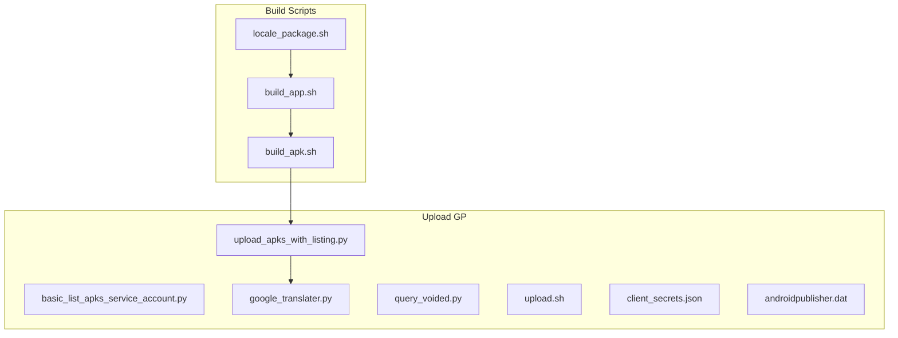
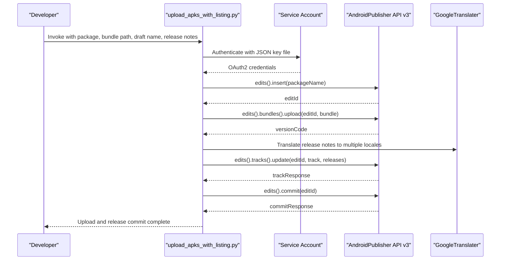
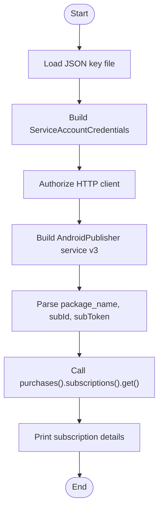
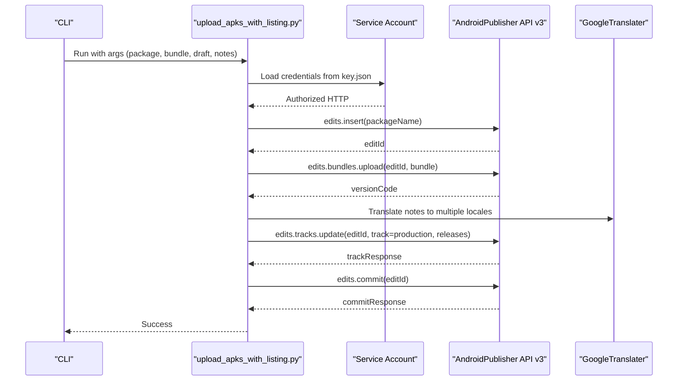
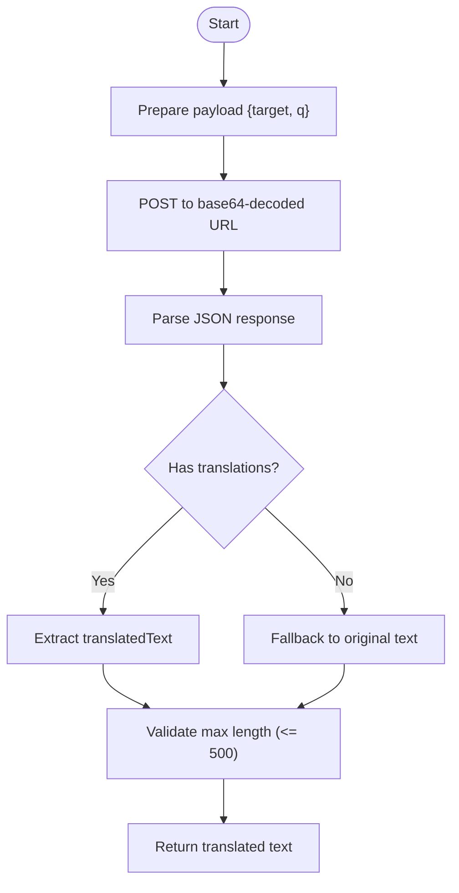
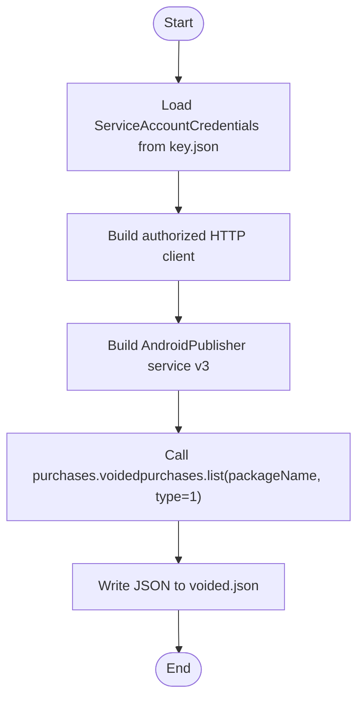
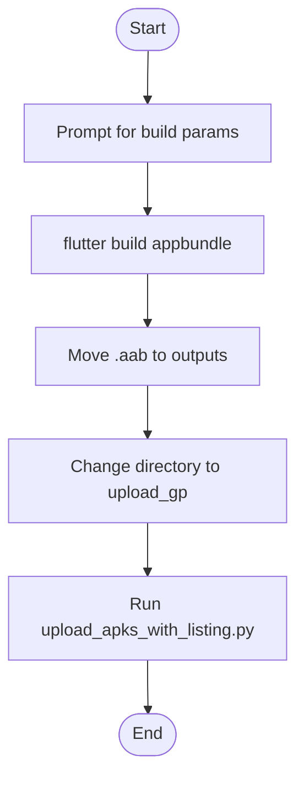
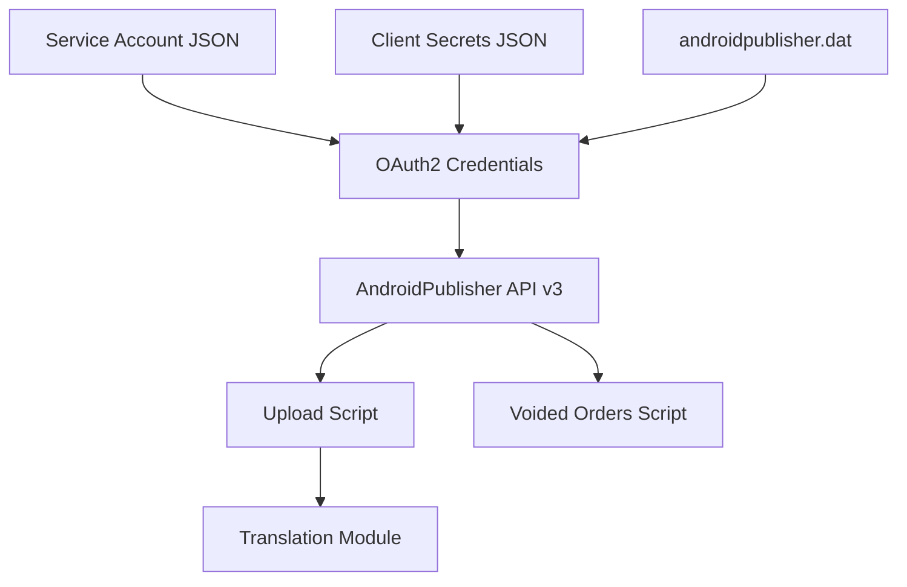

# Google Play Integration

<cite>
**Referenced Files in This Document**
- [basic_list_apks_service_account.py](file://overseaBuild/upload_gp/basic_list_apks_service_account.py)
- [upload_apks_with_listing.py](file://overseaBuild/upload_gp/upload_apks_with_listing.py)
- [google_translater.py](file://overseaBuild/upload_gp/google_translater.py)
- [query_voided.py](file://overseaBuild/upload_gp/query_voided.py)
- [upload.sh](file://overseaBuild/upload_gp/upload.sh)
- [client_secrets.json](file://overseaBuild/upload_gp/client_secrets.json)
- [androidpublisher.dat](file://overseaBuild/upload_gp/androidpublisher.dat)
- [build_apk.sh](file://overseaBuild/build_apk.sh)
- [build_app.sh](file://overseaBuild/build_app.sh)
- [locale_package.sh](file://overseaBuild/locale_package.sh)
</cite>

## Table of Contents
1. [Introduction](#introduction)
2. [Project Structure](#project-structure)
3. [Core Components](#core-components)
4. [Architecture Overview](#architecture-overview)
5. [Detailed Component Analysis](#detailed-component-analysis)
6. [Dependency Analysis](#dependency-analysis)
7. [Performance Considerations](#performance-considerations)
8. [Troubleshooting Guide](#troubleshooting-guide)
9. [Conclusion](#conclusion)
10. [Appendices](#appendices)

## Introduction
This document explains the Google Play Developer API integration implemented in the repository. It covers service account configuration, authentication methods, and the complete package upload workflow. It also documents translation integration for store listings, refund/cancellation handling via voided orders, and operational practices such as version management and rollback procedures. Practical examples are provided through script references and flow diagrams.

## Project Structure
The Google Play integration is primarily located under the `overseaBuild/upload_gp` directory. Supporting build scripts reside under `overseaBuild`. The structure enables:
- Service account-based authentication to the Android Publisher API
- Upload of Android App Bundles (.aab) with listing metadata
- Automated translation of release notes across multiple locales
- Querying voided purchases for refund/cancellation management
- End-to-end CI/CD pipeline integration for store builds

**Diagram sources**
- [upload_apks_with_listing.py:1-198](file://overseaBuild/upload_gp/upload_apks_with_listing.py#L1-L198)
- [google_translater.py:1-38](file://overseaBuild/upload_gp/google_translater.py#L1-L38)
- [query_voided.py:1-88](file://overseaBuild/upload_gp/query_voided.py#L1-L88)
- [upload.sh:1-25](file://overseaBuild/upload_gp/upload.sh#L1-L25)
- [client_secrets.json:1-9](file://overseaBuild/upload_gp/client_secrets.json#L1-L9)
- [androidpublisher.dat:1-25](file://overseaBuild/upload_gp/androidpublisher.dat#L1-L25)
- [build_apk.sh:1-60](file://overseaBuild/build_apk.sh#L1-L60)
- [build_app.sh:1-97](file://overseaBuild/build_app.sh#L1-L97)
- [locale_package.sh:1-32](file://overseaBuild/locale_package.sh#L1-L32)

**Section sources**
- [upload_apks_with_listing.py:1-198](file://overseaBuild/upload_gp/upload_apks_with_listing.py#L1-L198)
- [build_apk.sh:1-60](file://overseaBuild/build_apk.sh#L1-L60)
- [build_app.sh:1-97](file://overseaBuild/build_app.sh#L1-L97)
- [locale_package.sh:1-32](file://overseaBuild/locale_package.sh#L1-L32)

## Core Components
- Service Account Authentication: Uses a JSON key file to obtain OAuth2 credentials scoped to the Android Publisher API.
- Package Upload Workflow: Creates an edit session, uploads an Android App Bundle, commits the edit, and assigns a draft release with localized release notes.
- Translation Integration: Translates release notes into multiple languages using an internal translator endpoint.
- Voided Orders Query: Lists voided purchases to support refund and cancellation workflows.
- Build Pipeline Integration: Automates building an App Bundle and invoking the upload script.

Key responsibilities:
- Authentication and authorization to Google Play Developer API
- Edit lifecycle management (insert, upload, update, commit)
- Metadata management (release notes, track assignment)
- Localization and translation
- Refund/cancellation audit via voided purchases

**Section sources**
- [basic_list_apks_service_account.py:27-54](file://overseaBuild/upload_gp/basic_list_apks_service_account.py#L27-L54)
- [upload_apks_with_listing.py:93-195](file://overseaBuild/upload_gp/upload_apks_with_listing.py#L93-L195)
- [google_translater.py:11-22](file://overseaBuild/upload_gp/google_translater.py#L11-L22)
- [query_voided.py:38-84](file://overseaBuild/upload_gp/query_voided.py#L38-L84)
- [build_apk.sh:39-59](file://overseaBuild/build_apk.sh#L39-L59)

## Architecture Overview
The integration follows a service-account-based authentication model to the Android Publisher API v3. The upload workflow is structured around edits, which encapsulate all changes until committed. Release notes are translated and applied to a draft release on a chosen track.

**Diagram sources**
- [upload_apks_with_listing.py:93-195](file://overseaBuild/upload_gp/upload_apks_with_listing.py#L93-L195)
- [google_translater.py:11-22](file://overseaBuild/upload_gp/google_translater.py#L11-L22)

## Detailed Component Analysis

### Service Account Authentication and Subscription Verification
This script demonstrates service account-based authentication and verifies a subscription purchase using the Android Publisher API. It loads credentials from a JSON key file and constructs an authorized HTTP client for API calls.

**Diagram sources**
- [basic_list_apks_service_account.py:40-85](file://overseaBuild/upload_gp/basic_list_apks_service_account.py#L40-L85)

**Section sources**
- [basic_list_apks_service_account.py:27-54](file://overseaBuild/upload_gp/basic_list_apks_service_account.py#L27-L54)
- [basic_list_apks_service_account.py:66-85](file://overseaBuild/upload_gp/basic_list_apks_service_account.py#L66-L85)

### Package Upload Workflow (App Bundle)
This script orchestrates the complete upload workflow:
- Authenticates via service account
- Creates an edit session
- Uploads an Android App Bundle with resumable chunked transfer
- Commits the edit
- Translates release notes into multiple locales
- Assigns a draft release to the production track

**Diagram sources**
- [upload_apks_with_listing.py:93-195](file://overseaBuild/upload_gp/upload_apks_with_listing.py#L93-L195)
- [google_translater.py:11-22](file://overseaBuild/upload_gp/google_translater.py#L11-L22)

**Section sources**
- [upload_apks_with_listing.py:93-195](file://overseaBuild/upload_gp/upload_apks_with_listing.py#L93-L195)

### Translation Integration for Store Listings
The translator component posts text to a base64-decoded endpoint and extracts translated text. It supports language-specific logic for Chinese variants and enforces a maximum length for release notes.

**Diagram sources**
- [google_translater.py:11-22](file://overseaBuild/upload_gp/google_translater.py#L11-L22)

**Section sources**
- [google_translater.py:11-22](file://overseaBuild/upload_gp/google_translater.py#L11-L22)

### Voided Orders Management
This script lists voided purchases for a given package, enabling refund and cancellation auditing. It authenticates via service account and writes the result to a JSON file.

**Diagram sources**
- [query_voided.py:38-84](file://overseaBuild/upload_gp/query_voided.py#L38-L84)

**Section sources**
- [query_voided.py:38-84](file://overseaBuild/upload_gp/query_voided.py#L38-L84)

### Build Pipeline Integration
The build scripts integrate the upload workflow into CI/CD:
- `build_apk.sh`: Builds an App Bundle for store distribution and invokes the upload script.
- `build_app.sh`: Orchestrates multi-platform builds and triggers store builds.
- `locale_package.sh`: Provides interactive prompts to configure build parameters and starts the build pipeline.

**Diagram sources**
- [build_apk.sh:39-59](file://overseaBuild/build_apk.sh#L39-L59)
- [build_app.sh:40-52](file://overseaBuild/build_app.sh#L40-L52)
- [locale_package.sh:5-31](file://overseaBuild/locale_package.sh#L5-L31)

**Section sources**
- [build_apk.sh:39-59](file://overseaBuild/build_apk.sh#L39-L59)
- [build_app.sh:40-52](file://overseaBuild/build_app.sh#L40-L52)
- [locale_package.sh:5-31](file://overseaBuild/locale_package.sh#L5-L31)

## Dependency Analysis
- Authentication Dependencies:
  - Service account JSON key file for OAuth2 credentials
  - Client secrets JSON for OAuth2 client credentials (alternative flow)
  - Stored token data for OAuth2 refresh flow
- Upload Dependencies:
  - Google API Python Client library
  - OAuth2 client library
  - MIME type registration for .aab/.apk
- Translation Dependencies:
  - Requests library for HTTP POST to translation endpoint
- Voided Orders Dependencies:
  - Same authentication and API client libraries

**Diagram sources**
- [upload_apks_with_listing.py:93-195](file://overseaBuild/upload_gp/upload_apks_with_listing.py#L93-L195)
- [query_voided.py:38-84](file://overseaBuild/upload_gp/query_voided.py#L38-L84)
- [client_secrets.json:1-9](file://overseaBuild/upload_gp/client_secrets.json#L1-L9)
- [androidpublisher.dat:1-25](file://overseaBuild/upload_gp/androidpublisher.dat#L1-L25)

**Section sources**
- [upload_apks_with_listing.py:20-46](file://overseaBuild/upload_gp/upload_apks_with_listing.py#L20-L46)
- [query_voided.py:24-27](file://overseaBuild/upload_gp/query_voided.py#L24-L27)
- [client_secrets.json:1-9](file://overseaBuild/upload_gp/client_secrets.json#L1-L9)
- [androidpublisher.dat:1-25](file://overseaBuild/upload_gp/androidpublisher.dat#L1-L25)

## Performance Considerations
- Resumable Uploads: The upload script uses chunked uploads to improve reliability for large bundles.
- Timeout Configuration: Network timeouts are configured to accommodate long-running transfers.
- Batch Operations: Edits are used to batch multiple changes (upload + metadata) before committing.
- Translation Efficiency: Release notes are translated once and reused across locales to minimize API calls.

[No sources needed since this section provides general guidance]

## Troubleshooting Guide
Common issues and remedies:
- Access Token Refresh Errors: The upload script catches token refresh errors and advises re-authentication.
- Missing Dependencies: The upload script attempts to install missing packages automatically during runtime.
- Large Release Notes: The translation module enforces a maximum length for release notes and exits if exceeded.
- Authentication Failures: Ensure the service account JSON key file is present and has the correct scope for the Android Publisher API.
- Voided Orders Retrieval: Verify package name and API scope; results are written to a JSON file for inspection.

**Section sources**
- [upload_apks_with_listing.py:143-145](file://overseaBuild/upload_gp/upload_apks_with_listing.py#L143-L145)
- [upload_apks_with_listing.py:167-169](file://overseaBuild/upload_gp/upload_apks_with_listing.py#L167-L169)
- [query_voided.py:81-83](file://overseaBuild/upload_gp/query_voided.py#L81-L83)

## Conclusion
The repository provides a robust, script-driven integration with the Google Play Developer API. It automates service account authentication, secure uploads of Android App Bundles, localized release note management, and refund/cancellation auditing via voided orders. The build scripts integrate these capabilities into a CI/CD pipeline, enabling repeatable and reliable store deployments.

[No sources needed since this section summarizes without analyzing specific files]

## Appendices

### Setup and Configuration Checklist
- Service Account Setup:
  - Create a service account in the Google Cloud Console.
  - Download the JSON key file and place it in the upload directory.
  - Grant the service account access to the Google Play Console project.
- Authentication Scopes:
  - Ensure the service account has the Android Publisher API scope enabled.
- Environment Prerequisites:
  - Install Python dependencies as needed by the upload script.
  - Configure network access for the translation endpoint if used.
- Build Pipeline:
  - Use the provided build scripts to generate App Bundles and trigger uploads.

[No sources needed since this section provides general guidance]

### Practical Examples
- Interactive Upload:
  - Use the upload shell script to select the application, enter draft name and bundle path, and run the upload script.
  - Reference: [upload.sh:8-24](file://overseaBuild/upload_gp/upload.sh#L8-L24)
- Programmatic Upload:
  - Invoke the upload script with arguments for package name, bundle path, draft name, and release notes.
  - Reference: [upload_apks_with_listing.py:76-91](file://overseaBuild/upload_gp/upload_apks_with_listing.py#L76-L91)
- Build and Upload:
  - Trigger the build pipeline to produce an App Bundle and upload it to the store.
  - References: [build_apk.sh:47-56](file://overseaBuild/build_apk.sh#L47-L56), [build_app.sh:40-52](file://overseaBuild/build_app.sh#L40-L52)

[No sources needed since this section references existing files without adding new analysis]