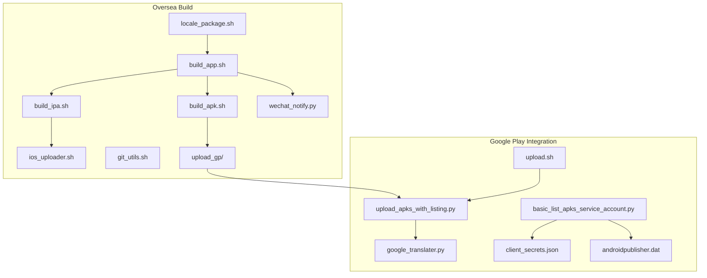
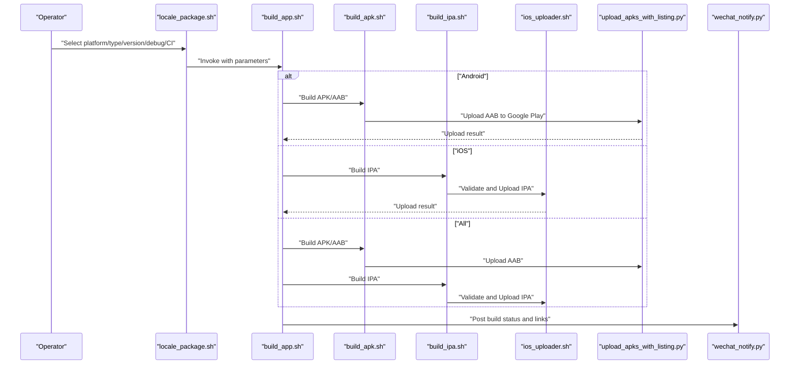
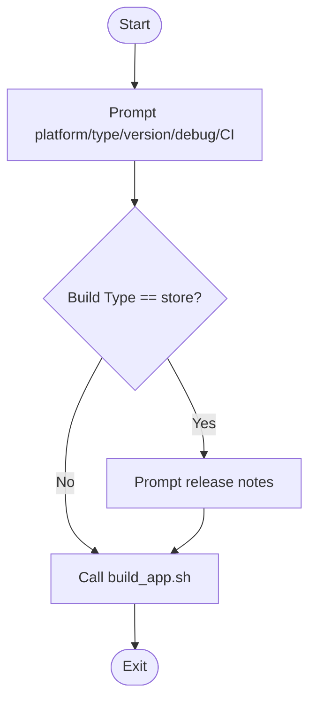
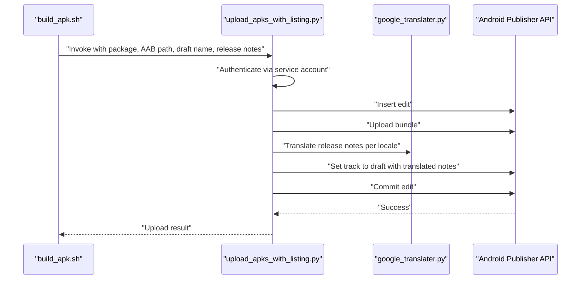
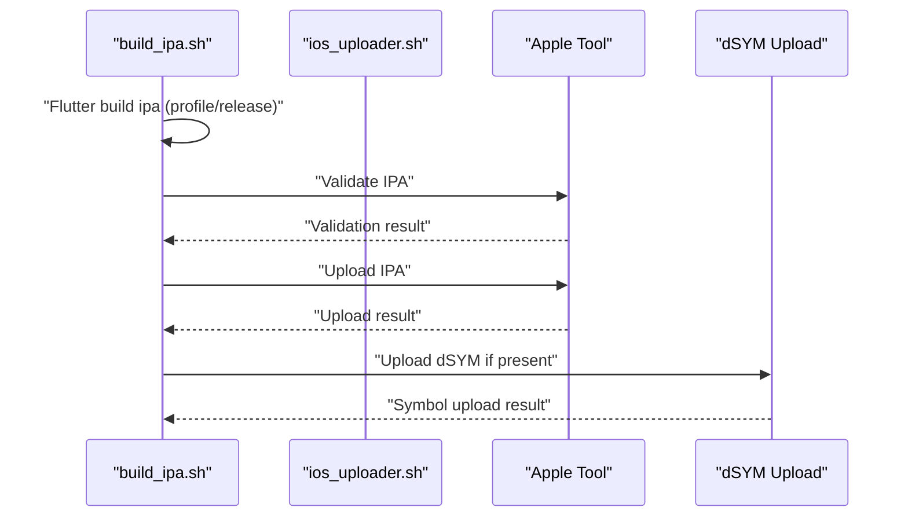
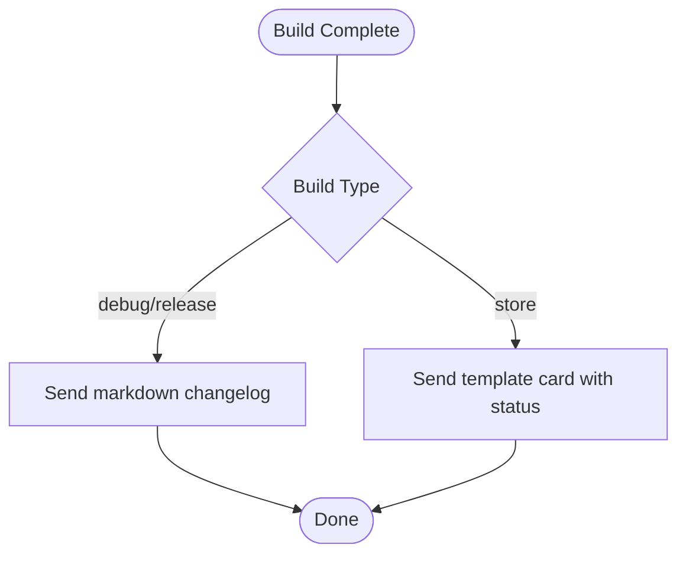
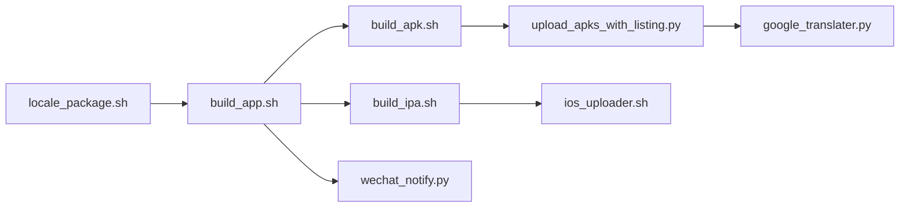

# International Deployment

<cite>
**Referenced Files in This Document**
- [locale_package.sh](file://overseaBuild/locale_package.sh)
- [build_app.sh](file://overseaBuild/build_app.sh)
- [build_apk.sh](file://overseaBuild/build_apk.sh)
- [build_ipa.sh](file://overseaBuild/build_ipa.sh)
- [ios_uploader.sh](file://overseaBuild/ios_uploader.sh)
- [git_utils.sh](file://overseaBuild/git_utils.sh)
- [upload_apks_with_listing.py](file://overseaBuild/upload_gp/upload_apks_with_listing.py)
- [google_translater.py](file://overseaBuild/upload_gp/google_translater.py)
- [upload.sh](file://overseaBuild/upload_gp/upload.sh)
- [basic_list_apks_service_account.py](file://overseaBuild/upload_gp/basic_list_apks_service_account.py)
- [client_secrets.json](file://overseaBuild/upload_gp/client_secrets.json)
- [androidpublisher.dat](file://overseaBuild/upload_gp/androidpublisher.dat)
- [wechat_notify.py](file://overseaBuild/wechat_notify.py)
- [README.md](file://README.md)
</cite>

## Table of Contents
1. [Introduction](#introduction)
2. [Project Structure](#project-structure)
3. [Core Components](#core-components)
4. [Architecture Overview](#architecture-overview)
5. [Detailed Component Analysis](#detailed-component-analysis)
6. [Dependency Analysis](#dependency-analysis)
7. [Performance Considerations](#performance-considerations)
8. [Troubleshooting Guide](#troubleshooting-guide)
9. [Conclusion](#conclusion)
10. [Appendices](#appendices)

## Introduction
This document explains the international deployment capabilities implemented in the repository, focusing on:
- Multi-language support and regional adaptation via Flutter flavors and localization resources
- Google Play integration using the Android Publisher API with service account authentication and automated listing updates
- iOS deployment via Xcode and Fastlane-like tooling, including IPA generation and Apple Tool validation/upload
- Notification systems for team communication and build status alerts
- Compliance and regional configuration management, including cultural considerations for international markets
- Practical multi-region deployment strategies and troubleshooting guidance

## Project Structure
The international deployment pipeline is organized around a set of Bash and Python scripts under the overseaBuild directory, with supporting utilities and configuration files for Google Play and iOS workflows.

**Diagram sources**
- [locale_package.sh:1-32](file://overseaBuild/locale_package.sh#L1-L32)
- [build_app.sh:1-97](file://overseaBuild/build_app.sh#L1-L97)
- [build_apk.sh:1-60](file://overseaBuild/build_apk.sh#L1-L60)
- [build_ipa.sh:1-74](file://overseaBuild/build_ipa.sh#L1-L74)
- [ios_uploader.sh:1-81](file://overseaBuild/ios_uploader.sh#L1-L81)
- [upload_apks_with_listing.py:1-198](file://overseaBuild/upload_gp/upload_apks_with_listing.py#L1-L198)
- [google_translater.py:1-38](file://overseaBuild/upload_gp/google_translater.py#L1-L38)
- [upload.sh:1-25](file://overseaBuild/upload_gp/upload.sh#L1-L25)
- [basic_list_apks_service_account.py:1-89](file://overseaBuild/upload_gp/basic_list_apks_service_account.py#L1-L89)
- [client_secrets.json:1-9](file://overseaBuild/upload_gp/client_secrets.json#L1-L9)
- [androidpublisher.dat:1-25](file://overseaBuild/upload_gp/androidpublisher.dat#L1-L25)
- [wechat_notify.py:1-146](file://overseaBuild/wechat_notify.py#L1-L146)

**Section sources**
- [README.md:1-37](file://README.md#L1-L37)
- [locale_package.sh:1-32](file://overseaBuild/locale_package.sh#L1-L32)
- [build_app.sh:1-97](file://overseaBuild/build_app.sh#L1-L97)

## Core Components
- Locale packaging and build orchestration: Centralized entrypoint to select platform, build type, versioning, and CI metadata, delegating to platform-specific builders.
- Android packaging and Google Play upload: Flutter AAB builds for store distribution and Python-based upload to Google Play with localized release notes.
- iOS packaging and Apple Tool integration: Flutter IPA builds, archive export, and Apple Tool validation/upload with dSYM symbol upload.
- Notification system: WeCom webhook integration to post build status, changelogs, and download links.
- Git utilities: Helper functions to check branch existence and safely switch/pull branches for reproducible builds.

**Section sources**
- [locale_package.sh:1-32](file://overseaBuild/locale_package.sh#L1-L32)
- [build_app.sh:1-97](file://overseaBuild/build_app.sh#L1-L97)
- [build_apk.sh:1-60](file://overseaBuild/build_apk.sh#L1-L60)
- [build_ipa.sh:1-74](file://overseaBuild/build_ipa.sh#L1-L74)
- [ios_uploader.sh:1-81](file://overseaBuild/ios_uploader.sh#L1-L81)
- [wechat_notify.py:1-146](file://overseaBuild/wechat_notify.py#L1-L146)
- [git_utils.sh:1-90](file://overseaBuild/git_utils.sh#L1-L90)

## Architecture Overview
The international deployment architecture integrates Flutter builds, platform-specific packaging, and external platform APIs with internal notifications.

**Diagram sources**
- [locale_package.sh:1-32](file://overseaBuild/locale_package.sh#L1-L32)
- [build_app.sh:1-97](file://overseaBuild/build_app.sh#L1-L97)
- [build_apk.sh:1-60](file://overseaBuild/build_apk.sh#L1-L60)
- [build_ipa.sh:1-74](file://overseaBuild/build_ipa.sh#L1-L74)
- [ios_uploader.sh:1-81](file://overseaBuild/ios_uploader.sh#L1-L81)
- [upload_apks_with_listing.py:1-198](file://overseaBuild/upload_gp/upload_apks_with_listing.py#L1-L198)
- [wechat_notify.py:1-146](file://overseaBuild/wechat_notify.py#L1-L146)

## Detailed Component Analysis

### Locale Packaging and Build Orchestration
- Purpose: Interactive selection of build targets and parameters, then dispatch to platform-specific builders.
- Inputs: Platform (All/Android/iOS), Build Type (debug/release/store), versionName, versionCode, debug model, CI number, optional release notes.
- Outputs: Delegated to build scripts; triggers notifications upon completion.

**Diagram sources**
- [locale_package.sh:5-31](file://overseaBuild/locale_package.sh#L5-L31)

**Section sources**
- [locale_package.sh:1-32](file://overseaBuild/locale_package.sh#L1-L32)

### Android Build and Google Play Upload
- Build modes:
  - debug: Profile build with flavor and optional debug flags.
  - release: Release build with optional debug flags.
  - store: App bundle (.aab) for production distribution.
- Google Play upload:
  - Uses service account credentials to authenticate to the Android Publisher API.
  - Uploads AAB, sets a draft track, and auto-translates release notes into multiple locales.
  - Supports multiple languages including English variants, Arabic, Indonesian, Korean, Malay, Thai, Turkish, Vietnamese, Traditional/Simplified Chinese, and Hong Kong.

**Diagram sources**
- [build_apk.sh:39-59](file://overseaBuild/build_apk.sh#L39-L59)
- [upload_apks_with_listing.py:93-197](file://overseaBuild/upload_gp/upload_apks_with_listing.py#L93-L197)
- [google_translater.py:11-21](file://overseaBuild/upload_gp/google_translater.py#L11-L21)

**Section sources**
- [build_apk.sh:1-60](file://overseaBuild/build_apk.sh#L1-L60)
- [upload_apks_with_listing.py:1-198](file://overseaBuild/upload_gp/upload_apks_with_listing.py#L1-L198)
- [google_translater.py:1-38](file://overseaBuild/upload_gp/google_translater.py#L1-L38)
- [upload.sh:1-25](file://overseaBuild/upload_gp/upload.sh#L1-L25)
- [basic_list_apks_service_account.py:1-89](file://overseaBuild/upload_gp/basic_list_apks_service_account.py#L1-L89)
- [client_secrets.json:1-9](file://overseaBuild/upload_gp/client_secrets.json#L1-L9)
- [androidpublisher.dat:1-25](file://overseaBuild/upload_gp/androidpublisher.dat#L1-L25)

### iOS Build and Apple Tool Integration
- Build modes:
  - debug/release: Flutter profile/release builds with optional debug flags.
  - store: Full store build with CocoaPods setup, archive export, and dSYM upload.
- Apple Tool integration:
  - Validates and uploads IPA using Apple Tool with API key and issuer.
  - Uploads dSYM symbols for crash symbolication.

**Diagram sources**
- [build_ipa.sh:15-73](file://overseaBuild/build_ipa.sh#L15-L73)
- [ios_uploader.sh:7-44](file://overseaBuild/ios_uploader.sh#L7-L44)

**Section sources**
- [build_ipa.sh:1-74](file://overseaBuild/build_ipa.sh#L1-L74)
- [ios_uploader.sh:1-81](file://overseaBuild/ios_uploader.sh#L1-L81)

### Notification System (WeCom)
- Posts build status cards with:
  - Title and description indicating platform and distribution status
  - Horizontal content items for trigger and branch
  - Jump links to download locations
- Sends markdown changelog updates for debug/release builds, truncated to a safe length.

**Diagram sources**
- [wechat_notify.py:32-146](file://overseaBuild/wechat_notify.py#L32-L146)

**Section sources**
- [wechat_notify.py:1-146](file://overseaBuild/wechat_notify.py#L1-L146)

### Git Utilities
- Branch existence checks (local/remote)
- Safe checkout and pull workflow to ensure a clean, up-to-date working tree for reproducible builds

**Section sources**
- [git_utils.sh:1-90](file://overseaBuild/git_utils.sh#L1-L90)

## Dependency Analysis
- Build orchestration depends on platform-specific builders and notification scripts.
- Android upload depends on Google Play API credentials and translator module.
- iOS upload depends on Apple Tool availability and valid API credentials.
- Notifications depend on WeCom webhook configuration.

**Diagram sources**
- [locale_package.sh:1-32](file://overseaBuild/locale_package.sh#L1-L32)
- [build_app.sh:1-97](file://overseaBuild/build_app.sh#L1-L97)
- [build_apk.sh:1-60](file://overseaBuild/build_apk.sh#L1-L60)
- [build_ipa.sh:1-74](file://overseaBuild/build_ipa.sh#L1-L74)
- [upload_apks_with_listing.py:1-198](file://overseaBuild/upload_gp/upload_apks_with_listing.py#L1-L198)
- [google_translater.py:1-38](file://overseaBuild/upload_gp/google_translater.py#L1-L38)
- [ios_uploader.sh:1-81](file://overseaBuild/ios_uploader.sh#L1-L81)
- [wechat_notify.py:1-146](file://overseaBuild/wechat_notify.py#L1-L146)

**Section sources**
- [build_app.sh:1-97](file://overseaBuild/build_app.sh#L1-L97)
- [build_apk.sh:1-60](file://overseaBuild/build_apk.sh#L1-L60)
- [build_ipa.sh:1-74](file://overseaBuild/build_ipa.sh#L1-L74)
- [upload_apks_with_listing.py:1-198](file://overseaBuild/upload_gp/upload_apks_with_listing.py#L1-L198)
- [ios_uploader.sh:1-81](file://overseaBuild/ios_uploader.sh#L1-L81)
- [wechat_notify.py:1-146](file://overseaBuild/wechat_notify.py#L1-L146)

## Performance Considerations
- Parallelization: The “All” build mode runs Android and iOS builds sequentially within the orchestrator; consider offloading independent tasks to separate CI jobs for true parallelism.
- Network timeouts: The Google Play upload script sets a long default timeout; ensure CI environments have stable connectivity.
- Translation limits: Release notes are truncated to a maximum length per locale; keep release notes concise to avoid truncation.
- Artifact cleanup: Builders remove previous outputs to reduce disk usage; ensure sufficient disk space for large archives and dSYMs.

[No sources needed since this section provides general guidance]

## Troubleshooting Guide
- Google Play upload failures:
  - Verify service account JSON and Android Publisher API scope.
  - Confirm AAB path and package name match the target app.
  - Check translated release notes length constraints.
- Apple Tool upload failures:
  - Ensure API key and issuer are valid and passed correctly.
  - Validate provisioning profiles and certificates.
  - Confirm dSYM upload path and presence of symbols.
- Notification delivery:
  - Ensure webhook URL is configured and reachable.
  - Validate payload structure for template cards and markdown messages.
- Branch and repo issues:
  - Use git utilities to check branch existence and perform a clean checkout/pull before building.

**Section sources**
- [upload_apks_with_listing.py:93-197](file://overseaBuild/upload_gp/upload_apks_with_listing.py#L93-L197)
- [ios_uploader.sh:7-44](file://overseaBuild/ios_uploader.sh#L7-L44)
- [wechat_notify.py:17-146](file://overseaBuild/wechat_notify.py#L17-L146)
- [git_utils.sh:41-90](file://overseaBuild/git_utils.sh#L41-L90)

## Conclusion
The repository provides a robust, script-driven international deployment pipeline that supports multi-language regions, automated Google Play uploads with localized listing content, and iOS packaging with Apple Tool integration. The system leverages service accounts for secure API access, translates release notes for broad coverage, and notifies the team via WeCom. Adhering to the recommended practices and troubleshooting steps will improve reliability and speed for multi-region releases.

[No sources needed since this section summarizes without analyzing specific files]

## Appendices

### Regional Adaptation and Localization
- Flutter flavor: banban_locale is used for regional builds, enabling resource overrides and feature toggles per region.
- Resource overrides: Place localized assets and strings under the flavor-specific resource directories to align with regional preferences.
- Cultural considerations:
  - Respect right-to-left layouts for Arabic locales.
  - Avoid images/texts that are culturally sensitive or offensive.
  - Ensure date/time and number formats align with regional standards.

**Section sources**
- [build_apk.sh:11-38](file://overseaBuild/build_apk.sh#L11-L38)

### Compliance and Security
- Service account credentials: Store service account JSON securely and restrict access to CI environments.
- Token refresh: Ensure tokens are refreshed and rotated periodically; monitor expiry.
- API scopes: Limit scopes to androidpublisher for least privilege.
- iOS credentials: Keep Apple API key and issuer secure; rotate as needed.

**Section sources**
- [basic_list_apks_service_account.py:27-53](file://overseaBuild/upload_gp/basic_list_apks_service_account.py#L27-L53)
- [client_secrets.json:1-9](file://overseaBuild/upload_gp/client_secrets.json#L1-L9)
- [androidpublisher.dat:1-25](file://overseaBuild/upload_gp/androidpublisher.dat#L1-L25)
- [ios_uploader.sh:4-81](file://overseaBuild/ios_uploader.sh#L4-L81)

### Practical Multi-Region Deployment Strategies
- Pre-release testing:
  - Use debug/release builds for internal QA across regions.
  - Distribute via ad-hoc channels for targeted testers.
- Production rollout:
  - Use store builds with AAB for Google Play and IPA for App Store/TestFlight.
  - Set draft tracks initially; promote after internal sign-off.
- Communication:
  - Post build status cards with download links to the team channel.
  - Include concise changelogs and highlight region-specific changes.

**Section sources**
- [build_apk.sh:39-59](file://overseaBuild/build_apk.sh#L39-L59)
- [build_ipa.sh:15-73](file://overseaBuild/build_ipa.sh#L15-L73)
- [wechat_notify.py:68-128](file://overseaBuild/wechat_notify.py#L68-L128)