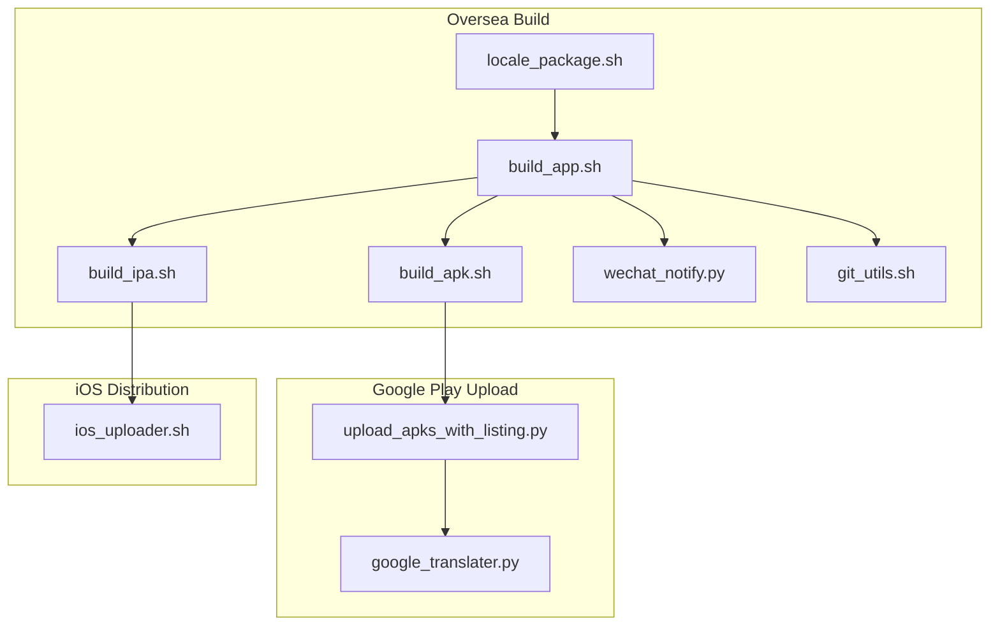
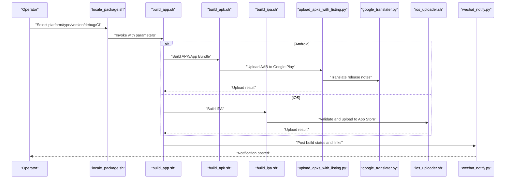
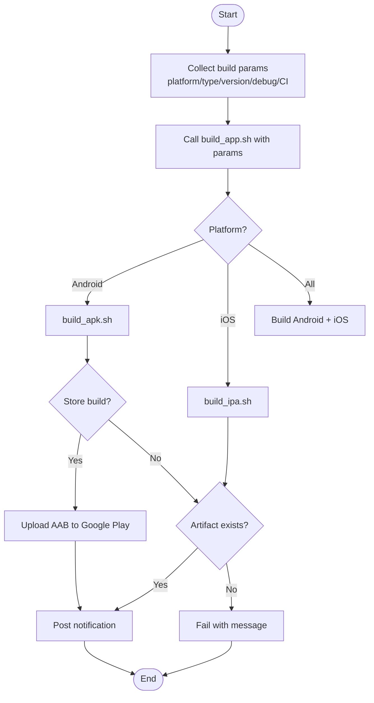
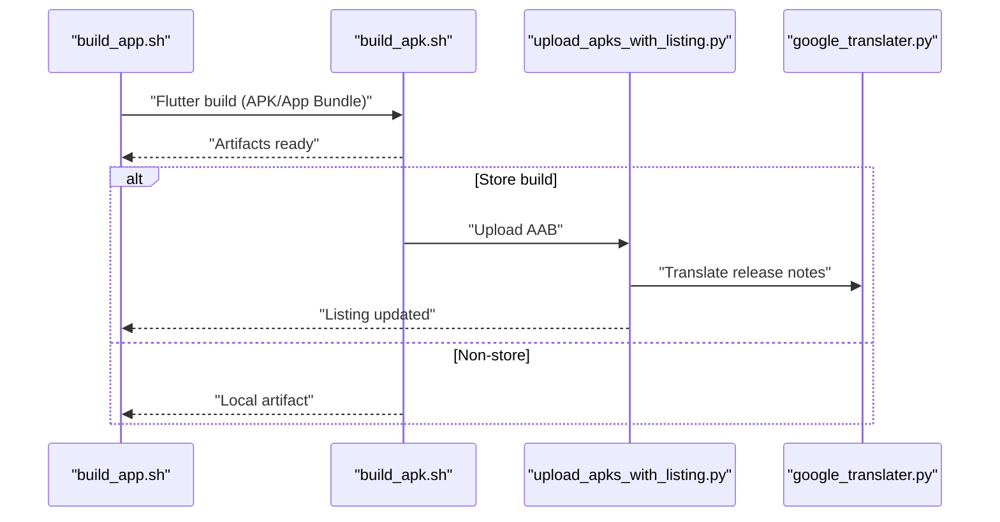
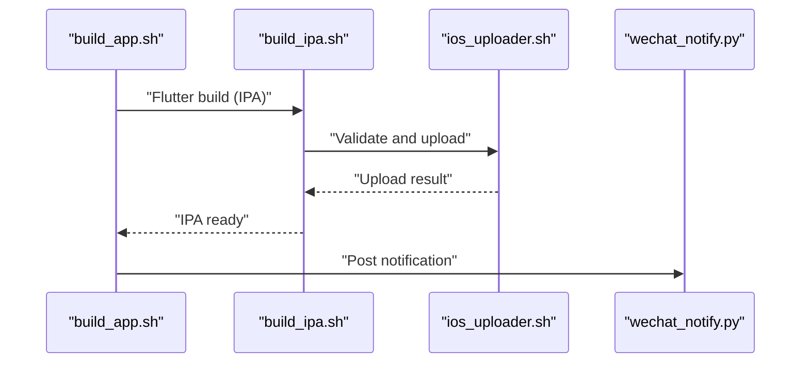
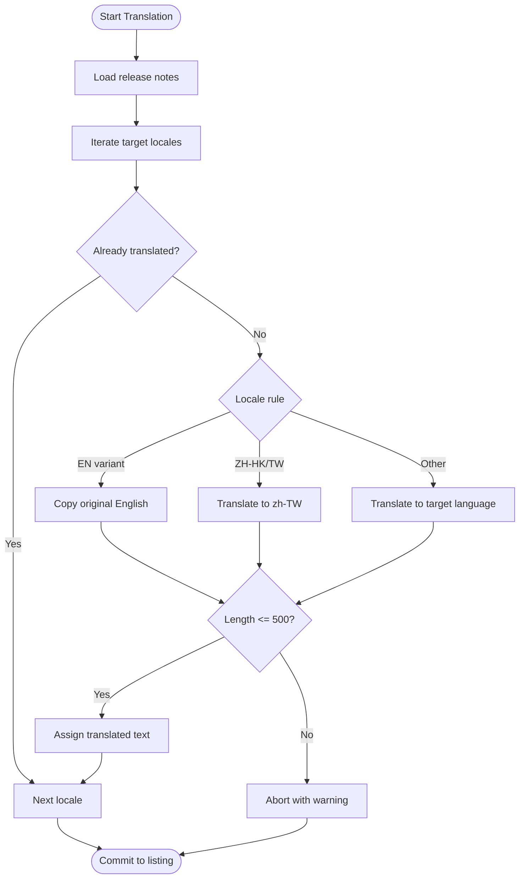
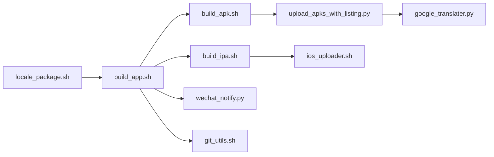

# Multi-Language Support

<cite>
**Referenced Files in This Document**
- [README.md](file://README.md)
- [locale_package.sh](file://overseaBuild/locale_package.sh)
- [build_app.sh](file://overseaBuild/build_app.sh)
- [build_apk.sh](file://overseaBuild/build_apk.sh)
- [build_ipa.sh](file://overseaBuild/build_ipa.sh)
- [upload_apks_with_listing.py](file://overseaBuild/upload_gp/upload_apks_with_listing.py)
- [google_translater.py](file://overseaBuild/upload_gp/google_translater.py)
- [wechat_notify.py](file://overseaBuild/wechat_notify.py)
- [ios_uploader.sh](file://overseaBuild/ios_uploader.sh)
- [git_utils.sh](file://overseaBuild/git_utils.sh)
</cite>

## Table of Contents
1. [Introduction](#introduction)
2. [Project Structure](#project-structure)
3. [Core Components](#core-components)
4. [Architecture Overview](#architecture-overview)
5. [Detailed Component Analysis](#detailed-component-analysis)
6. [Dependency Analysis](#dependency-analysis)
7. [Performance Considerations](#performance-considerations)
8. [Troubleshooting Guide](#troubleshooting-guide)
9. [Conclusion](#conclusion)
10. [Appendices](#appendices)

## Introduction
This document explains the multi-language support capabilities implemented in the repository, focusing on locale package configuration, translation management, and regional adaptation processes. It covers the locale package generation workflow, how different locales are configured and packaged for international markets, the translation management system (including automatic translation processing and manual review workflows), and regional adaptation requirements such as date/time formats, currency display, and cultural considerations. Practical examples demonstrate setting up new locales, managing translation updates, and handling regional compliance requirements. Finally, it documents the integration between locale packages and build processes to ensure proper localization for each target market.

## Project Structure
The internationalization and localization pipeline spans several shell scripts and Python utilities under the overseaBuild directory and related CI utilities. The primary build orchestration is handled by shell scripts that invoke Flutter build commands with flavor-specific configurations and Dart defines. Translation and listing updates for international stores are managed by a Python script that leverages an external translation service and Google APIs.

**Diagram sources**
- [locale_package.sh:1-32](file://overseaBuild/locale_package.sh#L1-L32)
- [build_app.sh:1-97](file://overseaBuild/build_app.sh#L1-L97)
- [build_apk.sh:1-60](file://overseaBuild/build_apk.sh#L1-L60)
- [build_ipa.sh:1-74](file://overseaBuild/build_ipa.sh#L1-L74)
- [upload_apks_with_listing.py:1-198](file://overseaBuild/upload_gp/upload_apks_with_listing.py#L1-L198)
- [google_translater.py:1-38](file://overseaBuild/upload_gp/google_translater.py#L1-L38)
- [wechat_notify.py:1-146](file://overseaBuild/wechat_notify.py#L1-L146)
- [ios_uploader.sh:1-81](file://overseaBuild/ios_uploader.sh#L1-L81)
- [git_utils.sh:1-90](file://overseaBuild/git_utils.sh#L1-L90)

**Section sources**
- [README.md:1-37](file://README.md#L1-L37)
- [locale_package.sh:1-32](file://overseaBuild/locale_package.sh#L1-L32)
- [build_app.sh:1-97](file://overseaBuild/build_app.sh#L1-L97)
- [build_apk.sh:1-60](file://overseaBuild/build_apk.sh#L1-L60)
- [build_ipa.sh:1-74](file://overseaBuild/build_ipa.sh#L1-L74)
- [upload_apks_with_listing.py:1-198](file://overseaBuild/upload_gp/upload_apks_with_listing.py#L1-L198)
- [google_translater.py:1-38](file://overseaBuild/upload_gp/google_translater.py#L1-L38)
- [wechat_notify.py:1-146](file://overseaBuild/wechat_notify.py#L1-L146)
- [ios_uploader.sh:1-81](file://overseaBuild/ios_uploader.sh#L1-L81)
- [git_utils.sh:1-90](file://overseaBuild/git_utils.sh#L1-L90)

## Core Components
- Locale package orchestrator: Interactively collects build parameters and delegates to the unified build script.
- Unified build orchestrator: Coordinates Android and iOS builds, handles store vs. non-store flows, and posts notifications.
- Android build pipeline: Invokes Flutter build with flavor and Dart defines, uploads artifacts, and integrates with store upload flows.
- iOS build pipeline: Handles Flutter IPA builds, export options, and Apple distribution via dedicated uploader.
- Translation and listing manager: Automatically translates release notes into multiple locales and updates store listings.
- Notification system: Posts build status and links to artifact download portals.
- Git utilities: Provides branch existence checks and safe checkout/pull routines for reliable builds.

**Section sources**
- [locale_package.sh:1-32](file://overseaBuild/locale_package.sh#L1-L32)
- [build_app.sh:1-97](file://overseaBuild/build_app.sh#L1-L97)
- [build_apk.sh:1-60](file://overseaBuild/build_apk.sh#L1-L60)
- [build_ipa.sh:1-74](file://overseaBuild/build_ipa.sh#L1-L74)
- [upload_apks_with_listing.py:1-198](file://overseaBuild/upload_gp/upload_apks_with_listing.py#L1-L198)
- [google_translater.py:1-38](file://overseaBuild/upload_gp/google_translater.py#L1-L38)
- [wechat_notify.py:1-146](file://overseaBuild/wechat_notify.py#L1-L146)
- [git_utils.sh:1-90](file://overseaBuild/git_utils.sh#L1-L90)

## Architecture Overview
The multi-language support architecture centers on a locale-aware Flutter flavor and a robust CI pipeline that builds, packages, and publishes localized artifacts. The build scripts pass Dart defines for build-time configuration, trigger Flutter builds per platform, and integrate with store upload utilities. Release notes are translated into multiple locales and committed to store listings.

**Diagram sources**
- [locale_package.sh:1-32](file://overseaBuild/locale_package.sh#L1-L32)
- [build_app.sh:1-97](file://overseaBuild/build_app.sh#L1-L97)
- [build_apk.sh:1-60](file://overseaBuild/build_apk.sh#L1-L60)
- [build_ipa.sh:1-74](file://overseaBuild/build_ipa.sh#L1-L74)
- [upload_apks_with_listing.py:1-198](file://overseaBuild/upload_gp/upload_apks_with_listing.py#L1-L198)
- [google_translater.py:1-38](file://overseaBuild/upload_gp/google_translater.py#L1-L38)
- [wechat_notify.py:1-146](file://overseaBuild/wechat_notify.py#L1-L146)
- [ios_uploader.sh:1-81](file://overseaBuild/ios_uploader.sh#L1-L81)

## Detailed Component Analysis

### Locale Package Generation Workflow
The locale package workflow begins with interactive prompts to collect build parameters, then invokes the unified build orchestrator. The orchestrator selects platform-specific build scripts and manages store vs. non-store flows, including artifact uploads and notifications.

**Diagram sources**
- [locale_package.sh:1-32](file://overseaBuild/locale_package.sh#L1-L32)
- [build_app.sh:1-97](file://overseaBuild/build_app.sh#L1-L97)
- [build_apk.sh:1-60](file://overseaBuild/build_apk.sh#L1-L60)
- [build_ipa.sh:1-74](file://overseaBuild/build_ipa.sh#L1-L74)
- [wechat_notify.py:1-146](file://overseaBuild/wechat_notify.py#L1-L146)

**Section sources**
- [locale_package.sh:1-32](file://overseaBuild/locale_package.sh#L1-L32)
- [build_app.sh:1-97](file://overseaBuild/build_app.sh#L1-L97)

### Android Build Pipeline and Store Upload
The Android pipeline uses a locale flavor and passes Dart defines for build metadata. For store builds, it produces an App Bundle and uploads it to Google Play, then translates release notes into multiple locales and commits them to store listings.

**Diagram sources**
- [build_apk.sh:1-60](file://overseaBuild/build_apk.sh#L1-L60)
- [upload_apks_with_listing.py:1-198](file://overseaBuild/upload_gp/upload_apks_with_listing.py#L1-L198)
- [google_translater.py:1-38](file://overseaBuild/upload_gp/google_translater.py#L1-L38)

**Section sources**
- [build_apk.sh:1-60](file://overseaBuild/build_apk.sh#L1-L60)
- [upload_apks_with_listing.py:1-198](file://overseaBuild/upload_gp/upload_apks_with_listing.py#L1-L198)

### iOS Build Pipeline and Distribution
The iOS pipeline builds an IPA, exports it with appropriate export options, validates and uploads to Apple services, and posts notifications.

**Diagram sources**
- [build_ipa.sh:1-74](file://overseaBuild/build_ipa.sh#L1-L74)
- [ios_uploader.sh:1-81](file://overseaBuild/ios_uploader.sh#L1-L81)
- [wechat_notify.py:1-146](file://overseaBuild/wechat_notify.py#L1-L146)

**Section sources**
- [build_ipa.sh:1-74](file://overseaBuild/build_ipa.sh#L1-L74)
- [ios_uploader.sh:1-81](file://overseaBuild/ios_uploader.sh#L1-L81)
- [wechat_notify.py:1-146](file://overseaBuild/wechat_notify.py#L1-L146)

### Translation Management System
The translation management system automatically translates release notes into multiple locales. It supports English variants and other languages, with safeguards for maximum text length and locale-specific handling.

**Diagram sources**
- [upload_apks_with_listing.py:147-170](file://overseaBuild/upload_gp/upload_apks_with_listing.py#L147-L170)
- [google_translater.py:11-21](file://overseaBuild/upload_gp/google_translater.py#L11-L21)

**Section sources**
- [upload_apks_with_listing.py:1-198](file://overseaBuild/upload_gp/upload_apks_with_listing.py#L1-L198)
- [google_translater.py:1-38](file://overseaBuild/upload_gp/google_translater.py#L1-L38)

### Regional Adaptation Requirements
Regional adaptation in this codebase focuses on:
- Release notes localization for store listings across multiple locales.
- Build-time configuration via Dart defines for debug mode, build time, and CI number.
- Platform-specific packaging (APK/App Bundle for Android; IPA for iOS) to meet store requirements.

Practical implications:
- Date/time formats, currency display, and cultural considerations are not implemented in the current scripts. They would require locale-aware resource bundles and runtime formatters in the Flutter application itself.

**Section sources**
- [build_apk.sh:11-38](file://overseaBuild/build_apk.sh#L11-L38)
- [build_ipa.sh:39-66](file://overseaBuild/build_ipa.sh#L39-L66)
- [upload_apks_with_listing.py:54-73](file://overseaBuild/upload_gp/upload_apks_with_listing.py#L54-L73)

### Practical Examples

- Setting up a new locale for store listings:
  - Add the locale code to the target list in the listing update script.
  - Ensure the translation service supports the locale.
  - Verify maximum text length constraints for the locale.

- Managing translation updates:
  - Provide the original release note text; the script auto-translates and validates length.
  - Review and manually adjust translations if needed before committing to listings.

- Handling regional compliance:
  - Confirm store-specific requirements for listing text lengths and content policies.
  - Use platform-specific build artifacts (AAB for Android, IPA for iOS) to satisfy store guidelines.

**Section sources**
- [upload_apks_with_listing.py:54-73](file://overseaBuild/upload_gp/upload_apks_with_listing.py#L54-L73)
- [upload_apks_with_listing.py:147-170](file://overseaBuild/upload_gp/upload_apks_with_listing.py#L147-L170)

## Dependency Analysis
The build pipeline exhibits clear separation of concerns:
- Shell scripts orchestrate platform-specific builds and artifact handling.
- Python utilities manage store uploads and translations.
- Notifications integrate with enterprise chat systems.

**Diagram sources**
- [locale_package.sh:1-32](file://overseaBuild/locale_package.sh#L1-L32)
- [build_app.sh:1-97](file://overseaBuild/build_app.sh#L1-L97)
- [build_apk.sh:1-60](file://overseaBuild/build_apk.sh#L1-L60)
- [build_ipa.sh:1-74](file://overseaBuild/build_ipa.sh#L1-L74)
- [upload_apks_with_listing.py:1-198](file://overseaBuild/upload_gp/upload_apks_with_listing.py#L1-L198)
- [google_translater.py:1-38](file://overseaBuild/upload_gp/google_translater.py#L1-L38)
- [ios_uploader.sh:1-81](file://overseaBuild/ios_uploader.sh#L1-L81)
- [wechat_notify.py:1-146](file://overseaBuild/wechat_notify.py#L1-L146)
- [git_utils.sh:1-90](file://overseaBuild/git_utils.sh#L1-L90)

**Section sources**
- [build_app.sh:1-97](file://overseaBuild/build_app.sh#L1-L97)
- [build_apk.sh:1-60](file://overseaBuild/build_apk.sh#L1-L60)
- [build_ipa.sh:1-74](file://overseaBuild/build_ipa.sh#L1-L74)
- [upload_apks_with_listing.py:1-198](file://overseaBuild/upload_gp/upload_apks_with_listing.py#L1-L198)
- [wechat_notify.py:1-146](file://overseaBuild/wechat_notify.py#L1-L146)
- [ios_uploader.sh:1-81](file://overseaBuild/ios_uploader.sh#L1-L81)
- [git_utils.sh:1-90](file://overseaBuild/git_utils.sh#L1-L90)

## Performance Considerations
- Minimize redundant translations by skipping locales already provided.
- Validate artifact existence early to fail fast and reduce wasted compute.
- Use store upload progress indicators to improve observability during long uploads.
- Keep translation payloads concise to avoid truncation and rework.

## Troubleshooting Guide
Common issues and resolutions:
- Missing store credentials or keys: Ensure service account JSON and API keys are present and accessible by the upload scripts.
- Network timeouts during translation or upload: Increase timeout values and retry uploads.
- Artifact not found after build: Verify build paths and flavors; confirm successful Flutter build completion.
- Notification failures: Check webhook URL and permissions for posting messages.

**Section sources**
- [upload_apks_with_listing.py:143-146](file://overseaBuild/upload_gp/upload_apks_with_listing.py#L143-L146)
- [build_apk.sh:41-52](file://overseaBuild/build_apk.sh#L41-L52)
- [build_ipa.sh:53-59](file://overseaBuild/build_ipa.sh#L53-L59)
- [wechat_notify.py:17-31](file://overseaBuild/wechat_notify.py#L17-L31)

## Conclusion
The repository implements a robust, locale-aware build and distribution pipeline for international markets. It leverages a locale flavor, automated store uploads, and translation utilities to streamline multi-language support. While the current scripts focus on release notes localization and platform packaging, broader regional adaptations (date/time formats, currency display, cultural considerations) can be integrated by extending the Flutter application’s locale resources and runtime formatters.

## Appendices
- Build parameters and Dart defines:
  - Build flavor: locale-aware flavor for international builds.
  - Dart defines: build time, debug mode flag, CI number.
- Store listing locales: Predefined list of supported locales for release notes.

**Section sources**
- [build_apk.sh:11-38](file://overseaBuild/build_apk.sh#L11-L38)
- [build_ipa.sh:39-66](file://overseaBuild/build_ipa.sh#L39-L66)
- [upload_apks_with_listing.py:54-73](file://overseaBuild/upload_gp/upload_apks_with_listing.py#L54-L73)