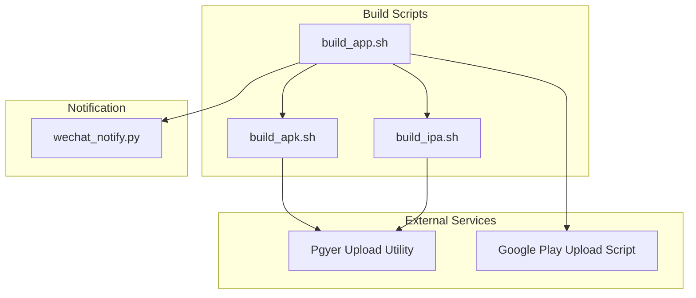
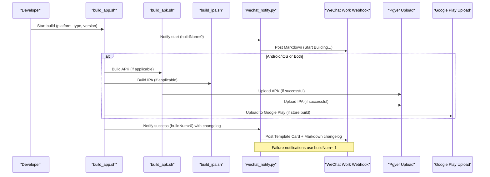
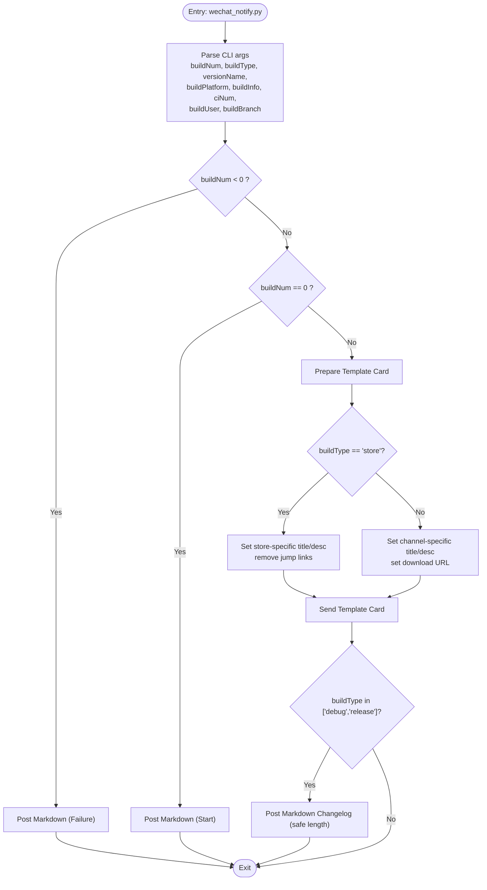
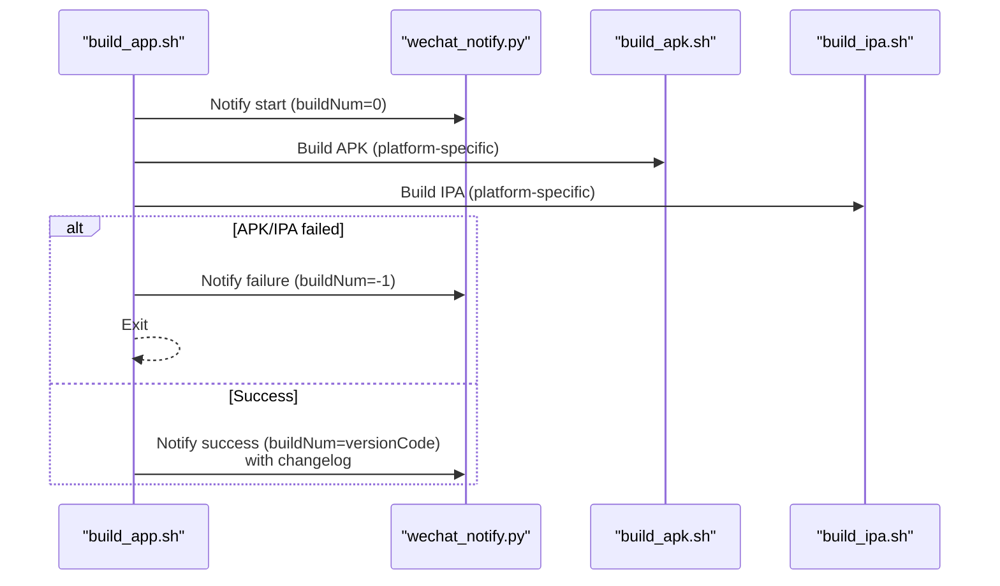
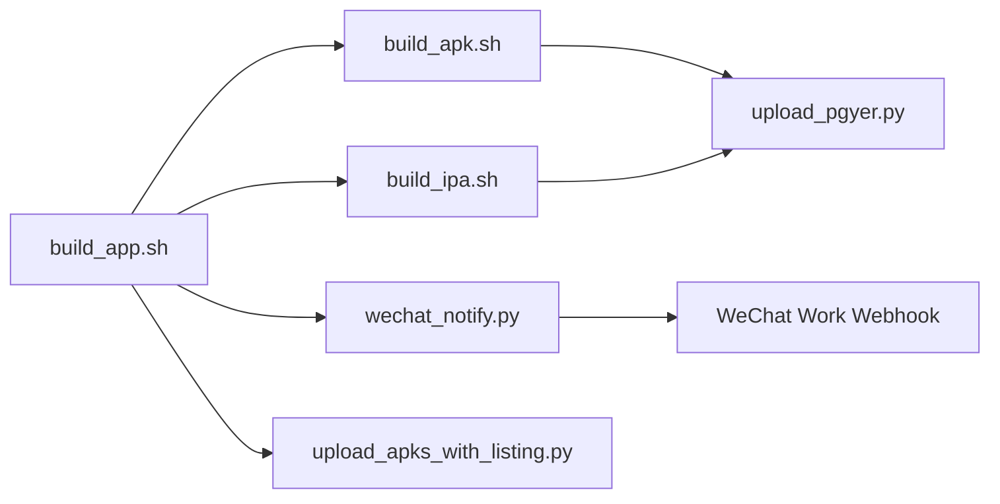

# Notification Systems

<cite>
**Referenced Files in This Document**
- [wechat_notify.py](file://overseaBuild/wechat_notify.py)
- [build_app.sh](file://overseaBuild/build_app.sh)
- [build_apk.sh](file://overseaBuild/build_apk.sh)
- [build_ipa.sh](file://overseaBuild/build_ipa.sh)
- [upload_pgyer.py](file://ciBuild/utils/upload_pgyer.py)
- [upload_apks_with_listing.py](file://overseaBuild/upload_gp/upload_apks_with_listing.py)
- [README.md](file://README.md)
</cite>

## Table of Contents
1. [Introduction](#introduction)
2. [Project Structure](#project-structure)
3. [Core Components](#core-components)
4. [Architecture Overview](#architecture-overview)
5. [Detailed Component Analysis](#detailed-component-analysis)
6. [Dependency Analysis](#dependency-analysis)
7. [Performance Considerations](#performance-considerations)
8. [Troubleshooting Guide](#troubleshooting-guide)
9. [Conclusion](#conclusion)
10. [Appendices](#appendices)

## Introduction
This document describes the Notification Systems in the repository, focusing on WeChat integration for build status notifications and team communication workflows. It explains how build completion notifications are triggered, processed, and delivered to team members, along with message formatting and templates for success, failure, and warning scenarios. Practical guidance is included for configuring WeChat bots, customizing notification messages, and integrating with other communication platforms. The document also covers notification scheduling considerations and provides troubleshooting advice for common delivery issues.

## Project Structure
The notification system spans several build scripts and a dedicated WeChat notification module:
- Build orchestration scripts trigger notifications at various stages of the build pipeline.
- A Python script handles WeChat webhook posting with Markdown and Template Card formats.
- Upload utilities integrate with external services (Pgyer, Google Play) and can be extended to support other platforms.

**Diagram sources**
- [build_app.sh:1-97](file://overseaBuild/build_app.sh#L1-L97)
- [build_apk.sh:1-60](file://overseaBuild/build_apk.sh#L1-L60)
- [build_ipa.sh:1-74](file://overseaBuild/build_ipa.sh#L1-L74)
- [wechat_notify.py:1-146](file://overseaBuild/wechat_notify.py#L1-L146)
- [upload_pgyer.py:1-108](file://ciBuild/utils/upload_pgyer.py#L1-L108)
- [upload_apks_with_listing.py:40-78](file://overseaBuild/upload_gp/upload_apks_with_listing.py#L40-L78)

**Section sources**
- [README.md:1-37](file://README.md#L1-L37)

## Core Components
- WeChat Notification Module: Posts Markdown and Template Card messages to a WeChat Work webhook endpoint. Supports build start, success, and failure notifications.
- Build Orchestration: Orchestrates Android/iOS builds, checks outcomes, and triggers notifications accordingly.
- Upload Utilities: Integrate with Pgyer and Google Play to publish artifacts and can be extended for other platforms.

Key responsibilities:
- Message formatting and templating for different build statuses.
- Triggering notifications on success/failure/warning conditions.
- Linking to downloadable artifacts and related resources.

**Section sources**
- [wechat_notify.py:1-146](file://overseaBuild/wechat_notify.py#L1-L146)
- [build_app.sh:1-97](file://overseaBuild/build_app.sh#L1-L97)
- [build_apk.sh:1-60](file://overseaBuild/build_apk.sh#L1-L60)
- [build_ipa.sh:1-74](file://overseaBuild/build_ipa.sh#L1-L74)
- [upload_pgyer.py:1-108](file://ciBuild/utils/upload_pgyer.py#L1-L108)
- [upload_apks_with_listing.py:40-78](file://overseaBuild/upload_gp/upload_apks_with_listing.py#L40-L78)

## Architecture Overview
The notification architecture follows a pipeline:
- Build scripts detect build outcomes and prepare notification payloads.
- The WeChat notification module posts messages to a webhook endpoint.
- External upload utilities publish artifacts to third-party services and can be integrated into the notification flow.

**Diagram sources**
- [build_app.sh:34-97](file://overseaBuild/build_app.sh#L34-L97)
- [build_apk.sh:1-60](file://overseaBuild/build_apk.sh#L1-L60)
- [build_ipa.sh:1-74](file://overseaBuild/build_ipa.sh#L1-L74)
- [wechat_notify.py:1-146](file://overseaBuild/wechat_notify.py#L1-L146)
- [upload_pgyer.py:1-108](file://ciBuild/utils/upload_pgyer.py#L1-L108)
- [upload_apks_with_listing.py:40-78](file://overseaBuild/upload_gp/upload_apks_with_listing.py#L40-L78)

## Detailed Component Analysis

### WeChat Notification Module
Responsibilities:
- Parse CLI arguments for build metadata.
- Choose message type: Markdown for start/failure, Template Card for success.
- Construct message content with dynamic titles, descriptions, and links.
- Send HTTP POST to WeChat Work webhook endpoint.

Message types and conditions:
- Markdown: buildNum < 0 (failure), buildNum == 0 (start).
- Template Card: buildNum > 0 (success), with optional Markdown changelog for debug/release builds.

Template card highlights:
- News notice card with title, description, image, horizontal content (Trigger, Branch), and jump links.
- Dynamic titles and descriptions based on build type (store, channel) and platform (All, Android, iOS).

Changelog delivery:
- For debug/release builds, a Markdown changelog is posted separately, truncated to a safe length.

**Diagram sources**
- [wechat_notify.py:1-146](file://overseaBuild/wechat_notify.py#L1-L146)

**Section sources**
- [wechat_notify.py:1-146](file://overseaBuild/wechat_notify.py#L1-L146)

### Build Orchestration and Triggering
The build orchestration script coordinates builds and sends notifications:
- Sends a start notification before building.
- Builds Android and/or iOS artifacts depending on platform selection.
- On success, collects changelog and sends a success notification with Template Card and optional changelog.
- On failure, sends a failure notification immediately.

Failure handling:
- Uses negative buildNum (-1) to post failure messages.
- Stops early on critical failures to prevent partial notifications.

Success flow:
- Collects changelog between previous and current commits.
- Sends success notification with build metadata and links.

**Diagram sources**
- [build_app.sh:34-97](file://overseaBuild/build_app.sh#L34-L97)
- [wechat_notify.py:1-146](file://overseaBuild/wechat_notify.py#L1-L146)

**Section sources**
- [build_app.sh:1-97](file://overseaBuild/build_app.sh#L1-L97)

### Android/iOS Build Scripts
- Android build script supports debug, release, and store variants, including app bundle generation for store uploads.
- iOS build script supports debug, release, and store variants, including archive export and dSYM upload.

Integration points:
- Successful builds trigger artifact uploads to Pgyer.
- Store builds trigger Google Play uploads.

**Section sources**
- [build_apk.sh:1-60](file://overseaBuild/build_apk.sh#L1-L60)
- [build_ipa.sh:1-74](file://overseaBuild/build_ipa.sh#L1-L74)

### External Upload Utilities
- Pgyer upload utility manages token acquisition, multipart upload, and polling for build info.
- Google Play upload script integrates with service accounts and tracks upload progress.

These utilities can be extended to emit structured events consumed by the notification system.

**Section sources**
- [upload_pgyer.py:1-108](file://ciBuild/utils/upload_pgyer.py#L1-L108)
- [upload_apks_with_listing.py:40-78](file://overseaBuild/upload_gp/upload_apks_with_listing.py#L40-L78)

## Dependency Analysis
The notification system exhibits layered dependencies:
- Build orchestration depends on platform-specific build scripts.
- Build scripts depend on external upload utilities.
- The notification module depends on the WeChat Work webhook endpoint and external artifact hosting.

**Diagram sources**
- [build_app.sh:1-97](file://overseaBuild/build_app.sh#L1-L97)
- [build_apk.sh:1-60](file://overseaBuild/build_apk.sh#L1-L60)
- [build_ipa.sh:1-74](file://overseaBuild/build_ipa.sh#L1-L74)
- [wechat_notify.py:1-146](file://overseaBuild/wechat_notify.py#L1-L146)
- [upload_pgyer.py:1-108](file://ciBuild/utils/upload_pgyer.py#L1-L108)
- [upload_apks_with_listing.py:40-78](file://overseaBuild/upload_gp/upload_apks_with_listing.py#L40-L78)

**Section sources**
- [build_app.sh:1-97](file://overseaBuild/build_app.sh#L1-L97)
- [wechat_notify.py:1-146](file://overseaBuild/wechat_notify.py#L1-L146)

## Performance Considerations
- Message size limits: The notification module truncates changelog content to a safe length before sending Markdown messages to avoid exceeding platform limits.
- Network retries: External upload utilities implement retry logic and polling to handle transient network issues during artifact publishing.
- Early exits: Build orchestration exits on failure to minimize redundant notifications and resource usage.

[No sources needed since this section provides general guidance]

## Troubleshooting Guide
Common issues and resolutions:
- Webhook endpoint missing or invalid:
  - Verify the webhook URL and key configuration in the notification module.
  - Confirm network connectivity and firewall rules for outbound HTTPS to the WeChat Work endpoint.
- Build failures not reported:
  - Ensure the build orchestration script passes negative buildNum (-1) for failure notifications.
  - Check that the script exits after posting failure notifications.
- Excessive changelog truncation:
  - Adjust the maximum length threshold in the notification module if needed.
  - Consider splitting changelogs into multiple messages for long histories.
- Artifact upload delays:
  - External upload utilities poll for build info; ensure network stability and API credentials are correct.
  - For Google Play uploads, confirm service account permissions and track configuration.
- Platform-specific build errors:
  - Validate Flutter/Xcode toolchains and export options for iOS.
  - Confirm Gradle and signing configurations for Android.

**Section sources**
- [wechat_notify.py:136-145](file://overseaBuild/wechat_notify.py#L136-L145)
- [build_app.sh:44-82](file://overseaBuild/build_app.sh#L44-L82)
- [upload_pgyer.py:63-85](file://ciBuild/utils/upload_pgyer.py#L63-L85)
- [upload_apks_with_listing.py:40-78](file://overseaBuild/upload_gp/upload_apks_with_listing.py#L40-L78)

## Conclusion
The notification system integrates tightly with the build pipeline to deliver timely, contextual updates to team members via WeChat Work. It supports multiple build statuses and artifact types, with extensible hooks for additional platforms. By following the configuration and troubleshooting guidance, teams can maintain reliable and informative notifications across diverse build environments.

[No sources needed since this section summarizes without analyzing specific files]

## Appendices

### A. Notification Templates and Message Types
- Start notification (Markdown):
  - Content includes a “Start Building” message and contextual metadata.
- Success notification (Template Card + Markdown):
  - Template Card: dynamic title/description based on build type and platform, with optional jump links.
  - Markdown: recent commit changelog for debug/release builds.
- Failure notification (Markdown):
  - Immediate failure message with a link to the build job for investigation.

**Section sources**
- [wechat_notify.py:22-43](file://overseaBuild/wechat_notify.py#L22-L43)
- [wechat_notify.py:88-128](file://overseaBuild/wechat_notify.py#L88-L128)
- [wechat_notify.py:133-145](file://overseaBuild/wechat_notify.py#L133-L145)
- [build_app.sh:44-82](file://overseaBuild/build_app.sh#L44-L82)

### B. Practical Configuration Examples
- Configure WeChat bot:
  - Obtain a webhook key from the WeChat Work group chat and set it in the notification module’s endpoint configuration.
- Customize notification messages:
  - Modify message content and links in the notification module for branding or routing.
- Manage notification preferences:
  - Use the build orchestration script to gate notifications by build type or platform.
- Integrate with other platforms:
  - Extend the notification module to support Slack, MS Teams, or email by adding handlers and endpoints.
- Notification scheduling:
  - Schedule periodic build status summaries by invoking the notification module independently of the build pipeline.

[No sources needed since this section provides general guidance]