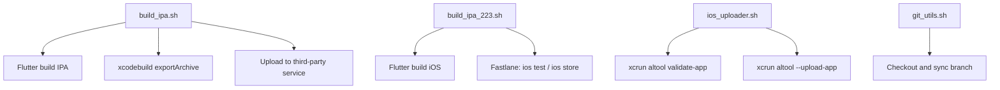
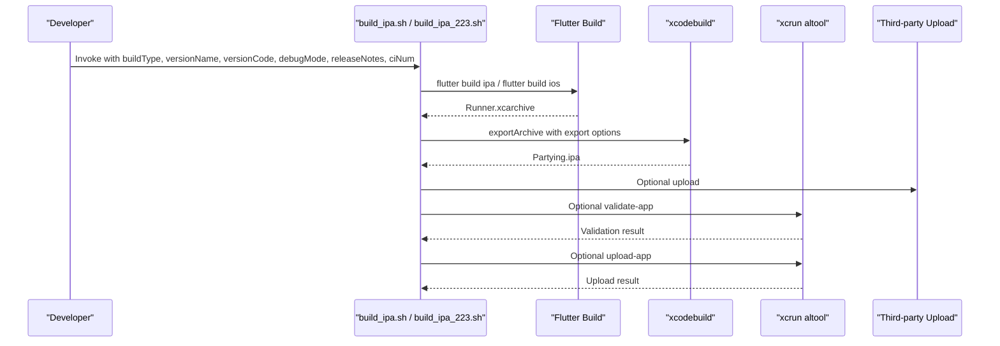
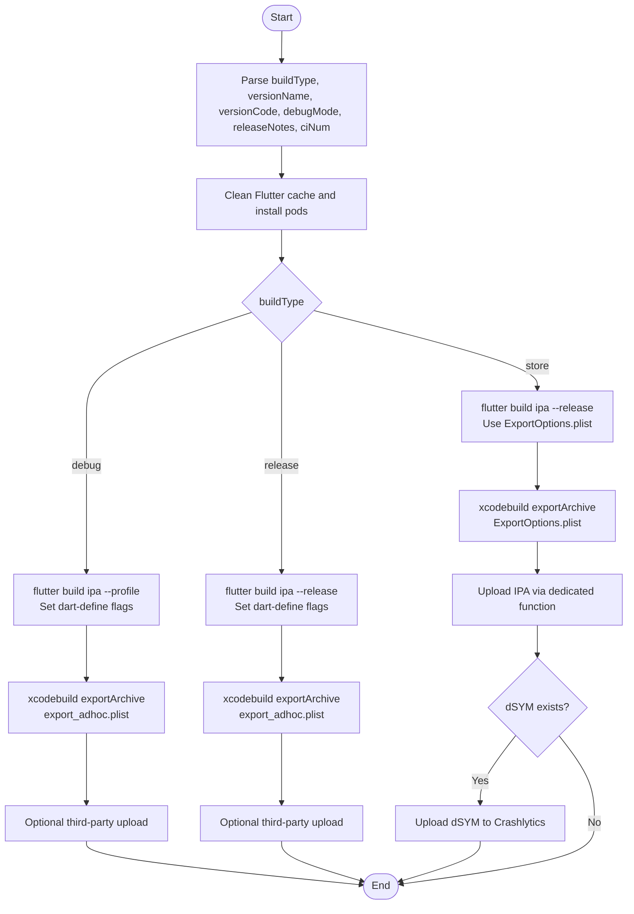
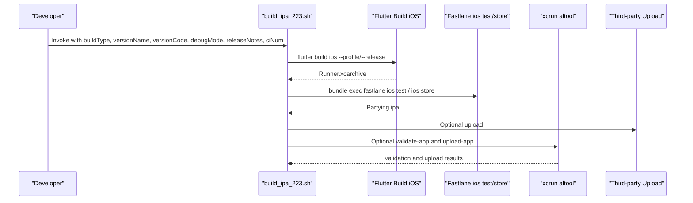
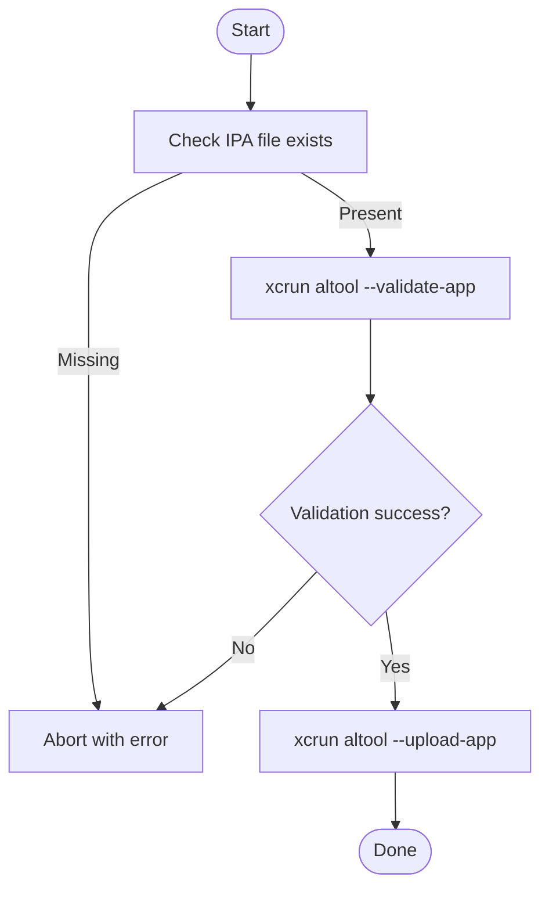
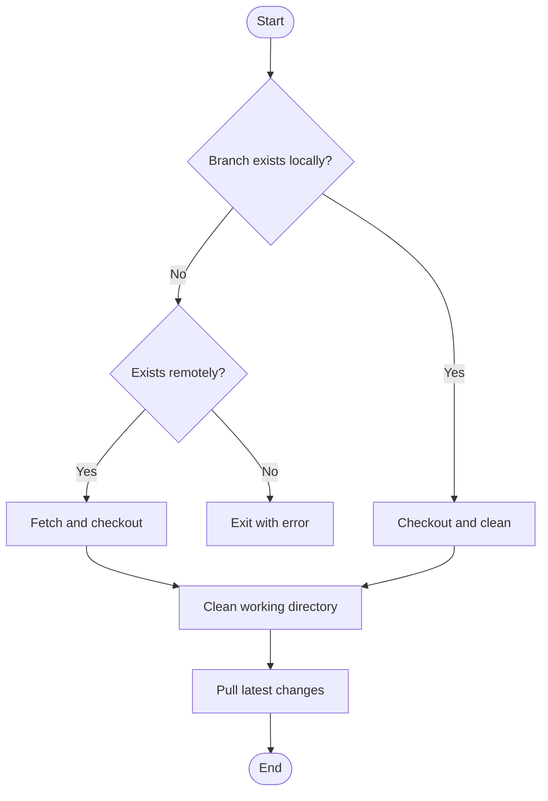
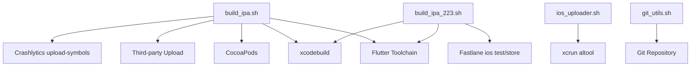

# iOS Deployment

<cite>
**Referenced Files in This Document**
- [README.md](file://README.md)
- [build_ipa.sh](file://overseaBuild/build_ipa.sh)
- [build_ipa_223.sh](file://overseaBuild/build_ipa_223.sh)
- [ios_uploader.sh](file://overseaBuild/ios_uploader.sh)
- [git_utils.sh](file://overseaBuild/git_utils.sh)
</cite>

## Table of Contents
1. [Introduction](#introduction)
2. [Project Structure](#project-structure)
3. [Core Components](#core-components)
4. [Architecture Overview](#architecture-overview)
5. [Detailed Component Analysis](#detailed-component-analysis)
6. [Dependency Analysis](#dependency-analysis)
7. [Performance Considerations](#performance-considerations)
8. [Troubleshooting Guide](#troubleshooting-guide)
9. [Conclusion](#conclusion)
10. [Appendices](#appendices)

## Introduction
This document explains the iOS deployment workflows present in the repository, focusing on Flutter-based iOS builds, archive creation, IPA generation, and Apple Transporter uploads. It covers:
- Build pipeline stages: Flutter build, archive creation, and IPA export
- Distribution modes: debug/profile, release, and store builds
- Upload mechanisms via Apple Transporter (altool) and third-party services
- Practical guidance for export options, code signing, and provisioning profiles
- Troubleshooting tips and best practices for secure distribution

Where applicable, the document references the exact script files and functions used in the repository to keep the content traceable and accurate.

## Project Structure
The iOS deployment logic is primarily implemented in two shell scripts under the overseaBuild directory, along with supporting utilities:
- build_ipa.sh: orchestrates debug, release, and store builds, exports IPA, and optionally uploads to a third-party service
- build_ipa_223.sh: similar orchestration but integrates Fastlane for store and test builds
- ios_uploader.sh: Apple Transporter upload and validation helpers
- git_utils.sh: Git utilities used during build preparation

**Diagram sources**
- [build_ipa.sh:15-73](file://overseaBuild/build_ipa.sh#L15-L73)
- [build_ipa_223.sh:15-80](file://overseaBuild/build_ipa_223.sh#L15-L80)
- [ios_uploader.sh:7-45](file://overseaBuild/ios_uploader.sh#L7-L45)
- [git_utils.sh:63-90](file://overseaBuild/git_utils.sh#L63-L90)

**Section sources**
- [README.md:1-37](file://README.md#L1-L37)
- [build_ipa.sh:1-74](file://overseaBuild/build_ipa.sh#L1-L74)
- [build_ipa_223.sh:1-81](file://overseaBuild/build_ipa_223.sh#L1-L81)
- [ios_uploader.sh:1-81](file://overseaBuild/ios_uploader.sh#L1-L81)
- [git_utils.sh:1-90](file://overseaBuild/git_utils.sh#L1-L90)

## Core Components
- iOS build orchestration scripts:
  - build_ipa.sh: supports debug/profile, release, and store build modes; exports IPA and optionally uploads to a third-party service
  - build_ipa_223.sh: similar logic with Fastlane integration for store and test builds
- Apple Transporter utilities:
  - ios_uploader.sh: wraps xcrun altool for validation and upload, and exposes interactive API key/issuer entry
- Git utilities:
  - git_utils.sh: branch existence checks and safe checkout/pull routines

**Section sources**
- [build_ipa.sh:15-73](file://overseaBuild/build_ipa.sh#L15-L73)
- [build_ipa_223.sh:15-80](file://overseaBuild/build_ipa_223.sh#L15-L80)
- [ios_uploader.sh:7-45](file://overseaBuild/ios_uploader.sh#L7-L45)
- [git_utils.sh:1-90](file://overseaBuild/git_utils.sh#L1-L90)

## Architecture Overview
The iOS build pipeline follows a consistent flow across scripts:
- Prepare environment (clean Flutter cache, install pods)
- Build the Flutter iOS target (IPA or archive)
- Export IPA using xcodebuild with export options
- Optional third-party upload
- Optional Apple Transporter validation and upload

**Diagram sources**
- [build_ipa.sh:15-73](file://overseaBuild/build_ipa.sh#L15-L73)
- [build_ipa_223.sh:15-80](file://overseaBuild/build_ipa_223.sh#L15-L80)
- [ios_uploader.sh:7-45](file://overseaBuild/ios_uploader.sh#L7-L45)

## Detailed Component Analysis

### build_ipa.sh: iOS Build and Export Orchestration
Responsibilities:
- Accepts buildType, versionName, versionCode, debugMode, releaseNotes, ciNum
- Cleans Flutter cache and installs pods
- Builds IPA for debug/profile or release modes
- Exports IPA using xcodebuild with export options
- Optionally uploads IPA to a third-party service
- Uploads dSYM to Crashlytics if available

Key behaviors:
- Debug/profile mode: uses Flutter profile mode and exports via xcodebuild with ad-hoc export options
- Release mode: uses Flutter release mode and exports via xcodebuild with ad-hoc export options
- Store mode: uses Flutter release mode with export options plist and uploads IPA via a dedicated function

**Diagram sources**
- [build_ipa.sh:15-73](file://overseaBuild/build_ipa.sh#L15-L73)

**Section sources**
- [build_ipa.sh:1-74](file://overseaBuild/build_ipa.sh#L1-L74)

### build_ipa_223.sh: Fastlane-Integrated iOS Build
Responsibilities:
- Similar to build_ipa.sh but integrates Fastlane for store and test builds
- Uses Flutter build iOS for both debug/release modes
- Invokes Fastlane lanes: ios test and ios store
- Supports optional third-party upload and dSYM upload

**Diagram sources**
- [build_ipa_223.sh:15-80](file://overseaBuild/build_ipa_223.sh#L15-L80)
- [ios_uploader.sh:7-45](file://overseaBuild/ios_uploader.sh#L7-L45)

**Section sources**
- [build_ipa_223.sh:1-81](file://overseaBuild/build_ipa_223.sh#L1-L81)

### ios_uploader.sh: Apple Transporter Utilities
Responsibilities:
- Validates an IPA with xcrun altool
- Uploads an IPA with xcrun altool
- Interactive prompt for API key and issuer ID
- Robustness checks for missing IPA files

**Diagram sources**
- [ios_uploader.sh:7-45](file://overseaBuild/ios_uploader.sh#L7-L45)

**Section sources**
- [ios_uploader.sh:1-81](file://overseaBuild/ios_uploader.sh#L1-L81)

### git_utils.sh: Git Preparation Utilities
Responsibilities:
- Check local and remote branch existence
- Safely reset working directory and checkout a branch
- Clean untracked files and pull latest changes

**Diagram sources**
- [git_utils.sh:1-90](file://overseaBuild/git_utils.sh#L1-L90)

**Section sources**
- [git_utils.sh:1-90](file://overseaBuild/git_utils.sh#L1-L90)

## Dependency Analysis
- build_ipa.sh depends on:
  - Flutter toolchain for building IPA
  - CocoaPods installation in the iOS directory
  - xcodebuild for exporting archives to IPA
  - Optional third-party upload endpoint
  - Crashlytics upload-symbols for dSYM processing
- build_ipa_223.sh additionally depends on:
  - Fastlane lanes ios test and ios store
- ios_uploader.sh depends on:
  - xcrun altool (Apple Transporter)
  - API key and issuer ID for validation and upload
- git_utils.sh is independent but commonly used before builds to ensure a clean, correct branch state

**Diagram sources**
- [build_ipa.sh:15-73](file://overseaBuild/build_ipa.sh#L15-L73)
- [build_ipa_223.sh:15-80](file://overseaBuild/build_ipa_223.sh#L15-L80)
- [ios_uploader.sh:7-45](file://overseaBuild/ios_uploader.sh#L7-L45)
- [git_utils.sh:63-90](file://overseaBuild/git_utils.sh#L63-L90)

**Section sources**
- [build_ipa.sh:15-73](file://overseaBuild/build_ipa.sh#L15-L73)
- [build_ipa_223.sh:15-80](file://overseaBuild/build_ipa_223.sh#L15-L80)
- [ios_uploader.sh:7-45](file://overseaBuild/ios_uploader.sh#L7-L45)
- [git_utils.sh:63-90](file://overseaBuild/git_utils.sh#L63-L90)

## Performance Considerations
- Prefer release builds for production distribution to minimize runtime overhead.
- Use export options appropriate for distribution channels to avoid unnecessary processing.
- Keep Flutter dependencies up to date and clean caches before builds to reduce incremental build times.
- Avoid redundant archive exports by reusing existing xcarchive when possible.

[No sources needed since this section provides general guidance]

## Troubleshooting Guide
Common issues and remedies:
- Missing or invalid API key/issuer:
  - Use the interactive prompt in ios_uploader.sh to set credentials
  - Ensure API key and issuer ID are correctly configured before validation/upload
- IPA not found:
  - Verify exportArchive step completes and the IPA path exists
  - Confirm export options plist paths are correct
- Archive export failures:
  - Ensure xcodebuild export options are valid for the selected distribution method
  - Confirm provisioning profiles and signing identities are installed and match the export options
- dSYM upload failures:
  - Verify Crashlytics upload-symbols path and GoogleService-Info.plist location
  - Ensure dSYM exists after archive creation

**Section sources**
- [ios_uploader.sh:49-81](file://overseaBuild/ios_uploader.sh#L49-L81)
- [build_ipa.sh:40-73](file://overseaBuild/build_ipa.sh#L40-L73)
- [build_ipa_223.sh:42-80](file://overseaBuild/build_ipa_223.sh#L42-L80)

## Conclusion
The repository provides robust iOS build and upload automation through shell scripts and Apple Transporter utilities. The scripts support multiple build modes, export options, and optional third-party distribution. Integrating Fastlane further streamlines store and test deployments. By following the documented workflows and troubleshooting steps, teams can reliably produce and distribute iOS builds with minimal friction.

[No sources needed since this section summarizes without analyzing specific files]

## Appendices

### Practical Examples and References
- Build invocation examples:
  - Debug/profile build with optional debug flags and CI number
  - Release build with debug flags toggled
  - Store build using export options plist and dedicated upload function
- Upload via Apple Transporter:
  - Validation followed by upload using API key and issuer ID
- Git preparation:
  - Ensure a clean working directory and correct branch before building

**Section sources**
- [build_ipa.sh:40-73](file://overseaBuild/build_ipa.sh#L40-L73)
- [build_ipa_223.sh:42-80](file://overseaBuild/build_ipa_223.sh#L42-L80)
- [ios_uploader.sh:7-45](file://overseaBuild/ios_uploader.sh#L7-L45)
- [git_utils.sh:63-90](file://overseaBuild/git_utils.sh#L63-L90)