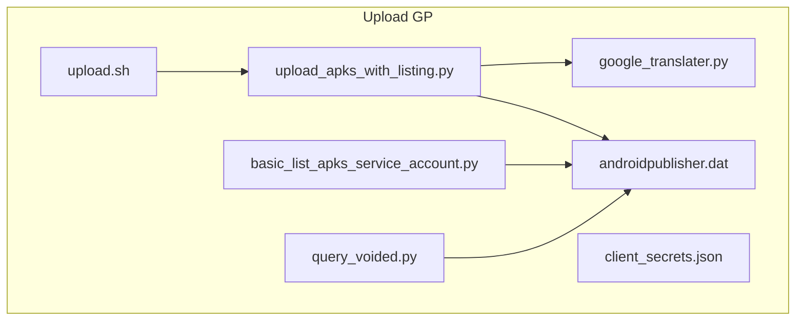
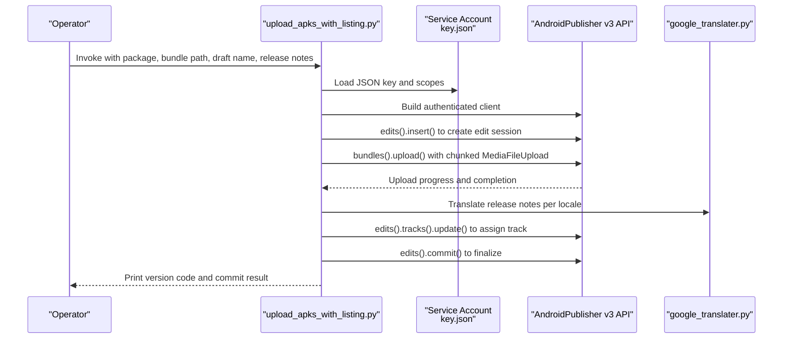
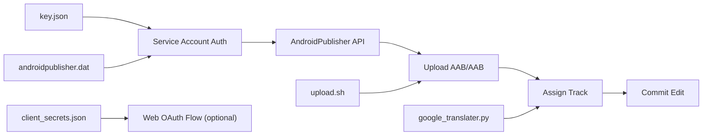

# Google Play Integration

<cite>
**Referenced Files in This Document**
- [upload_apks_with_listing.py](file://overseaBuild/upload_gp/upload_apks_with_listing.py)
- [basic_list_apks_service_account.py](file://overseaBuild/upload_gp/basic_list_apks_service_account.py)
- [query_voided.py](file://overseaBuild/upload_gp/query_voided.py)
- [client_secrets.json](file://overseaBuild/upload_gp/client_secrets.json)
- [androidpublisher.dat](file://overseaBuild/upload_gp/androidpublisher.dat)
- [google_translater.py](file://overseaBuild/upload_gp/google_translater.py)
- [upload.sh](file://overseaBuild/upload_gp/upload.sh)
</cite>

## Table of Contents
1. [Introduction](#introduction)
2. [Project Structure](#project-structure)
3. [Core Components](#core-components)
4. [Architecture Overview](#architecture-overview)
5. [Detailed Component Analysis](#detailed-component-analysis)
6. [Dependency Analysis](#dependency-analysis)
7. [Performance Considerations](#performance-considerations)
8. [Troubleshooting Guide](#troubleshooting-guide)
9. [Conclusion](#conclusion)
10. [Appendices](#appendices)

## Introduction
This document explains the Google Play integration system used to automate Android app publishing via the Google Play Developer API. It covers service account configuration, OAuth2 authentication, app bundle upload, track management, release notes translation, and operational best practices. It also documents security considerations, credential management, and access token refresh mechanisms.

## Project Structure
The Google Play integration resides under overseaBuild/upload_gp and includes:
- Upload script for bundles and listing updates
- Service-account-based listing query and subscription verification
- Voided purchases listing utility
- OAuth2 client secrets and stored tokens
- Translation utility for release notes
- Shell wrapper to drive interactive uploads

**Diagram sources**
- [upload_apks_with_listing.py:1-198](file://overseaBuild/upload_gp/upload_apks_with_listing.py#L1-L198)
- [basic_list_apks_service_account.py:1-89](file://overseaBuild/upload_gp/basic_list_apks_service_account.py#L1-L89)
- [query_voided.py:1-88](file://overseaBuild/upload_gp/query_voided.py#L1-L88)
- [client_secrets.json:1-9](file://overseaBuild/upload_gp/client_secrets.json#L1-L9)
- [androidpublisher.dat:1-25](file://overseaBuild/upload_gp/androidpublisher.dat#L1-L25)
- [google_translater.py:1-38](file://overseaBuild/upload_gp/google_translater.py#L1-L38)
- [upload.sh:1-25](file://overseaBuild/upload_gp/upload.sh#L1-L25)

**Section sources**
- [upload_apks_with_listing.py:1-198](file://overseaBuild/upload_gp/upload_apks_with_listing.py#L1-L198)
- [basic_list_apks_service_account.py:1-89](file://overseaBuild/upload_gp/basic_list_apks_service_account.py#L1-L89)
- [query_voided.py:1-88](file://overseaBuild/upload_gp/query_voided.py#L1-L88)
- [client_secrets.json:1-9](file://overseaBuild/upload_gp/client_secrets.json#L1-L9)
- [androidpublisher.dat:1-25](file://overseaBuild/upload_gp/androidpublisher.dat#L1-L25)
- [google_translater.py:1-38](file://overseaBuild/upload_gp/google_translater.py#L1-L38)
- [upload.sh:1-25](file://overseaBuild/upload_gp/upload.sh#L1-L25)

## Core Components
- Service account authentication via JSON key file and Google API client libraries
- Resumable bundle upload with chunked transfers and progress reporting
- Listing update and track assignment (alpha, beta, production, rollout)
- Release notes translation across multiple locales
- Stored OAuth2 tokens for programmatic access
- Interactive shell wrapper to orchestrate uploads

**Section sources**
- [upload_apks_with_listing.py:93-198](file://overseaBuild/upload_gp/upload_apks_with_listing.py#L93-L198)
- [basic_list_apks_service_account.py:40-89](file://overseaBuild/upload_gp/basic_list_apks_service_account.py#L40-L89)
- [query_voided.py:38-88](file://overseaBuild/upload_gp/query_voided.py#L38-L88)
- [androidpublisher.dat:1-25](file://overseaBuild/upload_gp/androidpublisher.dat#L1-L25)
- [google_translater.py:11-22](file://overseaBuild/upload_gp/google_translater.py#L11-L22)
- [upload.sh:7-24](file://overseaBuild/upload_gp/upload.sh#L7-L24)

## Architecture Overview
The system authenticates using a service account, builds the Play Developer API client, performs a resumable bundle upload, and then assigns the uploaded version to a selected track with localized release notes.

**Diagram sources**
- [upload_apks_with_listing.py:93-198](file://overseaBuild/upload_gp/upload_apks_with_listing.py#L93-L198)
- [google_translater.py:11-22](file://overseaBuild/upload_gp/google_translater.py#L11-L22)

## Detailed Component Analysis

### Service Account Authentication and OAuth2 Setup
- Service account credentials are loaded from a JSON key file and authorized against the Android Publisher scope.
- Stored OAuth2 tokens are provided in a serialized form for programmatic reuse.
- Legacy OAuth2 client secrets are included for potential web flow scenarios.

Key behaviors:
- Loading service account credentials from a JSON key file
- Building an authorized HTTP client for API calls
- Using stored tokens to avoid repeated consent prompts

Security notes:
- Keep the JSON key file secure and restrict access.
- Rotate keys periodically and revoke unused ones.
- Avoid committing secrets to version control.

**Section sources**
- [upload_apks_with_listing.py:94-98](file://overseaBuild/upload_gp/upload_apks_with_listing.py#L94-L98)
- [basic_list_apks_service_account.py:51-55](file://overseaBuild/upload_gp/basic_list_apks_service_account.py#L51-L55)
- [androidpublisher.dat:1-25](file://overseaBuild/upload_gp/androidpublisher.dat#L1-L25)
- [client_secrets.json:1-9](file://overseaBuild/upload_gp/client_secrets.json#L1-L9)

### App Bundle Upload Pipeline
- Creates an edit session, uploads the AAB using a resumable chunked upload, and prints progress.
- Commits the edit after successful upload.
- Supports APKs and AABs by registering appropriate MIME types.

Upload characteristics:
- Chunk size configured for efficient transfer
- Progress indicator with percentage and visual bar
- Robust handling of network interruptions via resumable upload

**Section sources**
- [upload_apks_with_listing.py:108-141](file://overseaBuild/upload_gp/upload_apks_with_listing.py#L108-L141)
- [upload_apks_with_listing.py:113-119](file://overseaBuild/upload_gp/upload_apks_with_listing.py#L113-L119)

### Track Management
- Assigns the uploaded version to a track (alpha, beta, production, rollout).
- Sets a draft release with a human-readable name and localized release notes.
- Commits the track update.

Operational guidance:
- Choose the appropriate track based on rollout strategy.
- Use draft releases for pre-release testing and validation.

**Section sources**
- [upload_apks_with_listing.py:176-191](file://overseaBuild/upload_gp/upload_apks_with_listing.py#L176-L191)
- [upload_apks_with_listing.py:52-73](file://overseaBuild/upload_gp/upload_apks_with_listing.py#L52-L73)

### Release Notes Translation Automation
- Generates release notes for multiple locales.
- Uses a translation utility to convert from a source language to target languages.
- Enforces a maximum length per note and validates lengths.

Supported locales:
- Regional variants and simplified/traditional Chinese variants are handled explicitly.

**Section sources**
- [upload_apks_with_listing.py:147-170](file://overseaBuild/upload_gp/upload_apks_with_listing.py#L147-L170)
- [google_translater.py:11-22](file://overseaBuild/upload_gp/google_translater.py#L11-L22)

### Listing Query and Subscription Verification
- Demonstrates service account-based queries against purchases and subscriptions.
- Useful for validating entitlements and subscription states.

**Section sources**
- [basic_list_apks_service_account.py:66-74](file://overseaBuild/upload_gp/basic_list_apks_service_account.py#L66-L74)

### Voided Purchases Listing
- Lists voided purchases for diagnostics and reporting.
- Writes structured output to a local JSON file.

**Section sources**
- [query_voided.py:67-74](file://overseaBuild/upload_gp/query_voided.py#L67-L74)

### Interactive Upload Wrapper
- Provides a shell script to select the app, enter draft name, bundle path, and release notes.
- Invokes the Python upload script with collected parameters.

**Section sources**
- [upload.sh:7-24](file://overseaBuild/upload_gp/upload.sh#L7-L24)

## Dependency Analysis
High-level dependencies among scripts and resources:

**Diagram sources**
- [upload_apks_with_listing.py:94-98](file://overseaBuild/upload_gp/upload_apks_with_listing.py#L94-L98)
- [client_secrets.json:1-9](file://overseaBuild/upload_gp/client_secrets.json#L1-L9)
- [androidpublisher.dat:1-25](file://overseaBuild/upload_gp/androidpublisher.dat#L1-L25)
- [google_translater.py:11-22](file://overseaBuild/upload_gp/google_translater.py#L11-L22)
- [upload.sh:24-24](file://overseaBuild/upload_gp/upload.sh#L24-L24)

**Section sources**
- [upload_apks_with_listing.py:93-198](file://overseaBuild/upload_gp/upload_apks_with_listing.py#L93-L198)
- [basic_list_apks_service_account.py:40-89](file://overseaBuild/upload_gp/basic_list_apks_service_account.py#L40-L89)
- [query_voided.py:38-88](file://overseaBuild/upload_gp/query_voided.py#L38-L88)
- [client_secrets.json:1-9](file://overseaBuild/upload_gp/client_secrets.json#L1-L9)
- [androidpublisher.dat:1-25](file://overseaBuild/upload_gp/androidpublisher.dat#L1-L25)
- [google_translater.py:11-22](file://overseaBuild/upload_gp/google_translater.py#L11-L22)
- [upload.sh:7-24](file://overseaBuild/upload_gp/upload.sh#L7-L24)

## Performance Considerations
- Chunked uploads reduce memory overhead and enable resume on interruption.
- Progress reporting helps monitor long-running transfers.
- Limiting concurrent edits and batching track updates improves stability.

## Troubleshooting Guide
Common issues and resolutions:
- Access token refresh failures: Re-run the script to re-authorize; ensure stored tokens are valid and not expired.
- Upload stuck or interrupted: Resumable chunked upload handles retries; verify network connectivity and disk space.
- Track assignment errors: Confirm the uploaded version code exists and the track value matches supported values.
- Release notes too long: The system enforces a maximum length per note; trim or summarize content accordingly.
- Locale-specific translations: Ensure the translation utility endpoint is reachable and the source text is valid.

Operational checks:
- Verify service account permissions for the app.
- Confirm the JSON key file path and scope alignment.
- Validate the package name and bundle path.

**Section sources**
- [upload_apks_with_listing.py:143-145](file://overseaBuild/upload_gp/upload_apks_with_listing.py#L143-L145)
- [upload_apks_with_listing.py:167-169](file://overseaBuild/upload_gp/upload_apks_with_listing.py#L167-L169)

## Conclusion
The Google Play integration automates secure, repeatable publishing workflows using service accounts and the Android Publisher API. It supports resumable uploads, multi-language release notes, and flexible track assignments. By following the security and operational guidelines in this document, teams can reliably publish updates at scale.

## Appendices

### Practical Examples

- Service account setup
  - Create a service account in the Google Cloud Console and download the JSON key file.
  - Grant the service account access to the app in the Google Play Console.
  - Store the JSON key securely and reference it in the authentication step.

- API authentication errors
  - If access token refresh fails, rerun the script to re-authorize.
  - Ensure the JSON key file path is correct and the scope includes the Android Publisher API.

- Upload troubleshooting
  - For interrupted uploads, rely on resumable chunked transfers.
  - Validate the package name and bundle path before running the upload.
  - Confirm the track value is one of the supported values.

- Security considerations
  - Protect the JSON key file and stored tokens.
  - Limit permissions to the minimum required for publishing tasks.
  - Monitor and rotate credentials regularly.

- Access token refresh mechanisms
  - The system uses stored OAuth2 tokens; ensure they remain valid.
  - If refresh fails, regenerate tokens and update the stored token file.