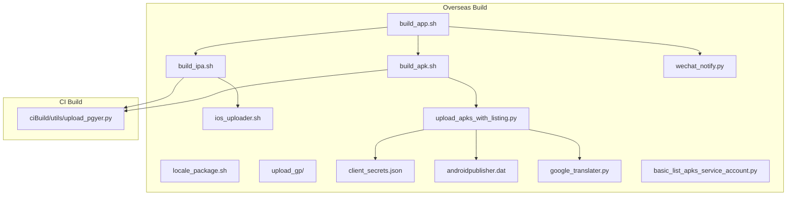
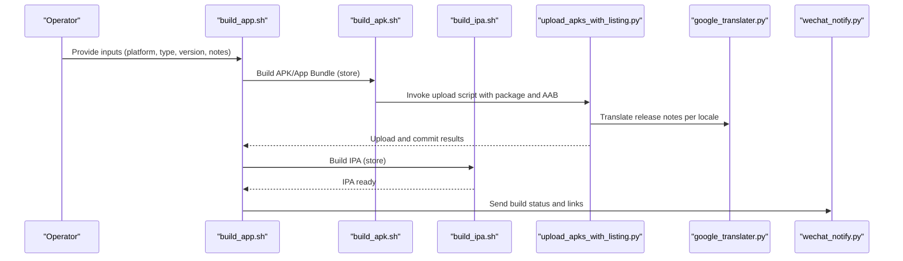
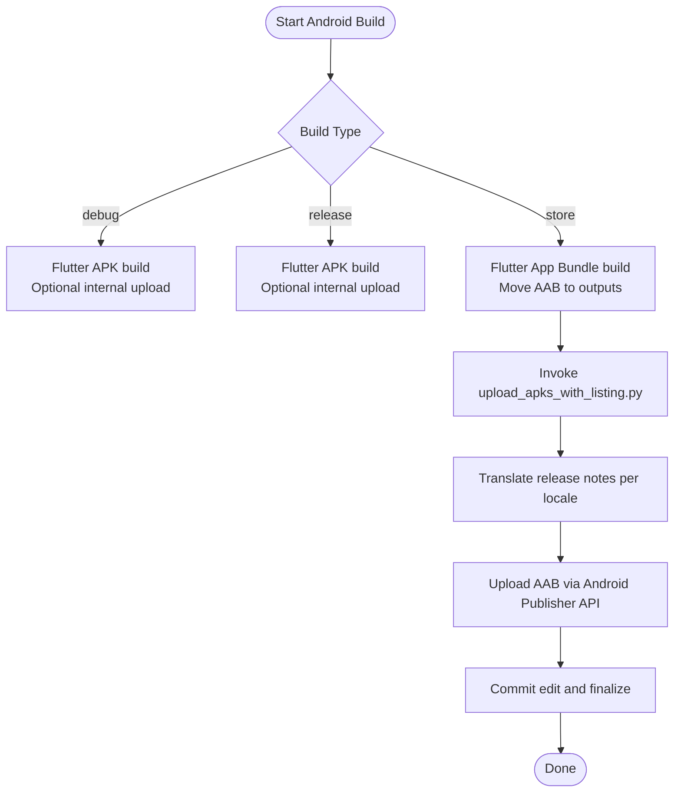
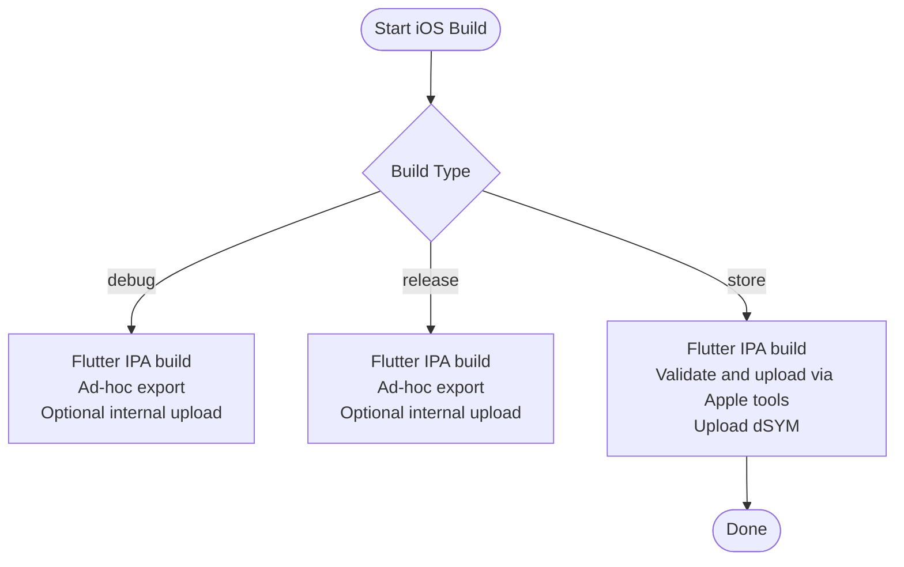
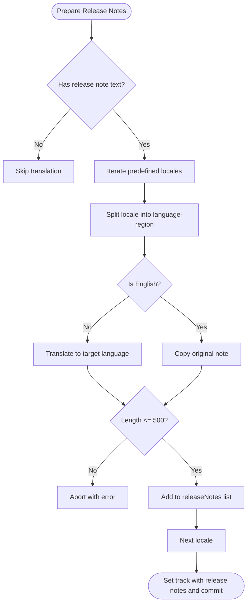
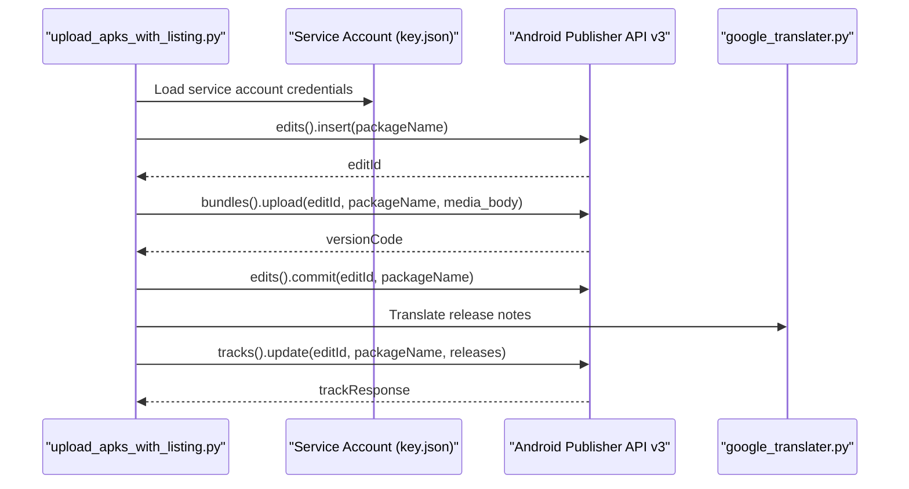
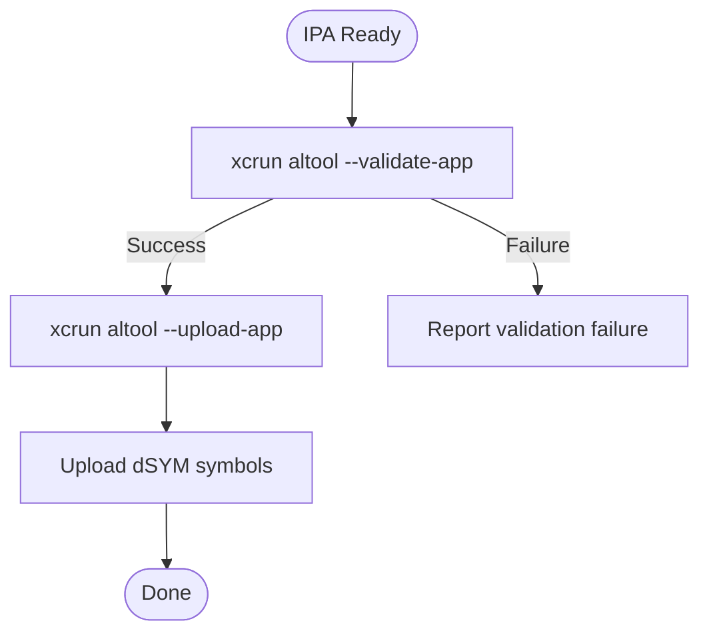
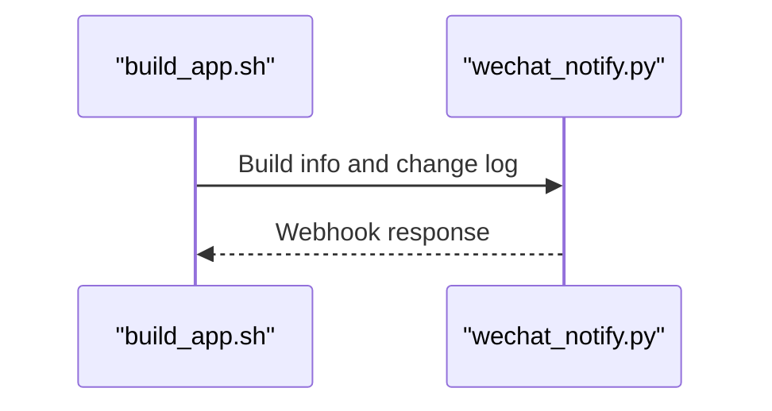
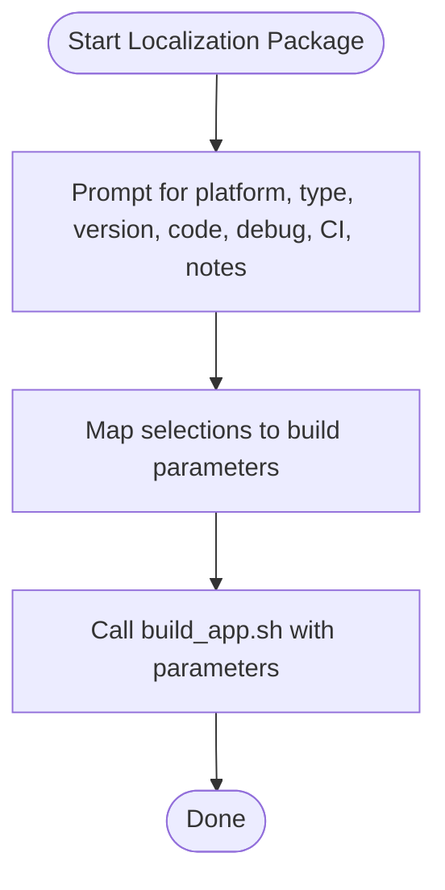
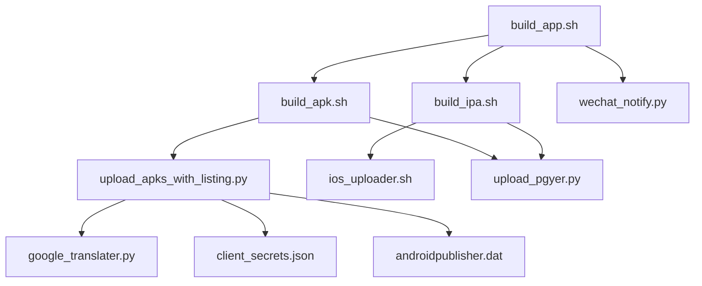

# International Distribution System

<cite>
**Referenced Files in This Document**
- [README.md](file://README.md)
- [build_app.sh](file://overseaBuild/build_app.sh)
- [build_apk.sh](file://overseaBuild/build_apk.sh)
- [build_ipa.sh](file://overseaBuild/build_ipa.sh)
- [ios_uploader.sh](file://overseaBuild/ios_uploader.sh)
- [locale_package.sh](file://overseaBuild/locale_package.sh)
- [upload_apks_with_listing.py](file://overseaBuild/upload_gp/upload_apks_with_listing.py)
- [basic_list_apks_service_account.py](file://overseaBuild/upload_gp/basic_list_apks_service_account.py)
- [google_translater.py](file://overseaBuild/upload_gp/google_translater.py)
- [client_secrets.json](file://overseaBuild/upload_gp/client_secrets.json)
- [androidpublisher.dat](file://overseaBuild/upload_gp/androidpublisher.dat)
- [wechat_notify.py](file://overseaBuild/wechat_notify.py)
- [upload_pgyer.py](file://ciBuild/utils/upload_pgyer.py)
</cite>

## Table of Contents
1. [Introduction](#introduction)
2. [Project Structure](#project-structure)
3. [Core Components](#core-components)
4. [Architecture Overview](#architecture-overview)
5. [Detailed Component Analysis](#detailed-component-analysis)
6. [Dependency Analysis](#dependency-analysis)
7. [Performance Considerations](#performance-considerations)
8. [Troubleshooting Guide](#troubleshooting-guide)
9. [Conclusion](#conclusion)
10. [Appendices](#appendices)

## Introduction
This document describes the international distribution system used to build, localize, and distribute Android and iOS applications across multiple regions. It covers:
- Google Play integration via service account authentication and App Bundle upload
- Localization and metadata management for multi-language support
- iOS build and distribution workflows with Flutter, IPA generation, and Apple services
- The complete internationalization pipeline from localization package generation to automated uploads
- Regional compliance considerations, content delivery optimization, and notification systems

## Project Structure
The international distribution system is organized around a set of shell scripts and Python utilities that orchestrate builds, localization, uploads, and notifications.

**Diagram sources**
- [build_app.sh:1-97](file://overseaBuild/build_app.sh#L1-L97)
- [build_apk.sh:1-60](file://overseaBuild/build_apk.sh#L1-L60)
- [build_ipa.sh:1-74](file://overseaBuild/build_ipa.sh#L1-L74)
- [ios_uploader.sh:1-81](file://overseaBuild/ios_uploader.sh#L1-L81)
- [locale_package.sh:1-32](file://overseaBuild/locale_package.sh#L1-L32)
- [upload_apks_with_listing.py:1-198](file://overseaBuild/upload_gp/upload_apks_with_listing.py#L1-L198)
- [google_translater.py:1-38](file://overseaBuild/upload_gp/google_translater.py#L1-L38)
- [client_secrets.json:1-9](file://overseaBuild/upload_gp/client_secrets.json#L1-L9)
- [androidpublisher.dat:1-25](file://overseaBuild/upload_gp/androidpublisher.dat#L1-L25)
- [basic_list_apks_service_account.py:1-89](file://overseaBuild/upload_gp/basic_list_apks_service_account.py#L1-L89)
- [wechat_notify.py:1-146](file://overseaBuild/wechat_notify.py#L1-L146)
- [upload_pgyer.py:1-108](file://ciBuild/utils/upload_pgyer.py#L1-L108)

**Section sources**
- [README.md:1-37](file://README.md#L1-L37)
- [build_app.sh:1-97](file://overseaBuild/build_app.sh#L1-L97)

## Core Components
- Build Orchestration
  - Orchestrates Android and iOS builds across platforms and build types.
  - Coordinates localization packaging and distribution notifications.
- Android Build and Upload
  - Builds APKs and App Bundles with Flutter, uploads to internal distribution, and triggers Google Play uploads for store builds.
- iOS Build and Upload
  - Generates IPA artifacts, validates and uploads to Apple services, and uploads dSYM symbols.
- Localization and Metadata Management
  - Translates release notes into multiple languages and prepares listings for Google Play.
- Notification System
  - Sends build status and links to internal chat channels.

**Section sources**
- [build_app.sh:1-97](file://overseaBuild/build_app.sh#L1-L97)
- [build_apk.sh:1-60](file://overseaBuild/build_apk.sh#L1-L60)
- [build_ipa.sh:1-74](file://overseaBuild/build_ipa.sh#L1-L74)
- [upload_apks_with_listing.py:1-198](file://overseaBuild/upload_gp/upload_apks_with_listing.py#L1-L198)
- [google_translater.py:1-38](file://overseaBuild/upload_gp/google_translater.py#L1-L38)
- [wechat_notify.py:1-146](file://overseaBuild/wechat_notify.py#L1-L146)

## Architecture Overview
The system follows a staged pipeline:
- Input: Build platform, type, version, debug mode, CI number, and release notes.
- Android path: Build APK/App Bundle -> optional internal upload -> Google Play upload with localized metadata.
- iOS path: Build IPA -> optional internal upload -> Apple validation and upload -> dSYM upload.
- Notifications: Post-build status and links to internal channels.

**Diagram sources**
- [build_app.sh:1-97](file://overseaBuild/build_app.sh#L1-L97)
- [build_apk.sh:1-60](file://overseaBuild/build_apk.sh#L1-L60)
- [build_ipa.sh:1-74](file://overseaBuild/build_ipa.sh#L1-L74)
- [upload_apks_with_listing.py:1-198](file://overseaBuild/upload_gp/upload_apks_with_listing.py#L1-L198)
- [google_translater.py:1-38](file://overseaBuild/upload_gp/google_translater.py#L1-L38)
- [wechat_notify.py:1-146](file://overseaBuild/wechat_notify.py#L1-L146)

## Detailed Component Analysis

### Android Build and Distribution Pipeline
- Build Types
  - debug: Profiles the app with optional debug flags and uploads to internal distribution.
  - release: Builds a release variant with optional debug flags and uploads to internal distribution.
  - store: Builds an App Bundle, moves it to a standardized location, and invokes the Google Play upload script.
- Google Play Upload
  - Uses a service account to authenticate against the Android Publisher API.
  - Uploads the App Bundle, commits the edit, translates release notes into multiple locales, and sets a draft track with release notes.

**Diagram sources**
- [build_apk.sh:1-60](file://overseaBuild/build_apk.sh#L1-L60)
- [upload_apks_with_listing.py:1-198](file://overseaBuild/upload_gp/upload_apks_with_listing.py#L1-L198)

**Section sources**
- [build_apk.sh:1-60](file://overseaBuild/build_apk.sh#L1-L60)
- [upload_apks_with_listing.py:1-198](file://overseaBuild/upload_gp/upload_apks_with_listing.py#L1-L198)

### iOS Build and Distribution Pipeline
- Build Types
  - debug: Builds an IPA with optional debug flags, exports ad-hoc, and optionally uploads to internal distribution.
  - release: Similar to debug but with release configuration and ad-hoc export.
  - store: Builds a release IPA, validates with Apple tools, uploads via Apple services, and uploads dSYM symbols.
- Apple Services Integration
  - Uses Apple tools to validate and upload the IPA.
  - Uploads dSYM symbols for crash symbolication.

**Diagram sources**
- [build_ipa.sh:1-74](file://overseaBuild/build_ipa.sh#L1-L74)
- [ios_uploader.sh:1-81](file://overseaBuild/ios_uploader.sh#L1-L81)

**Section sources**
- [build_ipa.sh:1-74](file://overseaBuild/build_ipa.sh#L1-L74)
- [ios_uploader.sh:1-81](file://overseaBuild/ios_uploader.sh#L1-L81)

### Localization and Metadata Management
- Language Coverage
  - Predefined list of supported locales for release notes.
- Translation Workflow
  - Translates release notes into target languages using an external translation endpoint.
  - Validates maximum length for release notes and aborts if exceeded.
- Listing Updates
  - Creates a new edit, uploads the AAB, sets a draft track with localized release notes, and commits the edit.

**Diagram sources**
- [upload_apks_with_listing.py:54-73](file://overseaBuild/upload_gp/upload_apks_with_listing.py#L54-L73)
- [upload_apks_with_listing.py:147-191](file://overseaBuild/upload_gp/upload_apks_with_listing.py#L147-L191)
- [google_translater.py:11-21](file://overseaBuild/upload_gp/google_translater.py#L11-L21)

**Section sources**
- [upload_apks_with_listing.py:54-73](file://overseaBuild/upload_gp/upload_apks_with_listing.py#L54-L73)
- [upload_apks_with_listing.py:147-191](file://overseaBuild/upload_gp/upload_apks_with_listing.py#L147-L191)
- [google_translater.py:11-21](file://overseaBuild/upload_gp/google_translater.py#L11-L21)

### Google Play Integration
- Authentication
  - Service account credentials loaded from a JSON key file.
  - OAuth2 scopes configured for Android Publisher API.
- API Operations
  - Creates an edit, uploads the App Bundle, and commits the edit.
  - Optional: Lists subscriptions and verifies tokens for entitlement checks.
- Security and Tokens
  - Stores refresh tokens and access tokens for programmatic access.
  - Client secrets for OAuth2 flows.

**Diagram sources**
- [upload_apks_with_listing.py:93-146](file://overseaBuild/upload_gp/upload_apks_with_listing.py#L93-L146)
- [upload_apks_with_listing.py:172-191](file://overseaBuild/upload_gp/upload_apks_with_listing.py#L172-L191)
- [basic_list_apks_service_account.py:40-85](file://overseaBuild/upload_gp/basic_list_apks_service_account.py#L40-L85)
- [client_secrets.json:1-9](file://overseaBuild/upload_gp/client_secrets.json#L1-L9)
- [androidpublisher.dat:1-25](file://overseaBuild/upload_gp/androidpublisher.dat#L1-L25)

**Section sources**
- [upload_apks_with_listing.py:93-146](file://overseaBuild/upload_gp/upload_apks_with_listing.py#L93-L146)
- [upload_apks_with_listing.py:172-191](file://overseaBuild/upload_gp/upload_apks_with_listing.py#L172-L191)
- [basic_list_apks_service_account.py:40-85](file://overseaBuild/upload_gp/basic_list_apks_service_account.py#L40-L85)
- [client_secrets.json:1-9](file://overseaBuild/upload_gp/client_secrets.json#L1-L9)
- [androidpublisher.dat:1-25](file://overseaBuild/upload_gp/androidpublisher.dat#L1-L25)

### iOS Upload Utilities
- Validation and Upload
  - Validates the IPA with Apple tools, then uploads to Apple services using API key and issuer.
- dSYM Upload
  - Uploads dSYM symbols for crash symbolication after successful IPA upload.

**Diagram sources**
- [ios_uploader.sh:7-44](file://overseaBuild/ios_uploader.sh#L7-L44)

**Section sources**
- [ios_uploader.sh:7-44](file://overseaBuild/ios_uploader.sh#L7-L44)

### Notification System
- Internal Chat Integration
  - Posts build status, links to internal distribution, and recent changes to a chat webhook.
  - Supports different messages for store builds, channel builds, and debug/release builds.

**Diagram sources**
- [build_app.sh:34-35](file://overseaBuild/build_app.sh#L34-L35)
- [build_app.sh:92-93](file://overseaBuild/build_app.sh#L92-L93)
- [wechat_notify.py:17-131](file://overseaBuild/wechat_notify.py#L17-L131)

**Section sources**
- [build_app.sh:34-35](file://overseaBuild/build_app.sh#L34-L35)
- [build_app.sh:92-93](file://overseaBuild/build_app.sh#L92-L93)
- [wechat_notify.py:17-131](file://overseaBuild/wechat_notify.py#L17-L131)

### Localization Package Generation
- Interactive Packaging
  - Prompts for platform, build type, version, version code, debug mode, CI number, and release notes.
  - Invokes the main build orchestrator with collected inputs.

**Diagram sources**
- [locale_package.sh:5-31](file://overseaBuild/locale_package.sh#L5-L31)

**Section sources**
- [locale_package.sh:5-31](file://overseaBuild/locale_package.sh#L5-L31)

## Dependency Analysis
- Build Orchestration
  - build_app.sh depends on build_apk.sh, build_ipa.sh, and wechat_notify.py.
- Android Upload
  - build_apk.sh depends on upload_apks_with_listing.py, google_translater.py, client_secrets.json, and androidpublisher.dat.
- iOS Upload
  - build_ipa.sh depends on ios_uploader.sh and Apple tools.
- Internal Distribution
  - Both Android and iOS pipelines optionally upload to an internal distribution service via upload_pgyer.py.

**Diagram sources**
- [build_app.sh:1-97](file://overseaBuild/build_app.sh#L1-L97)
- [build_apk.sh:1-60](file://overseaBuild/build_apk.sh#L1-L60)
- [build_ipa.sh:1-74](file://overseaBuild/build_ipa.sh#L1-L74)
- [upload_apks_with_listing.py:1-198](file://overseaBuild/upload_gp/upload_apks_with_listing.py#L1-L198)
- [google_translater.py:1-38](file://overseaBuild/upload_gp/google_translater.py#L1-L38)
- [client_secrets.json:1-9](file://overseaBuild/upload_gp/client_secrets.json#L1-L9)
- [androidpublisher.dat:1-25](file://overseaBuild/upload_gp/androidpublisher.dat#L1-L25)
- [ios_uploader.sh:1-81](file://overseaBuild/ios_uploader.sh#L1-L81)
- [upload_pgyer.py:1-108](file://ciBuild/utils/upload_pgyer.py#L1-L108)
- [wechat_notify.py:1-146](file://overseaBuild/wechat_notify.py#L1-L146)

**Section sources**
- [build_app.sh:1-97](file://overseaBuild/build_app.sh#L1-L97)
- [build_apk.sh:1-60](file://overseaBuild/build_apk.sh#L1-L60)
- [build_ipa.sh:1-74](file://overseaBuild/build_ipa.sh#L1-L74)
- [upload_apks_with_listing.py:1-198](file://overseaBuild/upload_gp/upload_apks_with_listing.py#L1-L198)
- [google_translater.py:1-38](file://overseaBuild/upload_gp/google_translater.py#L1-L38)
- [client_secrets.json:1-9](file://overseaBuild/upload_gp/client_secrets.json#L1-L9)
- [androidpublisher.dat:1-25](file://overseaBuild/upload_gp/androidpublisher.dat#L1-L25)
- [ios_uploader.sh:1-81](file://overseaBuild/ios_uploader.sh#L1-L81)
- [upload_pgyer.py:1-108](file://ciBuild/utils/upload_pgyer.py#L1-L108)
- [wechat_notify.py:1-146](file://overseaBuild/wechat_notify.py#L1-L146)

## Performance Considerations
- Network and API Timeouts
  - The Android upload script increases the default socket timeout to accommodate large uploads.
- Chunked Uploads
  - App Bundle uploads use chunked resumable uploads to improve reliability for large files.
- Internal Distribution
  - Optional internal uploads use a two-stage process to fetch a pre-signed upload URL and then upload the artifact.

Recommendations:
- Monitor network stability during App Bundle uploads.
- Keep translation endpoints accessible to avoid delays in listing updates.
- Use appropriate logging and timeouts for Apple validation and upload steps.

**Section sources**
- [upload_apks_with_listing.py:48](file://overseaBuild/upload_gp/upload_apks_with_listing.py#L48)
- [upload_apks_with_listing.py:113-134](file://overseaBuild/upload_gp/upload_apks_with_listing.py#L113-L134)
- [upload_pgyer.py:11-85](file://ciBuild/utils/upload_pgyer.py#L11-L85)

## Troubleshooting Guide
Common issues and resolutions:
- Google Play Authentication Failures
  - Verify service account JSON key file and OAuth scopes.
  - Ensure tokens are present and not expired; regenerate if necessary.
- App Bundle Upload Failures
  - Confirm the AAB path and file integrity.
  - Retry uploads with stable network connectivity.
- iOS Validation Failures
  - Check Apple tools prerequisites and certificates/provisioning profiles.
  - Validate IPA before attempting upload.
- Internal Distribution Upload Failures
  - Confirm API key validity and network reachability.
  - Retry upload if the service reports transient errors.
- Notification Delivery Issues
  - Verify webhook URL and payload formatting.
  - Check chat service availability and rate limits.

**Section sources**
- [upload_apks_with_listing.py:143-145](file://overseaBuild/upload_gp/upload_apks_with_listing.py#L143-L145)
- [ios_uploader.sh:15-23](file://overseaBuild/ios_uploader.sh#L15-L23)
- [upload_pgyer.py:36-41](file://ciBuild/utils/upload_pgyer.py#L36-L41)
- [wechat_notify.py:17-31](file://overseaBuild/wechat_notify.py#L17-L31)

## Conclusion
The international distribution system integrates Flutter-based builds, Google Play and Apple’s distribution services, localization automation, and internal notifications. By following the documented workflows and troubleshooting steps, teams can reliably deliver localized builds across regions while maintaining compliance and operational visibility.

## Appendices
- Regional Compliance Checklist
  - Ensure all release notes meet platform-specific character limits.
  - Verify privacy policy and terms URLs are accessible.
  - Confirm age ratings and content classifications align with regional guidelines.
- Content Delivery Optimization
  - Prefer App Bundles for Android to reduce download sizes.
  - Use dSYM uploads for iOS to enable accurate crash reporting.
- Notification Best Practices
  - Keep webhook URLs secure and monitored.
  - Limit message sizes for chat integrations to avoid truncation.