# Localization and Metadata Management

<cite>
**Referenced Files in This Document**
- [locale_package.sh](file://overseaBuild/locale_package.sh)
- [build_app.sh](file://overseaBuild/build_app.sh)
- [build_apk.sh](file://overseaBuild/build_apk.sh)
- [build_ipa.sh](file://overseaBuild/build_ipa.sh)
- [google_translater.py](file://overseaBuild/upload_gp/google_translater.py)
- [upload_apks_with_listing.py](file://overseaBuild/upload_gp/upload_apks_with_listing.py)
- [ios_uploader.sh](file://overseaBuild/ios_uploader.sh)
- [wechat_notify.py](file://overseaBuild/wechat_notify.py)
- [git_utils.sh](file://overseaBuild/git_utils.sh)
</cite>

## Table of Contents
1. [Introduction](#introduction)
2. [Project Structure](#project-structure)
3. [Core Components](#core-components)
4. [Architecture Overview](#architecture-overview)
5. [Detailed Component Analysis](#detailed-component-analysis)
6. [Dependency Analysis](#dependency-analysis)
7. [Performance Considerations](#performance-considerations)
8. [Troubleshooting Guide](#troubleshooting-guide)
9. [Conclusion](#conclusion)
10. [Appendices](#appendices)

## Introduction
This document describes the localization and metadata management system used to generate localized builds and release notes across multiple regions and languages. It covers:
- The locale_package.sh script for orchestrating multi-region builds
- Automated translation via GoogleTranslater for release notes
- Multi-language release note support for 18+ locales including English variants, Chinese dialects, Arabic, Indonesian, Korean, Malay, Thai, Turkish, and Vietnamese
- Metadata translation workflow, content validation, and character limit enforcement
- Practical examples of locale configuration, translation quality checks, and regional compliance requirements
- Best practices for localization and automated translation workflows

## Project Structure
The localization pipeline spans shell scripts for building Android/iOS artifacts and Python scripts for uploading to stores and translating release notes.

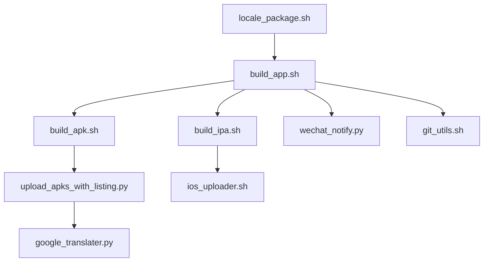

**Diagram sources**
- [locale_package.sh:1-32](file://overseaBuild/locale_package.sh#L1-L32)
- [build_app.sh:1-97](file://overseaBuild/build_app.sh#L1-L97)
- [build_apk.sh:1-60](file://overseaBuild/build_apk.sh#L1-L60)
- [build_ipa.sh:1-74](file://overseaBuild/build_ipa.sh#L1-L74)
- [upload_apks_with_listing.py:1-198](file://overseaBuild/upload_gp/upload_apks_with_listing.py#L1-L198)
- [google_translater.py:1-38](file://overseaBuild/upload_gp/google_translater.py#L1-L38)
- [ios_uploader.sh:1-81](file://overseaBuild/ios_uploader.sh#L1-L81)
- [wechat_notify.py:1-146](file://overseaBuild/wechat_notify.py#L1-L146)
- [git_utils.sh:1-90](file://overseaBuild/git_utils.sh#L1-L90)

**Section sources**
- [locale_package.sh:1-32](file://overseaBuild/locale_package.sh#L1-L32)
- [build_app.sh:1-97](file://overseaBuild/build_app.sh#L1-L97)

## Core Components
- locale_package.sh: Interactive orchestration script to collect build parameters and invoke build_app.sh with platform, type, version, debug mode, CI number, and release notes.
- build_app.sh: Central build controller that coordinates Android and iOS builds, handles store vs. non-store packaging, and notifies stakeholders.
- build_apk.sh: Flutter-based Android build with flavor banban_locale, optional debug mode, and store bundle generation.
- build_ipa.sh: Flutter-based iOS build with ad-hoc export options and store submission via ios_uploader.sh.
- upload_apks_with_listing.py: Uploads AAB to Google Play, translates release notes into multiple locales, validates lengths, and commits listings.
- google_translater.py: Provides translation service abstraction for release note text.
- ios_uploader.sh: Validates and uploads iOS artifacts to Apple servers.
- wechat_notify.py: Sends build notifications to enterprise WeChat channels.
- git_utils.sh: Utility functions for branch existence checks and safe checkout/pull workflows.

**Section sources**
- [locale_package.sh:1-32](file://overseaBuild/locale_package.sh#L1-L32)
- [build_app.sh:1-97](file://overseaBuild/build_app.sh#L1-L97)
- [build_apk.sh:1-60](file://overseaBuild/build_apk.sh#L1-L60)
- [build_ipa.sh:1-74](file://overseaBuild/build_ipa.sh#L1-L74)
- [upload_apks_with_listing.py:1-198](file://overseaBuild/upload_gp/upload_apks_with_listing.py#L1-L198)
- [google_translater.py:1-38](file://overseaBuild/upload_gp/google_translater.py#L1-L38)
- [ios_uploader.sh:1-81](file://overseaBuild/ios_uploader.sh#L1-L81)
- [wechat_notify.py:1-146](file://overseaBuild/wechat_notify.py#L1-L146)
- [git_utils.sh:1-90](file://overseaBuild/git_utils.sh#L1-L90)

## Architecture Overview
The system integrates user-driven orchestration with automated build and store upload processes. Release notes are translated per locale and validated for length constraints before committing to Google Play.

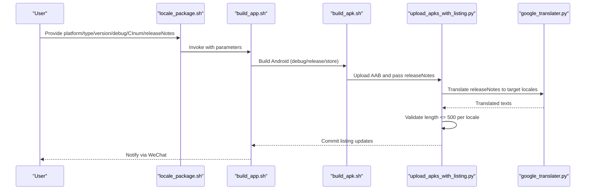

**Diagram sources**
- [locale_package.sh:1-32](file://overseaBuild/locale_package.sh#L1-L32)
- [build_app.sh:1-97](file://overseaBuild/build_app.sh#L1-L97)
- [build_apk.sh:1-60](file://overseaBuild/build_apk.sh#L1-L60)
- [upload_apks_with_listing.py:147-193](file://overseaBuild/upload_gp/upload_apks_with_listing.py#L147-L193)
- [google_translater.py:11-21](file://overseaBuild/upload_gp/google_translater.py#L11-L21)

## Detailed Component Analysis

### locale_package.sh
- Purpose: Collects build parameters from the user and invokes build_app.sh with platform, type, version, debug model, CI number, and release notes.
- Inputs: Platform selection (All/Android/iOS), build type (debug/release/store), versionName, versionCode, EnableDebug flag, CI number, and optional releaseNotes.
- Behavior: Maps numeric selections to human-readable values and passes them downstream.

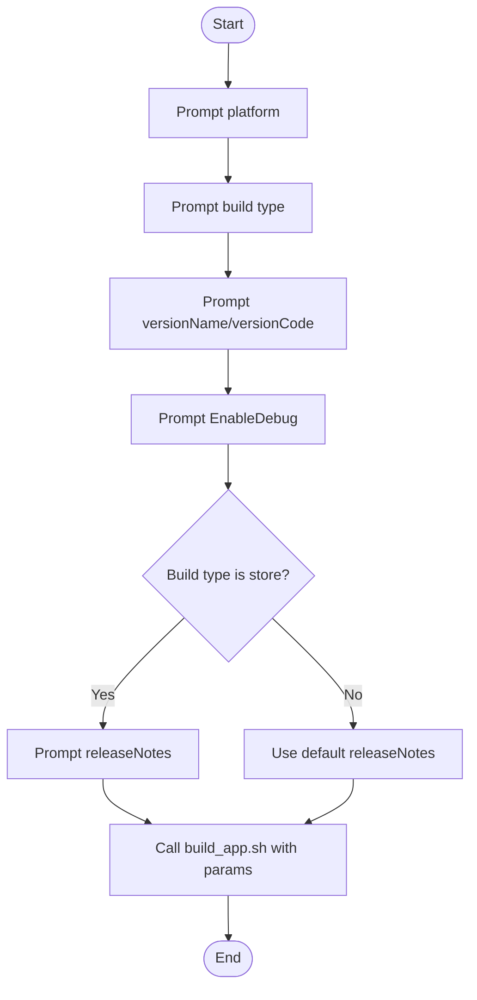

**Diagram sources**
- [locale_package.sh:5-31](file://overseaBuild/locale_package.sh#L5-L31)

**Section sources**
- [locale_package.sh:1-32](file://overseaBuild/locale_package.sh#L1-L32)

### build_app.sh
- Purpose: Orchestrates Android and iOS builds, manages store vs. non-store packaging, and sends notifications.
- Key behaviors:
  - Determines platform and executes corresponding build script.
  - For store builds, verifies presence of AAB/APK artifacts before proceeding.
  - Generates changelog from Git history and notifies via WeChat.

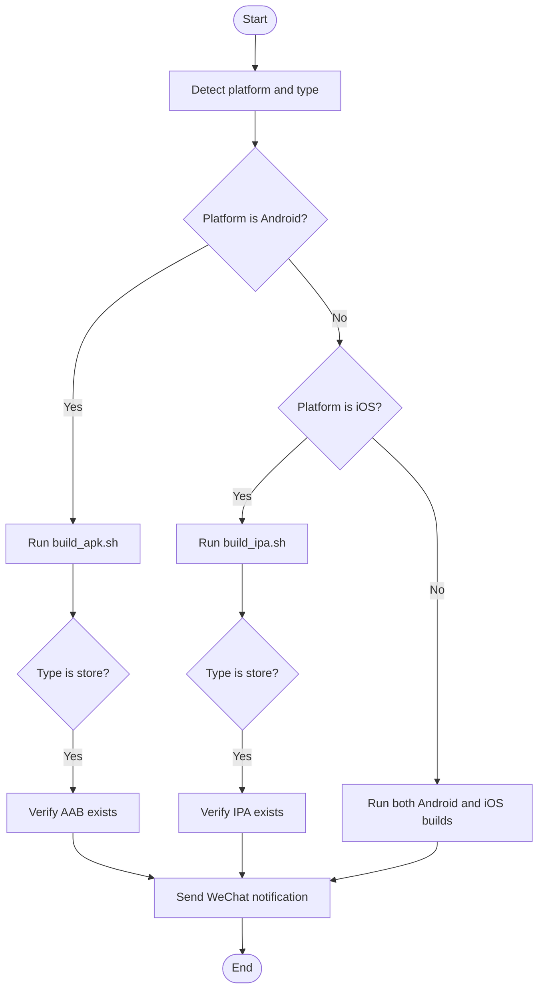

**Diagram sources**
- [build_app.sh:39-87](file://overseaBuild/build_app.sh#L39-L87)

**Section sources**
- [build_app.sh:1-97](file://overseaBuild/build_app.sh#L1-L97)

### build_apk.sh
- Purpose: Builds Android artifacts using Flutter with flavor banban_locale and optional debug mode.
- Store flow:
  - Cleans Flutter cache, builds appbundle, renames output, and triggers Google Play upload with release notes.
- Debug/release flows:
  - Builds APK, optionally uploads to a third-party service, and moves artifacts to standardized locations.

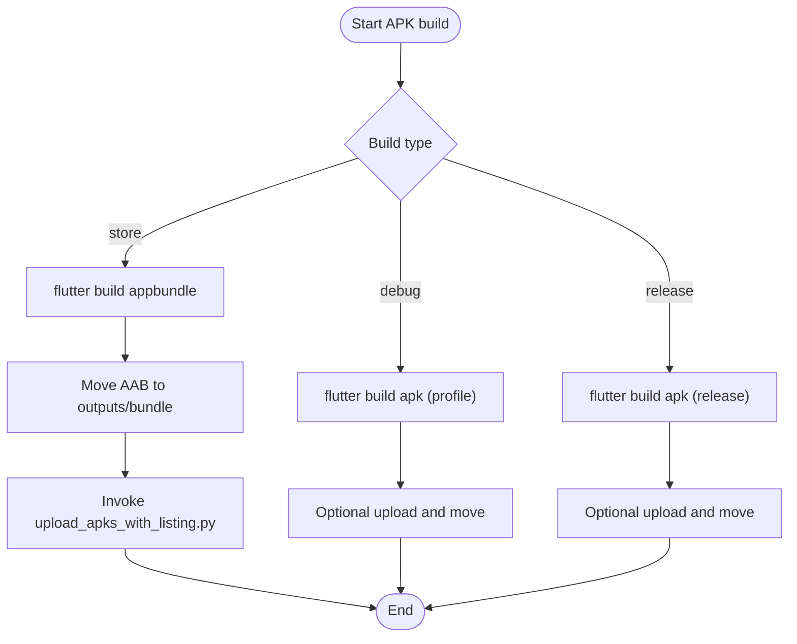

**Diagram sources**
- [build_apk.sh:11-59](file://overseaBuild/build_apk.sh#L11-L59)

**Section sources**
- [build_apk.sh:1-60](file://overseaBuild/build_apk.sh#L1-L60)

### build_ipa.sh
- Purpose: Builds iOS artifacts using Flutter and exports ad-hoc IPAs; store builds are delegated to ios_uploader.sh.
- Includes Firebase Crashlytics symbols upload when available.

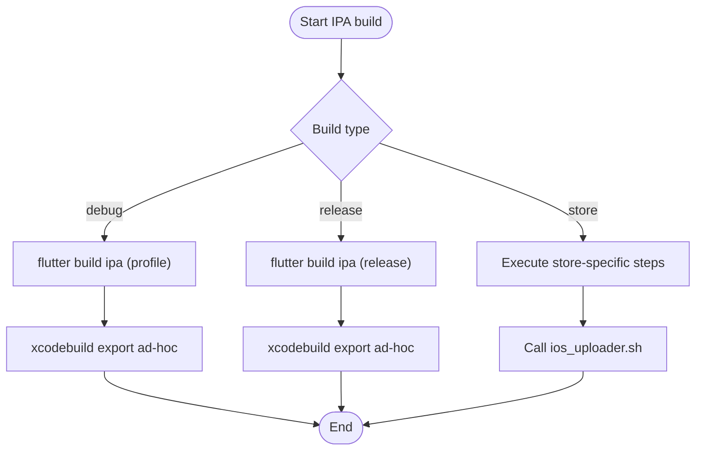

**Diagram sources**
- [build_ipa.sh:40-73](file://overseaBuild/build_ipa.sh#L40-L73)

**Section sources**
- [build_ipa.sh:1-74](file://overseaBuild/build_ipa.sh#L1-L74)

### upload_apks_with_listing.py
- Purpose: Uploads AAB to Google Play, translates release notes into 18+ locales, enforces 500-character limit, and commits listings.
- Supported locales include English variants, Chinese dialects, Arabic, Indonesian, Korean, Malay, Thai, Turkish, and Vietnamese.
- Translation logic:
  - English variants reuse the original release note text.
  - For locales with region codes (e.g., zh-TW), specific target languages are selected.
  - Other locales are translated using the target language code.
- Character limit enforcement: Exits if any translated note exceeds 500 characters.

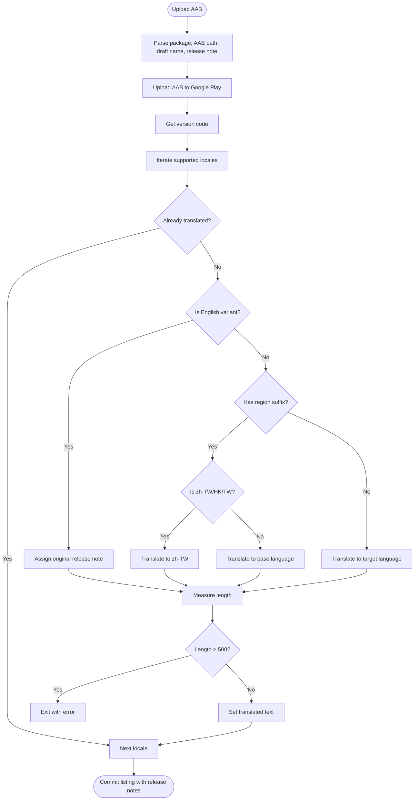

**Diagram sources**
- [upload_apks_with_listing.py:147-193](file://overseaBuild/upload_gp/upload_apks_with_listing.py#L147-L193)

**Section sources**
- [upload_apks_with_listing.py:54-73](file://overseaBuild/upload_gp/upload_apks_with_listing.py#L54-L73)
- [upload_apks_with_listing.py:147-193](file://overseaBuild/upload_gp/upload_apks_with_listing.py#L147-L193)

### google_translater.py
- Purpose: Encapsulates translation functionality with a simple interface.
- Methods:
  - translate(text, targetLan): Posts to a configured endpoint and returns translated text if available; otherwise returns the original text.

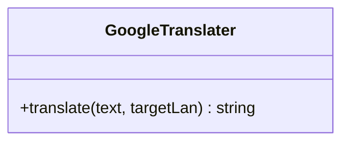

**Diagram sources**
- [google_translater.py:11-21](file://overseaBuild/upload_gp/google_translater.py#L11-L21)

**Section sources**
- [google_translater.py:1-38](file://overseaBuild/upload_gp/google_translater.py#L1-L38)

### ios_uploader.sh
- Purpose: Validates and uploads iOS artifacts to Apple servers using Application Loader.
- Functions:
  - validate_and_upload(): Validates the IPA, then uploads if validation succeeds.
  - upload_ipa(): Performs the upload operation.

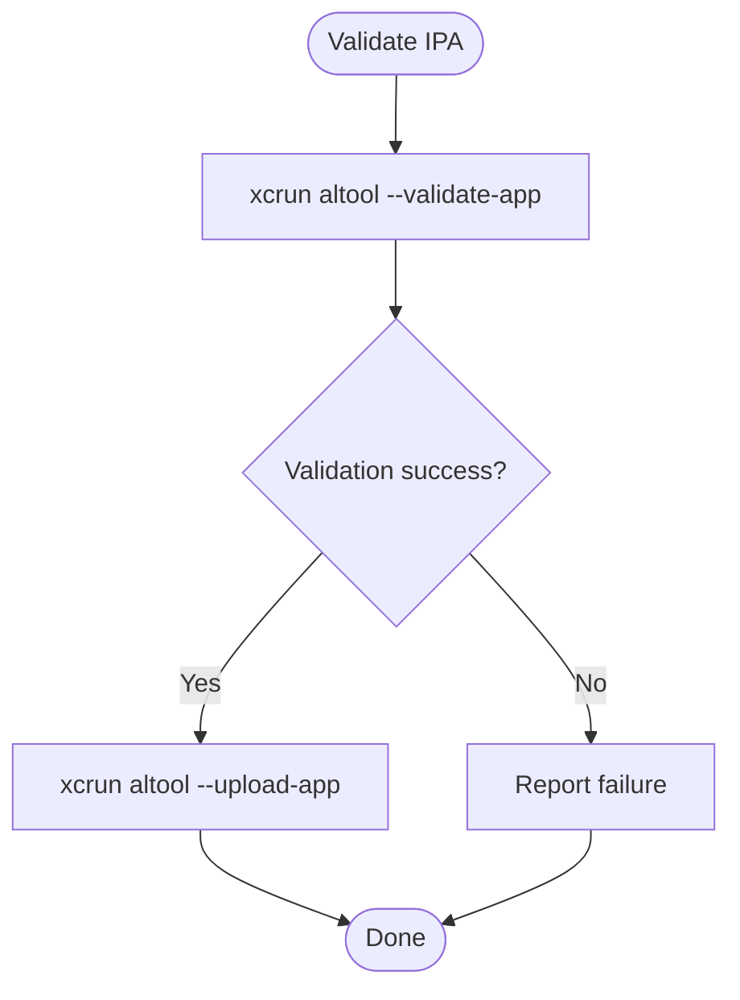

**Diagram sources**
- [ios_uploader.sh:26-45](file://overseaBuild/ios_uploader.sh#L26-L45)

**Section sources**
- [ios_uploader.sh:1-81](file://overseaBuild/ios_uploader.sh#L1-L81)

### wechat_notify.py
- Purpose: Sends build notifications to enterprise WeChat channels with links to download artifacts and contextual information.
- Notifies on build start, completion, and errors, truncating long change logs to a maximum length.

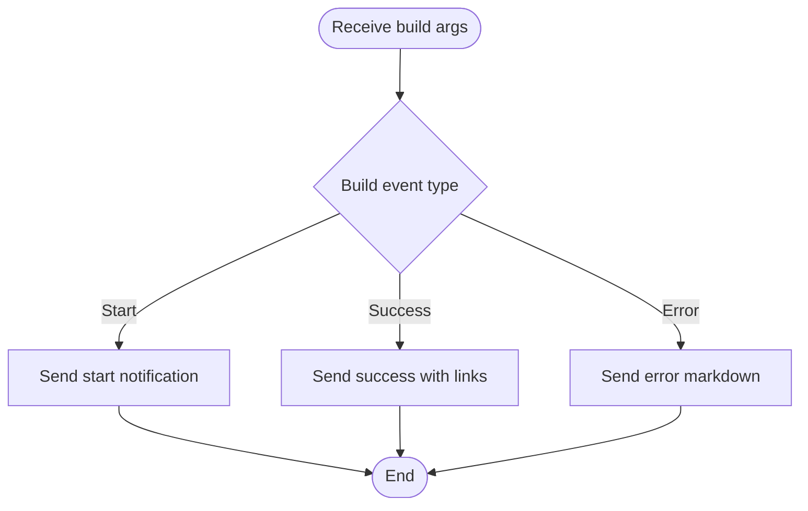

**Diagram sources**
- [wechat_notify.py:22-145](file://overseaBuild/wechat_notify.py#L22-L145)

**Section sources**
- [wechat_notify.py:1-146](file://overseaBuild/wechat_notify.py#L1-L146)

### git_utils.sh
- Purpose: Utilities for branch existence checks and safe checkout/pull operations, ensuring consistent repository state during builds.

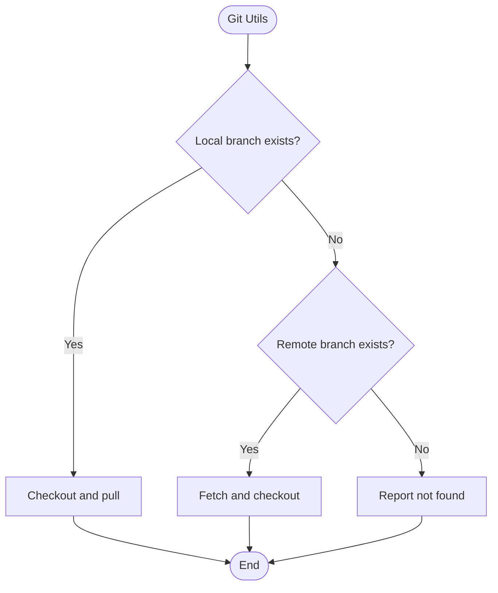

**Diagram sources**
- [git_utils.sh:3-90](file://overseaBuild/git_utils.sh#L3-L90)

**Section sources**
- [git_utils.sh:1-90](file://overseaBuild/git_utils.sh#L1-L90)

## Dependency Analysis
- locale_package.sh depends on build_app.sh for execution.
- build_app.sh depends on build_apk.sh and build_ipa.sh for platform-specific builds.
- build_apk.sh depends on upload_apks_with_listing.py for store uploads.
- upload_apks_with_listing.py depends on google_translater.py for translations.
- build_app.sh depends on wechat_notify.py for notifications.
- git_utils.sh supports repository state management across the pipeline.

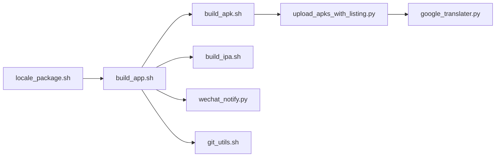

**Diagram sources**
- [locale_package.sh:1-32](file://overseaBuild/locale_package.sh#L1-L32)
- [build_app.sh:1-97](file://overseaBuild/build_app.sh#L1-L97)
- [build_apk.sh:1-60](file://overseaBuild/build_apk.sh#L1-L60)
- [build_ipa.sh:1-74](file://overseaBuild/build_ipa.sh#L1-L74)
- [upload_apks_with_listing.py:1-198](file://overseaBuild/upload_gp/upload_apks_with_listing.py#L1-L198)
- [google_translater.py:1-38](file://overseaBuild/upload_gp/google_translater.py#L1-L38)
- [wechat_notify.py:1-146](file://overseaBuild/wechat_notify.py#L1-L146)
- [git_utils.sh:1-90](file://overseaBuild/git_utils.sh#L1-L90)

**Section sources**
- [locale_package.sh:1-32](file://overseaBuild/locale_package.sh#L1-L32)
- [build_app.sh:1-97](file://overseaBuild/build_app.sh#L1-L97)
- [build_apk.sh:1-60](file://overseaBuild/build_apk.sh#L1-L60)
- [build_ipa.sh:1-74](file://overseaBuild/build_ipa.sh#L1-L74)
- [upload_apks_with_listing.py:1-198](file://overseaBuild/upload_gp/upload_apks_with_listing.py#L1-L198)
- [google_translater.py:1-38](file://overseaBuild/upload_gp/google_translater.py#L1-L38)
- [wechat_notify.py:1-146](file://overseaBuild/wechat_notify.py#L1-L146)
- [git_utils.sh:1-90](file://overseaBuild/git_utils.sh#L1-L90)

## Performance Considerations
- Translation throughput: The translation loop iterates over 18+ locales; batching or caching repeated translations could reduce latency.
- Network reliability: The upload process and translation calls depend on external APIs; adding retry logic and timeouts improves robustness.
- Artifact size: Large AAB/APK sizes increase upload time; ensure compression and chunked uploads are optimized.
- Notification payload limits: WeChat message truncation prevents oversized notifications; keep summaries concise.

[No sources needed since this section provides general guidance]

## Troubleshooting Guide
- Build failures:
  - Android store builds require AAB presence; verify outputs and paths.
  - iOS builds require proper provisioning profiles and export options; validate Xcode archive/export steps.
- Translation errors:
  - If translated text is empty, the translation endpoint may be unreachable or invalid; confirm network connectivity and endpoint configuration.
- Length violations:
  - Release notes exceeding 500 characters per locale cause immediate exit; shorten the source note or split content across multiple notes.
- Notifications:
  - If WeChat notifications fail, check webhook URL and payload formatting; ensure message length constraints are respected.

**Section sources**
- [build_app.sh:41-58](file://overseaBuild/build_app.sh#L41-L58)
- [build_ipa.sh:15-35](file://overseaBuild/build_ipa.sh#L15-L35)
- [upload_apks_with_listing.py:166-169](file://overseaBuild/upload_gp/upload_apks_with_listing.py#L166-L169)
- [wechat_notify.py:133-145](file://overseaBuild/wechat_notify.py#L133-L145)

## Conclusion
The localization and metadata management system automates multi-locale builds and release note translation for Google Play and iOS distribution. By integrating user-driven orchestration, robust build scripts, and translation/validation workflows, teams can efficiently manage global releases while enforcing regional compliance and content limits.

[No sources needed since this section summarizes without analyzing specific files]

## Appendices

### Practical Examples

- Locale configuration for release notes:
  - Supported locales include English variants (e.g., en-US, en-GB), Chinese dialects (e.g., zh-CN, zh-TW), and others (e.g., ar, id, ko-KR, ms, th, tr-TR, vi).
  - Ensure the source release note is concise and culturally appropriate before translation.

- Translation quality checks:
  - Validate translated notes for accuracy and tone; consider manual review for critical markets.
  - Monitor translation endpoint availability and handle transient failures gracefully.

- Regional compliance requirements:
  - Respect character limits (<= 500 per locale) for store listings.
  - Adapt content to local idioms and avoid restricted terms; verify platform-specific policies.

[No sources needed since this section provides general guidance]