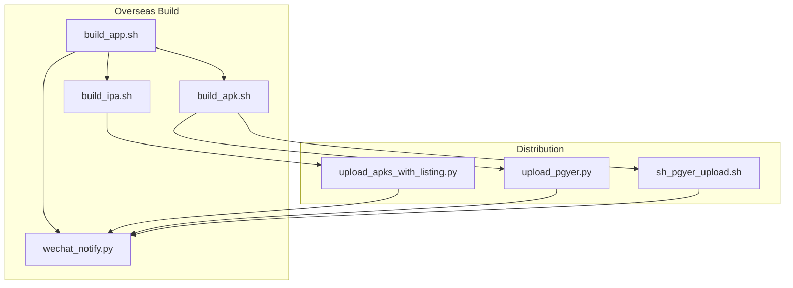
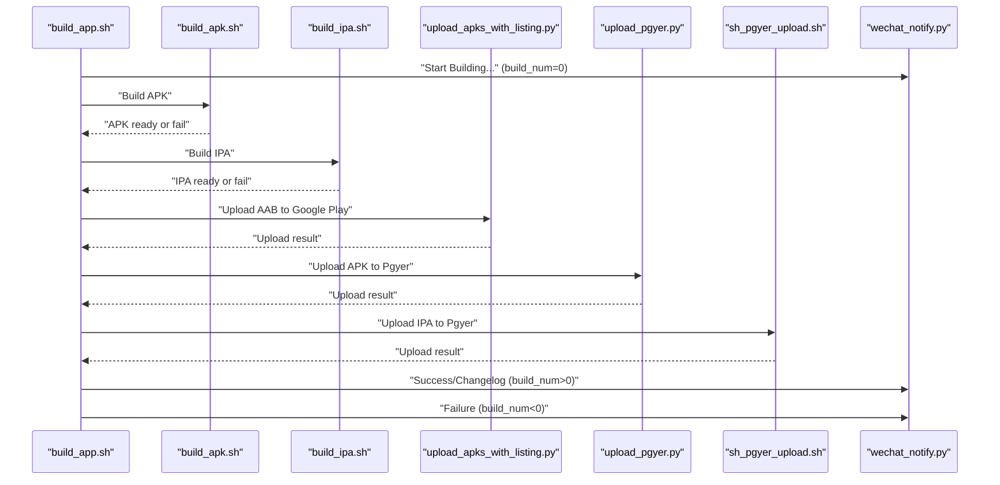
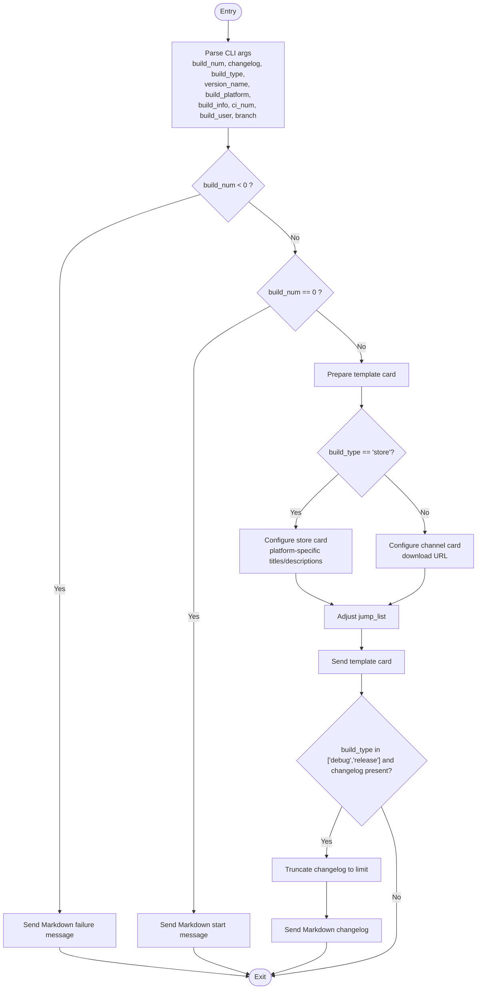
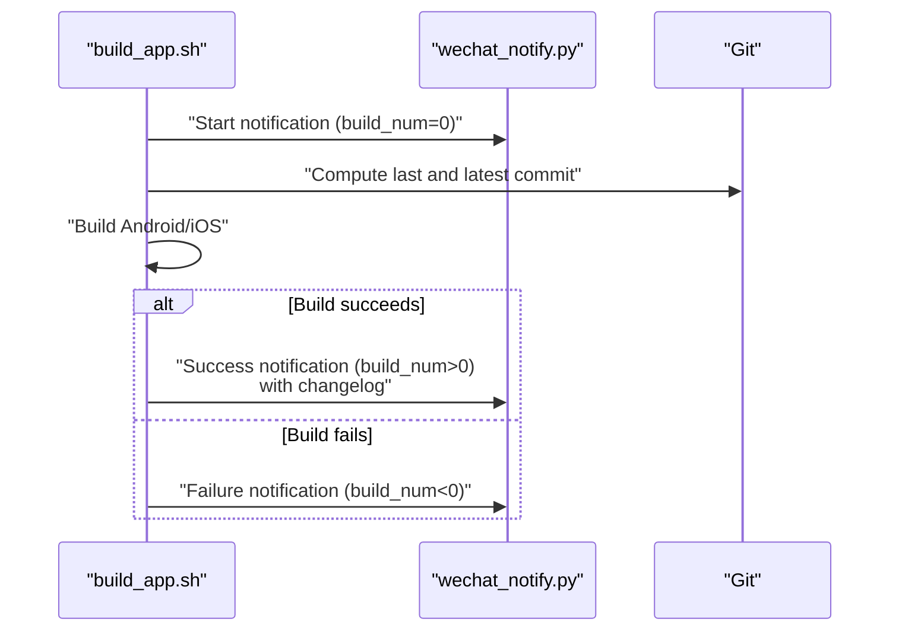
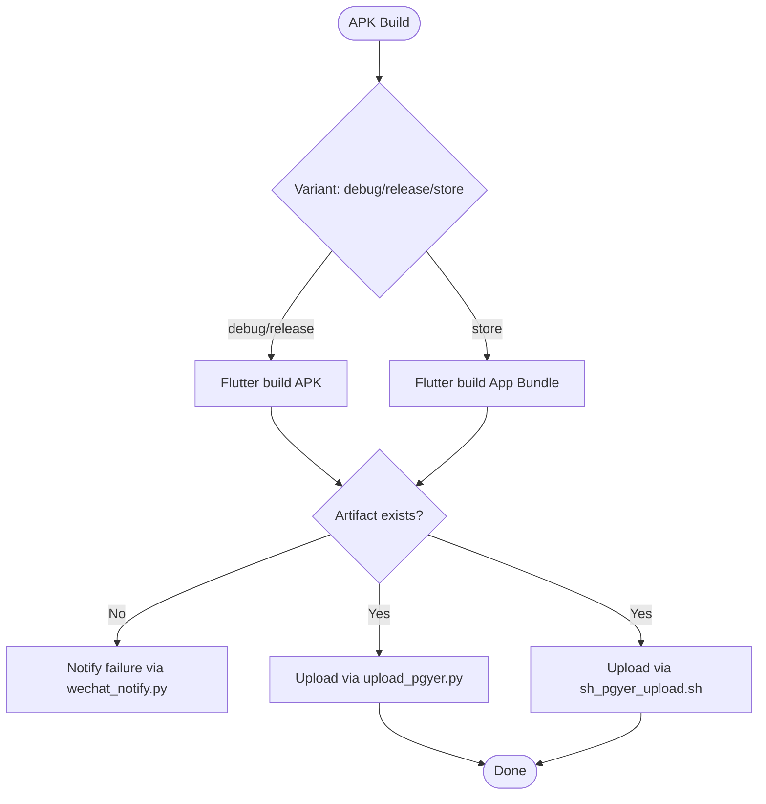
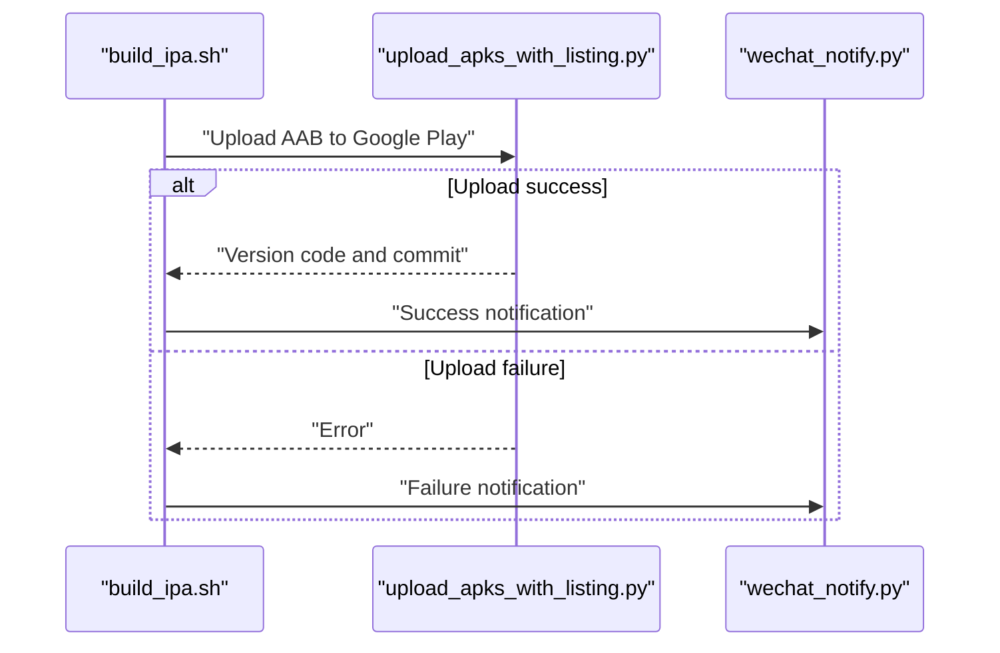
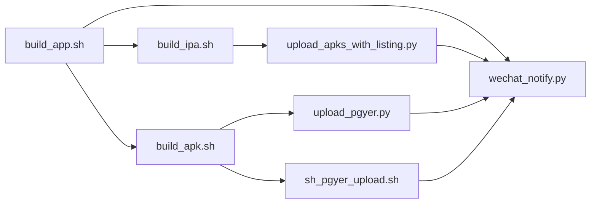

# Notification and Communication System

<cite>
**Referenced Files in This Document**
- [wechat_notify.py](file://overseaBuild/wechat_notify.py)
- [build_app.sh](file://overseaBuild/build_app.sh)
- [build_apk.sh](file://overseaBuild/build_apk.sh)
- [build_ipa.sh](file://overseaBuild/build_ipa.sh)
- [upload_apks_with_listing.py](file://overseaBuild/upload_gp/upload_apks_with_listing.py)
- [upload_pgyer.py](file://ciBuild/utils/upload_pgyer.py)
- [sh_pgyer_upload.sh](file://ciBuild/sh_pgyer_upload.sh)
- [README.md](file://README.md)
</cite>

## Table of Contents
1. [Introduction](#introduction)
2. [Project Structure](#project-structure)
3. [Core Components](#core-components)
4. [Architecture Overview](#architecture-overview)
5. [Detailed Component Analysis](#detailed-component-analysis)
6. [Dependency Analysis](#dependency-analysis)
7. [Performance Considerations](#performance-considerations)
8. [Troubleshooting Guide](#troubleshooting-guide)
9. [Conclusion](#conclusion)
10. [Appendices](#appendices)

## Introduction
This document explains the notification and communication system used for international distribution updates. It focuses on the WeChat Work webhook integration implemented in wechat_notify.py and how it is triggered during Android and iOS build and distribution workflows. The system sends real-time notifications via WeChat Work webhooks, supports Markdown messages for changelogs, and uses template cards for rich distribution updates. The document also covers notification triggers, message formatting, recipient management, integration with the broader distribution workflow, and practical guidance for extending the system to other communication channels.

## Project Structure
The notification system spans several build and distribution scripts:
- Overseas build orchestration and triggers notifications
- Platform-specific build scripts for Android and iOS
- Google Play upload automation
- Pgyer upload utilities for internal distribution
- WeChat Work webhook integration

**Diagram sources**
- [build_app.sh:1-97](file://overseaBuild/build_app.sh#L1-L97)
- [build_apk.sh:1-60](file://overseaBuild/build_apk.sh#L1-L60)
- [build_ipa.sh:1-74](file://overseaBuild/build_ipa.sh#L1-L74)
- [wechat_notify.py:1-146](file://overseaBuild/wechat_notify.py#L1-L146)
- [upload_apks_with_listing.py:1-198](file://overseaBuild/upload_gp/upload_apks_with_listing.py#L1-L198)
- [upload_pgyer.py:1-108](file://ciBuild/utils/upload_pgyer.py#L1-L108)
- [sh_pgyer_upload.sh:1-103](file://ciBuild/sh_pgyer_upload.sh#L1-L103)

**Section sources**
- [README.md:1-37](file://README.md#L1-L37)
- [build_app.sh:1-97](file://overseaBuild/build_app.sh#L1-L97)

## Core Components
- WeChat Work Webhook Notifier: Sends Markdown and template card messages to a configured webhook URL.
- Build Orchestration Scripts: Trigger notifications at lifecycle stages (start, success, failure).
- Distribution Utilities: Upload APK/AAB/IPA to Pgyer or Google Play and optionally notify.

Key responsibilities:
- Triggering notifications on build start, success, and failure.
- Formatting rich messages with links and contextual metadata.
- Integrating with external distribution APIs and surfacing outcomes.

**Section sources**
- [wechat_notify.py:17-131](file://overseaBuild/wechat_notify.py#L17-L131)
- [build_app.sh:34-93](file://overseaBuild/build_app.sh#L34-L93)

## Architecture Overview
The notification architecture integrates build scripts with WeChat Work webhooks and distribution utilities. The flow is orchestrated by build_app.sh, which invokes platform-specific build scripts and distribution steps, and emits notifications at each stage.

**Diagram sources**
- [build_app.sh:34-93](file://overseaBuild/build_app.sh#L34-L93)
- [build_apk.sh:18-38](file://overseaBuild/build_apk.sh#L18-L38)
- [build_ipa.sh:23-70](file://overseaBuild/build_ipa.sh#L23-L70)
- [upload_apks_with_listing.py:108-141](file://overseaBuild/upload_gp/upload_apks_with_listing.py#L108-L141)
- [upload_pgyer.py:43-85](file://ciBuild/utils/upload_pgyer.py#L43-L85)
- [sh_pgyer_upload.sh:77-86](file://ciBuild/sh_pgyer_upload.sh#L77-L86)
- [wechat_notify.py:22-131](file://overseaBuild/wechat_notify.py#L22-L131)

## Detailed Component Analysis

### WeChat Work Notification Integration (wechat_notify.py)
Responsibilities:
- Accepts CLI arguments representing build metadata.
- Sends Markdown messages for changelogs and start/failure events.
- Sends rich template cards for successful builds with download links and contextual info.
- Truncates long changelog content to meet platform limits.

Message types and triggers:
- Start notification: Sent when a build begins.
- Failure notification: Sent when a platform build fails.
- Success notification: Sent upon successful completion with rich card and optional changelog.

Message formatting:
- Markdown for free-form content and changelog summaries.
- Template card with news notice type, images, horizontal content items, and jump buttons.

Recipient management:
- The webhook key is embedded in the script URL. To manage recipients, configure the webhook’s group chat or chat room membership in WeChat Work.

Integration points:
- Called by build orchestration scripts with build metadata.
- Optionally posts changelog updates after successful builds.

**Diagram sources**
- [wechat_notify.py:7-16](file://overseaBuild/wechat_notify.py#L7-L16)
- [wechat_notify.py:22-43](file://overseaBuild/wechat_notify.py#L22-L43)
- [wechat_notify.py:44-128](file://overseaBuild/wechat_notify.py#L44-L128)
- [wechat_notify.py:133-145](file://overseaBuild/wechat_notify.py#L133-L145)

**Section sources**
- [wechat_notify.py:17-131](file://overseaBuild/wechat_notify.py#L17-L131)

### Build Orchestration and Notification Triggers (build_app.sh)
Responsibilities:
- Coordinates Android/iOS builds across multiple platforms.
- Emits notifications at start, success, and failure points.
- Collects changelog deltas between commits for inclusion in notifications.

Notification triggers:
- Start: On build initiation.
- Success: After all platform builds succeed.
- Failure: On any platform build failure.

Changelog generation:
- Computes git shortlog between previous and current commits to summarize recent changes.

**Diagram sources**
- [build_app.sh:34-93](file://overseaBuild/build_app.sh#L34-L93)
- [wechat_notify.py:22-131](file://overseaBuild/wechat_notify.py#L22-L131)

**Section sources**
- [build_app.sh:34-93](file://overseaBuild/build_app.sh#L34-L93)

### Android Build and Pgyer Integration (build_apk.sh, upload_pgyer.py, sh_pgyer_upload.sh)
Responsibilities:
- Builds APK artifacts for debug and release variants.
- Uploads built artifacts to Pgyer via Python or Shell utilities.
- Emits notifications on success or failure.

Notification integration:
- Failure notifications are sent when expected artifacts are missing.
- Success notifications are handled by the orchestrator after uploads.

**Diagram sources**
- [build_apk.sh:11-38](file://overseaBuild/build_apk.sh#L11-L38)
- [upload_pgyer.py:43-85](file://ciBuild/utils/upload_pgyer.py#L43-L85)
- [sh_pgyer_upload.sh:77-86](file://ciBuild/sh_pgyer_upload.sh#L77-L86)
- [build_app.sh:44-51](file://overseaBuild/build_app.sh#L44-L51)

**Section sources**
- [build_apk.sh:11-38](file://overseaBuild/build_apk.sh#L11-L38)
- [upload_pgyer.py:43-85](file://ciBuild/utils/upload_pgyer.py#L43-L85)
- [sh_pgyer_upload.sh:77-86](file://ciBuild/sh_pgyer_upload.sh#L77-L86)
- [build_app.sh:44-51](file://overseaBuild/build_app.sh#L44-L51)

### iOS Build and Google Play Integration (build_ipa.sh, upload_apks_with_listing.py)
Responsibilities:
- Builds IPA artifacts for debug and release variants.
- Uploads AAB to Google Play using service account credentials and distribution utilities.
- Emits notifications on success or failure.

**Diagram sources**
- [build_ipa.sh:15-35](file://overseaBuild/build_ipa.sh#L15-L35)
- [upload_apks_with_listing.py:108-141](file://overseaBuild/upload_gp/upload_apks_with_listing.py#L108-L141)
- [build_app.sh:55-58](file://overseaBuild/build_app.sh#L55-L58)

**Section sources**
- [build_ipa.sh:15-35](file://overseaBuild/build_ipa.sh#L15-L35)
- [upload_apks_with_listing.py:108-141](file://overseaBuild/upload_gp/upload_apks_with_listing.py#L108-L141)
- [build_app.sh:55-58](file://overseaBuild/build_app.sh#L55-L58)

### Notification Message Types and Formatting
- Markdown messages:
  - Used for start, failure, and changelog summaries.
  - Changelog content is truncated to platform limits before sending.
- Template cards:
  - Rich cards with title, description, image, horizontal content (Trigger/Branch), and jump buttons.
  - Platform-specific titles and descriptions for store vs channel builds.
  - Download URLs adjusted based on platform and build type.

**Section sources**
- [wechat_notify.py:24-43](file://overseaBuild/wechat_notify.py#L24-L43)
- [wechat_notify.py:68-128](file://overseaBuild/wechat_notify.py#L68-L128)
- [wechat_notify.py:133-145](file://overseaBuild/wechat_notify.py#L133-L145)

### Recipient Management and Webhook Configuration
- Recipients are managed by configuring the WeChat Work webhook’s group chat or chat room membership.
- The webhook key is embedded in the script URL. To change recipients, update the webhook configuration in WeChat Work.

**Section sources**
- [wechat_notify.py:17-20](file://overseaBuild/wechat_notify.py#L17-L20)

### Practical Examples and Extension Patterns
- Example: Start notification
  - Trigger: Build orchestration starts.
  - Invocation: Orchestrator passes build_num=0 and metadata to notifier.
- Example: Failure notification
  - Trigger: Missing artifact after build step.
  - Invocation: Orchestrator passes build_num<0 with error message.
- Example: Success notification
  - Trigger: All builds and uploads complete.
  - Invocation: Orchestrator passes build_num>0 with changelog and metadata.
- Extension pattern: Custom notification handlers
  - Add new handler functions to the notifier script to support Slack, Email, or other channels.
  - Maintain the same CLI contract for build orchestration scripts to minimize changes.

**Section sources**
- [build_app.sh:34-93](file://overseaBuild/build_app.sh#L34-L93)
- [wechat_notify.py:22-131](file://overseaBuild/wechat_notify.py#L22-L131)

## Dependency Analysis
The system exhibits clear dependency chains:
- build_app.sh depends on platform build scripts and distribution utilities.
- All distribution steps depend on wechat_notify.py for post-upload notifications.
- upload_apks_with_listing.py depends on Google Play APIs and service account credentials.
- Pgyer utilities depend on network connectivity and API keys.

**Diagram sources**
- [build_app.sh:34-93](file://overseaBuild/build_app.sh#L34-L93)
- [wechat_notify.py:17-131](file://overseaBuild/wechat_notify.py#L17-L131)
- [build_apk.sh:18-38](file://overseaBuild/build_apk.sh#L18-L38)
- [build_ipa.sh:23-70](file://overseaBuild/build_ipa.sh#L23-L70)
- [upload_apks_with_listing.py:108-141](file://overseaBuild/upload_gp/upload_apks_with_listing.py#L108-L141)
- [upload_pgyer.py:43-85](file://ciBuild/utils/upload_pgyer.py#L43-L85)
- [sh_pgyer_upload.sh:77-86](file://ciBuild/sh_pgyer_upload.sh#L77-L86)

**Section sources**
- [build_app.sh:34-93](file://overseaBuild/build_app.sh#L34-L93)
- [wechat_notify.py:17-131](file://overseaBuild/wechat_notify.py#L17-L131)

## Performance Considerations
- Network latency: Webhook posting and distribution uploads are network-bound; consider retry policies and timeouts.
- Payload size: Changelogs are truncated to avoid exceeding platform limits.
- Parallelization: Android and iOS builds can run concurrently where feasible to reduce total build time.

## Troubleshooting Guide
Common issues and resolutions:
- Webhook failures:
  - Verify webhook key and network connectivity.
  - Check response codes and logs from the notifier.
- Missing artifacts:
  - Confirm build steps executed and artifacts exist before upload.
  - Review orchestrator’s failure notifications for immediate feedback.
- Google Play upload errors:
  - Validate service account credentials and permissions.
  - Ensure AAB upload completes and track commit is applied.
- Pgyer upload errors:
  - Confirm API key validity and file extension support.
  - Retry upload if temporary server errors occur.

**Section sources**
- [wechat_notify.py:30-31](file://overseaBuild/wechat_notify.py#L30-L31)
- [build_app.sh:44-51](file://overseaBuild/build_app.sh#L44-L51)
- [upload_apks_with_listing.py:143-146](file://overseaBuild/upload_gp/upload_apks_with_listing.py#L143-L146)
- [sh_pgyer_upload.sh:83-86](file://ciBuild/sh_pgyer_upload.sh#L83-L86)

## Conclusion
The notification and communication system integrates WeChat Work webhooks into the international distribution pipeline. It provides timely, contextual updates for build lifecycle events and supports rich, actionable notifications with download links. The system is modular and can be extended to additional channels while maintaining minimal disruption to the existing workflow.

## Appendices

### Notification Delivery Reliability and Fallback Mechanisms
- Reliability:
  - Use idempotent notification IDs if available in downstream systems.
  - Implement retries with exponential backoff for transient network errors.
- Fallback:
  - Add secondary handlers (e.g., email or Slack) in the notifier script.
  - Log all webhook responses for auditing and alerting.

### Monitoring and Visibility
- Combine webhook logs with CI job logs for end-to-end traceability.
- Surface key metrics (build duration, success rate) in dashboards for operational oversight.