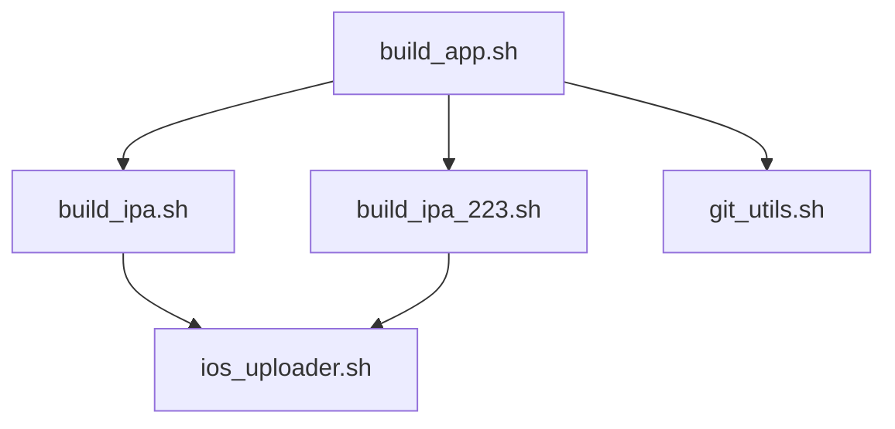
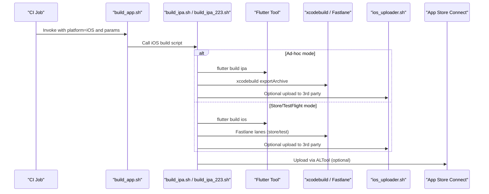
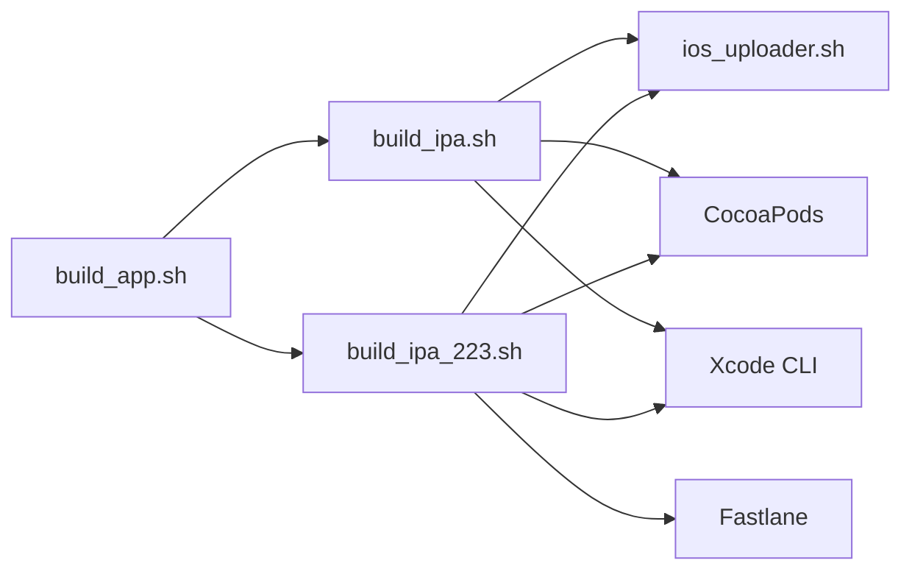

# iOS Build and Distribution

<cite>
**Referenced Files in This Document**
- [build_app.sh](file://overseaBuild/build_app.sh)
- [build_ipa.sh](file://overseaBuild/build_ipa.sh)
- [build_ipa_223.sh](file://overseaBuild/build_ipa_223.sh)
- [ios_uploader.sh](file://overseaBuild/ios_uploader.sh)
- [git_utils.sh](file://overseaBuild/git_utils.sh)
- [README.md](file://README.md)
</cite>

## Table of Contents
1. [Introduction](#introduction)
2. [Project Structure](#project-structure)
3. [Core Components](#core-components)
4. [Architecture Overview](#architecture-overview)
5. [Detailed Component Analysis](#detailed-component-analysis)
6. [Dependency Analysis](#dependency-analysis)
7. [Performance Considerations](#performance-considerations)
8. [Troubleshooting Guide](#troubleshooting-guide)
9. [Conclusion](#conclusion)
10. [Appendices](#appendices)

## Introduction
This document explains the iOS build and distribution workflows in this repository. It focuses on Flutter-based iOS builds via two scripts, dependency and code-signing management, Apple App Store Connect/TestFlight integration, and general iOS application building. It also covers practical setup steps, automation patterns, and troubleshooting for common iOS build and distribution issues.

## Project Structure
The iOS build system is primarily implemented under overseaBuild with three key scripts:
- build_app.sh: Orchestrates cross-platform builds and routes iOS builds to dedicated scripts.
- build_ipa.sh: Builds iOS .ipa artifacts using Flutter and exports ad-hoc distributions.
- build_ipa_223.sh: Builds iOS using Flutter and Fastlane for TestFlight/App Store workflows.
- ios_uploader.sh: Provides Apple ALTool-based upload and validation helpers for App Store Connect.
- git_utils.sh: Utility functions for Git branch operations used during build orchestration.

**Diagram sources**
- [build_app.sh:1-97](file://overseaBuild/build_app.sh#L1-L97)
- [build_ipa.sh:1-74](file://overseaBuild/build_ipa.sh#L1-L74)
- [build_ipa_223.sh:1-81](file://overseaBuild/build_ipa_223.sh#L1-L81)
- [ios_uploader.sh:1-81](file://overseaBuild/ios_uploader.sh#L1-L81)
- [git_utils.sh:1-90](file://overseaBuild/git_utils.sh#L1-L90)

**Section sources**
- [build_app.sh:1-97](file://overseaBuild/build_app.sh#L1-L97)
- [build_ipa.sh:1-74](file://overseaBuild/build_ipa.sh#L1-L74)
- [build_ipa_223.sh:1-81](file://overseaBuild/build_ipa_223.sh#L1-L81)
- [ios_uploader.sh:1-81](file://overseaBuild/ios_uploader.sh#L1-L81)
- [git_utils.sh:1-90](file://overseaBuild/git_utils.sh#L1-L90)
- [README.md:1-37](file://README.md#L1-L37)

## Core Components
- build_app.sh: Central coordinator for Android/iOS builds. It validates outputs, notifies stakeholders, and coordinates with platform-specific builders.
- build_ipa.sh: Flutter-based iOS builder exporting ad-hoc .ipa files and optionally uploading to a third-party service. Also integrates Firebase Crashlytics dSYM upload.
- build_ipa_223.sh: Alternative iOS builder using Flutter plus Fastlane lanes for TestFlight/App Store workflows and optional ad-hoc export.
- ios_uploader.sh: Provides Apple ALTool-based validation and upload to App Store Connect, with interactive API key/issuer input support.
- git_utils.sh: Utilities for branch existence checks and safe checkout/pull operations used in build orchestration.

**Section sources**
- [build_app.sh:1-97](file://overseaBuild/build_app.sh#L1-L97)
- [build_ipa.sh:1-74](file://overseaBuild/build_ipa.sh#L1-L74)
- [build_ipa_223.sh:1-81](file://overseaBuild/build_ipa_223.sh#L1-L81)
- [ios_uploader.sh:1-81](file://overseaBuild/ios_uploader.sh#L1-L81)
- [git_utils.sh:1-90](file://overseaBuild/git_utils.sh#L1-L90)

## Architecture Overview
The iOS build pipeline supports two primary modes:
- Ad-hoc distribution via Flutter and xcodebuild export.
- App Store/TestFlight distribution via Flutter and Fastlane.

**Diagram sources**
- [build_app.sh:53-59](file://overseaBuild/build_app.sh#L53-L59)
- [build_ipa.sh:40-73](file://overseaBuild/build_ipa.sh#L40-L73)
- [build_ipa_223.sh:42-80](file://overseaBuild/build_ipa_223.sh#L42-L80)
- [ios_uploader.sh:7-24](file://overseaBuild/ios_uploader.sh#L7-L24)

## Detailed Component Analysis

### build_app.sh
Responsibilities:
- Accepts build parameters (platform, type, version, debug flag, release notes, CI number, user, branch).
- Persists build metadata and last commit IDs.
- Routes iOS builds to either build_ipa.sh or build_ipa_223.sh depending on the selected mode.
- Validates generated .ipa outputs and sends notifications on success/failure.

Key behaviors:
- Android/iOS dual-mode orchestration.
- Robust error handling and notifications via WeCom integration.
- Persists last commit IDs per branch for rollback and changelog generation.

**Section sources**
- [build_app.sh:1-97](file://overseaBuild/build_app.sh#L1-L97)

### build_ipa.sh
Responsibilities:
- Supports three build types: debug, release, and store.
- Cleans Flutter cache and runs dependency resolution.
- Installs CocoaPods and prepares iOS workspace.
- Builds .ipa using Flutter and exports ad-hoc .ipa via xcodebuild.
- Integrates Firebase Crashlytics dSYM upload when available.
- Optionally uploads .ipa to a third-party service.

Store mode:
- Uses Flutter’s Xcode archive and export options plist to produce .ipa.
- Calls the uploader to integrate with App Store Connect via ALTool.

Ad-hoc mode:
- Uses xcodebuild exportArchive with an export options plist for ad-hoc distribution.
- Uploads .ipa to a third-party service endpoint.

**Section sources**
- [build_ipa.sh:1-74](file://overseaBuild/build_ipa.sh#L1-L74)

### build_ipa_223.sh
Responsibilities:
- Similar to build_ipa.sh but integrates Fastlane for TestFlight/App Store workflows.
- Supports debug/release modes and ad-hoc export via Fastlane lanes.
- Integrates Firebase Crashlytics dSYM upload when available.
- Optionally uploads .ipa to a third-party service.

Fastlane integration:
- Invokes Fastlane lanes for store and test distributions.
- Exports .ipa for ad-hoc testing.

**Section sources**
- [build_ipa_223.sh:1-81](file://overseaBuild/build_ipa_223.sh#L1-L81)

### ios_uploader.sh
Responsibilities:
- Provides Apple ALTool-based validation and upload to App Store Connect.
- Accepts API key and issuer ID interactively or via parameters.
- Validates presence of .ipa file before attempting upload.
- Outputs success/failure messages.

Usage:
- Called by iOS build scripts to upload .ipa to App Store Connect.
- Can be used standalone for validation and upload tasks.

**Section sources**
- [ios_uploader.sh:1-81](file://overseaBuild/ios_uploader.sh#L1-L81)

### git_utils.sh
Responsibilities:
- Checks whether a branch exists locally or remotely.
- Safely checks out and pulls a given branch, cleaning working directory.

Integration:
- Used by build orchestration to ensure the correct branch state before building.

**Section sources**
- [git_utils.sh:1-90](file://overseaBuild/git_utils.sh#L1-L90)

## Dependency Analysis
High-level dependencies:
- build_app.sh depends on build_ipa.sh and build_ipa_223.sh for iOS builds.
- build_ipa.sh and build_ipa_223.sh depend on ios_uploader.sh for App Store Connect uploads.
- All iOS build scripts rely on Flutter toolchain, CocoaPods, and Xcode command-line tools.
- Optional Fastlane integration is present in build_ipa_223.sh.

**Diagram sources**
- [build_app.sh:53-59](file://overseaBuild/build_app.sh#L53-L59)
- [build_ipa.sh:15-35](file://overseaBuild/build_ipa.sh#L15-L35)
- [build_ipa_223.sh:15-38](file://overseaBuild/build_ipa_223.sh#L15-L38)
- [ios_uploader.sh:7-24](file://overseaBuild/ios_uploader.sh#L7-L24)

**Section sources**
- [build_app.sh:1-97](file://overseaBuild/build_app.sh#L1-L97)
- [build_ipa.sh:1-74](file://overseaBuild/build_ipa.sh#L1-L74)
- [build_ipa_223.sh:1-81](file://overseaBuild/build_ipa_223.sh#L1-L81)
- [ios_uploader.sh:1-81](file://overseaBuild/ios_uploader.sh#L1-L81)

## Performance Considerations
- Prefer Fastlane-based builds for production/TestFlight workflows to reduce manual steps and improve reliability.
- Cache Flutter dependencies and CocoaPods pods to speed up CI builds.
- Minimize unnecessary Flutter clean operations outside of explicit rebuild scenarios.
- Use incremental builds and avoid redundant archive/export steps when possible.

## Troubleshooting Guide
Common iOS build and distribution issues and resolutions:

- Missing or outdated certificates/provisioning profiles
  - Symptom: Build fails with signing errors.
  - Resolution: Ensure valid Apple Developer credentials and provisioning profiles are installed. Re-run pod install and refresh profiles in Xcode.

- Flutter dependencies not installed
  - Symptom: Build fails early with missing packages.
  - Resolution: Run dependency resolution and ensure CocoaPods installation completes successfully.

- Archive/export failures
  - Symptom: Export step fails after Flutter archive.
  - Resolution: Verify export options plist paths and contents. Confirm the archive path exists and is readable.

- App Store Connect upload validation failures
  - Symptom: Validation passes but upload fails.
  - Resolution: Check API key and issuer ID configuration. Ensure ALTool can reach Apple services and network connectivity is stable.

- dSYM upload issues
  - Symptom: Symbols not uploaded for crash reporting.
  - Resolution: Verify dSYM path and Firebase Crashlytics upload-symbols script availability. Confirm GoogleService-Info.plist location.

- Third-party upload failures
  - Symptom: .ipa not uploaded to external service.
  - Resolution: Confirm API key and endpoint URL. Ensure .ipa file exists and is accessible.

- Branch state inconsistencies
  - Symptom: Build runs on unexpected branch state.
  - Resolution: Use Git utilities to safely checkout and pull the intended branch before building.

**Section sources**
- [build_ipa.sh:23-34](file://overseaBuild/build_ipa.sh#L23-L34)
- [build_ipa_223.sh:26-37](file://overseaBuild/build_ipa_223.sh#L26-L37)
- [ios_uploader.sh:26-44](file://overseaBuild/ios_uploader.sh#L26-L44)
- [git_utils.sh:63-90](file://overseaBuild/git_utils.sh#L63-L90)

## Conclusion
This repository provides a robust, script-driven iOS build and distribution system supporting both ad-hoc and App Store/TestFlight workflows. The build_app.sh orchestrator coordinates iOS builds, while build_ipa.sh and build_ipa_223.sh handle Flutter-based compilation and export. ios_uploader.sh enables App Store Connect integration via ALTool. With proper code signing, provisioning profiles, and optional Fastlane configuration, teams can automate reliable iOS releases.

## Appendices

### Practical Setup Examples
- Environment prerequisites
  - Install Flutter SDK and Xcode command-line tools.
  - Configure Apple Developer credentials and ensure valid certificates/provisioning profiles.
  - For Fastlane mode, install Fastlane and configure lane files for store/test distributions.

- Code signing configuration
  - Ensure Flutter project signing settings align with export options plists.
  - Keep signing identities and provisioning profiles current and accessible to CI agents.

- Automated distribution pipelines
  - Use build_app.sh to trigger iOS builds from CI.
  - For App Store/TestFlight, run build_ipa_223.sh with Fastlane lanes enabled.
  - For ad-hoc distribution, run build_ipa.sh to export .ipa and optionally upload to a third-party service.

- iOS-specific considerations
  - Entitlements: Ensure entitlements are configured in Xcode and exported via the correct archive/export options.
  - App icons and splash screens: Verify asset catalogs and launch screen configurations match target device families.
  - Platform optimizations: Use Flutter release builds and enable tree-shaking/minification for production.

[No sources needed since this section provides general guidance]