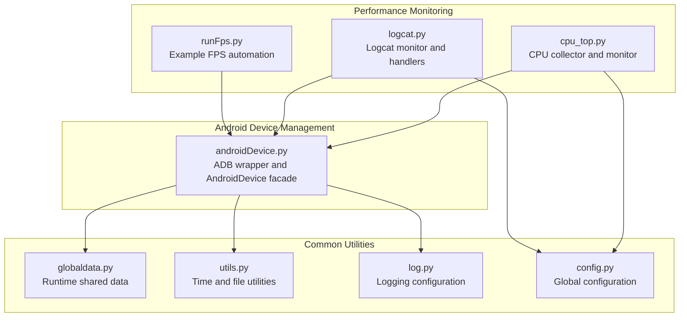
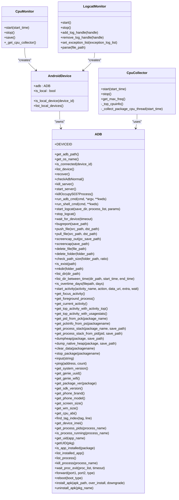
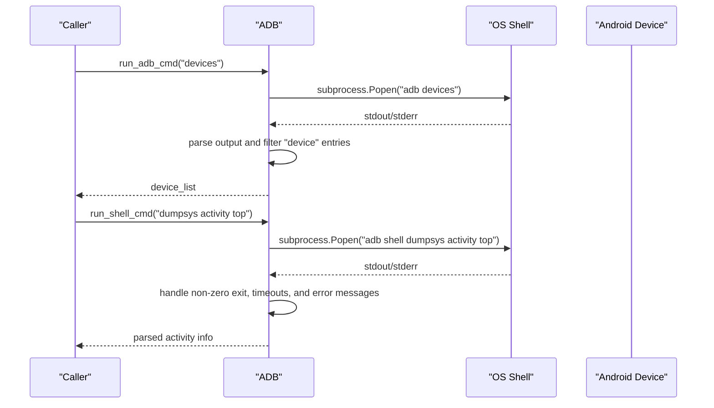
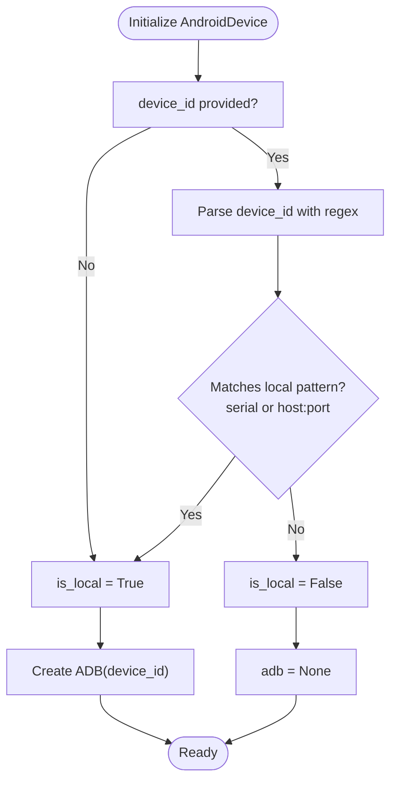
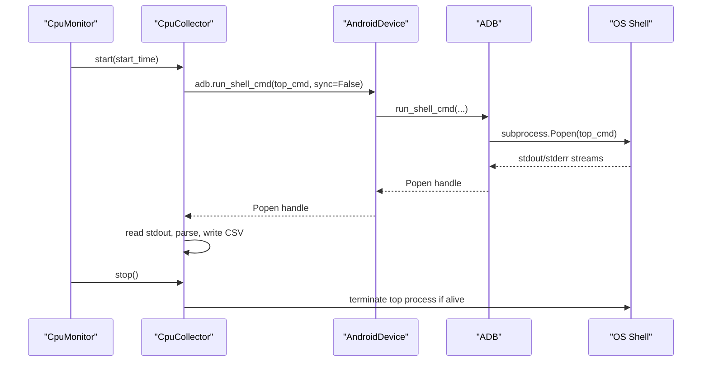
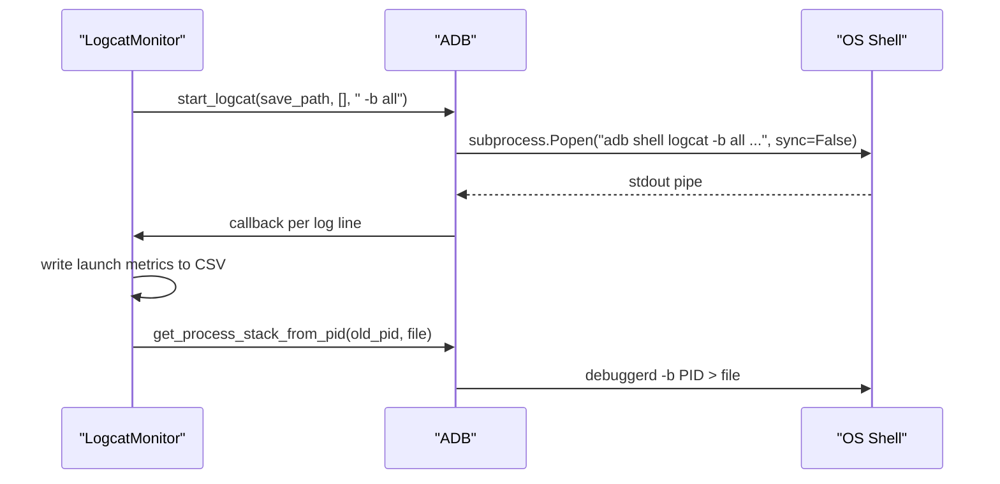
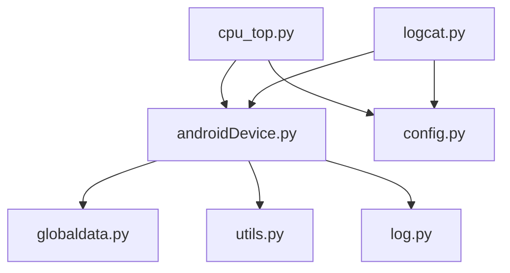
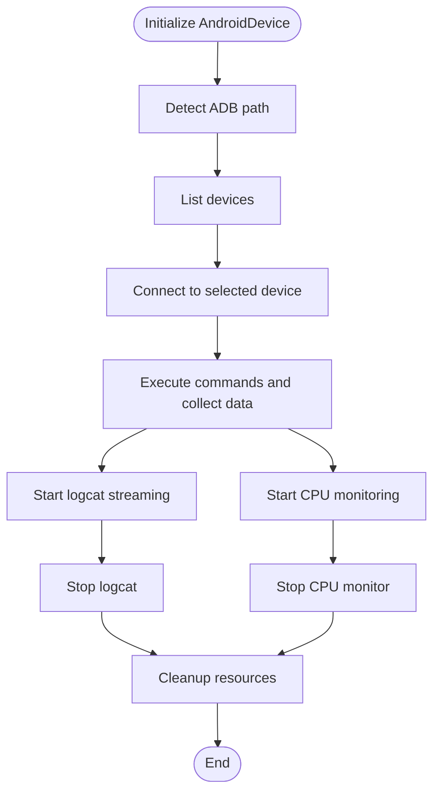

# Android Device Management

<cite>
**Referenced Files in This Document**
- [androidDevice.py](file://mobilePerf/perfCode/androidDevice.py)
- [cpu_top.py](file://mobilePerf/perfCode/cpu_top.py)
- [logcat.py](file://mobilePerf/perfCode/logcat.py)
- [runFps.py](file://mobilePerf/perfCode/runFps.py)
- [globaldata.py](file://mobilePerf/perfCode/globaldata.py)
- [utils.py](file://mobilePerf/perfCode/common/utils.py)
- [log.py](file://mobilePerf/perfCode/common/log.py)
- [config.py](file://mobilePerf/perfCode/common/config.py)
</cite>

## Table of Contents
1. [Introduction](#introduction)
2. [Project Structure](#project-structure)
3. [Core Components](#core-components)
4. [Architecture Overview](#architecture-overview)
5. [Detailed Component Analysis](#detailed-component-analysis)
6. [Dependency Analysis](#dependency-analysis)
7. [Performance Considerations](#performance-considerations)
8. [Troubleshooting Guide](#troubleshooting-guide)
9. [Conclusion](#conclusion)
10. [Appendices](#appendices)

## Introduction
This document describes the Android Device Management component with a focus on the ADB wrapper architecture and Android device connectivity. It explains device discovery, connection management, command execution patterns, and the device lifecycle from connection establishment through command execution to cleanup. It also covers ADB path detection across platforms, device enumeration, connection state management, practical command examples, error handling strategies, troubleshooting common connection issues, and platform-specific considerations for Windows, macOS, and Linux. Finally, it documents the relationship between device management and performance monitoring components such as CPU and logcat collectors.

## Project Structure
The Android device management functionality is centered around a dedicated module that encapsulates ADB operations and integrates with performance monitoring modules. The structure below highlights the key files and their roles.

**Diagram sources**
- [androidDevice.py:18-1157](file://mobilePerf/perfCode/androidDevice.py#L18-L1157)
- [cpu_top.py:1-433](file://mobilePerf/perfCode/cpu_top.py#L1-L433)
- [logcat.py:1-216](file://mobilePerf/perfCode/logcat.py#L1-L216)
- [runFps.py:1-94](file://mobilePerf/perfCode/runFps.py#L1-L94)
- [globaldata.py:1-14](file://mobilePerf/perfCode/globaldata.py#L1-L14)
- [utils.py:1-156](file://mobilePerf/perfCode/common/utils.py#L1-L156)
- [log.py:1-30](file://mobilePerf/perfCode/common/log.py#L1-L30)
- [config.py:1-20](file://mobilePerf/perfCode/common/config.py#L1-L20)

**Section sources**
- [androidDevice.py:1-1177](file://mobilePerf/perfCode/androidDevice.py#L1-L1177)
- [cpu_top.py:1-433](file://mobilePerf/perfCode/cpu_top.py#L1-L433)
- [logcat.py:1-216](file://mobilePerf/perfCode/logcat.py#L1-L216)
- [runFps.py:1-94](file://mobilePerf/perfCode/runFps.py#L1-L94)
- [globaldata.py:1-14](file://mobilePerf/perfCode/globaldata.py#L1-L14)
- [utils.py:1-156](file://mobilePerf/perfCode/common/utils.py#L1-L156)
- [log.py:1-30](file://mobilePerf/perfCode/common/log.py#L1-L30)
- [config.py:1-20](file://mobilePerf/perfCode/common/config.py#L1-L20)

## Core Components
- ADB wrapper: Provides low-level ADB and shell command execution, device enumeration, server management, and robust error handling with retries and timeouts.
- AndroidDevice facade: Encapsulates device identification, local vs remote device classification, and exposes the ADB instance for higher-level operations.
- Performance monitoring integrations: CPU collector and monitor, logcat monitor and handlers, and example FPS automation demonstrate how device management integrates with performance data collection.

Key responsibilities:
- ADB path detection across Windows, macOS, and Linux
- Device discovery and connection state checks
- Command execution with retry, timeout, and async modes
- Server recovery and port conflict resolution
- Logcat streaming with real-time callbacks
- CPU and memory data collection via shell commands

**Section sources**
- [androidDevice.py:18-1157](file://mobilePerf/perfCode/androidDevice.py#L18-L1157)
- [cpu_top.py:206-383](file://mobilePerf/perfCode/cpu_top.py#L206-L383)
- [logcat.py:17-116](file://mobilePerf/perfCode/logcat.py#L17-L116)

## Architecture Overview
The architecture centers on the ADB wrapper class and the AndroidDevice facade, with performance monitoring modules consuming the ADB interface.

**Diagram sources**
- [androidDevice.py:18-1157](file://mobilePerf/perfCode/androidDevice.py#L18-L1157)
- [cpu_top.py:206-383](file://mobilePerf/perfCode/cpu_top.py#L206-L383)
- [logcat.py:17-116](file://mobilePerf/perfCode/logcat.py#L17-L116)

## Detailed Component Analysis

### ADB Wrapper: Device Discovery, Connection Management, and Command Execution
The ADB wrapper centralizes ADB and shell command execution, device enumeration, and server lifecycle management. It supports:
- ADB path detection across platforms with environment variable override and fallback to bundled platform tools.
- Device enumeration and connection checks.
- Robust command execution with retry, timeout, and asynchronous modes.
- Server recovery and port conflict resolution on Windows.
- Logcat streaming with real-time callbacks and file rotation.
- Device property queries, process management, file operations, and app installation/uninstallation.

**Diagram sources**
- [androidDevice.py:91-109](file://mobilePerf/perfCode/androidDevice.py#L91-L109)
- [androidDevice.py:276-292](file://mobilePerf/perfCode/androidDevice.py#L276-L292)
- [androidDevice.py:294-308](file://mobilePerf/perfCode/androidDevice.py#L294-L308)

Key implementation patterns:
- Path detection: Environment variable override, system adb availability check, and bundled platform-tools fallback.
- Device enumeration: Parsing adb devices output to extract serial numbers for connected devices.
- Command execution: Building command arrays, launching subprocesses, handling timeouts via a timer thread, and robust error parsing.
- Server management: Kill/start server and resolve port conflicts on Windows.
- Logcat streaming: Asynchronous process capture with threading, periodic restarts, and file persistence.

**Section sources**
- [androidDevice.py:40-71](file://mobilePerf/perfCode/androidDevice.py#L40-L71)
- [androidDevice.py:91-109](file://mobilePerf/perfCode/androidDevice.py#L91-L109)
- [androidDevice.py:112-149](file://mobilePerf/perfCode/androidDevice.py#L112-L149)
- [androidDevice.py:152-173](file://mobilePerf/perfCode/androidDevice.py#L152-L173)
- [androidDevice.py:190-274](file://mobilePerf/perfCode/androidDevice.py#L190-L274)
- [androidDevice.py:294-308](file://mobilePerf/perfCode/androidDevice.py#L294-L308)
- [androidDevice.py:389-422](file://mobilePerf/perfCode/androidDevice.py#L389-L422)

### AndroidDevice Facade: Local vs Remote Device Classification
The AndroidDevice facade determines whether a device is local or remote based on the device identifier and instantiates the ADB wrapper accordingly. It also provides a convenience method to list local devices.

**Diagram sources**
- [androidDevice.py:1129-1157](file://mobilePerf/perfCode/androidDevice.py#L1129-L1157)

**Section sources**
- [androidDevice.py:1129-1157](file://mobilePerf/perfCode/androidDevice.py#L1129-L1157)

### CPU Collector and Monitor: Integrating Device Management with Performance Data
The CPU collector and monitor integrate with the ADB wrapper to gather CPU metrics periodically. They:
- Determine SDK version and adjust top command flags.
- Stream top output asynchronously and persist raw data.
- Parse CPU metrics per package and aggregate totals.
- Manage lifecycle with start/stop and thread-safe termination.

**Diagram sources**
- [cpu_top.py:206-383](file://mobilePerf/perfCode/cpu_top.py#L206-L383)
- [androidDevice.py:264-280](file://mobilePerf/perfCode/androidDevice.py#L264-L280)

**Section sources**
- [cpu_top.py:206-383](file://mobilePerf/perfCode/cpu_top.py#L206-L383)
- [androidDevice.py:264-280](file://mobilePerf/perfCode/androidDevice.py#L264-L280)

### Logcat Monitor: Real-Time Logging and Exception Handling
The Logcat monitor starts logcat with appropriate buffers, registers real-time handlers, and writes structured CSV data for launch time metrics. It also captures process stacks upon exceptions.

**Diagram sources**
- [logcat.py:32-69](file://mobilePerf/perfCode/logcat.py#L32-L69)
- [logcat.py:85-116](file://mobilePerf/perfCode/logcat.py#L85-L116)
- [androidDevice.py:389-422](file://mobilePerf/perfCode/androidDevice.py#L389-L422)

**Section sources**
- [logcat.py:17-116](file://mobilePerf/perfCode/logcat.py#L17-L116)
- [androidDevice.py:389-422](file://mobilePerf/perfCode/androidDevice.py#L389-L422)

### Practical Examples of Device Commands
- Enumerate devices: Use the device enumeration method to retrieve connected devices.
- Execute shell commands: Run dumpsys, am, pm, and file system commands through the shell wrapper.
- Install/uninstall apps: Push APKs and use package manager commands with robust error handling.
- Capture logs: Start logcat with buffer selection and write logs to files.
- Screen capture: Take screenshots via exec-out or shell screencap.

These examples are implemented via the ADB wrapper’s command execution methods and are integrated by higher-level monitors.

**Section sources**
- [androidDevice.py:91-109](file://mobilePerf/perfCode/androidDevice.py#L91-L109)
- [androidDevice.py:276-308](file://mobilePerf/perfCode/androidDevice.py#L276-L308)
- [androidDevice.py:1056-1126](file://mobilePerf/perfCode/androidDevice.py#L1056-L1126)
- [androidDevice.py:389-422](file://mobilePerf/perfCode/androidDevice.py#L389-L422)
- [androidDevice.py:475-481](file://mobilePerf/perfCode/androidDevice.py#L475-L481)

### Platform-Specific Considerations
- Windows: Environment variable override for ADB path, bundled platform-tools fallback, and explicit port conflict resolution for the ADB server port.
- macOS/Linux: System adb availability check and bundled platform-tools fallback; shell command execution differences handled by constructing command arrays and invoking shell appropriately.

**Section sources**
- [androidDevice.py:40-71](file://mobilePerf/perfCode/androidDevice.py#L40-L71)
- [androidDevice.py:152-173](file://mobilePerf/perfCode/androidDevice.py#L152-L173)

## Dependency Analysis
The Android device management module depends on common utilities for timing and file operations, logging for diagnostics, and runtime data for shared state. Performance monitoring modules depend on the ADB wrapper to execute shell commands and collect metrics.

**Diagram sources**
- [androidDevice.py:1-16](file://mobilePerf/perfCode/androidDevice.py#L1-L16)
- [cpu_top.py:1-12](file://mobilePerf/perfCode/cpu_top.py#L1-L12)
- [logcat.py:1-14](file://mobilePerf/perfCode/logcat.py#L1-L14)
- [globaldata.py:1-14](file://mobilePerf/perfCode/globaldata.py#L1-L14)
- [utils.py:1-10](file://mobilePerf/perfCode/common/utils.py#L1-L10)
- [log.py:1-10](file://mobilePerf/perfCode/common/log.py#L1-L10)
- [config.py:1-20](file://mobilePerf/perfCode/common/config.py#L1-L20)

**Section sources**
- [androidDevice.py:1-16](file://mobilePerf/perfCode/androidDevice.py#L1-L16)
- [cpu_top.py:1-12](file://mobilePerf/perfCode/cpu_top.py#L1-L12)
- [logcat.py:1-14](file://mobilePerf/perfCode/logcat.py#L1-L14)
- [globaldata.py:1-14](file://mobilePerf/perfCode/globaldata.py#L1-L14)
- [utils.py:1-10](file://mobilePerf/perfCode/common/utils.py#L1-L10)
- [log.py:1-10](file://mobilePerf/perfCode/common/log.py#L1-L10)
- [config.py:1-20](file://mobilePerf/perfCode/common/config.py#L1-L20)

## Performance Considerations
- Command timeouts: The ADB wrapper enforces timeouts for synchronous commands and uses a timer thread to terminate long-running processes.
- Retry logic: Commands are retried a configurable number of times to mitigate transient failures.
- Asynchronous execution: Some operations support asynchronous mode to avoid blocking the main thread.
- Logcat streaming: Periodic restarts and file rotation prevent unbounded growth of log files.
- Top command tuning: Adjustments for different Android versions improve accuracy and compatibility.

[No sources needed since this section provides general guidance]

## Troubleshooting Guide
Common connection issues and resolutions:
- No devices/emulators found: Verify device connection and ADB shell availability; reconnect the device.
- Port 5037 occupied: On Windows, the wrapper detects and terminates the conflicting process before restarting the ADB server.
- Device offline: Reconnect the device and ensure ADB recognizes it.
- Multiple devices present: Specify the device serial number to disambiguate.
- ADB server ACK failure: Restart the ADB server after killing the occupying process.

Error handling strategies:
- Robust parsing of command output and stderr to detect failure conditions.
- Graceful degradation and logging for unsupported commands or device states.
- Structured logging for diagnostics and recovery actions.

**Section sources**
- [androidDevice.py:112-149](file://mobilePerf/perfCode/androidDevice.py#L112-L149)
- [androidDevice.py:152-173](file://mobilePerf/perfCode/androidDevice.py#L152-L173)
- [androidDevice.py:236-261](file://mobilePerf/perfCode/androidDevice.py#L236-L261)

## Conclusion
The Android Device Management component provides a robust ADB wrapper and AndroidDevice facade that enable reliable device discovery, connection management, and command execution across platforms. Its integration with performance monitoring modules demonstrates how device management serves as the foundation for collecting CPU, memory, and log data during automated testing and profiling workflows. The wrapper’s error handling, retry mechanisms, and server recovery features contribute to resilient automation in diverse environments.

[No sources needed since this section summarizes without analyzing specific files]

## Appendices

### Device Lifecycle: From Connection to Cleanup

[No sources needed since this diagram shows conceptual workflow, not actual code structure]