# Data Processing and Export

<cite>
**Referenced Files in This Document**
- [README.md](file://README.md)
- [utils.py](file://mobilePerf/perfCode/common/utils.py)
- [config.py](file://mobilePerf/perfCode/common/config.py)
- [log.py](file://mobilePerf/perfCode/common/log.py)
- [basemonitor.py](file://mobilePerf/perfCode/common/basemonitor.py)
- [globaldata.py](file://mobilePerf/perfCode/globaldata.py)
- [androidDevice.py](file://mobilePerf/perfCode/androidDevice.py)
- [cpu_top.py](file://mobilePerf/perfCode/cpu_top.py)
- [logcat.py](file://mobilePerf/perfCode/logcat.py)
- [runFps.py](file://mobilePerf/perfCode/runFps.py)
- [changeFile.py](file://mobilePerf/tools/changeFile.py)
- [chooseFileToChart.py](file://mobilePerf/tools/chooseFileToChart.py)
- [csvToChart.py](file://mobilePerf/tools/csvToChart.py)
- [testPhoneTime.py](file://mobilePerf/tools/testPhoneTime.py)
- [PrivateDirty-main-29179_Memory_1669277683476_1669281383398.csv](file://mobilePerf/report/prefData/PrivateDirty-main-29179_Memory_1669277683476_1669281383398.csv)
</cite>

## Table of Contents
1. [Introduction](#introduction)
2. [Project Structure](#project-structure)
3. [Core Components](#core-components)
4. [Architecture Overview](#architecture-overview)
5. [Detailed Component Analysis](#detailed-component-analysis)
6. [Dependency Analysis](#dependency-analysis)
7. [Performance Considerations](#performance-considerations)
8. [Troubleshooting Guide](#troubleshooting-guide)
9. [Conclusion](#conclusion)
10. [Appendices](#appendices)

## Introduction
This document explains the Data Processing and Export functionality for mobile performance measurement. It covers the end-to-end pipeline from raw metrics extraction to structured CSV exports, including timestamp formatting, metric normalization, and file organization. It also documents log processing workflows for crash analysis, error pattern detection, and system event correlation. Configuration management for export parameters, retention policies, and file naming conventions is included, along with examples of export workflows, customization options, and integration with external analysis tools.

## Project Structure
The performance data pipeline spans several modules:
- Common utilities for time formatting, file operations, and unit conversions
- Device abstraction and logcat collection
- Performance collectors (CPU, FPS) and exporters
- Tools for device-side data retrieval, CSV organization, and chart generation
- Logging infrastructure for diagnostics and retention

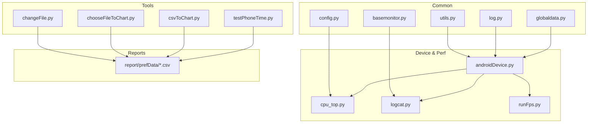

**Diagram sources**
- [utils.py:10-156](file://mobilePerf/perfCode/common/utils.py#L10-L156)
- [config.py:1-20](file://mobilePerf/perfCode/common/config.py#L1-L20)
- [log.py:1-30](file://mobilePerf/perfCode/common/log.py#L1-L30)
- [basemonitor.py:1-37](file://mobilePerf/perfCode/common/basemonitor.py#L1-L37)
- [globaldata.py:1-14](file://mobilePerf/perfCode/globaldata.py#L1-L14)
- [androidDevice.py:1-1177](file://mobilePerf/perfCode/androidDevice.py#L1-L1177)
- [cpu_top.py:1-433](file://mobilePerf/perfCode/cpu_top.py#L1-L433)
- [logcat.py:1-216](file://mobilePerf/perfCode/logcat.py#L1-L216)
- [runFps.py:1-94](file://mobilePerf/perfCode/runFps.py#L1-L94)
- [changeFile.py:1-106](file://mobilePerf/tools/changeFile.py#L1-L106)
- [chooseFileToChart.py:1-271](file://mobilePerf/tools/chooseFileToChart.py#L1-L271)
- [csvToChart.py:1-172](file://mobilePerf/tools/csvToChart.py#L1-L172)
- [testPhoneTime.py:1-206](file://mobilePerf/tools/testPhoneTime.py#L1-L206)

**Section sources**
- [README.md:24-31](file://README.md#L24-L31)

## Core Components
- Time and File Utilities: Centralized helpers for timestamp formatting, time arithmetic, and file operations.
- Configuration: Default intervals, device identifiers, and storage paths.
- Logging: Structured logging with rotating handlers and standardized formats.
- Device Abstraction: ADB wrapper for device connectivity, logcat streaming, and file operations.
- Performance Collectors: CPU collector writing CSV with normalized metrics and timestamps.
- Log Processing: Real-time log parsing for launch events and exception detection.
- Tools: Device-side data retrieval, CSV organization, and chart generation.

**Section sources**
- [utils.py:10-156](file://mobilePerf/perfCode/common/utils.py#L10-L156)
- [config.py:1-20](file://mobilePerf/perfCode/common/config.py#L1-L20)
- [log.py:1-30](file://mobilePerf/perfCode/common/log.py#L1-L30)
- [androidDevice.py:18-422](file://mobilePerf/perfCode/androidDevice.py#L18-L422)
- [cpu_top.py:206-383](file://mobilePerf/perfCode/cpu_top.py#L206-L383)
- [logcat.py:17-212](file://mobilePerf/perfCode/logcat.py#L17-L212)
- [changeFile.py:55-101](file://mobilePerf/tools/changeFile.py#L55-L101)
- [chooseFileToChart.py:176-224](file://mobilePerf/tools/chooseFileToChart.py#L176-L224)
- [csvToChart.py:10-172](file://mobilePerf/tools/csvToChart.py#L10-L172)

## Architecture Overview
The system orchestrates data collection via ADB, transforms metrics into CSV, and organizes outputs by category and date. Logs are captured in real time and correlated with performance events.

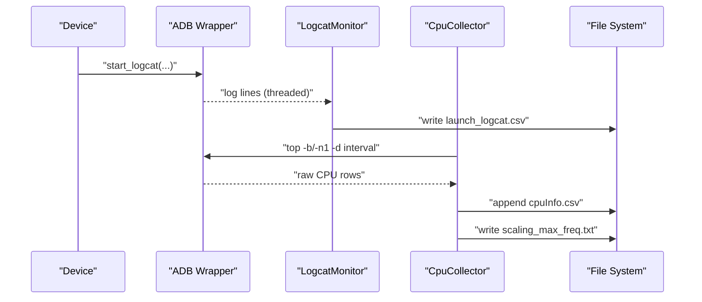

**Diagram sources**
- [logcat.py:32-69](file://mobilePerf/perfCode/logcat.py#L32-L69)
- [androidDevice.py:389-422](file://mobilePerf/perfCode/androidDevice.py#L389-L422)
- [cpu_top.py:240-347](file://mobilePerf/perfCode/cpu_top.py#L240-L347)

## Detailed Component Analysis

### Time and File Utilities
- Timestamp formatting supports multiple patterns for filenames and human-readable logs.
- Time arithmetic enables interval calculations and time-window filtering.
- File utilities provide recursive file discovery, size/time metadata, and zipping.

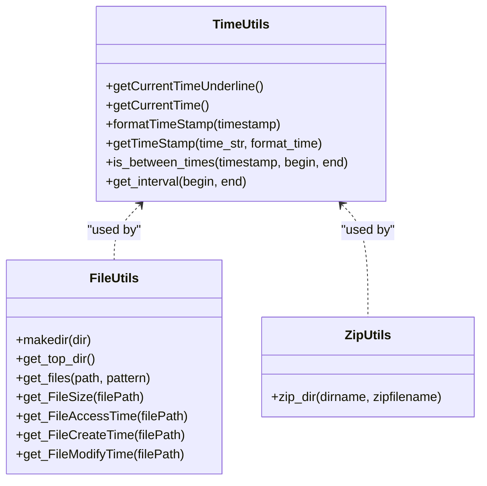

**Diagram sources**
- [utils.py:10-156](file://mobilePerf/perfCode/common/utils.py#L10-L156)

**Section sources**
- [utils.py:10-156](file://mobilePerf/perfCode/common/utils.py#L10-L156)

### Configuration Management
- Default sampling interval, device ID, package name, and network profile.
- Log location and performance data storage path are derived from runtime configuration.

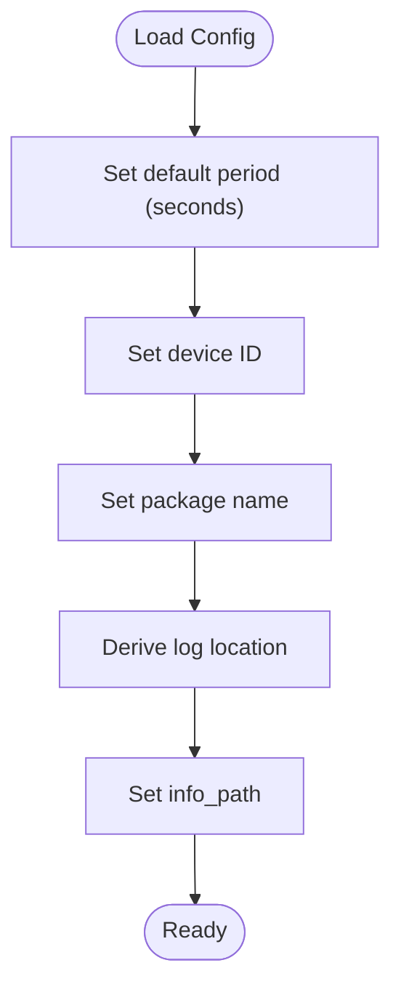

**Diagram sources**
- [config.py:1-20](file://mobilePerf/perfCode/common/config.py#L1-L20)

**Section sources**
- [config.py:1-20](file://mobilePerf/perfCode/common/config.py#L1-L20)

### Logging Infrastructure
- Rotating file handler with suffix-based rotation and backup retention.
- Stream handler for console output; both use a consistent formatter.

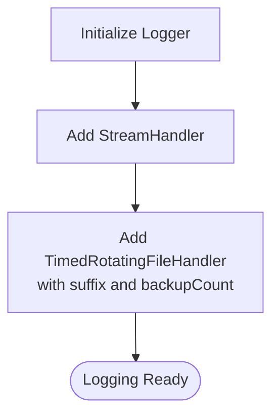

**Diagram sources**
- [log.py:11-26](file://mobilePerf/perfCode/common/log.py#L11-L26)

**Section sources**
- [log.py:1-30](file://mobilePerf/perfCode/common/log.py#L1-L30)

### Device Abstraction and Logcat Collection
- Robust ADB commands with retries, timeouts, and error handling.
- Real-time logcat streaming with periodic file rollover and per-file line limits.
- Utility methods for listing directories, filtering by time windows, and pulling files.

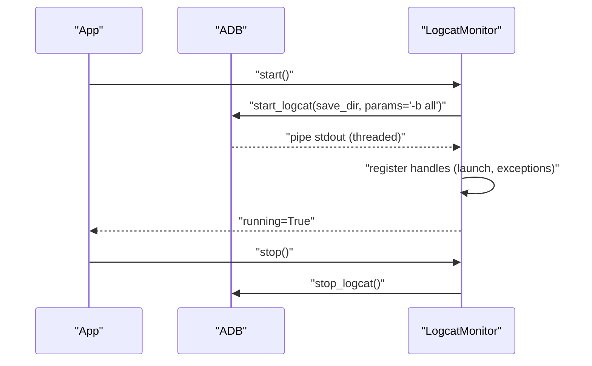

**Diagram sources**
- [logcat.py:32-69](file://mobilePerf/perfCode/logcat.py#L32-L69)
- [androidDevice.py:389-422](file://mobilePerf/perfCode/androidDevice.py#L389-L422)

**Section sources**
- [androidDevice.py:18-422](file://mobilePerf/perfCode/androidDevice.py#L18-L422)
- [logcat.py:17-212](file://mobilePerf/perfCode/logcat.py#L17-L212)

### CPU Metrics Collector and CSV Export
- Periodic sampling via top command with adaptive fallback.
- Writes a structured CSV with timestamps, device CPU stats, and per-package metrics.
- Includes auxiliary files for frequency and uptime logs.

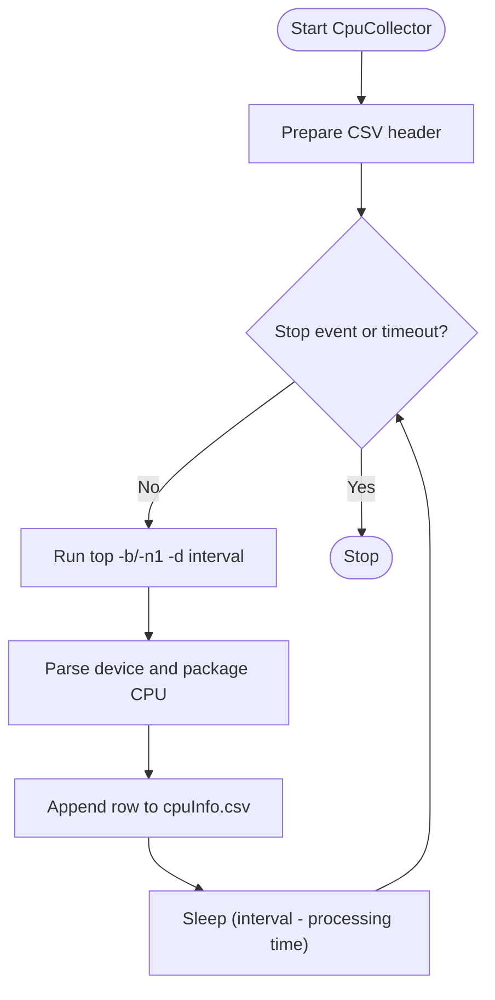

**Diagram sources**
- [cpu_top.py:240-347](file://mobilePerf/perfCode/cpu_top.py#L240-L347)

**Section sources**
- [cpu_top.py:206-383](file://mobilePerf/perfCode/cpu_top.py#L206-L383)

### Log Processing for Crash Analysis and Event Correlation
- Launch time extraction from logcat lines with millisecond-to-second conversion.
- Exception log detection and optional process stack capture for diagnosis.
- Correlation of events via shared runtime paths and timestamps.

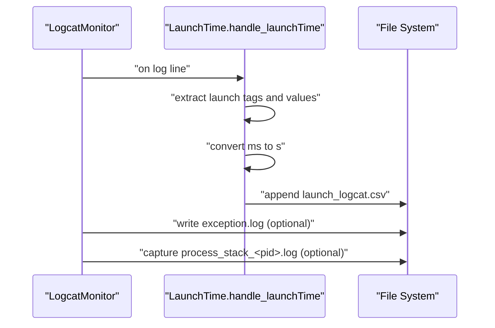

**Diagram sources**
- [logcat.py:135-212](file://mobilePerf/perfCode/logcat.py#L135-L212)
- [utils.py:138-151](file://mobilePerf/perfCode/common/utils.py#L138-L151)

**Section sources**
- [logcat.py:85-116](file://mobilePerf/perfCode/logcat.py#L85-L116)
- [logcat.py:118-212](file://mobilePerf/perfCode/logcat.py#L118-L212)
- [utils.py:138-151](file://mobilePerf/perfCode/common/utils.py#L138-L151)

### CSV Export Mechanisms and File Organization
- Device-side data retrieval and automatic CSV organization by category and date.
- Local tools move and rename collected CSVs into organized folders (CPU, MEM, FPS, TEMP).
- Chart generation reads CSVs and produces plots for quick analysis.

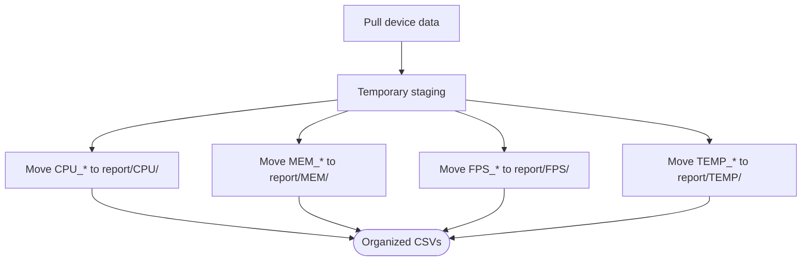

**Diagram sources**
- [changeFile.py:55-95](file://mobilePerf/tools/changeFile.py#L55-L95)
- [chooseFileToChart.py:176-224](file://mobilePerf/tools/chooseFileToChart.py#L176-L224)

**Section sources**
- [changeFile.py:55-101](file://mobilePerf/tools/changeFile.py#L55-L101)
- [chooseFileToChart.py:176-224](file://mobilePerf/tools/chooseFileToChart.py#L176-L224)
- [csvToChart.py:10-72](file://mobilePerf/tools/csvToChart.py#L10-L72)

### Data Validation, Error Handling, and Normalization
- CSV readers filter invalid rows and apply domain-specific thresholds.
- Unit conversions normalize raw values (e.g., milliseconds to seconds).
- Robust ADB error handling and retry logic prevent transient failures from halting pipelines.

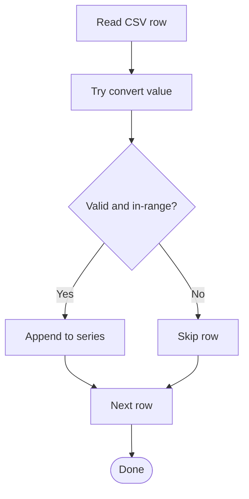

**Diagram sources**
- [csvToChart.py:137-164](file://mobilePerf/tools/csvToChart.py#L137-L164)

**Section sources**
- [csvToChart.py:74-116](file://mobilePerf/tools/csvToChart.py#L74-L116)
- [utils.py:138-151](file://mobilePerf/perfCode/common/utils.py#L138-L151)

### Examples of Data Export Workflows
- Device-side collection and local organization:
  - Use device-side tooling to pull performance records.
  - Run the organization script to move and rename CSVs into category folders.
- Chart generation:
  - Invoke chart tool to produce plots from the latest CSVs.
- Integration with external analysis:
  - CSVs are structured and timestamped for ingestion by external tools.

**Section sources**
- [README.md:24-31](file://README.md#L24-L31)
- [changeFile.py:55-101](file://mobilePerf/tools/changeFile.py#L55-L101)
- [chooseFileToChart.py:176-224](file://mobilePerf/tools/chooseFileToChart.py#L176-L224)
- [csvToChart.py:10-72](file://mobilePerf/tools/csvToChart.py#L10-L72)

## Dependency Analysis
The following diagram highlights key dependencies among modules involved in data processing and export.

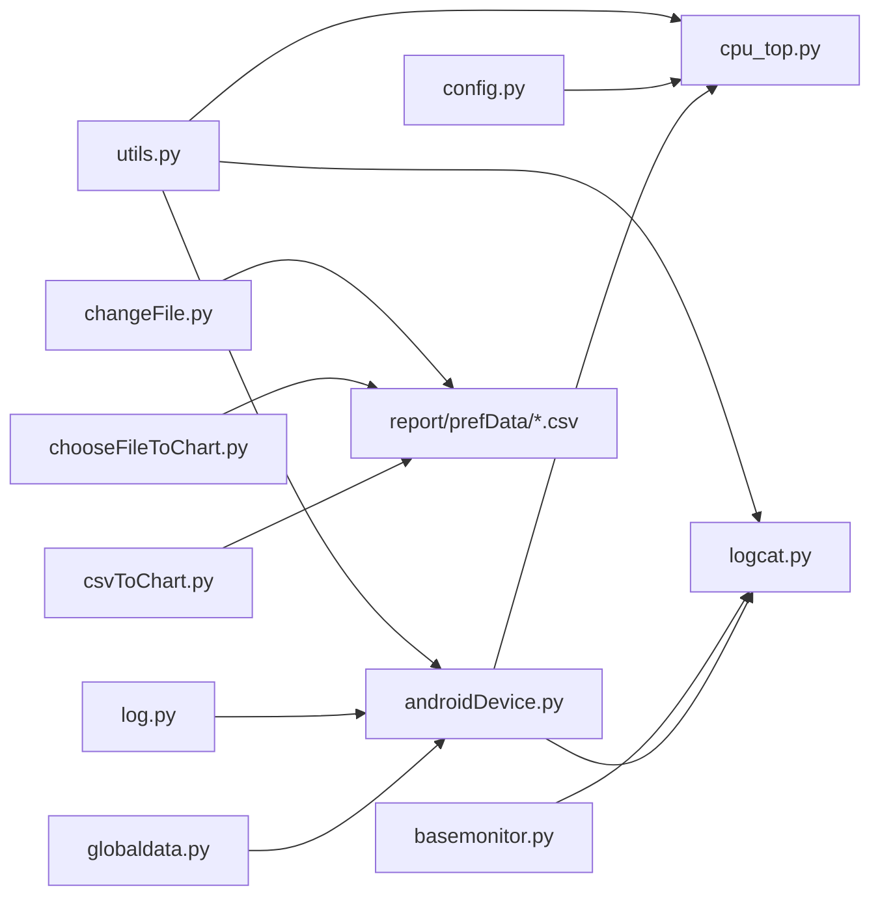

**Diagram sources**
- [utils.py:10-156](file://mobilePerf/perfCode/common/utils.py#L10-L156)
- [config.py:1-20](file://mobilePerf/perfCode/common/config.py#L1-L20)
- [log.py:1-30](file://mobilePerf/perfCode/common/log.py#L1-L30)
- [basemonitor.py:1-37](file://mobilePerf/perfCode/common/basemonitor.py#L1-L37)
- [globaldata.py:1-14](file://mobilePerf/perfCode/globaldata.py#L1-L14)
- [androidDevice.py:18-422](file://mobilePerf/perfCode/androidDevice.py#L18-L422)
- [cpu_top.py:206-383](file://mobilePerf/perfCode/cpu_top.py#L206-L383)
- [logcat.py:17-212](file://mobilePerf/perfCode/logcat.py#L17-L212)
- [changeFile.py:55-101](file://mobilePerf/tools/changeFile.py#L55-L101)
- [chooseFileToChart.py:176-224](file://mobilePerf/tools/chooseFileToChart.py#L176-L224)
- [csvToChart.py:10-72](file://mobilePerf/tools/csvToChart.py#L10-L72)

**Section sources**
- [androidDevice.py:18-422](file://mobilePerf/perfCode/androidDevice.py#L18-L422)
- [cpu_top.py:206-383](file://mobilePerf/perfCode/cpu_top.py#L206-L383)
- [logcat.py:17-212](file://mobilePerf/perfCode/logcat.py#L17-L212)
- [changeFile.py:55-101](file://mobilePerf/tools/changeFile.py#L55-L101)
- [chooseFileToChart.py:176-224](file://mobilePerf/tools/chooseFileToChart.py#L176-L224)
- [csvToChart.py:10-72](file://mobilePerf/tools/csvToChart.py#L10-L72)

## Performance Considerations
- Sampling intervals: Tune the interval to balance granularity and overhead.
- File rollover: Logcat files roll periodically to avoid unbounded growth.
- CSV writes: Batch appends and minimal parsing reduce I/O overhead.
- Retention: Use rotating log handlers and periodic cleanup to manage disk usage.
- Large datasets: Normalize units early and filter outliers before plotting.

[No sources needed since this section provides general guidance]

## Troubleshooting Guide
- ADB connectivity issues: The ADB wrapper detects missing devices, offline states, and port conflicts; it logs actionable errors and suggests corrective actions.
- Logcat stability: If logcat stops unexpectedly, the wrapper restarts it and continues capturing.
- CSV parsing errors: The chart tool skips invalid rows and reports parsing issues; verify CSV headers and numeric formats.
- Device-side data availability: Ensure the device-side tool is installed and data is present in the expected directory before pulling.

**Section sources**
- [androidDevice.py:236-261](file://mobilePerf/perfCode/androidDevice.py#L236-L261)
- [logcat.py:32-69](file://mobilePerf/perfCode/logcat.py#L32-L69)
- [csvToChart.py:137-164](file://mobilePerf/tools/csvToChart.py#L137-L164)
- [chooseFileToChart.py:140-157](file://mobilePerf/tools/chooseFileToChart.py#L140-L157)

## Conclusion
The system provides a robust pipeline for collecting, transforming, and exporting mobile performance data. It leverages ADB for device interaction, structured CSV exports for analyzability, and log processing for crash and event correlation. With configurable intervals, normalized units, and organized file layouts, it supports both automated workflows and manual inspection. Extending the pipeline to new metrics or integrating with external tools is straightforward due to the modular design and consistent data formats.

[No sources needed since this section summarizes without analyzing specific files]

## Appendices

### CSV Export Examples and Patterns
- CPU CSV: Contains device and per-package CPU metrics with timestamps.
- Launch CSV: Captures launch times and types extracted from logcat.
- Memory CSV: Example shows memory-related metrics with record timestamps.

**Section sources**
- [cpu_top.py:296-304](file://mobilePerf/perfCode/cpu_top.py#L296-L304)
- [logcat.py:182-211](file://mobilePerf/perfCode/logcat.py#L182-L211)
- [PrivateDirty-main-29179_Memory_1669277683476_1669281383398.csv:1-23](file://mobilePerf/report/prefData/PrivateDirty-main-29179_Memory_1669277683476_1669281383398.csv#L1-L23)

### Configuration Options for Data Export
- Interval tuning: Adjust sampling interval for CPU collection.
- Storage paths: Configure log location and performance data storage.
- Naming conventions: Date-based CSV naming and rotating log suffixes.

**Section sources**
- [config.py:6-19](file://mobilePerf/perfCode/common/config.py#L6-L19)
- [log.py:20-22](file://mobilePerf/perfCode/common/log.py#L20-L22)
- [changeFile.py:74-91](file://mobilePerf/tools/changeFile.py#L74-L91)
- [chooseFileToChart.py:200-215](file://mobilePerf/tools/chooseFileToChart.py#L200-L215)

### Integration with External Analysis Tools
- CSVs are structured and timestamped for ingestion by external tools.
- Chart generation demonstrates how to derive summary statistics and plots.

**Section sources**
- [csvToChart.py:10-72](file://mobilePerf/tools/csvToChart.py#L10-L72)
- [README.md:24-31](file://README.md#L24-L31)