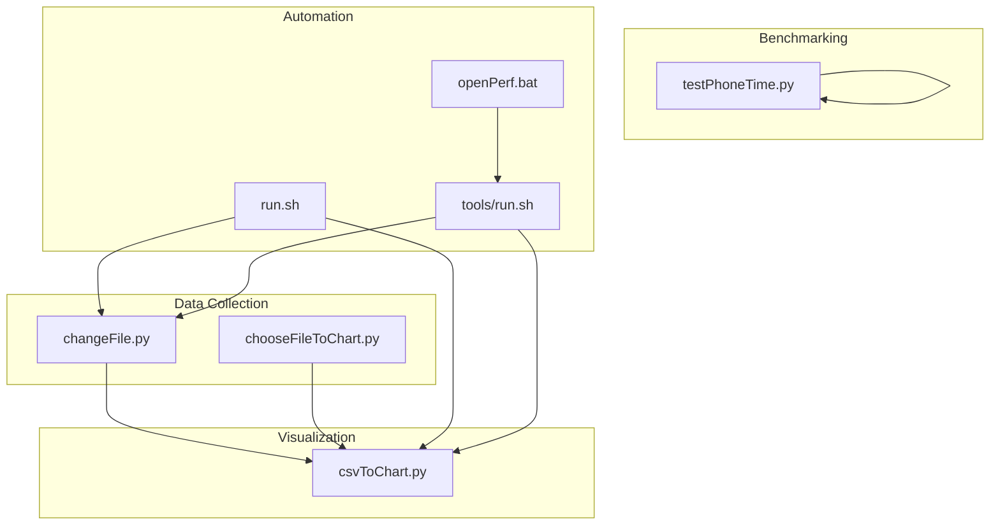
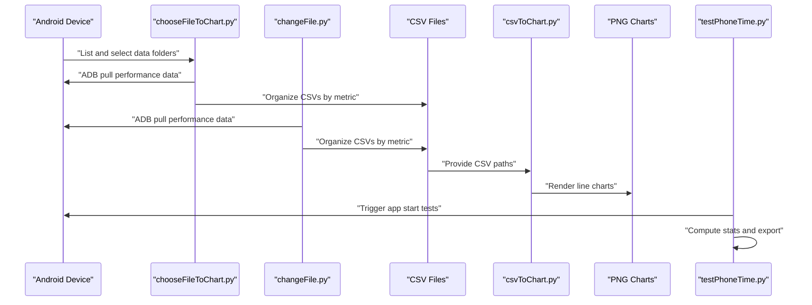
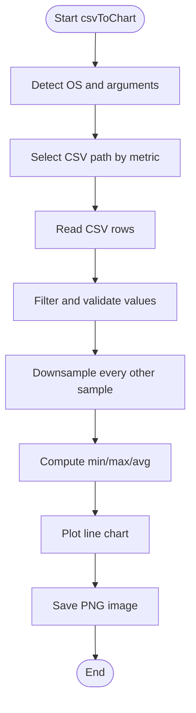
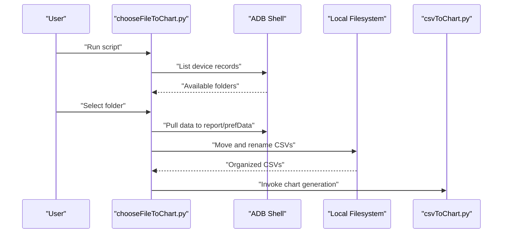
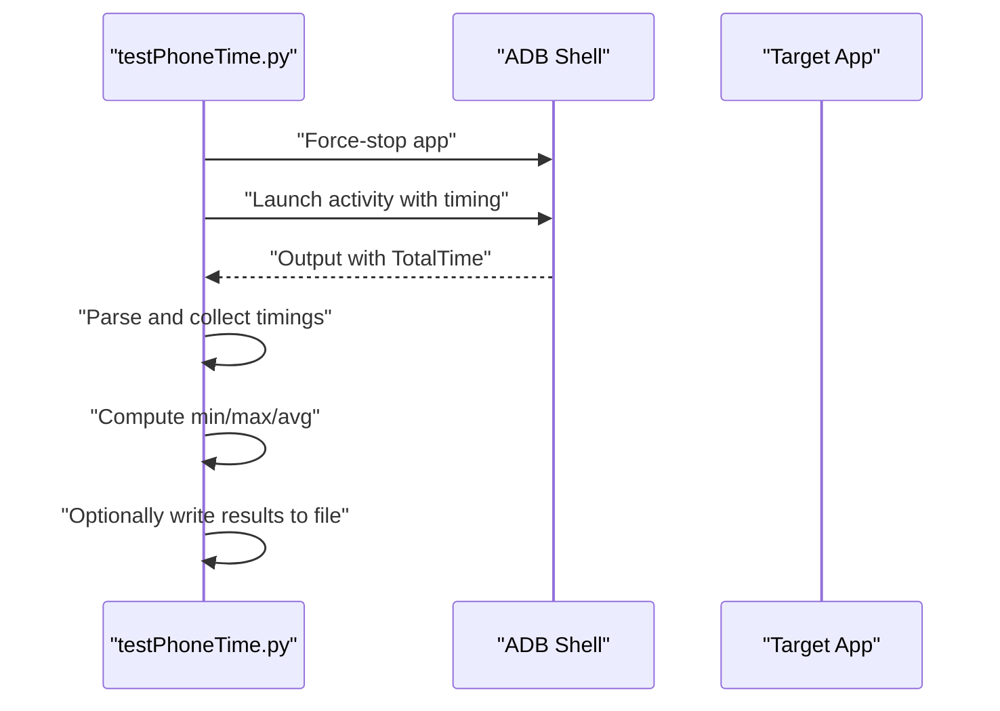
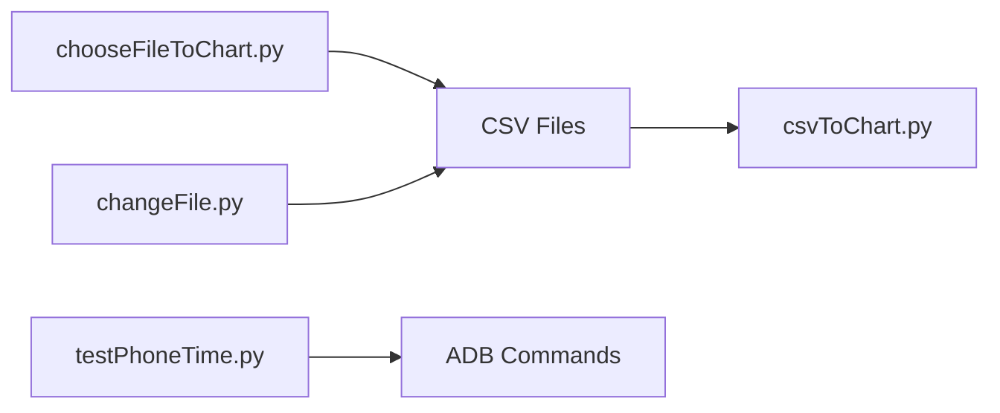

# Data Visualization and Reporting

<cite>
**Referenced Files in This Document**
- [csvToChart.py](file://mobilePerf/tools/csvToChart.py)
- [chooseFileToChart.py](file://mobilePerf/tools/chooseFileToChart.py)
- [testPhoneTime.py](file://mobilePerf/tools/testPhoneTime.py)
- [changeFile.py](file://mobilePerf/tools/changeFile.py)
- [run.sh](file://mobilePerf/run.sh)
- [openPerf.bat](file://mobilePerf/tools/openPerf.bat)
- [run.sh](file://mobilePerf/tools/run.sh)
- [README.md](file://README.md)
- [CPU_2022-11-23.csv](file://mobilePerf/report/CPU/CPU_2022-11-23.csv)
- [FPS_2022-11-23.csv](file://mobilePerf/report/FPS/FPS_2022-11-23.csv)
</cite>

## Table of Contents
1. [Introduction](#introduction)
2. [Project Structure](#project-structure)
3. [Core Components](#core-components)
4. [Architecture Overview](#architecture-overview)
5. [Detailed Component Analysis](#detailed-component-analysis)
6. [Dependency Analysis](#dependency-analysis)
7. [Performance Considerations](#performance-considerations)
8. [Troubleshooting Guide](#troubleshooting-guide)
9. [Conclusion](#conclusion)
10. [Appendices](#appendices)

## Introduction
This document explains the Data Visualization and Reporting capabilities for mobile performance analysis. It covers:
- CSV-to-chart conversion using csvToChart.py
- File selection and chart generation workflow using chooseFileToChart.py
- Startup time testing using testPhoneTime.py
- Batch processing and template-based reporting patterns
- Visualization customization, report automation, and dashboard integration strategies
- Chart performance optimization, data filtering, and export strategies tailored to different stakeholders

## Project Structure
The visualization pipeline integrates three primary tools:
- Data collection and organization: chooseFileToChart.py and changeFile.py
- Visualization generation: csvToChart.py
- Performance benchmarking: testPhoneTime.py
- Automation scripts: run.sh and openPerf.bat

**Diagram sources**
- [changeFile.py:1-106](file://mobilePerf/tools/changeFile.py#L1-L106)
- [chooseFileToChart.py:1-271](file://mobilePerf/tools/chooseFileToChart.py#L1-L271)
- [csvToChart.py:1-172](file://mobilePerf/tools/csvToChart.py#L1-L172)
- [testPhoneTime.py:1-206](file://mobilePerf/tools/testPhoneTime.py#L1-L206)
- [run.sh:1-11](file://mobilePerf/run.sh#L1-L11)
- [openPerf.bat:1-7](file://mobilePerf/tools/openPerf.bat#L1-L7)
- [run.sh:1-2](file://mobilePerf/tools/run.sh#L1-L2)

**Section sources**
- [README.md:24-36](file://README.md#L24-L36)
- [run.sh:1-11](file://mobilePerf/run.sh#L1-L11)
- [openPerf.bat:1-7](file://mobilePerf/tools/openPerf.bat#L1-L7)

## Core Components
- CSV-to-chart converter: Reads performance CSVs and generates line charts for CPU, MEM, FPS, and TEMP metrics.
- File selector and organizer: Pulls performance data from Android devices via ADB and organizes it into structured CSVs.
- Startup time tester: Measures cold and hot start durations for an app and exports statistical summaries.
- Automation scripts: Provide batch processing and cross-platform invocation.

Key responsibilities:
- Data ingestion and preprocessing
- Visualization rendering and export
- Benchmarking and statistical reporting
- Cross-platform compatibility (Windows/macOS)

**Section sources**
- [csvToChart.py:10-172](file://mobilePerf/tools/csvToChart.py#L10-L172)
- [chooseFileToChart.py:54-271](file://mobilePerf/tools/chooseFileToChart.py#L54-L271)
- [testPhoneTime.py:9-206](file://mobilePerf/tools/testPhoneTime.py#L9-L206)
- [changeFile.py:55-106](file://mobilePerf/tools/changeFile.py#L55-L106)

## Architecture Overview
The system follows a staged pipeline:
1. Device data collection → CSV files
2. CSV normalization → standardized metrics
3. Visualization generation → PNG charts
4. Benchmarking → statistical reports
5. Automation → repeatable batch runs

**Diagram sources**
- [chooseFileToChart.py:120-271](file://mobilePerf/tools/chooseFileToChart.py#L120-L271)
- [changeFile.py:13-106](file://mobilePerf/tools/changeFile.py#L13-L106)
- [csvToChart.py:10-172](file://mobilePerf/tools/csvToChart.py#L10-L172)
- [testPhoneTime.py:16-186](file://mobilePerf/tools/testPhoneTime.py#L16-L186)

## Detailed Component Analysis

### CSV-to-Chart Converter (csvToChart.py)
Purpose:
- Convert collected CSV performance data into line charts for CPU, MEM, FPS, and TEMP.
- Support Windows and macOS environments with platform-specific defaults.

Supported chart types and metrics:
- FPS: frame rate derived from gfxinfo-like data
- CPU: process CPU percentage
- MEM: PSS memory usage
- TEMP: device temperature

Styling and export:
- Figure size and DPI configured for quality output
- Grid, axis labels, and title set for readability
- Exported images saved under report/<metric>/YYYY-MM-DD.png

Data filtering and preprocessing:
- Filters out zero or invalid values
- Applies thresholds per metric (e.g., FPS ≤ 90, CPU ≤ 100)
- Downsamples by removing every other sample to reduce noise
- Computes min/max/average statistics for each metric

**Diagram sources**
- [csvToChart.py:10-172](file://mobilePerf/tools/csvToChart.py#L10-L172)

**Section sources**
- [csvToChart.py:10-172](file://mobilePerf/tools/csvToChart.py#L10-L172)

### File Selection and Chart Generation Workflow (chooseFileToChart.py)
Purpose:
- Interactively select a performance data folder from an Android device
- Pull data via ADB and organize CSVs into report directories
- Automate chart generation for selected metrics

Key steps:
- List available data directories on the device
- Prompt user to select a dataset
- Pull data to local report/prefData and move organized CSVs to report/<metric>
- Trigger chart generation for CPU, MEM, FPS, TEMP

Batch processing:
- Supports repeated runs for multiple datasets
- Creates required directories automatically

**Diagram sources**
- [chooseFileToChart.py:120-271](file://mobilePerf/tools/chooseFileToChart.py#L120-L271)
- [csvToChart.py:10-172](file://mobilePerf/tools/csvToChart.py#L10-L172)

**Section sources**
- [chooseFileToChart.py:54-271](file://mobilePerf/tools/chooseFileToChart.py#L54-L271)

### Startup Time Testing (testPhoneTime.py)
Purpose:
- Measure cold and hot start durations for an app
- Provide statistical summary and optional export

Methodology:
- Cold start: force-stop app, launch, parse TotalTime from activity manager output
- Hot start: navigate home, relaunch, parse TotalTime
- Iterative measurement with configurable iteration count
- Statistical summary: min, max, average (with extreme value removal when applicable)
- Optional export to a text file with raw data and computed metrics

**Diagram sources**
- [testPhoneTime.py:16-186](file://mobilePerf/tools/testPhoneTime.py#L16-L186)

**Section sources**
- [testPhoneTime.py:9-206](file://mobilePerf/tools/testPhoneTime.py#L9-L206)

### Automation Scripts
- run.sh (Linux/macOS): Runs changeFile.py and csvToChart.py for CPU, FPS, MEM, TEMP
- openPerf.bat (Windows): Provides menu to run changeFile.py and csvToChart.py
- tools/run.sh: Invokes changeFile.py and csvToChart.py using Python 3

These scripts enable repeatable batch processing and cross-platform execution.

**Section sources**
- [run.sh:1-11](file://mobilePerf/run.sh#L1-L11)
- [openPerf.bat:1-7](file://mobilePerf/tools/openPerf.bat#L1-L7)
- [run.sh:1-2](file://mobilePerf/tools/run.sh#L1-L2)

## Dependency Analysis
- csvToChart.py depends on:
  - Matplotlib for plotting
  - CSV parsing for data ingestion
  - Platform detection for OS-specific behavior
- chooseFileToChart.py depends on:
  - ADB commands for device interaction
  - Filesystem operations for organizing CSVs
- testPhoneTime.py depends on:
  - ADB commands for app lifecycle control
  - Subprocess execution for robust command handling

**Diagram sources**
- [chooseFileToChart.py:120-271](file://mobilePerf/tools/chooseFileToChart.py#L120-L271)
- [changeFile.py:13-106](file://mobilePerf/tools/changeFile.py#L13-L106)
- [csvToChart.py:10-172](file://mobilePerf/tools/csvToChart.py#L10-L172)
- [testPhoneTime.py:16-186](file://mobilePerf/tools/testPhoneTime.py#L16-L186)

**Section sources**
- [csvToChart.py:1-172](file://mobilePerf/tools/csvToChart.py#L1-L172)
- [chooseFileToChart.py:1-271](file://mobilePerf/tools/chooseFileToChart.py#L1-L271)
- [testPhoneTime.py:1-206](file://mobilePerf/tools/testPhoneTime.py#L1-L206)
- [changeFile.py:1-106](file://mobilePerf/tools/changeFile.py#L1-L106)

## Performance Considerations
- Data downsampling: Removing every other sample reduces noise and improves visualization smoothness.
- Threshold filtering: Applies metric-specific bounds to exclude outliers and invalid readings.
- Statistical aggregation: Min/max/average computation helps summarize trends across iterations.
- Export sizing: Configurable DPI and figure size balance quality and file size.
- Batch automation: Using run.sh automates repetitive tasks and ensures consistent output.

[No sources needed since this section provides general guidance]

## Troubleshooting Guide
Common issues and resolutions:
- ADB connectivity failures:
  - Verify device connection and ADB availability
  - Ensure device is online and authorized
- Missing Solopi data:
  - Confirm the app is installed and data is being written to the expected path
- CSV parsing errors:
  - Validate CSV encoding and column indices
  - Ensure headers match expected formats
- Chart generation failures:
  - Confirm Matplotlib installation and backend availability
  - Check write permissions for the report directory

**Section sources**
- [chooseFileToChart.py:37-52](file://mobilePerf/tools/chooseFileToChart.py#L37-L52)
- [changeFile.py:38-52](file://mobilePerf/tools/changeFile.py#L38-L52)
- [csvToChart.py:60-72](file://mobilePerf/tools/csvToChart.py#L60-L72)

## Conclusion
The Data Visualization and Reporting system provides a robust pipeline for transforming raw performance data into actionable insights. By combining device-side data collection, automated CSV organization, flexible chart generation, and benchmarking workflows, teams can efficiently monitor and improve app performance across stakeholders and use cases.

[No sources needed since this section summarizes without analyzing specific files]

## Appendices

### Visualization Customization Examples
- Modify plot styling: adjust colors, fonts, grid visibility, and DPI
- Add annotations: highlight anomalies or threshold crossings
- Multi-metric overlays: combine CPU and MEM on a single chart for correlation analysis
- Interactive dashboards: integrate exported PNGs into web dashboards or CI reports

[No sources needed since this section provides general guidance]

### Report Automation Patterns
- Schedule periodic runs using run.sh for continuous monitoring
- Aggregate multiple CSVs into consolidated reports
- Export to PDF or HTML for stakeholder distribution
- Integrate with CI/CD to attach charts and benchmarks to build artifacts

[No sources needed since this section provides general guidance]

### Dashboard Integration Strategies
- Embed PNG charts into internal dashboards
- Use CSVs as data sources for dynamic visualizations
- Publish charts to shared storage for team access
- Combine startup time metrics with performance charts for holistic views

[No sources needed since this section provides general guidance]

### Data Filtering Options
- Metric-specific thresholds (e.g., FPS ≤ 90, CPU ≤ 100)
- Outlier removal (min/max exclusion)
- Downsampling to reduce noise
- Header validation and skip logic for malformed rows

**Section sources**
- [csvToChart.py:74-165](file://mobilePerf/tools/csvToChart.py#L74-L165)

### Export Strategies by Stakeholder Needs
- Engineering: High-resolution PNGs with statistical overlays
- Management: Summaries with min/max/avg in text or PDF
- QA: Side-by-side comparisons across builds
- DevOps: Automated embedding into CI reports and artifacts

[No sources needed since this section provides general guidance]

### Example Data Files
- CPU CSV sample: [CPU_2022-11-23.csv](file://mobilePerf/report/CPU/CPU_2022-11-23.csv)
- FPS CSV sample: [FPS_2022-11-23.csv](file://mobilePerf/report/FPS/FPS_2022-11-23.csv)

**Section sources**
- [CPU_2022-11-23.csv:1-100](file://mobilePerf/report/CPU/CPU_2022-11-23.csv#L1-L100)
- [FPS_2022-11-23.csv:1-100](file://mobilePerf/report/FPS/FPS_2022-11-23.csv#L1-L100)