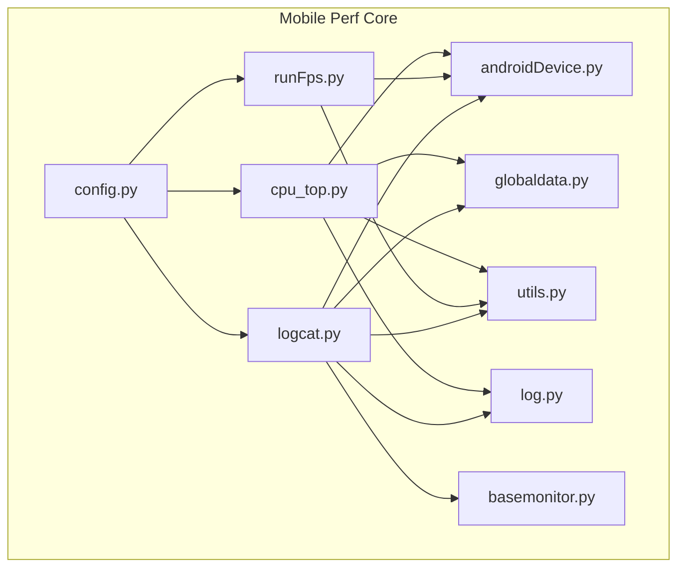
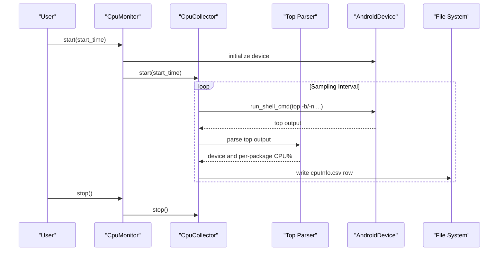
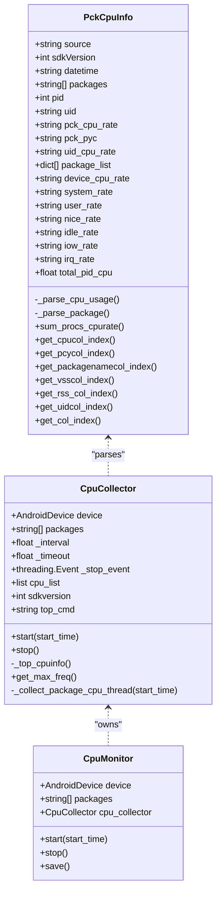
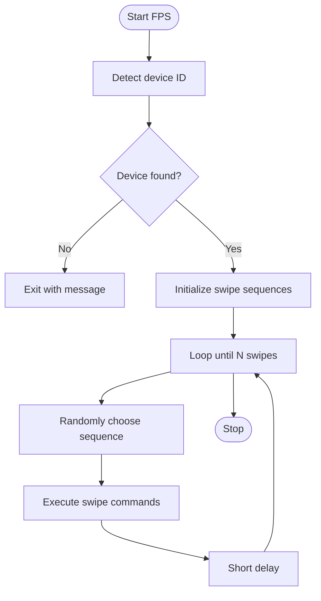
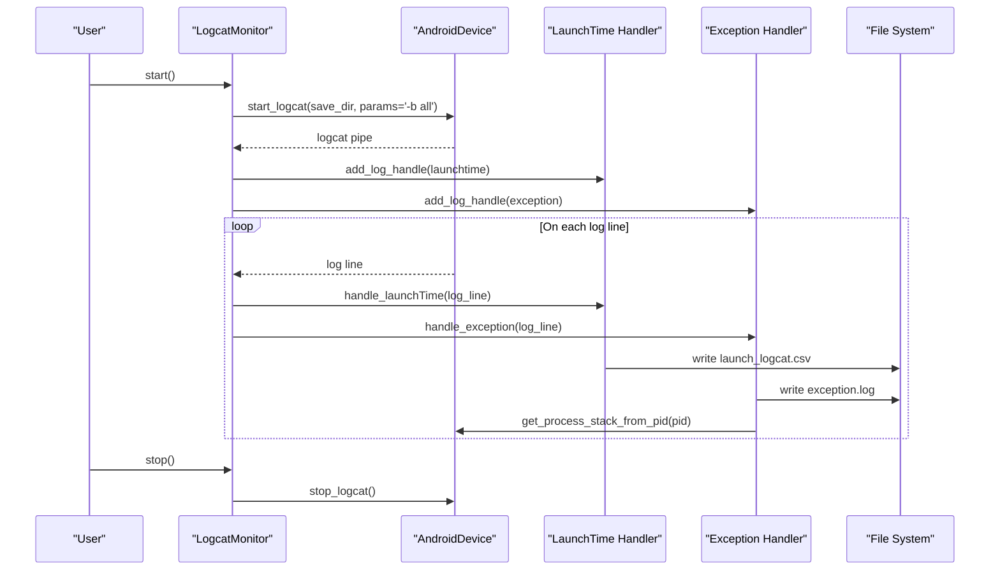
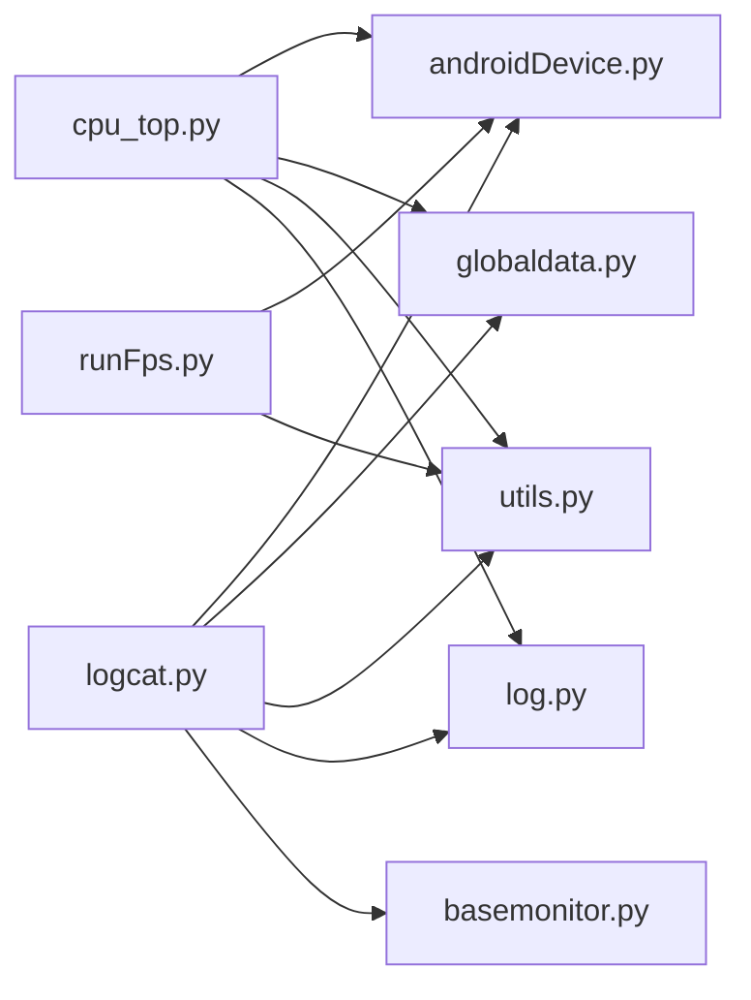

# Performance Metrics Collection

<cite>
**Referenced Files in This Document**
- [README.md](file://README.md)
- [cpu_top.py](file://mobilePerf/perfCode/cpu_top.py)
- [runFps.py](file://mobilePerf/perfCode/runFps.py)
- [logcat.py](file://mobilePerf/perfCode/logcat.py)
- [globaldata.py](file://mobilePerf/perfCode/globaldata.py)
- [config.py](file://mobilePerf/perfCode/common/config.py)
- [basemonitor.py](file://mobilePerf/perfCode/common/basemonitor.py)
- [androidDevice.py](file://mobilePerf/perfCode/androidDevice.py)
- [utils.py](file://mobilePerf/perfCode/common/utils.py)
- [log.py](file://mobilePerf/perfCode/common/log.py)
</cite>

## Table of Contents
1. [Introduction](#introduction)
2. [Project Structure](#project-structure)
3. [Core Components](#core-components)
4. [Architecture Overview](#architecture-overview)
5. [Detailed Component Analysis](#detailed-component-analysis)
6. [Dependency Analysis](#dependency-analysis)
7. [Performance Considerations](#performance-considerations)
8. [Troubleshooting Guide](#troubleshooting-guide)
9. [Conclusion](#conclusion)
10. [Appendices](#appendices)

## Introduction
This document describes the Performance Metrics Collection subsystem responsible for collecting CPU usage, measuring FPS (frames per second), and processing Android logcat events. It explains how CPU monitoring is implemented via a top-based collector, how FPS analysis is performed through simulated user interactions, and how logcat is used for crash detection, ANR monitoring, and system event tracking. It also documents configuration options, data aggregation strategies, and integration with the global data management system. Finally, it provides practical examples for interpreting metrics and performing performance analysis workflows.

## Project Structure
The Performance Metrics Collection resides under mobilePerf/perfCode and consists of:
- CPU monitoring: cpu_top.py
- FPS analysis: runFps.py
- Logcat processing: logcat.py
- Global runtime data: globaldata.py
- Common utilities and configuration: config.py, basemonitor.py, androidDevice.py, utils.py, log.py

**Diagram sources**
- [cpu_top.py:1-433](file://mobilePerf/perfCode/cpu_top.py#L1-L433)
- [runFps.py:1-94](file://mobilePerf/perfCode/runFps.py#L1-L94)
- [logcat.py:1-216](file://mobilePerf/perfCode/logcat.py#L1-L216)
- [globaldata.py:1-14](file://mobilePerf/perfCode/globaldata.py#L1-L14)
- [config.py:1-20](file://mobilePerf/perfCode/common/config.py#L1-L20)
- [basemonitor.py:1-37](file://mobilePerf/perfCode/common/basemonitor.py#L1-L37)
- [androidDevice.py:1-1177](file://mobilePerf/perfCode/androidDevice.py#L1-L1177)
- [utils.py:1-156](file://mobilePerf/perfCode/common/utils.py#L1-L156)
- [log.py:1-30](file://mobilePerf/perfCode/common/log.py#L1-L30)

**Section sources**
- [README.md:24-31](file://README.md#L24-L31)
- [cpu_top.py:1-433](file://mobilePerf/perfCode/cpu_top.py#L1-L433)
- [runFps.py:1-94](file://mobilePerf/perfCode/runFps.py#L1-L94)
- [logcat.py:1-216](file://mobilePerf/perfCode/logcat.py#L1-L216)
- [globaldata.py:1-14](file://mobilePerf/perfCode/globaldata.py#L1-L14)
- [config.py:1-20](file://mobilePerf/perfCode/common/config.py#L1-L20)
- [basemonitor.py:1-37](file://mobilePerf/perfCode/common/basemonitor.py#L1-L37)
- [androidDevice.py:1-1177](file://mobilePerf/perfCode/androidDevice.py#L1-L1177)
- [utils.py:1-156](file://mobilePerf/perfCode/common/utils.py#L1-L156)
- [log.py:1-30](file://mobilePerf/perfCode/common/log.py#L1-L30)

## Core Components
- CPU Monitoring (cpu_top.py)
  - Parses CPU usage from adb shell top output, supports Android SDK version differences, aggregates per-process and device-wide metrics, and writes CSV records periodically.
- FPS Analysis (runFps.py)
  - Generates simulated touch gestures to stress render paths, executes swipes against the device, and measures frame rendering performance indirectly through device-side activity.
- Logcat Processing (logcat.py)
  - Starts logcat with “all” buffers, registers handlers for launch time and exception logs, and persists structured CSV entries for startup latency and crash/ANR events.

**Section sources**
- [cpu_top.py:15-121](file://mobilePerf/perfCode/cpu_top.py#L15-L121)
- [runFps.py:54-91](file://mobilePerf/perfCode/runFps.py#L54-L91)
- [logcat.py:17-116](file://mobilePerf/perfCode/logcat.py#L17-L116)

## Architecture Overview
The subsystem orchestrates three primary data streams:
- CPU stream: periodic sampling via top, parsing, and CSV aggregation.
- FPS stream: gesture-driven workload generation to exercise rendering.
- Logcat stream: real-time log parsing with structured output for crashes and launch metrics.

**Diagram sources**
- [cpu_top.py:206-348](file://mobilePerf/perfCode/cpu_top.py#L206-L348)
- [androidDevice.py:294-308](file://mobilePerf/perfCode/androidDevice.py#L294-L308)

**Section sources**
- [cpu_top.py:206-348](file://mobilePerf/perfCode/cpu_top.py#L206-L348)
- [androidDevice.py:294-308](file://mobilePerf/perfCode/androidDevice.py#L294-L308)

## Detailed Component Analysis

### CPU Performance Monitoring (cpu_top.py)
- Data source and parsing
  - Uses adb shell top to capture CPU usage snapshots. Supports two output formats depending on Android SDK version and extracts device-wide and per-process CPU percentages.
  - Parses UID and package name columns dynamically to accommodate device variations.
- Sampling and aggregation
  - Configurable interval and timeout; collects per-cycle rows with timestamps and cumulative totals when multiple packages are monitored.
  - Writes CSV with headers for datetime, device CPU%, user%, system%, idle%, and per-package metrics.
- Output and persistence
  - Stores raw top snapshots and CPU CSV in a per-package results directory managed by RuntimeData.
  - Maintains scaling_max_freq and uptime logs for additional context.

**Diagram sources**
- [cpu_top.py:15-204](file://mobilePerf/perfCode/cpu_top.py#L15-L204)
- [cpu_top.py:206-348](file://mobilePerf/perfCode/cpu_top.py#L206-L348)
- [cpu_top.py:350-383](file://mobilePerf/perfCode/cpu_top.py#L350-L383)

- Implementation highlights
  - Top command selection: tries batch mode first, falls back to non-batch mode if unsupported.
  - Column discovery: robust column indexing for CPU%, UID/USER, and package name across devices.
  - Timing control: adjusts sleep to maintain target interval by subtracting time spent in top execution.

- Metric calculation
  - Device CPU% is derived from user% and system%.
  - Per-package CPU% is extracted from the parsed top line matching the target package.
  - Total CPU% across multiple packages is accumulated for global visibility.

- Performance threshold management
  - Thresholds are not enforced within the CPU collector; downstream analysis scripts or external dashboards can apply thresholds to cpuInfo.csv.

- Data collection intervals and timeouts
  - Interval and timeout are configurable in CpuCollector constructor; defaults are 1 second for interval and 24 hours for timeout.

- Integration with global data management
  - Uses RuntimeData.package_save_path to determine CSV and snapshot storage locations.

**Section sources**
- [cpu_top.py:15-121](file://mobilePerf/perfCode/cpu_top.py#L15-L121)
- [cpu_top.py:206-348](file://mobilePerf/perfCode/cpu_top.py#L206-L348)
- [globaldata.py:6-14](file://mobilePerf/perfCode/globaldata.py#L6-L14)

### FPS Analysis (runFps.py)
- Purpose
  - Generates randomized swipe gestures to drive UI rendering and indirectly measure frame rendering performance during user interaction.
- Device and package discovery
  - Detects connected device ID and attempts to extract the current foreground package name.
- Gesture generation and execution
  - Executes predefined swipe sequences with random selection and controlled timing to simulate user interactions.
- Indirect FPS measurement
  - FPS is not directly measured here; the script focuses on generating load. FPS metrics are typically collected by other tools and stored alongside CPU/FPS CSV files.

**Diagram sources**
- [runFps.py:54-91](file://mobilePerf/perfCode/runFps.py#L54-L91)

- Practical usage
  - Run the script to generate swipes; combine with CPU/FPS collection to correlate rendering performance with CPU utilization.

**Section sources**
- [runFps.py:1-94](file://mobilePerf/perfCode/runFps.py#L1-L94)

### Logcat Processing (logcat.py)
- Real-time log capture
  - Starts logcat with “all” buffers to capture system, crash, and main buffers.
  - Registers callbacks for launch time and exception logs.
- Launch time tracking
  - Parses “fully drawn” and “normal launch” tags from log lines, converts millisecond values to seconds, and writes CSV entries with timestamps and activity names.
- Crash and ANR monitoring
  - Writes exception logs to a dedicated file and captures process stacks when a PID is known.
- Integration with global data management
  - Persists CSV and logs under RuntimeData.package_save_path.

**Diagram sources**
- [logcat.py:17-116](file://mobilePerf/perfCode/logcat.py#L17-L116)
- [androidDevice.py:389-422](file://mobilePerf/perfCode/androidDevice.py#L389-L422)

**Section sources**
- [logcat.py:17-212](file://mobilePerf/perfCode/logcat.py#L17-L212)
- [androidDevice.py:389-422](file://mobilePerf/perfCode/androidDevice.py#L389-L422)

## Dependency Analysis
- Internal dependencies
  - cpu_top.py depends on androidDevice for shell commands, globaldata for output paths, utils for timestamps and file helpers, and log for diagnostics.
  - logcat.py depends on androidDevice for logcat lifecycle, basemonitor for the base Monitor interface, globaldata for output paths, utils for timestamp conversions, and log for diagnostics.
  - runFps.py depends on androidDevice for device detection and shell commands, and utils for time utilities.
- External dependencies
  - adb shell commands for top, logcat, dumpsys, am, screencap, and debuggerd.
  - Python libraries: csv, re, os, threading, time, logging, and matplotlib for plotting.

**Diagram sources**
- [cpu_top.py:1-12](file://mobilePerf/perfCode/cpu_top.py#L1-L12)
- [logcat.py:1-14](file://mobilePerf/perfCode/logcat.py#L1-L14)
- [runFps.py:1-5](file://mobilePerf/perfCode/runFps.py#L1-L5)

**Section sources**
- [cpu_top.py:1-12](file://mobilePerf/perfCode/cpu_top.py#L1-L12)
- [logcat.py:1-14](file://mobilePerf/perfCode/logcat.py#L1-L14)
- [runFps.py:1-5](file://mobilePerf/perfCode/runFps.py#L1-L5)

## Performance Considerations
- CPU monitoring
  - Sampling interval directly impacts overhead; shorter intervals increase adb load and CSV write frequency. Consider balancing resolution with device responsiveness.
  - Top command fallback ensures compatibility across Android versions; however, some devices may still vary column layouts.
- FPS analysis
  - Gesture timing and sequence selection influence rendering pressure; adjust delays and counts to match target scenarios.
- Logcat processing
  - Real-time parsing adds minimal overhead; ensure log file rotation and size limits prevent disk pressure.
- Data aggregation
  - CSV writes occur per cycle; batching writes is not implemented. For long runs, consider consolidating post-run to reduce I/O.

[No sources needed since this section provides general guidance]

## Troubleshooting Guide
- No device detected
  - Verify adb connectivity and device selection. The code checks for device presence and logs errors when unavailable.
- adb server issues
  - The ADB wrapper recovers from common daemon issues and port conflicts by killing/restarting the server.
- Logcat not starting
  - Ensure permissions and buffer selection (“-b all”). The monitor clears buffers before starting and handles exceptions gracefully.
- CPU CSV not written
  - Confirm RuntimeData.package_save_path is initialized and writable. Check for permission errors or missing directories.
- FPS script exits early
  - If device ID cannot be determined, the script prints a message and exits. Ensure USB debugging is enabled and device is connected.

**Section sources**
- [androidDevice.py:81-139](file://mobilePerf/perfCode/androidDevice.py#L81-L139)
- [logcat.py:32-70](file://mobilePerf/perfCode/logcat.py#L32-L70)
- [cpu_top.py:365-372](file://mobilePerf/perfCode/cpu_top.py#L365-L372)
- [runFps.py:54-58](file://mobilePerf/perfCode/runFps.py#L54-L58)

## Conclusion
The Performance Metrics Collection subsystem provides a robust foundation for CPU monitoring, FPS-related workload generation, and logcat-based crash/ANR tracking. Its modular design integrates cleanly with Android’s adb ecosystem and centralizes outputs via a shared runtime path. While CPU and FPS metrics are persisted for later analysis, the FPS script focuses on generating rendering load suitable for correlation with CPU and memory metrics. Proper configuration of intervals, buffers, and output paths enables reliable performance analysis workflows.

[No sources needed since this section summarizes without analyzing specific files]

## Appendices

### Configuration Options
- CPU monitoring
  - Interval and timeout: adjustable in CpuCollector constructor; default interval is 1 second and default timeout is 24 hours.
  - Output path: RuntimeData.package_save_path determines CSV and snapshot directories.
- FPS analysis
  - Device detection and package name extraction rely on dumpsys and adb; ensure the device is connected and the target activity is focused.
- Logcat processing
  - Buffer selection: “-b all” captures system, crash, and main buffers.
  - Exception tags: configure exception_log_list to filter relevant crash lines.

**Section sources**
- [cpu_top.py:211-227](file://mobilePerf/perfCode/cpu_top.py#L211-L227)
- [cpu_top.py:365-372](file://mobilePerf/perfCode/cpu_top.py#L365-L372)
- [logcat.py:44-46](file://mobilePerf/perfCode/logcat.py#L44-L46)
- [logcat.py:74-76](file://mobilePerf/perfCode/logcat.py#L74-L76)

### Data Aggregation Strategies
- CPU CSV
  - Headers include timestamp, device CPU%, user%, system%, idle%, and per-package columns. For multiple packages, a total_pid_cpu column is appended.
- FPS
  - FPS metrics are not directly computed here; coordinate with other tools to produce FPS CSVs and correlate with CPU data.
- Logcat
  - Launch time CSV includes datetime, activity, this_time, total_time, and launch type. Exception logs are saved separately with process stacks when available.

**Section sources**
- [cpu_top.py:296-301](file://mobilePerf/perfCode/cpu_top.py#L296-L301)
- [logcat.py:120-212](file://mobilePerf/perfCode/logcat.py#L120-L212)

### Integration with Global Data Management
- RuntimeData holds shared state such as package_save_path, old_pid, and threading events. Subsystems write outputs under this path to ensure consistent organization.

**Section sources**
- [globaldata.py:6-14](file://mobilePerf/perfCode/globaldata.py#L6-L14)

### Example Workflows
- CPU-only analysis
  - Initialize CpuMonitor with device ID and package list, start collection for a desired duration, then review cpuInfo.csv for device and per-package CPU% trends.
- FPS + CPU correlation
  - Run runFps.py to generate rendering load, collect CPU metrics concurrently, and compare CPU spikes with rendering workload.
- Crash and ANR investigation
  - Start LogcatMonitor, reproduce the issue, then inspect exception.log and process stacks captured during the incident.

[No sources needed since this section provides general guidance]