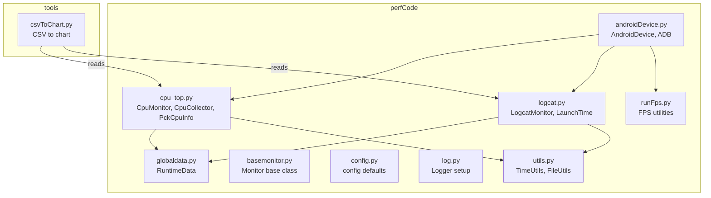
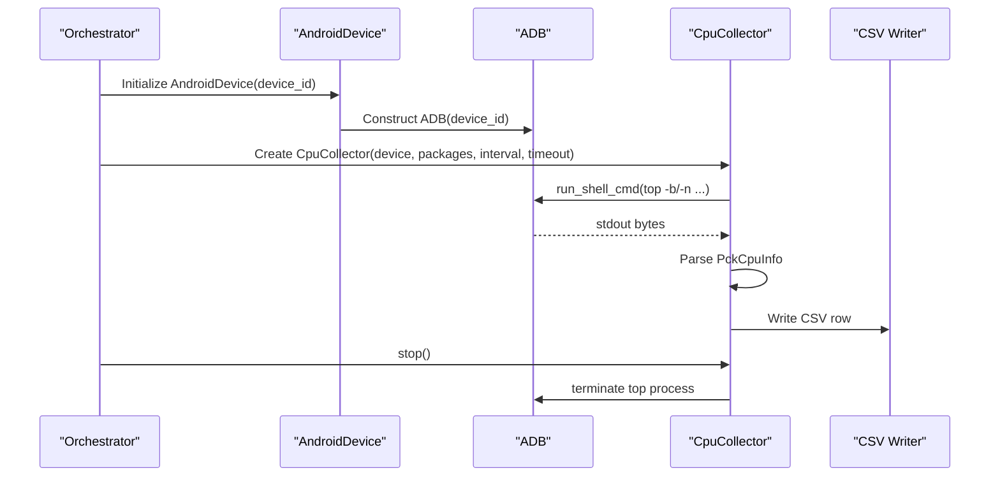
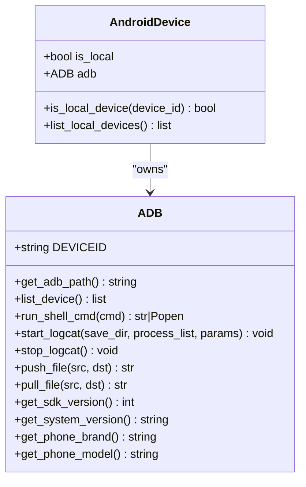
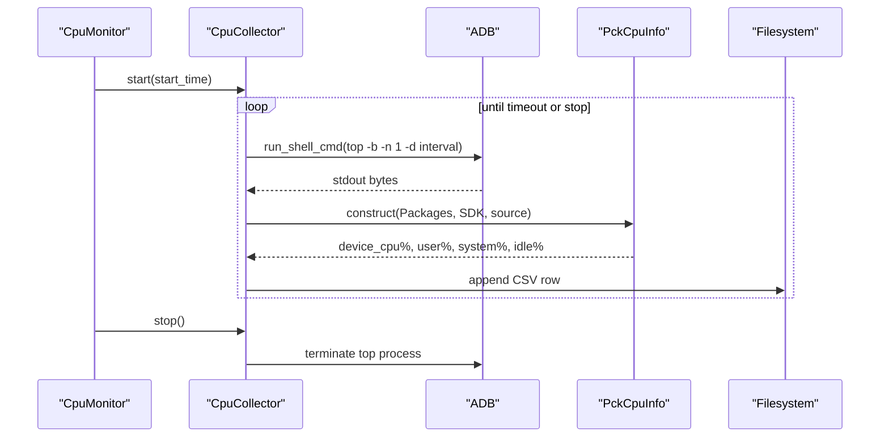
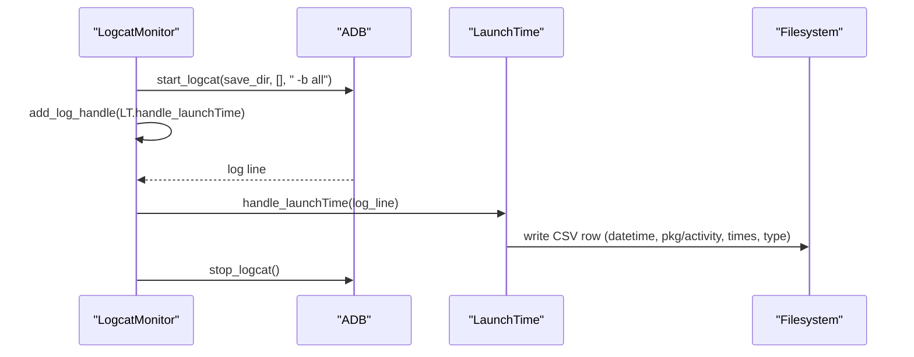
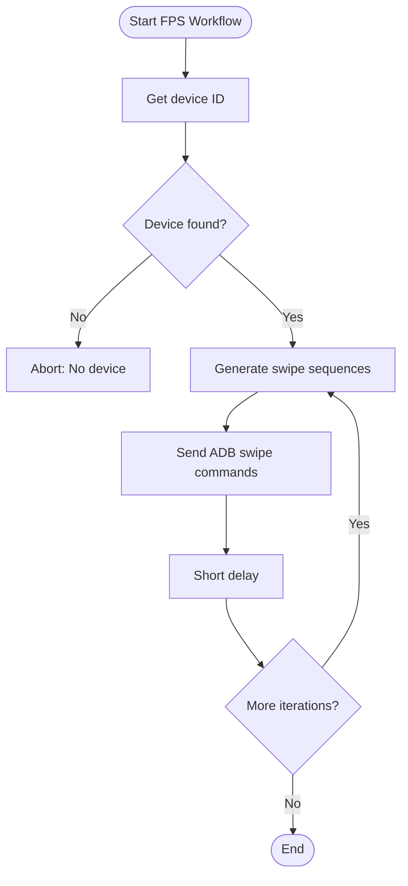
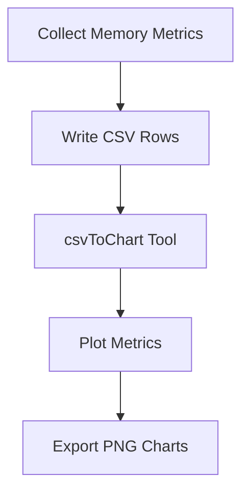
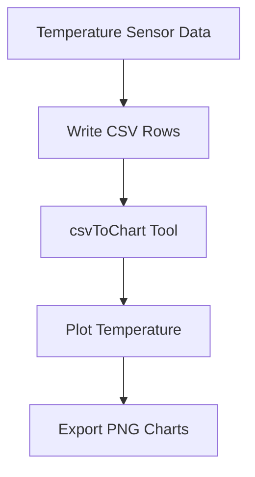
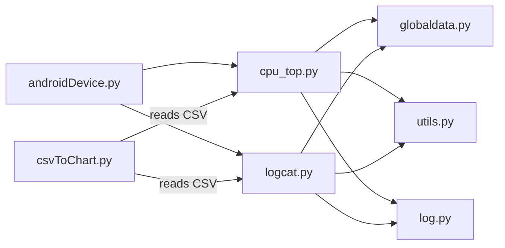

# Performance Monitoring Module

<cite>
**Referenced Files in This Document**
- [androidDevice.py](file://mobilePerf/perfCode/androidDevice.py)
- [cpu_top.py](file://mobilePerf/perfCode/cpu_top.py)
- [logcat.py](file://mobilePerf/perfCode/logcat.py)
- [runFps.py](file://mobilePerf/perfCode/runFps.py)
- [globaldata.py](file://mobilePerf/perfCode/globaldata.py)
- [basemonitor.py](file://mobilePerf/perfCode/common/basemonitor.py)
- [config.py](file://mobilePerf/perfCode/common/config.py)
- [log.py](file://mobilePerf/perfCode/common/log.py)
- [utils.py](file://mobilePerf/perfCode/common/utils.py)
- [csvToChart.py](file://mobilePerf/tools/csvToChart.py)
</cite>

## Table of Contents
1. [Introduction](#introduction)
2. [Project Structure](#project-structure)
3. [Core Components](#core-components)
4. [Architecture Overview](#architecture-overview)
5. [Detailed Component Analysis](#detailed-component-analysis)
6. [Dependency Analysis](#dependency-analysis)
7. [Performance Considerations](#performance-considerations)
8. [Troubleshooting Guide](#troubleshooting-guide)
9. [Conclusion](#conclusion)
10. [Appendices](#appendices)

## Introduction
This document describes the Performance Monitoring Module, the core component of the QA Performance Code project. It focuses on real-time performance data collection from Android devices, including CPU usage, memory consumption, FPS rendering performance, and temperature monitoring. It documents the AndroidDevice class architecture, ADB integration patterns, device connection management, and the end-to-end performance data collection pipeline from metric extraction through data aggregation to CSV export and chart generation. It also covers configuration options, logging mechanisms, and the relationships among monitoring components. Practical examples and integration guidance with the broader QA automation framework are included.

## Project Structure
The Performance Monitoring Module resides under mobilePerf/perfCode and integrates with shared utilities and reporting tools under mobilePerf/tools. The structure supports modular monitoring components (CPU, memory, FPS, logs), device abstraction via AndroidDevice and ADB, runtime data sharing, and common utilities for timing and file operations. Reporting and visualization are handled by tools that convert collected CSV data into charts.

**Diagram sources**
- [androidDevice.py:18-1177](file://mobilePerf/perfCode/androidDevice.py#L18-L1177)
- [cpu_top.py:1-433](file://mobilePerf/perfCode/cpu_top.py#L1-L433)
- [logcat.py:1-216](file://mobilePerf/perfCode/logcat.py#L1-L216)
- [runFps.py:1-94](file://mobilePerf/perfCode/runFps.py#L1-L94)
- [globaldata.py:1-14](file://mobilePerf/perfCode/globaldata.py#L1-L14)
- [basemonitor.py:1-37](file://mobilePerf/perfCode/common/basemonitor.py#L1-L37)
- [config.py:1-20](file://mobilePerf/perfCode/common/config.py#L1-L20)
- [log.py:1-30](file://mobilePerf/perfCode/common/log.py#L1-L30)
- [utils.py:1-156](file://mobilePerf/perfCode/common/utils.py#L1-L156)
- [csvToChart.py:1-172](file://mobilePerf/tools/csvToChart.py#L1-L172)

**Section sources**
- [androidDevice.py:18-1177](file://mobilePerf/perfCode/androidDevice.py#L18-L1177)
- [cpu_top.py:1-433](file://mobilePerf/perfCode/cpu_top.py#L1-L433)
- [logcat.py:1-216](file://mobilePerf/perfCode/logcat.py#L1-L216)
- [runFps.py:1-94](file://mobilePerf/perfCode/runFps.py#L1-L94)
- [globaldata.py:1-14](file://mobilePerf/perfCode/globaldata.py#L1-L14)
- [basemonitor.py:1-37](file://mobilePerf/perfCode/common/basemonitor.py#L1-L37)
- [config.py:1-20](file://mobilePerf/perfCode/common/config.py#L1-L20)
- [log.py:1-30](file://mobilePerf/perfCode/common/log.py#L1-L30)
- [utils.py:1-156](file://mobilePerf/perfCode/common/utils.py#L1-L156)
- [csvToChart.py:1-172](file://mobilePerf/tools/csvToChart.py#L1-L172)

## Core Components
- AndroidDevice: Provides device-level orchestration and delegates to ADB for shell commands, logcat capture, and device utilities.
- ADB: Encapsulates ADB command execution, device discovery, logcat streaming, file operations, and device property queries.
- CpuMonitor/CpuCollector/PckCpuInfo: Implements CPU usage extraction via top, parsing per-process and device-wide metrics, and writing CSV output.
- LogcatMonitor/LaunchTime: Captures Android logcat streams, parses launch time events, and writes structured CSV entries.
- RuntimeData: Global runtime state for shared variables across monitors.
- Monitor base class: Defines the start/stop/save contract for monitor implementations.
- Logging and utilities: Centralized logging configuration and time/file utilities.

**Section sources**
- [androidDevice.py:1129-1177](file://mobilePerf/perfCode/androidDevice.py#L1129-L1177)
- [androidDevice.py:18-799](file://mobilePerf/perfCode/androidDevice.py#L18-L799)
- [cpu_top.py:206-433](file://mobilePerf/perfCode/cpu_top.py#L206-L433)
- [logcat.py:17-216](file://mobilePerf/perfCode/logcat.py#L17-L216)
- [globaldata.py:6-14](file://mobilePerf/perfCode/globaldata.py#L6-L14)
- [basemonitor.py:7-36](file://mobilePerf/perfCode/common/basemonitor.py#L7-L36)
- [log.py:11-26](file://mobilePerf/perfCode/common/log.py#L11-L26)
- [utils.py:10-156](file://mobilePerf/perfCode/common/utils.py#L10-L156)

## Architecture Overview
The module follows a layered architecture:
- Device Abstraction Layer: AndroidDevice wraps ADB to manage device connections, shell commands, and file transfers.
- Monitoring Layer: Monitors implement a common interface to collect metrics, persist data, and coordinate with runtime state.
- Data Persistence and Visualization: Monitors write CSV files; external tools convert CSV to charts.

**Diagram sources**
- [androidDevice.py:1129-1177](file://mobilePerf/perfCode/androidDevice.py#L1129-L1177)
- [androidDevice.py:18-799](file://mobilePerf/perfCode/androidDevice.py#L18-L799)
- [cpu_top.py:206-348](file://mobilePerf/perfCode/cpu_top.py#L206-L348)

## Detailed Component Analysis

### AndroidDevice and ADB Integration
AndroidDevice encapsulates device selection and local vs remote device detection. It constructs an ADB instance for local devices and exposes a unified interface for shell commands, logcat streaming, file operations, and device property queries. ADB manages ADB binary resolution, device listing, server lifecycle, and robust command execution with retries and timeouts.

**Diagram sources**
- [androidDevice.py:1129-1177](file://mobilePerf/perfCode/androidDevice.py#L1129-L1177)
- [androidDevice.py:18-799](file://mobilePerf/perfCode/androidDevice.py#L18-L799)

**Section sources**
- [androidDevice.py:1129-1177](file://mobilePerf/perfCode/androidDevice.py#L1129-L1177)
- [androidDevice.py:18-799](file://mobilePerf/perfCode/androidDevice.py#L18-L799)

### CPU Monitoring Pipeline
CpuMonitor orchestrates CPU data collection using CpuCollector, which runs top in batch mode to extract instantaneous CPU usage. PckCpuInfo parses device-wide and per-package CPU metrics, including user/system/idle rates and per-process PID and CPU%. The collector writes rows to a CSV file with timestamps and aggregates totals for multi-package scenarios.

**Diagram sources**
- [cpu_top.py:206-348](file://mobilePerf/perfCode/cpu_top.py#L206-L348)
- [cpu_top.py:15-121](file://mobilePerf/perfCode/cpu_top.py#L15-L121)
- [androidDevice.py:18-799](file://mobilePerf/perfCode/androidDevice.py#L18-L799)

**Section sources**
- [cpu_top.py:206-348](file://mobilePerf/perfCode/cpu_top.py#L206-L348)
- [cpu_top.py:15-121](file://mobilePerf/perfCode/cpu_top.py#L15-L121)

### Logcat Monitoring and Launch Time Parsing
LogcatMonitor starts logcat with buffer selection, registers handlers for launch time and optional exception logs, and writes structured CSV entries. LaunchTime extracts launch-type tags and converts millisecond values to seconds, persisting to CSV.

**Diagram sources**
- [logcat.py:17-216](file://mobilePerf/perfCode/logcat.py#L17-L216)
- [androidDevice.py:389-422](file://mobilePerf/perfCode/androidDevice.py#L389-L422)

**Section sources**
- [logcat.py:17-216](file://mobilePerf/perfCode/logcat.py#L17-L216)

### FPS Rendering Performance Utilities
runFps.py provides utilities to discover the current device and package, and to generate touch gestures for FPS stress testing. While it does not directly measure FPS, it supports performance workflows that can be paired with other FPS measurement approaches.

**Diagram sources**
- [runFps.py:54-94](file://mobilePerf/perfCode/runFps.py#L54-L94)

**Section sources**
- [runFps.py:1-94](file://mobilePerf/perfCode/runFps.py#L1-L94)

### Memory Consumption Monitoring
Memory monitoring is integrated into the broader performance suite. The module’s CSV outputs and charting tools support memory metrics. Memory-related data is typically derived from system dumps and process-level memory stats captured during tests. The reporting pipeline reads CSV files and generates charts for CPU, MEM, FPS, and TEMP categories.

**Diagram sources**
- [csvToChart.py:10-172](file://mobilePerf/tools/csvToChart.py#L10-L172)

**Section sources**
- [csvToChart.py:1-172](file://mobilePerf/tools/csvToChart.py#L1-L172)

### Temperature Monitoring
Temperature monitoring is part of the reporting suite. The module’s CSV outputs and charting tools support temperature metrics. Temperature data is typically derived from device sensors and is exported to CSV for visualization alongside CPU, MEM, and FPS metrics.

**Diagram sources**
- [csvToChart.py:10-172](file://mobilePerf/tools/csvToChart.py#L10-L172)

**Section sources**
- [csvToChart.py:1-172](file://mobilePerf/tools/csvToChart.py#L1-L172)

## Dependency Analysis
The module exhibits clear separation of concerns:
- AndroidDevice depends on ADB for device operations.
- CpuMonitor/CpuCollector depend on AndroidDevice and write CSV via filesystem utilities.
- LogcatMonitor depends on AndroidDevice for logcat streaming and writes CSV via CSV utilities.
- RuntimeData provides shared state across monitors.
- Logging and utilities are centralized for consistency.

**Diagram sources**
- [androidDevice.py:18-1177](file://mobilePerf/perfCode/androidDevice.py#L18-L1177)
- [cpu_top.py:1-433](file://mobilePerf/perfCode/cpu_top.py#L1-L433)
- [logcat.py:1-216](file://mobilePerf/perfCode/logcat.py#L1-L216)
- [globaldata.py:1-14](file://mobilePerf/perfCode/globaldata.py#L1-L14)
- [utils.py:1-156](file://mobilePerf/perfCode/common/utils.py#L1-L156)
- [log.py:1-30](file://mobilePerf/perfCode/common/log.py#L1-L30)
- [csvToChart.py:1-172](file://mobilePerf/tools/csvToChart.py#L1-L172)

**Section sources**
- [androidDevice.py:18-1177](file://mobilePerf/perfCode/androidDevice.py#L18-L1177)
- [cpu_top.py:1-433](file://mobilePerf/perfCode/cpu_top.py#L1-L433)
- [logcat.py:1-216](file://mobilePerf/perfCode/logcat.py#L1-L216)
- [globaldata.py:1-14](file://mobilePerf/perfCode/globaldata.py#L1-L14)
- [utils.py:1-156](file://mobilePerf/perfCode/common/utils.py#L1-L156)
- [log.py:1-30](file://mobilePerf/perfCode/common/log.py#L1-L30)
- [csvToChart.py:1-172](file://mobilePerf/tools/csvToChart.py#L1-L172)

## Performance Considerations
- Command batching: Using top in batch mode reduces overhead compared to repeated polling.
- Interval tuning: The collector’s interval should balance accuracy and resource usage.
- File size limits: Top output and CSV growth are managed by periodic cleanup and rotation.
- Logcat throughput: Streaming logcat with appropriate buffers avoids blocking and excessive memory usage.
- Timeout handling: ADB commands enforce timeouts and retries to mitigate flaky device connections.

[No sources needed since this section provides general guidance]

## Troubleshooting Guide
Common issues and resolutions:
- ADB server problems: The module recovers by killing and restarting the ADB server when encountering ACK errors or port conflicts.
- Device connectivity: Lost or offline devices trigger reconnection checks and graceful degradation.
- Port conflicts: On Windows, the module detects and terminates processes occupying the ADB port before restarting the server.
- CSV write failures: Exceptions are logged and retried; ensure sufficient disk space and permissions.

**Section sources**
- [androidDevice.py:112-176](file://mobilePerf/perfCode/androidDevice.py#L112-L176)
- [androidDevice.py:276-292](file://mobilePerf/perfCode/androidDevice.py#L276-L292)
- [cpu_top.py:302-347](file://mobilePerf/perfCode/cpu_top.py#L302-L347)

## Conclusion
The Performance Monitoring Module provides a robust, modular framework for collecting real-time performance metrics on Android devices. It leverages ADB for device interaction, implements structured monitoring pipelines for CPU and logcat-derived metrics, and integrates with CSV export and chart generation tools. The design supports extensibility for memory and temperature monitoring and aligns with QA automation workflows through shared runtime state and centralized logging.

[No sources needed since this section summarizes without analyzing specific files]

## Appendices

### Configuration Options
- Device and package configuration: Device ID and package name are defined in the configuration module.
- Sampling intervals and timeouts: CPU collector accepts interval and timeout parameters.
- Logging levels: Logging is configured with rotating file handlers and console output.

**Section sources**
- [config.py:3-20](file://mobilePerf/perfCode/common/config.py#L3-L20)
- [cpu_top.py:211-223](file://mobilePerf/perfCode/cpu_top.py#L211-L223)
- [log.py:11-26](file://mobilePerf/perfCode/common/log.py#L11-L26)

### Practical Workflows
- CPU monitoring: Instantiate CpuMonitor with device ID and package list, start collection, and stop after desired duration. CSV is written to the package-specific results directory.
- Logcat monitoring: Start LogcatMonitor to capture launch time events and optionally exception logs; CSV is persisted for downstream analysis.
- FPS workflow: Use runFps utilities to generate touch gestures for FPS stress testing; combine with other FPS measurement techniques as needed.
- Chart generation: Use the CSV-to-chart tool to generate plots from collected CSV data.

**Section sources**
- [cpu_top.py:350-383](file://mobilePerf/perfCode/cpu_top.py#L350-L383)
- [logcat.py:32-69](file://mobilePerf/perfCode/logcat.py#L32-L69)
- [runFps.py:54-94](file://mobilePerf/perfCode/runFps.py#L54-L94)
- [csvToChart.py:10-72](file://mobilePerf/tools/csvToChart.py#L10-L72)

### Data Interpretation Guidelines
- CPU: Focus on device-wide user/system/idle percentages and per-process PID CPU% to identify hotspots.
- Memory: Track PSS memory trends over time; correlate spikes with UI transitions or background tasks.
- FPS: Combine gesture-driven stress with sensor-based FPS metrics; filter anomalies and compute averages.
- Temperature: Monitor sustained temperature increases during intensive workloads; ensure thermal throttling is mitigated.

[No sources needed since this section provides general guidance]