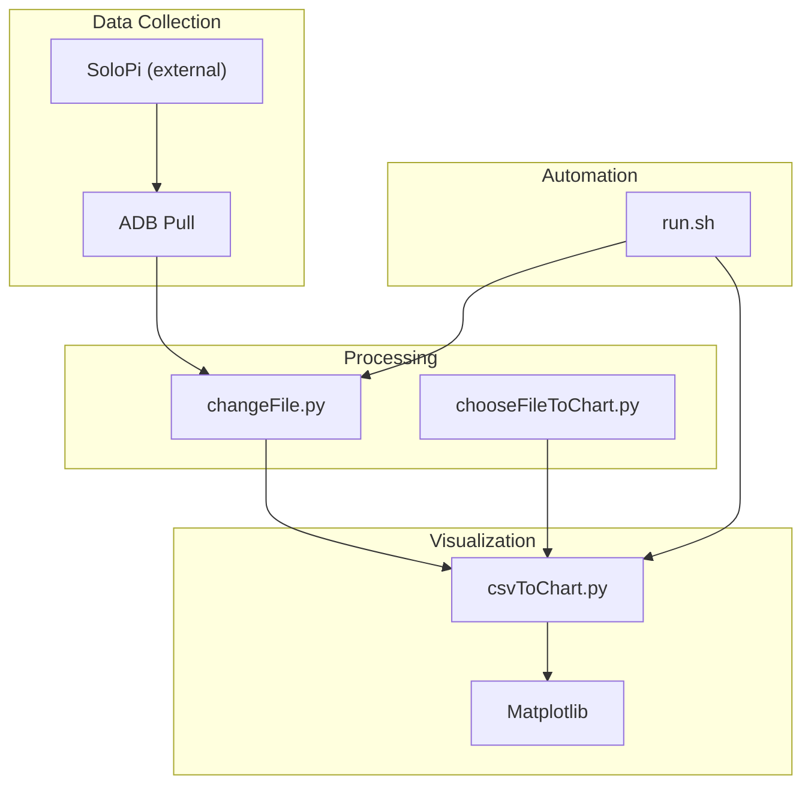
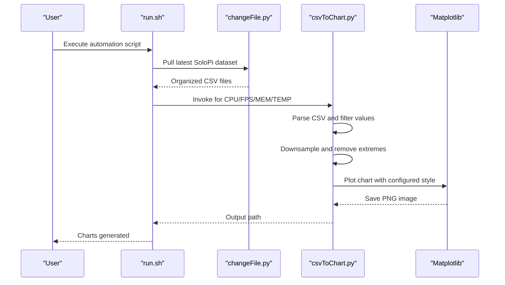
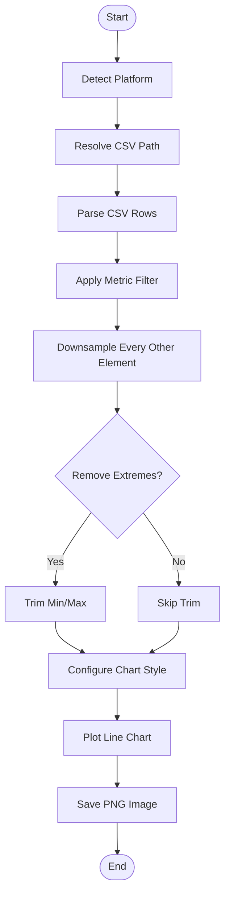
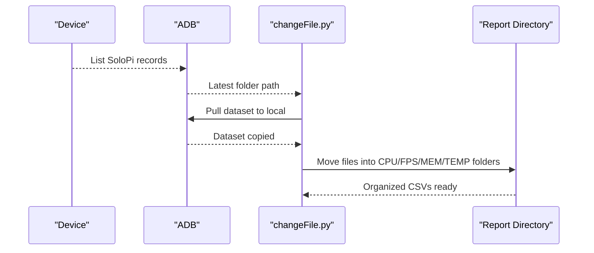
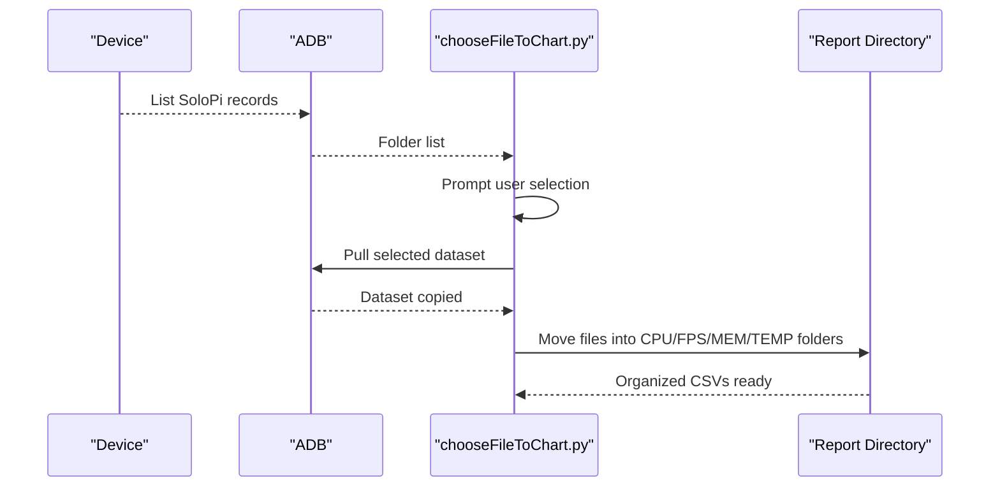
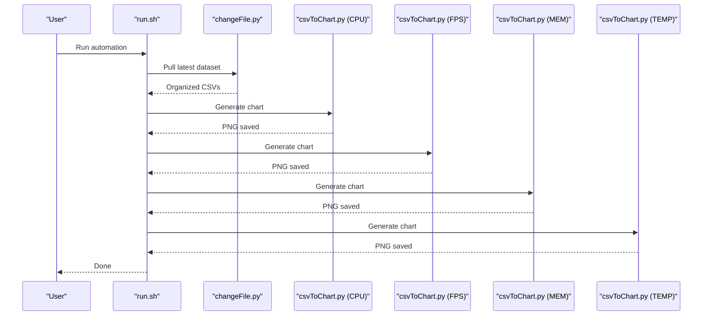
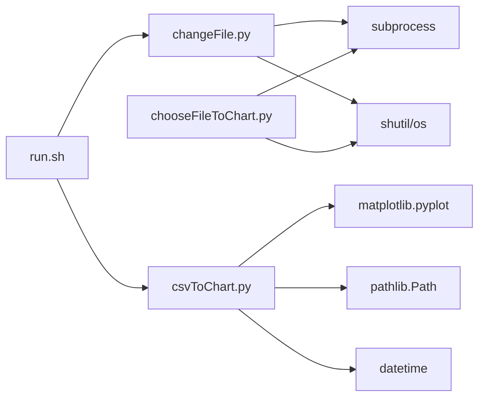

# Data Visualization and Reporting

<cite>
**Referenced Files in This Document**
- [csvToChart.py](file://mobilePerf/tools/csvToChart.py)
- [chooseFileToChart.py](file://mobilePerf/tools/chooseFileToChart.py)
- [changeFile.py](file://mobilePerf/tools/changeFile.py)
- [run.sh](file://mobilePerf/run.sh)
- [testPhoneTime.py](file://mobilePerf/tools/testPhoneTime.py)
- [CPU_2022-11-23.csv](file://mobilePerf/report/CPU/CPU_2022-11-23.csv)
- [FPS_2022-11-23.csv](file://mobilePerf/report/FPS/FPS_2022-11-23.csv)
- [MEM_2022-11-23.csv](file://mobilePerf/report/MEM/MEM_2022-11-23.csv)
- [TEMP_2022-11-23.csv](file://mobilePerf/report/TEMP/TEMP_2022-11-23.csv)
- [PrivateDirty-main-29179_Memory_1669277683476_1669281383398.csv](file://mobilePerf/report/prefData/PrivateDirty-main-29179_Memory_1669277683476_1669281383398.csv)
- [README.md](file://README.md)
</cite>

## Table of Contents
1. [Introduction](#introduction)
2. [Project Structure](#project-structure)
3. [Core Components](#core-components)
4. [Architecture Overview](#architecture-overview)
5. [Detailed Component Analysis](#detailed-component-analysis)
6. [Dependency Analysis](#dependency-analysis)
7. [Performance Considerations](#performance-considerations)
8. [Troubleshooting Guide](#troubleshooting-guide)
9. [Conclusion](#conclusion)
10. [Appendices](#appendices)

## Introduction
This document explains the data visualization and reporting pipeline for mobile performance metrics. It covers how CSV performance data is collected, processed, and transformed into charts, along with file selection utilities, chart generation functions, supported chart types, customization options, and export formats. Practical examples demonstrate generating performance charts, customizing visual representations, and building automated reporting pipelines. It also addresses common visualization challenges, data formatting requirements, and best practices for performance report creation.

## Project Structure
The visualization and reporting system centers around:
- Tools for pulling and organizing performance data from Android devices
- Utilities for selecting and processing CSV files
- Chart generation scripts that produce PNG images
- Automated orchestration via shell scripts

**Diagram sources**
- [changeFile.py:1-112](file://mobilePerf/tools/changeFile.py#L1-L112)
- [chooseFileToChart.py:1-145](file://mobilePerf/tools/chooseFileToChart.py#L1-L145)
- [csvToChart.py:1-151](file://mobilePerf/tools/csvToChart.py#L1-L151)
- [run.sh:1-29](file://mobilePerf/run.sh#L1-L29)

**Section sources**
- [README.md:24-31](file://README.md#L24-L31)
- [run.sh:1-29](file://mobilePerf/run.sh#L1-L29)

## Core Components
- CSV to Chart Converter: Parses CSV performance data and generates line charts with configurable styles and export formats.
- File Selection Utilities: Provide two modes:
  - Automatic: Pulls the latest SoloPi dataset and organizes it into structured CSV files.
  - Interactive: Lists available SoloPi datasets and lets users select one to pull and organize.
- Chart Generation: Creates PNG images with customizable figure size, DPI, grid, axis labels, and title.
- Automation Script: Orchestrates end-to-end data collection and chart generation for CPU, FPS, MEM, and TEMP.

Supported chart types:
- CPU: Line chart of CPU percentage over time
- MEM: Line chart of memory usage over time
- FPS: Line chart of frame rate over time
- TEMP: Line chart of CPU temperature over time

Export formats:
- PNG images saved under the report directory with date-based filenames

**Section sources**
- [csvToChart.py:14-20](file://mobilePerf/tools/csvToChart.py#L14-L20)
- [csvToChart.py:67-86](file://mobilePerf/tools/csvToChart.py#L67-L86)
- [run.sh:11-29](file://mobilePerf/run.sh#L11-L29)

## Architecture Overview
The system follows a pipeline: data acquisition → file organization → CSV parsing → chart generation → export.

**Diagram sources**
- [run.sh:11-29](file://mobilePerf/run.sh#L11-L29)
- [changeFile.py:87-107](file://mobilePerf/tools/changeFile.py#L87-L107)
- [csvToChart.py:117-146](file://mobilePerf/tools/csvToChart.py#L117-L146)

## Detailed Component Analysis

### CSV to Chart Converter
Responsibilities:
- Detect platform and resolve CSV path
- Parse CSV rows into numeric values for the selected metric
- Apply filtering and data cleaning (downsample and remove extremes)
- Render a styled line chart and export as PNG

Key behaviors:
- Metric configuration defines y-axis label, value filters, and extreme removal policy
- Parsing reads the second column and rounds values; skips invalid rows
- Downsample removes every other element to reduce noise and improve readability
- Extreme removal trims the highest and lowest values when enabled and sufficient data exists
- Chart styling sets figure size, DPI, grid, axis labels, and title

**Diagram sources**
- [csvToChart.py:23-64](file://mobilePerf/tools/csvToChart.py#L23-L64)
- [csvToChart.py:67-86](file://mobilePerf/tools/csvToChart.py#L67-L86)

**Section sources**
- [csvToChart.py:14-20](file://mobilePerf/tools/csvToChart.py#L14-L20)
- [csvToChart.py:34-64](file://mobilePerf/tools/csvToChart.py#L34-L64)
- [csvToChart.py:67-86](file://mobilePerf/tools/csvToChart.py#L67-L86)
- [csvToChart.py:88-114](file://mobilePerf/tools/csvToChart.py#L88-L114)
- [csvToChart.py:117-146](file://mobilePerf/tools/csvToChart.py#L117-L146)

### File Selection and Organization Utilities

#### Automatic Pull Tool
- Pulls the latest SoloPi dataset from the device
- Renames and organizes files into structured CSV folders by metric type
- Saves organized CSVs under the report directory

**Diagram sources**
- [changeFile.py:37-48](file://mobilePerf/tools/changeFile.py#L37-L48)
- [changeFile.py:51-67](file://mobilePerf/tools/changeFile.py#L51-L67)
- [changeFile.py:70-84](file://mobilePerf/tools/changeFile.py#L70-L84)

**Section sources**
- [changeFile.py:37-48](file://mobilePerf/tools/changeFile.py#L37-L48)
- [changeFile.py:51-67](file://mobilePerf/tools/changeFile.py#L51-L67)
- [changeFile.py:70-84](file://mobilePerf/tools/changeFile.py#L70-L84)

#### Interactive Pull Tool
- Lists available SoloPi datasets on the device
- Prompts user to select a dataset
- Pulls and organizes the chosen dataset similarly to the automatic tool

**Diagram sources**
- [chooseFileToChart.py:50-60](file://mobilePerf/tools/chooseFileToChart.py#L50-L60)
- [chooseFileToChart.py:117-129](file://mobilePerf/tools/chooseFileToChart.py#L117-L129)
- [chooseFileToChart.py:131-137](file://mobilePerf/tools/chooseFileToChart.py#L131-L137)

**Section sources**
- [chooseFileToChart.py:50-60](file://mobilePerf/tools/chooseFileToChart.py#L50-L60)
- [chooseFileToChart.py:117-129](file://mobilePerf/tools/chooseFileToChart.py#L117-L129)
- [chooseFileToChart.py:131-137](file://mobilePerf/tools/chooseFileToChart.py#L131-L137)

### Chart Generation Functions
- Data ingestion: Reads CSV files and extracts numeric values for the selected metric
- Data cleaning: Applies metric-specific filters and removes outliers
- Rendering: Uses Matplotlib to plot a line chart with configured style
- Export: Saves the chart as a PNG image with a standardized filename and path

Customization options:
- Figure size and DPI
- Grid visibility
- Axis labels and colors
- Title and color scheme

**Section sources**
- [csvToChart.py:67-86](file://mobilePerf/tools/csvToChart.py#L67-L86)
- [csvToChart.py:138-140](file://mobilePerf/tools/csvToChart.py#L138-L140)

### Automated Reporting Pipeline
- The shell script orchestrates the entire workflow:
  - Pulls the latest dataset
  - Generates charts for CPU, FPS, MEM, and TEMP
  - Outputs progress and completion messages

**Diagram sources**
- [run.sh:11-29](file://mobilePerf/run.sh#L11-L29)
- [changeFile.py:87-107](file://mobilePerf/tools/changeFile.py#L87-L107)
- [csvToChart.py:117-146](file://mobilePerf/tools/csvToChart.py#L117-L146)

**Section sources**
- [run.sh:11-29](file://mobilePerf/run.sh#L11-L29)

## Dependency Analysis
- csvToChart.py depends on:
  - Matplotlib for rendering charts
  - Standard library modules for file handling, platform detection, and datetime formatting
- changeFile.py and chooseFileToChart.py depend on:
  - Subprocess for ADB commands
  - Shutil and OS for file operations
- run.sh orchestrates Python tools and expects CSV files to be present in the report directory

**Diagram sources**
- [csvToChart.py:12-12](file://mobilePerf/tools/csvToChart.py#L12-L12)
- [changeFile.py:6-10](file://mobilePerf/tools/changeFile.py#L6-L10)
- [chooseFileToChart.py:6-12](file://mobilePerf/tools/chooseFileToChart.py#L6-L12)
- [run.sh:13-26](file://mobilePerf/run.sh#L13-L26)

**Section sources**
- [csvToChart.py:12-12](file://mobilePerf/tools/csvToChart.py#L12-L12)
- [changeFile.py:6-10](file://mobilePerf/tools/changeFile.py#L6-L10)
- [chooseFileToChart.py:6-12](file://mobilePerf/tools/chooseFileToChart.py#L6-L12)
- [run.sh:13-26](file://mobilePerf/run.sh#L13-L26)

## Performance Considerations
- Downsample step reduces data points by half, improving chart readability and reducing rendering overhead.
- Removing extremes helps mitigate transient spikes that skew averages and visual interpretation.
- Chart DPI and figure size balance quality and file size; adjust according to display and storage constraints.
- Batch processing via run.sh minimizes manual steps and ensures consistent output.

[No sources needed since this section provides general guidance]

## Troubleshooting Guide
Common issues and resolutions:
- No CSV files found:
  - Ensure SoloPi data was pulled and organized correctly.
  - Verify the report directory structure and CSV naming conventions.
- Device connection errors:
  - Confirm ADB is installed and device is connected.
  - Check SoloPi installation and permissions on the device.
- Unsupported platform:
  - The converter detects Windows/macOS and raises an error for unsupported platforms.
- Invalid CSV format:
  - Ensure CSV headers match expected patterns and numeric values are present in the second column.
- Chart not generated:
  - Verify Matplotlib backend is available and writable output path exists.

**Section sources**
- [csvToChart.py:88-114](file://mobilePerf/tools/csvToChart.py#L88-L114)
- [changeFile.py:42-44](file://mobilePerf/tools/changeFile.py#L42-L44)
- [chooseFileToChart.py:43-47](file://mobilePerf/tools/chooseFileToChart.py#L43-L47)

## Conclusion
The visualization and reporting system provides a streamlined pipeline for transforming raw performance data into actionable charts. By combining automatic data collection, robust CSV processing, and configurable chart generation, teams can quickly assess CPU, memory, frame rate, and temperature trends. The automation script simplifies routine tasks, while customization options enable tailored visualizations for different audiences and use cases.

[No sources needed since this section summarizes without analyzing specific files]

## Appendices

### Practical Examples

- Generate performance charts from collected data:
  - Use the automation script to pull the latest dataset and generate charts for CPU, FPS, MEM, and TEMP.
  - Charts are saved under the report directory with date-based filenames.

- Customize visual representations:
  - Adjust figure size, DPI, grid, axis labels, and title in the chart generation function.
  - Modify metric filters and extreme removal policies to suit specific datasets.

- Create automated reporting pipelines:
  - Integrate the automation script into CI/CD workflows to generate daily or nightly reports.
  - Extend the script to include additional metrics or export formats as needed.

**Section sources**
- [run.sh:11-29](file://mobilePerf/run.sh#L11-L29)
- [csvToChart.py:67-86](file://mobilePerf/tools/csvToChart.py#L67-L86)
- [csvToChart.py:14-20](file://mobilePerf/tools/csvToChart.py#L14-L20)

### Data Formatting Requirements
- CSV headers:
  - CPU: Header includes the metric column for CPU percentage
  - MEM: Header includes the metric column for memory usage
  - FPS: Header includes the metric column for frame rate
  - TEMP: Header includes the metric column for temperature
- Numeric values:
  - Values are parsed from the second column and rounded to integers
  - Invalid or missing values are skipped during parsing

**Section sources**
- [CPU_2022-11-23.csv:1-10](file://mobilePerf/report/CPU/CPU_2022-11-23.csv#L1-L10)
- [MEM_2022-11-23.csv:1-10](file://mobilePerf/report/MEM/MEM_2022-11-23.csv#L1-L10)
- [FPS_2022-11-23.csv:1-10](file://mobilePerf/report/FPS/FPS_2022-11-23.csv#L1-L10)
- [TEMP_2022-11-23.csv:1-10](file://mobilePerf/report/TEMP/TEMP_2022-11-23.csv#L1-L10)
- [PrivateDirty-main-29179_Memory_1669277683476_1669281383398.csv:1-10](file://mobilePerf/report/prefData/PrivateDirty-main-29179_Memory_1669277683476_1669281383398.csv#L1-L10)

### Best Practices for Performance Report Creation
- Validate data integrity before chart generation to ensure meaningful insights.
- Use downsample and extreme removal judiciously to preserve signal while smoothing noise.
- Standardize chart styles across metrics for consistent comparisons.
- Automate the pipeline to ensure regular, repeatable reporting cadence.

[No sources needed since this section provides general guidance]