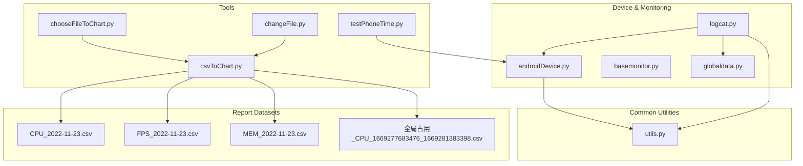
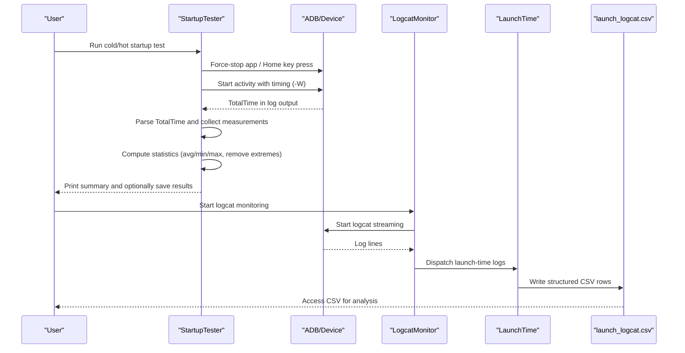
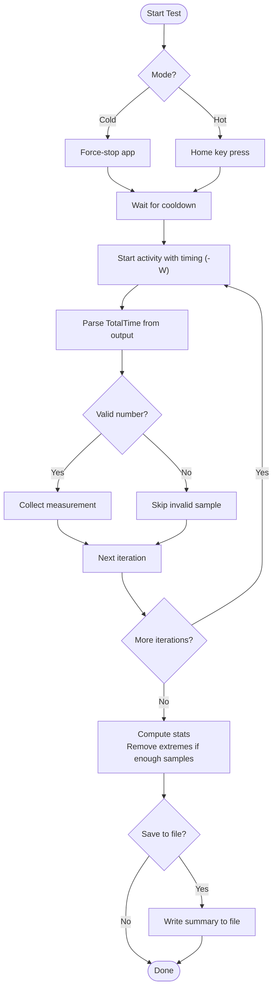
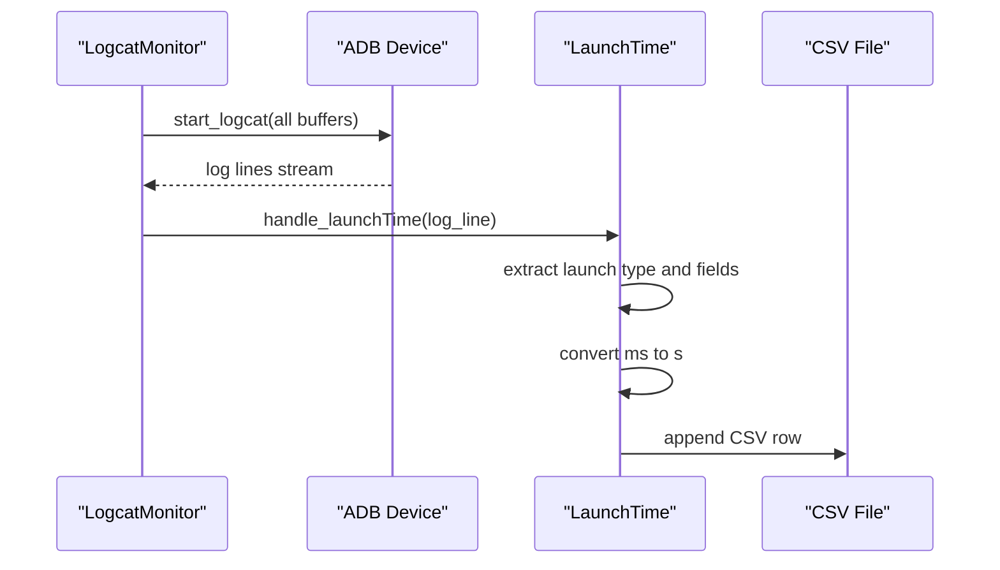
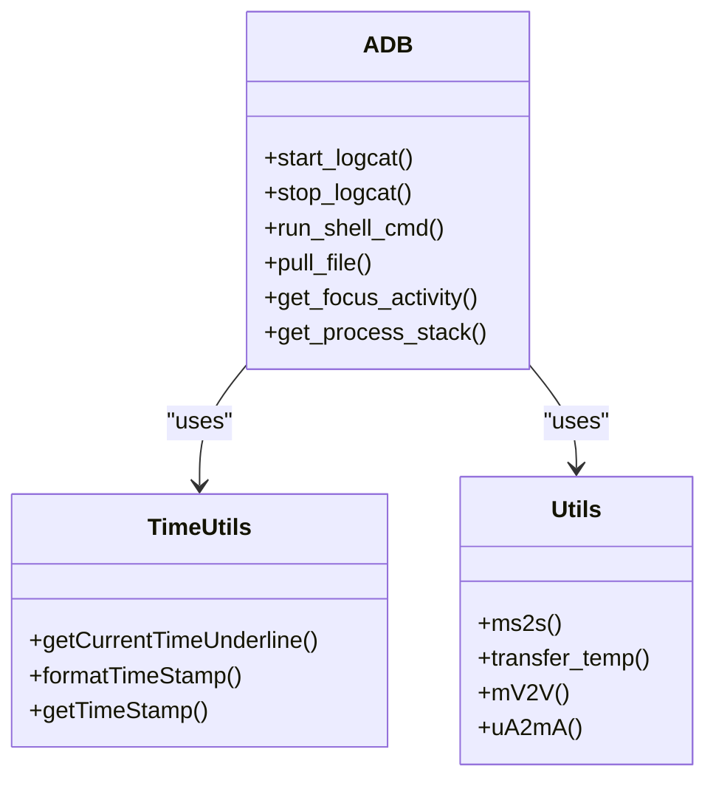
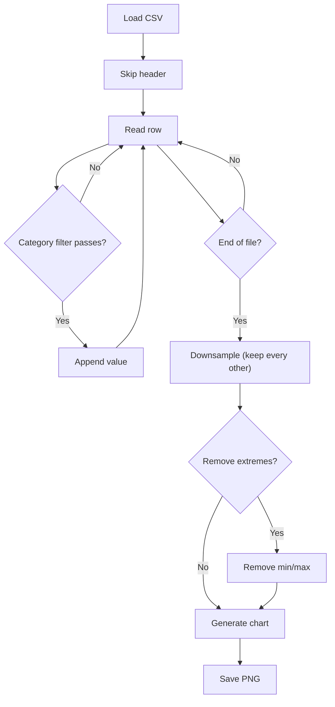
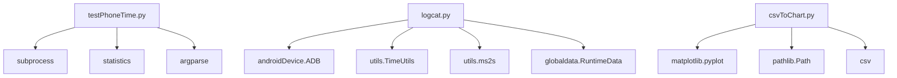

# Performance Data Analysis

<cite>
**Referenced Files in This Document**
- [testPhoneTime.py](file://mobilePerf/tools/testPhoneTime.py)
- [logcat.py](file://mobilePerf/perfCode/logcat.py)
- [utils.py](file://mobilePerf/perfCode/common/utils.py)
- [csvToChart.py](file://mobilePerf/tools/csvToChart.py)
- [changeFile.py](file://mobilePerf/tools/changeFile.py)
- [chooseFileToChart.py](file://mobilePerf/tools/chooseFileToChart.py)
- [androidDevice.py](file://mobilePerf/perfCode/androidDevice.py)
- [basemonitor.py](file://mobilePerf/perfCode/common/basemonitor.py)
- [globaldata.py](file://mobilePerf/perfCode/globaldata.py)
- [CPU_2022-11-23.csv](file://mobilePerf/report/CPU/CPU_2022-11-23.csv)
- [FPS_2022-11-23.csv](file://mobilePerf/report/FPS/FPS_2022-11-23.csv)
- [MEM_2022-11-23.csv](file://mobilePerf/report/MEM/MEM_2022-11-23.csv)
- [全局占用_CPU_1669277683476_1669281383398.csv](file://mobilePerf/report/prefData/全局占用_CPU_1669277683476_1669281383398.csv)
</cite>

## Table of Contents
1. [Introduction](#introduction)
2. [Project Structure](#project-structure)
3. [Core Components](#core-components)
4. [Architecture Overview](#architecture-overview)
5. [Detailed Component Analysis](#detailed-component-analysis)
6. [Dependency Analysis](#dependency-analysis)
7. [Performance Considerations](#performance-considerations)
8. [Troubleshooting Guide](#troubleshooting-guide)
9. [Conclusion](#conclusion)
10. [Appendices](#appendices)

## Introduction
This document explains the performance data analysis capabilities of the repository, focusing on:
- System-level logging via logcat integration during performance tests
- Startup time measurement algorithms for cold and hot starts
- Utility functions for data processing and visualization
- Statistical analysis, filtering, and anomaly detection patterns
- Practical examples of processing collected CSV data, computing metrics, and identifying bottlenecks
- Integration with external tools and the end-to-end workflow from raw data to actionable insights
- Data validation, error handling, and optimization techniques for large datasets

## Project Structure
The performance analysis pipeline spans several modules:
- Tools for device automation and data collection
- Device abstraction and logcat monitoring
- Common utilities for time and unit conversions
- Reporting and visualization scripts
- Sample CSV datasets for CPU, FPS, MEM, and preformance metrics

**Diagram sources**
- [testPhoneTime.py:1-170](file://mobilePerf/tools/testPhoneTime.py#L1-L170)
- [logcat.py:1-216](file://mobilePerf/perfCode/logcat.py#L1-L216)
- [utils.py:1-156](file://mobilePerf/perfCode/common/utils.py#L1-L156)
- [csvToChart.py:1-151](file://mobilePerf/tools/csvToChart.py#L1-L151)
- [changeFile.py:1-112](file://mobilePerf/tools/changeFile.py#L1-L112)
- [chooseFileToChart.py:1-145](file://mobilePerf/tools/chooseFileToChart.py#L1-L145)
- [androidDevice.py:1-800](file://mobilePerf/perfCode/androidDevice.py#L1-L800)
- [basemonitor.py:1-37](file://mobilePerf/perfCode/common/basemonitor.py#L1-L37)
- [globaldata.py:1-14](file://mobilePerf/perfCode/globaldata.py#L1-L14)

**Section sources**
- [testPhoneTime.py:1-170](file://mobilePerf/tools/testPhoneTime.py#L1-L170)
- [logcat.py:1-216](file://mobilePerf/perfCode/logcat.py#L1-L216)
- [utils.py:1-156](file://mobilePerf/perfCode/common/utils.py#L1-L156)
- [csvToChart.py:1-151](file://mobilePerf/tools/csvToChart.py#L1-L151)
- [changeFile.py:1-112](file://mobilePerf/tools/changeFile.py#L1-L112)
- [chooseFileToChart.py:1-145](file://mobilePerf/tools/chooseFileToChart.py#L1-L145)
- [androidDevice.py:1-800](file://mobilePerf/perfCode/androidDevice.py#L1-L800)
- [basemonitor.py:1-37](file://mobilePerf/perfCode/common/basemonitor.py#L1-L37)
- [globaldata.py:1-14](file://mobilePerf/perfCode/globaldata.py#L1-L14)

## Core Components
- Startup Tester: Measures cold and hot app startup times using ADB, parses TotalTime from logcat output, computes statistics, and saves results.
- Logcat Monitor: Captures system logs, extracts launch-time entries, converts timestamps and units, and writes structured CSV data.
- Device Abstraction: Provides ADB commands, logcat streaming, device queries, and utilities for pulling data.
- Data Processing Tools: Scripts to fetch SoloPi data, filter and convert CSV data, and generate charts.
- Visualization Tool: Reads CSV files, applies filters and outlier removal, and produces performance charts.
- Common Utilities: Time formatting, unit conversions, and file operations.

**Section sources**
- [testPhoneTime.py:13-170](file://mobilePerf/tools/testPhoneTime.py#L13-L170)
- [logcat.py:17-216](file://mobilePerf/perfCode/logcat.py#L17-L216)
- [androidDevice.py:18-800](file://mobilePerf/perfCode/androidDevice.py#L18-L800)
- [csvToChart.py:1-151](file://mobilePerf/tools/csvToChart.py#L1-L151)
- [changeFile.py:1-112](file://mobilePerf/tools/changeFile.py#L1-L112)
- [utils.py:1-156](file://mobilePerf/perfCode/common/utils.py#L1-L156)

## Architecture Overview
The system integrates device automation, real-time log parsing, and post-collection analytics.

**Diagram sources**
- [testPhoneTime.py:37-106](file://mobilePerf/tools/testPhoneTime.py#L37-L106)
- [logcat.py:32-116](file://mobilePerf/perfCode/logcat.py#L32-L116)

## Detailed Component Analysis

### Startup Time Measurement (testPhoneTime.py)
- Cold vs Hot start modes:
  - Cold start forces app termination before measuring.
  - Hot start simulates home button press and measures subsequent launch.
- Data collection:
  - Executes ADB start activity with timing enabled.
  - Parses TotalTime from command output.
  - Validates numeric values and filters invalid entries.
- Statistics:
  - Computes average, min, max.
  - Applies extreme-value removal when sufficient samples exist.
- Output:
  - Prints summary and optionally writes a text report with raw data and computed metrics.

**Diagram sources**
- [testPhoneTime.py:37-106](file://mobilePerf/tools/testPhoneTime.py#L37-L106)

**Section sources**
- [testPhoneTime.py:13-170](file://mobilePerf/tools/testPhoneTime.py#L13-L170)

### Logcat Integration and Launch-Time Parsing (logcat.py)
- LogcatMonitor:
  - Starts logcat capturing with all buffers.
  - Registers a handler for launch-time logs.
  - Writes structured CSV with timestamp, package/activity, per-log this_time and total_time, and launch type.
- LaunchTime:
  - Extracts launch-type tags from log lines.
  - Parses numeric fields, converts milliseconds to seconds.
  - Aggregates and persists data to CSV for downstream analysis.

**Diagram sources**
- [logcat.py:32-116](file://mobilePerf/perfCode/logcat.py#L32-L116)

**Section sources**
- [logcat.py:17-216](file://mobilePerf/perfCode/logcat.py#L17-L216)

### Device Abstraction and Utilities (androidDevice.py, utils.py)
- androidDevice.ADB:
  - Manages ADB lifecycle, device discovery, and commands.
  - Implements logcat streaming with threading and robust error handling.
  - Provides helpers for pulling files, querying focus activity, and process stack dumps.
- utils:
  - Time formatting and conversions.
  - Unit conversions (ms to s, temperature scaling, voltage/current scaling).
  - File utilities for recursive scanning and zipping.

**Diagram sources**
- [androidDevice.py:18-800](file://mobilePerf/perfCode/androidDevice.py#L18-L800)
- [utils.py:1-156](file://mobilePerf/perfCode/common/utils.py#L1-L156)

**Section sources**
- [androidDevice.py:18-800](file://mobilePerf/perfCode/androidDevice.py#L18-L800)
- [utils.py:1-156](file://mobilePerf/perfCode/common/utils.py#L1-L156)

### CSV Processing and Visualization (csvToChart.py)
- Functionality:
  - Finds latest CSV per performance category (FPS, CPU, MEM, TEMP).
  - Applies category-specific filters and removes outliers.
  - Generates plots and saves PNG images.
- Filtering and Outlier Removal:
  - Category-specific value filters (e.g., FPS > 0 and ≤ 90).
  - Optional removal of min/max extremes for stability.
- Down-sampling:
  - Removes every other element to reduce dataset size for visualization.

**Diagram sources**
- [csvToChart.py:34-86](file://mobilePerf/tools/csvToChart.py#L34-L86)

**Section sources**
- [csvToChart.py:1-151](file://mobilePerf/tools/csvToChart.py#L1-L151)

### SoloPi Data Automation (changeFile.py, chooseFileToChart.py)
- changeFile.py:
  - Pulls latest SoloPi records from device storage.
  - Renames and organizes CSV files into appropriate folders (CPU, MEM, FPS, TEMP).
- chooseFileToChart.py:
  - Lists available SoloPi folders and lets user select one.
  - Performs the same organization workflow as changeFile.py.

**Section sources**
- [changeFile.py:1-112](file://mobilePerf/tools/changeFile.py#L1-L112)
- [chooseFileToChart.py:1-145](file://mobilePerf/tools/chooseFileToChart.py#L1-L145)

## Dependency Analysis
- testPhoneTime.py depends on:
  - subprocess for ADB commands
  - statistics for averaging
  - argparse for CLI parsing
- logcat.py depends on:
  - androidDevice.ADB for logcat streaming
  - utils.TimeUtils and utils.ms2s for timestamp and unit conversions
  - globaldata.RuntimeData for shared state
- csvToChart.py depends on:
  - matplotlib for plotting
  - pathlib for path handling
  - CSV module for parsing

**Diagram sources**
- [testPhoneTime.py:1-170](file://mobilePerf/tools/testPhoneTime.py#L1-L170)
- [logcat.py:1-216](file://mobilePerf/perfCode/logcat.py#L1-L216)
- [csvToChart.py:1-151](file://mobilePerf/tools/csvToChart.py#L1-L151)

**Section sources**
- [testPhoneTime.py:1-170](file://mobilePerf/tools/testPhoneTime.py#L1-L170)
- [logcat.py:1-216](file://mobilePerf/perfCode/logcat.py#L1-L216)
- [csvToChart.py:1-151](file://mobilePerf/tools/csvToChart.py#L1-L151)

## Performance Considerations
- Logcat throughput:
  - Streaming logs continuously can be resource-intensive; ensure buffer selection and periodic file rotation are configured appropriately.
- Data volume:
  - Large CSV files benefit from down-sampling and selective filtering to maintain responsiveness during visualization.
- Statistical robustness:
  - Removing min/max extremes improves averages when outliers are present.
- I/O efficiency:
  - Batch writes to CSV and avoid frequent disk flushes.
- Memory usage:
  - Process data incrementally; avoid loading entire datasets into memory for very long runs.

[No sources needed since this section provides general guidance]

## Troubleshooting Guide
- No device found or ADB errors:
  - Verify device connection and ADB availability.
  - Check for port conflicts and restart ADB server if necessary.
- Empty or missing CSV data:
  - Confirm logcat monitor is started and launch-time logs are being parsed.
  - Validate CSV headers and numeric field extraction.
- Invalid measurements:
  - Ensure ADB start activity with timing completes successfully.
  - Filter out non-numeric or negative values.
- Visualization issues:
  - Confirm CSV encoding and column indices.
  - Adjust category-specific filters to match data ranges.

**Section sources**
- [logcat.py:32-116](file://mobilePerf/perfCode/logcat.py#L32-L116)
- [testPhoneTime.py:37-106](file://mobilePerf/tools/testPhoneTime.py#L37-L106)
- [csvToChart.py:34-86](file://mobilePerf/tools/csvToChart.py#L34-L86)
- [androidDevice.py:111-176](file://mobilePerf/perfCode/androidDevice.py#L111-L176)

## Conclusion
The repository provides a complete pipeline for performance data collection and analysis:
- Real-time system logging via logcat with structured CSV export
- Automated startup time measurement with robust statistics
- Flexible CSV processing and visualization with filtering and outlier handling
- Practical automation for pulling and organizing device-generated CSV data

By combining these components, teams can reliably measure, filter, and visualize performance metrics, identify anomalies, and derive actionable insights for optimization.

[No sources needed since this section summarizes without analyzing specific files]

## Appendices

### Example Workflows

- Measuring startup time:
  - Run cold or hot start tests with the StartupTester.
  - Review printed statistics and optional saved report.
  - Use CSV charts to visualize trends over time.

- Analyzing CPU/FPS/MEM/TEMP:
  - Use csvToChart.py to load the latest CSV per category.
  - Apply category-specific filters and remove extremes.
  - Generate and review PNG charts for quick trend assessment.

- Pulling SoloPi data:
  - Use changeFile.py or chooseFileToChart.py to pull and organize CSV files.
  - Place files under the appropriate report folders for unified analysis.

**Section sources**
- [testPhoneTime.py:130-164](file://mobilePerf/tools/testPhoneTime.py#L130-L164)
- [csvToChart.py:117-147](file://mobilePerf/tools/csvToChart.py#L117-L147)
- [changeFile.py:87-112](file://mobilePerf/tools/changeFile.py#L87-L112)
- [chooseFileToChart.py:100-145](file://mobilePerf/tools/chooseFileToChart.py#L100-L145)

### Sample Datasets
- CPU usage over time
- Frames Per Second (FPS)
- Memory usage (PSS)
- Preformance metrics (e.g., global CPU utilization)

These datasets demonstrate typical structures and can be processed using the provided tools.

**Section sources**
- [CPU_2022-11-23.csv:1-800](file://mobilePerf/report/CPU/CPU_2022-11-23.csv#L1-L800)
- [FPS_2022-11-23.csv:1-800](file://mobilePerf/report/FPS/FPS_2022-11-23.csv#L1-L800)
- [MEM_2022-11-23.csv:1-800](file://mobilePerf/report/MEM/MEM_2022-11-23.csv#L1-L800)
- [全局占用_CPU_1669277683476_1669281383398.csv:1-800](file://mobilePerf/report/prefData/全局占用_CPU_1669277683476_1669281383398.csv#L1-L800)