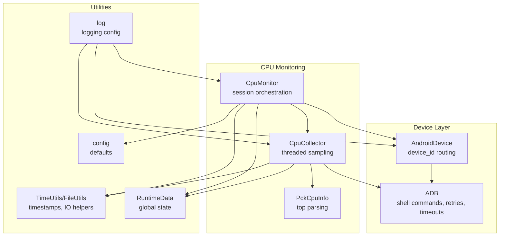
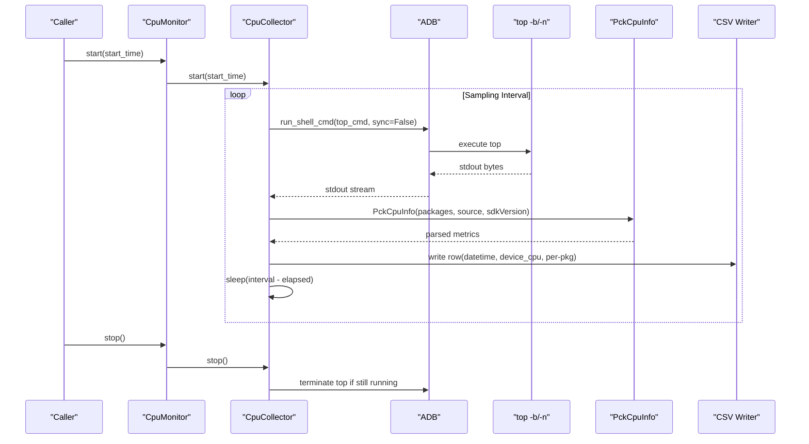
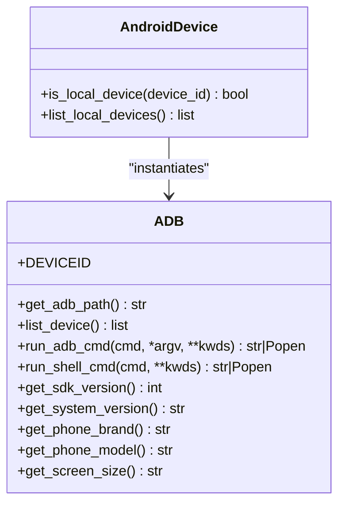
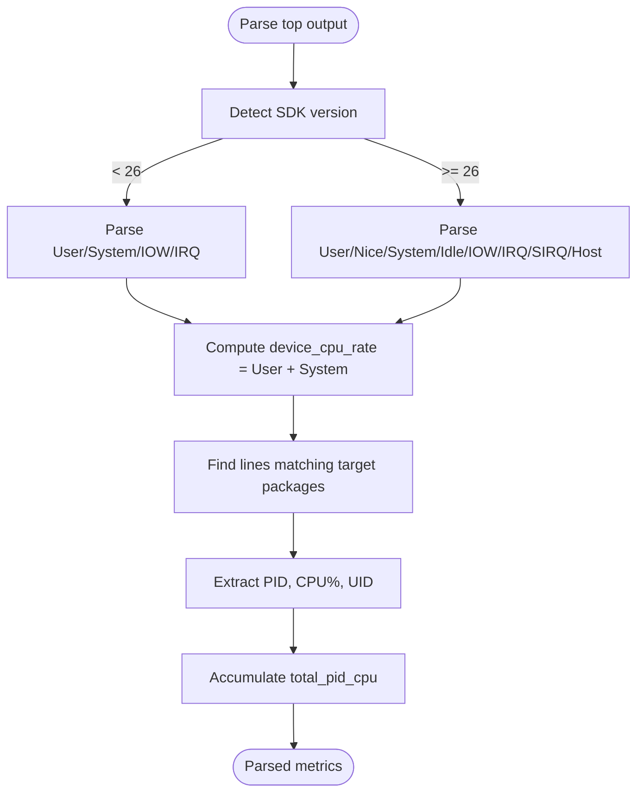
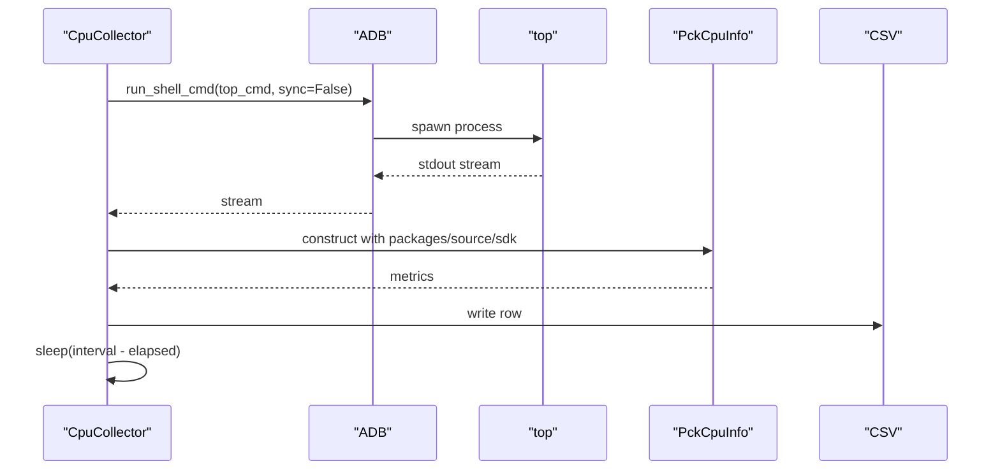
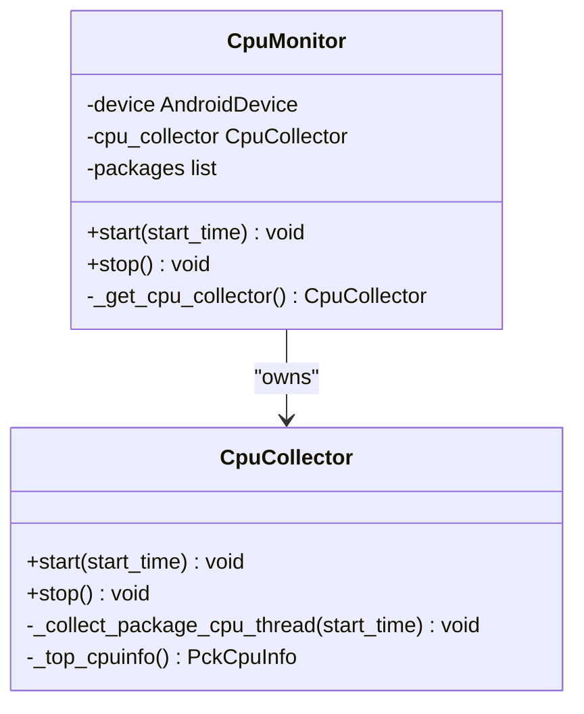
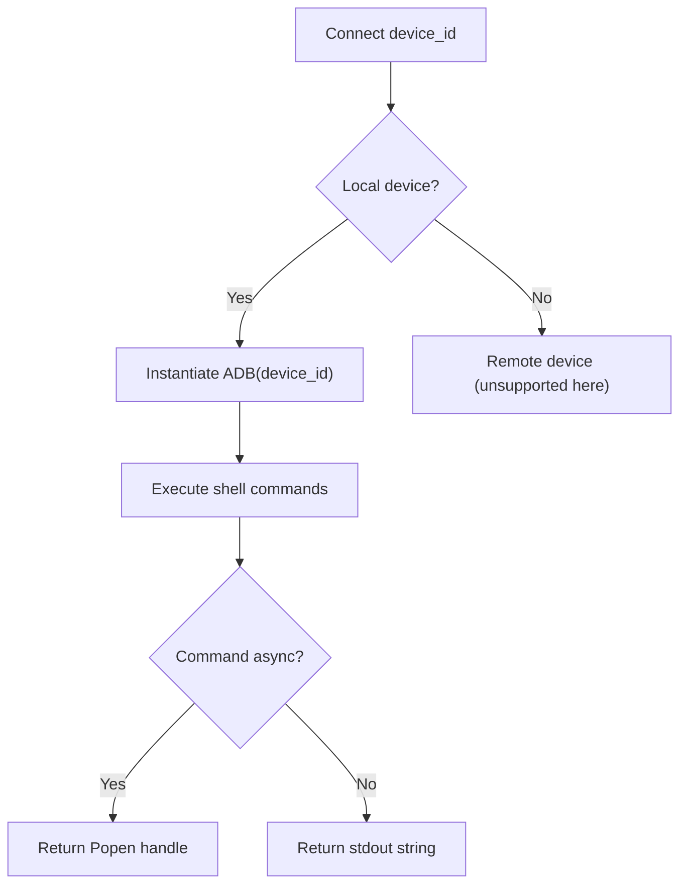
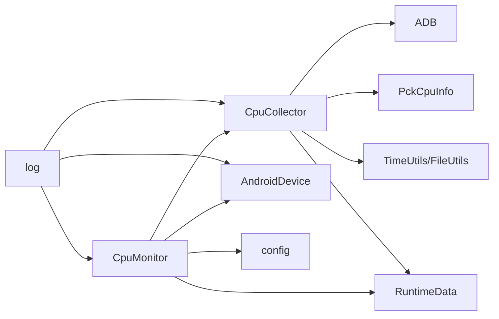

# Performance Data Collection

<cite>
**Referenced Files in This Document**
- [androidDevice.py](file://mobilePerf/perfCode/androidDevice.py)
- [cpu_top.py](file://mobilePerf/perfCode/cpu_top.py)
- [basemonitor.py](file://mobilePerf/perfCode/common/basemonitor.py)
- [config.py](file://mobilePerf/perfCode/common/config.py)
- [utils.py](file://mobilePerf/perfCode/common/utils.py)
- [log.py](file://mobilePerf/perfCode/common/log.py)
- [globaldata.py](file://mobilePerf/perfCode/globaldata.py)
</cite>

## Table of Contents
1. [Introduction](#introduction)
2. [Project Structure](#project-structure)
3. [Core Components](#core-components)
4. [Architecture Overview](#architecture-overview)
5. [Detailed Component Analysis](#detailed-component-analysis)
6. [Dependency Analysis](#dependency-analysis)
7. [Performance Considerations](#performance-considerations)
8. [Troubleshooting Guide](#troubleshooting-guide)
9. [Conclusion](#conclusion)
10. [Appendices](#appendices)

## Introduction
This document describes the performance data collection system focused on CPU usage monitoring on Android devices via ADB. It explains the end-to-end workflow from device connection to CPU sampling, parsing top command output, and orchestrating monitoring sessions. It documents the PckCpuInfo class for parsing top output, the CpuCollector class for managing data collection threads, and the CpuMonitor class for orchestrating monitoring sessions. It also covers the AndroidDevice interaction layer, SDK version compatibility handling, and top command execution with different parameter variations. Practical examples, configuration options, troubleshooting, and optimization tips are included.

## Project Structure
The performance monitoring stack is organized around a small set of modules:
- Device interaction and ADB orchestration
- CPU data collection and parsing
- Shared utilities and logging
- Global runtime state

**Diagram sources**
- [androidDevice.py:1129-1177](file://mobilePerf/perfCode/androidDevice.py#L1129-L1177)
- [cpu_top.py:206-383](file://mobilePerf/perfCode/cpu_top.py#L206-L383)
- [config.py:1-20](file://mobilePerf/perfCode/common/config.py#L1-L20)
- [utils.py:10-156](file://mobilePerf/perfCode/common/utils.py#L10-L156)
- [log.py:22-79](file://mobilePerf/perfCode/common/log.py#L22-L79)
- [globaldata.py:1-14](file://mobilePerf/perfCode/globaldata.py#L1-L14)

**Section sources**
- [androidDevice.py:1129-1177](file://mobilePerf/perfCode/androidDevice.py#L1129-L1177)
- [cpu_top.py:206-383](file://mobilePerf/perfCode/cpu_top.py#L206-L383)
- [config.py:1-20](file://mobilePerf/perfCode/common/config.py#L1-L20)
- [utils.py:10-156](file://mobilePerf/perfCode/common/utils.py#L10-L156)
- [log.py:22-79](file://mobilePerf/perfCode/common/log.py#L22-L79)
- [globaldata.py:1-14](file://mobilePerf/perfCode/globaldata.py#L1-L14)

## Core Components
- AndroidDevice: Wraps ADB and exposes device-level operations. Determines whether a device_id refers to a local device and instantiates ADB accordingly.
- ADB: Implements ADB command execution, device discovery, server management, shell command execution, and robust error handling with retries and timeouts.
- CpuMonitor: Orchestrates a CPU monitoring session, sets up output directories, and starts/stops the collector.
- CpuCollector: Manages a dedicated thread that periodically executes top, parses output, writes CSV records, and enforces interval and timeout controls.
- PckCpuInfo: Parses top output to extract device-wide CPU usage and per-process CPU metrics for specified packages, handling SDK version differences.
- Utilities and Logging: TimeUtils, FileUtils, and logging configuration support timing, file management, and structured logging.
- Global Runtime Data: Provides shared runtime state for paths and events.

**Section sources**
- [androidDevice.py:1129-1177](file://mobilePerf/perfCode/androidDevice.py#L1129-L1177)
- [androidDevice.py:18-1177](file://mobilePerf/perfCode/androidDevice.py#L18-L1177)
- [cpu_top.py:15-433](file://mobilePerf/perfCode/cpu_top.py#L15-L433)
- [utils.py:10-156](file://mobilePerf/perfCode/common/utils.py#L10-L156)
- [log.py:22-79](file://mobilePerf/perfCode/common/log.py#L22-L79)
- [globaldata.py:1-14](file://mobilePerf/perfCode/globaldata.py#L1-L14)

## Architecture Overview
The system follows a layered architecture:
- Device Interaction Layer: AndroidDevice delegates to ADB for all shell and device operations.
- Monitoring Orchestration: CpuMonitor initializes the session and coordinates data collection.
- Data Collection and Parsing: CpuCollector runs a background thread, executes top, and delegates parsing to PckCpuInfo.
- Persistence and Utilities: CSV files are written with timestamps and metrics; utilities provide time and file helpers; logging captures operational details.

**Diagram sources**
- [cpu_top.py:240-348](file://mobilePerf/perfCode/cpu_top.py#L240-L348)
- [cpu_top.py:264-281](file://mobilePerf/perfCode/cpu_top.py#L264-L281)
- [cpu_top.py:15-52](file://mobilePerf/perfCode/cpu_top.py#L15-L52)
- [androidDevice.py:294-308](file://mobilePerf/perfCode/androidDevice.py#L294-L308)

## Detailed Component Analysis

### AndroidDevice and ADB
- Responsibilities:
  - Determine if a device_id is local and instantiate ADB accordingly.
  - Manage ADB server lifecycle, including killing/restarting the server and resolving port conflicts.
  - Execute adb and shell commands with retries, timeouts, and robust error handling.
  - Provide device metadata (SDK version, brand, model, screen size).
  - Support asynchronous shell command execution for long-running commands like top.

- Key behaviors:
  - Device discovery via adb devices and filtering for “device” state.
  - Command execution with configurable timeout and retry count.
  - Asynchronous execution for top to avoid blocking the main thread.
  - Robust error handling for common ADB issues (no devices, offline, port conflicts).

**Diagram sources**
- [androidDevice.py:1129-1177](file://mobilePerf/perfCode/androidDevice.py#L1129-L1177)
- [androidDevice.py:18-1177](file://mobilePerf/perfCode/androidDevice.py#L18-L1177)

**Section sources**
- [androidDevice.py:1129-1177](file://mobilePerf/perfCode/androidDevice.py#L1129-L1177)
- [androidDevice.py:18-1177](file://mobilePerf/perfCode/androidDevice.py#L18-L1177)

### PckCpuInfo: Parsing top Output
- Purpose: Parse top command output to extract device-wide CPU usage and per-package CPU metrics.
- SDK Version Compatibility:
  - For SDK < 26: parse a compact CPU usage line containing User, System, IOW, IRQ percentages.
  - For SDK >= 26: parse a detailed CPU usage line with User, Nice, System, Idle, IOW, IRQ, SIRQ, Host.
- Column Detection:
  - Dynamically detects column indices for CPU%, UID/USER, ARGS/PACKAGENAME, VSS/RSS, PCY.
  - Handles variations in column names across devices.
- Per-Package Extraction:
  - Iterates top lines to locate entries matching target package names.
  - Extracts PID, CPU%, and UID; accumulates total PID CPU% for multi-package sessions.

**Diagram sources**
- [cpu_top.py:91-121](file://mobilePerf/perfCode/cpu_top.py#L91-L121)
- [cpu_top.py:53-90](file://mobilePerf/perfCode/cpu_top.py#L53-L90)
- [cpu_top.py:140-203](file://mobilePerf/perfCode/cpu_top.py#L140-L203)

**Section sources**
- [cpu_top.py:15-52](file://mobilePerf/perfCode/cpu_top.py#L15-L52)
- [cpu_top.py:91-121](file://mobilePerf/perfCode/cpu_top.py#L91-L121)
- [cpu_top.py:140-203](file://mobilePerf/perfCode/cpu_top.py#L140-L203)

### CpuCollector: Managing Data Collection Threads
- Responsibilities:
  - Initialize top command with adaptive parameters (-b or fallback -n) and dynamic interval.
  - Run a dedicated thread that periodically executes top, parses output, and writes CSV rows.
  - Enforce timeout and stop events; gracefully terminate top process if still running.
  - Persist top output and scaling_max_freq for diagnostics.
- Adaptive Sampling:
  - Uses top -b -n 1 -d interval when supported; falls back to top -n 1 -d interval otherwise.
  - Adjusts sleep between iterations to maintain target interval minus processing time.
- Multi-Package Support:
  - Writes per-package columns (package, pid, pid_cpu%) and total_pid_cpu when multiple packages are monitored.

**Diagram sources**
- [cpu_top.py:240-348](file://mobilePerf/perfCode/cpu_top.py#L240-L348)
- [cpu_top.py:264-281](file://mobilePerf/perfCode/cpu_top.py#L264-L281)
- [cpu_top.py:206-238](file://mobilePerf/perfCode/cpu_top.py#L206-L238)

**Section sources**
- [cpu_top.py:206-348](file://mobilePerf/perfCode/cpu_top.py#L206-L348)
- [cpu_top.py:227-232](file://mobilePerf/perfCode/cpu_top.py#L227-L232)

### CpuMonitor: Orchestrating Monitoring Sessions
- Responsibilities:
  - Initialize AndroidDevice and CpuCollector with device_id, packages, interval, and timeout.
  - Prepare output directories and start the collector thread.
  - Stop the collector and finalize the session.
- Configuration:
  - Uses config defaults for package/device and period; can be overridden by caller.
  - Creates a results directory under the project root for CSV and diagnostic logs.

**Diagram sources**
- [cpu_top.py:350-383](file://mobilePerf/perfCode/cpu_top.py#L350-L383)
- [cpu_top.py:206-348](file://mobilePerf/perfCode/cpu_top.py#L206-L348)

**Section sources**
- [cpu_top.py:350-383](file://mobilePerf/perfCode/cpu_top.py#L350-L383)

### AndroidDevice Interaction Patterns
- Local vs Remote Device Detection:
  - Uses a regex-based pattern to distinguish local devices (serialNumber or hostname:portNumber) from remote devices.
- Device Discovery:
  - Lists devices via adb devices and filters for “device” state.
- Shell Command Execution:
  - Supports synchronous and asynchronous execution; handles timeouts and retries.
- Diagnostics:
  - Captures /proc/uptime during reconnection attempts and persists top output and scaling_max_freq for troubleshooting.

**Diagram sources**
- [androidDevice.py:1136-1150](file://mobilePerf/perfCode/androidDevice.py#L1136-L1150)
- [androidDevice.py:294-308](file://mobilePerf/perfCode/androidDevice.py#L294-L308)

**Section sources**
- [androidDevice.py:1136-1150](file://mobilePerf/perfCode/androidDevice.py#L1136-L1150)
- [androidDevice.py:294-308](file://mobilePerf/perfCode/androidDevice.py#L294-L308)

### Top Command Variations and SDK Compatibility
- Parameter Variants:
  - top -b -n 1 -d interval: Batch mode preferred; may fail on some devices.
  - top -n 1 -d interval: Fallback when -b is unsupported.
- SDK Version Handling:
  - SDK < 26: parse compact CPU usage line.
  - SDK >= 26: parse detailed CPU usage line with additional fields.
- Column Index Resolution:
  - Dynamically resolves column indices for CPU%, UID/USER, ARGS, VSS, RSS, PCY across devices.

**Section sources**
- [cpu_top.py:227-232](file://mobilePerf/perfCode/cpu_top.py#L227-L232)
- [cpu_top.py:96-121](file://mobilePerf/perfCode/cpu_top.py#L96-L121)
- [cpu_top.py:184-203](file://mobilePerf/perfCode/cpu_top.py#L184-L203)

### Practical Examples

- Example: Single Package Monitoring
  - Initialize CpuMonitor with a single package and default interval.
  - Start the monitor, run for a desired duration, then stop.
  - Inspect CSV output for datetime, device_cpu_rate%, user%, system%, idle%, and per-package metrics.

- Example: Multi-Package Monitoring
  - Pass a list of packages to CpuMonitor.
  - The collector writes per-package columns and total_pid_cpu when multiple packages are present.

- Example: Device Interaction
  - Use AndroidDevice to list local devices and select a device_id.
  - Ensure ADB server is healthy and resolve port conflicts if needed.

- Example: Diagnostics
  - Review top.txt and scaling_max_freq.txt for troubleshooting.
  - Confirm uptime.txt entries when reconnections occur.

**Section sources**
- [cpu_top.py:350-383](file://mobilePerf/perfCode/cpu_top.py#L350-L383)
- [cpu_top.py:290-348](file://mobilePerf/perfCode/cpu_top.py#L290-L348)
- [androidDevice.py:1152-1156](file://mobilePerf/perfCode/androidDevice.py#L1152-L1156)

## Dependency Analysis
- Cohesion:
  - PckCpuInfo encapsulates parsing logic; CpuCollector encapsulates collection and persistence.
  - AndroidDevice and ADB are cohesive units for device interaction.
- Coupling:
  - CpuMonitor depends on AndroidDevice and CpuCollector.
  - CpuCollector depends on ADB and PckCpuInfo.
  - Utilities and logging are used across components.
- External Dependencies:
  - subprocess for shell command execution.
  - CSV for writing metrics.
  - Regular expressions for parsing top output.

**Diagram sources**
- [cpu_top.py:206-383](file://mobilePerf/perfCode/cpu_top.py#L206-L383)
- [androidDevice.py:1129-1177](file://mobilePerf/perfCode/androidDevice.py#L1129-L1177)
- [config.py:1-20](file://mobilePerf/perfCode/common/config.py#L1-L20)
- [utils.py:10-156](file://mobilePerf/perfCode/common/utils.py#L10-L156)
- [globaldata.py:1-14](file://mobilePerf/perfCode/globaldata.py#L1-L14)
- [log.py:22-79](file://mobilePerf/perfCode/common/log.py#L22-L79)

**Section sources**
- [cpu_top.py:206-383](file://mobilePerf/perfCode/cpu_top.py#L206-L383)
- [androidDevice.py:1129-1177](file://mobilePerf/perfCode/androidDevice.py#L1129-L1177)
- [config.py:1-20](file://mobilePerf/perfCode/common/config.py#L1-L20)
- [utils.py:10-156](file://mobilePerf/perfCode/common/utils.py#L10-L156)
- [globaldata.py:1-14](file://mobilePerf/perfCode/globaldata.py#L1-L14)
- [log.py:22-79](file://mobilePerf/perfCode/common/log.py#L22-L79)

## Performance Considerations
- Sampling Interval Accuracy:
  - The collector subtracts processing time from the interval to maintain target cadence.
- Resource Footprint:
  - CSV writes are buffered per row; consider batching for very high-frequency sampling.
  - Top output is persisted to top.txt; a cleanup threshold prevents unbounded growth.
- SDK-Specific Parsing:
  - Using SDK detection avoids mis-parsing CPU fields on newer Android versions.
- Asynchronous Execution:
  - Running top asynchronously prevents blocking the main thread and allows timely shutdown.

[No sources needed since this section provides general guidance]

## Troubleshooting Guide
Common issues and resolutions:
- No Devices Found:
  - Verify USB connection and ADB permissions; use adb devices to confirm.
- ADB Port Conflict:
  - The system detects and kills processes occupying port 5037; restart ADB server if needed.
- Offline Device:
  - Ensure the device is awake and unlocked; reconnect USB if necessary.
- Unsupported top -b:
  - The collector automatically falls back to top -n variant.
- Slow or Stuck Commands:
  - Increase timeout or reduce interval; check device responsiveness.
- CSV Write Failures:
  - Ensure write permissions to the results directory; verify disk space.

Operational diagnostics:
- Review top.txt for raw top output and errors.
- Check scaling_max_freq.txt for CPU frequency limits.
- Inspect uptime.txt entries when reconnections occur.

**Section sources**
- [androidDevice.py:240-262](file://mobilePerf/perfCode/androidDevice.py#L240-L262)
- [androidDevice.py:140-176](file://mobilePerf/perfCode/androidDevice.py#L140-L176)
- [cpu_top.py:227-232](file://mobilePerf/perfCode/cpu_top.py#L227-L232)
- [cpu_top.py:273-279](file://mobilePerf/perfCode/cpu_top.py#L273-L279)

## Conclusion
The performance data collection system provides a robust pipeline for CPU monitoring on Android devices. It integrates device interaction, adaptive top command execution, precise parsing, and structured data export. The design accommodates SDK differences, supports multi-package monitoring, and offers diagnostics for troubleshooting. By tuning intervals and timeouts and leveraging the provided utilities, teams can achieve accurate and reliable CPU measurements for performance analysis.

[No sources needed since this section summarizes without analyzing specific files]

## Appendices

### Configuration Options
- Collection Intervals and Timeout:
  - interval: Sampling interval passed to top -d.
  - timeout: Maximum duration for the monitoring session.
- Multi-Package Monitoring:
  - packages: List of package names to monitor; CSV includes per-package columns and total_pid_cpu when multiple packages are provided.
- Device Selection:
  - device_id: Serial number or identifier for the target device.

**Section sources**
- [cpu_top.py:211-217](file://mobilePerf/perfCode/cpu_top.py#L211-L217)
- [cpu_top.py:355-358](file://mobilePerf/perfCode/cpu_top.py#L355-L358)
- [config.py:1-20](file://mobilePerf/perfCode/common/config.py#L1-L20)

### Data Export Format
- CSV Columns:
  - datetime, device_cpu_rate%, user%, system%, idle%
  - For each package: package, pid, pid_cpu%
  - total_pid_cpu (when multiple packages are monitored)

**Section sources**
- [cpu_top.py:296-301](file://mobilePerf/perfCode/cpu_top.py#L296-L301)
- [cpu_top.py:320-327](file://mobilePerf/perfCode/cpu_top.py#L320-L327)