# Performance Monitoring System

<cite>
**Referenced Files in This Document**
- [README.md](file://README.md)
- [androidDevice.py](file://mobilePerf/perfCode/androidDevice.py)
- [cpu_top.py](file://mobilePerf/perfCode/cpu_top.py)
- [logcat.py](file://mobilePerf/perfCode/logcat.py)
- [runFps.py](file://mobilePerf/perfCode/runFps.py)
- [globaldata.py](file://mobilePerf/perfCode/globaldata.py)
- [basemonitor.py](file://mobilePerf/perfCode/common/basemonitor.py)
- [utils.py](file://mobilePerf/perfCode/common/utils.py)
- [config.py](file://mobilePerf/perfCode/common/config.py)
- [csvToChart.py](file://mobilePerf/tools/csvToChart.py)
- [chooseFileToChart.py](file://mobilePerf/tools/chooseFileToChart.py)
- [testPhoneTime.py](file://mobilePerf/tools/testPhoneTime.py)
</cite>

## Table of Contents
1. [Introduction](#introduction)
2. [Project Structure](#project-structure)
3. [Core Components](#core-components)
4. [Architecture Overview](#architecture-overview)
5. [Detailed Component Analysis](#detailed-component-analysis)
6. [Dependency Analysis](#dependency-analysis)
7. [Performance Considerations](#performance-considerations)
8. [Troubleshooting Guide](#troubleshooting-guide)
9. [Conclusion](#conclusion)
10. [Appendices](#appendices)

## Introduction
This document describes the performance monitoring system designed to collect, analyze, and visualize Android device performance metrics via ADB. It covers the complete workflow from device connection to data collection, aggregation, filtering, statistical analysis, and chart generation. The system focuses on CPU usage monitoring with adaptive sampling, memory analysis, FPS collection, and temperature monitoring. It also documents performance testing workflows including cold start and hot start testing, along with practical examples and troubleshooting guidance.

## Project Structure
The repository organizes performance-related code under mobilePerf, with separate modules for device interaction, metrics collection, and reporting tools. The structure supports:
- Device interaction layer (ADB wrapper)
- Metrics collectors (CPU, FPS, logcat-based launch time)
- Data aggregation and filtering utilities
- Statistical analysis and chart generation
- Performance testing workflows (cold/hot start)

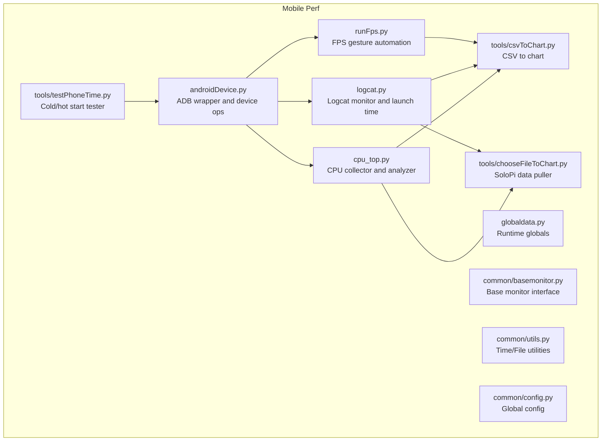

**Diagram sources**
- [androidDevice.py:18-1177](file://mobilePerf/perfCode/androidDevice.py#L18-L1177)
- [cpu_top.py:1-433](file://mobilePerf/perfCode/cpu_top.py#L1-L433)
- [logcat.py:1-216](file://mobilePerf/perfCode/logcat.py#L1-L216)
- [runFps.py:1-94](file://mobilePerf/perfCode/runFps.py#L1-L94)
- [globaldata.py:1-14](file://mobilePerf/perfCode/globaldata.py#L1-L14)
- [basemonitor.py:1-37](file://mobilePerf/perfCode/common/basemonitor.py#L1-L37)
- [utils.py:1-156](file://mobilePerf/perfCode/common/utils.py#L1-L156)
- [config.py:1-20](file://mobilePerf/perfCode/common/config.py#L1-L20)
- [csvToChart.py:1-151](file://mobilePerf/tools/csvToChart.py#L1-L151)
- [chooseFileToChart.py:1-145](file://mobilePerf/tools/chooseFileToChart.py#L1-L145)
- [testPhoneTime.py:1-170](file://mobilePerf/tools/testPhoneTime.py#L1-L170)

**Section sources**
- [README.md:24-31](file://README.md#L24-L31)
- [androidDevice.py:18-1177](file://mobilePerf/perfCode/androidDevice.py#L18-L1177)
- [cpu_top.py:1-433](file://mobilePerf/perfCode/cpu_top.py#L1-L433)
- [logcat.py:1-216](file://mobilePerf/perfCode/logcat.py#L1-L216)
- [runFps.py:1-94](file://mobilePerf/perfCode/runFps.py#L1-L94)
- [globaldata.py:1-14](file://mobilePerf/perfCode/globaldata.py#L1-L14)
- [basemonitor.py:1-37](file://mobilePerf/perfCode/common/basemonitor.py#L1-L37)
- [utils.py:1-156](file://mobilePerf/perfCode/common/utils.py#L1-L156)
- [config.py:1-20](file://mobilePerf/perfCode/common/config.py#L1-L20)
- [csvToChart.py:1-151](file://mobilePerf/tools/csvToChart.py#L1-L151)
- [chooseFileToChart.py:1-145](file://mobilePerf/tools/chooseFileToChart.py#L1-L145)
- [testPhoneTime.py:1-170](file://mobilePerf/tools/testPhoneTime.py#L1-L170)

## Core Components
- Device Interaction Layer (ADB wrapper): Provides robust ADB command execution, device discovery, logcat streaming, process management, and file operations.
- CPU Collector: Streams CPU usage via top, parses per-process and device-wide metrics, and writes CSV for later analysis.
- Logcat Monitor: Captures system logs, extracts launch time events, and writes structured CSV entries.
- FPS Automation: Generates touch gestures to drive UI interactions for FPS measurement.
- Reporting Tools: Parse CSV outputs and generate charts for FPS, CPU, MEM, and TEMP.
- Performance Testing: Cold start and hot start testers with statistical summaries.

**Section sources**
- [androidDevice.py:18-1177](file://mobilePerf/perfCode/androidDevice.py#L18-L1177)
- [cpu_top.py:206-383](file://mobilePerf/perfCode/cpu_top.py#L206-L383)
- [logcat.py:17-212](file://mobilePerf/perfCode/logcat.py#L17-L212)
- [runFps.py:54-90](file://mobilePerf/perfCode/runFps.py#L54-L90)
- [csvToChart.py:14-86](file://mobilePerf/tools/csvToChart.py#L14-L86)
- [testPhoneTime.py:13-164](file://mobilePerf/tools/testPhoneTime.py#L13-L164)

## Architecture Overview
The system orchestrates device connectivity, metrics collection, and visualization through a layered architecture:
- Device Layer: ADB wrapper encapsulates device commands and logcat streaming.
- Collector Layer: Specialized collectors gather CPU, FPS, and launch time data.
- Aggregation Layer: Utilities normalize timestamps and extract metrics.
- Analysis Layer: CSV parsing and chart generation produce visual reports.
- Test Layer: Cold/hot start workflows validate performance under realistic conditions.

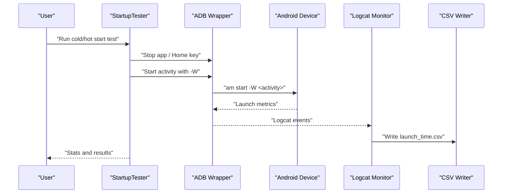

**Diagram sources**
- [testPhoneTime.py:37-77](file://mobilePerf/tools/testPhoneTime.py#L37-L77)
- [logcat.py:135-211](file://mobilePerf/perfCode/logcat.py#L135-L211)
- [androidDevice.py:604-624](file://mobilePerf/perfCode/androidDevice.py#L604-L624)

## Detailed Component Analysis

### Device Interaction Layer (ADB)
The ADB wrapper centralizes device operations:
- Device discovery and health checks
- Command execution with retries and timeouts
- Logcat streaming with real-time callbacks
- File operations (push/pull), process management, and property queries
- Port forwarding and APK installation/uninstallation

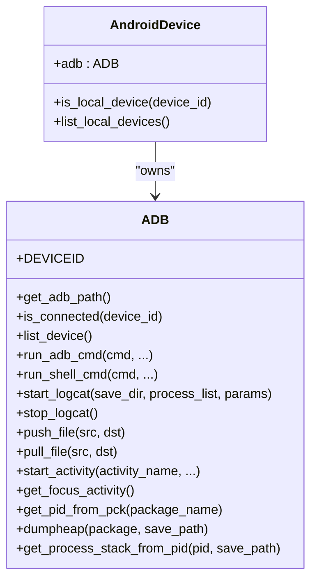

**Diagram sources**
- [androidDevice.py:18-1177](file://mobilePerf/perfCode/androidDevice.py#L18-L1177)

**Section sources**
- [androidDevice.py:18-1177](file://mobilePerf/perfCode/androidDevice.py#L18-L1177)

### CPU Usage Monitoring with Adaptive Sampling
The CPU collector streams top output, adapts sampling intervals, and aggregates per-process and device-wide metrics:
- Top command adaptation for different SDK versions
- Per-package PID resolution and CPU% extraction
- Device-wide CPU% calculation (user + system)
- CSV export with timestamps and totals
- Optional max frequency probing

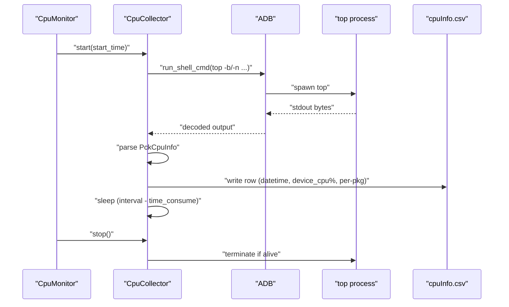

**Diagram sources**
- [cpu_top.py:206-383](file://mobilePerf/perfCode/cpu_top.py#L206-L383)
- [cpu_top.py:264-281](file://mobilePerf/perfCode/cpu_top.py#L264-L281)
- [cpu_top.py:290-347](file://mobilePerf/perfCode/cpu_top.py#L290-L347)

**Section sources**
- [cpu_top.py:15-205](file://mobilePerf/perfCode/cpu_top.py#L15-L205)
- [cpu_top.py:206-383](file://mobilePerf/perfCode/cpu_top.py#L206-L383)
- [utils.py:10-50](file://mobilePerf/perfCode/common/utils.py#L10-L50)

### Memory Analysis
Memory metrics are integrated into the reporting pipeline:
- Memory data is pulled from SoloPi and organized into CSV files
- The CSV-to-chart tool supports MEM data visualization with filtering and outlier removal

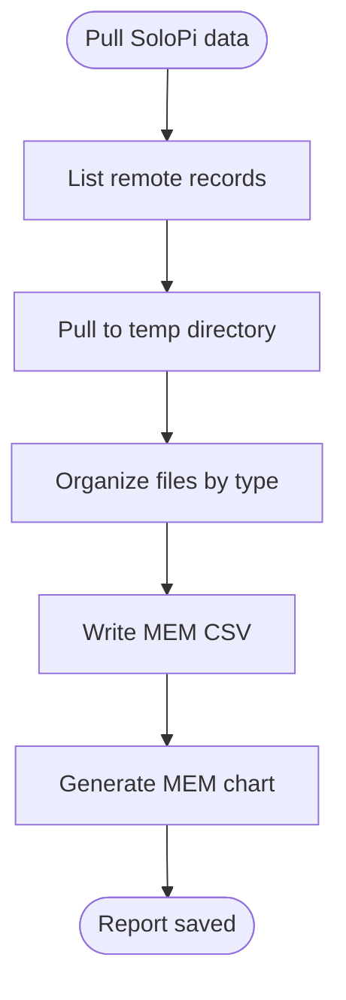

**Diagram sources**
- [chooseFileToChart.py:63-98](file://mobilePerf/tools/chooseFileToChart.py#L63-L98)
- [csvToChart.py:14-86](file://mobilePerf/tools/csvToChart.py#L14-L86)

**Section sources**
- [chooseFileToChart.py:1-145](file://mobilePerf/tools/chooseFileToChart.py#L1-L145)
- [csvToChart.py:1-151](file://mobilePerf/tools/csvToChart.py#L1-L151)

### FPS Collection
FPS measurement is driven by simulated user interactions:
- Automated swipe gestures executed via ADB
- Continuous loop to generate UI load for FPS evaluation
- Configurable device selection and gesture sequences

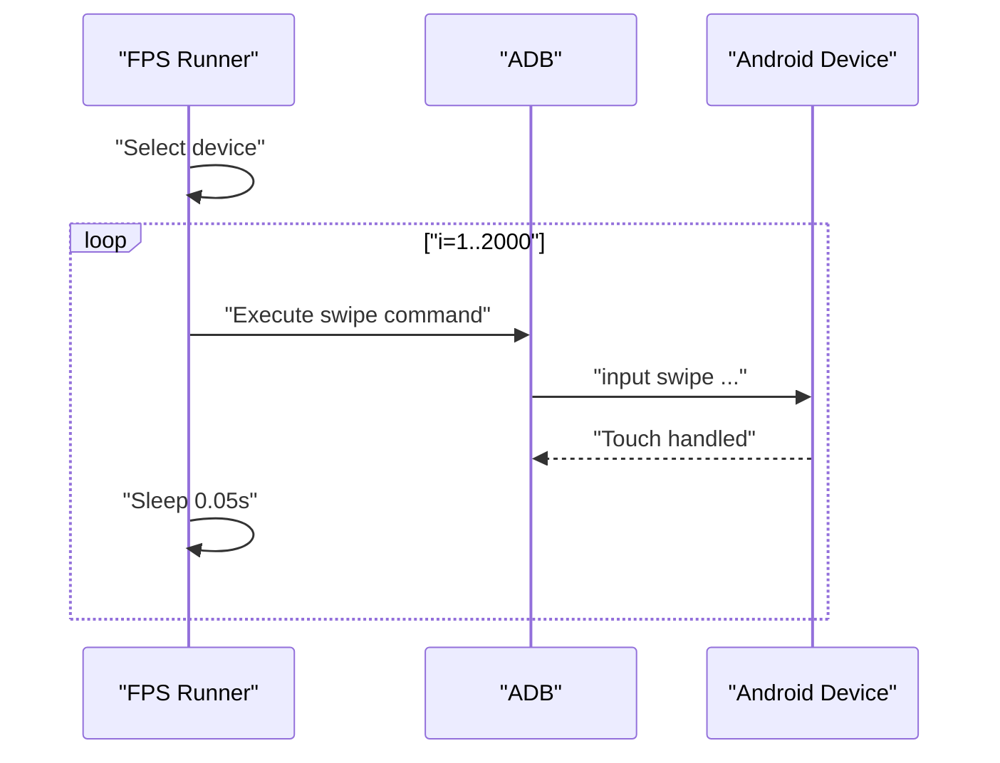

**Diagram sources**
- [runFps.py:54-90](file://mobilePerf/perfCode/runFps.py#L54-L90)

**Section sources**
- [runFps.py:1-94](file://mobilePerf/perfCode/runFps.py#L1-L94)

### Temperature Monitoring
Temperature data is collected and visualized alongside other metrics:
- Temperature values are parsed from CSV and filtered for validity
- Outlier removal improves visualization quality
- Chart generation produces PNG outputs for daily reports

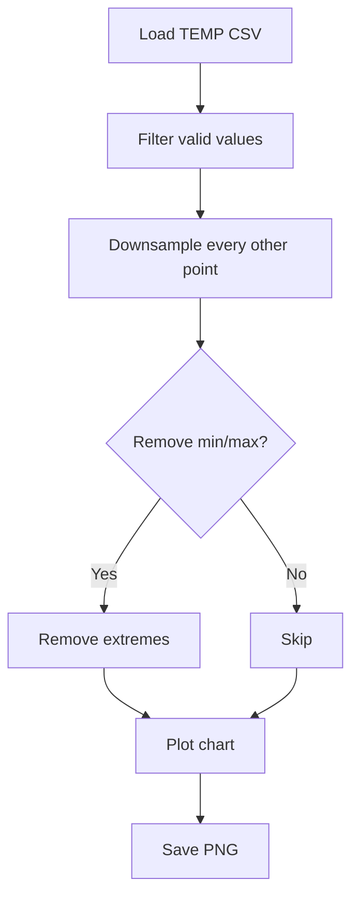

**Diagram sources**
- [csvToChart.py:34-86](file://mobilePerf/tools/csvToChart.py#L34-L86)

**Section sources**
- [csvToChart.py:1-151](file://mobilePerf/tools/csvToChart.py#L1-L151)

### Logcat-Based Launch Time Analysis
The logcat monitor captures system logs and extracts launch timing:
- Registers handlers for launch time tags
- Parses fully drawn and normal launch events
- Writes CSV with timestamps, activity names, and durations
- Converts milliseconds to seconds for readability

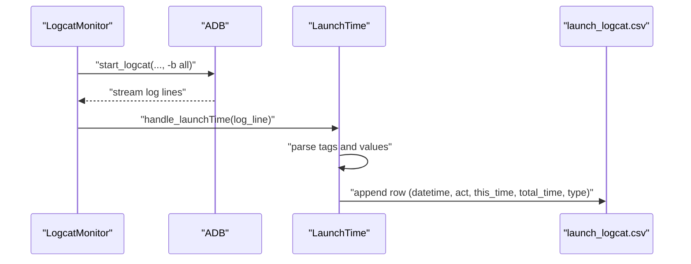

**Diagram sources**
- [logcat.py:32-70](file://mobilePerf/perfCode/logcat.py#L32-L70)
- [logcat.py:135-211](file://mobilePerf/perfCode/logcat.py#L135-L211)

**Section sources**
- [logcat.py:17-212](file://mobilePerf/perfCode/logcat.py#L17-L212)
- [utils.py:138-143](file://mobilePerf/perfCode/common/utils.py#L138-L143)

### Data Aggregation and Filtering
Utilities provide consistent time formatting, file operations, and metric conversions:
- Time formatting helpers for filenames and CSV headers
- File size and timestamp utilities
- Unit conversions (ms to s, temperature scaling)
- CSV parsing and chart generation with filtering and downsampling

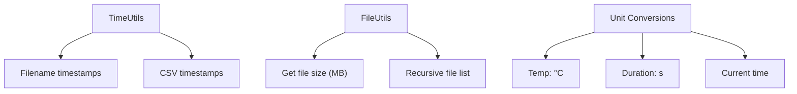

**Diagram sources**
- [utils.py:10-156](file://mobilePerf/perfCode/common/utils.py#L10-L156)

**Section sources**
- [utils.py:1-156](file://mobilePerf/perfCode/common/utils.py#L1-L156)

### Statistical Analysis and Chart Generation
The CSV-to-chart tool performs:
- Automatic detection of latest CSV per performance type
- Filtering invalid values and removing outliers
- Downsampling to reduce noise
- Matplotlib-based chart creation with standardized styling

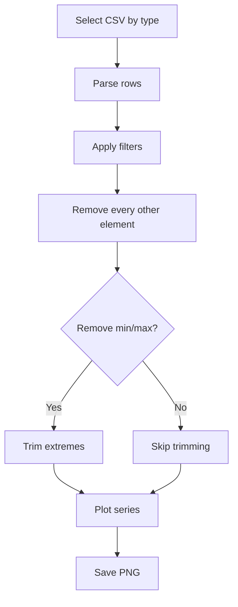

**Diagram sources**
- [csvToChart.py:34-86](file://mobilePerf/tools/csvToChart.py#L34-L86)
- [csvToChart.py:117-146](file://mobilePerf/tools/csvToChart.py#L117-L146)

**Section sources**
- [csvToChart.py:1-151](file://mobilePerf/tools/csvToChart.py#L1-L151)

### Performance Testing Workflows (Cold Start and Hot Start)
The startup tester automates cold and hot start measurements:
- Cold start clears app state and measures TotalTime
- Hot start navigates home and measures subsequent launch
- Statistics computed with optional outlier removal
- Results saved to text files for review

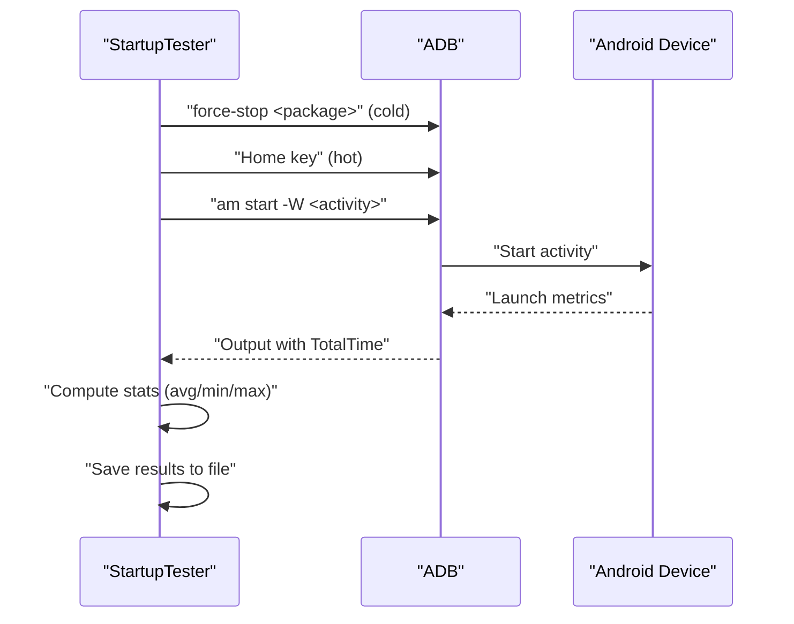

**Diagram sources**
- [testPhoneTime.py:37-77](file://mobilePerf/tools/testPhoneTime.py#L37-L77)
- [testPhoneTime.py:94-128](file://mobilePerf/tools/testPhoneTime.py#L94-L128)

**Section sources**
- [testPhoneTime.py:1-170](file://mobilePerf/tools/testPhoneTime.py#L1-L170)

## Dependency Analysis
The system exhibits clear separation of concerns:
- Device layer depends on ADB utilities and runtime data
- Collectors depend on device operations and utilities
- Reporting tools depend on CSV parsing and plotting libraries
- Test tools depend on device commands and statistics

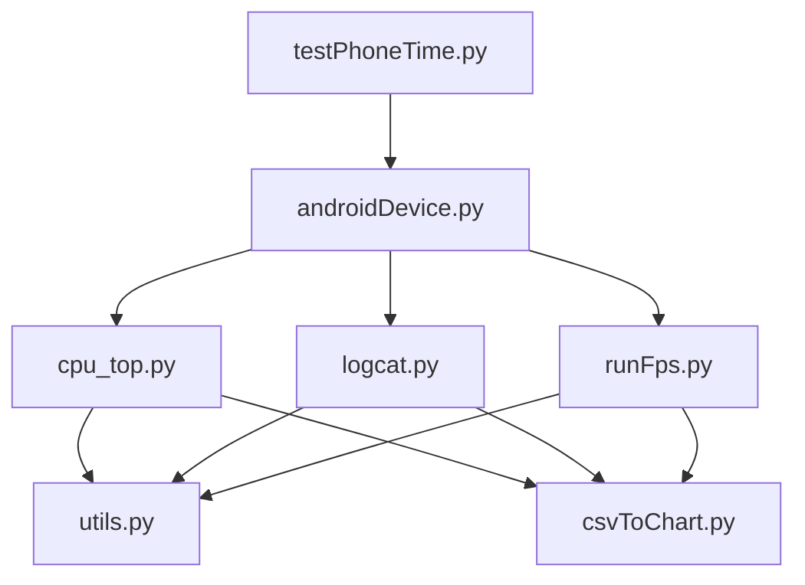

**Diagram sources**
- [androidDevice.py:18-1177](file://mobilePerf/perfCode/androidDevice.py#L18-L1177)
- [cpu_top.py:1-433](file://mobilePerf/perfCode/cpu_top.py#L1-L433)
- [logcat.py:1-216](file://mobilePerf/perfCode/logcat.py#L1-L216)
- [runFps.py:1-94](file://mobilePerf/perfCode/runFps.py#L1-L94)
- [utils.py:1-156](file://mobilePerf/perfCode/common/utils.py#L1-L156)
- [csvToChart.py:1-151](file://mobilePerf/tools/csvToChart.py#L1-L151)
- [testPhoneTime.py:1-170](file://mobilePerf/tools/testPhoneTime.py#L1-L170)

**Section sources**
- [androidDevice.py:18-1177](file://mobilePerf/perfCode/androidDevice.py#L18-L1177)
- [cpu_top.py:1-433](file://mobilePerf/perfCode/cpu_top.py#L1-L433)
- [logcat.py:1-216](file://mobilePerf/perfCode/logcat.py#L1-L216)
- [runFps.py:1-94](file://mobilePerf/perfCode/runFps.py#L1-L94)
- [utils.py:1-156](file://mobilePerf/perfCode/common/utils.py#L1-L156)
- [csvToChart.py:1-151](file://mobilePerf/tools/csvToChart.py#L1-L151)
- [testPhoneTime.py:1-170](file://mobilePerf/tools/testPhoneTime.py#L1-L170)

## Performance Considerations
- Sampling intervals: CPU collector adjusts sleep duration to account for top command overhead, maintaining target intervals.
- Logcat throughput: Streaming logs with periodic restarts prevents buffer overflow and ensures continuous capture.
- File size limits: Top output and intermediate logs are rotated to prevent excessive disk usage.
- Data normalization: Consistent timestamp formatting and unit conversions improve reliability across tools.
- Visualization efficiency: Downsampling and outlier removal reduce chart noise and improve rendering performance.

[No sources needed since this section provides general guidance]

## Troubleshooting Guide
Common issues and resolutions:
- ADB connectivity problems:
  - Verify device connection and ADB server health; reset server if port conflicts occur.
  - Use device discovery and wait-for-device to ensure readiness.
- Logcat capture failures:
  - Clear buffers before starting; switch to “-b all” to capture full buffers.
  - Restart logcat thread if idle for extended periods.
- CPU sampling anomalies:
  - Confirm top command availability; fallback to non-batch mode when needed.
  - Validate SDK version handling for different top output formats.
- SoloPi data pull errors:
  - Ensure device is connected and SoloPi directory exists.
  - Pull and rename directories to the expected structure for automated parsing.
- Startup tester timeouts:
  - Increase wait times between iterations; confirm activity names and package identifiers.

**Section sources**
- [androidDevice.py:112-176](file://mobilePerf/perfCode/androidDevice.py#L112-L176)
- [logcat.py:42-69](file://mobilePerf/perfCode/logcat.py#L42-L69)
- [cpu_top.py:227-232](file://mobilePerf/perfCode/cpu_top.py#L227-L232)
- [chooseFileToChart.py:41-80](file://mobilePerf/tools/chooseFileToChart.py#L41-L80)
- [testPhoneTime.py:80-92](file://mobilePerf/tools/testPhoneTime.py#L80-L92)

## Conclusion
The performance monitoring system integrates ADB-driven device operations with specialized collectors for CPU, FPS, and launch timing, and provides robust reporting and testing workflows. Its modular design enables extensibility for additional metrics and platforms, while built-in filtering and visualization streamline performance analysis.

[No sources needed since this section summarizes without analyzing specific files]

## Appendices

### Practical Examples
- Running CPU monitoring:
  - Initialize a monitor with a device ID and package list, start collection, and stop after desired duration. CSV is written automatically.
- Generating charts:
  - Use the CSV-to-chart tool to plot FPS, CPU, MEM, or TEMP from the latest CSV in the report directory.
- Pulling SoloPi data:
  - Run the SoloPi data puller to fetch and organize CSV files into the appropriate report folders.
- Measuring startup times:
  - Execute cold and hot start tests with configurable iterations and save summarized results.

**Section sources**
- [cpu_top.py:350-383](file://mobilePerf/perfCode/cpu_top.py#L350-L383)
- [csvToChart.py:117-146](file://mobilePerf/tools/csvToChart.py#L117-L146)
- [chooseFileToChart.py:100-140](file://mobilePerf/tools/chooseFileToChart.py#L100-L140)
- [testPhoneTime.py:130-164](file://mobilePerf/tools/testPhoneTime.py#L130-L164)