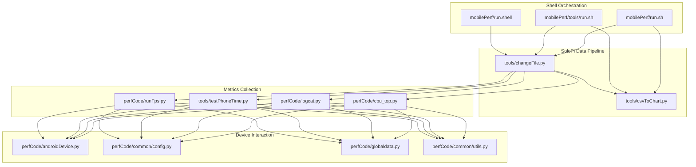
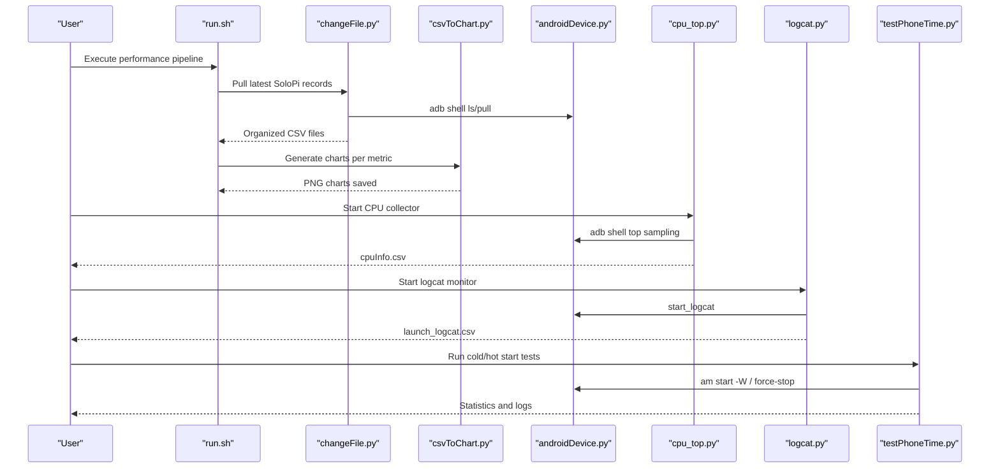
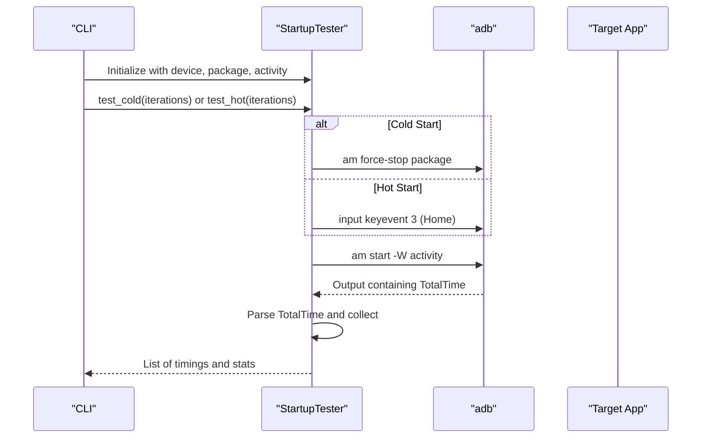
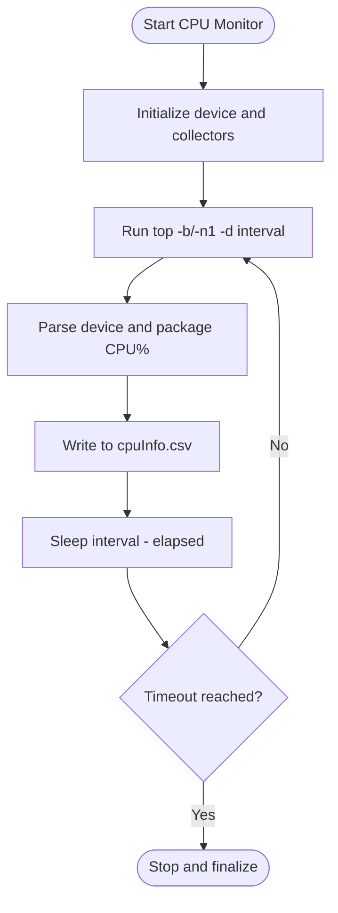
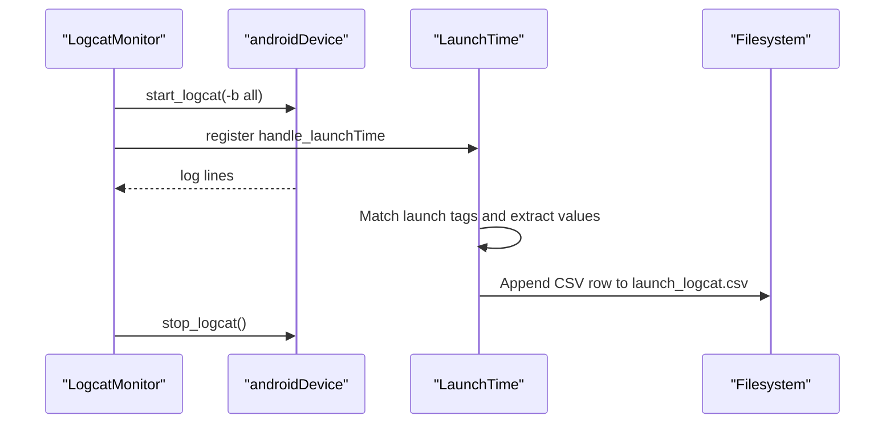
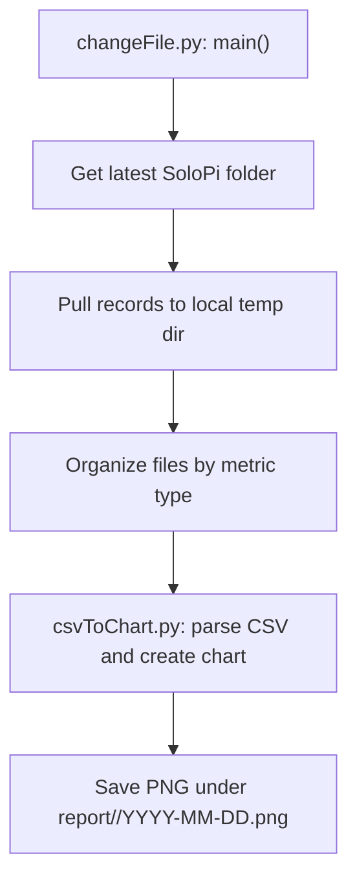
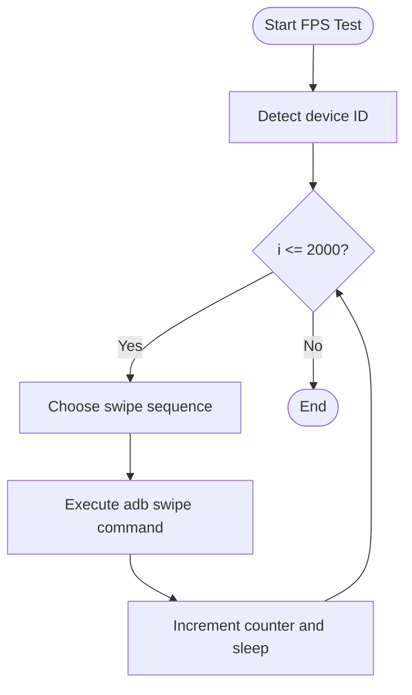
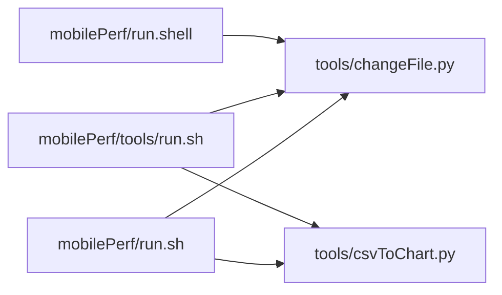
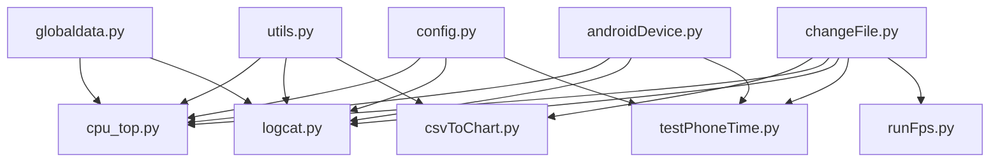

# Performance Testing Workflows

<cite>
**Referenced Files in This Document**
- [README.md](file://README.md)
- [run.sh](file://mobilePerf/run.sh)
- [run.shell](file://mobilePerf/run.shell)
- [tools/run.sh](file://mobilePerf/tools/run.sh)
- [config.py](file://mobilePerf/perfCode/common/config.py)
- [androidDevice.py](file://mobilePerf/perfCode/androidDevice.py)
- [cpu_top.py](file://mobilePerf/perfCode/cpu_top.py)
- [logcat.py](file://mobilePerf/perfCode/logcat.py)
- [globaldata.py](file://mobilePerf/perfCode/globaldata.py)
- [utils.py](file://mobilePerf/perfCode/common/utils.py)
- [testPhoneTime.py](file://mobilePerf/tools/testPhoneTime.py)
- [changeFile.py](file://mobilePerf/tools/changeFile.py)
- [csvToChart.py](file://mobilePerf/tools/csvToChart.py)
- [runFps.py](file://mobilePerf/perfCode/runFps.py)
</cite>

## Table of Contents
1. [Introduction](#introduction)
2. [Project Structure](#project-structure)
3. [Core Components](#core-components)
4. [Architecture Overview](#architecture-overview)
5. [Detailed Component Analysis](#detailed-component-analysis)
6. [Dependency Analysis](#dependency-analysis)
7. [Performance Considerations](#performance-considerations)
8. [Troubleshooting Guide](#troubleshooting-guide)
9. [Conclusion](#conclusion)
10. [Appendices](#appendices)

## Introduction
This document describes the performance testing workflows and automation implemented in the repository. It covers cold start and hot start measurement procedures, continuous performance monitoring (CPU, memory, FPS, temperature), multi-device comparison techniques, and the complete pipeline from test setup to data collection, aggregation, and result visualization. It also documents shell script integration for cross-platform execution, environment setup, and practical examples for designing test cases, automating runs, and interpreting results.

## Project Structure
The performance testing system is organized around:
- A cross-platform shell orchestration layer for data collection and chart generation
- Python modules for device interaction, performance metrics collection, and log parsing
- Tools for pulling SoloPi data, generating charts, and measuring startup times
- Shared utilities for timing, file handling, and runtime data coordination

**Diagram sources**
- [run.sh:1-29](file://mobilePerf/run.sh#L1-L29)
- [tools/run.sh:1-2](file://mobilePerf/tools/run.sh#L1-L2)
- [run.shell:1-1](file://mobilePerf/run.shell#L1-L1)
- [changeFile.py:1-112](file://mobilePerf/tools/changeFile.py#L1-L112)
- [csvToChart.py:1-151](file://mobilePerf/tools/csvToChart.py#L1-L151)
- [androidDevice.py:1-1177](file://mobilePerf/perfCode/androidDevice.py#L1-L1177)
- [cpu_top.py:1-433](file://mobilePerf/perfCode/cpu_top.py#L1-L433)
- [logcat.py:1-216](file://mobilePerf/perfCode/logcat.py#L1-L216)
- [testPhoneTime.py:1-170](file://mobilePerf/tools/testPhoneTime.py#L1-L170)
- [runFps.py:1-94](file://mobilePerf/perfCode/runFps.py#L1-L94)
- [config.py:1-20](file://mobilePerf/perfCode/common/config.py#L1-L20)
- [globaldata.py:1-14](file://mobilePerf/perfCode/globaldata.py#L1-L14)
- [utils.py:1-156](file://mobilePerf/perfCode/common/utils.py#L1-L156)

**Section sources**
- [README.md:1-37](file://README.md#L1-L37)
- [run.sh:1-29](file://mobilePerf/run.sh#L1-L29)
- [tools/run.sh:1-2](file://mobilePerf/tools/run.sh#L1-L2)
- [run.shell:1-1](file://mobilePerf/run.shell#L1-L1)

## Core Components
- Device abstraction and ADB utilities: Provides device enumeration, connection health checks, shell commands, logcat capture, and activity lifecycle controls.
- CPU monitoring: Periodic sampling via top, CSV logging, and optional frequency scaling telemetry.
- Logcat-based launch time parsing: Real-time parsing of Android’s activity launch metrics and writing structured CSV.
- SoloPi data pipeline: Pulls latest records from device storage, organizes CSV files by metric type, and generates charts.
- Startup time measurement: Automated cold and hot start tests with statistical summaries and optional persistence.
- FPS simulation: Generates touch gestures to drive UI load for FPS profiling.
- Shared configuration and runtime data: Centralized device and collection parameters, plus shared runtime state.

**Section sources**
- [androidDevice.py:1-1177](file://mobilePerf/perfCode/androidDevice.py#L1-L1177)
- [cpu_top.py:1-433](file://mobilePerf/perfCode/cpu_top.py#L1-L433)
- [logcat.py:1-216](file://mobilePerf/perfCode/logcat.py#L1-L216)
- [changeFile.py:1-112](file://mobilePerf/tools/changeFile.py#L1-L112)
- [csvToChart.py:1-151](file://mobilePerf/tools/csvToChart.py#L1-L151)
- [testPhoneTime.py:1-170](file://mobilePerf/tools/testPhoneTime.py#L1-L170)
- [runFps.py:1-94](file://mobilePerf/perfCode/runFps.py#L1-L94)
- [config.py:1-20](file://mobilePerf/perfCode/common/config.py#L1-L20)
- [globaldata.py:1-14](file://mobilePerf/perfCode/globaldata.py#L1-L14)
- [utils.py:1-156](file://mobilePerf/perfCode/common/utils.py#L1-L156)

## Architecture Overview
The system orchestrates performance data collection across multiple metrics and platforms. The shell scripts coordinate SoloPi data retrieval and chart generation. Python modules encapsulate device-specific operations and metrics parsing. Results are persisted locally and visualized as charts.

**Diagram sources**
- [run.sh:1-29](file://mobilePerf/run.sh#L1-L29)
- [changeFile.py:1-112](file://mobilePerf/tools/changeFile.py#L1-L112)
- [csvToChart.py:1-151](file://mobilePerf/tools/csvToChart.py#L1-L151)
- [androidDevice.py:1-1177](file://mobilePerf/perfCode/androidDevice.py#L1-L1177)
- [cpu_top.py:1-433](file://mobilePerf/perfCode/cpu_top.py#L1-L433)
- [logcat.py:1-216](file://mobilePerf/perfCode/logcat.py#L1-L216)
- [testPhoneTime.py:1-170](file://mobilePerf/tools/testPhoneTime.py#L1-L170)

## Detailed Component Analysis

### Cold Start and Hot Start Testing
Cold start measures time to first draw after process termination; hot start measures time when the app is already loaded. The tool supports configurable iterations, device selection, and statistical summaries with outlier filtering.

**Diagram sources**
- [testPhoneTime.py:1-170](file://mobilePerf/tools/testPhoneTime.py#L1-L170)

**Section sources**
- [testPhoneTime.py:1-170](file://mobilePerf/tools/testPhoneTime.py#L1-L170)

### CPU Monitoring Workflow
CPU sampling uses periodic top queries, parses device and per-package CPU%, and writes CSV rows. Frequency scaling telemetry is optionally captured. Data is aggregated and later visualized.

**Diagram sources**
- [cpu_top.py:1-433](file://mobilePerf/perfCode/cpu_top.py#L1-L433)
- [androidDevice.py:1-1177](file://mobilePerf/perfCode/androidDevice.py#L1-L1177)

**Section sources**
- [cpu_top.py:1-433](file://mobilePerf/perfCode/cpu_top.py#L1-L433)
- [androidDevice.py:1-1177](file://mobilePerf/perfCode/androidDevice.py#L1-L1177)

### Logcat-Based Launch Time Parsing
The logcat monitor captures all buffers, registers handlers for launch events, parses timestamps and durations, and writes structured CSV entries for downstream analysis.

**Diagram sources**
- [logcat.py:1-216](file://mobilePerf/perfCode/logcat.py#L1-L216)
- [androidDevice.py:1-1177](file://mobilePerf/perfCode/androidDevice.py#L1-L1177)

**Section sources**
- [logcat.py:1-216](file://mobilePerf/perfCode/logcat.py#L1-L216)

### SoloPi Data Pipeline (Pull, Organize, Chart)
SoloPi records are pulled from device storage, organized into metric-specific folders, and charts are generated per metric with filtering and outlier removal.

**Diagram sources**
- [changeFile.py:1-112](file://mobilePerf/tools/changeFile.py#L1-L112)
- [csvToChart.py:1-151](file://mobilePerf/tools/csvToChart.py#L1-L151)

**Section sources**
- [changeFile.py:1-112](file://mobilePerf/tools/changeFile.py#L1-L112)
- [csvToChart.py:1-151](file://mobilePerf/tools/csvToChart.py#L1-L151)

### FPS Simulation Workflow
Generates randomized swipe gestures to stress UI rendering and indirectly measure FPS behavior under load.

**Diagram sources**
- [runFps.py:1-94](file://mobilePerf/perfCode/runFps.py#L1-L94)

**Section sources**
- [runFps.py:1-94](file://mobilePerf/perfCode/runFps.py#L1-L94)

### Cross-Platform Execution and Shell Integration
- Linux/macOS: run.sh orchestrates SoloPi data pull and chart generation for CPU, FPS, MEM, and TEMP.
- Windows: tools/run.sh demonstrates equivalent steps.
- macOS standalone invocation: run.shell invokes changeFile.py.

**Diagram sources**
- [run.sh:1-29](file://mobilePerf/run.sh#L1-L29)
- [tools/run.sh:1-2](file://mobilePerf/tools/run.sh#L1-L2)
- [run.shell:1-1](file://mobilePerf/run.shell#L1-L1)
- [changeFile.py:1-112](file://mobilePerf/tools/changeFile.py#L1-L112)
- [csvToChart.py:1-151](file://mobilePerf/tools/csvToChart.py#L1-L151)

**Section sources**
- [run.sh:1-29](file://mobilePerf/run.sh#L1-L29)
- [tools/run.sh:1-2](file://mobilePerf/tools/run.sh#L1-L2)
- [run.shell:1-1](file://mobilePerf/run.shell#L1-L1)

## Dependency Analysis
The modules exhibit layered dependencies:
- Utilities and configuration are foundational across components.
- Device interaction underpins metrics collection and log parsing.
- The SoloPi pipeline depends on device connectivity and filesystem operations.
- Charts depend on organized CSV outputs.

**Diagram sources**
- [utils.py:1-156](file://mobilePerf/perfCode/common/utils.py#L1-L156)
- [cpu_top.py:1-433](file://mobilePerf/perfCode/cpu_top.py#L1-L433)
- [logcat.py:1-216](file://mobilePerf/perfCode/logcat.py#L1-L216)
- [csvToChart.py:1-151](file://mobilePerf/tools/csvToChart.py#L1-L151)
- [config.py:1-20](file://mobilePerf/perfCode/common/config.py#L1-L20)
- [globaldata.py:1-14](file://mobilePerf/perfCode/globaldata.py#L1-L14)
- [androidDevice.py:1-1177](file://mobilePerf/perfCode/androidDevice.py#L1-L1177)
- [changeFile.py:1-112](file://mobilePerf/tools/changeFile.py#L1-L112)
- [testPhoneTime.py:1-170](file://mobilePerf/tools/testPhoneTime.py#L1-L170)
- [runFps.py:1-94](file://mobilePerf/perfCode/runFps.py#L1-L94)

**Section sources**
- [utils.py:1-156](file://mobilePerf/perfCode/common/utils.py#L1-L156)
- [config.py:1-20](file://mobilePerf/perfCode/common/config.py#L1-L20)
- [globaldata.py:1-14](file://mobilePerf/perfCode/globaldata.py#L1-L14)
- [androidDevice.py:1-1177](file://mobilePerf/perfCode/androidDevice.py#L1-L1177)
- [cpu_top.py:1-433](file://mobilePerf/perfCode/cpu_top.py#L1-L433)
- [logcat.py:1-216](file://mobilePerf/perfCode/logcat.py#L1-L216)
- [changeFile.py:1-112](file://mobilePerf/tools/changeFile.py#L1-L112)
- [csvToChart.py:1-151](file://mobilePerf/tools/csvToChart.py#L1-L151)
- [testPhoneTime.py:1-170](file://mobilePerf/tools/testPhoneTime.py#L1-L170)
- [runFps.py:1-94](file://mobilePerf/perfCode/runFps.py#L1-L94)

## Performance Considerations
- Sampling intervals: Tune collection intervals to balance overhead and fidelity.
- Outlier handling: Filtering extremes improves representative averages for CPU, MEM, and TEMP.
- Data volume: Periodic cleanup of raw logs prevents disk pressure.
- Device contention: Avoid simultaneous heavy workloads during measurements.
- Platform differences: Account for ADB availability and port conflicts; the device module includes safeguards.

[No sources needed since this section provides general guidance]

## Troubleshooting Guide
Common issues and remedies:
- ADB connectivity problems: The device module detects missing devices, offline states, and port conflicts; it attempts recovery and logs actionable errors.
- SoloPi data absence: Verify device connection, SoloPi installation, and directory permissions; the pull tool reports failures clearly.
- Chart generation errors: Ensure CSV files exist and are readable; the chart tool validates supported types and handles missing data gracefully.
- Startup test failures: Confirm package and activity names; the tool prints explicit messages when no device is found or when data is invalid.

**Section sources**
- [androidDevice.py:1-1177](file://mobilePerf/perfCode/androidDevice.py#L1-L1177)
- [changeFile.py:1-112](file://mobilePerf/tools/changeFile.py#L1-L112)
- [csvToChart.py:1-151](file://mobilePerf/tools/csvToChart.py#L1-L151)
- [testPhoneTime.py:1-170](file://mobilePerf/tools/testPhoneTime.py#L1-L170)

## Conclusion
The repository provides a robust, cross-platform performance testing framework integrating device automation, metrics collection, and visualization. By combining cold/hot start measurements, continuous CPU/MEM/FPS/TEMP monitoring, and automated chart generation, teams can establish repeatable, comparable performance baselines across devices and builds. The modular design enables incremental enhancements and CI integration.

[No sources needed since this section summarizes without analyzing specific files]

## Appendices

### Practical Examples

- Configure test scenarios
  - Set package, device ID, and collection period in configuration.
  - Adjust sampling intervals and timeouts for CPU monitoring.
  - Define exception tags for logcat-based crash detection.

  **Section sources**
  - [config.py:1-20](file://mobilePerf/perfCode/common/config.py#L1-L20)
  - [cpu_top.py:1-433](file://mobilePerf/perfCode/cpu_top.py#L1-L433)
  - [logcat.py:1-216](file://mobilePerf/perfCode/logcat.py#L1-L216)

- Execute automated performance tests
  - On Linux/macOS: run the shell orchestration script to pull SoloPi data and generate charts.
  - On Windows: use the provided run script equivalents.
  - For standalone SoloPi pulls or chart generation, invoke the respective Python tools.

  **Section sources**
  - [run.sh:1-29](file://mobilePerf/run.sh#L1-L29)
  - [tools/run.sh:1-2](file://mobilePerf/tools/run.sh#L1-L2)
  - [changeFile.py:1-112](file://mobilePerf/tools/changeFile.py#L1-L112)
  - [csvToChart.py:1-151](file://mobilePerf/tools/csvToChart.py#L1-L151)

- Interpret results
  - CPU/MEM/TEMP charts show trends; filter outliers for stable averages.
  - Startup time statistics summarize central tendency and variability.
  - CSV outputs enable further analysis and regression tracking.

  **Section sources**
  - [csvToChart.py:1-151](file://mobilePerf/tools/csvToChart.py#L1-L151)
  - [testPhoneTime.py:1-170](file://mobilePerf/tools/testPhoneTime.py#L1-L170)

### Multi-Device Performance Comparison Techniques
- Use the device abstraction to iterate across multiple devices and collect aligned datasets.
- Persist results under device-specific subfolders and normalize timestamps.
- Aggregate CSV outputs and produce comparative charts or summary spreadsheets.

**Section sources**
- [androidDevice.py:1-1177](file://mobilePerf/perfCode/androidDevice.py#L1-L1177)
- [globaldata.py:1-14](file://mobilePerf/perfCode/globaldata.py#L1-L14)

### Continuous Performance Monitoring Workflow Optimization
- Schedule periodic runs to capture daily or nightly regressions.
- Integrate shell scripts into CI to auto-generate charts and archive artifacts.
- Apply consistent filtering and normalization to maintain comparability over time.

[No sources needed since this section provides general guidance]