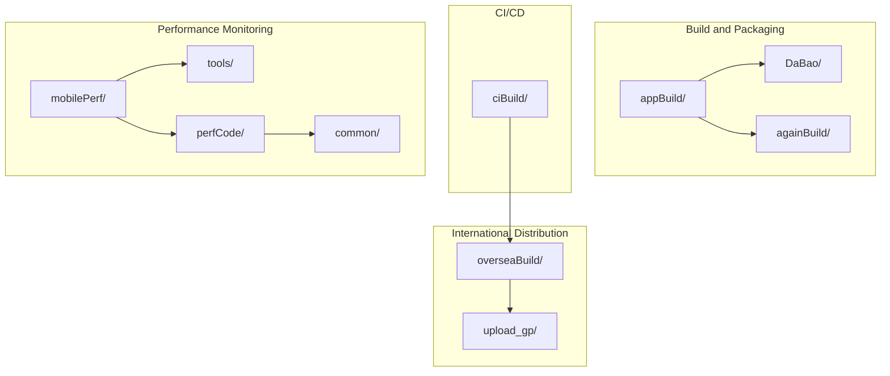
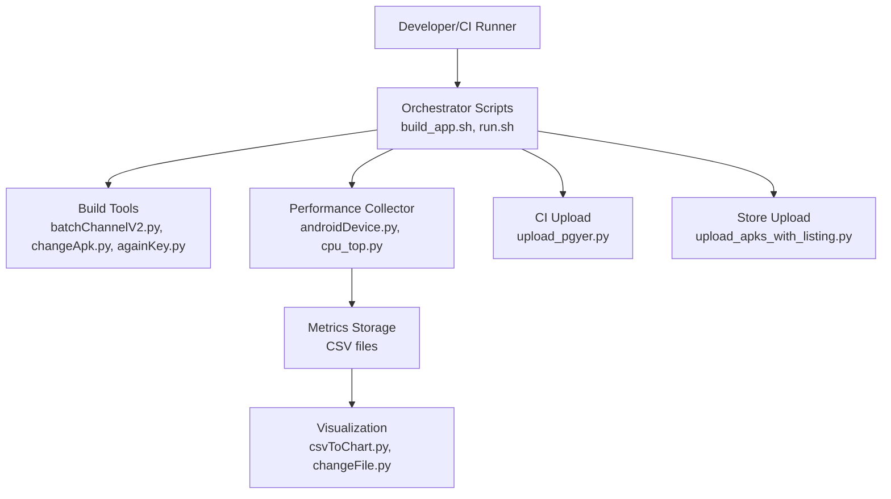
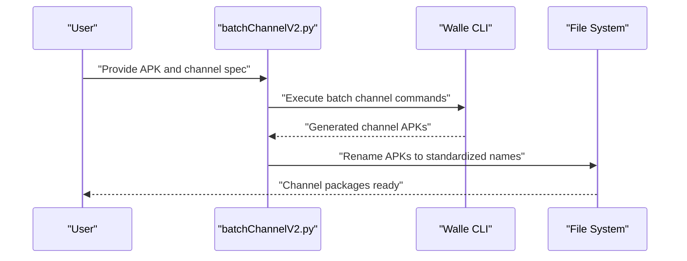
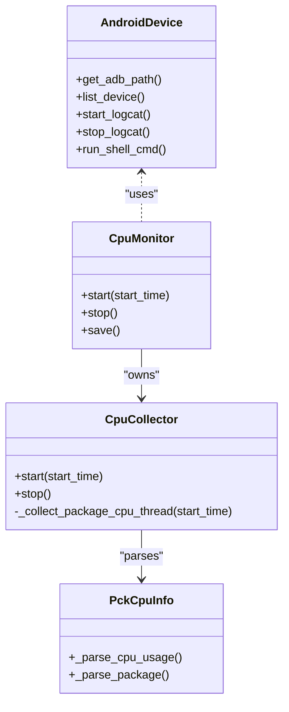
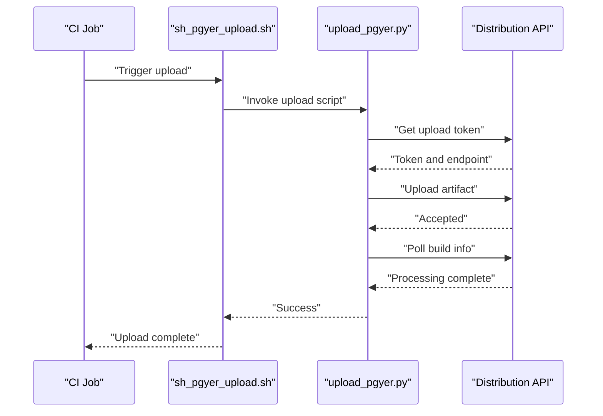
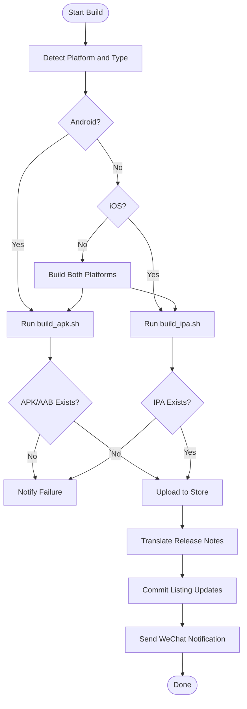
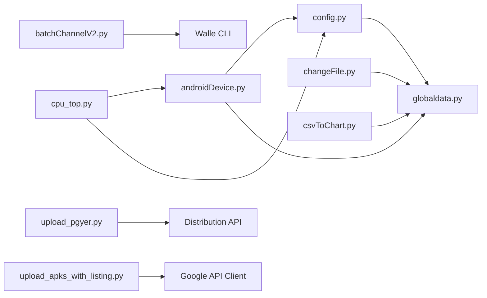

# Project Overview

<cite>
**Referenced Files in This Document**
- [README.md](file://README.md)
- [openBuild.bat](file://appBuild/openBuild.bat)
- [batchChannelV2.py](file://appBuild/DaBao/batchChannelV2.py)
- [againKey.py](file://appBuild/againBuild/againKey.py)
- [changeApk.py](file://appBuild/againBuild/changeApk.py)
- [changeRes.py](file://appBuild/againBuild/changeRes.py)
- [changeImage.py](file://appBuild/DaBao/changeImage.py)
- [getAppInfo.py](file://appBuild/DaBao/getAppInfo.py)
- [upload_pgyer.py](file://ciBuild/utils/upload_pgyer.py)
- [sh_pgyer_upload.sh](file://ciBuild/sh_pgyer_upload.sh)
- [run.sh](file://mobilePerf/run.sh)
- [changeFile.py](file://mobilePerf/tools/changeFile.py)
- [csvToChart.py](file://mobilePerf/tools/csvToChart.py)
- [basemonitor.py](file://mobilePerf/perfCode/common/basemonitor.py)
- [androidDevice.py](file://mobilePerf/perfCode/androidDevice.py)
- [cpu_top.py](file://mobilePerf/perfCode/cpu_top.py)
- [config.py](file://mobilePerf/perfCode/common/config.py)
- [globaldata.py](file://mobilePerf/perfCode/globaldata.py)
- [build_app.sh](file://overseaBuild/build_app.sh)
- [build_apk.sh](file://overseaBuild/build_apk.sh)
- [build_ipa.sh](file://overseaBuild/build_ipa.sh)
- [upload_apks_with_listing.py](file://overseaBuild/upload_gp/upload_apks_with_listing.py)
- [google_translater.py](file://overseaBuild/upload_gp/google_translater.py)
- [wechat_notify.py](file://overseaBuild/wechat_notify.py)
</cite>

## Table of Contents
1. [Introduction](#introduction)
2. [Project Structure](#project-structure)
3. [Core Components](#core-components)
4. [Architecture Overview](#architecture-overview)
5. [Detailed Component Analysis](#detailed-component-analysis)
6. [Dependency Analysis](#dependency-analysis)
7. [Performance Considerations](#performance-considerations)
8. [Troubleshooting Guide](#troubleshooting-guide)
9. [Conclusion](#conclusion)
10. [Appendices](#appendices)

## Introduction
This QA Performance Testing Automation Project is a comprehensive Android application performance testing and build automation toolkit. It integrates APK build and modification utilities, a real-time performance monitoring system for CPU, memory, FPS, and temperature, CI/CD integration for automated uploads, and international distribution capabilities for global markets. The project targets QA engineers, DevOps teams, and product developers who need reliable, repeatable performance validation and streamlined release workflows across Android and iOS platforms.

## Project Structure
The repository is organized by functional domains:
- appBuild: Build and packaging utilities for Android APKs and channels
- ciBuild: CI/CD integration helpers for uploading artifacts
- mobilePerf: Performance monitoring, data collection, and reporting
- overseaBuild: International build and distribution automation for global stores

**Diagram sources**
- [openBuild.bat:1-23](file://appBuild/openBuild.bat#L1-L23)
- [README.md:1-37](file://README.md#L1-L37)

**Section sources**
- [README.md:1-37](file://README.md#L1-L37)
- [openBuild.bat:1-23](file://appBuild/openBuild.bat#L1-L23)

## Core Components
- APK Build and Modification Utilities
  - Channel packaging and batch operations via Walle CLI
  - Re-signing, decompiling, rebuilding, and resource editing
- Performance Monitoring System
  - Real-time metrics collection (CPU, memory, FPS, temperature)
  - Automated data extraction and visualization
- CI/CD Integration
  - Automated artifact upload to distribution platforms
- International Distribution
  - Multi-language metadata translation and store uploads

**Section sources**
- [batchChannelV2.py:1-120](file://appBuild/DaBao/batchChannelV2.py#L1-L120)
- [againKey.py](file://appBuild/againBuild/againKey.py)
- [changeApk.py:1-39](file://appBuild/againBuild/changeApk.py#L1-L39)
- [changeRes.py](file://appBuild/againBuild/changeRes.py)
- [changeImage.py](file://appBuild/DaBao/changeImage.py)
- [getAppInfo.py](file://appBuild/DaBao/getAppInfo.py)
- [upload_pgyer.py:1-108](file://ciBuild/utils/upload_pgyer.py#L1-L108)
- [sh_pgyer_upload.sh](file://ciBuild/sh_pgyer_upload.sh)
- [run.sh:1-29](file://mobilePerf/run.sh#L1-L29)
- [changeFile.py:1-112](file://mobilePerf/tools/changeFile.py#L1-L112)
- [csvToChart.py:1-151](file://mobilePerf/tools/csvToChart.py#L1-L151)
- [basemonitor.py:1-37](file://mobilePerf/perfCode/common/basemonitor.py#L1-L37)
- [androidDevice.py:1-800](file://mobilePerf/perfCode/androidDevice.py#L1-L800)
- [cpu_top.py:1-433](file://mobilePerf/perfCode/cpu_top.py#L1-L433)
- [config.py:1-20](file://mobilePerf/perfCode/common/config.py#L1-L20)
- [globaldata.py:1-14](file://mobilePerf/perfCode/globaldata.py#L1-L14)
- [build_app.sh:1-97](file://overseaBuild/build_app.sh#L1-L97)
- [build_apk.sh](file://overseaBuild/build_apk.sh)
- [build_ipa.sh](file://overseaBuild/build_ipa.sh)
- [upload_apks_with_listing.py:1-198](file://overseaBuild/upload_gp/upload_apks_with_listing.py#L1-L198)
- [google_translater.py](file://overseaBuild/upload_gp/google_translater.py)
- [wechat_notify.py](file://overseaBuild/wechat_notify.py)

## Architecture Overview
The system follows a modular, layered architecture:
- Tooling Layer: Build and packaging scripts/utilities
- Data Collection Layer: Device connectivity, metrics parsing, and storage
- Reporting Layer: Data transformation and visualization
- Integration Layer: CI/CD and distribution APIs
- Orchestration Layer: Shell scripts and batch runners coordinating end-to-end workflows

**Diagram sources**
- [build_app.sh:1-97](file://overseaBuild/build_app.sh#L1-L97)
- [run.sh:1-29](file://mobilePerf/run.sh#L1-L29)
- [batchChannelV2.py:1-120](file://appBuild/DaBao/batchChannelV2.py#L1-L120)
- [changeApk.py:1-39](file://appBuild/againBuild/changeApk.py#L1-L39)
- [againKey.py](file://appBuild/againBuild/againKey.py)
- [androidDevice.py:1-800](file://mobilePerf/perfCode/androidDevice.py#L1-L800)
- [cpu_top.py:1-433](file://mobilePerf/perfCode/cpu_top.py#L1-L433)
- [csvToChart.py:1-151](file://mobilePerf/tools/csvToChart.py#L1-L151)
- [changeFile.py:1-112](file://mobilePerf/tools/changeFile.py#L1-L112)
- [upload_pgyer.py:1-108](file://ciBuild/utils/upload_pgyer.py#L1-L108)
- [upload_apks_with_listing.py:1-198](file://overseaBuild/upload_gp/upload_apks_with_listing.py#L1-L198)

## Detailed Component Analysis

### Build and Packaging Utilities
- Channel Packaging (Walle CLI)
  - Supports single, multiple, and sequential channel generation
  - Automatic APK renaming and batch processing
- APK Modification
  - Re-signing, decompile/rebuild cycles, and resource edits
- Image Processing
  - Batch grayscale conversion for branding or testing scenarios

**Diagram sources**
- [batchChannelV2.py:1-120](file://appBuild/DaBao/batchChannelV2.py#L1-L120)

**Section sources**
- [batchChannelV2.py:1-120](file://appBuild/DaBao/batchChannelV2.py#L1-L120)
- [againKey.py](file://appBuild/againBuild/againKey.py)
- [changeApk.py:1-39](file://appBuild/againBuild/changeApk.py#L1-L39)
- [changeRes.py](file://appBuild/againBuild/changeRes.py)
- [changeImage.py](file://appBuild/DaBao/changeImage.py)
- [getAppInfo.py](file://appBuild/DaBao/getAppInfo.py)

### Performance Monitoring System
- Device Abstraction
  - Cross-platform ADB management, device detection, and logcat streaming
- Metrics Collection
  - CPU usage parsing, memory and temperature extraction, FPS sampling
- Data Pipeline
  - Automated CSV export and chart generation

**Diagram sources**
- [androidDevice.py:1-800](file://mobilePerf/perfCode/androidDevice.py#L1-L800)
- [cpu_top.py:1-433](file://mobilePerf/perfCode/cpu_top.py#L1-L433)

**Section sources**
- [androidDevice.py:1-800](file://mobilePerf/perfCode/androidDevice.py#L1-L800)
- [cpu_top.py:1-433](file://mobilePerf/perfCode/cpu_top.py#L1-L433)
- [basemonitor.py:1-37](file://mobilePerf/perfCode/common/basemonitor.py#L1-L37)
- [config.py:1-20](file://mobilePerf/perfCode/common/config.py#L1-L20)
- [globaldata.py:1-14](file://mobilePerf/perfCode/globaldata.py#L1-L14)

### CI/CD Integration
- Automated Upload to Distribution Platform
  - Token-based upload flow with progress and status polling
- Shell Script Wrapper
  - Simplified invocation for CI environments

**Diagram sources**
- [sh_pgyer_upload.sh](file://ciBuild/sh_pgyer_upload.sh)
- [upload_pgyer.py:1-108](file://ciBuild/utils/upload_pgyer.py#L1-L108)

**Section sources**
- [upload_pgyer.py:1-108](file://ciBuild/utils/upload_pgyer.py#L1-L108)
- [sh_pgyer_upload.sh](file://ciBuild/sh_pgyer_upload.sh)

### International Distribution
- Unified Build Orchestration
  - Android and iOS builds coordinated in a single script
- Store Upload and Metadata Management
  - Automated AAB/APK uploads and multi-language release notes
- Notification Integration
  - WeChat notifications for build status and changelogs

**Diagram sources**
- [build_app.sh:1-97](file://overseaBuild/build_app.sh#L1-L97)
- [build_apk.sh](file://overseaBuild/build_apk.sh)
- [build_ipa.sh](file://overseaBuild/build_ipa.sh)
- [upload_apks_with_listing.py:1-198](file://overseaBuild/upload_gp/upload_apks_with_listing.py#L1-L198)
- [google_translater.py](file://overseaBuild/upload_gp/google_translater.py)
- [wechat_notify.py](file://overseaBuild/wechat_notify.py)

**Section sources**
- [build_app.sh:1-97](file://overseaBuild/build_app.sh#L1-L97)
- [upload_apks_with_listing.py:1-198](file://overseaBuild/upload_gp/upload_apks_with_listing.py#L1-L198)
- [google_translater.py](file://overseaBuild/upload_gp/google_translater.py)
- [wechat_notify.py](file://overseaBuild/wechat_notify.py)

## Dependency Analysis
- Internal Dependencies
  - mobilePerf tools depend on common modules (config, utils, log) and runtime data
  - Oversea build scripts coordinate with store upload utilities
- External Dependencies
  - ADB and platform tools for device operations
  - Python libraries for HTTP uploads and visualization
  - Store APIs for distribution

**Diagram sources**
- [config.py:1-20](file://mobilePerf/perfCode/common/config.py#L1-L20)
- [globaldata.py:1-14](file://mobilePerf/perfCode/globaldata.py#L1-L14)
- [androidDevice.py:1-800](file://mobilePerf/perfCode/androidDevice.py#L1-L800)
- [changeFile.py:1-112](file://mobilePerf/tools/changeFile.py#L1-L112)
- [csvToChart.py:1-151](file://mobilePerf/tools/csvToChart.py#L1-L151)
- [cpu_top.py:1-433](file://mobilePerf/perfCode/cpu_top.py#L1-L433)
- [batchChannelV2.py:1-120](file://appBuild/DaBao/batchChannelV2.py#L1-L120)
- [upload_pgyer.py:1-108](file://ciBuild/utils/upload_pgyer.py#L1-L108)
- [upload_apks_with_listing.py:1-198](file://overseaBuild/upload_gp/upload_apks_with_listing.py#L1-L198)

**Section sources**
- [config.py:1-20](file://mobilePerf/perfCode/common/config.py#L1-L20)
- [globaldata.py:1-14](file://mobilePerf/perfCode/globaldata.py#L1-L14)
- [androidDevice.py:1-800](file://mobilePerf/perfCode/androidDevice.py#L1-L800)
- [cpu_top.py:1-433](file://mobilePerf/perfCode/cpu_top.py#L1-L433)
- [batchChannelV2.py:1-120](file://appBuild/DaBao/batchChannelV2.py#L1-L120)
- [upload_pgyer.py:1-108](file://ciBuild/utils/upload_pgyer.py#L1-L108)
- [upload_apks_with_listing.py:1-198](file://overseaBuild/upload_gp/upload_apks_with_listing.py#L1-L198)

## Performance Considerations
- Data Sampling and Interval Tuning
  - Adjust collection intervals and timeouts to balance accuracy and overhead
- Device Compatibility
  - Account for differences in ADB behavior across OS versions and device models
- Visualization Efficiency
  - Downsample and filter extreme values to improve chart readability and reduce noise
- Network and API Limits
  - Implement retries and backoff for upload operations to distribution APIs

## Troubleshooting Guide
- ADB Connectivity Issues
  - Verify device connection and resolve port conflicts; scripts include recovery steps
- Missing Tools or Paths
  - Ensure ADB and platform tools are discoverable; scripts auto-detect and adapt
- Upload Failures
  - Confirm API keys and network connectivity; check token acquisition and polling logic
- Store Listing Updates
  - Validate service account credentials and language coverage for release notes

**Section sources**
- [androidDevice.py:1-800](file://mobilePerf/perfCode/androidDevice.py#L1-L800)
- [upload_pgyer.py:1-108](file://ciBuild/utils/upload_pgyer.py#L1-L108)
- [upload_apks_with_listing.py:1-198](file://overseaBuild/upload_gp/upload_apks_with_listing.py#L1-L198)

## Conclusion
This project delivers a robust, extensible framework for Android performance testing and build automation, with integrated CI/CD and international distribution. Its modular design enables teams to streamline quality assurance workflows, maintain consistent performance baselines, and accelerate global releases.

## Appendices

### Target Audience and Use Cases
- QA Engineers: Automate performance regression testing and reporting
- DevOps Engineers: Integrate builds and uploads into CI/CD pipelines
- Product Developers: Validate performance across devices and regions

### System Requirements
- Operating Systems: Windows/macOS/Linux
- Tools: ADB, Java (for APKTool/Walle), Python 3.x, platform-specific SDKs
- Optional: Store developer accounts and service credentials

### Executive Summary for Stakeholders
This toolkit centralizes Android performance monitoring, build customization, and global distribution into cohesive workflows. It reduces manual effort, improves consistency, and accelerates time-to-market for both domestic and international releases.