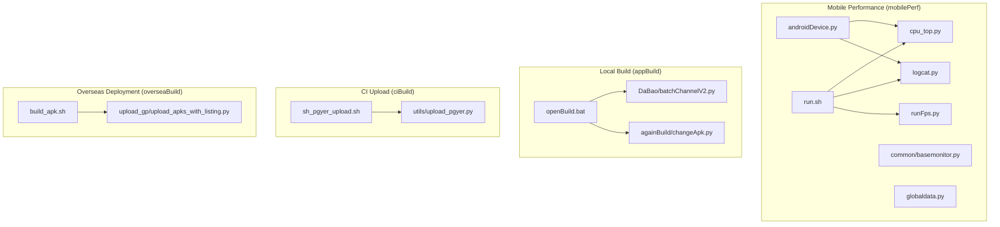
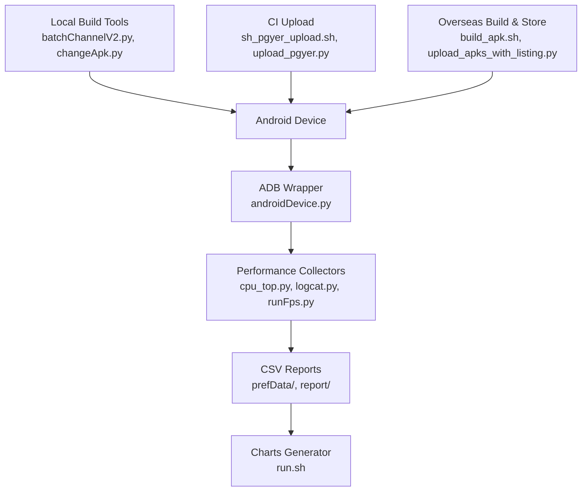
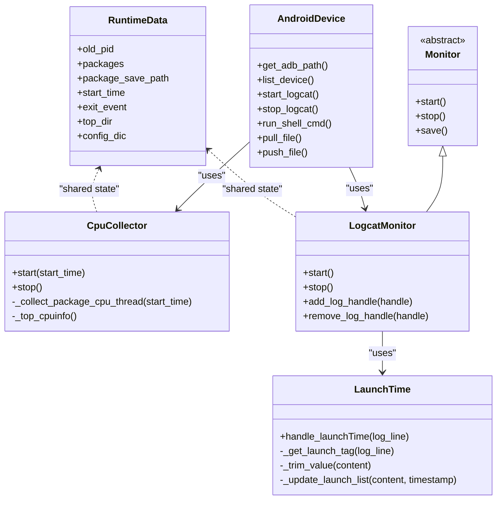
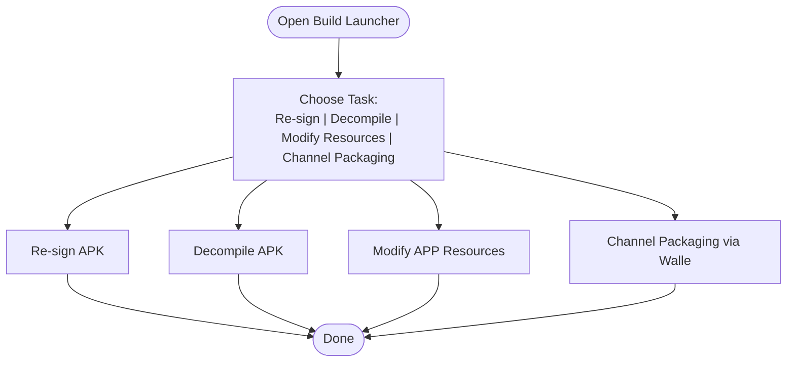
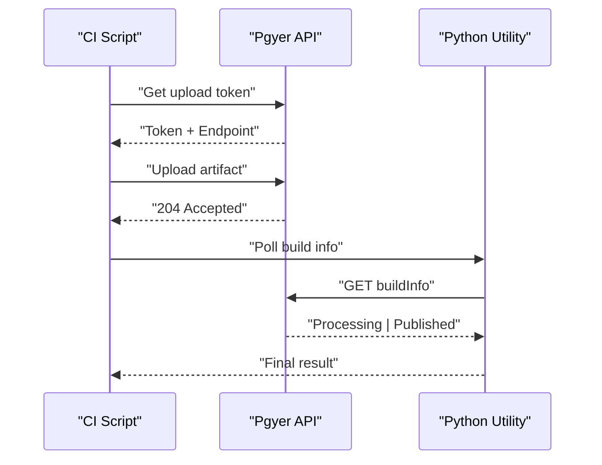
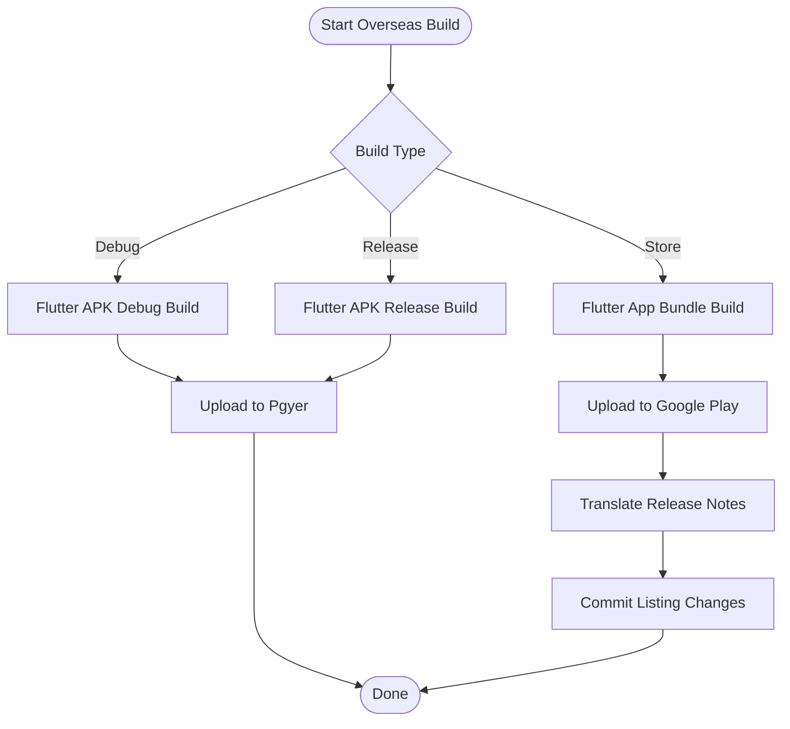
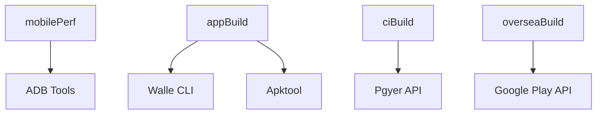

# Project Overview

<cite>
**Referenced Files in This Document**
- [README.md](file://README.md)
- [mobilePerf/run.sh](file://mobilePerf/run.sh)
- [mobilePerf/perfCode/androidDevice.py](file://mobilePerf/perfCode/androidDevice.py)
- [mobilePerf/perfCode/cpu_top.py](file://mobilePerf/perfCode/cpu_top.py)
- [mobilePerf/perfCode/logcat.py](file://mobilePerf/perfCode/logcat.py)
- [mobilePerf/perfCode/runFps.py](file://mobilePerf/perfCode/runFps.py)
- [mobilePerf/perfCode/common/basemonitor.py](file://mobilePerf/perfCode/common/basemonitor.py)
- [mobilePerf/perfCode/globaldata.py](file://mobilePerf/perfCode/globaldata.py)
- [appBuild/openBuild.bat](file://appBuild/openBuild.bat)
- [appBuild/DaBao/batchChannelV2.py](file://appBuild/DaBao/batchChannelV2.py)
- [appBuild/againBuild/changeApk.py](file://appBuild/againBuild/changeApk.py)
- [ciBuild/sh_pgyer_upload.sh](file://ciBuild/sh_pgyer_upload.sh)
- [ciBuild/utils/upload_pgyer.py](file://ciBuild/utils/upload_pgyer.py)
- [overseaBuild/build_apk.sh](file://overseaBuild/build_apk.sh)
- [overseaBuild/upload_gp/upload_apks_with_listing.py](file://overseaBuild/upload_gp/upload_apks_with_listing.py)
</cite>

## Table of Contents
1. [Introduction](#introduction)
2. [Project Structure](#project-structure)
3. [Core Components](#core-components)
4. [Architecture Overview](#architecture-overview)
5. [Detailed Component Analysis](#detailed-component-analysis)
6. [Dependency Analysis](#dependency-analysis)
7. [Performance Considerations](#performance-considerations)
8. [Troubleshooting Guide](#troubleshooting-guide)
9. [Conclusion](#conclusion)

## Introduction
QA Performance Code is a mobile application testing and automation framework designed to streamline performance monitoring, build automation, and CI/CD integration for QA teams and developers. It focuses on collecting Android performance metrics (CPU, memory, FPS, temperature), automating APK builds and packaging, and enabling international deployment via automated stores and distribution platforms. The project integrates with the SoloPi framework for Android performance data collection and provides modular tooling for local development, continuous integration, and overseas distribution.

## Project Structure
The repository is organized into four primary modules:
- mobilePerf: Android performance data collection, log parsing, and reporting pipeline
- appBuild: Local build and packaging utilities for Android (APK signing, resource modification, channel packaging)
- ciBuild: Continuous integration utilities for uploading artifacts to distribution platforms
- overseaBuild: International build and deployment automation for Android app bundles and store listings

**Diagram sources**
- [mobilePerf/run.sh:1-11](file://mobilePerf/run.sh#L1-L11)
- [mobilePerf/perfCode/androidDevice.py:1-120](file://mobilePerf/perfCode/androidDevice.py#L1-L120)
- [mobilePerf/perfCode/cpu_top.py:206-383](file://mobilePerf/perfCode/cpu_top.py#L206-L383)
- [mobilePerf/perfCode/logcat.py:17-70](file://mobilePerf/perfCode/logcat.py#L17-L70)
- [mobilePerf/perfCode/runFps.py:54-94](file://mobilePerf/perfCode/runFps.py#L54-L94)
- [mobilePerf/perfCode/common/basemonitor.py:7-37](file://mobilePerf/perfCode/common/basemonitor.py#L7-L37)
- [mobilePerf/perfCode/globaldata.py:5-14](file://mobilePerf/perfCode/globaldata.py#L5-L14)
- [appBuild/openBuild.bat:1-14](file://appBuild/openBuild.bat#L1-L14)
- [appBuild/DaBao/batchChannelV2.py:23-78](file://appBuild/DaBao/batchChannelV2.py#L23-L78)
- [appBuild/againBuild/changeApk.py:5-36](file://appBuild/againBuild/changeApk.py#L5-L36)
- [ciBuild/sh_pgyer_upload.sh:1-103](file://ciBuild/sh_pgyer_upload.sh#L1-L103)
- [ciBuild/utils/upload_pgyer.py:11-85](file://ciBuild/utils/upload_pgyer.py#L11-L85)
- [overseaBuild/build_apk.sh:1-60](file://overseaBuild/build_apk.sh#L1-L60)
- [overseaBuild/upload_gp/upload_apks_with_listing.py:93-197](file://overseaBuild/upload_gp/upload_apks_with_listing.py#L93-L197)

**Section sources**
- [README.md:1-37](file://README.md#L1-L37)
- [mobilePerf/run.sh:1-11](file://mobilePerf/run.sh#L1-L11)
- [appBuild/openBuild.bat:1-14](file://appBuild/openBuild.bat#L1-L14)

## Core Components
- mobilePerf: Provides Android device connectivity, performance metrics collection (CPU, FPS, memory, temperature), and log parsing. It leverages SoloPi for performance data acquisition and generates CSV reports and charts for analysis.
- appBuild: Offers local build and packaging utilities for Android, including APK re-signing, resource modification, and channel packaging via Walle.
- ciBuild: Automates artifact uploads to distribution platforms (e.g., Pgyer) using shell scripts and Python utilities.
- overseaBuild: Handles international builds and deployments, including Flutter-based APK/AAB generation and Google Play listing updates.

Key features:
- Android performance data collection (CPU, memory, FPS, temperature)
- APK building and packaging (signing, resource changes, channel packaging)
- CI/CD integration for automated uploads
- International deployment capabilities (Android app bundles and store listings)

**Section sources**
- [README.md:24-35](file://README.md#L24-L35)
- [mobilePerf/perfCode/androidDevice.py:18-120](file://mobilePerf/perfCode/androidDevice.py#L18-L120)
- [mobilePerf/perfCode/cpu_top.py:206-383](file://mobilePerf/perfCode/cpu_top.py#L206-L383)
- [mobilePerf/perfCode/logcat.py:17-70](file://mobilePerf/perfCode/logcat.py#L17-L70)
- [mobilePerf/perfCode/runFps.py:54-94](file://mobilePerf/perfCode/runFps.py#L54-L94)
- [appBuild/DaBao/batchChannelV2.py:23-78](file://appBuild/DaBao/batchChannelV2.py#L23-L78)
- [appBuild/againBuild/changeApk.py:5-36](file://appBuild/againBuild/changeApk.py#L5-L36)
- [ciBuild/sh_pgyer_upload.sh:1-103](file://ciBuild/sh_pgyer_upload.sh#L1-L103)
- [ciBuild/utils/upload_pgyer.py:43-108](file://ciBuild/utils/upload_pgyer.py#L43-L108)
- [overseaBuild/build_apk.sh:1-60](file://overseaBuild/build_apk.sh#L1-L60)
- [overseaBuild/upload_gp/upload_apks_with_listing.py:93-197](file://overseaBuild/upload_gp/upload_apks_with_listing.py#L93-L197)

## Architecture Overview
The system architecture centers around three pillars:
- Device Interaction Layer: Android device connectivity and shell commands
- Performance Monitoring Pipeline: Metrics collection, storage, and visualization
- Build and Distribution Pipeline: Local builds, CI uploads, and international deployments

**Diagram sources**
- [mobilePerf/perfCode/androidDevice.py:18-120](file://mobilePerf/perfCode/androidDevice.py#L18-L120)
- [mobilePerf/perfCode/cpu_top.py:206-383](file://mobilePerf/perfCode/cpu_top.py#L206-L383)
- [mobilePerf/perfCode/logcat.py:17-70](file://mobilePerf/perfCode/logcat.py#L17-L70)
- [mobilePerf/perfCode/runFps.py:54-94](file://mobilePerf/perfCode/runFps.py#L54-L94)
- [mobilePerf/run.sh:1-11](file://mobilePerf/run.sh#L1-L11)
- [appBuild/DaBao/batchChannelV2.py:23-78](file://appBuild/DaBao/batchChannelV2.py#L23-L78)
- [appBuild/againBuild/changeApk.py:5-36](file://appBuild/againBuild/changeApk.py#L5-L36)
- [ciBuild/sh_pgyer_upload.sh:1-103](file://ciBuild/sh_pgyer_upload.sh#L1-L103)
- [ciBuild/utils/upload_pgyer.py:43-108](file://ciBuild/utils/upload_pgyer.py#L43-L108)
- [overseaBuild/build_apk.sh:1-60](file://overseaBuild/build_apk.sh#L1-L60)
- [overseaBuild/upload_gp/upload_apks_with_listing.py:93-197](file://overseaBuild/upload_gp/upload_apks_with_listing.py#L93-L197)

## Detailed Component Analysis

### Mobile Performance Module (mobilePerf)
The mobilePerf module orchestrates Android performance monitoring:
- ADB wrapper manages device connectivity, shell commands, logcat capture, and file operations
- CPU collector parses top output to compute device and per-package CPU usage
- Logcat monitor captures and parses launch-time metrics and exceptions
- FPS generator performs gesture-driven animations to measure frame performance
- Run script coordinates CSV-to-chart conversion for CPU, FPS, memory, and temperature

**Diagram sources**
- [mobilePerf/perfCode/androidDevice.py:18-120](file://mobilePerf/perfCode/androidDevice.py#L18-L120)
- [mobilePerf/perfCode/cpu_top.py:206-383](file://mobilePerf/perfCode/cpu_top.py#L206-L383)
- [mobilePerf/perfCode/logcat.py:17-70](file://mobilePerf/perfCode/logcat.py#L17-L70)
- [mobilePerf/perfCode/common/basemonitor.py:7-37](file://mobilePerf/perfCode/common/basemonitor.py#L7-L37)
- [mobilePerf/perfCode/globaldata.py:5-14](file://mobilePerf/perfCode/globaldata.py#L5-L14)

**Section sources**
- [mobilePerf/perfCode/androidDevice.py:18-120](file://mobilePerf/perfCode/androidDevice.py#L18-L120)
- [mobilePerf/perfCode/cpu_top.py:206-383](file://mobilePerf/perfCode/cpu_top.py#L206-L383)
- [mobilePerf/perfCode/logcat.py:17-70](file://mobilePerf/perfCode/logcat.py#L17-L70)
- [mobilePerf/perfCode/runFps.py:54-94](file://mobilePerf/perfCode/runFps.py#L54-L94)
- [mobilePerf/perfCode/common/basemonitor.py:7-37](file://mobilePerf/perfCode/common/basemonitor.py#L7-L37)
- [mobilePerf/perfCode/globaldata.py:5-14](file://mobilePerf/perfCode/globaldata.py#L5-L14)
- [mobilePerf/run.sh:1-11](file://mobilePerf/run.sh#L1-L11)

### Local Build Module (appBuild)
The appBuild module provides local build and packaging utilities:
- Open build launcher displays available tasks for re-signing, decompiling, modifying resources, and channel packaging
- Channel packaging via Walle supports single-channel, batch-channel, and sequence-based channel generation
- APK decompile/recompile utilities enable quick resource edits and repackaging

**Diagram sources**
- [appBuild/openBuild.bat:1-14](file://appBuild/openBuild.bat#L1-L14)
- [appBuild/DaBao/batchChannelV2.py:23-78](file://appBuild/DaBao/batchChannelV2.py#L23-L78)
- [appBuild/againBuild/changeApk.py:5-36](file://appBuild/againBuild/changeApk.py#L5-L36)

**Section sources**
- [appBuild/openBuild.bat:1-14](file://appBuild/openBuild.bat#L1-L14)
- [appBuild/DaBao/batchChannelV2.py:23-78](file://appBuild/DaBao/batchChannelV2.py#L23-L78)
- [appBuild/againBuild/changeApk.py:5-36](file://appBuild/againBuild/changeApk.py#L5-L36)

### CI Upload Module (ciBuild)
The ciBuild module automates artifact uploads to distribution platforms:
- Shell script uploads APK/iPad to Pgyer using API tokens and progress checks
- Python utility encapsulates token retrieval, upload, and build info polling

**Diagram sources**
- [ciBuild/sh_pgyer_upload.sh:54-103](file://ciBuild/sh_pgyer_upload.sh#L54-L103)
- [ciBuild/utils/upload_pgyer.py:43-108](file://ciBuild/utils/upload_pgyer.py#L43-L108)

**Section sources**
- [ciBuild/sh_pgyer_upload.sh:1-103](file://ciBuild/sh_pgyer_upload.sh#L1-L103)
- [ciBuild/utils/upload_pgyer.py:11-108](file://ciBuild/utils/upload_pgyer.py#L11-L108)

### Overseas Build Module (overseaBuild)
The overseaBuild module handles international builds and store deployments:
- Flutter-based APK/AAB generation with flavor-specific configurations and Dart defines
- Automated Google Play uploads with listing updates and release notes translation

**Diagram sources**
- [overseaBuild/build_apk.sh:1-60](file://overseaBuild/build_apk.sh#L1-L60)
- [overseaBuild/upload_gp/upload_apks_with_listing.py:93-197](file://overseaBuild/upload_gp/upload_apks_with_listing.py#L93-L197)

**Section sources**
- [overseaBuild/build_apk.sh:1-60](file://overseaBuild/build_apk.sh#L1-L60)
- [overseaBuild/upload_gp/upload_apks_with_listing.py:93-197](file://overseaBuild/upload_gp/upload_apks_with_listing.py#L93-L197)

## Dependency Analysis
- mobilePerf depends on Android SDK tools (ADB) and SoloPi for performance data collection
- appBuild relies on external tools (Walle, Apktool) for channel packaging and APK manipulation
- ciBuild integrates with Pgyer APIs for artifact distribution
- overseaBuild integrates with Google Play Developer API for international deployments

**Diagram sources**
- [mobilePerf/perfCode/androidDevice.py:18-120](file://mobilePerf/perfCode/androidDevice.py#L18-L120)
- [appBuild/DaBao/batchChannelV2.py:23-78](file://appBuild/DaBao/batchChannelV2.py#L23-L78)
- [appBuild/againBuild/changeApk.py:5-36](file://appBuild/againBuild/changeApk.py#L5-L36)
- [ciBuild/sh_pgyer_upload.sh:1-103](file://ciBuild/sh_pgyer_upload.sh#L1-L103)
- [overseaBuild/upload_gp/upload_apks_with_listing.py:93-197](file://overseaBuild/upload_gp/upload_apks_with_listing.py#L93-L197)

**Section sources**
- [README.md:24-35](file://README.md#L24-L35)
- [mobilePerf/perfCode/androidDevice.py:18-120](file://mobilePerf/perfCode/androidDevice.py#L18-L120)
- [appBuild/DaBao/batchChannelV2.py:23-78](file://appBuild/DaBao/batchChannelV2.py#L23-L78)
- [ciBuild/sh_pgyer_upload.sh:1-103](file://ciBuild/sh_pgyer_upload.sh#L1-L103)
- [overseaBuild/upload_gp/upload_apks_with_listing.py:93-197](file://overseaBuild/upload_gp/upload_apks_with_listing.py#L93-L197)

## Performance Considerations
- Data sampling intervals and timeouts are configurable in collectors to balance accuracy and overhead
- CSV file rotation and cleanup prevent excessive disk usage during long-running tests
- Chart generation is decoupled from data collection to avoid blocking performance measurements
- Device connectivity robustness includes retries and port conflict resolution for ADB

[No sources needed since this section provides general guidance]

## Troubleshooting Guide
Common issues and resolutions:
- ADB connectivity problems: Verify device connection, kill/start ADB server, resolve port conflicts
- Missing external tools: Ensure Walle, Apktool, and Flutter are installed and accessible
- Upload failures: Validate API keys, network connectivity, and file formats for distribution platforms
- International deployment errors: Confirm service account credentials and release note translations

**Section sources**
- [mobilePerf/perfCode/androidDevice.py:112-176](file://mobilePerf/perfCode/androidDevice.py#L112-L176)
- [ciBuild/sh_pgyer_upload.sh:19-32](file://ciBuild/sh_pgyer_upload.sh#L19-L32)
- [ciBuild/utils/upload_pgyer.py:11-41](file://ciBuild/utils/upload_pgyer.py#L11-L41)
- [overseaBuild/upload_gp/upload_apks_with_listing.py:93-146](file://overseaBuild/upload_gp/upload_apks_with_listing.py#L93-L146)

## Conclusion
QA Performance Code delivers a comprehensive solution for mobile performance testing, build automation, and CI/CD integration. Its modular design enables QA teams and developers to collect Android performance metrics, automate APK builds and packaging, and deploy internationally with minimal friction. By integrating with SoloPi, Pgyer, and Google Play APIs, the project accelerates quality assurance workflows and ensures consistent, repeatable results across environments.