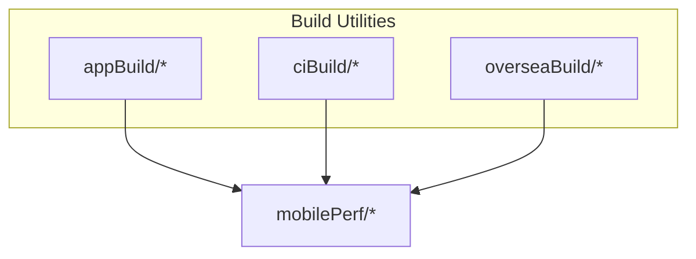
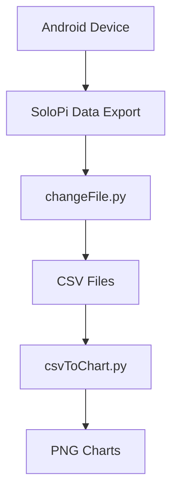
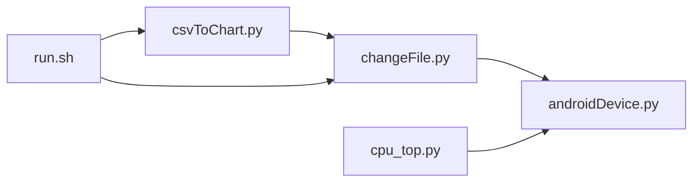

# Troubleshooting and Maintenance

<cite>
**Referenced Files in This Document**
- [README.md](file://README.md)
- [openBuild.bat](file://appBuild/openBuild.bat)
- [batchChannelV2.py](file://appBuild/DaBao/batchChannelV2.py)
- [changeChannelList.py](file://appBuild/DaBao/changeChannelList.py)
- [getAppInfo.py](file://appBuild/DaBao/getAppInfo.py)
- [changeApk.py](file://appBuild/againBuild/changeApk.py)
- [againKey.py](file://appBuild/againBuild/againKey.py)
- [changeRes.py](file://appBuild/againBuild/changeRes.py)
- [changeImage.py](file://appBuild/changeImage.py)
- [sh_pgyer_upload.sh](file://ciBuild/sh_pgyer_upload.sh)
- [upload_pgyer.py](file://ciBuild/utils/upload_pgyer.py)
- [build_app.sh](file://overseaBuild/build_app.sh)
- [build_apk.sh](file://overseaBuild/build_apk.sh)
- [build_ipa.sh](file://overseaBuild/build_ipa.sh)
- [ios_uploader.sh](file://overseaBuild/ios_uploader.sh)
- [upload_apks_with_listing.py](file://overseaBuild/upload_gp/upload_apks_with_listing.py)
- [run.sh](file://mobilePerf/run.sh)
- [changeFile.py](file://mobilePerf/tools/changeFile.py)
- [csvToChart.py](file://mobilePerf/tools/csvToChart.py)
- [androidDevice.py](file://mobilePerf/perfCode/androidDevice.py)
- [cpu_top.py](file://mobilePerf/perfCode/cpu_top.py)
- [runFps.py](file://mobilePerf/perfCode/runFps.py)
- [basemonitor.py](file://mobilePerf/perfCode/common/basemonitor.py)
- [config.py](file://mobilePerf/perfCode/common/config.py)
</cite>

## Table of Contents
1. [Introduction](#introduction)
2. [Project Structure](#project-structure)
3. [Core Components](#core-components)
4. [Architecture Overview](#architecture-overview)
5. [Detailed Component Analysis](#detailed-component-analysis)
6. [Dependency Analysis](#dependency-analysis)
7. [Performance Considerations](#performance-considerations)
8. [Troubleshooting Guide](#troubleshooting-guide)
9. [Maintenance Procedures](#maintenance-procedures)
10. [Scalability and Health Monitoring](#scalability-and-health-monitoring)
11. [Migration and Compatibility](#migration-and-compatibility)
12. [Conclusion](#conclusion)

## Introduction
This document provides comprehensive troubleshooting and maintenance guidance for the performance and build automation systems. It covers:
- Build process failures and remedies
- Performance monitoring issues and optimization
- API integration problems and workarounds
- Platform-specific challenges
- Dependency and configuration maintenance
- Debugging strategies and monitoring approaches
- Migration and compatibility considerations
- Scalability planning and system health monitoring

## Project Structure
The repository is organized into four primary areas:
- appBuild: Android/iOS packaging and channel/resource modification utilities
- ciBuild: Continuous integration upload helpers (local and cloud)
- overseaBuild: Overseas build orchestration and store uploads
- mobilePerf: Performance data collection, parsing, and visualization

**Section sources**
- [README.md:1-37](file://README.md#L1-L37)

## Core Components
- Build and Packaging Tools
  - Channel packaging and app metadata inspection
  - APK/AAB re-signing and resource replacement
  - Batch resource image processing
- CI Upload Utilities
  - Local upload to Pgyer via shell and Python
- Overseas Build Orchestration
  - Multi-platform builds and store uploads
  - Automated notifications and change logs
- Performance Monitoring Pipeline
  - SoloPi data pull, CSV generation, and chart creation
  - ADB device management and CPU/FPS sampling
  - Logging and diagnostics

**Section sources**
- [README.md:3-36](file://README.md#L3-L36)
- [openBuild.bat:1-23](file://appBuild/openBuild.bat#L1-L23)
- [run.sh:1-29](file://mobilePerf/run.sh#L1-L29)

## Architecture Overview
The system integrates device-side performance data collection with automated reporting and build/upload workflows.

**Diagram sources**
- [changeFile.py:1-112](file://mobilePerf/tools/changeFile.py#L1-L112)
- [csvToChart.py:1-151](file://mobilePerf/tools/csvToChart.py#L1-L151)

**Section sources**
- [run.sh:1-29](file://mobilePerf/run.sh#L1-L29)
- [README.md:24-30](file://README.md#L24-L30)

## Detailed Component Analysis

### Build Utilities (appBuild)
- Channel packaging and app info
  - batchChannelV2.py: single-channel packaging
  - changeChannelList.py: batch channel generation
  - getAppInfo.py: extract package name and version
- APK processing
  - changeApk.py: decompile/rebuild APK using Apktool
  - againKey.py: re-sign APK
  - changeRes.py: modify resources directly
- Image processing
  - changeImage.py: batch grayscale images

Common issues and resolutions:
- Missing Apktool binary or Java runtime
  - Symptom: command failures during decompile/build
  - Resolution: ensure Java is installed and APKTOOL path is correct
- Device or ADB connectivity errors
  - Symptom: “no devices/emulators found” or port conflicts
  - Resolution: restart ADB server, kill occupying processes on port 5037, reconnect device

**Section sources**
- [openBuild.bat:8-18](file://appBuild/openBuild.bat#L8-L18)
- [batchChannelV2.py:1-200](file://appBuild/DaBao/batchChannelV2.py#L1-L200)
- [changeChannelList.py:1-200](file://appBuild/DaBao/changeChannelList.py#L1-L200)
- [getAppInfo.py:1-200](file://appBuild/DaBao/getAppInfo.py#L1-L200)
- [changeApk.py:7-34](file://appBuild/againBuild/changeApk.py#L7-L34)
- [againKey.py:1-200](file://appBuild/againBuild/againKey.py#L1-L200)
- [changeRes.py:1-200](file://appBuild/againBuild/changeRes.py#L1-L200)
- [changeImage.py:1-200](file://appBuild/changeImage.py#L1-L200)

### CI Upload Utilities (ciBuild)
- Shell-based upload to Pgyer
  - sh_pgyer_upload.sh: fetch upload token, upload artifact, poll build status
- Python-based upload to Pgyer
  - upload_pgyer.py: token retrieval, chunked upload, polling build info

Common issues and resolutions:
- Unsupported file extension
  - Symptom: “file ext is not supported”
  - Resolution: ensure .apk or .ipa path is passed
- Upload failure or invalid response
  - Symptom: non-204 HTTP response
  - Resolution: verify API key, network connectivity, and file accessibility
- Build info polling timeouts
  - Symptom: repeated checks without completion
  - Resolution: confirm backend status and retry conditions

**Section sources**
- [sh_pgyer_upload.sh:15-32](file://ciBuild/sh_pgyer_upload.sh#L15-L32)
- [sh_pgyer_upload.sh:54-86](file://ciBuild/sh_pgyer_upload.sh#L54-L86)
- [upload_pgyer.py:11-41](file://ciBuild/utils/upload_pgyer.py#L11-L41)
- [upload_pgyer.py:43-85](file://ciBuild/utils/upload_pgyer.py#L43-L85)

### Overseas Build Orchestration (overseaBuild)
- Orchestrator script
  - build_app.sh: multi-platform build, notifications, change logs, commit tracking
- Platform-specific builders
  - build_apk.sh, build_ipa.sh
- Store upload
  - upload_apks_with_listing.py: Google Play upload and listing updates
  - ios_uploader.sh: iOS distribution workflow
- Auxiliary
  - git_utils.sh, locale_package.sh, wechat_notify.py

Common issues and resolutions:
- Missing artifacts after build
  - Symptom: missing .apk/.aab/.ipa
  - Resolution: verify build scripts, Gradle/Maven tasks, and output paths
- Notification failures
  - Symptom: no WeCom message sent
  - Resolution: check credentials and network access
- Google Play upload errors
  - Symptom: API authorization or media upload issues
  - Resolution: validate service account JSON, scopes, and file types

**Section sources**
- [build_app.sh:35-97](file://overseaBuild/build_app.sh#L35-L97)
- [upload_apks_with_listing.py:93-197](file://overseaBuild/upload_gp/upload_apks_with_listing.py#L93-L197)

### Performance Monitoring Pipeline (mobilePerf)
- Data collection and visualization
  - run.sh: orchestrates SoloPi data pull and chart generation
  - changeFile.py: pulls latest SoloPi records and organizes CSVs
  - csvToChart.py: generates PNG charts per metric
- Device and metrics
  - androidDevice.py: ADB device management, logcat, push/pull, activity detection
  - cpu_top.py: CPU sampling via top, CSV export, charting
  - runFps.py: FPS simulation via touch gestures

Common issues and resolutions:
- ADB connectivity and port conflicts
  - Symptom: “daemon not running”, “5037 port occupied”
  - Resolution: kill adb server, resolve conflicting processes, restart adb
- Device selection ambiguity
  - Symptom: “more than one device”
  - Resolution: specify device serial or disconnect extras
- Logcat and CSV generation
  - Symptom: empty charts or missing data
  - Resolution: verify SoloPi export path, CSV encoding, and file presence

**Section sources**
- [run.sh:1-29](file://mobilePerf/run.sh#L1-L29)
- [changeFile.py:37-48](file://mobilePerf/tools/changeFile.py#L37-L48)
- [changeFile.py:51-67](file://mobilePerf/tools/changeFile.py#L51-L67)
- [csvToChart.py:28-31](file://mobilePerf/tools/csvToChart.py#L28-L31)
- [androidDevice.py:122-138](file://mobilePerf/perfCode/androidDevice.py#L122-L138)
- [androidDevice.py:152-173](file://mobilePerf/perfCode/androidDevice.py#L152-L173)
- [cpu_top.py:228-232](file://mobilePerf/perfCode/cpu_top.py#L228-L232)

## Dependency Analysis
- Internal dependencies
  - mobilePerf tools depend on androidDevice for device operations
  - CPU collector depends on configuration and utilities
- External dependencies
  - ADB, SoloPi, Apktool, Python packages (requests, google-api-python-client, oauth2client)
  - Store APIs (Google Play, Pgyer)

**Diagram sources**
- [changeFile.py:1-112](file://mobilePerf/tools/changeFile.py#L1-L112)
- [csvToChart.py:1-151](file://mobilePerf/tools/csvToChart.py#L1-L151)
- [androidDevice.py:1-1177](file://mobilePerf/perfCode/androidDevice.py#L1-L1177)
- [cpu_top.py:1-433](file://mobilePerf/perfCode/cpu_top.py#L1-L433)
- [run.sh:1-29](file://mobilePerf/run.sh#L1-L29)

**Section sources**
- [README.md:24-30](file://README.md#L24-L30)
- [upload_pgyer.py:19-33](file://ciBuild/utils/upload_pgyer.py#L19-L33)
- [upload_apks_with_listing.py:19-44](file://overseaBuild/upload_gp/upload_apks_with_listing.py#L19-L44)

## Performance Considerations
- Memory usage
  - Limit logcat buffer growth by rotating files and capping sizes
  - Clean temporary SoloPi folders post-processing
- Processing speed
  - Reduce CSV sampling frequency and downsample data before plotting
  - Use asynchronous ADB commands where safe to avoid blocking
- Resource management
  - Monitor device storage usage and clean old artifacts
  - Kill stale ADB processes to prevent port contention

[No sources needed since this section provides general guidance]

## Troubleshooting Guide

### Build Failures
- Symptoms
  - Missing output artifacts (.apk/.aab/.ipa)
  - Script exits early with error messages
- Diagnoses
  - Verify build script parameters and environment variables
  - Confirm SDK/NDK/toolchain availability
- Actions
  - Re-run with verbose logging
  - Check artifact existence and permissions

**Section sources**
- [build_app.sh:40-52](file://overseaBuild/build_app.sh#L40-L52)
- [build_app.sh:53-59](file://overseaBuild/build_app.sh#L53-L59)

### CI Upload Issues
- Symptoms
  - Unsupported file type or upload failures
  - Polling does not resolve build status
- Diagnoses
  - Validate file path and extension
  - Inspect API key and network connectivity
- Actions
  - Retry upload with corrected parameters
  - Increase polling intervals and timeouts

**Section sources**
- [sh_pgyer_upload.sh:26-32](file://ciBuild/sh_pgyer_upload.sh#L26-L32)
- [sh_pgyer_upload.sh:77-86](file://ciBuild/sh_pgyer_upload.sh#L77-L86)
- [upload_pgyer.py:63-77](file://ciBuild/utils/upload_pgyer.py#L63-L77)

### Performance Monitoring Problems
- Symptoms
  - ADB errors, device not found, or port conflicts
  - Empty charts or missing CSV data
- Diagnoses
  - Check ADB server health and device connection
  - Verify SoloPi export path and CSV encoding
- Actions
  - Restart ADB server and kill occupying processes
  - Ensure SoloPi data is present and readable

**Section sources**
- [androidDevice.py:240-261](file://mobilePerf/perfCode/androidDevice.py#L240-L261)
- [changeFile.py:42-48](file://mobilePerf/tools/changeFile.py#L42-L48)
- [csvToChart.py:42-51](file://mobilePerf/tools/csvToChart.py#L42-L51)

### API Integration Issues
- Symptoms
  - Google Play API authorization failures
  - Network timeouts or chunked upload errors
- Diagnoses
  - Validate service account credentials and scopes
  - Inspect MIME types and file paths
- Actions
  - Reauthorize and refresh tokens
  - Adjust chunk size and retry logic

**Section sources**
- [upload_apks_with_listing.py:94-99](file://overseaBuild/upload_gp/upload_apks_with_listing.py#L94-L99)
- [upload_apks_with_listing.py:113-133](file://overseaBuild/upload_gp/upload_apks_with_listing.py#L113-L133)

### Platform-Specific Challenges
- Windows
  - ADB path resolution and quoting issues
  - Port conflict mitigation
- macOS/Linux
  - ADB availability and platform-specific paths
- Android
  - SDK version differences affecting top command and activity detection

**Section sources**
- [androidDevice.py:40-71](file://mobilePerf/perfCode/androidDevice.py#L40-L71)
- [androidDevice.py:152-173](file://mobilePerf/perfCode/androidDevice.py#L152-L173)
- [cpu_top.py:228-232](file://mobilePerf/perfCode/cpu_top.py#L228-L232)

## Maintenance Procedures

### Dependency Management
- Keep ADB, Apktool, and SoloPi updated
- Pin Python dependencies and manage virtual environments
- Validate API client libraries periodically

**Section sources**
- [upload_pgyer.py:19-33](file://ciBuild/utils/upload_pgyer.py#L19-L33)
- [upload_apks_with_listing.py:19-44](file://overseaBuild/upload_gp/upload_apks_with_listing.py#L19-L44)

### Configuration Updates
- Update device IDs, package names, and paths in configuration modules
- Adjust sampling intervals and thresholds for performance metrics

**Section sources**
- [config.py:4-19](file://mobilePerf/perfCode/common/config.py#L4-L19)

### Compatibility Maintenance
- Test build scripts across SDK versions
- Validate ADB and SoloPi compatibility with new OS versions
- Update store upload scripts for API changes

**Section sources**
- [androidDevice.py:664-722](file://mobilePerf/perfCode/androidDevice.py#L664-L722)
- [upload_apks_with_listing.py:93-197](file://overseaBuild/upload_gp/upload_apks_with_listing.py#L93-L197)

## Scalability and Health Monitoring
- Horizontal scaling
  - Parallelize device sessions and CSV generation
  - Distribute store uploads across multiple accounts
- Observability
  - Track build success rates and upload latency
  - Monitor device health metrics (CPU, MEM, TEMP) during runs

[No sources needed since this section provides general guidance]

## Migration and Compatibility
- Migrate from legacy ADB commands to modern equivalents
- Update SoloPi export paths and CSV encodings
- Align store upload workflows with evolving API constraints

**Section sources**
- [README.md:24-30](file://README.md#L24-L30)
- [csvToChart.py:42-51](file://mobilePerf/tools/csvToChart.py#L42-L51)

## Conclusion
This guide consolidates actionable steps to maintain reliability across build, upload, and performance monitoring subsystems. By following the troubleshooting and maintenance procedures, teams can reduce downtime, improve throughput, and sustain long-term operational health.